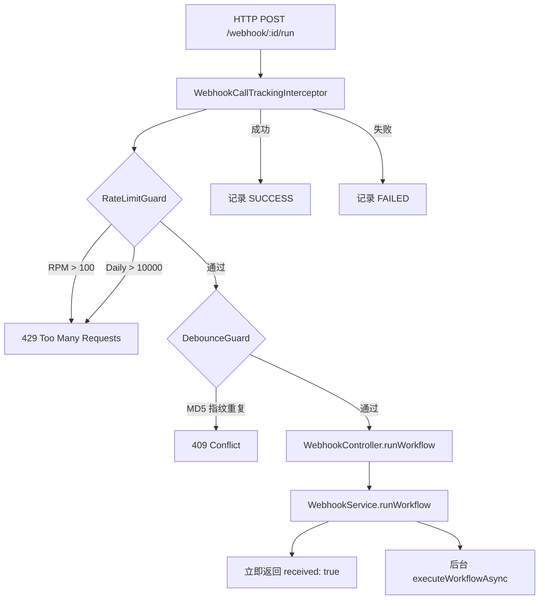
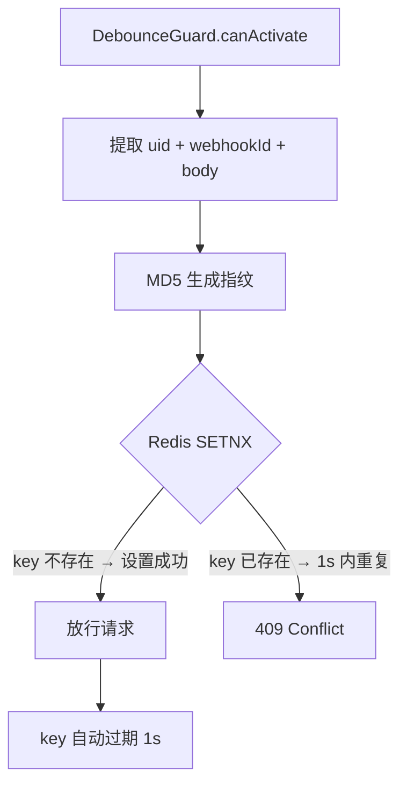
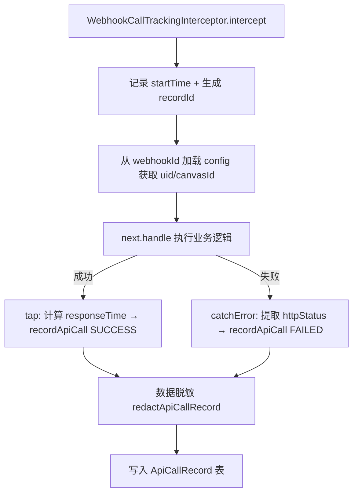

# PD-265.01 Refly — NestJS 三层 Guard + Interceptor Webhook 触发体系

> 文档编号：PD-265.01
> 来源：Refly `apps/api/src/modules/webhook/`
> GitHub：https://github.com/refly-ai/refly.git
> 问题域：PD-265 Webhook 触发 Webhook Trigger
> 状态：可复用方案

---

## 第 1 章 问题与动机

### 1.1 核心问题

Canvas 工作流需要被外部系统（Lark/Slack/自定义 HTTP 客户端）触发执行，但面临三个工程挑战：

1. **安全性**：Webhook URL 一旦泄露，任何人都能触发工作流消耗资源
2. **可靠性**：高频调用可能压垮工作流引擎，重复请求导致重复执行
3. **可观测性**：外部触发的调用缺乏审计记录，出问题难以排查

传统做法是在 Controller 里堆积 if-else 检查，导致业务逻辑与安全逻辑耦合。Refly 利用 NestJS 的 Guard/Interceptor 管道机制，将安全、限流、去重、审计四个关注点分离到独立组件中。

### 1.2 Refly 的解法概述

1. **双 Controller 分离**：`WebhookController`（公开触发端点，无认证）与 `WebhookManagementController`（管理端点，JWT 认证），职责清晰（`webhook.controller.ts:30` / `webhook-management.controller.ts:31`）
2. **三层 Guard 管道**：RateLimitGuard（双维度限流 RPM+Daily）→ DebounceGuard（MD5 指纹去重）→ 业务逻辑，每层独立可拔插（`webhook.controller.ts:44`）
3. **Interceptor 审计**：WebhookCallTrackingInterceptor 通过 RxJS tap/catchError 自动记录每次调用的状态、耗时、错误原因（`webhook-call-tracking.interceptor.ts:17`）
4. **Redis 缓存 + 软删除**：Webhook 配置 5 分钟 TTL 缓存，禁用时软删除保留历史（`webhook.service.ts:696-726`）
5. **Fire-and-Forget 异步执行**：Webhook 触发立即返回 `{ received: true }`，工作流在后台异步执行，失败写入 scheduleRecord（`webhook.service.ts:316-337`）

### 1.3 设计思想

| 设计原则 | 具体实现 | 理由 | 替代方案 |
|----------|----------|------|----------|
| 关注点分离 | Guard 管安全/限流，Interceptor 管审计，Service 管业务 | NestJS 管道天然支持，每层可独立测试 | 全部写在 Controller 中（耦合严重） |
| 双维度限流 | RPM(100/min) + Daily(10000/day) 两个 Redis 计数器 | 防突发流量和持续滥用两种场景 | 单维度限流（无法区分突发和持续） |
| 请求指纹去重 | MD5(uid + webhookId + body) 作为 Redis key，1s TTL | 防止网络重试导致重复执行 | 幂等 key 由调用方传入（增加接入成本） |
| 异步 Fire-and-Forget | runWorkflow 立即返回，executeWorkflowAsync 后台执行 | Webhook 调用方通常不等待结果 | 同步等待（超时风险高） |
| 优雅降级 | Redis 故障时 Guard 放行，不阻塞正常请求 | 限流是保护措施，不应成为单点故障 | Redis 故障时拒绝所有请求（过度保护） |

---

## 第 2 章 源码实现分析

### 2.1 架构概览

Refly 的 Webhook 系统由 10 个文件组成，分为四层：

```
┌─────────────────────────────────────────────────────────────┐
│                    HTTP Request                              │
├─────────────────────────────────────────────────────────────┤
│  WebhookCallTrackingInterceptor (审计层)                     │
│  ┌─────────────────────────────────────────────────────────┐│
│  │  RateLimitGuard → DebounceGuard (安全层)                ││
│  │  ┌─────────────────────────────────────────────────────┐││
│  │  │  WebhookController / WebhookManagementController    │││
│  │  │  ┌─────────────────────────────────────────────────┐│││
│  │  │  │  WebhookService (业务层)                        ││││
│  │  │  │  ┌─────────────────────────────────────────────┐││││
│  │  │  │  │  Prisma + Redis (数据层)                    │││││
│  │  │  │  └─────────────────────────────────────────────┘││││
│  │  │  └─────────────────────────────────────────────────┘│││
│  │  └─────────────────────────────────────────────────────┘││
│  └─────────────────────────────────────────────────────────┘│
└─────────────────────────────────────────────────────────────┘
```

双 Controller 路由设计：

| Controller | 路由前缀 | 认证方式 | 职责 |
|------------|----------|----------|------|
| `WebhookController` | `/v1/openapi/webhook` | 无（webhookId 即密钥） | 触发工作流 |
| `WebhookManagementController` | `/v1/webhook` | JWT (JwtAuthGuard) | 启用/禁用/重置/查询 |

### 2.2 核心实现

#### 2.2.1 三层 Guard 管道



对应源码 `guards/rate-limit.guard.ts:26-116`：

```typescript
@Injectable()
export class RateLimitGuard implements CanActivate {
  async canActivate(context: ExecutionContext): Promise<boolean> {
    const request = context.switchToHttp().getRequest<WebhookRequest>();
    const response: Response = context.switchToHttp().getResponse();
    const uid = request.user?.uid || request.uid;

    // 双维度计数：RPM + Daily
    const rpmKey = `${REDIS_KEY_WEBHOOK_RATE_LIMIT_RPM}:${uid}`;
    const rpmCount = await this.redisService.incrementWithExpire(
      rpmKey, WEBHOOK_RATE_LIMIT_RPM_TTL,
    );
    const dailyKey = `${REDIS_KEY_WEBHOOK_RATE_LIMIT_DAILY}:${uid}`;
    const dailyCount = await this.redisService.incrementWithExpire(
      dailyKey, WEBHOOK_RATE_LIMIT_DAILY_TTL,
    );

    // 设置标准限流响应头
    response.setHeader('X-RateLimit-Limit-RPM', WEBHOOK_RATE_LIMIT_RPM.toString());
    response.setHeader('X-RateLimit-Remaining-RPM',
      Math.max(0, WEBHOOK_RATE_LIMIT_RPM - rpmCount).toString());

    if (rpmCount > WEBHOOK_RATE_LIMIT_RPM) {
      throw new HttpException({ statusCode: 429,
        message: `Rate limit exceeded: ${WEBHOOK_RATE_LIMIT_RPM} requests per minute`,
      }, HttpStatus.TOO_MANY_REQUESTS);
    }
    // ... daily check similar
    return true;
  }
}
```

#### 2.2.2 MD5 指纹去重



对应源码 `guards/debounce.guard.ts:89-92`：

```typescript
private generateFingerprint(uid: string, webhookId: string, body: unknown): string {
  const data = `${uid}:${webhookId}:${JSON.stringify(body ?? {})}`;
  return crypto.createHash('md5').update(data).digest('hex');
}
```

Redis 原子操作 `setIfNotExists`（SETNX + EXPIRE）确保并发安全，TTL 1 秒防止永久锁定。

#### 2.2.3 Interceptor 审计追踪



对应源码 `interceptors/webhook-call-tracking.interceptor.ts:22-91`：

```typescript
async intercept(context: ExecutionContext, next: CallHandler): Promise<Observable<any>> {
  const startTime = Date.now();
  const recordId = `rec_${createId()}`;
  const webhookId = this.extractWebhookId(request);

  // 预加载 webhook 配置获取 uid/canvasId
  if (webhookId) {
    const config = await this.webhookService.getWebhookConfigById(webhookId);
    if (config) { uid = config.uid; canvasId = config.canvasId; }
  }

  return next.handle().pipe(
    tap(() => {
      const responseTime = Date.now() - startTime;
      this.recordApiCall({ recordId, uid, apiId, httpStatus: response.statusCode,
        responseTime, status: ApiCallStatus.SUCCESS });
    }),
    catchError((error) => {
      const responseTime = Date.now() - startTime;
      this.recordApiCall({ recordId, uid, apiId,
        httpStatus: this.extractHttpStatus(error) ?? 500,
        responseTime, status: ApiCallStatus.FAILED, failureReason: error.message });
      return throwError(() => error);
    }),
  );
}
```

### 2.3 实现细节

**数据脱敏策略** (`utils/data-redaction.ts:15-43`)：

两级敏感字段列表：
- Header 级：`authorization`, `x-api-key`, `x-refly-api-key`, `cookie` 等 8 个
- Body 级：`password`, `secret`, `token`, `apiKey`, `privateKey` 等 12 个

脱敏规则：保留前 4 字符 + `...[REDACTED]`，Bearer token 特殊处理为 `Bearer [REDACTED]`。递归处理嵌套对象。JSON 解析失败时整体标记为 `[REDACTED - INVALID JSON]`。

**Webhook ID 生成** (`webhook.service.ts:799-803`)：

```typescript
private generateWebhookId(): string {
  const randomBytes = crypto.randomBytes(WEBHOOK_ID_LENGTH / 2); // 16 bytes
  const randomHex = randomBytes.toString('hex'); // 32 hex chars
  return `${WEBHOOK_ID_PREFIX}${randomHex}`; // wh_xxxxxxxx...
}
```

使用 `crypto.randomBytes` 而非 `Math.random`，确保密码学安全。前缀 `wh_` 便于日志搜索和类型识别。

**软删除与缓存一致性**：

禁用 webhook 时设置 `deletedAt` + `isEnabled: false`，同时清除 Redis 缓存。重新启用时检查已有记录（含软删除），复用同一行更新而非新建，避免唯一约束冲突（`webhook.service.ts:82-110`）。


---

## 第 3 章 迁移指南

### 3.1 迁移清单

**阶段 1：基础 Webhook CRUD（1 个文件）**
- [ ] 创建 `WorkflowWebhook` 数据库表（参考 Prisma schema）
- [ ] 实现 WebhookService：enable/disable/reset/update/getConfig
- [ ] Webhook ID 生成：`crypto.randomBytes` + 前缀

**阶段 2：触发端点 + 限流（3 个文件）**
- [ ] 创建 WebhookController（公开端点，无认证）
- [ ] 实现 RateLimitGuard（Redis INCR + EXPIRE 双维度）
- [ ] 实现 DebounceGuard（MD5 指纹 + SETNX）

**阶段 3：审计 + 脱敏（2 个文件）**
- [ ] 创建 ApiCallRecord 表
- [ ] 实现 WebhookCallTrackingInterceptor
- [ ] 实现 data-redaction 工具函数

**阶段 4：管理端点（1 个文件）**
- [ ] 创建 WebhookManagementController（JWT 认证）
- [ ] 对接前端 Webhook 配置 UI

### 3.2 适配代码模板

以下是一个可直接复用的 NestJS Guard 限流模板：

```typescript
// rate-limit.guard.ts — 可直接复用
import { Injectable, CanActivate, ExecutionContext, HttpException, HttpStatus } from '@nestjs/common';
import { Redis } from 'ioredis';

@Injectable()
export class WebhookRateLimitGuard implements CanActivate {
  constructor(private readonly redis: Redis) {}

  async canActivate(context: ExecutionContext): Promise<boolean> {
    const request = context.switchToHttp().getRequest();
    const response = context.switchToHttp().getResponse();
    const uid = request.user?.uid ?? request.uid;
    if (!uid) return true;

    const RPM_LIMIT = 100;
    const DAILY_LIMIT = 10000;

    // RPM check
    const rpmKey = `webhook:rpm:${uid}`;
    const rpmCount = await this.redis.incr(rpmKey);
    if (rpmCount === 1) await this.redis.expire(rpmKey, 60);

    // Daily check
    const dailyKey = `webhook:daily:${uid}`;
    const dailyCount = await this.redis.incr(dailyKey);
    if (dailyCount === 1) await this.redis.expire(dailyKey, 86400);

    // Set standard rate limit headers
    response.setHeader('X-RateLimit-Limit-RPM', RPM_LIMIT);
    response.setHeader('X-RateLimit-Remaining-RPM', Math.max(0, RPM_LIMIT - rpmCount));

    if (rpmCount > RPM_LIMIT || dailyCount > DAILY_LIMIT) {
      throw new HttpException('Rate limit exceeded', HttpStatus.TOO_MANY_REQUESTS);
    }
    return true;
  }
}
```

去重 Guard 模板：

```typescript
// debounce.guard.ts — 可直接复用
import { Injectable, CanActivate, ExecutionContext, HttpException, HttpStatus } from '@nestjs/common';
import { Redis } from 'ioredis';
import * as crypto from 'node:crypto';

@Injectable()
export class WebhookDebounceGuard implements CanActivate {
  constructor(private readonly redis: Redis) {}

  async canActivate(context: ExecutionContext): Promise<boolean> {
    const request = context.switchToHttp().getRequest();
    const uid = request.user?.uid ?? request.uid;
    const webhookId = request.params?.webhookId;
    if (!uid || !webhookId) return true;

    const fingerprint = crypto.createHash('md5')
      .update(`${uid}:${webhookId}:${JSON.stringify(request.body ?? {})}`)
      .digest('hex');

    const key = `webhook:debounce:${fingerprint}`;
    const wasSet = await this.redis.set(key, '1', 'EX', 1, 'NX');

    if (!wasSet) {
      throw new HttpException('Duplicate request', HttpStatus.CONFLICT);
    }
    return true;
  }
}
```

### 3.3 适用场景

| 场景 | 适用度 | 说明 |
|------|--------|------|
| Canvas/工作流外部触发 | ⭐⭐⭐ | 完美匹配，Refly 的原始场景 |
| CI/CD Pipeline 回调 | ⭐⭐⭐ | Fire-and-Forget 模式天然适合 |
| 第三方平台集成（Slack/Lark） | ⭐⭐⭐ | 双 Controller 设计支持不同认证方式 |
| 需要同步返回结果的场景 | ⭐ | 需改造为轮询或 SSE 推送 |
| 高吞吐量事件流（>1000 QPS） | ⭐⭐ | 需要将 Redis 限流改为令牌桶或滑动窗口 |

---

## 第 4 章 测试用例

```typescript
import { Test, TestingModule } from '@nestjs/testing';
import { ExecutionContext, HttpException, HttpStatus } from '@nestjs/common';
import * as crypto from 'node:crypto';

// ---- RateLimitGuard Tests ----
describe('RateLimitGuard', () => {
  let guard: any;
  let mockRedis: { incrementWithExpire: jest.Mock };

  beforeEach(() => {
    mockRedis = { incrementWithExpire: jest.fn() };
    guard = new (require('./guards/rate-limit.guard').RateLimitGuard)(mockRedis);
  });

  const createMockContext = (uid: string) => ({
    switchToHttp: () => ({
      getRequest: () => ({ user: { uid } }),
      getResponse: () => ({ setHeader: jest.fn() }),
    }),
  } as unknown as ExecutionContext);

  test('should pass when under RPM and daily limits', async () => {
    mockRedis.incrementWithExpire.mockResolvedValueOnce(50).mockResolvedValueOnce(500);
    const result = await guard.canActivate(createMockContext('user-1'));
    expect(result).toBe(true);
  });

  test('should throw 429 when RPM limit exceeded', async () => {
    mockRedis.incrementWithExpire.mockResolvedValueOnce(101).mockResolvedValueOnce(500);
    await expect(guard.canActivate(createMockContext('user-1')))
      .rejects.toThrow(HttpException);
  });

  test('should allow request when Redis fails (graceful degradation)', async () => {
    mockRedis.incrementWithExpire.mockRejectedValue(new Error('Redis down'));
    const result = await guard.canActivate(createMockContext('user-1'));
    expect(result).toBe(true);
  });
});

// ---- DebounceGuard Tests ----
describe('DebounceGuard', () => {
  let guard: any;
  let mockRedis: { setIfNotExists: jest.Mock };

  beforeEach(() => {
    mockRedis = { setIfNotExists: jest.fn() };
    guard = new (require('./guards/debounce.guard').DebounceGuard)(mockRedis);
  });

  const createMockContext = (uid: string, webhookId: string, body: any) => ({
    switchToHttp: () => ({
      getRequest: () => ({ user: { uid }, params: { webhookId }, body }),
    }),
  } as unknown as ExecutionContext);

  test('should pass for first request', async () => {
    mockRedis.setIfNotExists.mockResolvedValue(true);
    const result = await guard.canActivate(createMockContext('u1', 'wh_abc', { x: 1 }));
    expect(result).toBe(true);
  });

  test('should reject duplicate request within 1s window', async () => {
    mockRedis.setIfNotExists.mockResolvedValue(false);
    await expect(guard.canActivate(createMockContext('u1', 'wh_abc', { x: 1 })))
      .rejects.toThrow(HttpException);
  });

  test('should generate different fingerprints for different bodies', () => {
    const fp1 = crypto.createHash('md5').update('u1:wh_abc:{"x":1}').digest('hex');
    const fp2 = crypto.createHash('md5').update('u1:wh_abc:{"x":2}').digest('hex');
    expect(fp1).not.toBe(fp2);
  });
});

// ---- Data Redaction Tests ----
describe('redactApiCallRecord', () => {
  const { redactApiCallRecord } = require('../../utils/data-redaction');

  test('should redact Authorization header', () => {
    const result = redactApiCallRecord({
      requestHeaders: JSON.stringify({ authorization: 'Bearer sk-abc123' }),
      requestBody: null, responseBody: null,
    });
    expect(JSON.parse(result.requestHeaders!).authorization).toBe('Bearer [REDACTED]');
  });

  test('should recursively redact nested body fields', () => {
    const result = redactApiCallRecord({
      requestHeaders: null, responseBody: null,
      requestBody: JSON.stringify({ config: { apiKey: 'sk-secret-key' } }),
    });
    const body = JSON.parse(result.requestBody!);
    expect(body.config.apiKey).toContain('[REDACTED]');
  });

  test('should handle invalid JSON gracefully', () => {
    const result = redactApiCallRecord({
      requestHeaders: 'not-json', requestBody: null, responseBody: null,
    });
    expect(result.requestHeaders).toBe('[REDACTED - INVALID JSON]');
  });
});
```


---

## 第 5 章 跨域关联

| 关联域 | 关系类型 | 说明 |
|--------|----------|------|
| PD-03 容错与重试 | 协同 | RateLimitGuard 和 DebounceGuard 在 Redis 故障时优雅降级（放行而非拒绝），体现容错设计 |
| PD-06 记忆持久化 | 协同 | ApiCallRecord 表持久化每次调用记录，WebhookConfig 通过 Redis 缓存加速读取 |
| PD-07 质量检查 | 协同 | WebhookCallTrackingInterceptor 自动记录成功/失败状态，为质量监控提供数据源 |
| PD-10 中间件管道 | 依赖 | 整个方案建立在 NestJS Guard → Interceptor → Controller 管道之上，是中间件管道模式的典型应用 |
| PD-11 可观测性 | 协同 | 结构化日志 `[WEBHOOK_TRIGGER]`/`[WEBHOOK_EXECUTED]` + ApiCallRecord 表提供完整审计链 |

---

## 第 6 章 来源文件索引

| 文件 | 行范围 | 关键实现 |
|------|--------|----------|
| `apps/api/src/modules/webhook/webhook.service.ts` | L46-812 | WebhookService 核心：CRUD + 缓存 + 异步执行 |
| `apps/api/src/modules/webhook/webhook.controller.ts` | L30-89 | 公开触发端点，Guard 管道装配 |
| `apps/api/src/modules/webhook/webhook-management.controller.ts` | L31-152 | JWT 认证管理端点 |
| `apps/api/src/modules/webhook/guards/rate-limit.guard.ts` | L26-116 | 双维度 Redis 限流 + 标准响应头 |
| `apps/api/src/modules/webhook/guards/debounce.guard.ts` | L19-93 | MD5 指纹去重 + SETNX 原子操作 |
| `apps/api/src/modules/webhook/guards/webhook-auth.guard.ts` | L11-65 | API Key 认证（Bearer + X-Refly-Api-Key 双头） |
| `apps/api/src/modules/webhook/interceptors/webhook-call-tracking.interceptor.ts` | L17-137 | RxJS tap/catchError 审计拦截器 |
| `apps/api/src/modules/webhook/webhook.constants.ts` | L1-33 | 限流阈值、缓存 TTL、Redis key 前缀 |
| `apps/api/src/utils/data-redaction.ts` | L1-207 | 两级敏感字段脱敏（Header + Body 递归） |
| `apps/api/src/modules/webhook/webhook.module.ts` | L20-38 | NestJS 模块注册：双 Controller + 4 Provider |
| `apps/api/src/modules/webhook/dto/webhook.dto.ts` | L1-43 | 5 个 DTO 接口定义 |
| `apps/api/prisma/schema.prisma` | L2757-2835 | WorkflowWebhook + ApiCallRecord 数据模型 |

---

## 第 7 章 横向对比维度

```json comparison_data
{
  "project": "Refly",
  "dimensions": {
    "触发模式": "Fire-and-Forget 异步触发，立即返回 received 确认",
    "认证方式": "双通道：webhookId 即密钥（公开端点）+ API Key Bearer（管理端点）",
    "限流策略": "Redis 双维度计数器 RPM(100/min) + Daily(10000/day)，含标准响应头",
    "去重机制": "MD5(uid+webhookId+body) 指纹 + Redis SETNX 1s TTL",
    "审计追踪": "NestJS Interceptor + RxJS tap/catchError 自动记录，数据脱敏后持久化",
    "缓存策略": "Redis 5min TTL 缓存 webhook 配置，变更时主动清除",
    "优雅降级": "Redis 故障时 Guard 放行，不阻塞正常请求"
  }
}
```

### 域元数据补充

```json domain_metadata
{
  "solution_summary": "Refly 用 NestJS 三层 Guard（RateLimitGuard + DebounceGuard + AuthGuard）+ Interceptor 审计拦截器构建 Webhook 触发体系，Redis 双维度限流与 MD5 指纹去重，Fire-and-Forget 异步执行工作流",
  "description": "Webhook 系统的安全防护层设计与异步触发模式",
  "sub_problems": [
    "双维度限流（RPM + Daily）与标准响应头",
    "请求指纹去重与幂等保护",
    "Redis 故障时的优雅降级策略"
  ],
  "best_practices": [
    "Guard 管道分离安全关注点，每层可独立测试和替换",
    "Interceptor 层自动审计，业务代码零侵入",
    "敏感数据脱敏后再持久化，保留前4字符便于调试"
  ]
}
```

