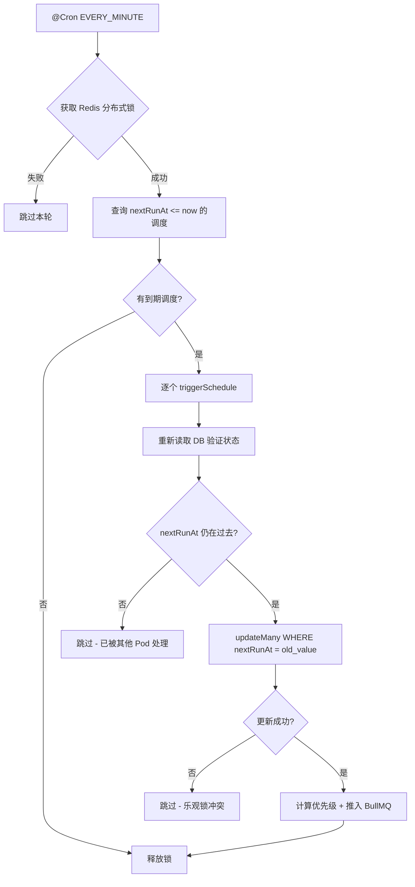
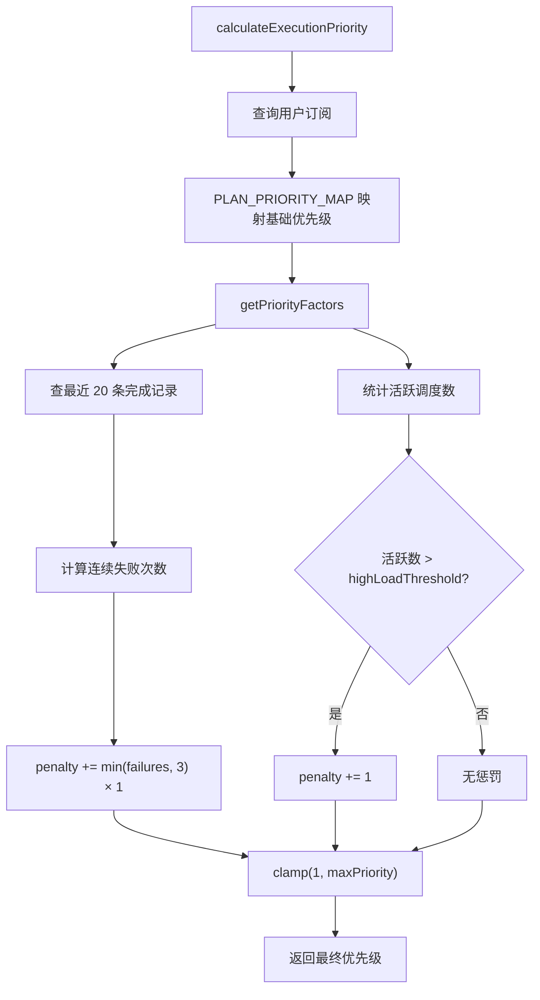
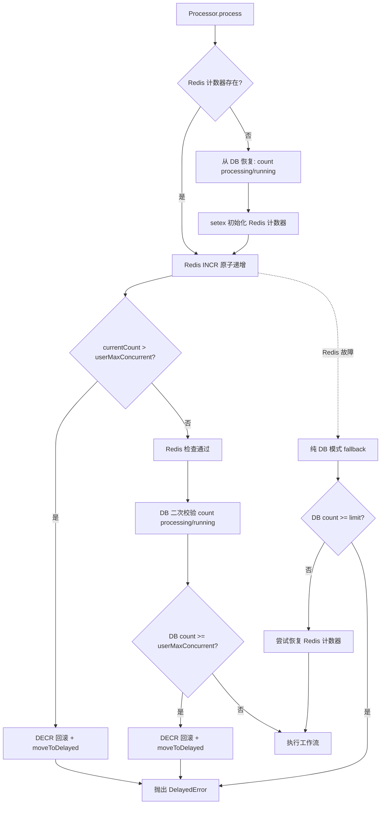

# PD-266.01 Refly — BullMQ 优先级 Cron 调度与多层并发控制

> 文档编号：PD-266.01
> 来源：Refly `apps/api/src/modules/schedule/`
> GitHub：https://github.com/refly-ai/refly.git
> 问题域：PD-266 定时调度 Scheduled Execution
> 状态：可复用方案

---

## 第 1 章 问题与动机

### 1.1 核心问题

SaaS 产品中的定时工作流调度面临多重挑战：

1. **多租户公平性**：免费用户和付费用户共享执行资源，如何保证付费用户优先执行？
2. **并发控制**：单用户可能创建大量定时任务，如何防止一个用户耗尽全局资源？
3. **容错与重试**：工作流执行失败后，如何支持基于快照的精确重试？
4. **配额管理**：不同订阅等级允许不同数量的活跃调度，如何动态执行配额限制？
5. **分布式竞争**：多 Pod 部署下，如何防止同一调度被重复触发？

### 1.2 Refly 的解法概述

Refly 构建了一套完整的 NestJS + BullMQ + Redis + Prisma 调度系统，核心设计：

1. **Cron 扫描 + BullMQ 队列分离**：`ScheduleCronService` 每分钟扫描到期调度，推入 BullMQ 优先级队列，`ScheduleProcessor` 异步消费（`schedule-cron.service.ts:69-87`）
2. **5 级订阅优先级映射**：Max(1) > Plus(3) > Starter(5) > Maker(7) > Free(10)，直接映射 BullMQ priority 字段（`schedule.constants.ts:117-141`）
3. **Redis + DB 双层并发控制**：Redis INCR 原子计数做快速路径，DB count 做二次校验，Redis 故障时自动降级到纯 DB 模式（`schedule.processor.ts:98-208`）
4. **乐观锁防重复触发**：`updateMany` 带 `nextRunAt` 条件更新，多 Pod 竞争时只有一个成功（`schedule-cron.service.ts:333-349`）
5. **6 态执行记录生命周期**：scheduled → pending → processing → running → success/failed，前端可实时追踪每个阶段（`schedule.dto.ts:33`）

### 1.3 设计思想

| 设计原则 | 具体实现 | 理由 | 替代方案 |
|----------|----------|------|----------|
| 扫描与执行分离 | CronService 扫描 + Processor 执行 | 扫描轻量快速，执行可并发可限流 | 扫描时直接执行（阻塞扫描循环） |
| 优先级队列 | BullMQ priority 字段 1-10 | 付费用户任务优先出队，无需多队列 | 多队列按等级分流（运维复杂） |
| 双层并发控制 | Redis 快路径 + DB 慢路径 | Redis 原子操作高性能，DB 兜底保一致性 | 纯 DB 计数（高并发下慢） |
| 乐观锁防重复 | updateMany + where nextRunAt | 无需分布式锁，利用 DB 原子更新 | Redis 分布式锁（额外依赖） |
| 快照重试 | OSS 存储 canvas 快照 | 失败后可精确重放，不受源数据变更影响 | 重新读取最新数据（可能已变更） |
| 错误分类 | classifyScheduleError 正则匹配 | 前端可按错误类型显示不同操作按钮 | 统一错误码（不够灵活） |

---

## 第 2 章 源码实现分析

### 2.1 架构概览

Refly 的调度系统由 6 个核心组件构成，通过 NestJS 模块化组织：

```
┌─────────────────────────────────────────────────────────────────┐
│                     ScheduleModule                               │
│                                                                  │
│  ┌──────────────┐    ┌──────────────────┐    ┌───────────────┐  │
│  │  Controller   │───→│  ScheduleService  │───→│  PrismaService │  │
│  │  (REST API)   │    │  (CRUD + 配额)    │    │  (PostgreSQL)  │  │
│  └──────────────┘    └──────────────────┘    └───────────────┘  │
│                              │                                   │
│                              ▼                                   │
│  ┌──────────────┐    ┌──────────────────┐    ┌───────────────┐  │
│  │  CronService  │───→│  BullMQ Queue     │───→│  Processor     │  │
│  │  (@Cron 1min) │    │  (优先级队列)     │    │  (WorkerHost)  │  │
│  └──────────────┘    └──────────────────┘    └───────────────┘  │
│         │                                           │            │
│         ▼                                           ▼            │
│  ┌──────────────┐    ┌──────────────────┐    ┌───────────────┐  │
│  │  Redis Lock   │    │  PriorityService  │    │  EventListener │  │
│  │  (防重入)     │    │  (优先级计算)     │    │  (完成回调)    │  │
│  └──────────────┘    └──────────────────┘    └───────────────┘  │
│                                                      │            │
│                                              ┌───────────────┐  │
│                                              │  Metrics       │  │
│                                              │  (OTel 指标)   │  │
│                                              └───────────────┘  │
└─────────────────────────────────────────────────────────────────┘
```

### 2.2 核心实现

#### 2.2.1 Cron 扫描与乐观锁触发



对应源码 `schedule-cron.service.ts:69-87` 和 `schedule-cron.service.ts:329-349`：

```typescript
// schedule-cron.service.ts:69-87 — 每分钟扫描入口
@Cron(CronExpression.EVERY_MINUTE)
async scanAndTriggerSchedules() {
  const lockKey = 'lock:schedule:scan';
  const releaseLock = await this.redisService.acquireLock(lockKey, 120);
  if (!releaseLock) {
    this.logger.debug('Schedule scan lock not acquired, skipping');
    return;
  }
  try {
    await this.processDueSchedules();
  } catch (error) {
    this.logger.error('Error processing due schedules', error);
  } finally {
    await releaseLock();
  }
}

// schedule-cron.service.ts:329-349 — 乐观锁更新 nextRunAt
const updateResult = await this.prisma.workflowSchedule.updateMany({
  where: {
    scheduleId: schedule.scheduleId,
    nextRunAt: freshSchedule.nextRunAt, // 乐观锁版本检查
  },
  data: {
    lastRunAt: new Date(),
    nextRunAt,
  },
});
if (updateResult.count === 0) {
  this.logger.debug(
    `Schedule ${schedule.scheduleId} was updated by another process. Skipping.`,
  );
  return;
}
```

#### 2.2.2 订阅等级优先级映射与动态调整



对应源码 `schedule-priority.service.ts:33-62` 和 `schedule.constants.ts:117-149`：

```typescript
// schedule.constants.ts:117-141 — 5 级订阅优先级映射
export const PLAN_PRIORITY_MAP: Record<string, number> = {
  refly_max_yearly_stable_v3: 1,        // Max 最高优先级
  refly_plus_yearly_stable_v2: 3,       // Plus 高优先级
  refly_starter_monthly: 5,             // Starter 中优先级
  refly_maker_monthly: 7,               // Maker 低中优先级
  free: 10,                             // Free 最低优先级
} as const;

// schedule-priority.service.ts:33-62 — 动态优先级计算
async calculateExecutionPriority(uid: string): Promise<number> {
  const subscription = await this.prisma.subscription.findFirst({
    where: { uid, status: 'active',
      OR: [{ cancelAt: null }, { cancelAt: { gt: new Date() } }],
    },
    orderBy: { createdAt: 'desc' },
  });
  const planType = subscription?.lookupKey ?? 'free';
  const basePriority = PLAN_PRIORITY_MAP[planType] ?? this.scheduleConfig.defaultPriority;
  const factors = await this.getPriorityFactors(uid);
  const adjustedPriority = this.applyPriorityAdjustments(basePriority, factors);
  return Math.max(1, Math.min(this.scheduleConfig.maxPriority, adjustedPriority));
}
```

#### 2.2.3 Redis + DB 双层并发控制



对应源码 `schedule.processor.ts:98-208`：

```typescript
// schedule.processor.ts:98-144 — Redis 快路径并发控制
const redisKey = `${SCHEDULE_REDIS_KEYS.USER_CONCURRENT_PREFIX}${uid}`;
try {
  const counterExists = await this.redisService.existsBoolean(redisKey);
  if (!counterExists) {
    // Redis 重启后从 DB 恢复计数器
    const actualRunningCount = await this.prisma.workflowScheduleRecord.count({
      where: { uid, status: { in: ['processing', 'running'] } },
    });
    await this.redisService.setex(redisKey, this.scheduleConfig.userConcurrentTtl,
      String(actualRunningCount));
  }
  const currentCount = await this.redisService.incr(redisKey);
  await this.redisService.expire(redisKey, this.scheduleConfig.userConcurrentTtl);
  if (currentCount > this.scheduleConfig.userMaxConcurrent) {
    await this.redisService.decr(redisKey); // 回滚
    await job.moveToDelayed(Date.now() + this.scheduleConfig.userRateLimitDelayMs, job.token);
    throw new DelayedError();
  }
  redisCounterActive = true;
} catch (redisError) {
  if (redisError instanceof DelayedError) throw redisError;
  // Redis 故障 → DB fallback
  const runningCount = await this.prisma.workflowScheduleRecord.count({
    where: { uid, status: { in: ['processing', 'running'] } },
  });
  if (runningCount >= this.scheduleConfig.userMaxConcurrent) {
    await job.moveToDelayed(Date.now() + this.scheduleConfig.userRateLimitDelayMs, job.token);
    throw new DelayedError();
  }
}
```

### 2.3 实现细节

**6 态执行记录生命周期**（`schedule.dto.ts:33`）：

```
scheduled → pending → processing → running → success
                                           → failed
```

- `scheduled`：CronService 创建的未来执行占位记录
- `pending`：已推入 BullMQ 队列，等待 Worker 消费
- `processing`：Worker 已取出，正在创建快照、检查信用
- `running`：工作流实际执行中
- `success/failed`：由 `ScheduleEventListener` 监听 `workflow.completed/failed` 事件更新

**错误分类系统**（`schedule.constants.ts:205-271`）：`classifyScheduleError` 通过正则匹配将错误归类为 11 种标准化失败原因，前端据此显示不同操作按钮（Upgrade / View Schedule / Debug）。

**配额管理**（`schedule.constants.ts:101-111`）：`getScheduleQuota` 根据订阅等级返回最大活跃调度数（Free: 1, Paid: 20），`ScheduleCronService` 在触发时检查并自动禁用超额调度。

**OpenTelemetry 指标**（`schedule.metrics.ts:39-47`）：`ScheduleMetrics` 通过 OTel Counter 记录 `schedule.execution.count{status, trigger_type}` 和 `schedule.queue.delayed.count`，自动导出到 Prometheus。

---

## 第 3 章 迁移指南

### 3.1 迁移清单

**阶段 1：基础调度（1-2 天）**
- [ ] 安装依赖：`@nestjs/bullmq bullmq @nestjs/schedule cron-parser`
- [ ] 创建 Prisma 模型：`WorkflowSchedule`（cron 表达式、时区、启用状态、nextRunAt）和 `WorkflowScheduleRecord`（6 态状态、快照 key、优先级）
- [ ] 实现 `ScheduleService`：CRUD + cron 表达式校验 + 配额检查
- [ ] 实现 `ScheduleCronService`：`@Cron(EVERY_MINUTE)` 扫描 + Redis 分布式锁

**阶段 2：优先级队列（0.5 天）**
- [ ] 定义 `PLAN_PRIORITY_MAP` 订阅等级 → 优先级映射
- [ ] 实现 `SchedulePriorityService`：基础优先级 + 失败惩罚 + 高负载惩罚
- [ ] BullMQ Queue 注册时配置 `defaultJobOptions`

**阶段 3：并发控制（1 天）**
- [ ] 实现 Redis INCR/DECR 原子并发计数
- [ ] 实现 DB fallback 模式（Redis 故障时）
- [ ] 实现 `DelayedError` 延迟重入机制
- [ ] 实现 `ScheduleEventListener` 监听工作流完成事件，回收并发槽位

**阶段 4：可观测性（0.5 天）**
- [ ] 实现 `ScheduleMetrics`：OTel Counter 记录执行成功/失败/延迟
- [ ] 实现 `classifyScheduleError` 错误分类
- [ ] 实现邮件通知（成功/失败/配额超限）

### 3.2 适配代码模板

以下是一个可直接运行的最小化调度系统骨架（NestJS + BullMQ）：

```typescript
// schedule.constants.ts — 配置与优先级映射
export const QUEUE_SCHEDULE = 'scheduleExecution';

export interface ScheduleConfig {
  globalMaxConcurrent: number;
  userMaxConcurrent: number;
  userRateLimitDelayMs: number;
  freeMaxSchedules: number;
  paidMaxSchedules: number;
}

export const DEFAULT_CONFIG: ScheduleConfig = {
  globalMaxConcurrent: 50,
  userMaxConcurrent: 20,
  userRateLimitDelayMs: 10_000,
  freeMaxSchedules: 1,
  paidMaxSchedules: 20,
};

// 优先级映射：数字越小优先级越高（BullMQ 约定）
export const PLAN_PRIORITY: Record<string, number> = {
  enterprise: 1,
  pro: 3,
  starter: 5,
  free: 10,
};

// schedule-cron.service.ts — 扫描触发器
import { Cron, CronExpression } from '@nestjs/schedule';
import { CronExpressionParser } from 'cron-parser';

@Injectable()
export class ScheduleCronService {
  @Cron(CronExpression.EVERY_MINUTE)
  async scan() {
    const lock = await this.redis.acquireLock('lock:schedule:scan', 120);
    if (!lock) return;
    try {
      const due = await this.prisma.schedule.findMany({
        where: { isEnabled: true, deletedAt: null, nextRunAt: { lte: new Date() } },
      });
      for (const s of due) await this.trigger(s);
    } finally {
      await lock();
    }
  }

  private async trigger(schedule: Schedule) {
    // 乐观锁：只有一个 Pod 能成功更新
    const next = CronExpressionParser.parse(schedule.cron, { tz: schedule.timezone }).next().toDate();
    const result = await this.prisma.schedule.updateMany({
      where: { id: schedule.id, nextRunAt: schedule.nextRunAt },
      data: { lastRunAt: new Date(), nextRunAt: next },
    });
    if (result.count === 0) return; // 被其他 Pod 抢先

    const priority = await this.priorityService.calculate(schedule.uid);
    await this.queue.add('execute', { scheduleId: schedule.id, uid: schedule.uid }, {
      jobId: `schedule:${schedule.id}:${Date.now()}`,
      priority,
    });
  }
}

// schedule.processor.ts — 并发控制 Worker
@Processor(QUEUE_SCHEDULE, { concurrency: 50 })
export class ScheduleProcessor extends WorkerHost {
  async process(job: Job) {
    const { uid } = job.data;
    const redisKey = `schedule:concurrent:${uid}`;

    // Redis 原子并发控制
    const count = await this.redis.incr(redisKey);
    await this.redis.expire(redisKey, 7200);
    if (count > this.config.userMaxConcurrent) {
      await this.redis.decr(redisKey);
      await job.moveToDelayed(Date.now() + this.config.userRateLimitDelayMs, job.token);
      throw new DelayedError();
    }

    try {
      // 执行工作流...
      await this.executeWorkflow(job.data);
    } catch (error) {
      await this.redis.decr(redisKey); // 失败回滚
      throw error;
    }
    // 成功后由 EventListener 回收计数
  }
}
```

### 3.3 适用场景

| 场景 | 适用度 | 说明 |
|------|--------|------|
| SaaS 多租户定时任务 | ⭐⭐⭐ | 完美匹配：优先级队列 + 配额管理 + 并发控制 |
| 单租户内部调度 | ⭐⭐ | 优先级和配额管理可简化，核心 Cron + BullMQ 模式仍适用 |
| 高频调度（秒级） | ⭐ | 每分钟扫描有延迟，需改为 BullMQ repeatable jobs |
| 无 Redis 环境 | ⭐ | 强依赖 Redis（BullMQ 底层 + 并发控制），需替换为其他队列 |

---

## 第 4 章 测试用例

```typescript
import { Test, TestingModule } from '@nestjs/testing';
import { SchedulePriorityService } from './schedule-priority.service';
import { ScheduleService } from './schedule.service';
import { PLAN_PRIORITY_MAP, PRIORITY_ADJUSTMENTS, getScheduleQuota,
  classifyScheduleError, ScheduleFailureReason } from './schedule.constants';

describe('SchedulePriorityService', () => {
  let service: SchedulePriorityService;
  let prisma: any;

  beforeEach(async () => {
    prisma = {
      subscription: { findFirst: jest.fn() },
      workflowScheduleRecord: { findMany: jest.fn(), count: jest.fn() },
    };
    // ... module setup
  });

  it('should return base priority for Max plan user with no penalties', async () => {
    prisma.subscription.findFirst.mockResolvedValue({ lookupKey: 'refly_max_yearly_stable_v3' });
    prisma.workflowScheduleRecord.findMany.mockResolvedValue([{ status: 'success' }]);
    prisma.workflowScheduleRecord.count.mockResolvedValue(2);

    const priority = await service.calculateExecutionPriority('user-1');
    expect(priority).toBe(1); // Max plan base priority
  });

  it('should apply failure penalty capped at MAX_FAILURE_LEVELS', async () => {
    prisma.subscription.findFirst.mockResolvedValue({ lookupKey: 'free' });
    // 5 consecutive failures, but capped at 3
    prisma.workflowScheduleRecord.findMany.mockResolvedValue(
      Array(5).fill({ status: 'failed' }),
    );
    prisma.workflowScheduleRecord.count.mockResolvedValue(1);

    const priority = await service.calculateExecutionPriority('user-2');
    // base(10) + min(5,3)*1 = 13, clamped to maxPriority(10)
    expect(priority).toBe(10);
  });

  it('should apply high load penalty when active schedules exceed threshold', async () => {
    prisma.subscription.findFirst.mockResolvedValue({ lookupKey: 'refly_plus_monthly_stable_v2' });
    prisma.workflowScheduleRecord.findMany.mockResolvedValue([{ status: 'success' }]);
    prisma.workflowScheduleRecord.count.mockResolvedValue(10); // > highLoadThreshold(5)

    const priority = await service.calculateExecutionPriority('user-3');
    expect(priority).toBe(3 + PRIORITY_ADJUSTMENTS.HIGH_LOAD_PENALTY); // 4
  });
});

describe('getScheduleQuota', () => {
  it('should return 1 for free plan', () => {
    expect(getScheduleQuota('free')).toBe(1);
    expect(getScheduleQuota(null)).toBe(1);
    expect(getScheduleQuota(undefined)).toBe(1);
  });

  it('should return 20 for any paid plan', () => {
    expect(getScheduleQuota('refly_plus_monthly_stable_v2')).toBe(20);
    expect(getScheduleQuota('refly_max_yearly_stable_v3')).toBe(20);
  });
});

describe('classifyScheduleError', () => {
  it('should classify credit errors', () => {
    const err = new Error('credit not available');
    expect(classifyScheduleError(err)).toBe(ScheduleFailureReason.INSUFFICIENT_CREDITS);
  });

  it('should classify timeout errors', () => {
    expect(classifyScheduleError(new Error('Request timeout'))).toBe(
      ScheduleFailureReason.WORKFLOW_EXECUTION_TIMEOUT,
    );
  });

  it('should return UNKNOWN_ERROR for unrecognized errors', () => {
    expect(classifyScheduleError(new Error('something weird'))).toBe(
      ScheduleFailureReason.UNKNOWN_ERROR,
    );
  });

  it('should handle null/undefined gracefully', () => {
    expect(classifyScheduleError(null)).toBe(ScheduleFailureReason.UNKNOWN_ERROR);
    expect(classifyScheduleError(undefined)).toBe(ScheduleFailureReason.UNKNOWN_ERROR);
  });
});
```

---

## 第 5 章 跨域关联

| 关联域 | 关系类型 | 说明 |
|--------|----------|------|
| PD-03 容错与重试 | 协同 | Processor 的 Redis+DB 双层并发控制、DelayedError 延迟重入、快照重试机制都是容错设计 |
| PD-11 可观测性 | 协同 | ScheduleMetrics 通过 OTel Counter 导出执行指标，classifyScheduleError 提供结构化错误分类 |
| PD-02 多 Agent 编排 | 依赖 | 调度系统触发的是 Canvas 工作流执行，底层依赖 WorkflowAppService 的编排能力 |
| PD-06 记忆持久化 | 协同 | 执行快照存储到 OSS，支持失败后精确重放，是一种执行状态的持久化 |
| PD-09 Human-in-the-Loop | 协同 | 支持手动触发（triggerScheduleManually）和手动重试（retryScheduleRecord），是人机交互的调度入口 |

---

## 第 6 章 来源文件索引

| 文件 | 行范围 | 关键实现 |
|------|--------|----------|
| `apps/api/src/modules/schedule/schedule.service.ts` | L1-L850 | 调度 CRUD、配额检查、手动触发、重试、BullMQ 入队 |
| `apps/api/src/modules/schedule/schedule-cron.service.ts` | L1-L488 | @Cron 每分钟扫描、Redis 分布式锁、乐观锁触发、配额超限自动禁用 |
| `apps/api/src/modules/schedule/schedule.processor.ts` | L1-L661 | BullMQ WorkerHost、Redis+DB 双层并发控制、快照创建/加载、工作流执行 |
| `apps/api/src/modules/schedule/schedule-priority.service.ts` | L1-L116 | 订阅等级优先级映射、失败惩罚、高负载惩罚、优先级计算 |
| `apps/api/src/modules/schedule/schedule.constants.ts` | L1-L292 | 队列名、配置接口、默认值、优先级映射表、错误分类、分析事件 |
| `apps/api/src/modules/schedule/schedule.listener.ts` | L1-L364 | 工作流完成/失败事件监听、Redis 计数器回收、信用计算、邮件通知、Canvas 删除级联 |
| `apps/api/src/modules/schedule/schedule.metrics.ts` | L1-L87 | OTel Counter 指标：执行计数、队列延迟计数 |
| `apps/api/src/modules/schedule/schedule.dto.ts` | L1-L51 | DTO 定义：6 态状态枚举、3 种触发类型 |
| `apps/api/src/modules/schedule/schedule.module.ts` | L1-L55 | NestJS 模块注册：BullMQ 队列、NestSchedule、依赖注入 |

---

## 第 7 章 横向对比维度

```json comparison_data
{
  "project": "Refly",
  "dimensions": {
    "调度触发": "@Cron 每分钟扫描 + Redis 分布式锁 + 乐观锁防重复",
    "队列架构": "BullMQ 单队列 + priority 字段 1-10 级优先级",
    "并发控制": "Redis INCR 原子计数 + DB count 二次校验 + DelayedError 延迟重入",
    "配额管理": "订阅等级配额（Free:1/Paid:20）+ 超额自动禁用 + 邮件通知",
    "执行状态": "6 态生命周期 scheduled→pending→processing→running→success/failed",
    "容错机制": "OSS 快照重试 + Redis 故障 DB fallback + 错误分类 11 种",
    "可观测性": "OTel Counter 指标 + 结构化错误分类 + 邮件通知"
  }
}
```

### 域元数据补充

```json domain_metadata
{
  "solution_summary": "Refly 用 NestJS @Cron 扫描 + BullMQ 优先级队列 + Redis/DB 双层并发控制实现多租户定时调度，含 5 级订阅优先级映射与 6 态执行记录追踪",
  "description": "多租户 SaaS 场景下的优先级调度与并发资源隔离",
  "sub_problems": [
    "多 Pod 分布式防重复触发",
    "Redis 故障时的并发控制降级",
    "执行快照存储与精确重试",
    "超额调度自动禁用与用户通知"
  ],
  "best_practices": [
    "乐观锁 updateMany+WHERE 防多 Pod 重复触发",
    "Redis INCR 快路径 + DB count 慢路径双层并发控制",
    "6 态执行记录让前端可追踪每个调度阶段"
  ]
}
```
