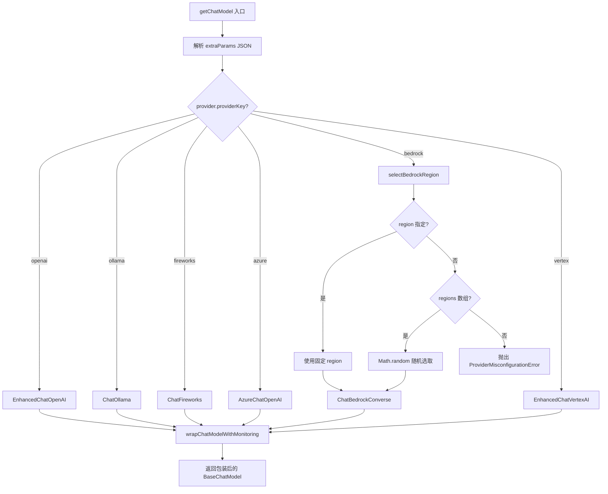
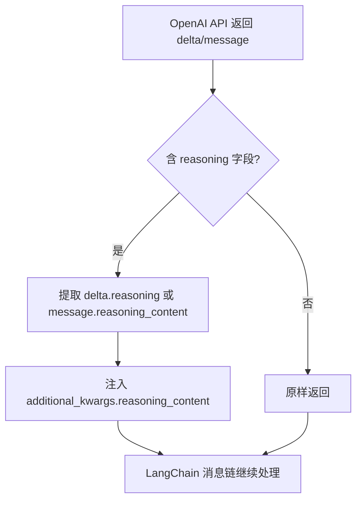
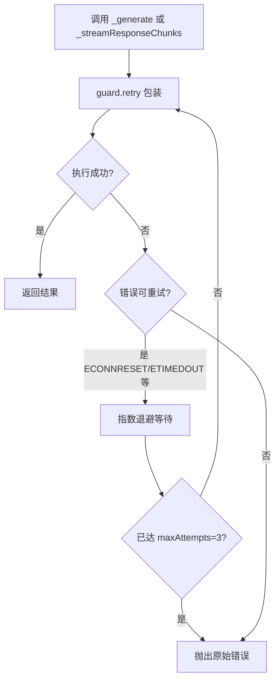

# PD-267.01 Refly — 三工厂六提供商统一适配与 Langfuse 透明监控

> 文档编号：PD-267.01
> 来源：Refly `packages/providers/src/`
> GitHub：https://github.com/refly-ai/refly.git
> 问题域：PD-267 多模型提供商适配 Multi-Provider LLM Adapter
> 状态：可复用方案

---

## 第 1 章 问题与动机

### 1.1 核心问题

在 AI 应用中同时对接多家 LLM/Embedding/Reranker 提供商是常见需求，但每家 API 的认证方式、参数格式、能力特性各不相同。核心挑战包括：

- **接口碎片化**：OpenAI 用 Bearer Token，Bedrock 用 IAM AccessKey，Vertex AI 用 Service Account，Ollama 甚至不需要认证
- **能力差异**：部分模型支持 reasoning（思维链），部分不支持；Bedrock 的 reasoning 需要特殊的 `additionalModelRequestFields` 配置且必须关闭 temperature
- **运维复杂度**：Bedrock 需要多区域负载均衡，Vertex AI 需要网络错误重试，OpenAI 兼容接口需要 baseUrl 可配
- **可观测性盲区**：调用分散在各处，缺乏统一的 token 用量追踪和延迟监控

### 1.2 Refly 的解法概述

Refly 在 `packages/providers` 中构建了一个三层工厂体系，统一适配 LLM、Embedding、Reranker 三类模型服务：

1. **三工厂统一入口** — `getChatModel`（`src/llm/index.ts:47`）、`getEmbeddings`（`src/embeddings/index.ts:10`）、`getReranker`（`src/reranker/index.ts:7`）三个工厂函数，按 `providerKey` switch 分发
2. **BaseProvider 最小接口** — 仅 4 个字段（`providerKey`、`apiKey`、`baseUrl`、`extraParams`），通过 `extraParams` JSON 字符串承载提供商特有配置（`src/types.ts:1-6`）
3. **Enhanced 子类增强** — 对 OpenAI 和 Vertex AI 分别创建 `EnhancedChatOpenAI`（`src/llm/openai.ts:40`）和 `EnhancedChatVertexAI`（`src/llm/vertex.ts:54`），在 LangChain 基类上叠加 reasoning 内容提取和网络重试
4. **Langfuse 透明包装** — 工厂函数出口处自动调用 `wrapChatModelWithMonitoring`（`src/monitoring/langfuse-wrapper.ts:141`），对 invoke/stream 做 monkey-patch，零侵入采集 token 用量
5. **Bedrock 多区域随机负载均衡** — `selectBedrockRegion`（`src/llm/index.ts:29`）支持 `region`（单区域）和 `regions`（多区域随机选取）两种配置

### 1.3 设计思想

| 设计原则 | 具体实现 | 理由 | 替代方案 |
|----------|----------|------|----------|
| 最小公共接口 | `BaseProvider` 仅 4 字段，差异化配置走 `extraParams` JSON | 避免接口膨胀，新增提供商不改接口 | 每个提供商独立接口（类型安全但扩展成本高） |
| 工厂 + switch | `getChatModel` 按 `providerKey` 分发到具体 LangChain 类 | 简单直接，新增提供商只加一个 case | 注册表模式（更灵活但对 6 个提供商过度设计） |
| 继承增强 | `EnhancedChatOpenAI` 继承 `ChatOpenAI`，覆写内部方法 | 不改 LangChain 源码，精准注入 reasoning 提取 | Wrapper 模式（需要代理所有方法） |
| 透明监控 | 工厂出口处 monkey-patch invoke/stream | 调用方完全无感知，监控开关不影响业务逻辑 | LangChain Callback（需要调用方传入 handler） |
| 随机负载均衡 | `Math.random()` 从 regions 数组选区域 | 实现简单，对 Bedrock 跨区域限流足够有效 | 加权轮询（需要维护状态） |

---

## 第 2 章 源码实现分析

### 2.1 架构概览

Refly 的 providers 包是一个独立的 npm 包，对外暴露三个工厂函数和监控初始化接口：

```
packages/providers/src/
├── llm/
│   ├── index.ts          ← getChatModel 工厂（6 提供商）
│   ├── openai.ts         ← EnhancedChatOpenAI（reasoning 提取）
│   └── vertex.ts         ← EnhancedChatVertexAI（网络重试）
├── embeddings/
│   ├── index.ts          ← getEmbeddings 工厂（4 提供商）
│   ├── jina.ts           ← 自定义 Jina Embeddings（长文本分块平均）
│   └── ollama.ts         ← 自定义 Ollama Embeddings 包装
├── reranker/
│   ├── index.ts          ← getReranker 工厂（2 提供商）
│   ├── base.ts           ← BaseReranker 抽象类
│   ├── fallback.ts       ← FallbackReranker（降级排序）
│   ├── jina.ts           ← Jina Reranker
│   └── ollama.ts         ← Ollama Reranker
├── monitoring/
│   └── langfuse-wrapper.ts ← Langfuse 透明包装（LLM + Embeddings）
├── provider-checker/
│   └── provider-checker.ts ← 提供商连接健康检查
├── types.ts              ← BaseProvider 接口
└── index.ts              ← 统一导出
```

整体数据流：

```
┌─────────────────────────────────────────────────────────────┐
│                      调用方（Skill Engine）                    │
│  getChatModel(provider, config, params, context)             │
└──────────────────────────┬──────────────────────────────────┘
                           │
                           ▼
┌──────────────────────────────────────────────────────────────┐
│              getChatModel 工厂（src/llm/index.ts:47）          │
│                                                              │
│  switch(provider.providerKey)                                │
│  ┌─────────┬──────────┬──────────┬───────┬────────┬───────┐  │
│  │ openai  │ ollama   │fireworks │ azure │bedrock │vertex │  │
│  │Enhanced │ChatOllama│ChatFire  │Azure  │Bedrock │Enhanced│  │
│  │ChatOpenAI│         │works     │ChatOAI│Converse│ChatVAI│  │
│  └────┬────┴────┬─────┴────┬─────┴───┬───┴────┬───┴───┬───┘  │
│       └─────────┴──────────┴─────────┴────────┴───────┘      │
│                           │                                  │
│                           ▼                                  │
│         wrapChatModelWithMonitoring（自动包装）                 │
│              ↓ monkey-patch invoke/stream                    │
│         return model（对调用方透明）                            │
└──────────────────────────────────────────────────────────────┘
```

### 2.2 核心实现

#### 2.2.1 LLM 工厂函数与 Bedrock 多区域负载均衡



对应源码 `packages/providers/src/llm/index.ts:29-154`：

```typescript
const selectBedrockRegion = (extraParams: BedrockExtraParams): string => {
  // Priority 1: Use fixed region if specified
  if (extraParams.region) {
    return extraParams.region;
  }
  // Priority 2: Randomly select from regions array
  if (extraParams.regions && extraParams.regions.length > 0) {
    const randomIndex = Math.floor(Math.random() * extraParams.regions.length);
    return extraParams.regions[randomIndex];
  }
  throw new ProviderMisconfigurationError(
    'Region is required for Bedrock provider. Specify either "region" or "regions" in extraParams.',
  );
};

export const getChatModel = (
  provider: BaseProvider,
  config: LLMModelConfig,
  params?: Partial<OpenAIBaseInput> | Partial<AzureOpenAIInput>,
  context?: { userId?: string },
): BaseChatModel => {
  let model: BaseChatModel;
  const extraParams = provider.extraParams ? JSON.parse(provider.extraParams) : {};
  const routeData = (config as any).routeData;
  const commonParams = {
    ...extraParams, ...params,
    ...(config?.disallowTemperature ? { temperature: undefined } : {}),
    ...(routeData ? { metadata: routeData, tags: ['auto-routed'] } : {}),
  };

  switch (provider?.providerKey) {
    case 'openai':
      model = new EnhancedChatOpenAI({
        model: config.modelId, apiKey: provider.apiKey,
        configuration: { baseURL: provider.baseUrl },
        maxTokens: config?.maxOutput,
        reasoning: config?.capabilities?.reasoning ? { effort: 'medium' } : undefined,
        ...commonParams,
      });
      break;
    case 'bedrock': {
      const selectedRegion = selectBedrockRegion(extraParams as BedrockExtraParams);
      const { region: _r, regions: _rs, ...bedrockCommonParams } = commonParams;
      const apiKeyConfig = JSON.parse(provider.apiKey) as BedrockApiKeyConfig;
      model = new ChatBedrockConverse({
        model: config.modelId, region: selectedRegion, credentials: apiKeyConfig,
        maxTokens: config?.maxOutput, ...bedrockCommonParams,
        ...(config?.capabilities?.reasoning ? {
          additionalModelRequestFields: { thinking: { type: 'enabled', budget_tokens: 2000 } },
          temperature: undefined,
        } : {}),
      });
      break;
    }
    // ... other providers
  }
  return wrapChatModelWithMonitoring(model, {
    userId: context?.userId, modelId: config.modelId, provider: provider.providerKey,
  });
};
```

#### 2.2.2 EnhancedChatOpenAI — Reasoning 内容透传



对应源码 `packages/providers/src/llm/openai.ts:9-47`：

```typescript
class EnhanceChatOpenAICompletions extends ChatOpenAICompletions {
  protected override _convertCompletionsDeltaToBaseMessageChunk(
    delta: Record<string, any>,
    rawResponse: OpenAIClient.ChatCompletionChunk,
    defaultRole?: 'function' | 'user' | 'system' | 'developer' | 'assistant' | 'tool',
  ) {
    const messageChunk = super._convertCompletionsDeltaToBaseMessageChunk(
      delta, rawResponse, defaultRole,
    );
    if (messageChunk) {
      messageChunk.additional_kwargs = messageChunk.additional_kwargs ?? {};
      messageChunk.additional_kwargs.reasoning_content = delta.reasoning;
    }
    return messageChunk;
  }

  protected override _convertCompletionsMessageToBaseMessage(
    message: OpenAIClient.ChatCompletionMessage,
    rawResponse: OpenAIClient.ChatCompletion,
  ) {
    const langChainMessage = super._convertCompletionsMessageToBaseMessage(message, rawResponse);
    if (langChainMessage) {
      langChainMessage.additional_kwargs = langChainMessage.additional_kwargs ?? {};
      langChainMessage.additional_kwargs.reasoning_content = (message as any).reasoning_content;
    }
    return langChainMessage;
  }
}

export class EnhancedChatOpenAI extends ChatOpenAI<ChatOpenAICallOptions> {
  constructor(fields?: Partial<ChatOpenAIFields>) {
    super({ ...fields, completions: new EnhanceChatOpenAICompletions(fields) });
  }
}
```

#### 2.2.3 EnhancedChatVertexAI — 指数退避网络重试



对应源码 `packages/providers/src/llm/vertex.ts:10-81`：

```typescript
const RETRYABLE_ERROR_PATTERNS = [
  'socket hang up', 'ECONNRESET', 'ETIMEDOUT', 'ENOTFOUND',
  'ECONNREFUSED', 'EPIPE', 'EAI_AGAIN',
];

const createRetryConfig = (context: string): RetryConfig => ({
  maxAttempts: 3, initialDelay: 1000, maxDelay: 5000, backoffFactor: 2,
  retryIf: isRetryableError,
  onRetry: (error, attempt) => {
    console.warn(`[EnhancedChatVertexAI] Vertex AI ${context} failed (attempt ${attempt}/3)`);
  },
});

export class EnhancedChatVertexAI extends ChatVertexAI {
  async _generate(messages, options, runManager?) {
    return await guard.retry(
      () => super._generate(messages, options, runManager),
      createRetryConfig('request'),
    ).orThrow();
  }

  async *_streamResponseChunks(messages, options, runManager?) {
    yield* guard.retryGenerator(
      () => super._streamResponseChunks(messages, options, runManager),
      createRetryConfig('streaming request'),
    );
  }
}
```

### 2.3 实现细节

**Langfuse 监控包装的关键设计：**

监控层（`src/monitoring/langfuse-wrapper.ts`）采用了几个值得注意的技巧：

1. **懒加载 Langfuse SDK**（L68）：用 `require('langfuse')` 而非静态 import，避免未安装 langfuse 时的依赖报错
2. **双路 token 计算**（L8-34）：优先使用模型返回的 `usage_metadata`，fallback 到 tiktoken 精确计算，再 fallback 到字符数 /4 估算
3. **流式监控的 ReadableStream 包装**（L225-279）：对 stream 方法创建新的 ReadableStream，逐 chunk 转发的同时累积内容，流结束后一次性上报完整 token 用量
4. **tool_calls 捕获**（L192-194, L248-249）：在 invoke 和 stream 两种模式下都捕获工具调用信息，确保 Agent 场景的完整可观测性
5. **监控开关零成本**（L145-147, L299-301）：`isMonitoringEnabled` 为 false 时直接返回原始模型，无任何运行时开销

**Auto Model 路由**（`packages/utils/src/auto-model.ts`）：

Refly 还实现了一个 "Auto" 模型概念——当用户选择 `auto` 模型时，系统从环境变量配置的模型列表中随机选取，并支持基于工具类型的条件路由（`ToolBasedRoutingConfig`）。这与 providers 包的工厂函数配合，通过 `routeData` 字段将路由元数据传递给监控层。

**ProviderChecker 健康检查**（`src/provider-checker/provider-checker.ts`）：

独立的 `ProviderChecker` 类为每种提供商实现了定制化的连接检查策略：OpenAI 检查 `/models` 端点，Ollama 区分 OpenAI 兼容 URL 和原生 URL，Jina 发送最小 embedding 请求验证 API Key，还能智能检测 OpenRouter 提供商（通过 URL、名称、providerKey 三重策略）。

---

## 第 3 章 迁移指南

### 3.1 迁移清单

**阶段 1：基础工厂（1-2 天）**
- [ ] 定义 `BaseProvider` 接口（providerKey + apiKey + baseUrl + extraParams）
- [ ] 实现 `getChatModel` 工厂函数，先支持 OpenAI + Ollama 两个提供商
- [ ] 安装 LangChain 对应包：`@langchain/openai`、`@langchain/ollama`

**阶段 2：扩展提供商（1-2 天）**
- [ ] 添加 Azure、Fireworks、Bedrock、Vertex AI 支持
- [ ] 实现 Bedrock 多区域负载均衡（`selectBedrockRegion`）
- [ ] 实现 Vertex AI 网络重试（`EnhancedChatVertexAI`）

**阶段 3：监控层（1 天）**
- [ ] 实现 `wrapChatModelWithMonitoring`，monkey-patch invoke/stream
- [ ] 集成 Langfuse（懒加载，可选依赖）
- [ ] 添加 tiktoken fallback token 计算

**阶段 4：Embedding + Reranker 工厂（1 天）**
- [ ] 实现 `getEmbeddings` 工厂
- [ ] 实现 `getReranker` 工厂 + `BaseReranker` 抽象类 + `FallbackReranker`

### 3.2 适配代码模板

以下是一个可直接运行的最小化多提供商适配器：

```typescript
// types.ts
export interface BaseProvider {
  providerKey: string;
  apiKey?: string;
  baseUrl?: string;
  extraParams?: string; // JSON string for provider-specific config
}

// llm-factory.ts
import { BaseChatModel } from '@langchain/core/language_models/chat_models';
import { ChatOpenAI } from '@langchain/openai';
import { ChatOllama } from '@langchain/ollama';
import { ChatBedrockConverse } from '@langchain/aws';
import { BaseProvider } from './types';

interface LLMConfig {
  modelId: string;
  maxOutput?: number;
  capabilities?: { reasoning?: boolean };
}

const selectBedrockRegion = (extraParams: { region?: string; regions?: string[] }): string => {
  if (extraParams.region) return extraParams.region;
  if (extraParams.regions?.length) {
    return extraParams.regions[Math.floor(Math.random() * extraParams.regions.length)];
  }
  throw new Error('Bedrock requires region or regions in extraParams');
};

export const getChatModel = (provider: BaseProvider, config: LLMConfig): BaseChatModel => {
  const extra = provider.extraParams ? JSON.parse(provider.extraParams) : {};

  switch (provider.providerKey) {
    case 'openai':
      return new ChatOpenAI({
        model: config.modelId,
        apiKey: provider.apiKey,
        configuration: { baseURL: provider.baseUrl },
        maxTokens: config.maxOutput,
        ...extra,
      });
    case 'ollama':
      return new ChatOllama({
        model: config.modelId,
        baseUrl: provider.baseUrl?.replace(/\/v1\/?$/, ''),
        ...extra,
      });
    case 'bedrock': {
      const region = selectBedrockRegion(extra);
      const { region: _r, regions: _rs, ...rest } = extra;
      const credentials = JSON.parse(provider.apiKey!);
      return new ChatBedrockConverse({
        model: config.modelId, region, credentials,
        maxTokens: config.maxOutput, ...rest,
      });
    }
    default:
      throw new Error(`Unsupported provider: ${provider.providerKey}`);
  }
};

// monitoring-wrapper.ts — 最小化监控包装
export function wrapWithMonitoring(
  model: BaseChatModel,
  context: { modelId: string; provider: string },
): BaseChatModel {
  const originalInvoke = model.invoke.bind(model);
  model.invoke = async (input, options) => {
    const start = Date.now();
    try {
      const result = await originalInvoke(input, options);
      console.log(`[${context.provider}/${context.modelId}] ${Date.now() - start}ms`,
        result.usage_metadata ?? 'no usage');
      return result;
    } catch (error) {
      console.error(`[${context.provider}/${context.modelId}] ERROR`, error);
      throw error;
    }
  };
  return model;
}
```

### 3.3 适用场景

| 场景 | 适用度 | 说明 |
|------|--------|------|
| SaaS 多租户 AI 平台 | ⭐⭐⭐ | 每个租户可配置不同提供商，工厂模式天然支持 |
| 企业内部 AI 网关 | ⭐⭐⭐ | Bedrock 多区域 + Vertex AI 重试适合生产环境 |
| 个人 AI 工具 | ⭐⭐ | 如果只用 1-2 个提供商，工厂模式略显冗余 |
| 高并发推理服务 | ⭐⭐ | 随机负载均衡够用，但缺少基于延迟/错误率的智能路由 |
| 成本敏感场景 | ⭐⭐⭐ | Langfuse 监控 + Auto Model 路由可实现成本可视化和优化 |

---

## 第 4 章 测试用例

```typescript
import { describe, it, expect, vi, beforeEach } from 'vitest';

// Mock LangChain modules
vi.mock('@langchain/openai', () => ({
  ChatOpenAI: vi.fn().mockImplementation((config) => ({
    invoke: vi.fn().mockResolvedValue({ content: 'test', usage_metadata: { input_tokens: 10, output_tokens: 5 } }),
    stream: vi.fn(),
    _config: config,
  })),
  AzureChatOpenAI: vi.fn().mockImplementation((config) => ({
    invoke: vi.fn().mockResolvedValue({ content: 'azure-test' }),
    _config: config,
  })),
}));

vi.mock('@langchain/ollama', () => ({
  ChatOllama: vi.fn().mockImplementation((config) => ({
    invoke: vi.fn().mockResolvedValue({ content: 'ollama-test' }),
    _config: config,
  })),
}));

describe('getChatModel', () => {
  const baseProvider = (key: string, extra?: object) => ({
    providerKey: key,
    apiKey: 'test-key',
    baseUrl: 'https://api.example.com/v1',
    extraParams: extra ? JSON.stringify(extra) : undefined,
  });

  it('should create OpenAI model with reasoning capability', () => {
    const model = getChatModel(
      baseProvider('openai'),
      { modelId: 'o1-preview', maxOutput: 4096, capabilities: { reasoning: true } },
    );
    expect(model).toBeDefined();
    expect(model._config.reasoning).toEqual({ effort: 'medium' });
  });

  it('should strip /v1 suffix for Ollama baseUrl', () => {
    const model = getChatModel(
      baseProvider('ollama'),
      { modelId: 'llama3', maxOutput: 2048 },
    );
    expect(model._config.baseUrl).toBe('https://api.example.com');
  });

  it('should throw on unsupported provider', () => {
    expect(() => getChatModel(
      baseProvider('unknown'),
      { modelId: 'test' },
    )).toThrow('Unsupported provider: unknown');
  });
});

describe('selectBedrockRegion', () => {
  it('should prefer fixed region over regions array', () => {
    const region = selectBedrockRegion({ region: 'us-east-1', regions: ['us-west-2', 'eu-west-1'] });
    expect(region).toBe('us-east-1');
  });

  it('should randomly select from regions array', () => {
    const regions = ['us-east-1', 'us-west-2', 'eu-west-1'];
    const selected = selectBedrockRegion({ regions });
    expect(regions).toContain(selected);
  });

  it('should throw when neither region nor regions specified', () => {
    expect(() => selectBedrockRegion({})).toThrow('Region is required');
  });
});

describe('wrapChatModelWithMonitoring', () => {
  it('should pass through when monitoring disabled', () => {
    const mockModel = { invoke: vi.fn(), stream: vi.fn() } as any;
    // isMonitoringEnabled defaults to false
    const wrapped = wrapChatModelWithMonitoring(mockModel, {});
    expect(wrapped).toBe(mockModel); // Same reference, no wrapping
  });

  it('should capture token usage from invoke result', async () => {
    // With monitoring enabled, invoke should capture usage_metadata
    initializeMonitoring({ enabled: true, publicKey: 'pk', secretKey: 'sk' });
    const mockModel = {
      invoke: vi.fn().mockResolvedValue({
        content: 'hello',
        usage_metadata: { input_tokens: 100, output_tokens: 50, total_tokens: 150 },
      }),
    } as any;
    const wrapped = wrapChatModelWithMonitoring(wrapped, { modelId: 'gpt-4', provider: 'openai' });
    const result = await wrapped.invoke('test');
    expect(result.content).toBe('hello');
  });
});

describe('EnhancedChatVertexAI retry', () => {
  it('should retry on ECONNRESET error', async () => {
    const callCount = { value: 0 };
    const mockGenerate = vi.fn().mockImplementation(() => {
      callCount.value++;
      if (callCount.value < 3) throw new Error('socket hang up');
      return Promise.resolve({ generations: [] });
    });
    // Verify retry logic triggers on retryable errors
    expect(RETRYABLE_ERROR_PATTERNS).toContain('socket hang up');
    expect(isRetryableError(new Error('ECONNRESET'))).toBe(true);
    expect(isRetryableError(new Error('normal error'))).toBe(false);
  });
});
```

---

## 第 5 章 跨域关联

| 关联域 | 关系类型 | 说明 |
|--------|----------|------|
| PD-03 容错与重试 | 协同 | `EnhancedChatVertexAI` 的指数退避重试（7 种网络错误模式）是 PD-03 的典型实现；Bedrock 多区域随机选取也是一种隐式容错 |
| PD-04 工具系统 | 协同 | 监控包装器捕获 `tool_calls` 信息（`langfuse-wrapper.ts:192`），为工具调用提供可观测性 |
| PD-11 可观测性 | 强依赖 | Langfuse 透明包装是 PD-11 的核心实现，覆盖 LLM invoke/stream 和 Embeddings embedDocuments/embedQuery 四个维度 |
| PD-01 上下文管理 | 协同 | `LLMModelConfig.contextLimit` 和 `maxOutput` 参数通过工厂函数传递，为上下文窗口管理提供模型级约束 |
| PD-08 搜索与检索 | 协同 | `getEmbeddings` 和 `getReranker` 工厂为检索管道提供多提供商 Embedding 和 Reranker 支持；Jina Embeddings 的长文本分块平均策略直接服务于检索质量 |

---

## 第 6 章 来源文件索引

| 文件 | 行范围 | 关键实现 |
|------|--------|----------|
| `packages/providers/src/types.ts` | L1-6 | `BaseProvider` 接口定义（4 字段最小公共接口） |
| `packages/providers/src/llm/index.ts` | L29-45 | `selectBedrockRegion` 多区域随机负载均衡 |
| `packages/providers/src/llm/index.ts` | L47-154 | `getChatModel` 工厂函数（6 提供商 switch 分发） |
| `packages/providers/src/llm/openai.ts` | L9-47 | `EnhancedChatOpenAI` + `EnhanceChatOpenAICompletions`（reasoning 内容透传） |
| `packages/providers/src/llm/vertex.ts` | L10-81 | `EnhancedChatVertexAI`（7 种网络错误模式 + 指数退避重试） |
| `packages/providers/src/embeddings/index.ts` | L10-63 | `getEmbeddings` 工厂函数（4 提供商 + 自动监控包装） |
| `packages/providers/src/embeddings/jina.ts` | L93-182 | `JinaEmbeddings`（长文本分块 + 平均向量合并） |
| `packages/providers/src/embeddings/ollama.ts` | L13-68 | `OllamaEmbeddings`（LangChain 包装 + 输入校验） |
| `packages/providers/src/reranker/index.ts` | L7-23 | `getReranker` 工厂函数（Jina + Ollama） |
| `packages/providers/src/reranker/base.ts` | L16-54 | `BaseReranker` 抽象类 + `defaultFallback` 降级排序 |
| `packages/providers/src/monitoring/langfuse-wrapper.ts` | L61-78 | `initializeMonitoring` 懒加载 Langfuse SDK |
| `packages/providers/src/monitoring/langfuse-wrapper.ts` | L141-290 | `wrapChatModelWithMonitoring` invoke/stream monkey-patch |
| `packages/providers/src/monitoring/langfuse-wrapper.ts` | L295-371 | `wrapEmbeddingsWithMonitoring` embedDocuments/embedQuery 包装 |
| `packages/providers/src/provider-checker/provider-checker.ts` | L34-800 | `ProviderChecker` 多提供商健康检查（含 OpenRouter 智能检测） |
| `packages/utils/src/auto-model.ts` | L1-121 | Auto Model 路由（随机选取 + 工具条件路由） |
| `packages/utils/src/provider.ts` | L24-133 | `providerInfoList` 提供商元数据注册表（10 个提供商） |
| `packages/providers/src/index.ts` | L1-18 | 统一导出入口 |

---

## 第 7 章 横向对比维度

```json comparison_data
{
  "project": "Refly",
  "dimensions": {
    "提供商数量": "LLM 6家 + Embedding 4家 + Reranker 2家，共 12 个适配",
    "工厂模式": "三工厂函数（getChatModel/getEmbeddings/getReranker）switch 分发",
    "多区域负载均衡": "Bedrock regions 数组随机选取 + 单 region 向后兼容",
    "监控包装器注入": "Langfuse monkey-patch invoke/stream，懒加载 SDK，零侵入",
    "能力自动检测": "capabilities.reasoning 驱动 OpenAI/Azure/Bedrock/Vertex 四种 reasoning 配置",
    "健康检查": "ProviderChecker 按提供商定制检查策略，含 OpenRouter 三重智能检测",
    "Auto 模型路由": "环境变量配置随机列表 + 工具条件路由（ToolBasedRoutingConfig）"
  }
}
```

### 域元数据补充

```json domain_metadata
{
  "solution_summary": "Refly 通过三工厂函数（LLM/Embedding/Reranker）+ BaseProvider 最小接口 + Langfuse monkey-patch 透明监控，统一适配 12 个提供商并支持 Bedrock 多区域负载均衡",
  "description": "统一适配 LLM、Embedding、Reranker 三类模型服务的工厂体系与透明监控",
  "sub_problems": [
    "Reasoning 能力跨提供商差异化配置（OpenAI effort vs Bedrock thinking budget vs Vertex reasoning）",
    "提供商连接健康检查与智能检测（OpenRouter URL/名称/Key 三重识别）",
    "长文本 Embedding 分块平均向量合并策略"
  ],
  "best_practices": [
    "monkey-patch invoke/stream 实现零侵入监控，监控关闭时零运行时开销",
    "懒加载可选依赖（require 而非 import）避免未安装时的启动报错",
    "Enhanced 子类继承覆写内部方法，不改 LangChain 源码精准注入增强逻辑"
  ]
}
```
