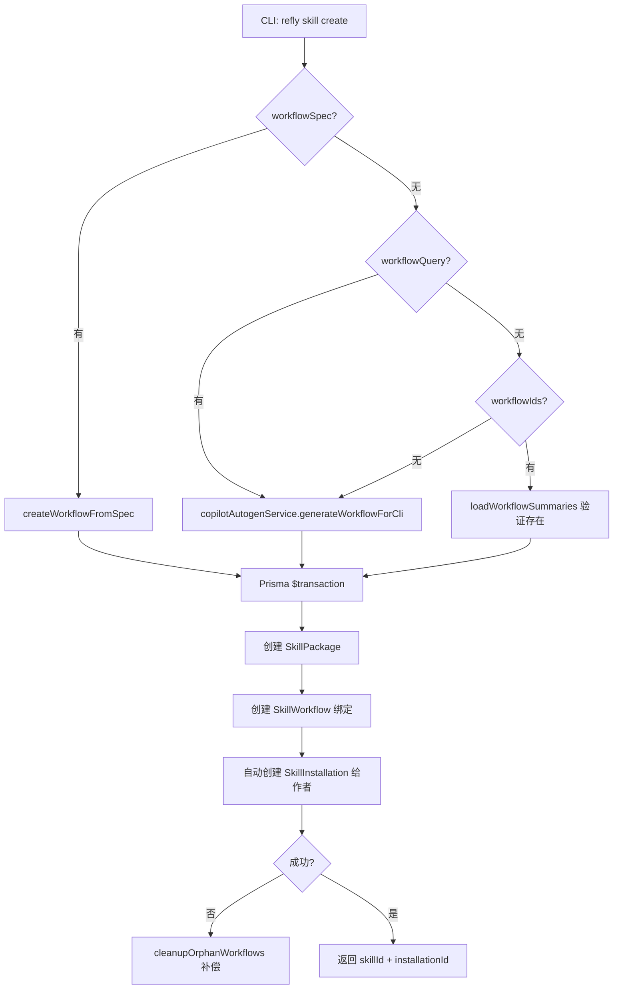
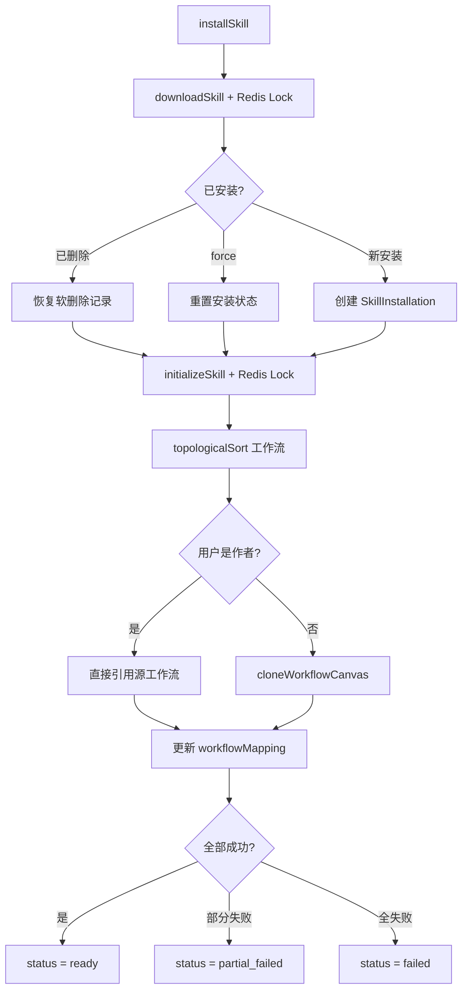
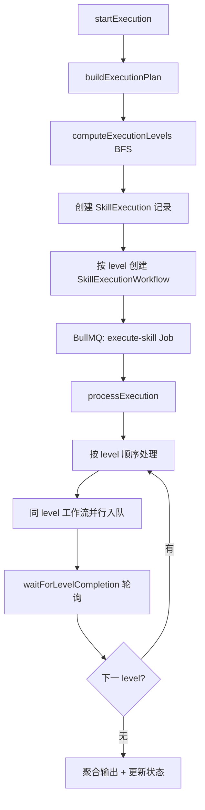
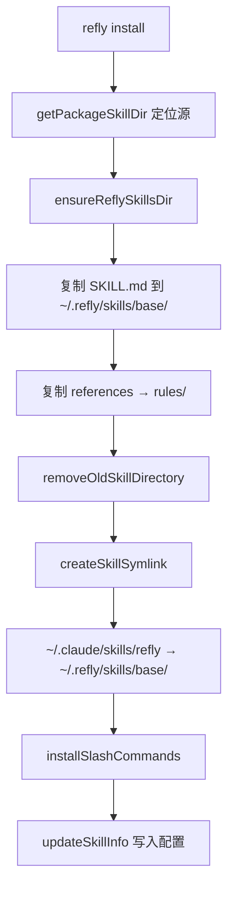

# PD-268.01 Refly — NestJS+Prisma 技能包全生命周期管理

> 文档编号：PD-268.01
> 来源：Refly `apps/api/src/modules/skill-package/`
> GitHub：https://github.com/refly-ai/refly.git
> 问题域：PD-268 技能包管理 Skill Package Management
> 状态：可复用方案

---

## 第 1 章 问题与动机

### 1.1 核心问题

Agent 系统需要一种标准化的方式来封装、分发和复用可执行能力单元。传统做法是将 Agent 技能硬编码在代码中，导致：

1. **能力不可移植**：一个 Agent 的技能无法被另一个 Agent 直接使用
2. **版本管理缺失**：技能更新后无法追踪哪些用户在用哪个版本
3. **安装体验差**：用户需要手动配置工作流、复制文件、建立关联
4. **发布无标准**：没有统一的技能发现和分享机制

Refly 的解决方案是构建一个完整的技能包生命周期管理系统，覆盖从创建、安装、执行到发布的全流程。

### 1.2 Refly 的解法概述

1. **NestJS 模块化服务架构**：`SkillPackageService`（CRUD + 发布）、`SkillInstallationService`（安装生命周期）、`SkillPackageExecutorService`（DAG 执行引擎）三大服务分离关注点 (`skill-package.service.ts:38`, `skill-installation.service.ts:28`, `skill-package-executor.service.ts:81`)
2. **Workflow-as-Skill 映射**：技能包本质是对工作流的封装，通过 `SkillWorkflow` 中间表将技能与可执行工作流绑定，支持一对多关系 (`skill-package.service.ts:469`)
3. **6 态安装状态机**：`downloaded → initializing → ready / partial_failed / failed`，支持断点续装和强制重装 (`skill-installation.service.ts:204-211`)
4. **Redis 分布式锁防并发**：下载和初始化操作使用 `waitLock` 防止同一用户对同一技能的并发操作 (`skill-installation.service.ts:55-61`)
5. **GitHub App 自动 PR 发布**：发布技能时自动向 `refly-skill` 仓库提交 PR，包含 SKILL.md 和 README.md (`skill-github.service.ts:78-210`)

### 1.3 设计思想

| 设计原则 | 具体实现 | 理由 | 替代方案 |
|----------|----------|------|----------|
| Workflow-as-Skill | 技能 = 工作流封装 + 元数据 | 复用已有工作流引擎，避免重复造轮子 | 独立技能运行时（更重） |
| 安装即克隆 | 安装时 clone 源工作流到用户空间 | 用户拥有独立副本，互不影响 | 共享引用（有并发修改风险） |
| CLI + API 双入口 | 同一后端服务，CLI 和 Web 各有 Controller | 开发者用 CLI，普通用户用 Web | 仅 CLI（限制受众） |
| 声明式技能描述 | SKILL.md frontmatter 定义元数据 | 人类可读 + 机器可解析 | JSON Schema（不够直观） |
| 补偿式事务 | 创建失败时清理孤儿工作流 | 无分布式事务支持下保证一致性 | 两阶段提交（过于复杂） |

---

## 第 2 章 源码实现分析

### 2.1 架构概览

Refly 的技能包系统由 API 层（NestJS 模块）和 CLI 层（本地安装器）两部分组成：

```
┌─────────────────────────────────────────────────────────────────┐
│                        REST API Layer                           │
│  ┌──────────────────┐  ┌────────────────────┐  ┌────────────┐  │
│  │ SkillPackage     │  │ SkillInstallation  │  │ CLI        │  │
│  │ Controller       │  │ Controller         │  │ Controller │  │
│  │ (CRUD + Publish) │  │ (Install + Run)    │  │ (CLI fmt)  │  │
│  └────────┬─────────┘  └────────┬───────────┘  └─────┬──────┘  │
│           │                     │                     │         │
│  ┌────────▼─────────┐  ┌───────▼────────────┐  ┌─────▼──────┐  │
│  │ SkillPackage     │  │ SkillInstallation  │  │ SkillPkg   │  │
│  │ Service          │  │ Service            │  │ Executor   │  │
│  │ • createPkg      │  │ • download+lock    │  │ Service    │  │
│  │ • publishPkg     │  │ • initialize       │  │ • DAG exec │  │
│  │ • searchPublic   │  │ • upgrade+rollback │  │ • BullMQ   │  │
│  └────────┬─────────┘  └───────┬────────────┘  └─────┬──────┘  │
│           │                     │                     │         │
│  ┌────────▼─────────┐  ┌───────▼────────────┐  ┌─────▼──────┐  │
│  │ SkillGithub      │  │ Canvas             │  │ Execution  │  │
│  │ Service          │  │ Service            │  │ Plan Svc   │  │
│  │ (Octokit PR)     │  │ (clone workflow)   │  │ (topo sort)│  │
│  └──────────────────┘  └────────────────────┘  └────────────┘  │
│                                                                 │
│  ┌──────────────────────────────────────────────────────────┐   │
│  │                    Prisma ORM Layer                       │   │
│  │  SkillPackage | SkillWorkflow | SkillInstallation        │   │
│  │  SkillExecution | SkillExecutionWorkflow                  │   │
│  └──────────────────────────────────────────────────────────┘   │
└─────────────────────────────────────────────────────────────────┘

┌─────────────────────────────────────────────────────────────────┐
│                        CLI Layer                                │
│  ┌──────────────┐  ┌──────────────┐  ┌──────────────────────┐  │
│  │ installer.ts │  │ symlink.ts   │  │ loader.ts            │  │
│  │ (copy+link)  │  │ (fs symlink) │  │ (parse frontmatter)  │  │
│  └──────────────┘  └──────────────┘  └──────────────────────┘  │
│                                                                 │
│  ~/.refly/skills/<name>/SKILL.md  ←symlink→  ~/.claude/skills/  │
└─────────────────────────────────────────────────────────────────┘
```

### 2.2 核心实现

#### 2.2.1 技能包创建与工作流绑定



对应源码 `skill-package.service.ts:77-300`：

```typescript
async createSkillPackageWithWorkflow(
  user: User,
  input: CreateSkillPackageCliDto,
): Promise<CreateSkillPackageCliResponse> {
  // 验证描述至少 20 词（Claude Code 发现需要）
  this.validateSkillDescription(input.description, input.name, input.workflowQuery);

  const normalizedWorkflowIds = this.normalizeWorkflowIds(input.workflowId, input.workflowIds);
  const createdWorkflowIds: string[] = [];

  try {
    // 三种工作流来源：spec 直接创建 / query 自动生成 / 绑定已有
    if (input.workflowSpec) {
      const created = await this.workflowCliService.createWorkflowFromSpec(user, workflowRequest);
      createdWorkflowIds.push(created.workflowId);
    }

    const shouldGenerate = !input.workflowSpec && (input.workflowQuery || normalizedWorkflowIds.length === 0);
    if (shouldGenerate) {
      const generated = await this.copilotAutogenService.generateWorkflowForCli(user, { query });
      createdWorkflowIds.push(generated.canvasId);
    }

    // Prisma 事务：原子创建 Package + Workflow 绑定 + 自动安装
    const result = await this.prisma.$transaction(async (tx) => {
      const skillPackage = await tx.skillPackage.create({ data: { ... } });
      for (const workflow of workflowBindings) {
        await tx.skillWorkflow.create({ data: { skillId, sourceCanvasId: workflow.workflowId } });
      }
      // 作者自动安装（直接引用源工作流，不克隆）
      await tx.skillInstallation.create({ data: { status: 'ready', workflowMapping } });
      return { skillPackage, installationId };
    });
  } catch (error) {
    // 补偿：清理孤儿工作流（软删除）
    if (createdWorkflowIds.length > 0) {
      await this.cleanupOrphanWorkflows(user, createdWorkflowIds);
    }
    throw error;
  }
}
```

#### 2.2.2 安装生命周期与分布式锁



对应源码 `skill-installation.service.ts:48-315`：

```typescript
async downloadSkill(user: User, skillId: string, shareId?: string, force?: boolean) {
  // Redis 分布式锁：防止同一用户并发下载同一技能
  const lockKey = `skill:download:${user.uid}:${skillId}`;
  const releaseLock = await this.redisService.waitLock(lockKey, {
    ttlSeconds: 30, maxRetries: 3, initialDelay: 100, noThrow: true,
  });
  try {
    // 初始化 workflowMapping：每个工作流标记为 pending
    const workflowMapping: WorkflowMappingRecord = {};
    for (const workflow of skillPackage.workflows) {
      workflowMapping[workflow.skillWorkflowId] = { workflowId: null, status: 'pending' };
    }
    // 处理已安装情况：恢复软删除 / 强制重装 / 报冲突
    // ...
    await this.prisma.skillPackage.update({ data: { downloadCount: { increment: 1 } } });
  } finally {
    await releaseLock();
  }
}

async initializeSkill(user: User, installationId: string) {
  const lockKey = `skill:init:${installationId}`;
  const releaseLock = await this.redisService.waitLock(lockKey, {
    ttlSeconds: 60, maxRetries: 5, maxLifetimeSeconds: 300,
  });
  try {
    // 拓扑排序确保依赖顺序
    const sortedWorkflows = this.topologicalSort(skillPackage.workflows);
    for (const workflow of sortedWorkflows) {
      const isOwner = sourceCanvas?.uid === user.uid;
      if (isOwner) {
        generatedWorkflowId = workflow.sourceCanvasId; // 作者直接引用
      } else {
        generatedWorkflowId = await this.cloneWorkflowCanvas(user, ...); // 非作者克隆
      }
    }
  } finally { await releaseLock(); }
}
```


#### 2.2.3 DAG 执行引擎



对应源码 `skill-package-executor.service.ts:97-353`：

```typescript
async startExecution(params: StartExecutionParams): Promise<string> {
  // 构建 DAG 执行计划
  const workflowInfos: SkillWorkflowInfo[] = skillPackage.workflows.map(wf => ({
    skillWorkflowId: wf.skillWorkflowId,
    dependencies: wf.dependencies?.map(dep => ({ dependencyWorkflowId: dep.dependencyWorkflowId })),
  }));
  const plan = this.planService.buildExecutionPlan(workflowInfos);

  // 按 level 创建执行记录
  for (const level of plan.levels) {
    for (const wf of level.workflows) {
      await this.prisma.skillExecutionWorkflow.create({
        data: { executionLevel: level.level, status: WORKFLOW_STATUS.PENDING },
      });
    }
  }

  // 入队 BullMQ
  await this.executionQueue.add('execute-skill', { executionId, input, retryCount: 0 });
}
```

执行计划服务使用 Kahn 算法进行拓扑排序 (`skill-execution-plan.service.ts:40-107`)：

```typescript
computeExecutionLevels(workflows: SkillWorkflowInfo[]): ExecutionLevel[] {
  // BFS 传播 level：无依赖 = level 0，有依赖 = max(dep levels) + 1
  let changed = true;
  while (changed && iterations < maxIterations) {
    changed = false;
    for (const wf of workflows) {
      if (levels.has(wf.skillWorkflowId)) continue;
      const deps = dependencies.get(wf.skillWorkflowId) ?? [];
      const depLevels = deps.map(dep => levels.get(dep)).filter(l => l !== undefined);
      if (depLevels.length === deps.length) {
        levels.set(wf.skillWorkflowId, Math.max(...depLevels) + 1);
        changed = true;
      }
    }
  }
  // 检测循环依赖
  if (levels.size !== workflows.length) {
    throw SkillExecutionError.circularDependency(unresolved);
  }
}
```

#### 2.2.4 CLI 本地安装与符号链接



对应源码 `packages/cli/src/skill/installer.ts:92-173`：

```typescript
export function installSkill(): InstallResult {
  const sourceDir = getPackageSkillDir();
  ensureReflySkillsDir();
  const targetDir = getReflyBaseSkillDir();

  // 复制 SKILL.md
  fs.copyFileSync(path.join(sourceDir, 'SKILL.md'), path.join(targetDir, 'SKILL.md'));

  // 复制 references → rules
  const files = fs.readdirSync(refsSource);
  for (const file of files) {
    fs.copyFileSync(path.join(refsSource, file), path.join(rulesTarget, file));
  }

  // 创建符号链接：~/.claude/skills/refly → ~/.refly/skills/base/
  removeOldSkillDirectory();
  const symlinkResult = createSkillSymlink('refly');

  // 安装 slash commands
  result.commandsInstalled = installSlashCommands(sourceDir, commandsDir);
  updateSkillInfo(result.version);
}
```

### 2.3 实现细节

**工作流数据映射**：`SkillWorkflowMapperService` 提供 dot-notation 路径访问、三种合并策略（merge/override/custom），支持工作流间数据传递 (`skill-workflow-mapper.service.ts:20-245`)。

**SKILL.md Frontmatter 协议**：技能元数据以 YAML frontmatter 格式存储在 SKILL.md 中，包含 `name`、`description`、`skillId`、`workflowId`、`triggers`、`tags`、`version` 等字段。CLI 和 API 都能解析此格式 (`symlink.ts:512-590`)。

**多平台部署**：`createMultiPlatformSkill` 支持将技能同时部署到 Claude Code、Refly 等多个 Agent 平台，通过 `deploySkillToAllPlatforms` 统一管理 (`symlink.ts:607-646`)。

**GitHub Registry 发布流程**：使用 GitHub App 认证（非个人 Token），通过 Octokit 创建分支 → 提交 SKILL.md + README.md → 创建 PR，支持更新已有 PR (`skill-github.service.ts:78-292`)。

---

## 第 3 章 迁移指南

### 3.1 迁移清单

**阶段 1：数据模型（1-2 天）**
- [ ] 创建 `SkillPackage` 表：skillId, name, version, description, triggers[], tags[], inputSchema, outputSchema, status, isPublic, shareId, downloadCount
- [ ] 创建 `SkillWorkflow` 表：skillWorkflowId, skillId, sourceCanvasId, isEntry, dependencies
- [ ] 创建 `SkillInstallation` 表：installationId, skillId, uid, status, workflowMapping(JSON), installedVersion
- [ ] 创建 `SkillExecution` + `SkillExecutionWorkflow` 表

**阶段 2：核心服务（2-3 天）**
- [ ] 实现 SkillPackageService：CRUD + 发布 + 搜索
- [ ] 实现 SkillInstallationService：下载 + 初始化 + 升级
- [ ] 实现分布式锁（Redis waitLock 或数据库行锁）
- [ ] 实现工作流克隆逻辑

**阶段 3：执行引擎（1-2 天）**
- [ ] 实现 ExecutionPlanService：拓扑排序 + level 计算
- [ ] 实现 ExecutorService：BullMQ 队列 + 轮询等待
- [ ] 实现 WorkflowMapperService：数据映射

**阶段 4：CLI + 发布（1-2 天）**
- [ ] 实现 SKILL.md frontmatter 解析器
- [ ] 实现本地安装器（文件复制 + 符号链接）
- [ ] 实现 GitHub PR 自动提交（可选）

### 3.2 适配代码模板

**技能包安装状态机（可直接复用）：**

```typescript
// 安装状态枚举
type InstallationStatus = 'downloaded' | 'initializing' | 'ready' | 'partial_failed' | 'failed';

// 工作流映射记录
interface WorkflowMappingRecord {
  [skillWorkflowId: string]: {
    workflowId: string | null;
    status: 'pending' | 'ready' | 'failed';
    error?: string;
  };
}

// 安装服务核心逻辑
class SkillInstallationService {
  async installSkill(userId: string, skillId: string): Promise<Installation> {
    // 1. 获取分布式锁
    const lock = await this.acquireLock(`skill:install:${userId}:${skillId}`);
    try {
      // 2. 检查是否已安装
      const existing = await this.db.findInstallation(skillId, userId);
      if (existing && !existing.deletedAt) {
        throw new ConflictError('Already installed');
      }

      // 3. 创建安装记录
      const installation = await this.db.createInstallation({
        skillId, userId, status: 'downloaded',
        workflowMapping: this.initWorkflowMapping(skill.workflows),
      });

      // 4. 拓扑排序后逐个克隆工作流
      const sorted = this.topologicalSort(skill.workflows);
      for (const wf of sorted) {
        try {
          const clonedId = await this.cloneWorkflow(userId, wf.sourceId);
          installation.workflowMapping[wf.id] = { workflowId: clonedId, status: 'ready' };
        } catch (e) {
          installation.workflowMapping[wf.id] = { workflowId: null, status: 'failed', error: e.message };
        }
      }

      // 5. 计算最终状态
      const statuses = Object.values(installation.workflowMapping).map(m => m.status);
      installation.status = statuses.every(s => s === 'ready') ? 'ready'
        : statuses.every(s => s === 'failed') ? 'failed' : 'partial_failed';

      return installation;
    } finally {
      await lock.release();
    }
  }
}
```

### 3.3 适用场景

| 场景 | 适用度 | 说明 |
|------|--------|------|
| Agent 技能市场 | ⭐⭐⭐ | 完整的发布-发现-安装-执行闭环 |
| 工作流模板分发 | ⭐⭐⭐ | 工作流克隆 + 变量清理机制可直接复用 |
| 插件系统 | ⭐⭐ | 需要适配非工作流类型的插件 |
| CLI 工具技能管理 | ⭐⭐⭐ | SKILL.md + 符号链接方案轻量高效 |
| 多租户 SaaS | ⭐⭐ | 需要加强租户隔离和配额管理 |

---

## 第 4 章 测试用例

```typescript
import { describe, it, expect, beforeEach, vi } from 'vitest';

// 基于 skill-execution-plan.service.ts 的真实接口
describe('SkillExecutionPlanService', () => {
  let planService: SkillExecutionPlanService;

  beforeEach(() => {
    planService = new SkillExecutionPlanService();
  });

  it('should compute levels for linear dependency chain', () => {
    const workflows = [
      { skillWorkflowId: 'wf-1', name: 'Step 1', dependencies: [] },
      { skillWorkflowId: 'wf-2', name: 'Step 2', dependencies: [{ dependencyWorkflowId: 'wf-1' }] },
      { skillWorkflowId: 'wf-3', name: 'Step 3', dependencies: [{ dependencyWorkflowId: 'wf-2' }] },
    ];
    const levels = planService.computeExecutionLevels(workflows);
    expect(levels).toHaveLength(3);
    expect(levels[0].level).toBe(0);
    expect(levels[0].workflows[0].skillWorkflowId).toBe('wf-1');
    expect(levels[2].workflows[0].skillWorkflowId).toBe('wf-3');
  });

  it('should group parallel workflows at same level', () => {
    const workflows = [
      { skillWorkflowId: 'wf-root', name: 'Root', dependencies: [] },
      { skillWorkflowId: 'wf-a', name: 'Branch A', dependencies: [{ dependencyWorkflowId: 'wf-root' }] },
      { skillWorkflowId: 'wf-b', name: 'Branch B', dependencies: [{ dependencyWorkflowId: 'wf-root' }] },
    ];
    const levels = planService.computeExecutionLevels(workflows);
    expect(levels).toHaveLength(2);
    expect(levels[1].workflows).toHaveLength(2); // wf-a 和 wf-b 并行
  });

  it('should detect circular dependencies', () => {
    const workflows = [
      { skillWorkflowId: 'wf-a', name: 'A', dependencies: [{ dependencyWorkflowId: 'wf-b' }] },
      { skillWorkflowId: 'wf-b', name: 'B', dependencies: [{ dependencyWorkflowId: 'wf-a' }] },
    ];
    expect(() => planService.computeExecutionLevels(workflows)).toThrow();
  });

  it('should identify blocked workflows on failure', () => {
    const workflows = [
      { skillWorkflowId: 'wf-1', name: 'Step 1' },
      { skillWorkflowId: 'wf-2', name: 'Step 2', dependencies: [{ dependencyWorkflowId: 'wf-1' }] },
      { skillWorkflowId: 'wf-3', name: 'Step 3', dependencies: [{ dependencyWorkflowId: 'wf-2' }] },
    ];
    const plan = planService.buildExecutionPlan(workflows);
    const blocked = planService.getBlockedWorkflows(plan, 'wf-1', new Set());
    expect(blocked).toContain('wf-2');
    expect(blocked).toContain('wf-3'); // 传递阻塞
  });
});

// 基于 skill-workflow-mapper.service.ts 的真实接口
describe('SkillWorkflowMapperService', () => {
  let mapper: SkillWorkflowMapperService;

  beforeEach(() => {
    mapper = new SkillWorkflowMapperService();
  });

  it('should apply dot-notation output selector', () => {
    const output = { data: { result: { score: 95 } } };
    const result = mapper.applyOutputSelector(output, { path: 'data.result.score' });
    expect(result).toBe(95);
  });

  it('should apply input mapping between workflows', () => {
    const source = { analysis: { summary: 'test', confidence: 0.9 } };
    const mapping = { text: 'analysis.summary', score: 'analysis.confidence' };
    const result = mapper.applyInputMapping(source, mapping);
    expect(result).toEqual({ text: 'test', score: 0.9 });
  });

  it('should merge inputs with override strategy', () => {
    const base = { query: 'original' };
    const deps = [{ workflowId: 'wf-1', output: { query: 'overridden', extra: true } }];
    const result = mapper.mergeInputs(base, deps, 'override');
    expect(result.query).toBe('overridden');
  });
});

// 基于 skill-installation.service.ts 的拓扑排序
describe('TopologicalSort', () => {
  it('should sort workflows respecting dependencies', () => {
    // 使用 SkillInstallationService 的 topologicalSort（Kahn 算法）
    const workflows = [
      { skillWorkflowId: 'c', name: 'C', sourceCanvasId: 'c1', dependencies: [{ dependencyWorkflowId: 'a' }] },
      { skillWorkflowId: 'a', name: 'A', sourceCanvasId: 'a1', dependencies: [] },
      { skillWorkflowId: 'b', name: 'B', sourceCanvasId: 'b1', dependencies: [{ dependencyWorkflowId: 'a' }] },
    ];
    // 期望 A 在 B 和 C 之前
    // Kahn 算法保证拓扑序
  });
});
```


---

## 第 5 章 跨域关联

| 关联域 | 关系类型 | 说明 |
|--------|----------|------|
| PD-02 多 Agent 编排 | 协同 | 技能包的 DAG 执行引擎（ExecutionPlanService）本质是多工作流编排，使用 Kahn 拓扑排序 + BullMQ 队列实现 level-by-level 并行执行 |
| PD-04 工具系统 | 依赖 | 技能包是工具系统的上层封装——每个技能绑定一个或多个工作流，工作流内部调用具体工具。SKILL.md frontmatter 定义了工具的触发条件和输入输出 Schema |
| PD-06 记忆持久化 | 协同 | 安装记录（SkillInstallation）和执行记录（SkillExecution）通过 Prisma 持久化，workflowMapping 以 JSON 字段存储工作流克隆映射关系 |
| PD-03 容错与重试 | 依赖 | ExecutorService 内置指数退避重试策略（calculateBackoff），安装服务支持 partial_failed 状态下的断点续装，升级失败时回滚到旧版本 |
| PD-10 中间件管道 | 协同 | SkillWorkflowMapperService 充当工作流间的数据管道，支持 OutputSelector → InputMapping → MergeStrategy 三阶段数据变换 |
| PD-11 可观测性 | 协同 | 每个服务使用 NestJS Logger 记录关键操作，SkillExecution 表记录完整执行轨迹（input/output/status/timing），支持事后审计 |

---

## 第 6 章 来源文件索引

| 文件 | 行范围 | 关键实现 |
|------|--------|----------|
| `apps/api/src/modules/skill-package/skill-package.service.ts` | L38-L1143 | 技能包 CRUD、发布、SKILL.md 解析、描述验证 |
| `apps/api/src/modules/skill-package/skill-installation.service.ts` | L28-L966 | 安装生命周期、Redis 分布式锁、工作流克隆、拓扑排序、升级回滚 |
| `apps/api/src/modules/skill-package/skill-package-executor.service.ts` | L81-L607 | DAG 执行引擎、BullMQ 队列、level-by-level 并行、重试策略 |
| `apps/api/src/modules/skill-package/skill-execution-plan.service.ts` | L33-L217 | Kahn 拓扑排序、执行计划构建、循环依赖检测、阻塞传播 |
| `apps/api/src/modules/skill-package/skill-workflow-mapper.service.ts` | L20-L245 | dot-notation 路径访问、三策略合并、工作流间数据映射 |
| `apps/api/src/modules/skill-package/skill-github.service.ts` | L20-L421 | GitHub App 认证、Octokit PR 创建/更新、SKILL.md + README 生成 |
| `apps/api/src/modules/skill-package/skill-package.controller.ts` | L47-L430 | REST API 端点、CLI 专用 Controller、标准化错误格式 |
| `apps/api/src/modules/skill-package/skill-package.dto.ts` | L1-L268 | 全部 DTO 定义、WorkflowMappingRecord、6 态安装状态 |
| `packages/cli/src/skill/installer.ts` | L92-L251 | 本地安装器、文件复制、版本检测 |
| `packages/cli/src/skill/symlink.ts` | L36-L711 | 符号链接管理、SKILL.md 生成、多平台部署、frontmatter 解析 |
| `packages/cli/src/skill/types.ts` | L1-L604 | CLI 类型定义、验证函数、错误码、搜索评分体系 |

---

## 第 7 章 横向对比维度

```json comparison_data
{
  "project": "Refly",
  "dimensions": {
    "技能注册方式": "Prisma DB + SKILL.md frontmatter 双源注册",
    "安装机制": "Redis 分布式锁 + 6 态状态机 + 工作流克隆",
    "版本管理": "installedVersion 字段 + hasUpdate 标记 + 升级回滚",
    "发布渠道": "GitHub App 自动 PR 到 refly-skill 仓库",
    "执行引擎": "Kahn 拓扑排序 + BullMQ level-by-level 并行",
    "多平台支持": "符号链接桥接 Claude Code / Refly 等多 Agent 平台",
    "数据映射": "dot-notation OutputSelector + InputMapping + 三策略合并"
  }
}
```

### 域元数据补充

```json domain_metadata
{
  "solution_summary": "Refly 用 NestJS+Prisma 构建技能包全生命周期：6 态安装状态机 + Redis 分布式锁防并发 + Kahn 拓扑排序 DAG 执行 + GitHub App 自动 PR 发布",
  "description": "技能包从创建到执行的完整工程管线，含分布式锁、DAG 编排、多平台分发",
  "sub_problems": [
    "并发安装防护与分布式锁设计",
    "多工作流 DAG 执行计划与 level 并行",
    "安装升级回滚与断点续装",
    "SKILL.md frontmatter 声明式元数据协议"
  ],
  "best_practices": [
    "安装时克隆工作流到用户空间实现隔离",
    "补偿式事务清理孤儿工作流保证一致性",
    "符号链接桥接多 Agent 平台技能目录"
  ]
}
```
