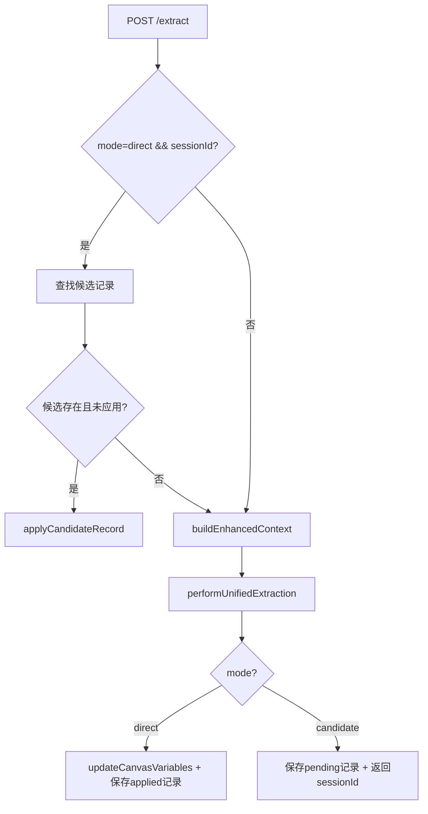
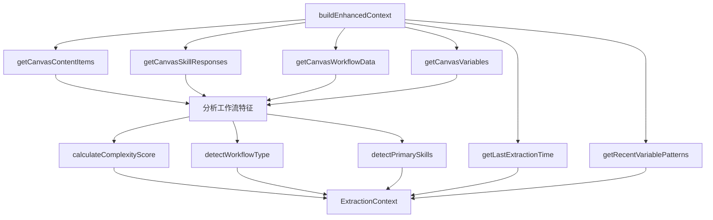

# PD-269.01 Refly — LLM 驱动工作流变量智能提取

> 文档编号：PD-269.01
> 来源：Refly `apps/api/src/modules/variable-extraction/`
> GitHub：https://github.com/refly-ai/refly.git
> 问题域：PD-269 变量提取 Variable Extraction
> 状态：可复用方案

---

## 第 1 章 问题与动机

### 1.1 核心问题

工作流画布（Canvas）中，用户以自然语言描述任务需求（如"帮我写一篇 LinkedIn 帖子，主题是 AI 对产品经理的影响"），但工作流引擎需要结构化的变量参数才能实现模板化复用。手动定义变量费时且容易遗漏，用户体验差。

核心挑战：
- **自然语言到结构化参数的鸿沟**：用户输入是非结构化文本，工作流需要 `{name, type, value}` 三元组
- **变量类型多样性**：文本（string）、文件资源（resource）、枚举选项（option）三种类型需要准确分类
- **历史变量复用**：同一画布中已有变量应优先复用，避免重复创建
- **质量与数量平衡**：提取太多变量增加用户负担，太少则丢失关键参数

### 1.2 Refly 的解法概述

Refly 构建了一个完整的 LLM 驱动变量提取管道，核心设计：

1. **双模式提取**：`direct` 模式直接写入画布变量，`candidate` 模式返回候选方案供用户确认（`variable-extraction.service.ts:103-158`）
2. **多维上下文构建**：从画布节点、已有变量、历史提取记录、工作流类型四个维度构建 LLM 提示上下文（`variable-extraction.service.ts:461-527`）
3. **Few-Shot 示例驱动**：通过 7 类场景的真实示例（旅行规划、写作、视频制作等）引导 LLM 遵循最小化提取原则（`examples.ts:1-137`）
4. **五维质量评分**：数量验证（30%）+ 极简验证（25%）+ 语法验证（20%）+ 上下文相关性（15%）+ 完整性（10%）的加权评分体系（`variable-extraction.service.ts:351-376`）
5. **Prompt 工程合规校验**：独立的 prompt 工程合规度评估，确保提取结果符合 prompt 中定义的原则（`variable-extraction.service.ts:1200-1220`）

### 1.3 设计思想

| 设计原则 | 具体实现 | 理由 | 替代方案 |
|----------|----------|------|----------|
| 极简提取 | 目标 3-6 个变量，每类型上限 10 个 | 变量过多增加用户认知负担，降低模板复用率 | 贪婪提取所有可能变量 |
| 候选确认 | candidate 模式 + sessionId 追踪 | 高风险场景需要人工确认，避免误写画布 | 全部直接写入 |
| 历史感知 | 查询最近 3 条成功提取 + 10 条变量模式 | 利用历史数据提高复用率和一致性 | 每次独立提取 |
| 增量合并 | hasVariableChanged 检测实质变更 | 避免无意义的时间戳更新，减少画布同步开销 | 全量覆盖 |
| 优雅降级 | LLM 失败返回空结果，不抛异常 | 保证服务可用性，变量提取是辅助功能 | 直接抛错 |

---

## 第 2 章 源码实现分析

### 2.1 架构概览

Refly 的变量提取模块采用 NestJS 模块化架构，核心组件关系：

```
┌─────────────────────────────────────────────────────────────────┐
│                  VariableExtractionModule                        │
│                                                                  │
│  ┌──────────────────┐    ┌──────────────────────────────────┐   │
│  │    Controller     │───→│   VariableExtractionService      │   │
│  │  POST /extract    │    │                                  │   │
│  │  POST /generate   │    │  extractVariables()              │   │
│  │  -template        │    │  ├─ buildEnhancedContext()       │   │
│  └──────────────────┘    │  ├─ performUnifiedExtraction()   │   │
│                           │  │   ├─ getHistoricalData()      │   │
│                           │  │   ├─ buildUnifiedPrompt()     │   │
│                           │  │   ├─ performLLMExtraction()   │   │
│                           │  │   └─ calculateConfidence()    │   │
│                           │  ├─ updateCanvasVariables()      │   │
│                           │  └─ saveExtractionRecord()       │   │
│                           └──────────────────────────────────┘   │
│                                    │                              │
│              ┌─────────────────────┼─────────────────────┐       │
│              ▼                     ▼                     ▼       │
│  ┌──────────────┐    ┌──────────────┐    ┌──────────────┐       │
│  │CanvasService │    │PrismaService │    │ProviderSvc   │       │
│  │(画布读写)     │    │(历史记录)     │    │(LLM 模型)    │       │
│  └──────────────┘    └──────────────┘    └──────────────┘       │
└─────────────────────────────────────────────────────────────────┘
```

数据流：用户请求 → 上下文构建 → Prompt 组装 → LLM 调用 → JSON 解析 → 质量评分 → 变量合并 → 持久化

### 2.2 核心实现

#### 2.2.1 双模式提取入口



对应源码 `variable-extraction.service.ts:103-158`：

```typescript
async extractVariables(
  user: User,
  prompt: string,
  canvasId: string,
  options: VariableExtractionOptions = {},
): Promise<VariableExtractionResult> {
  const { mode = 'direct', sessionId, triggerType = 'askAI_direct' } = options;

  // 1. 候选记录快速路径
  if (mode === 'direct' && sessionId) {
    const candidateRecord = await this.getCandidateRecord(sessionId);
    if (candidateRecord && !candidateRecord.applied) {
      return this.applyCandidateRecord(user, canvasId, candidateRecord);
    }
  }

  // 2. 多维上下文构建
  const context = await this.buildEnhancedContext(canvasId, user);

  // 3. 统一变量提取
  const extractionResult = await this.performUnifiedVariableExtraction(
    prompt, context, user, canvasId, sessionId,
  );

  // 4. 按模式处理结果
  if (mode === 'direct') {
    await this.updateCanvasVariables(user, canvasId, extractionResult.variables);
    await this.saveExtractionRecord(user, canvasId, extractionResult, {
      mode: 'direct', triggerType, model: modelName, status: 'applied',
    });
  } else {
    const finalSessionId = await this.saveExtractionRecord(user, canvasId, extractionResult, {
      mode: 'candidate', triggerType, model: modelName, status: 'pending',
    });
    extractionResult.sessionId = finalSessionId;
  }
  return extractionResult;
}
```

#### 2.2.2 多维上下文构建



对应源码 `variable-extraction.service.ts:461-527`：

```typescript
public async buildEnhancedContext(canvasId: string, user: User): Promise<ExtractionContext> {
  // 1. 获取画布内容项和技能响应
  const contentItems = await this.canvasService.getCanvasContentItems(user, canvasId, true);
  const skillResponses = await this.canvasService.getCanvasSkillResponses(user, canvasId);

  // 2. 获取工作流数据（节点、边、变量）
  const canvasData = await this.getCanvasWorkflowData(user, canvasId);
  const variables = await this.getCanvasVariables(user, canvasId);

  // 3. 智能分析画布特征
  const analysis = {
    complexity: this.calculateComplexityScore(canvasData),
    nodeCount: canvasData.nodes?.length || 0,
    variableCount: variables.length,
    resourceCount: contentItems.filter((item) => item.type === 'resource').length,
    workflowType: this.detectWorkflowType(contentItems, variables),
    primarySkills: this.detectPrimarySkills(contentItems, variables),
  };

  return {
    canvasData, variables, contentItems, skillResponses, analysis,
    extractionContext: {
      lastExtractionTime: await this.getLastExtractionTime(canvasId),
      recentVariablePatterns: await this.getRecentVariablePatterns(canvasId),
    },
  };
}
```

### 2.3 实现细节

#### Prompt 工程：Few-Shot 示例驱动的极简提取

`prompt.ts` 中的 `buildUnifiedPrompt` 构建了一个 ~300 行的系统提示，核心策略：

1. **角色定义**：`AI Workflow Variable Intelligent Extraction Expert`（`prompt.ts:21`）
2. **数量硬约束**：每类型 ≤10，目标 3-6 个总变量（`prompt.ts:52-61`）
3. **6 步提取流程**：意图理解 → 最小实体提取 → 变量分类 → 复用检测 → 命名 → 模板构建（`prompt.ts:99-137`）
4. **7 类 Few-Shot 示例**：Product Hunt 聚合、旅行规划、写作、视频制作、数据分析、健康计划等（`examples.ts:7-136`）
5. **JSON 结构化输出**：包含 `analysis`（意图/置信度/复杂度）、`variables`、`reusedVariables`、`processedPrompt` 四个顶层字段（`prompt.ts:142-200`）

#### 五维质量评分体系

`calculateEnhancedOverallScore` 方法（`variable-extraction.service.ts:351-376`）实现加权评分：

| 维度 | 权重 | 评分逻辑 |
|------|------|----------|
| 数量验证 | 30% | 每类型 ≤10 得 0.8-1.0，≤6 得满分，>10 仅 0.2 |
| 极简验证 | 25% | 总量 3-6 得 1.0，≤8 得 0.8，≤10 得 0.6，>10 得 0.3 |
| 语法验证 | 20% | 每个变量必须有 name、variableType、value 数组 |
| 上下文相关性 | 15% | 提取变量与已有变量的名称重叠度 |
| 完整性 | 10% | ≥80% 变量有 name + type + description |

#### 增量变量合并

`updateCanvasVariables`（`variable-extraction.service.ts:838-901`）实现智能合并：
- 按 `name` 匹配已有变量
- 通过 `hasVariableChanged`（`utils.ts:41-74`）比较 5 个核心字段（name, value, description, variableType, options），忽略时间戳
- 仅在有实质变更时更新 `updatedAt`，新变量添加 `createdAt` + `updatedAt`

#### LLM 响应解析的多格式兼容

`parseLLMResponse`（`variable-extraction.service.ts:694-836`）支持三种 JSON 提取模式：
```typescript
const jsonMatch =
  responseText.match(/```json\s*\n([\s\S]*?)\n\s*```/) ||  // ```json 代码块
  responseText.match(/```\s*\n([\s\S]*?)\n\s*```/) ||      // 普通代码块
  responseText.match(/\{[\s\S]*\}/) ||                       // 裸 JSON 对象
  responseText.match(/\[[\s\S]*\]/);                         // 裸 JSON 数组
```


---

## 第 3 章 迁移指南

### 3.1 迁移清单

**阶段 1：核心提取管道（必须）**

- [ ] 定义变量数据模型：`WorkflowVariable { variableId, name, value: VariableValue[], description, variableType: 'string' | 'option' | 'resource' }`
- [ ] 实现 Prompt 构建器：将用户输入 + 已有变量 + 画布上下文组装为 LLM 提示
- [ ] 实现 LLM 调用 + JSON 解析：支持多种 JSON 提取模式（代码块、裸 JSON）
- [ ] 实现 `{{variable_name}}` 占位符替换：将原始 prompt 转为模板

**阶段 2：质量保障（推荐）**

- [ ] 实现五维质量评分：数量、极简、语法、上下文、完整性
- [ ] 添加 Few-Shot 示例库：按业务场景分类，每类 2-3 个示例
- [ ] 实现变量复用检测：基于名称匹配 + 语义相似度

**阶段 3：持久化与协作（可选）**

- [ ] 实现双模式（direct/candidate）+ sessionId 追踪
- [ ] 实现历史提取记录查询（最近 N 条成功记录）
- [ ] 实现增量变量合并（hasVariableChanged 检测实质变更）

### 3.2 适配代码模板

以下是一个可独立运行的 TypeScript 变量提取核心模板：

```typescript
import { z } from 'zod';

// 1. 变量数据模型
interface VariableValue {
  type: 'text' | 'resource';
  text?: string;
  resource?: { name: string; fileType: string; storageKey: string };
}

interface WorkflowVariable {
  variableId: string;
  name: string;
  value: VariableValue[];
  description: string;
  variableType: 'string' | 'option' | 'resource';
  required?: boolean;
}

interface ExtractionResult {
  originalPrompt: string;
  processedPrompt: string;
  variables: WorkflowVariable[];
  reusedVariables: Array<{
    detectedText: string;
    reusedVariableName: string;
    confidence: number;
    reason: string;
  }>;
  extractionConfidence?: number;
}

// 2. Prompt 构建器（简化版）
function buildExtractionPrompt(
  userPrompt: string,
  existingVariables: WorkflowVariable[],
  examples: string,
): string {
  const existingVarsText = existingVariables.length > 0
    ? existingVariables.map(v => `- ${v.name} (${v.variableType}): ${v.description}`).join('\n')
    : '- No existing variables';

  return `You are a variable extraction expert.
Extract workflow variables from user input. Return JSON with:
- variables: array of {name, value, description, variableType, required, confidence}
- reusedVariables: array of reused existing variables
- processedPrompt: original prompt with {{variable_name}} placeholders

Existing variables:\n${existingVarsText}

User input: ${userPrompt}

${examples}

Return valid JSON only.`;
}

// 3. LLM 响应解析（多格式兼容）
function parseLLMResponse(responseText: string): ExtractionResult | null {
  const jsonMatch =
    responseText.match(/```json\s*\n([\s\S]*?)\n\s*```/) ||
    responseText.match(/```\s*\n([\s\S]*?)\n\s*```/) ||
    responseText.match(/\{[\s\S]*\}/);

  if (!jsonMatch) return null;

  const jsonText = jsonMatch[1] || jsonMatch[0];
  const parsed = JSON.parse(jsonText);

  if (!parsed.variables || !Array.isArray(parsed.variables)) return null;

  return {
    originalPrompt: parsed.originalPrompt || '',
    processedPrompt: parsed.processedPrompt || '',
    variables: parsed.variables.map((v: any, i: number) => ({
      variableId: `var_${Date.now()}_${i}`,
      name: v.name || `var_${i + 1}`,
      value: Array.isArray(v.value)
        ? v.value.map((val: any) =>
            typeof val === 'string' ? { type: 'text', text: val } : val
          )
        : [{ type: 'text', text: '' }],
      description: v.description || '',
      variableType: v.variableType || 'string',
      required: v.required ?? true,
    })),
    reusedVariables: parsed.reusedVariables || [],
  };
}

// 4. 五维质量评分（简化版）
function calculateQualityScore(result: ExtractionResult): number {
  const vars = result.variables;
  if (vars.length === 0) return 0;

  // 数量验证 (30%)
  const quantityScore = vars.length <= 6 ? 1.0 : vars.length <= 10 ? 0.8 : 0.3;

  // 极简验证 (25%)
  const minimalistScore = vars.length >= 3 && vars.length <= 6 ? 1.0
    : vars.length <= 8 ? 0.8 : 0.6;

  // 语法验证 (20%)
  const syntaxScore = vars.every(v => v.name && v.variableType && Array.isArray(v.value)) ? 1 : 0;

  // 完整性 (10%)
  const completeCount = vars.filter(v => v.name && v.variableType && v.description).length;
  const completenessScore = completeCount / vars.length >= 0.8 ? 1 : 0;

  return quantityScore * 0.3 + minimalistScore * 0.25 + syntaxScore * 0.2
    + 0.15 + completenessScore * 0.1; // 上下文相关性默认 1.0
}

// 5. 增量变量合并
function mergeVariables(
  existing: WorkflowVariable[],
  extracted: WorkflowVariable[],
): WorkflowVariable[] {
  const merged = [...existing];
  for (const newVar of extracted) {
    const idx = merged.findIndex(v => v.name === newVar.name);
    if (idx >= 0) {
      // 检测实质变更
      const old = merged[idx];
      if (old.value !== newVar.value || old.description !== newVar.description
          || old.variableType !== newVar.variableType) {
        merged[idx] = { ...newVar, variableId: old.variableId };
      }
    } else {
      merged.push(newVar);
    }
  }
  return merged;
}
```

### 3.3 适用场景

| 场景 | 适用度 | 说明 |
|------|--------|------|
| 工作流/自动化平台 | ⭐⭐⭐ | 核心场景，用户自然语言描述任务，系统自动参数化 |
| 表单智能生成 | ⭐⭐⭐ | 从需求描述自动生成表单字段，类似变量提取 |
| Prompt 模板化 | ⭐⭐⭐ | 将一次性 prompt 转为可复用的 `{{var}}` 模板 |
| 低代码平台 | ⭐⭐ | 从用户描述提取配置参数，但需适配不同组件类型 |
| 聊天机器人意图提取 | ⭐⭐ | 可借鉴变量分类和质量评分，但对话场景更动态 |
| 静态配置解析 | ⭐ | 结构已知的配置不需要 LLM 提取 |

---

## 第 4 章 测试用例

```typescript
import { describe, it, expect, vi, beforeEach } from 'vitest';

// 模拟 parseLLMResponse 和 calculateQualityScore
// 基于 variable-extraction.service.ts 的真实函数签名

describe('Variable Extraction Core', () => {
  describe('parseLLMResponse', () => {
    it('should parse JSON from ```json code block', () => {
      const response = '```json\n{"variables":[{"name":"topic","value":["AI"],"variableType":"string","description":"Article topic"}],"reusedVariables":[],"processedPrompt":"Write about {{topic}}"}\n```';
      const result = parseLLMResponse(response);
      expect(result).not.toBeNull();
      expect(result!.variables).toHaveLength(1);
      expect(result!.variables[0].name).toBe('topic');
      expect(result!.variables[0].variableType).toBe('string');
    });

    it('should parse bare JSON object', () => {
      const response = '{"variables":[{"name":"dest","value":["Tokyo"],"variableType":"string"}],"reusedVariables":[]}';
      const result = parseLLMResponse(response);
      expect(result).not.toBeNull();
      expect(result!.variables[0].name).toBe('dest');
    });

    it('should return null for non-JSON response', () => {
      const response = 'I cannot extract variables from this input.';
      const result = parseLLMResponse(response);
      expect(result).toBeNull();
    });

    it('should convert string[] values to VariableValue[]', () => {
      const response = '{"variables":[{"name":"topic","value":["AI","ML"],"variableType":"string"}],"reusedVariables":[]}';
      const result = parseLLMResponse(response);
      expect(result!.variables[0].value).toEqual([
        { type: 'text', text: 'AI' },
        { type: 'text', text: 'ML' },
      ]);
    });
  });

  describe('calculateQualityScore', () => {
    it('should return 0 for empty variables', () => {
      const result: ExtractionResult = {
        originalPrompt: '', processedPrompt: '',
        variables: [], reusedVariables: [],
      };
      expect(calculateQualityScore(result)).toBe(0);
    });

    it('should give high score for 3-6 well-formed variables', () => {
      const result: ExtractionResult = {
        originalPrompt: 'test', processedPrompt: '{{topic}} {{style}}',
        variables: [
          { variableId: '1', name: 'topic', value: [{ type: 'text', text: 'AI' }], description: 'Topic', variableType: 'string' },
          { variableId: '2', name: 'style', value: [{ type: 'text', text: 'formal' }], description: 'Style', variableType: 'option' },
          { variableId: '3', name: 'length', value: [{ type: 'text', text: '500' }], description: 'Length', variableType: 'string' },
        ],
        reusedVariables: [],
      };
      const score = calculateQualityScore(result);
      expect(score).toBeGreaterThan(0.8);
    });

    it('should penalize >10 variables', () => {
      const manyVars = Array.from({ length: 12 }, (_, i) => ({
        variableId: `${i}`, name: `var_${i}`,
        value: [{ type: 'text' as const, text: '' }],
        description: `Var ${i}`, variableType: 'string' as const,
      }));
      const result: ExtractionResult = {
        originalPrompt: '', processedPrompt: '',
        variables: manyVars, reusedVariables: [],
      };
      const score = calculateQualityScore(result);
      expect(score).toBeLessThan(0.7);
    });
  });

  describe('hasVariableChanged (utils.ts:41-74)', () => {
    it('should detect name change', () => {
      const oldVar = { variableId: '1', name: 'topic', value: [], description: '', variableType: 'string' as const };
      const newVar = { ...oldVar, name: 'subject' };
      expect(hasVariableChanged(newVar, oldVar)).toBe(true);
    });

    it('should ignore timestamp-only changes', () => {
      const base = { variableId: '1', name: 'topic', value: [{ type: 'text' as const, text: 'AI' }], description: 'Topic', variableType: 'string' as const };
      const withTimestamp = { ...base, createdAt: '2024-01-01', updatedAt: '2024-06-01' };
      expect(hasVariableChanged(base, withTimestamp)).toBe(false);
    });

    it('should detect value array length change', () => {
      const oldVar = { variableId: '1', name: 'opts', value: [{ type: 'text' as const, text: 'a' }], description: '', variableType: 'option' as const, options: ['a'] };
      const newVar = { ...oldVar, options: ['a', 'b'] };
      expect(hasVariableChanged(newVar, oldVar)).toBe(true);
    });
  });
});
```


---

## 第 5 章 跨域关联

| 关联域 | 关系类型 | 说明 |
|--------|----------|------|
| PD-01 上下文管理 | 依赖 | `buildEnhancedContext` 需要从画布收集多维上下文，上下文窗口大小直接影响 Few-Shot 示例数量 |
| PD-04 工具系统 | 协同 | 变量提取本身可作为工作流引擎的一个"工具"注册，Refly 通过 NestJS Module 导出 Service 供其他模块调用 |
| PD-06 记忆持久化 | 依赖 | 历史提取记录（`variableExtractionHistory` 表）和变量模式（`getRecentVariablePatterns`）依赖持久化层 |
| PD-07 质量检查 | 协同 | 五维质量评分体系是变量提取的内置质量门控，`calculateOverallConfidence` 综合多维度评估 |
| PD-09 Human-in-the-Loop | 协同 | `candidate` 模式实现了人机协作：LLM 提取候选 → 用户确认 → 应用到画布 |
| PD-10 中间件管道 | 协同 | 提取流程本身是一个管道：上下文构建 → Prompt 组装 → LLM 调用 → 解析 → 评分 → 合并 |
| PD-12 推理增强 | 依赖 | Few-Shot 示例和结构化输出（Zod schema for APP template）是推理增强的具体应用 |

---

## 第 6 章 来源文件索引

| 文件 | 行范围 | 关键实现 |
|------|--------|----------|
| `apps/api/src/modules/variable-extraction/variable-extraction.service.ts` | L1-L1451 | 核心服务：双模式提取、上下文构建、LLM 调用、质量评分、变量合并 |
| `apps/api/src/modules/variable-extraction/prompt.ts` | L1-L400 | 统一 Prompt 构建器：`buildUnifiedPrompt` + 上下文/历史格式化 |
| `apps/api/src/modules/variable-extraction/app-publish-prompt.ts` | L1-L549 | APP 发布模板 Prompt：`buildAppPublishPrompt` + 变量名精确匹配规则 |
| `apps/api/src/modules/variable-extraction/examples.ts` | L1-L337 | 7 类 Few-Shot 示例：PH 聚合、旅行、写作、视频、数据分析、健康计划 |
| `apps/api/src/modules/variable-extraction/variable-extraction.dto.ts` | L1-L150 | 类型定义：ExtractionContext、CanvasData、CanvasAnalysis、CandidateRecord 等 |
| `apps/api/src/modules/variable-extraction/utils.ts` | L1-L75 | 工具函数：addTimestampsToNewVariable、updateTimestampForVariable、hasVariableChanged |
| `apps/api/src/modules/variable-extraction/variable-extraction.controller.ts` | L1-L41 | REST API：POST /extract、POST /generate-template |
| `apps/api/src/modules/variable-extraction/variable-extraction.module.ts` | L1-L16 | NestJS 模块定义：依赖 Canvas、CanvasSync、Provider 模块 |

---

## 第 7 章 横向对比维度

```json comparison_data
{
  "project": "Refly",
  "dimensions": {
    "提取策略": "LLM + Few-Shot 示例驱动极简提取，目标 3-6 变量",
    "变量类型体系": "三类型：string/resource/option，VariableValue 统一值结构",
    "质量评估": "五维加权评分：数量30%+极简25%+语法20%+上下文15%+完整性10%",
    "历史复用": "Prisma 查询最近 3 条成功记录 + 10 条变量模式，语义复用检测",
    "人机协作": "candidate 模式 + sessionId 追踪，支持用户确认后再应用",
    "模板生成": "Zod schema 结构化输出 + 变量名精确匹配校验",
    "容错设计": "LLM 失败返回空结果，多格式 JSON 解析兼容"
  }
}
```

```json domain_metadata
{
  "solution_summary": "Refly 用 LLM + Few-Shot 示例驱动极简变量提取管道，五维加权质量评分 + candidate/direct 双模式 + Prisma 历史复用，从自然语言工作流描述中提取 3-6 个结构化变量",
  "description": "LLM 驱动的自然语言到结构化工作流参数的自动转换",
  "sub_problems": [
    "LLM 响应多格式 JSON 解析兼容",
    "变量占位符模板生成与原文语义保持",
    "APP 发布场景的模板变量名精确匹配"
  ],
  "best_practices": [
    "Few-Shot 示例按业务场景分类引导极简提取",
    "五维加权质量评分替代单一置信度",
    "candidate/direct 双模式支持不同风险等级场景"
  ]
}
```

