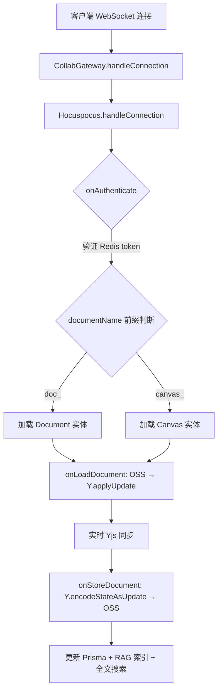
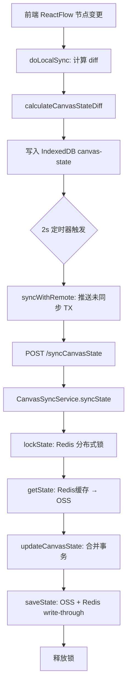
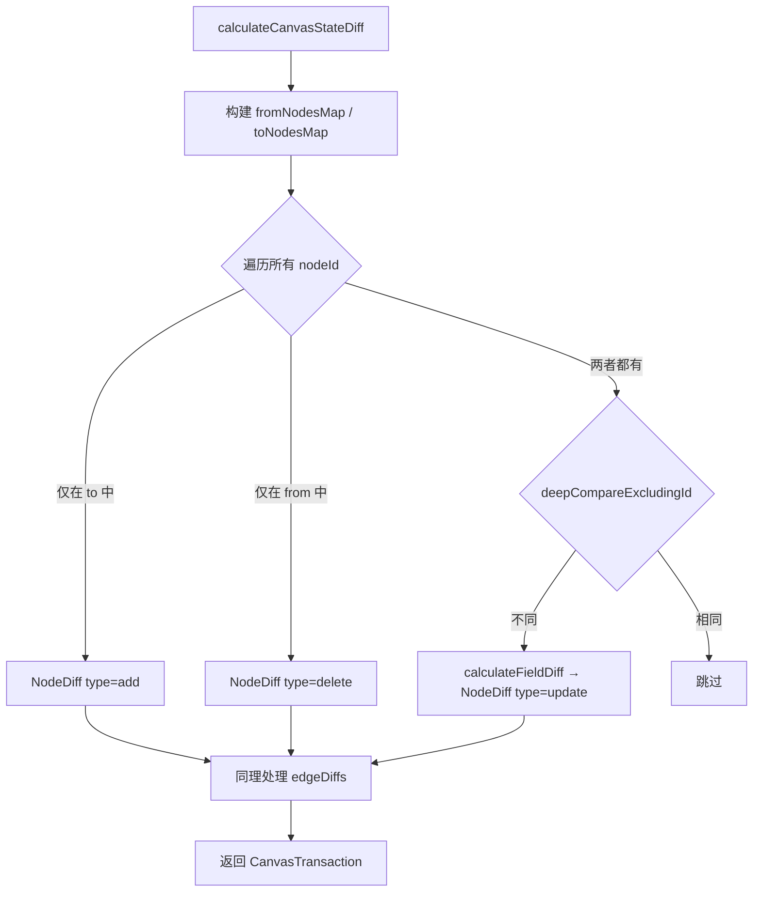

# PD-270.01 Refly — 双轨协作编辑与事务化画布同步

> 文档编号：PD-270.01
> 来源：Refly `apps/api/src/modules/collab/`, `packages/canvas-common/src/sync.ts`
> GitHub：https://github.com/refly-ai/refly.git
> 问题域：PD-270 协作编辑 Collaborative Editing
> 状态：可复用方案

---

## 第 1 章 问题与动机（≥ 30 行）

### 1.1 核心问题

协作编辑系统需要解决三个根本矛盾：

1. **实时性 vs 一致性**：多用户同时编辑同一文档时，如何在保证低延迟的同时确保最终一致性？
2. **文档编辑 vs 画布编辑**：富文本文档（ProseMirror）和节点画布（ReactFlow）是两种完全不同的数据模型，如何用统一架构支持两者的协同？
3. **在线 vs 离线**：用户断网后继续编辑，重新上线时如何无损合并？

传统 OT（Operational Transformation）算法需要中心化的变换服务器，实现复杂且难以扩展。CRDT（Conflict-free Replicated Data Type）提供了去中心化的替代方案，但直接用 CRDT 处理画布节点图的增删改查并不自然。

### 1.2 Refly 的解法概述

Refly 采用**双轨架构**，针对两种编辑场景使用不同的同步策略：

1. **文档编辑轨（Yjs + Hocuspocus）**：基于 Yjs CRDT 协议，通过 Hocuspocus 服务端处理 WebSocket 连接、认证、文档加载和持久化。前端使用 `HocuspocusProvider` + `IndexeddbPersistence` 实现双层缓存（`packages/ai-workspace-common/src/context/document.tsx:134-155`）。
2. **画布同步轨（Transaction-based State Sync）**：自研事务化状态同步协议，将画布操作抽象为 `CanvasTransaction`（含 `nodeDiffs` + `edgeDiffs`），通过 HTTP 轮询 + Redis 分布式锁实现同步（`apps/api/src/modules/canvas-sync/canvas-sync.service.ts:357-412`）。
3. **双轨桥接**：当画布仍使用旧版 Yjs 同步时，`syncCanvasStateFromYDoc` 方法将 YDoc 数据转换为事务化状态，实现向后兼容（`collab.service.ts:293-301`）。
4. **冲突解决**：文档轨依赖 Yjs CRDT 自动合并；画布轨通过版本号 + 事务 ID 集合对比检测冲突，冲突时弹出 UI 让用户选择本地或远程版本（`packages/ai-workspace-common/src/context/canvas.tsx:280-335`）。
5. **版本快照**：画布状态超过 100 条事务或 1 小时未快照时自动创建新版本，压缩事务历史（`packages/canvas-common/src/sync.ts:100-113`）。

### 1.3 设计思想

| 设计原则 | 具体实现 | 理由 | 替代方案 |
|----------|----------|------|----------|
| 双轨分治 | 文档用 Yjs CRDT，画布用事务化同步 | 文档是线性文本适合 CRDT；画布是图结构适合 diff-based 事务 | 全部用 Yjs（画布节点操作不自然） |
| 乐观更新 + 后台同步 | 前端 IndexedDB 先写，2s 间隔推送远端 | 用户体验零延迟，网络抖动不影响编辑 | 每次操作等服务端确认（延迟高） |
| 分布式锁保护写入 | Redis `waitLock` + 指数退避重试 | 防止并发写入导致状态覆盖 | 数据库行锁（性能差） |
| 版本快照压缩 | 100 条事务或 1 小时触发新版本 | 防止事务列表无限增长，加速状态重放 | 定时全量快照（浪费存储） |
| 向后兼容双写 | Yjs → Transaction 桥接 | 平滑迁移旧版画布同步协议 | 强制升级（破坏用户数据） |

---

## 第 2 章 源码实现分析（≥ 60 行，核心章节）

### 2.1 架构概览

Refly 的协作编辑系统分为三层：

```
┌─────────────────────────────────────────────────────────────────┐
│                        前端 (React)                              │
│  ┌──────────────────────┐    ┌────────────────────────────────┐ │
│  │  DocumentProvider     │    │  CanvasProvider                │ │
│  │  ├─ HocuspocusProvider│    │  ├─ IndexedDB (local state)   │ │
│  │  ├─ IndexeddbPersist  │    │  ├─ HTTP sync (2s interval)   │ │
│  │  └─ Y.Doc (title+body)│   │  ├─ TX polling (3s interval)  │ │
│  └──────────┬───────────┘    │  └─ Conflict resolution UI     │ │
│             │ WebSocket       └──────────────┬────────────────┘ │
└─────────────┼────────────────────────────────┼──────────────────┘
              │                                │ HTTP
┌─────────────┼────────────────────────────────┼──────────────────┐
│             ▼          后端 (NestJS)          ▼                  │
│  ┌──────────────────────┐    ┌────────────────────────────────┐ │
│  │  CollabGateway (WS)   │    │  CanvasSyncService             │ │
│  │  └─ CollabService     │    │  ├─ lockState (Redis lock)    │ │
│  │     ├─ Hocuspocus     │    │  ├─ syncState (apply TX)      │ │
│  │     ├─ authenticate   │    │  ├─ createCanvasVersion       │ │
│  │     ├─ loadDocument   │    │  ├─ mergeCanvasStates         │ │
│  │     └─ storeDocument  │    │  └─ saveState (OSS + Redis)   │ │
│  └──────────────────────┘    └────────────────────────────────┘ │
│                                                                  │
│  ┌──────────────────────────────────────────────────────────────┐│
│  │  存储层: Redis (锁+缓存) │ OSS (状态持久化) │ Prisma (元数据) ││
│  └──────────────────────────────────────────────────────────────┘│
└──────────────────────────────────────────────────────────────────┘
```

### 2.2 核心实现

#### 2.2.1 文档协作轨：Hocuspocus + Yjs



对应源码 `apps/api/src/modules/collab/collab.service.ts:32-59`：

```typescript
@Injectable()
export class CollabService {
  private server: Hocuspocus;

  constructor(
    private rag: RAGService,
    private prisma: PrismaService,
    private redis: RedisService,
    private config: ConfigService,
    private canvasSync: CanvasSyncService,
    @Inject(OSS_INTERNAL) private oss: ObjectStorageService,
    @Inject(FULLTEXT_SEARCH) private fts: FulltextSearchService,
    @Optional() @InjectQueue(QUEUE_SYNC_CANVAS_ENTITY) private canvasQueue?: Queue,
  ) {
    const extensions = [];
    if (!isDesktop()) {
      extensions.push(new Redis({ redis: this.redis.getClient() }));
    }

    this.server = Server.configure({
      port: this.config.get<number>('wsPort'),
      onAuthenticate: (payload) => this.authenticate(payload),
      onLoadDocument: (payload) => this.loadDocument(payload),
      onStoreDocument: (payload) => this.storeDocument(payload),
      extensions,
    });
  }
}
```

关键设计点：
- **Redis 扩展**：非桌面端启用 `@hocuspocus/extension-redis`，实现多实例间 Yjs 文档同步（`collab.service.ts:48-49`）
- **认证分流**：桌面端直接使用本地 UID，云端通过 Redis 短期 token 验证（`collab.service.ts:78-126`）
- **实体类型路由**：通过 `documentName` 的 ID 前缀（`doc_` / `canvas_`）区分文档和画布（`collab.service.ts:100-118`）

#### 2.2.2 画布同步轨：事务化状态同步



对应源码 `apps/api/src/modules/canvas-sync/canvas-sync.service.ts:357-412`：

```typescript
async syncState(
  user: User,
  param: SyncCanvasStateRequest,
  options?: { releaseLock?: LockReleaseFn },
): Promise<SyncCanvasStateResult> {
  const { canvasId, transactions, version } = param;
  // ... version lookup ...

  const releaseLock: LockReleaseFn = options?.releaseLock ?? (await this.lockState(canvasId));

  try {
    const state = await this.getState(user, { canvasId, version: versionToSync });
    const stampedTransactions = (transactions ?? []).map((tx) => ({
      ...tx,
      syncedAt: tx?.syncedAt ?? Date.now(),
    }));
    updateCanvasState(state, stampedTransactions);
    state.updatedAt = Date.now();
    await this.saveState(canvasId, state);

    return { transactions: stampedTransactions };
  } finally {
    await releaseLock();
  }
}
```

#### 2.2.3 事务 Diff 计算引擎



对应源码 `packages/canvas-common/src/diff.ts:190-298`：

```typescript
export const calculateCanvasStateDiff = (
  from: CanvasData,
  to: CanvasData,
): CanvasTransaction | null => {
  const nodeDiffs: NodeDiff[] = [];
  const edgeDiffs: EdgeDiff[] = [];

  const fromNodesMap = new Map<string, CanvasNode>();
  const toNodesMap = new Map<string, CanvasNode>();
  // ... populate maps ...

  const allNodeIds = new Set([...fromNodesMap.keys(), ...toNodesMap.keys()]);
  for (const nodeId of allNodeIds) {
    if (nodeId.startsWith('ghost-')) continue; // 忽略幽灵节点

    const fromNode = fromNodesMap.get(nodeId);
    const toNode = toNodesMap.get(nodeId);

    if (!fromNode && toNode) {
      nodeDiffs.push({ id: nodeId, type: 'add', to: { ...toNode, selected: undefined } });
    } else if (fromNode && !toNode) {
      nodeDiffs.push({ id: nodeId, type: 'delete', from: fromNode });
    } else if (fromNode && toNode && !deepCompareExcludingId(fromNode, toNode)) {
      const fieldDiff = calculateFieldDiff('node', fromNode, toNode);
      if (fieldDiff) {
        nodeDiffs.push({ id: nodeId, type: 'update', from: fieldDiff.before, to: fieldDiff.after });
      }
    }
  }
  // ... edge diffs similar ...
  return { txId: genTransactionId(), nodeDiffs, edgeDiffs, createdAt: Date.now() };
};
```

### 2.3 实现细节

**Singleflight 模式防止缓存击穿**（`canvas-sync.service.ts:53-54, 266-291`）：

`CanvasSyncService` 使用 `inflightStateLoads` Map 实现 singleflight 模式——当多个并发请求同时读取同一画布版本的状态时，只有第一个请求会真正访问 OSS，后续请求复用同一个 Promise。这避免了 Redis 缓存未命中时的"惊群效应"。

**版本快照与事务压缩**（`packages/canvas-common/src/sync.ts:100-113`）：

```typescript
export const shouldCreateNewVersion = (state: CanvasState): boolean => {
  const lastTransaction = getLastTransaction(state);
  if (!lastTransaction) return false;
  return (
    (state.transactions?.length ?? 0) > MAX_STATE_TX_COUNT || // > 100 条事务
    lastTransaction.createdAt < Date.now() - MAX_VERSION_AGE   // > 1 小时
  );
};
```

**冲突合并策略**（`packages/canvas-common/src/sync.ts:352-487`）：

`mergeCanvasStates` 实现三级合并规则：
1. 版本不同 → 抛出 `CanvasConflictException('version')`
2. 版本相同、事务完全相同 → 直接返回
3. 版本相同、事务不同 → 检查是否有相同节点/边被不同事务修改：
   - 无冲突 → 合并事务列表
   - 有冲突 → 抛出 `CanvasConflictException('node'|'edge')`

**前端双层缓存与轮询**（`packages/ai-workspace-common/src/context/canvas.tsx:460-483, 725-802`）：

- 本地同步：200ms 防抖，将 ReactFlow 节点变更计算为 diff 写入 IndexedDB
- 远程推送：2s 间隔，将未同步事务推送到服务端
- 远程拉取：3s 间隔轮询服务端新事务，每 5 次做一次全量一致性检查

---

## 第 3 章 迁移指南（≥ 40 行）

### 3.1 迁移清单

**阶段 1：文档协作轨（Yjs + Hocuspocus）**

- [ ] 安装依赖：`yjs`, `@hocuspocus/server`, `@hocuspocus/extension-redis`, `@hocuspocus/provider`, `y-prosemirror`, `y-indexeddb`
- [ ] 实现 WebSocket Gateway，委托 Hocuspocus 处理连接
- [ ] 实现认证钩子：签发短期 token 存入 Redis，连接时验证
- [ ] 实现 `onLoadDocument`：从对象存储加载 Yjs 状态二进制
- [ ] 实现 `onStoreDocument`：编码 Yjs 状态并持久化到对象存储
- [ ] 前端创建 `HocuspocusProvider` + `IndexeddbPersistence` 双层 Provider

**阶段 2：画布同步轨（Transaction-based）**

- [ ] 定义 `CanvasState` 数据结构：`{ version, nodes, edges, transactions, history }`
- [ ] 实现 `calculateCanvasStateDiff`：基于节点/边 ID 的三路 diff（add/update/delete）
- [ ] 实现 `applyCanvasTransaction`：正向/反向应用事务（支持 undo/redo）
- [ ] 实现 `mergeCanvasStates`：三级冲突检测与合并
- [ ] 后端实现 `syncState`：Redis 分布式锁 + 事务合并 + OSS 持久化
- [ ] 后端实现 `createCanvasVersion`：版本快照压缩
- [ ] 前端实现 IndexedDB 本地状态 + 定时远程同步 + 事务轮询

**阶段 3：向后兼容桥接**

- [ ] 实现 `syncCanvasStateFromYDoc`：将 Yjs 文档转换为事务化状态
- [ ] 双写逻辑：旧版画布同时写入 Yjs 和事务化状态

### 3.2 适配代码模板

**最小化画布事务同步服务（TypeScript + NestJS）：**

```typescript
import { Injectable } from '@nestjs/common';
import { RedisService } from './redis.service';

interface CanvasTransaction {
  txId: string;
  nodeDiffs: Array<{ type: 'add' | 'update' | 'delete'; id: string; from?: any; to?: any }>;
  edgeDiffs: Array<{ type: 'add' | 'update' | 'delete'; id: string; from?: any; to?: any }>;
  createdAt: number;
  syncedAt?: number;
}

interface CanvasState {
  version: string;
  nodes: any[];
  edges: any[];
  transactions: CanvasTransaction[];
  history: Array<{ version: string; timestamp: number }>;
  createdAt: number;
  updatedAt: number;
}

@Injectable()
export class CanvasSyncService {
  constructor(private redis: RedisService) {}

  async syncState(canvasId: string, transactions: CanvasTransaction[]): Promise<void> {
    const lockKey = `canvas-sync:${canvasId}`;
    const releaseLock = await this.redis.waitLock(lockKey, { ttlSeconds: 10 });

    try {
      const state = await this.loadState(canvasId);
      const txMap = new Map(state.transactions.map((tx) => [tx.txId, tx]));

      for (const tx of transactions) {
        tx.syncedAt = tx.syncedAt ?? Date.now();
        if (txMap.has(tx.txId)) {
          const idx = state.transactions.findIndex((t) => t.txId === tx.txId);
          if (idx !== -1) state.transactions[idx] = tx;
        } else {
          state.transactions.push(tx);
        }
      }

      state.transactions.sort((a, b) => a.createdAt - b.createdAt);
      state.updatedAt = Date.now();
      await this.saveState(canvasId, state);
    } finally {
      await releaseLock();
    }
  }

  private async loadState(canvasId: string): Promise<CanvasState> {
    // 实现：Redis 缓存 → 对象存储 fallback
    throw new Error('implement me');
  }

  private async saveState(canvasId: string, state: CanvasState): Promise<void> {
    // 实现：写入对象存储 + Redis write-through 缓存
    throw new Error('implement me');
  }
}
```

### 3.3 适用场景

| 场景 | 适用度 | 说明 |
|------|--------|------|
| 富文本文档协同编辑 | ⭐⭐⭐ | Yjs + Hocuspocus 是成熟方案，直接复用 |
| 画布/白板节点协同 | ⭐⭐⭐ | 事务化 diff 比 Yjs Array 更适合图结构 |
| 离线优先应用 | ⭐⭐⭐ | IndexedDB 本地状态 + 后台同步天然支持 |
| 高并发实时协作（>50人） | ⭐⭐ | 画布轨基于 HTTP 轮询，延迟较 WebSocket 高 |
| 纯文本编辑器 | ⭐ | 过度设计，简单场景用 Yjs 即可 |

---

## 第 4 章 测试用例（≥ 20 行）

```typescript
import { calculateCanvasStateDiff } from './diff';
import { applyCanvasTransaction, mergeCanvasStates, shouldCreateNewVersion, CanvasConflictException } from './sync';

describe('CanvasStateDiff', () => {
  const baseNode = { id: 'n1', type: 'skill', position: { x: 0, y: 0 }, data: { title: 'A' } };

  test('detect node addition', () => {
    const from = { nodes: [], edges: [] };
    const to = { nodes: [baseNode], edges: [] };
    const diff = calculateCanvasStateDiff(from, to);
    expect(diff).not.toBeNull();
    expect(diff!.nodeDiffs).toHaveLength(1);
    expect(diff!.nodeDiffs[0].type).toBe('add');
    expect(diff!.nodeDiffs[0].id).toBe('n1');
  });

  test('detect node deletion', () => {
    const from = { nodes: [baseNode], edges: [] };
    const to = { nodes: [], edges: [] };
    const diff = calculateCanvasStateDiff(from, to);
    expect(diff!.nodeDiffs[0].type).toBe('delete');
  });

  test('detect node update (title change)', () => {
    const updated = { ...baseNode, data: { title: 'B' } };
    const from = { nodes: [baseNode], edges: [] };
    const to = { nodes: [updated], edges: [] };
    const diff = calculateCanvasStateDiff(from, to);
    expect(diff!.nodeDiffs[0].type).toBe('update');
  });

  test('ignore ghost nodes', () => {
    const ghost = { id: 'ghost-1', type: 'ghost', position: { x: 0, y: 0 }, data: {} };
    const from = { nodes: [], edges: [] };
    const to = { nodes: [ghost], edges: [] };
    const diff = calculateCanvasStateDiff(from, to);
    expect(diff).toBeNull();
  });
});

describe('mergeCanvasStates', () => {
  const baseState = {
    version: 'v1',
    nodes: [],
    edges: [],
    transactions: [],
    history: [],
    createdAt: Date.now(),
    updatedAt: Date.now(),
  };

  test('identical states return local', () => {
    const result = mergeCanvasStates(baseState, { ...baseState });
    expect(result.version).toBe('v1');
  });

  test('different versions throw conflict', () => {
    expect(() =>
      mergeCanvasStates(baseState, { ...baseState, version: 'v2' }),
    ).toThrow(CanvasConflictException);
  });

  test('non-overlapping transactions merge successfully', () => {
    const localTx = { txId: 'tx1', nodeDiffs: [{ id: 'n1', type: 'add' }], edgeDiffs: [], createdAt: 1 };
    const remoteTx = { txId: 'tx2', nodeDiffs: [{ id: 'n2', type: 'add' }], edgeDiffs: [], createdAt: 2 };
    const local = { ...baseState, transactions: [localTx] };
    const remote = { ...baseState, transactions: [remoteTx] };
    const merged = mergeCanvasStates(local, remote);
    expect(merged.transactions).toHaveLength(2);
  });

  test('overlapping node modifications throw conflict', () => {
    const localTx = { txId: 'tx1', nodeDiffs: [{ id: 'n1', type: 'update' }], edgeDiffs: [], createdAt: 1 };
    const remoteTx = { txId: 'tx2', nodeDiffs: [{ id: 'n1', type: 'update' }], edgeDiffs: [], createdAt: 2 };
    const local = { ...baseState, transactions: [localTx] };
    const remote = { ...baseState, transactions: [remoteTx] };
    expect(() => mergeCanvasStates(local, remote)).toThrow(CanvasConflictException);
  });
});

describe('shouldCreateNewVersion', () => {
  test('returns true when transactions exceed 100', () => {
    const txs = Array.from({ length: 101 }, (_, i) => ({
      txId: `tx${i}`, nodeDiffs: [], edgeDiffs: [], createdAt: Date.now(),
    }));
    expect(shouldCreateNewVersion({ version: 'v1', nodes: [], edges: [], transactions: txs, history: [] })).toBe(true);
  });

  test('returns true when last tx older than 1 hour', () => {
    const oldTx = { txId: 'tx1', nodeDiffs: [], edgeDiffs: [], createdAt: Date.now() - 3600001 };
    expect(shouldCreateNewVersion({ version: 'v1', nodes: [], edges: [], transactions: [oldTx], history: [] })).toBe(true);
  });
});
```

---

## 第 5 章 跨域关联

| 关联域 | 关系类型 | 说明 |
|--------|----------|------|
| PD-06 记忆持久化 | 协同 | 文档存储使用 OSS + Prisma 双写，画布状态使用 OSS + Redis write-through 缓存，与记忆持久化共享存储层设计 |
| PD-08 搜索与检索 | 依赖 | `storeDocumentEntity` 在文档保存时同步更新全文搜索索引（Elasticsearch）和向量索引（RAG），协作编辑是搜索数据的上游 |
| PD-03 容错与重试 | 协同 | Redis 分布式锁使用指数退避重试（`waitLock`），前端同步失败计数超过 5 次弹出重载提示，体现容错设计 |
| PD-09 Human-in-the-Loop | 协同 | 画布版本冲突时弹出 Modal 让用户选择本地/远程版本，是典型的 HITL 交互模式 |
| PD-11 可观测性 | 协同 | 冲突事件通过 `logEvent('canvas::conflict_version')` 上报遥测，同步失败计数用于触发用户告警 |

---

## 第 6 章 来源文件索引

| 文件 | 行范围 | 关键实现 |
|------|--------|----------|
| `apps/api/src/modules/collab/collab.gateway.ts` | L1-13 | WebSocket Gateway 入口，委托 CollabService |
| `apps/api/src/modules/collab/collab.service.ts` | L32-59 | Hocuspocus 服务端配置（认证、加载、存储钩子） |
| `apps/api/src/modules/collab/collab.service.ts` | L65-76 | Redis 短期 token 签发与验证 |
| `apps/api/src/modules/collab/collab.service.ts` | L78-126 | 认证流程：token 验证 + 实体类型路由 + 权限检查 |
| `apps/api/src/modules/collab/collab.service.ts` | L128-164 | 文档加载：OSS → Y.applyUpdate |
| `apps/api/src/modules/collab/collab.service.ts` | L166-241 | 文档存储：Yjs → Markdown → OSS + Prisma + RAG + FTS |
| `apps/api/src/modules/collab/collab.service.ts` | L243-313 | 画布存储：清理遗留节点 + 双写桥接 + BullMQ 去重 |
| `apps/api/src/modules/collab/collab.service.ts` | L335-408 | 画布文档清理：Redis 锁 + pLimit(5) 并发控制 |
| `apps/api/src/modules/collab/collab.dto.ts` | L1-35 | CollabContext 类型定义与类型守卫 |
| `apps/api/src/modules/canvas-sync/canvas-sync.service.ts` | L49-67 | CanvasSyncService 构造：singleflight Map + Redis 缓存 TTL |
| `apps/api/src/modules/canvas-sync/canvas-sync.service.ts` | L106-157 | saveState：OSS 持久化 + Redis write-through + toolset 提取 |
| `apps/api/src/modules/canvas-sync/canvas-sync.service.ts` | L164-291 | getState：Redis 缓存 → singleflight → OSS fallback |
| `apps/api/src/modules/canvas-sync/canvas-sync.service.ts` | L323-349 | lockState：Redis 分布式锁 + 指数退避 |
| `apps/api/src/modules/canvas-sync/canvas-sync.service.ts` | L357-412 | syncState：锁保护下的事务合并与持久化 |
| `apps/api/src/modules/canvas-sync/canvas-sync.service.ts` | L420-459 | syncCanvasStateFromYDoc：Yjs → 事务化状态桥接 |
| `apps/api/src/modules/canvas-sync/canvas-sync.service.ts` | L601-711 | createCanvasVersion：版本快照 + 冲突检测 + Prisma 事务 |
| `packages/canvas-common/src/sync.ts` | L27-93 | initEmptyCanvasState：初始画布状态工厂 |
| `packages/canvas-common/src/sync.ts` | L100-113 | shouldCreateNewVersion：100 TX / 1h 阈值判断 |
| `packages/canvas-common/src/sync.ts` | L115-216 | applyCanvasTransaction：正向/反向事务应用 |
| `packages/canvas-common/src/sync.ts` | L255-286 | getCanvasDataFromState：事务重放 + 拓扑排序 |
| `packages/canvas-common/src/sync.ts` | L318-343 | updateCanvasState：事务去重合并 |
| `packages/canvas-common/src/sync.ts` | L352-487 | mergeCanvasStates：三级冲突检测与合并 |
| `packages/canvas-common/src/diff.ts` | L190-298 | calculateCanvasStateDiff：节点/边三路 diff |
| `packages/utils/src/editor/transformer.ts` | L1-82 | Yjs ↔ ProseMirror ↔ Markdown 双向转换 |
| `packages/ai-workspace-common/src/context/document.tsx` | L38-310 | 前端文档 Provider：HocuspocusProvider + IndexedDB + 重连 |
| `packages/ai-workspace-common/src/context/canvas.tsx` | L185-914 | 前端画布 Provider：本地同步 + 远程推送 + 轮询 + 冲突 UI |

---

## 第 7 章 横向对比维度

```json comparison_data
{
  "project": "Refly",
  "dimensions": {
    "同步协议": "双轨：文档用 Yjs CRDT WebSocket，画布用事务化 HTTP 轮询",
    "冲突解决": "文档 CRDT 自动合并；画布三级检测（版本→事务→节点ID）+ 用户选择",
    "离线支持": "IndexedDB 本地状态 + 200ms 防抖写入 + 后台 2s/3s 双定时器同步",
    "状态持久化": "OSS 持久化 + Redis write-through 缓存 + singleflight 防击穿",
    "版本管理": "100 条事务或 1 小时自动快照，支持 undo/redo 事务撤销",
    "并发控制": "Redis 分布式锁 + 指数退避重试 + pLimit(5) 并发限制"
  }
}
```

### 域元数据补充

```json domain_metadata
{
  "solution_summary": "Refly 采用双轨架构：文档用 Yjs+Hocuspocus WebSocket CRDT 同步，画布用自研事务化 diff+HTTP 轮询+Redis 分布式锁实现状态同步，支持离线 IndexedDB 缓存与三级冲突检测",
  "description": "协作编辑需要针对不同数据模型（文本vs图结构）选择不同的同步策略",
  "sub_problems": [
    "双轨同步协议选型与桥接",
    "事务化状态快照与版本压缩",
    "Singleflight缓存击穿防护",
    "前端离线状态与多定时器协调"
  ],
  "best_practices": [
    "图结构数据用事务化diff比CRDT更自然高效",
    "Redis write-through+singleflight组合防缓存击穿",
    "版本快照按事务数+时间双阈值触发压缩"
  ]
}
```
