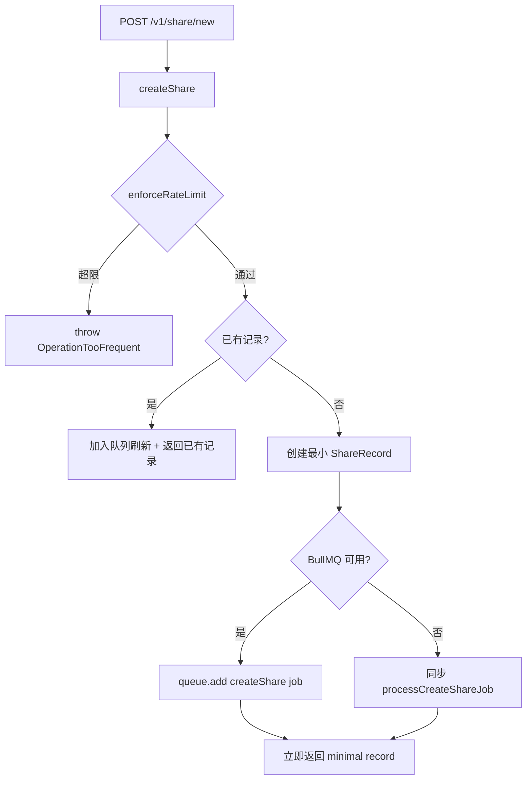
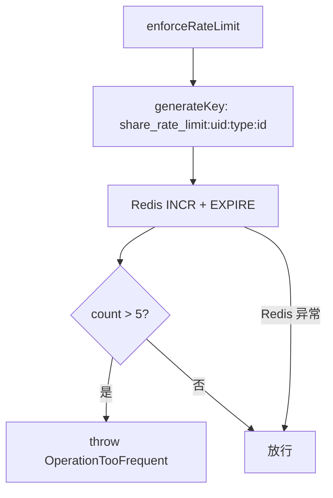
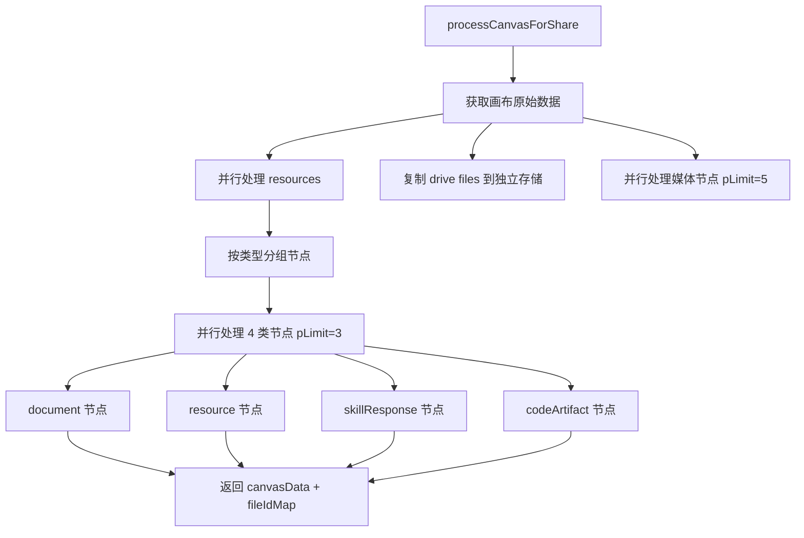
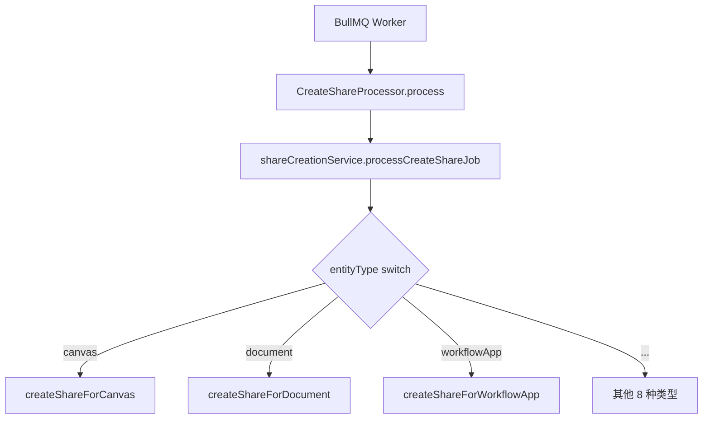

# PD-271.01 Refly — 多实体类型分享与深度复制系统

> 文档编号：PD-271.01
> 来源：Refly `apps/api/src/modules/share/`
> GitHub：https://github.com/refly-ai/refly.git
> 问题域：PD-271 分享与发布 Share & Publish
> 状态：可复用方案

---

## 第 1 章 问题与动机

### 1.1 核心问题

在 AI 画布/工作流产品中，用户创建的内容是**复合实体**——一个画布（Canvas）内嵌文档、资源、代码片段、AI 技能响应、驱动文件等多种节点类型。分享这样的复合内容面临三个核心挑战：

1. **实体图谱序列化**：画布内的每个节点都是独立实体，分享时需要递归处理所有子实体，生成独立的公开快照
2. **分享与源数据解耦**：用户删除原始文件后，分享链接不应失效——分享数据必须独立于源数据存在
3. **复制（Duplication）的完整性**：其他用户"复制到我的工作区"时，需要深度克隆所有子实体（文档、向量索引、文件、工具调用记录等），而非浅引用

### 1.2 Refly 的解法概述

Refly 构建了一个完整的 NestJS 模块化分享系统，核心设计：

1. **四服务分层架构**：ShareCreationService（创建）、ShareDuplicationService（复制）、ShareCommonService（公共工具）、ShareRateLimitService（限流），职责清晰分离（`share.module.ts:46-51`）
2. **BullMQ 异步处理**：`createShare()` 立即返回最小记录，重活交给队列异步完成（`share-creation.service.ts:1531-1579`）
3. **前缀路由的实体分发**：12 种实体类型各有唯一前缀（`doc-`、`can-`、`skr-` 等），复制时通过前缀自动路由到对应处理器（`const.ts:1-16`）
4. **公开/执行双存储分离**：WorkflowApp 分享时生成两份数据——公开展示数据（sanitized）和私有执行数据（完整），保护工作流内部结构（`share-creation.service.ts:1258-1342`）
5. **pLimit 并发控制**：所有并行处理（媒体发布、节点处理、文件复制）均使用 `p-limit` 控制并发度，防止资源耗尽（`share-creation.service.ts:79,196`）

### 1.3 设计思想

| 设计原则 | 具体实现 | 理由 | 替代方案 |
|----------|----------|------|----------|
| 异步优先 | BullMQ 队列 + 最小记录立即返回 | 画布分享涉及大量 I/O（媒体发布、文件复制），同步处理会阻塞用户 | WebSocket 推送完成通知（更复杂） |
| 数据独立性 | 分享时复制文件到 `share/` 前缀的独立存储路径 | 源数据删除不影响分享链接 | 引用计数（需要 GC 机制） |
| 前缀路由 | shareId 以实体类型前缀开头（`doc-`、`can-`） | 无需查库即可判断实体类型，复制时直接路由 | 查库获取 entityType（多一次 DB 查询） |
| 幂等创建 | 先查已有记录，存在则更新而非重复创建 | 用户多次点击"分享"不会产生多条记录 | 唯一约束 + upsert（数据库层面） |
| 桌面/云端双模 | `isDesktop()` 判断：桌面模式同步处理，云端模式走队列 | 桌面版无 Redis/BullMQ 依赖 | 统一走队列（桌面版需额外部署 Redis） |

---

## 第 2 章 源码实现分析

### 2.1 架构概览

```
┌─────────────────────────────────────────────────────────────┐
│                    ShareController                           │
│  GET /list  │  POST /new  │  POST /delete  │  POST /duplicate│
└──────┬──────┴──────┬──────┴───────┬────────┴───────┬────────┘
       │             │              │                │
       ▼             ▼              ▼                ▼
┌─────────────┐ ┌──────────────┐ ┌─────────────┐ ┌──────────────────┐
│ShareCommon  │ │ShareCreation │ │ShareCommon  │ │ShareDuplication  │
│Service      │ │Service       │ │Service      │ │Service           │
│ .listShares │ │ .createShare │ │ .deleteShare│ │ .duplicateShare  │
└─────────────┘ └──────┬───────┘ └─────────────┘ └──────────────────┘
                       │                                    │
                       ▼                                    │
              ┌────────────────┐                            │
              │ ShareRateLimit │◄───────────────────────────┘
              │ Service        │  (enforceRateLimit)
              │ Redis 滑动窗口 │
              └────────────────┘
                       │
                       ▼
              ┌────────────────┐
              │ BullMQ Queue   │  (QUEUE_CREATE_SHARE)
              │ CreateShare    │
              │ Processor      │
              └────────────────┘
```

### 2.2 核心实现

#### 2.2.1 异步分享创建入口



对应源码 `share-creation.service.ts:1531-1579`：

```typescript
async createShare(user: User, req: CreateShareRequest): Promise<ShareRecord> {
    const entityType = req.entityType as EntityType;

    // Check rate limit before processing share creation
    await this.shareRateLimitService.enforceRateLimit(user.uid, entityType, req.entityId);

    // Try find existing record for idempotency
    const existing = await this.prisma.shareRecord.findFirst({
      where: {
        entityId: req.entityId,
        entityType: entityType,
        uid: user.uid,
        deletedAt: null,
      },
    });
    if (existing) {
      if (this.createShareQueue) {
        await this.createShareQueue.add('createShare', { user: { uid: user.uid }, req });
      }
      return existing;
    }

    const shareId = genShareId(entityType as keyof typeof SHARE_CODE_PREFIX);

    // Create minimal record to return immediately
    const minimal = await this.prisma.shareRecord.create({
      data: {
        shareId,
        title: req.title ?? '',
        uid: user.uid,
        entityId: req.entityId,
        entityType: entityType,
        storageKey: `share/${shareId}.json`,
        parentShareId: req.parentShareId,
        allowDuplication: req.allowDuplication ?? false,
      },
    });

    // Enqueue async job or fallback to direct processing
    if (this.createShareQueue) {
      await this.createShareQueue.add('createShare', { user: { uid: user.uid }, req });
    } else {
      await this.processCreateShareJob({ user: { uid: user.uid }, req });
    }

    return minimal;
  }
```

#### 2.2.2 Redis 滑动窗口限流



对应源码 `share-rate-limit.service.ts:7-73`：

```typescript
@Injectable()
export class ShareRateLimitService {
  private readonly MAX_OPERATIONS_PER_WINDOW = 5;
  private readonly WINDOW_SECONDS = 600; // 10 minutes

  private generateKey(userId: string, entityType: EntityType, entityId: string): string {
    return `${this.KEY_PREFIX}${userId}:${entityType}:${entityId}`;
  }

  async checkRateLimit(userId: string, entityType: EntityType, entityId: string): Promise<boolean> {
    const key = this.generateKey(userId, entityType, entityId);
    try {
      const currentCount = await this.redisService.incrementWithExpire(key, this.WINDOW_SECONDS);
      if (currentCount > this.MAX_OPERATIONS_PER_WINDOW) {
        this.logger.warn(`Rate limit exceeded for user ${userId}, entity ${entityType}:${entityId}`);
        return false;
      }
      return true;
    } catch (error) {
      // Redis 故障时放行，不阻塞正常用户
      return true;
    }
  }
}
```


### 2.3 实现细节

#### 2.3.1 画布分享的递归实体处理

画布是 Refly 最复杂的分享场景。一个画布包含多种节点类型（document、resource、skillResponse、codeArtifact、image/video/audio），每种都需要独立创建分享记录。



对应源码 `share-creation.service.ts:64-328`，关键的并发控制策略：

```typescript
// 媒体节点：5 并发
const limit = pLimit(5);
const mediaProcessingPromises = mediaNodes.map((node) => {
  return limit(async () => {
    const storageKey = node.data?.metadata?.storageKey as string;
    if (storageKey) {
      const mediaUrl = await this.miscService.publishFile(storageKey);
      if (node.data?.metadata) {
        node.data.metadata[`${node.type}Url`] = mediaUrl;
      }
    }
  });
});

// 业务节点：3 并发/类型，4 类型并行
const nodeProcessingLimit = pLimit(3);
await Promise.all([
  processDocumentNodes(),
  processResourceNodes(),
  processSkillResponseNodes(),
  processCodeArtifactNodes(),
]);
```

#### 2.3.2 WorkflowApp 的公开/执行双存储

WorkflowApp 分享时需要保护工作流内部结构（edges 连接关系、完整节点数据），同时提供足够的公开展示数据。Refly 的解法是生成两份独立的 JSON：

- **公开数据** (`share/{shareId}.json`, visibility: public)：sanitized nodes（仅保留 shareId/mediaUrl 等白名单字段）、空 edges
- **执行数据** (`share/{shareId}-execution.json`, visibility: private)：完整 nodes + edges，用于"复制后执行"

对应源码 `share-creation.service.ts:1207-1393`：

```typescript
private sanitizeNodeMetadata(metadata: Record<string, any>): Record<string, any> {
    const ALLOWED_FIELDS = [
      'shareId', 'imageUrl', 'videoUrl', 'audioUrl', 'selectedToolsets',
    ];
    return Object.fromEntries(
      Object.entries(metadata).filter(([key]) => ALLOWED_FIELDS.includes(key)),
    );
  }
```

#### 2.3.3 深度复制的实体 ID 映射

复制分享内容时，所有实体 ID 必须重新生成，且内部引用关系必须同步更新。Refly 使用 `replaceEntityMap` 预生成所有新 ID，然后通过 `batchReplaceRegex` 在序列化 JSON 中批量替换。

对应源码 `share-duplication.service.ts:666-702`：

```typescript
private preGenerateEntityIds(
    nodes: CanvasNode[],
    originalEntityId: string,
    newCanvasId: string,
  ): Record<string, string> {
    const preGeneratedActionResultIds: Record<string, string> = {};
    const preGeneratedLibIds: Record<string, string> = {};

    for (const node of skillResponseNodes) {
      preGeneratedActionResultIds[node.data.entityId] = genActionResultID();
    }
    for (const node of libEntityNodes) {
      if (node.type === 'document') preGeneratedLibIds[oldId] = genDocumentID();
      else if (node.type === 'resource') preGeneratedLibIds[oldId] = genResourceID();
      else if (node.type === 'codeArtifact') preGeneratedLibIds[oldId] = genCodeArtifactID();
    }

    return { [originalEntityId]: newCanvasId, ...preGeneratedActionResultIds, ...preGeneratedLibIds };
  }
```

#### 2.3.4 BullMQ 处理器



对应源码 `share.processor.ts:8-26`：

```typescript
@Processor(QUEUE_CREATE_SHARE)
export class CreateShareProcessor extends WorkerHost {
  async process(job: Job<CreateShareJobData>) {
    this.logger.log(`[${QUEUE_CREATE_SHARE}] Processing job: ${job.id}`);
    try {
      await this.shareCreationService.processCreateShareJob(job.data);
    } catch (error) {
      this.logger.error(`[${QUEUE_CREATE_SHARE}] Error processing job ${job.id}: ${error?.stack}`);
      throw error; // BullMQ 自动重试
    }
  }
}
```

#### 2.3.5 向量索引的序列化与恢复

文档和资源分享时，Refly 将 RAG 向量索引序列化为 Avro 格式存储到公开桶，复制时反序列化恢复到新实体。这确保复制后的文档立即可搜索。

对应源码 `share-common.service.ts:30-81`：

```typescript
async storeVector(user: User, param: { shareId; entityId; entityType; vectorStorageKey }) {
    const vector = await this.ragService.serializeToAvro(user, {
      nodeType: entityType,
      ...(entityType === 'document' && { docId: entityId }),
      ...(entityType === 'resource' && { resourceId: entityId }),
    });
    await this.miscService.uploadBuffer(user, {
      buf: vector.data,
      visibility: 'public',
      storageKey: vectorStorageKey,
    });
  }

async restoreVector(user: User, param: { entityId; entityType; vectorStorageKey }) {
    const vector = await this.miscService.downloadFile({ storageKey: vectorStorageKey, visibility: 'public' });
    await this.ragService.deserializeFromAvro(user, {
      data: vector,
      ...(entityType === 'document' && { targetDocId: entityId }),
    });
  }
```

---

## 第 3 章 迁移指南

### 3.1 迁移清单

**阶段 1：基础分享（1-2 天）**
- [ ] 定义实体类型枚举和前缀映射表（参考 `const.ts`）
- [ ] 实现 ShareRecord 数据模型（shareId, entityId, entityType, uid, storageKey, parentShareId, allowDuplication）
- [ ] 实现单实体分享：序列化 → 上传到公开存储 → 创建记录
- [ ] 实现分享列表查询和软删除

**阶段 2：异步处理 + 限流**
- [ ] 集成 BullMQ（或其他任务队列），实现"立即返回 + 异步处理"模式
- [ ] 实现 Redis 滑动窗口限流（INCR + EXPIRE 原子操作）
- [ ] 添加桌面模式降级（无 Redis 时同步处理）

**阶段 3：复合实体分享**
- [ ] 实现画布/页面的递归子实体分享
- [ ] 实现 pLimit 并发控制
- [ ] 实现文件复制独立化（`duplicateDriveFilesForShare`）
- [ ] 实现 WorkflowApp 的公开/执行双存储分离

**阶段 4：深度复制**
- [ ] 实现实体 ID 预生成和批量替换
- [ ] 实现向量索引的 Avro 序列化/反序列化
- [ ] 实现存储配额检查
- [ ] 实现 DuplicateRecord 审计追踪

### 3.2 适配代码模板

以下是一个简化的分享系统骨架，可直接用于 NestJS 项目：

```typescript
// share-prefix.ts — 实体前缀映射
export const SHARE_PREFIX: Record<string, string> = {
  document: 'doc-',
  canvas: 'can-',
  workflow: 'wfl-',
};

// share.service.ts — 核心分享服务
import { Injectable } from '@nestjs/common';
import { InjectQueue } from '@nestjs/bullmq';
import { Queue } from 'bullmq';
import { createId } from '@paralleldrive/cuid2';

@Injectable()
export class ShareService {
  constructor(
    private readonly prisma: PrismaService,
    private readonly storage: ObjectStorageService,
    private readonly rateLimiter: RateLimitService,
    @InjectQueue('share') private readonly shareQueue?: Queue,
  ) {}

  async createShare(userId: string, entityId: string, entityType: string) {
    // 1. 限流检查
    await this.rateLimiter.enforce(userId, entityType, entityId);

    // 2. 幂等检查
    const existing = await this.prisma.shareRecord.findFirst({
      where: { entityId, entityType, uid: userId, deletedAt: null },
    });
    if (existing) return existing;

    // 3. 创建最小记录
    const shareId = SHARE_PREFIX[entityType] + createId();
    const record = await this.prisma.shareRecord.create({
      data: { shareId, entityId, entityType, uid: userId, storageKey: `share/${shareId}.json` },
    });

    // 4. 异步处理或同步降级
    if (this.shareQueue) {
      await this.shareQueue.add('process', { userId, entityId, entityType, shareId });
    } else {
      await this.processShare(userId, entityId, entityType, shareId);
    }

    return record;
  }

  private async processShare(userId: string, entityId: string, entityType: string, shareId: string) {
    // 根据 entityType 分发到具体处理逻辑
    const data = await this.loadEntityData(entityId, entityType);
    await this.storage.upload(`share/${shareId}.json`, JSON.stringify(data), 'public');
    await this.prisma.shareRecord.update({
      where: { shareId },
      data: { storageKey: `share/${shareId}.json` },
    });
  }
}
```

### 3.3 适用场景

| 场景 | 适用度 | 说明 |
|------|--------|------|
| AI 画布/白板产品的内容分享 | ⭐⭐⭐ | 完美匹配：复合实体递归分享 + 深度复制 |
| 文档协作平台的公开分享 | ⭐⭐⭐ | 单实体分享 + 向量索引恢复 |
| 工作流模板市场 | ⭐⭐⭐ | 公开/执行双存储 + 社区发布 |
| 简单的文件分享系统 | ⭐⭐ | 过度设计，简单场景不需要实体图谱处理 |
| 实时协作编辑的分享 | ⭐ | Refly 方案是快照式分享，不支持实时同步 |

---

## 第 4 章 测试用例

```typescript
import { Test, TestingModule } from '@nestjs/testing';
import { ShareCreationService } from './share-creation.service';
import { ShareRateLimitService } from './share-rate-limit.service';
import { ShareDuplicationService } from './share-duplication.service';

describe('ShareRateLimitService', () => {
  let service: ShareRateLimitService;
  let redisService: { incrementWithExpire: jest.Mock; get: jest.Mock };

  beforeEach(async () => {
    redisService = {
      incrementWithExpire: jest.fn(),
      get: jest.fn(),
    };
    const module: TestingModule = await Test.createTestingModule({
      providers: [
        ShareRateLimitService,
        { provide: 'RedisService', useValue: redisService },
      ],
    }).compile();
    service = module.get(ShareRateLimitService);
  });

  test('should allow operations within rate limit', async () => {
    redisService.incrementWithExpire.mockResolvedValue(3);
    const result = await service.checkRateLimit('user1', 'canvas', 'canvas-123');
    expect(result).toBe(true);
  });

  test('should reject operations exceeding rate limit', async () => {
    redisService.incrementWithExpire.mockResolvedValue(6);
    const result = await service.checkRateLimit('user1', 'canvas', 'canvas-123');
    expect(result).toBe(false);
  });

  test('should allow operations when Redis fails (fail-open)', async () => {
    redisService.incrementWithExpire.mockRejectedValue(new Error('Redis down'));
    const result = await service.checkRateLimit('user1', 'canvas', 'canvas-123');
    expect(result).toBe(true); // fail-open 策略
  });

  test('enforceRateLimit should throw OperationTooFrequent', async () => {
    redisService.incrementWithExpire.mockResolvedValue(6);
    await expect(
      service.enforceRateLimit('user1', 'canvas', 'canvas-123'),
    ).rejects.toThrow('Rate limit exceeded');
  });
});

describe('ShareCreationService - createShare', () => {
  test('should return existing record for idempotent calls', async () => {
    // 模拟已有记录
    const existing = { shareId: 'can-abc123', entityId: 'canvas-1' };
    prisma.shareRecord.findFirst.mockResolvedValue(existing);
    const result = await service.createShare(user, { entityId: 'canvas-1', entityType: 'canvas' });
    expect(result.shareId).toBe('can-abc123');
  });

  test('should create minimal record and enqueue job', async () => {
    prisma.shareRecord.findFirst.mockResolvedValue(null);
    prisma.shareRecord.create.mockResolvedValue({ shareId: 'can-new123' });
    const result = await service.createShare(user, { entityId: 'canvas-2', entityType: 'canvas' });
    expect(result.shareId).toMatch(/^can-/);
    expect(queue.add).toHaveBeenCalledWith('createShare', expect.any(Object));
  });
});

describe('ShareDuplicationService - duplicateShare', () => {
  test('should route by shareId prefix', async () => {
    prisma.shareRecord.findUnique.mockResolvedValue({ shareId: 'doc-abc', allowDuplication: true });
    const spy = jest.spyOn(service, 'duplicateSharedDocument');
    await service.duplicateShare(user, { shareId: 'doc-abc' });
    expect(spy).toHaveBeenCalled();
  });

  test('should reject duplication when not allowed', async () => {
    prisma.shareRecord.findUnique.mockResolvedValue({ shareId: 'doc-abc', allowDuplication: false });
    await expect(
      service.duplicateShare(user, { shareId: 'doc-abc' }),
    ).rejects.toThrow('DuplicationNotAllowedError');
  });

  test('should check storage quota before duplication', async () => {
    subscriptionService.checkStorageUsage.mockResolvedValue({ available: 0 });
    await expect(
      service.duplicateSharedDocument(user, { shareId: 'doc-abc' }),
    ).rejects.toThrow('StorageQuotaExceeded');
  });
});
```


---

## 第 5 章 跨域关联

| 关联域 | 关系类型 | 说明 |
|--------|----------|------|
| PD-06 记忆持久化 | 协同 | 分享时序列化向量索引（Avro），复制时反序列化恢复，确保 RAG 能力随分享内容迁移 |
| PD-03 容错与重试 | 协同 | BullMQ 自动重试失败的分享任务；Redis 限流 fail-open 策略避免阻塞正常用户 |
| PD-05 沙箱隔离 | 协同 | WorkflowApp 公开/执行双存储分离，防止工作流内部结构泄露 |
| PD-11 可观测性 | 依赖 | 每个分享/复制操作都有 Logger 记录，DuplicateRecord 表提供审计追踪 |
| PD-04 工具系统 | 协同 | 复制 skillResponse 时同步复制 toolCallResult 和 toolset 映射 |

---

## 第 6 章 来源文件索引

| 文件 | 行范围 | 关键实现 |
|------|--------|----------|
| `apps/api/src/modules/share/share-creation.service.ts` | L1-1614 | 分享创建核心：12 种实体类型的分享逻辑、BullMQ 异步入口、画布递归处理 |
| `apps/api/src/modules/share/share-rate-limit.service.ts` | L1-109 | Redis 滑动窗口限流：5 次/10 分钟/实体、fail-open 策略 |
| `apps/api/src/modules/share/share-duplication.service.ts` | L1-1178 | 深度复制核心：实体 ID 预生成、批量替换、向量恢复、存储配额检查 |
| `apps/api/src/modules/share/share-common.service.ts` | L1-314 | 公共工具：向量序列化/反序列化、文件复制、fileId 替换、软删除 |
| `apps/api/src/modules/share/share.controller.ts` | L1-71 | REST API：4 个端点（list/new/delete/duplicate），JWT 认证 |
| `apps/api/src/modules/share/share.processor.ts` | L1-26 | BullMQ Worker：异步处理分享创建任务 |
| `apps/api/src/modules/share/share.module.ts` | L1-61 | 模块定义：桌面/云端双模配置、BullMQ 条件注册 |
| `apps/api/src/modules/share/share.dto.ts` | L1-63 | DTO 定义：ShareExtraData、SharePageData、CreateShareJobData |
| `apps/api/src/modules/share/const.ts` | L1-16 | 12 种实体类型的 shareId 前缀映射 |

---

## 第 7 章 横向对比维度

```json comparison_data
{
  "project": "Refly",
  "dimensions": {
    "分享架构": "四服务分层 + BullMQ 异步队列 + 前缀路由分发",
    "权限控制": "JWT 认证 + allowDuplication 字段 + 所有权校验",
    "速率限制": "Redis INCR+EXPIRE 滑动窗口，5次/10分钟/实体，fail-open",
    "数据独立性": "文件复制到 share/ 独立路径，源数据删除不影响分享",
    "复制深度": "递归深度复制所有子实体 + 向量索引 Avro 序列化恢复",
    "实体类型覆盖": "12 种实体类型统一前缀路由，含 WorkflowApp 双存储",
    "并发控制": "pLimit 分层并发（媒体5、节点3/类型、文件10）"
  }
}
```

### 域元数据补充

```json domain_metadata
{
  "solution_summary": "Refly 用四服务分层 + BullMQ 异步队列 + 前缀路由实现 12 种实体类型的递归分享与深度复制，含 Redis 滑动窗口限流和向量索引 Avro 序列化迁移",
  "description": "复合实体的递归分享与深度克隆，含向量索引迁移和存储配额管理",
  "sub_problems": [
    "复合实体递归子实体分享",
    "分享数据与源数据解耦独立存储",
    "深度复制时实体 ID 批量映射替换",
    "向量索引随分享内容序列化迁移",
    "公开展示数据与私有执行数据分离"
  ],
  "best_practices": [
    "前缀路由免查库判断实体类型",
    "Redis 限流 fail-open 避免阻塞正常用户",
    "桌面/云端双模降级确保无 Redis 也可用",
    "pLimit 分层并发控制防止资源耗尽"
  ]
}
```
