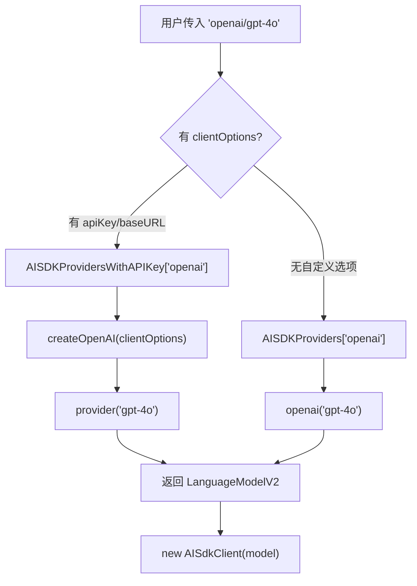
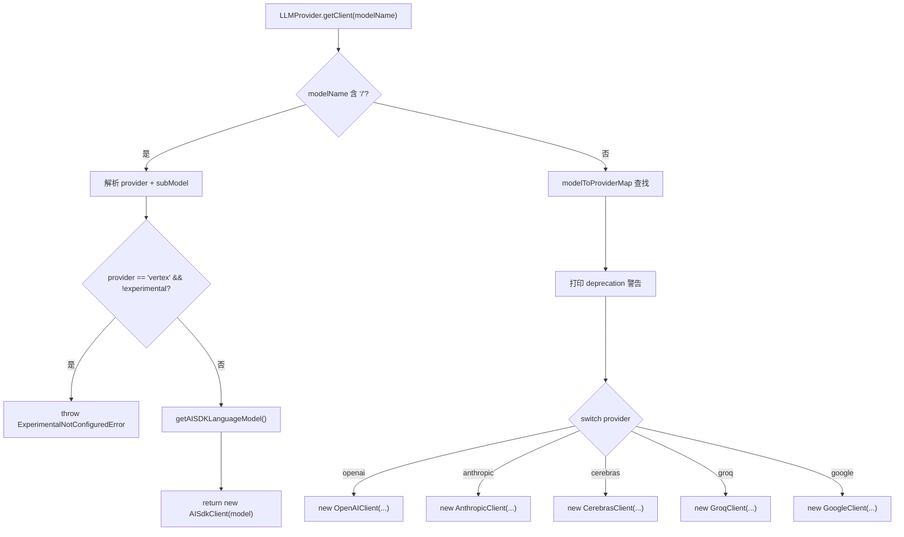
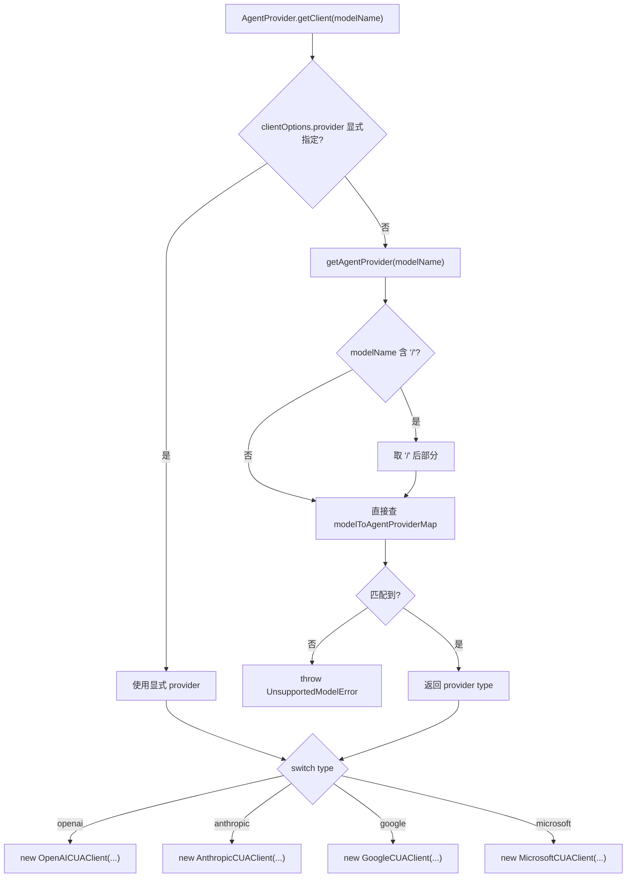

# PD-272.01 Stagehand — 双轨 LLM 供应商抽象与 AI SDK 统一适配

> 文档编号：PD-272.01
> 来源：Stagehand `packages/core/lib/v3/llm/LLMProvider.ts`
> GitHub：https://github.com/browserbase/stagehand.git
> 问题域：PD-272 多 LLM 供应商抽象 Multi-LLM Provider Abstraction
> 状态：可复用方案

---

## 第 1 章 问题与动机

### 1.1 核心问题

浏览器自动化框架需要调用 LLM 完成页面理解（observe）、操作决策（act）、数据提取（extract）等任务。不同用户偏好不同供应商（OpenAI 便宜快速、Anthropic 推理强、Google 多模态好），且同一项目内可能同时需要：

1. **常规 LLM 调用**：用于 act/observe/extract 三大原语，需要结构化输出（JSON Schema）、工具调用、图片理解
2. **CUA（Computer Use Agent）调用**：用于截图驱动的自主浏览器操作，需要供应商原生 API（非 AI SDK）

这两类调用的 API 形态完全不同，但用户只想传一个 `model: "openai/gpt-4o"` 就能工作。

### 1.2 Stagehand 的解法概述

Stagehand 采用**双轨架构**——`LLMProvider`（常规 LLM）和 `AgentProvider`（CUA Agent）各自独立的供应商路由体系：

1. **provider/model 格式统一标识**：所有模型用 `"openai/gpt-4o"` 格式，首个 `/` 前为供应商名，后为模型名（`LLMProvider.ts:151-154`）
2. **AI SDK 适配层**：新格式走 Vercel AI SDK 统一抽象，15 个供应商通过 `@ai-sdk/*` 包自动适配（`LLMProvider.ts:37-53`）
3. **Legacy 直连客户端**：旧格式（无 `/`）走 OpenAI/Anthropic/Google/Groq/Cerebras 五个原生 SDK 客户端（`LLMProvider.ts:176-225`）
4. **CUA 独立工厂**：AgentProvider 维护独立的模型→供应商映射表，为 4 家 CUA 供应商创建专用客户端（`AgentProvider.ts:16-30`）
5. **环境变量自动发现**：`providerEnvVarMap` 映射 15 个供应商到对应环境变量名，支持多候选（如 Google 有 3 个可能的 key 名）（`utils.ts:680-696`）

### 1.3 设计思想

| 设计原则 | 具体实现 | 理由 | 替代方案 |
|----------|----------|------|----------|
| 双轨分离 | LLMProvider 管常规调用，AgentProvider 管 CUA 调用 | CUA 需要原生 API（截图循环、safety check），AI SDK 不支持 | 统一到一个 Provider（会导致 CUA 逻辑侵入常规路径） |
| AI SDK 作为统一层 | 新格式 `provider/model` 全部走 AISdkClient | Vercel AI SDK 已适配 15+ 供应商，避免重复造轮子 | 每个供应商写原生客户端（维护成本高） |
| 渐进式迁移 | 旧格式 `"gpt-4o"` 仍可用但打 deprecation 警告 | 不破坏已有用户代码 | 直接移除旧格式（破坏性变更） |
| 统一响应格式 | 所有客户端输出统一的 `LLMResponse` 结构 | 上层 handler 不关心底层供应商差异 | 每个 handler 自己适配不同响应格式 |
| 模型特殊处理内聚 | O1/O3 的参数裁剪、DeepSeek/Kimi 的 JSON fallback 都在对应 Client 内部 | 模型怪癖不泄漏到上层 | 在 Provider 层做条件判断（违反单一职责） |

---

## 第 2 章 源码实现分析

### 2.1 架构概览

Stagehand 的 LLM 抽象分为两条独立的供应商路由管线：

```
用户配置 model: "openai/gpt-4o"
         │
         ├─── 常规 LLM 路径 ──────────────────────────────────────┐
         │    LLMProvider.getClient()                              │
         │    ├─ 含 "/" → AI SDK 路径                              │
         │    │   getAISDKLanguageModel(provider, model, opts)     │
         │    │   → AISDKProviders["openai"]("gpt-4o")            │
         │    │   → new AISdkClient(languageModel)                │
         │    │                                                    │
         │    └─ 无 "/" → Legacy 路径（deprecated）                │
         │        modelToProviderMap["gpt-4o"] → "openai"         │
         │        → new OpenAIClient(...)                          │
         │                                                         │
         │    所有 Client 继承 abstract LLMClient                  │
         │    统一输出 LLMResponse / LLMParsedResponse<T>          │
         │                                                         │
         ├─── CUA Agent 路径 ─────────────────────────────────────┐
         │    AgentProvider.getClient()                            │
         │    modelToAgentProviderMap[model] → provider            │
         │    switch(provider):                                    │
         │      "openai"    → new OpenAICUAClient(...)             │
         │      "anthropic" → new AnthropicCUAClient(...)          │
         │      "google"    → new GoogleCUAClient(...)             │
         │      "microsoft" → new MicrosoftCUAClient(...)          │
         │                                                         │
         │    所有 CUA Client 继承 abstract AgentClient            │
         │    统一输出 AgentResult                                 │
         └─────────────────────────────────────────────────────────┘
```

### 2.2 核心实现

#### 2.2.1 AI SDK 供应商注册表



对应源码 `packages/core/lib/v3/llm/LLMProvider.ts:37-70`：

```typescript
const AISDKProviders: Record<string, AISDKProvider> = {
  openai, bedrock, anthropic, google, xai, azure,
  groq, cerebras, togetherai, mistral, deepseek,
  perplexity, ollama, vertex, gateway,
};

const AISDKProvidersWithAPIKey: Record<string, AISDKCustomProvider> = {
  openai: createOpenAI,
  bedrock: createAmazonBedrock,
  anthropic: createAnthropic,
  google: createGoogleGenerativeAI,
  vertex: createVertex,
  xai: createXai,
  azure: createAzure,
  groq: createGroq,
  cerebras: createCerebras,
  togetherai: createTogetherAI,
  mistral: createMistral,
  deepseek: createDeepSeek,
  perplexity: createPerplexity,
  ollama: createOllama,
  gateway: createGateway,
};
```

两张表的设计意图：`AISDKProviders` 使用默认配置（从环境变量读 key），`AISDKProvidersWithAPIKey` 接受用户传入的 `clientOptions`（自定义 apiKey/baseURL）。`getAISDKLanguageModel` 函数（`LLMProvider.ts:107-137`）根据是否有有效 options 选择走哪张表。

#### 2.2.2 LLMProvider 双路径路由



对应源码 `packages/core/lib/v3/llm/LLMProvider.ts:139-238`：

```typescript
export class LLMProvider {
  private logger: (message: LogLine) => void;

  constructor(logger: (message: LogLine) => void) {
    this.logger = logger;
  }

  getClient(
    modelName: AvailableModel,
    clientOptions?: ClientOptions,
    options?: { experimental?: boolean; disableAPI?: boolean },
  ): LLMClient {
    if (modelName.includes("/")) {
      const firstSlashIndex = modelName.indexOf("/");
      const subProvider = modelName.substring(0, firstSlashIndex);
      const subModelName = modelName.substring(firstSlashIndex + 1);
      // Vertex 需要 experimental 标志
      if (subProvider === "vertex" && !options?.disableAPI && !options?.experimental) {
        throw new ExperimentalNotConfiguredError("Vertex provider");
      }
      const languageModel = getAISDKLanguageModel(subProvider, subModelName, clientOptions);
      return new AISdkClient({ model: languageModel, logger: this.logger });
    }
    // Legacy 路径 — deprecated
    const provider = modelToProviderMap[modelName];
    if (!provider) throw new UnsupportedModelError(Object.keys(modelToProviderMap));
    this.logger({
      category: "llm",
      message: `Deprecation warning: Model format "${modelName}" is deprecated...`,
      level: 0,
    });
    switch (provider) {
      case "openai":    return new OpenAIClient({ logger: this.logger, modelName, clientOptions });
      case "anthropic":  return new AnthropicClient({ logger: this.logger, modelName, clientOptions });
      // ... cerebras, groq, google
    }
  }
}
```

#### 2.2.3 AgentProvider CUA 工厂



对应源码 `packages/core/lib/v3/agent/AgentProvider.ts:16-130`：

```typescript
export const modelToAgentProviderMap: Record<string, AgentProviderType> = {
  "computer-use-preview": "openai",
  "computer-use-preview-2025-03-11": "openai",
  "claude-3-7-sonnet-latest": "anthropic",
  "claude-sonnet-4-20250514": "anthropic",
  "claude-sonnet-4-5-20250929": "anthropic",
  "claude-opus-4-5-20251101": "anthropic",
  "claude-opus-4-6": "anthropic",
  "claude-sonnet-4-6": "anthropic",
  "claude-haiku-4-5-20251001": "anthropic",
  "gemini-2.5-computer-use-preview-10-2025": "google",
  "gemini-3-flash-preview": "google",
  "gemini-3-pro-preview": "google",
  "fara-7b": "microsoft",
};
```

### 2.3 实现细节

#### 统一响应格式转换

所有非 AI SDK 客户端（AnthropicClient、GoogleClient）都将供应商原生响应转换为统一的 `LLMResponse` 格式。以 AnthropicClient 为例（`AnthropicClient.ts:196-229`）：

- `response.usage.input_tokens` → `usage.prompt_tokens`
- `response.content.find(c => c.type === "text")?.text` → `choices[0].message.content`
- `response.content.filter(c => c.type === "tool_use")` → `choices[0].message.tool_calls`

AISdkClient 同样做了转换（`aisdk.ts:337-373`），将 AI SDK 的 `textResponse.toolCalls` 映射为 OpenAI 格式的 `tool_calls`。

#### 模型特殊处理

AISdkClient 内部处理了多种模型怪癖（`aisdk.ts:132-147`）：

- **GPT-5 系列**：注入 `providerOptions.openai.textVerbosity` 和 `reasoningEffort`
- **Kimi 模型**：强制 `temperature=1`（唯一支持的值）
- **DeepSeek/Kimi/GLM**：不支持原生结构化输出，走 prompt-based JSON fallback

#### 环境变量自动发现

`providerEnvVarMap`（`utils.ts:680-696`）为 15 个供应商定义了环境变量名映射，Google 支持 3 个候选变量名（`GEMINI_API_KEY`、`GOOGLE_GENERATIVE_AI_API_KEY`、`GOOGLE_API_KEY`），`loadApiKeyFromEnv` 按优先级依次尝试。Bedrock 和 Ollama 标记为 `providersWithoutApiKey`，不需要 API Key。


---

## 第 3 章 迁移指南

### 3.1 迁移清单

**阶段 1：基础抽象层（必须）**

- [ ] 定义 `LLMClient` 抽象基类，包含 `createChatCompletion` 抽象方法和 AI SDK 便捷方法
- [ ] 定义统一的 `LLMResponse` 响应格式（OpenAI 兼容）
- [ ] 实现 `LLMProvider` 工厂类，支持 `provider/model` 格式路由
- [ ] 创建 `AISDKProviders` 和 `AISDKProvidersWithAPIKey` 两张注册表
- [ ] 实现 `getAISDKLanguageModel` 函数处理有/无自定义选项两种情况

**阶段 2：环境变量与 API Key（必须）**

- [ ] 创建 `providerEnvVarMap` 映射表，覆盖所有目标供应商
- [ ] 实现 `loadApiKeyFromEnv` 函数，支持多候选变量名和无 Key 供应商
- [ ] 在初始化时自动从 `model.split("/")[0]` 推断供应商并加载 Key

**阶段 3：CUA 独立路径（按需）**

- [ ] 如果需要 CUA 模式，创建独立的 `AgentProvider` + `AgentClient` 抽象
- [ ] 维护独立的 `modelToAgentProviderMap` 映射表
- [ ] 每个 CUA 供应商实现独立的客户端（截图循环、safety check 等）

### 3.2 适配代码模板

以下是一个可直接复用的最小化 LLM Provider 实现：

```typescript
import { createOpenAI } from "@ai-sdk/openai";
import { createAnthropic } from "@ai-sdk/anthropic";
import { createGoogleGenerativeAI } from "@ai-sdk/google";
import { generateText, generateObject } from "ai";
import type { LanguageModelV2 } from "@ai-sdk/provider";

// 1. 供应商注册表
type ProviderFactory = (opts?: { apiKey?: string; baseURL?: string }) =>
  (modelId: string) => LanguageModelV2;

const PROVIDERS: Record<string, ProviderFactory> = {
  openai: createOpenAI,
  anthropic: createAnthropic,
  google: createGoogleGenerativeAI,
};

// 2. 环境变量映射
const ENV_VAR_MAP: Record<string, string | string[]> = {
  openai: "OPENAI_API_KEY",
  anthropic: "ANTHROPIC_API_KEY",
  google: ["GEMINI_API_KEY", "GOOGLE_API_KEY"],
};

function loadApiKey(provider: string): string | undefined {
  const envVar = ENV_VAR_MAP[provider];
  if (Array.isArray(envVar)) {
    return envVar.map(k => process.env[k]).find(Boolean);
  }
  return process.env[envVar];
}

// 3. 模型解析与路由
function getLanguageModel(
  modelSpec: string,
  opts?: { apiKey?: string; baseURL?: string },
): LanguageModelV2 {
  const slashIdx = modelSpec.indexOf("/");
  if (slashIdx === -1) throw new Error(`Invalid model format: ${modelSpec}. Use "provider/model".`);

  const providerName = modelSpec.substring(0, slashIdx);
  const modelName = modelSpec.substring(slashIdx + 1);

  const factory = PROVIDERS[providerName];
  if (!factory) throw new Error(`Unsupported provider: ${providerName}`);

  const apiKey = opts?.apiKey ?? loadApiKey(providerName);
  const provider = factory(apiKey ? { apiKey, ...opts } : undefined);
  return provider(modelName);
}

// 4. 使用示例
const model = getLanguageModel("openai/gpt-4o");
const result = await generateText({ model, messages: [{ role: "user", content: "Hello" }] });
```

### 3.3 适用场景

| 场景 | 适用度 | 说明 |
|------|--------|------|
| 多供应商 LLM 应用 | ⭐⭐⭐ | 核心场景，AI SDK 统一层大幅降低适配成本 |
| 需要结构化输出的 Agent | ⭐⭐⭐ | AISdkClient 的 generateObject 直接支持 Zod Schema |
| CUA/截图驱动自动化 | ⭐⭐⭐ | 双轨架构让 CUA 走原生 API，不受 AI SDK 限制 |
| 单供应商项目 | ⭐⭐ | 架构偏重，但为未来扩展留了空间 |
| 需要流式输出 | ⭐⭐ | AI SDK 支持 streamText/streamObject，但 Legacy 客户端不支持 |
| 本地模型（Ollama） | ⭐⭐⭐ | 已内置 ollama provider，与云端供应商统一接口 |

---

## 第 4 章 测试用例

```typescript
import { describe, it, expect, vi, beforeEach } from "vitest";

// 模拟 AI SDK providers
vi.mock("@ai-sdk/openai", () => ({
  openai: vi.fn((modelId: string) => ({ modelId, provider: "openai" })),
  createOpenAI: vi.fn((opts: any) => (modelId: string) => ({ modelId, provider: "openai", opts })),
}));

describe("LLMProvider", () => {
  const mockLogger = vi.fn();
  let provider: LLMProvider;

  beforeEach(() => {
    provider = new LLMProvider(mockLogger);
    mockLogger.mockClear();
  });

  describe("provider/model 格式路由", () => {
    it("应正确解析 openai/gpt-4o 并返回 AISdkClient", () => {
      const client = provider.getClient("openai/gpt-4o" as any);
      expect(client).toBeInstanceOf(AISdkClient);
      expect(client.type).toBe("aisdk");
    });

    it("应正确解析含多级路径的模型名 anthropic/claude-sonnet-4-6", () => {
      const client = provider.getClient("anthropic/claude-sonnet-4-6" as any);
      expect(client).toBeInstanceOf(AISdkClient);
    });

    it("vertex provider 未开启 experimental 时应抛出错误", () => {
      expect(() =>
        provider.getClient("vertex/gemini-pro" as any, undefined, {
          experimental: false,
          disableAPI: false,
        }),
      ).toThrow("experimental");
    });

    it("不支持的供应商应抛出 UnsupportedAISDKModelProviderError", () => {
      expect(() =>
        provider.getClient("unknown-provider/some-model" as any),
      ).toThrow();
    });
  });

  describe("Legacy 格式（deprecated）", () => {
    it("应返回对应的原生客户端并打印 deprecation 警告", () => {
      const client = provider.getClient("gpt-4o" as any);
      expect(client).toBeInstanceOf(OpenAIClient);
      expect(mockLogger).toHaveBeenCalledWith(
        expect.objectContaining({
          message: expect.stringContaining("deprecated"),
        }),
      );
    });

    it("不支持的模型名应抛出 UnsupportedModelError", () => {
      expect(() => provider.getClient("nonexistent-model" as any)).toThrow();
    });
  });

  describe("getModelProvider 静态方法", () => {
    it("provider/model 格式应返回 'aisdk'", () => {
      expect(LLMProvider.getModelProvider("openai/gpt-4o" as any)).toBe("aisdk");
    });

    it("legacy 格式应返回具体供应商名", () => {
      expect(LLMProvider.getModelProvider("gpt-4o" as any)).toBe("openai");
    });
  });
});

describe("AgentProvider", () => {
  const mockLogger = vi.fn();

  it("应根据模型名返回正确的 CUA 供应商类型", () => {
    expect(AgentProvider.getAgentProvider("computer-use-preview")).toBe("openai");
    expect(AgentProvider.getAgentProvider("claude-opus-4-6")).toBe("anthropic");
    expect(AgentProvider.getAgentProvider("gemini-3-flash-preview")).toBe("google");
    expect(AgentProvider.getAgentProvider("fara-7b")).toBe("microsoft");
  });

  it("应支持 provider/model 格式（取 / 后部分查找）", () => {
    expect(AgentProvider.getAgentProvider("openai/computer-use-preview")).toBe("openai");
  });

  it("不支持的 CUA 模型应抛出 UnsupportedModelError", () => {
    expect(() => AgentProvider.getAgentProvider("gpt-4o")).toThrow();
  });
});

describe("loadApiKeyFromEnv", () => {
  it("应从环境变量加载 OpenAI key", () => {
    process.env.OPENAI_API_KEY = "sk-test";
    expect(loadApiKeyFromEnv("openai", vi.fn())).toBe("sk-test");
    delete process.env.OPENAI_API_KEY;
  });

  it("Google 应按优先级尝试多个环境变量", () => {
    process.env.GEMINI_API_KEY = "gemini-key";
    expect(loadApiKeyFromEnv("google", vi.fn())).toBe("gemini-key");
    delete process.env.GEMINI_API_KEY;
  });

  it("Bedrock/Ollama 等无 key 供应商应返回 undefined 且不报错", () => {
    const logger = vi.fn();
    expect(loadApiKeyFromEnv("bedrock", logger)).toBeUndefined();
    expect(logger).not.toHaveBeenCalled();
  });
});
```


---

## 第 5 章 跨域关联

| 关联域 | 关系类型 | 说明 |
|--------|----------|------|
| PD-03 容错与重试 | 协同 | OpenAIClient 内置 retries 参数（默认 3 次），AnthropicClient 在 tool_use 失败时自动重试（最多 5 次），GoogleClient 实现指数退避重试 |
| PD-04 工具系统 | 依赖 | LLMClient 的 `createChatCompletion` 接受 `tools` 参数，各客户端负责将统一的 `LLMTool[]` 转换为供应商特定格式（OpenAI function、Anthropic tool、Google functionDeclarations） |
| PD-11 可观测性 | 协同 | AISdkClient 通过 `SessionFileLogger.logLlmRequest/logLlmResponse` 记录每次 LLM 调用的 requestId、model、operation、token 用量，支持成本追踪 |
| PD-09 Human-in-the-Loop | 协同 | AgentProvider 的 CUA 客户端支持 `SafetyConfirmationHandler` 回调，在执行危险操作前暂停等待用户确认 |

---

## 第 6 章 来源文件索引

| 文件 | 行范围 | 关键实现 |
|------|--------|----------|
| `packages/core/lib/v3/llm/LLMProvider.ts` | L1-239 | 核心路由：双路径分发、AI SDK 注册表、getClient 工厂方法 |
| `packages/core/lib/v3/llm/LLMClient.ts` | L1-154 | 抽象基类：ChatMessage 类型、LLMResponse 统一格式、createChatCompletion 抽象方法 |
| `packages/core/lib/v3/llm/aisdk.ts` | L1-412 | AI SDK 统一客户端：generateObject/generateText 封装、模型怪癖处理、响应格式转换 |
| `packages/core/lib/v3/llm/OpenAIClient.ts` | L1-407 | OpenAI 原生客户端：O1/O3 特殊处理、tool_call 手动解析、Zod Schema 验证 |
| `packages/core/lib/v3/llm/AnthropicClient.ts` | L1-297 | Anthropic 原生客户端：system message 分离、tool_use 响应转换、重试逻辑 |
| `packages/core/lib/v3/llm/GoogleClient.ts` | L1-458 | Google 原生客户端：Gemini API 适配、safety settings、指数退避重试 |
| `packages/core/lib/v3/agent/AgentProvider.ts` | L1-130 | CUA 工厂：模型→供应商映射表、4 家 CUA 客户端创建 |
| `packages/core/lib/v3/agent/AgentClient.ts` | L1-45 | CUA 抽象基类：execute/captureScreenshot/setViewport 抽象方法 |
| `packages/core/lib/v3/types/public/model.ts` | L1-127 | 类型定义：AvailableModel 联合类型、ClientOptions、ModelProvider |
| `packages/core/lib/v3/types/public/agent.ts` | L421-608 | Agent 类型：AgentProviderType、AVAILABLE_CUA_MODELS、AgentConfig |
| `packages/core/lib/utils.ts` | L680-737 | 环境变量：providerEnvVarMap（15 供应商）、loadApiKeyFromEnv 多候选加载 |
| `packages/core/lib/v3/v3.ts` | L306-349 | 初始化入口：LLMProvider 实例化、API Key 自动加载、llmClient 创建 |

---

## 第 7 章 横向对比维度

```json comparison_data
{
  "project": "Stagehand",
  "dimensions": {
    "供应商数量": "15 个 AI SDK 供应商 + 4 个 CUA 供应商",
    "路由机制": "provider/model 斜杠分割 + 静态映射表双路径",
    "适配层": "Vercel AI SDK 统一层 + Legacy 原生 SDK 客户端",
    "API Key 管理": "providerEnvVarMap 自动发现，支持多候选变量名",
    "响应归一化": "所有客户端输出 OpenAI 兼容的 LLMResponse 统一格式",
    "模型怪癖处理": "Client 内部内聚处理 O1/O3/Kimi/DeepSeek 等特殊逻辑",
    "CUA 支持": "独立 AgentProvider 双轨架构，4 家供应商原生 API"
  }
}
```

### 域元数据补充

```json domain_metadata
{
  "solution_summary": "Stagehand 用双轨架构（LLMProvider + AgentProvider）分离常规 LLM 和 CUA 调用，AI SDK 统一适配 15 个供应商，Legacy 客户端渐进式废弃",
  "description": "常规 LLM 调用与 CUA Agent 调用需要不同的供应商抽象策略",
  "sub_problems": [
    "CUA 模式需要独立于常规 LLM 的供应商路由体系",
    "模型特殊行为（O1 不支持 temperature、Kimi 强制 temperature=1）需要内聚处理",
    "结构化输出在不同供应商间的兼容性差异（DeepSeek/Kimi 需 prompt fallback）"
  ],
  "best_practices": [
    "用 AI SDK 作为统一适配层避免重复造轮子",
    "Legacy 格式打 deprecation 警告而非直接移除实现渐进式迁移",
    "环境变量映射表支持多候选变量名应对供应商命名不一致"
  ]
}
```

