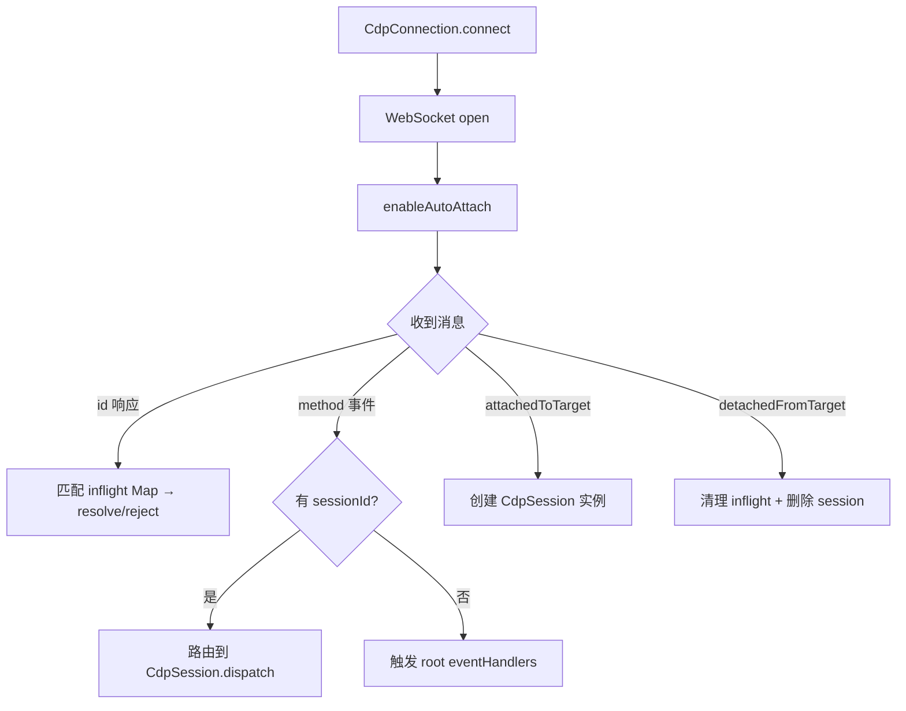
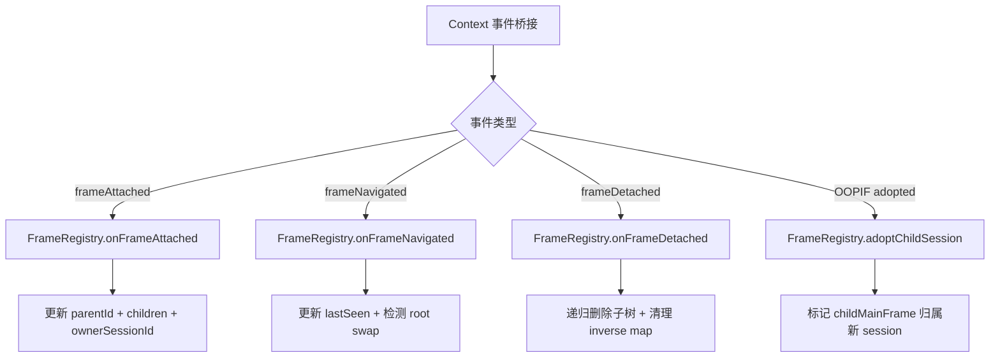
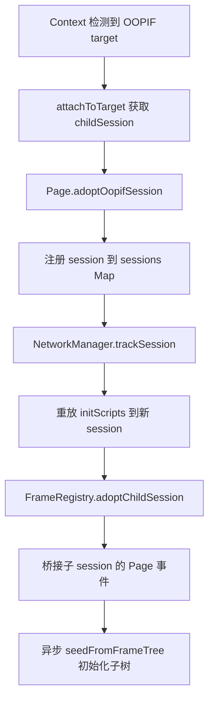

# PD-273.01 Stagehand — CDP 直连浏览器自动化抽象层

> 文档编号：PD-273.01
> 来源：Stagehand `packages/core/lib/v3/understudy/`
> GitHub：https://github.com/browserbase/stagehand.git
> 问题域：PD-273 浏览器自动化抽象层 Browser Automation Abstraction
> 状态：可复用方案

---

## 第 1 章 问题与动机

### 1.1 核心问题

浏览器自动化领域存在三大引擎（Playwright、Puppeteer、Patchright），每个引擎的 Page/Frame/Locator API 存在差异，且高级能力（Shadow DOM 穿透、OOPIF 跨进程 iframe、a11y 树捕获）的实现方式各不相同。Agent 系统需要一个统一的浏览器操作层，既能屏蔽引擎差异，又能直接操作 Chrome DevTools Protocol（CDP）获得最大控制力。

核心挑战：
- **多引擎统一**：Playwright/Puppeteer/Patchright 的 Page/Frame/Locator 接口不兼容
- **OOPIF 管理**：跨进程 iframe 的 CDP session 需要独立管理，frame 拓扑需要实时追踪
- **CDP 直连 vs 引擎 API**：引擎 API 封装过度，无法满足 Agent 对底层操作的需求（如坐标级点击、a11y 树捕获）
- **远程浏览器支持**：本地和远程（Browserbase）浏览器的文件系统、网络拓扑差异

### 1.2 Stagehand 的解法概述

Stagehand 的 understudy 模块完全绕过 Playwright/Puppeteer 的高层 API，直接基于 CDP WebSocket 构建了一套完整的浏览器抽象层：

1. **CdpConnection + CdpSession**：WebSocket 级别的 CDP 传输层，自行实现 session 多路复用（`cdp.ts:44-346`）
2. **Page + FrameRegistry**：统一的页面模型，FrameRegistry 作为 frame 拓扑和 session 归属的唯一真相源（`page.ts:79-2300`，`frameRegistry.ts:58-396`）
3. **Frame + Locator**：session 绑定的 frame 操作句柄 + objectId 驱动的元素定位器（`frame.ts:22-301`，`locator.ts:47-941`）
4. **DeepLocator + FrameLocator**：跨 iframe 的深度定位，支持 `>>` 跳转语法和 XPath iframe 穿透（`deepLocator.ts:52-270`）
5. **V3Context**：顶层编排器，管理 Target 生命周期、OOPIF 收养、piercer 注入（`context.ts:101-400+`）

### 1.3 设计思想

| 设计原则 | 具体实现 | 理由 | 替代方案 |
|----------|----------|------|----------|
| CDP 直连优先 | CdpConnection 直接管理 WebSocket，不依赖任何引擎 | 引擎 API 封装过度，无法满足 Agent 对底层操作的精确控制 | 使用 Playwright/Puppeteer 的 CDPSession API |
| 单一真相源 | FrameRegistry 统一管理 frame 拓扑 + session 归属 | 避免 Page 和 Context 各自维护不一致的 frame 映射 | 每个组件各自追踪 frame 状态 |
| objectId 驱动 | Locator 使用 objectId 而非 nodeId 进行元素操作 | nodeId 在 DOM 变更后失效，objectId 更稳定 | 基于 nodeId 的传统 DOM 操作 |
| 懒解析 | Locator 每次操作重新解析 selector | 适应动态 DOM，避免过期引用 | 缓存解析结果 |
| 事件驱动拓扑 | Context 将 Target/Page 事件桥接到 Page，Page 更新 FrameRegistry | 实时追踪 OOPIF 收养、frame 导航、root swap | 轮询 Page.getFrameTree |

---

## 第 2 章 源码实现分析

### 2.1 架构概览

```
┌─────────────────────────────────────────────────────────────────┐
│                        V3Context                                │
│  ┌──────────────┐   ┌──────────────┐   ┌──────────────┐        │
│  │  Page (tab1) │   │  Page (tab2) │   │  Page (tabN) │        │
│  │  ┌─────────┐ │   │              │   │              │        │
│  │  │FrameReg │ │   │              │   │              │        │
│  │  │ istry   │ │   │              │   │              │        │
│  │  └─────────┘ │   │              │   │              │        │
│  │  ┌─────────┐ │   │              │   │              │        │
│  │  │ Frame[] │ │   │              │   │              │        │
│  │  │ Locator │ │   │              │   │              │        │
│  │  └─────────┘ │   │              │   │              │        │
│  └──────┬───────┘   └──────────────┘   └──────────────┘        │
│         │                                                       │
│  ┌──────┴───────────────────────────────────────────────┐      │
│  │              CdpConnection (WebSocket)                │      │
│  │  ┌──────────┐  ┌──────────┐  ┌──────────┐           │      │
│  │  │CdpSession│  │CdpSession│  │CdpSession│  (OOPIF)  │      │
│  │  │ (main)   │  │ (child1) │  │ (child2) │           │      │
│  │  └──────────┘  └──────────┘  └──────────┘           │      │
│  └──────────────────────────────────────────────────────┘      │
└─────────────────────────────────────────────────────────────────┘
                          │
                    WebSocket (ws://)
                          │
                   Chrome DevTools
```

核心组件关系：
- **V3Context** 拥有 CdpConnection，管理多个 Page（每个 tab 一个）
- **Page** 拥有 FrameRegistry（frame 拓扑唯一真相源）和多个 CdpSession（主 session + OOPIF 子 session）
- **Frame** 是 session 绑定的 frame 操作句柄，由 Page 根据 FrameRegistry 的归属信息创建
- **Locator** 在 Frame 的隔离世界中解析 selector，使用 objectId 执行操作

### 2.2 核心实现

#### 2.2.1 CDP 传输层：WebSocket 多路复用



对应源码 `packages/core/lib/v3/understudy/cdp.ts:44-317`：

```typescript
export class CdpConnection implements CDPSessionLike {
  private ws: WebSocket;
  private nextId = 1;
  private inflight = new Map<number, Inflight>();
  private sessions = new Map<string, CdpSession>();
  private sessionToTarget = new Map<string, string>();

  static async connect(wsUrl: string): Promise<CdpConnection> {
    const ws = new WebSocket(wsUrl, {
      headers: { "User-Agent": `Stagehand/${STAGEHAND_VERSION}` },
    });
    await new Promise<void>((resolve, reject) => {
      ws.once("open", () => resolve());
      ws.once("error", (e) => reject(e));
    });
    return new CdpConnection(ws);
  }

  // 会话级命令通过 sessionId 字段路由
  _sendViaSession<R>(sessionId: string, method: string, params?: object): Promise<R> {
    const id = this.nextId++;
    const payload = { id, method, params, sessionId };
    this.ws.send(JSON.stringify(payload));
    return new Promise<R>((resolve, reject) => {
      this.inflight.set(id, { resolve, reject, sessionId, method, params, ts: Date.now() });
    });
  }
}
```

关键设计：
- **inflight Map**（`cdp.ts:47`）：每个 CDP 请求分配递增 id，响应通过 id 匹配回调
- **session 多路复用**（`cdp.ts:200-261`）：`onMessage` 根据 `sessionId` 字段将事件路由到对应 CdpSession
- **连接断开保护**（`cdp.ts:167-172`）：WebSocket close/error 时批量 reject 所有 inflight 请求

#### 2.2.2 FrameRegistry：frame 拓扑唯一真相源



对应源码 `packages/core/lib/v3/understudy/frameRegistry.ts:58-396`：

```typescript
export class FrameRegistry {
  private rootFrameId: FrameId;
  private frames = new Map<FrameId, FrameInfo>();
  private framesBySession = new Map<SessionId, Set<FrameId>>();

  // Root swap 处理：当新 frame 没有 parent 且 id 不同于当前 root
  onFrameAttached(frameId: FrameId, parentId: FrameId | null, sessionId: SessionId): void {
    if (!parentId && frameId !== this.rootFrameId) {
      this.renameNodeId(this.rootFrameId, frameId);
      this.rootFrameId = frameId;
      this.setOwnerSessionIdInternal(frameId, sessionId);
      return;
    }
    this.ensureNode(frameId);
    if (parentId) this.ensureNode(parentId);
    const info = this.frames.get(frameId)!;
    info.parentId = parentId ?? null;
    if (parentId) this.frames.get(parentId)!.children.add(frameId);
    this.setOwnerSessionIdInternal(frameId, sessionId);
  }

  // 双向映射维护：frame → session 和 session → Set<frame>
  private setOwnerSessionIdInternal(frameId: FrameId, sessionId: SessionId): void {
    this.ensureNode(frameId);
    const info = this.frames.get(frameId)!;
    if (info.ownerSessionId === sessionId) return;
    if (info.ownerSessionId) {
      const prev = this.framesBySession.get(info.ownerSessionId);
      prev?.delete(frameId);
    }
    info.ownerSessionId = sessionId;
    const bag = this.framesBySession.get(sessionId) ?? new Set();
    bag.add(frameId);
    this.framesBySession.set(sessionId, bag);
  }
}
```

关键设计：
- **双向映射**（`frameRegistry.ts:66-69`）：`frames` Map（frameId → FrameInfo）和 `framesBySession` Map（sessionId → Set<frameId>）保持同步
- **Root swap 处理**（`frameRegistry.ts:91-97`）：导航导致 main frame id 变化时，通过 `renameNodeId` 原子性地迁移拓扑节点
- **子树递归删除**（`frameRegistry.ts:152-195`）：frame detach 时递归收集子树，批量清理所有映射

#### 2.2.3 OOPIF 收养机制



对应源码 `packages/core/lib/v3/understudy/page.ts:435-502`：

```typescript
public adoptOopifSession(childSession: CDPSessionLike, childMainFrameId: string): void {
  if (childSession.id) this.sessions.set(childSession.id, childSession);
  this.networkManager.trackSession(childSession);
  void this.applyInitScriptsToSession(childSession).catch(() => {});

  this.registry.adoptChildSession(childSession.id ?? "child", childMainFrameId);
  this.frameCache.delete(childMainFrameId);

  // 桥接子 session 的 frame 事件到 Page 的统一处理
  childSession.on<Protocol.Page.FrameNavigatedEvent>("Page.frameNavigated", (evt) => {
    this.onFrameNavigated(evt.frame, childSession);
  });
  childSession.on<Protocol.Page.FrameAttachedEvent>("Page.frameAttached", (evt) => {
    this.onFrameAttached(evt.frameId, evt.parentFrameId ?? null, childSession);
  });

  // 异步初始化子树拓扑
  void (async () => {
    try {
      await childSession.send("Page.enable").catch(() => {});
      let { frameTree } = await childSession.send<Protocol.Page.GetFrameTreeResponse>("Page.getFrameTree");
      if (frameTree.frame.id !== childMainFrameId) {
        frameTree = { ...frameTree, frame: { ...frameTree.frame, id: childMainFrameId } };
      }
      this.registry.seedFromFrameTree(childSession.id ?? "child", frameTree);
    } catch { /* live events will converge */ }
  })();
}
```

### 2.3 实现细节

#### DeepLocator 跨 iframe 定位

DeepLocator 支持两种跨 iframe 语法：
- **`>>` 跳转语法**：`iframe#checkout >> .submit-btn`，通过 FrameLocator 链逐级解析
- **XPath iframe 穿透**：`/html/body/iframe[2]//div`，解析 XPath 步骤，遇到 iframe 节点时自动切换 frame

对应源码 `packages/core/lib/v3/understudy/deepLocator.ts:65-92`：

```typescript
export async function resolveLocatorTarget(
  page: Page, root: Frame, selectorRaw: string
): Promise<ResolvedLocatorTarget> {
  const parts = sel.split(">>").map(s => s.trim()).filter(Boolean);
  if (parts.length > 1) {
    // FrameLocator 链式解析
    let fl = frameLocatorFromFrame(page, root, parts[0]!);
    for (let i = 1; i < parts.length - 1; i++) {
      fl = fl.frameLocator(parts[i]!);
    }
    const targetFrame = await fl.resolveFrame();
    return { frame: targetFrame, selector: parts[parts.length - 1]! };
  }
  // XPath 深度解析
  const isXPath = sel.startsWith("xpath=") || sel.startsWith("/");
  if (isXPath) return resolveDeepXPathTarget(page, root, sel);
  return { frame: root, selector: sel };
}
```

#### 输入事件合成

Page 的 click/type/keyPress 方法直接通过 CDP Input domain 合成事件，支持：
- **流水线化点击**（`page.ts:1396-1426`）：mouseMoved + mousePressed + mouseReleased 并行发送，减少网络延迟
- **带错误的打字**（`page.ts:1742-1749`）：`withMistakes` 选项模拟人类打字错误（12% 概率打错 + 退格修正）
- **跨平台修饰键**（`page.ts:1968-2034`）：自动将 Cmd/Ctrl/Option 映射到对应平台的 CDP key code

---

## 第 3 章 迁移指南

### 3.1 迁移清单

**阶段 1：CDP 传输层（必须）**

- [ ] 实现 WebSocket CDP 连接管理（参考 `CdpConnection`）
- [ ] 实现 inflight 请求追踪 + 响应路由
- [ ] 实现 session 多路复用（`sessionId` 字段路由）
- [ ] 实现连接断开时的 inflight 批量 reject

**阶段 2：Frame 拓扑管理（必须）**

- [ ] 实现 FrameRegistry（frame 拓扑 + session 归属双向映射）
- [ ] 处理 root swap（导航导致 main frame id 变化）
- [ ] 实现 OOPIF 收养（子 session 事件桥接 + 子树初始化）
- [ ] 实现 frame detach 时的子树递归清理

**阶段 3：Page/Frame/Locator API（按需）**

- [ ] 实现 Page 工厂方法（`Page.create` 从 FrameTree 初始化）
- [ ] 实现 Frame 的 evaluate/screenshot/locator 方法
- [ ] 实现 Locator 的 objectId 驱动操作（click/fill/type）
- [ ] 实现 DeepLocator 跨 iframe 定位

**阶段 4：高级能力（可选）**

- [ ] 实现 NetworkManager 跨 session 网络追踪
- [ ] 实现 a11y 树捕获（`captureHybridSnapshot`）
- [ ] 实现 initScript 跨 session 重放
- [ ] 实现远程浏览器文件上传（base64 payload 注入）

### 3.2 适配代码模板

#### CDP 连接 + Session 多路复用

```typescript
import WebSocket from "ws";

interface Inflight {
  resolve: (v: unknown) => void;
  reject: (e: Error) => void;
  sessionId?: string | null;
}

interface CDPSessionLike {
  send<R = unknown>(method: string, params?: object): Promise<R>;
  on<P = unknown>(event: string, handler: (params: P) => void): void;
  off<P = unknown>(event: string, handler: (params: P) => void): void;
  readonly id: string | null;
}

class CdpTransport implements CDPSessionLike {
  private ws: WebSocket;
  private nextId = 1;
  private inflight = new Map<number, Inflight>();
  private sessions = new Map<string, CdpChildSession>();
  private eventHandlers = new Map<string, Set<(p: unknown) => void>>();
  readonly id: string | null = null;

  static async connect(wsUrl: string): Promise<CdpTransport> {
    const ws = new WebSocket(wsUrl);
    await new Promise<void>((res, rej) => {
      ws.once("open", res);
      ws.once("error", rej);
    });
    const conn = new CdpTransport(ws);
    // 启用自动 attach（flatten 模式）
    await conn.send("Target.setAutoAttach", {
      autoAttach: true, flatten: true, waitForDebuggerOnStart: true,
    });
    return conn;
  }

  private constructor(ws: WebSocket) {
    this.ws = ws;
    ws.on("message", (data) => this.route(JSON.parse(data.toString())));
    ws.on("close", () => this.rejectAll("connection closed"));
  }

  async send<R>(method: string, params?: object): Promise<R> {
    const id = this.nextId++;
    this.ws.send(JSON.stringify({ id, method, params }));
    return new Promise((resolve, reject) => {
      this.inflight.set(id, { resolve, reject, sessionId: null });
    });
  }

  on<P>(event: string, handler: (p: P) => void): void {
    const set = this.eventHandlers.get(event) ?? new Set();
    set.add(handler as (p: unknown) => void);
    this.eventHandlers.set(event, set);
  }

  off<P>(event: string, handler: (p: P) => void): void {
    this.eventHandlers.get(event)?.delete(handler as (p: unknown) => void);
  }

  private route(msg: Record<string, unknown>): void {
    if ("id" in msg) {
      const rec = this.inflight.get(msg.id as number);
      if (!rec) return;
      this.inflight.delete(msg.id as number);
      if (msg.error) rec.reject(new Error(JSON.stringify(msg.error)));
      else rec.resolve(msg.result);
      return;
    }
    const sessionId = msg.sessionId as string | undefined;
    if (sessionId) {
      this.sessions.get(sessionId)?.dispatch(msg.method as string, msg.params);
    } else {
      const handlers = this.eventHandlers.get(msg.method as string);
      if (handlers) for (const h of handlers) h(msg.params);
    }
  }

  private rejectAll(reason: string): void {
    for (const [id, entry] of this.inflight) {
      entry.reject(new Error(reason));
      this.inflight.delete(id);
    }
  }
}
```

#### FrameRegistry 最小实现

```typescript
type FrameId = string;
type SessionId = string;

interface FrameNode {
  parentId: FrameId | null;
  children: Set<FrameId>;
  ownerSessionId?: SessionId;
}

class SimpleFrameRegistry {
  private rootId: FrameId;
  private frames = new Map<FrameId, FrameNode>();
  private framesBySession = new Map<SessionId, Set<FrameId>>();

  constructor(rootId: FrameId) {
    this.rootId = rootId;
    this.ensure(rootId);
  }

  onAttached(frameId: FrameId, parentId: FrameId | null, sessionId: SessionId): void {
    if (!parentId && frameId !== this.rootId) {
      // root swap
      this.rootId = frameId;
    }
    this.ensure(frameId);
    if (parentId) {
      this.ensure(parentId);
      this.frames.get(parentId)!.children.add(frameId);
    }
    this.frames.get(frameId)!.parentId = parentId;
    this.setOwner(frameId, sessionId);
  }

  getOwnerSession(frameId: FrameId): SessionId | undefined {
    return this.frames.get(frameId)?.ownerSessionId;
  }

  private ensure(fid: FrameId): void {
    if (!this.frames.has(fid)) {
      this.frames.set(fid, { parentId: null, children: new Set() });
    }
  }

  private setOwner(frameId: FrameId, sessionId: SessionId): void {
    const node = this.frames.get(frameId)!;
    if (node.ownerSessionId) {
      this.framesBySession.get(node.ownerSessionId)?.delete(frameId);
    }
    node.ownerSessionId = sessionId;
    const bag = this.framesBySession.get(sessionId) ?? new Set();
    bag.add(frameId);
    this.framesBySession.set(sessionId, bag);
  }
}
```

### 3.3 适用场景

| 场景 | 适用度 | 说明 |
|------|--------|------|
| AI Agent 浏览器操作 | ⭐⭐⭐ | 需要坐标级点击、a11y 树捕获、跨 iframe 操作 |
| 自动化测试框架 | ⭐⭐⭐ | 需要绕过引擎限制，直接控制 CDP |
| 远程浏览器编排 | ⭐⭐⭐ | Browserbase 等远程浏览器场景，需要 WebSocket 直连 |
| 简单网页爬虫 | ⭐ | 过度设计，Playwright 原生 API 足够 |
| 单页面自动化 | ⭐⭐ | 无 iframe 场景不需要 FrameRegistry 的复杂性 |

---

## 第 4 章 测试用例

```typescript
import { describe, it, expect, vi, beforeEach } from "vitest";

// ---- CdpConnection 测试 ----
describe("CdpConnection", () => {
  it("should route responses by message id", async () => {
    const mockWs = createMockWebSocket();
    const conn = createConnectionWithMockWs(mockWs);

    const promise = conn.send<{ value: number }>("Runtime.evaluate", {
      expression: "1+1",
    });

    // 模拟 Chrome 响应
    mockWs.simulateMessage(JSON.stringify({
      id: 1,
      result: { value: 2 },
    }));

    const result = await promise;
    expect(result.value).toBe(2);
  });

  it("should reject inflight on connection close", async () => {
    const mockWs = createMockWebSocket();
    const conn = createConnectionWithMockWs(mockWs);

    const promise = conn.send("Page.enable");
    mockWs.simulateClose(1006, "abnormal");

    await expect(promise).rejects.toThrow(/connection/i);
  });

  it("should multiplex sessions by sessionId", async () => {
    const mockWs = createMockWebSocket();
    const conn = createConnectionWithMockWs(mockWs);

    // 模拟 attachedToTarget 事件
    mockWs.simulateMessage(JSON.stringify({
      method: "Target.attachedToTarget",
      params: {
        sessionId: "session-1",
        targetInfo: { targetId: "target-1", type: "page", url: "" },
      },
    }));

    const session = conn.getSession("session-1");
    expect(session).toBeDefined();
    expect(session!.id).toBe("session-1");
  });
});

// ---- FrameRegistry 测试 ----
describe("FrameRegistry", () => {
  let registry: FrameRegistry;

  beforeEach(() => {
    registry = new FrameRegistry("target-1", "frame-main");
  });

  it("should track frame attachment with parent-child relationship", () => {
    registry.onFrameAttached("frame-child", "frame-main", "session-root");

    expect(registry.getOwnerSessionId("frame-child")).toBe("session-root");
    expect(registry.getParent("frame-child")).toBe("frame-main");
  });

  it("should handle root swap on navigation", () => {
    registry.onFrameAttached("frame-new-root", null, "session-root");

    expect(registry.mainFrameId()).toBe("frame-new-root");
  });

  it("should recursively remove subtree on detach", () => {
    registry.onFrameAttached("frame-child", "frame-main", "session-root");
    registry.onFrameAttached("frame-grandchild", "frame-child", "session-root");

    registry.onFrameDetached("frame-child", "remove");

    expect(registry.listAllFrames()).not.toContain("frame-child");
    expect(registry.listAllFrames()).not.toContain("frame-grandchild");
  });

  it("should transfer ownership on OOPIF adoption", () => {
    registry.onFrameAttached("frame-iframe", "frame-main", "session-root");
    registry.adoptChildSession("session-oopif", "frame-iframe");

    expect(registry.getOwnerSessionId("frame-iframe")).toBe("session-oopif");
  });
});

// ---- DeepLocator 测试 ----
describe("DeepLocator", () => {
  it("should parse >> hop notation into FrameLocator chain", async () => {
    const mockPage = createMockPage();
    const mockRoot = createMockFrame();

    const result = await resolveLocatorTarget(
      mockPage, mockRoot, "iframe#checkout >> .submit-btn"
    );

    expect(result.selector).toBe(".submit-btn");
    // frame 应该是 iframe#checkout 内部的 frame
  });

  it("should parse XPath with iframe steps", async () => {
    const mockPage = createMockPage();
    const mockRoot = createMockFrame();

    const result = await resolveLocatorTarget(
      mockPage, mockRoot, "/html/body/iframe[1]//div[@class='content']"
    );

    expect(result.selector).toContain("xpath=");
    expect(result.selector).toContain("div[@class='content']");
  });
});
```

---

## 第 5 章 跨域关联

| 关联域 | 关系类型 | 说明 |
|--------|----------|------|
| PD-05 沙箱隔离 | 协同 | Locator 使用 `Page.createIsolatedWorld` 在隔离世界中执行 selector 解析，避免与页面脚本冲突 |
| PD-11 可观测性 | 协同 | CdpConnection 提供 `cdpLogger` 和 `cdpEventLogger` 钩子，可接入外部追踪系统记录所有 CDP 调用 |
| PD-03 容错与重试 | 依赖 | WebSocket 断开时批量 reject inflight 请求；OOPIF 收养失败时依赖 live events 最终收敛 |
| PD-01 上下文管理 | 协同 | a11y 树捕获（`captureHybridSnapshot`）为 Agent 提供结构化页面上下文，是 Agent 理解页面的关键输入 |
| PD-04 工具系统 | 协同 | Page 的 click/type/screenshot/evaluate 等方法可直接注册为 Agent 工具 |
| PD-275 DOM 感知与 a11y 树 | 强依赖 | understudy 的 a11y snapshot 模块是 PD-275 的核心实现，提供 Shadow DOM 穿透和跨 iframe a11y 树合并 |
| PD-277 Computer Use Agent | 协同 | Page 的坐标级 click/hover/scroll/type 方法是 Computer Use Agent 的底层操作原语 |

---

## 第 6 章 来源文件索引

| 文件 | 行范围 | 关键实现 |
|------|--------|----------|
| `packages/core/lib/v3/understudy/cdp.ts` | L44-L346 | CdpConnection + CdpSession：WebSocket 传输层、session 多路复用、inflight 追踪 |
| `packages/core/lib/v3/understudy/page.ts` | L79-L2300 | Page 类：frame 管理、导航、截图、输入事件合成、OOPIF 收养 |
| `packages/core/lib/v3/understudy/frameRegistry.ts` | L58-L396 | FrameRegistry：frame 拓扑唯一真相源、双向映射、root swap、子树清理 |
| `packages/core/lib/v3/understudy/frame.ts` | L22-L301 | Frame：session 绑定的 frame 操作句柄、evaluate、screenshot、a11y 树 |
| `packages/core/lib/v3/understudy/locator.ts` | L47-L941 | Locator：objectId 驱动的元素操作、click/fill/type/selectOption |
| `packages/core/lib/v3/understudy/deepLocator.ts` | L52-L270 | DeepLocator：跨 iframe 定位、>> 跳转语法、XPath iframe 穿透 |
| `packages/core/lib/v3/understudy/frameLocator.ts` | L15-L305 | FrameLocator：iframe 元素解析、child frame 匹配、LocatorDelegate |
| `packages/core/lib/v3/understudy/context.ts` | L101-L400+ | V3Context：Target 生命周期、OOPIF 检测、piercer 注入、多 tab 管理 |
| `packages/core/lib/v3/understudy/networkManager.ts` | L25-L80+ | NetworkManager：跨 session 网络追踪、idle 等待 |
| `packages/core/lib/v3/understudy/a11y/snapshot/index.ts` | L1-L5 | a11y 快照入口：captureHybridSnapshot、resolveXpathForLocation |

---

## 第 7 章 横向对比维度

```json comparison_data
{
  "project": "Stagehand",
  "dimensions": {
    "引擎抽象层级": "完全绕过引擎 API，基于 CDP WebSocket 直连自建 Page/Frame/Locator",
    "Session 管理": "CdpConnection 单 WebSocket 多路复用，inflight Map 追踪 + 自动 OOPIF 收养",
    "Frame 拓扑": "FrameRegistry 双向映射（frame↔session），支持 root swap 和子树递归清理",
    "跨 iframe 定位": "DeepLocator 支持 >> 跳转语法 + XPath iframe 步骤自动穿透",
    "元素操作策略": "objectId 驱动（非 nodeId），每次操作重新解析 selector",
    "输入事件合成": "CDP Input domain 直接合成，支持流水线化点击和带错误打字模拟",
    "远程浏览器支持": "区分本地/远程模式，远程文件上传通过 base64 payload 注入页面"
  }
}
```

### 域元数据补充

```json domain_metadata
{
  "solution_summary": "Stagehand 完全绕过 Playwright/Puppeteer API，基于 CDP WebSocket 直连自建 Page/Frame/Locator 全栈抽象，通过 FrameRegistry 双向映射管理 OOPIF 拓扑，DeepLocator 实现跨 iframe 穿透定位",
  "description": "浏览器自动化中引擎无关的 CDP 直连架构与 OOPIF 拓扑管理",
  "sub_problems": [
    "OOPIF 子 session 收养与事件桥接",
    "Root swap 时 frame id 原子性迁移",
    "远程浏览器文件上传的 base64 payload 注入",
    "initScript 跨 session 重放一致性"
  ],
  "best_practices": [
    "使用 objectId 而非 nodeId 驱动元素操作以避免 DOM 变更后失效",
    "FrameRegistry 双向映射（frame→session + session→frames）保持拓扑一致性",
    "输入事件流水线化发送减少网络延迟对交互的影响"
  ]
}
```
