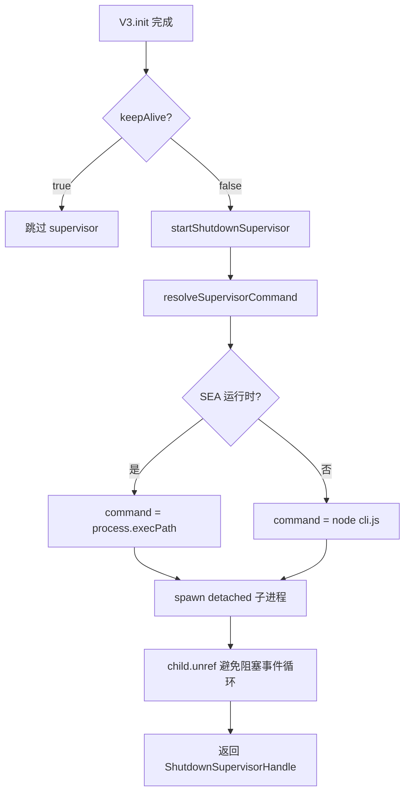
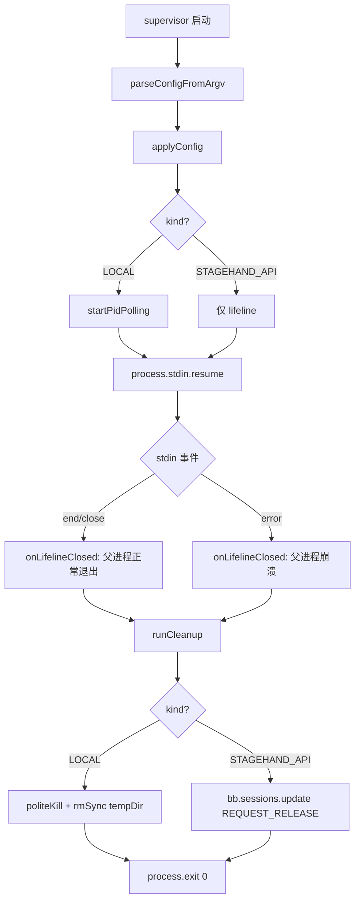
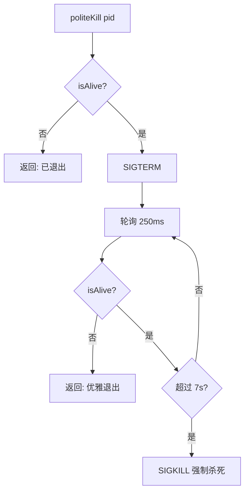

# PD-274.01 Stagehand — Shutdown Supervisor 子进程看门狗

> 文档编号：PD-274.01
> 来源：Stagehand `packages/core/lib/v3/shutdown/`
> GitHub：https://github.com/browserbase/stagehand.git
> 问题域：PD-274 进程生命周期管理 Process Lifecycle Management
> 状态：可复用方案

---

## 第 1 章 问题与动机

### 1.1 核心问题

浏览器自动化框架（如 Stagehand）在运行时会启动 Chrome 子进程或连接远程 Browserbase 会话。当父进程（Node.js 主进程）因未捕获异常、SIGKILL、OOM 等原因崩溃时，这些资源无法被正常清理：

- **本地 Chrome 进程**成为孤儿进程，持续占用 CPU/内存
- **Browserbase 远程会话**未释放，持续计费
- **临时 profile 目录**残留在磁盘上，逐渐耗尽空间

传统的 `process.on('exit')` 或 `process.on('SIGTERM')` 无法覆盖 SIGKILL 和 OOM 场景，因为这些信号会直接终止进程，不执行任何回调。

### 1.2 Stagehand 的解法概述

Stagehand 采用**独立看门狗子进程**（Shutdown Supervisor）方案：

1. **stdin lifeline 机制** — 父进程 spawn 一个 detached 子进程，通过 stdin pipe 建立"生命线"。父进程崩溃时 stdin 自动关闭，子进程检测到后执行清理（`supervisor.ts:188-201`）
2. **两阶段进程终止** — 先 SIGTERM 礼貌请求退出，等待 7 秒后 SIGKILL 强制杀死（`supervisor.ts:34-65`）
3. **双模式清理** — 根据 `kind` 字段区分 LOCAL（杀 Chrome + 删 profile）和 STAGEHAND_API（释放 Browserbase 会话）（`supervisor.ts:91-135`）
4. **幂等清理保证** — 通过 `cleanupPromise` 单例确保清理逻辑最多执行一次（`supervisor.ts:138-153`）
5. **PID 轮询补充** — 对本地 Chrome 进程额外启动 500ms 间隔的 PID 存活检测，覆盖 Chrome 自身崩溃的场景（`supervisor.ts:70-89`）

### 1.3 设计思想

| 设计原则 | 具体实现 | 理由 | 替代方案 |
|----------|----------|------|----------|
| 进程外看门狗 | detached 子进程 + stdin lifeline | 父进程被 SIGKILL 时 stdin 自动断开，无需父进程配合 | process.on('exit') 回调（无法覆盖 SIGKILL） |
| 两阶段终止 | SIGTERM → 7s 等待 → SIGKILL | 给 Chrome 优雅退出的机会，避免数据损坏 | 直接 SIGKILL（可能丢失 profile 数据） |
| 配置序列化 | JSON 通过 argv 传递 | 子进程启动时即拥有全部清理信息，无需 IPC | 通过 stdin/IPC 传配置（增加复杂度） |
| 幂等清理 | Promise 单例模式 | 多个信号源（stdin close/error/PID poll）可能同时触发 | 加锁（Promise 更简洁） |
| keepAlive 旁路 | keepAlive=true 时不启动 supervisor | 用户明确要求保留资源时跳过清理 | 总是启动 supervisor（浪费资源） |

---

## 第 2 章 源码实现分析

### 2.1 架构概览

Stagehand 的进程生命周期管理分为三层：V3 主类（生命周期入口）、supervisorClient（父进程侧 spawn 逻辑）、supervisor（子进程侧清理逻辑）。

```
┌─────────────────────────────────────────────────────┐
│                   V3 主进程 (v3.ts)                   │
│                                                       │
│  init() ──→ launchLocalChrome / createBBSession       │
│    │                                                   │
│    ├─ keepAlive=false ──→ startShutdownSupervisor()   │
│    │                        │                          │
│    │                  supervisorClient.ts               │
│    │                  spawn(cli.js --supervisor ...)    │
│    │                  stdio: ['pipe','ignore','inherit']│
│    │                        │                          │
│    │                        ▼                          │
│    │              ┌─────────────────────┐              │
│    │              │  Supervisor 子进程   │              │
│    │              │  (supervisor.ts)     │              │
│    │              │                     │              │
│    │   stdin ════>│  lifeline 监听      │              │
│    │              │  PID 轮询 (LOCAL)   │              │
│    │              └─────────────────────┘              │
│    │                                                   │
│  close() ──→ cleanupLocalBrowser() + stopSupervisor() │
└─────────────────────────────────────────────────────────┘
```

### 2.2 核心实现

#### 2.2.1 父进程侧：Supervisor 启动



对应源码 `supervisorClient.ts:76-124`：

```typescript
export function startShutdownSupervisor(
  config: ShutdownSupervisorConfig,
  opts?: { onError?: (error: Error, context: string) => void },
): ShutdownSupervisorHandle | null {
  const resolved = resolveSupervisorCommand(config);
  if (!resolved) {
    opts?.onError?.(
      new ShutdownSupervisorResolveError(
        "Shutdown supervisor entry missing (expected Stagehand CLI entrypoint).",
      ),
      "resolve",
    );
    return null;
  }

  const child = spawn(resolved.command, resolved.args, {
    // stdin is the parent lifeline.
    // Preserve supervisor stderr so crash-cleanup debug lines are visible.
    stdio: ["pipe", "ignore", "inherit"],
    detached: true,
  });

  try {
    child.unref();
    const stdin = child.stdin as unknown as { unref?: () => void } | null;
    stdin?.unref?.();
  } catch {
    // best-effort: avoid keeping the event loop alive
  }

  const stop = () => {
    try {
      child.kill("SIGTERM");
    } catch { /* ignore */ }
  };

  return { stop };
}
```

关键设计点：
- `stdio: ["pipe", "ignore", "inherit"]` — stdin 作为 lifeline pipe，stdout 忽略，stderr 继承（方便调试）
- `detached: true` — 子进程独立于父进程的进程组，父进程退出不会自动杀死它
- `child.unref()` + `stdin.unref()` — 避免子进程和 pipe 阻塞父进程的事件循环退出

#### 2.2.2 子进程侧：Lifeline 监听与清理



对应源码 `supervisor.ts:180-211`：

```typescript
export const runShutdownSupervisor = (
  initialConfig: ShutdownSupervisorConfig,
): void => {
  if (started) return;
  started = true;
  applyConfig(initialConfig);

  // Stdin is the lifeline; losing it means parent is gone.
  try {
    process.stdin.resume();
    process.stdin.on("end", () =>
      onLifelineClosed("Stagehand process completed"),
    );
    process.stdin.on("close", () =>
      onLifelineClosed("Stagehand process completed"),
    );
    process.stdin.on("error", () =>
      onLifelineClosed("Stagehand process crashed or was killed"),
    );
  } catch {
    // ignore
  }
};
```

#### 2.2.3 两阶段进程终止（politeKill）



对应源码 `supervisor.ts:34-65`：

```typescript
const politeKill = async (pid: number): Promise<void> => {
  const isAlive = (): boolean => {
    try {
      process.kill(pid, 0);  // signal 0 = 存活检测
      return true;
    } catch (error) {
      const err = error as NodeJS.ErrnoException;
      return err.code !== "ESRCH";  // ESRCH = 进程不存在
    }
  };

  if (!isAlive()) return;
  try {
    process.kill(pid, "SIGTERM");
  } catch (error) {
    const err = error as NodeJS.ErrnoException;
    if (err.code === "ESRCH") return;
  }

  const deadline = Date.now() + SIGKILL_TIMEOUT_MS;  // 7000ms
  while (Date.now() < deadline) {
    await new Promise((resolve) => setTimeout(resolve, SIGKILL_POLL_MS));  // 250ms
    if (!isAlive()) return;
  }
  try {
    process.kill(pid, "SIGKILL");
  } catch { /* best-effort */ }
};
```

### 2.3 实现细节

**配置传递机制**：父进程将 `ShutdownSupervisorConfig` 序列化为 JSON 字符串，通过 `--supervisor-config=<json>` 命令行参数传递给子进程（`supervisorClient.ts:66-70`）。这避免了 IPC 通道的复杂性，子进程启动即拥有全部清理信息。

**PID 复用防护**：当 PID 轮询检测到 Chrome 进程已退出时，设置 `localPidKnownGone = true` 标志（`supervisor.ts:82`）。后续清理时检查此标志，避免对已被操作系统复用的 PID 发送信号（`supervisor.ts:101-102`）。

**SEA 运行时兼容**：通过 `isSeaRuntime()` 检测是否运行在 Node.js Single Executable Application 中（`supervisorClient.ts:27-34`）。SEA 模式下直接用 `process.execPath` 重新执行自身，非 SEA 模式下执行 `cli.js` 入口。

**V3.close() 正常关闭路径**：正常关闭时，V3 先执行自身清理（杀 Chrome、删 profile、释放 BB 会话），最后调用 `stopShutdownSupervisor()` 发送 SIGTERM 终止 supervisor（`v3.ts:1389-1447`）。这确保正常路径不会触发 supervisor 的崩溃清理逻辑。

**双重关闭防护**：`close()` 方法通过 `_isClosing` 标志防止重入（`v3.ts:1391`）。在关闭前先解除 CDP transport close 回调，避免 API 会话结束触发 WebSocket 关闭 → `_onCdpClosed` → 再次 `close(force=true)` 的级联问题（`v3.ts:1396-1407`）。

---

## 第 3 章 迁移指南

### 3.1 迁移清单

**阶段 1：基础 Supervisor 框架**
- [ ] 创建 supervisor 子进程入口文件（CLI 或独立脚本）
- [ ] 实现 stdin lifeline 监听（`process.stdin.resume()` + `end`/`close`/`error` 事件）
- [ ] 实现配置通过 argv JSON 传递
- [ ] 父进程侧实现 `spawn(detached: true, stdio: ['pipe', 'ignore', 'inherit'])`

**阶段 2：清理逻辑**
- [ ] 实现两阶段进程终止（SIGTERM → 超时 → SIGKILL）
- [ ] 实现幂等清理（Promise 单例）
- [ ] 根据业务需求实现具体清理动作（杀进程、删文件、释放远程资源）

**阶段 3：健壮性增强**
- [ ] 添加 PID 轮询检测子进程异常退出
- [ ] 添加 PID 复用防护（`localPidKnownGone` 标志）
- [ ] 添加 `child.unref()` 避免阻塞父进程事件循环
- [ ] 添加 keepAlive 旁路逻辑

### 3.2 适配代码模板

以下是一个可直接复用的 TypeScript 实现模板：

```typescript
// === supervisor-client.ts（父进程侧） ===
import { spawn, ChildProcess } from "node:child_process";
import path from "node:path";

interface SupervisorConfig {
  kind: "PROCESS" | "REMOTE_SESSION";
  pid?: number;
  tempDir?: string;
  sessionId?: string;
  apiEndpoint?: string;
}

interface SupervisorHandle {
  stop: () => void;
}

export function startSupervisor(config: SupervisorConfig): SupervisorHandle | null {
  const supervisorPath = path.join(__dirname, "supervisor.js");
  const configArg = `--supervisor-config=${JSON.stringify({
    ...config,
    parentPid: process.pid,
  })}`;

  const child = spawn(process.execPath, [supervisorPath, "--supervisor", configArg], {
    stdio: ["pipe", "ignore", "inherit"],
    detached: true,
  });

  child.on("error", (err) => {
    console.error(`Supervisor spawn failed: ${err.message}`);
  });

  try {
    child.unref();
    (child.stdin as any)?.unref?.();
  } catch { /* best-effort */ }

  return {
    stop: () => {
      try { child.kill("SIGTERM"); } catch { /* ignore */ }
    },
  };
}

// === supervisor.ts（子进程侧） ===
const SIGKILL_POLL_MS = 250;
const SIGKILL_TIMEOUT_MS = 7_000;
const PID_POLL_INTERVAL_MS = 500;

let cleanupPromise: Promise<void> | null = null;

async function politeKill(pid: number): Promise<void> {
  const isAlive = (): boolean => {
    try { process.kill(pid, 0); return true; }
    catch (e: any) { return e.code !== "ESRCH"; }
  };

  if (!isAlive()) return;
  try { process.kill(pid, "SIGTERM"); }
  catch (e: any) { if (e.code === "ESRCH") return; }

  const deadline = Date.now() + SIGKILL_TIMEOUT_MS;
  while (Date.now() < deadline) {
    await new Promise((r) => setTimeout(r, SIGKILL_POLL_MS));
    if (!isAlive()) return;
  }
  try { process.kill(pid, "SIGKILL"); } catch { /* best-effort */ }
}

function runCleanup(config: SupervisorConfig, reason: string): Promise<void> {
  if (!cleanupPromise) {
    cleanupPromise = (async () => {
      console.error(`[supervisor] cleanup: ${reason}`);
      if (config.kind === "PROCESS" && config.pid) {
        await politeKill(config.pid);
      }
      if (config.tempDir) {
        const fs = await import("node:fs");
        try { fs.rmSync(config.tempDir, { recursive: true, force: true }); }
        catch { /* ignore */ }
      }
      if (config.kind === "REMOTE_SESSION" && config.sessionId) {
        // 调用远程 API 释放会话
        try {
          await fetch(`${config.apiEndpoint}/sessions/${config.sessionId}/release`, {
            method: "POST",
          });
        } catch { /* best-effort */ }
      }
    })();
  }
  return cleanupPromise;
}

// 入口
function main() {
  const prefix = "--supervisor-config=";
  const raw = process.argv.find((a) => a.startsWith(prefix))?.slice(prefix.length);
  if (!raw) { process.exit(1); }
  const config: SupervisorConfig = JSON.parse(raw);

  // PID 轮询（可选）
  if (config.kind === "PROCESS" && config.pid) {
    setInterval(() => {
      try { process.kill(config.pid!, 0); }
      catch (e: any) {
        if (e.code === "ESRCH") {
          runCleanup(config, "child process exited").finally(() => process.exit(0));
        }
      }
    }, PID_POLL_INTERVAL_MS);
  }

  // stdin lifeline
  process.stdin.resume();
  const onClosed = (reason: string) => {
    runCleanup(config, reason).finally(() => process.exit(0));
  };
  process.stdin.on("end", () => onClosed("parent exited normally"));
  process.stdin.on("close", () => onClosed("parent exited"));
  process.stdin.on("error", () => onClosed("parent crashed"));
}

main();
```

### 3.3 适用场景

| 场景 | 适用度 | 说明 |
|------|--------|------|
| 浏览器自动化框架 | ⭐⭐⭐ | 完美匹配：Chrome/Firefox 子进程 + 远程会话清理 |
| LLM Agent 运行时 | ⭐⭐⭐ | Agent 崩溃时清理 sandbox 容器、临时文件、API 会话 |
| 开发服务器 | ⭐⭐ | dev server 崩溃时清理子进程（webpack、vite 等） |
| 数据库连接池 | ⭐ | 连接池通常有自己的超时机制，supervisor 过重 |
| 短生命周期 CLI 工具 | ⭐ | 进程生命周期太短，supervisor 开销不值得 |

---

## 第 4 章 测试用例

```typescript
import { describe, it, expect, vi, beforeEach, afterEach } from "vitest";
import { spawn } from "node:child_process";
import fs from "node:fs";
import path from "node:path";

// 模拟 politeKill 的行为
describe("politeKill", () => {
  it("should skip if process already dead", async () => {
    const killSpy = vi.spyOn(process, "kill").mockImplementation((pid, sig) => {
      if (sig === 0) throw Object.assign(new Error(), { code: "ESRCH" });
      return true;
    });
    // politeKill 应该直接返回，不发送 SIGTERM
    // 验证 kill 只被调用一次（signal 0 检测）
    killSpy.mockRestore();
  });

  it("should SIGTERM then wait then SIGKILL", async () => {
    const calls: Array<{ pid: number; signal: string | number }> = [];
    vi.spyOn(process, "kill").mockImplementation((pid, sig) => {
      calls.push({ pid: pid as number, signal: sig as string | number });
      if (sig === 0) return true; // 进程存活
      return true;
    });
    // 验证调用顺序：signal(0) → SIGTERM → 多次 signal(0) → SIGKILL
  });

  it("should not SIGKILL if process exits within timeout", async () => {
    let callCount = 0;
    vi.spyOn(process, "kill").mockImplementation((pid, sig) => {
      callCount++;
      if (sig === 0 && callCount > 3) {
        throw Object.assign(new Error(), { code: "ESRCH" });
      }
      return true;
    });
    // 验证不会发送 SIGKILL
  });
});

describe("cleanupLocalBrowser", () => {
  it("should call killChrome and remove temp dir", async () => {
    const tmpDir = fs.mkdtempSync(path.join("/tmp", "test-profile-"));
    fs.writeFileSync(path.join(tmpDir, "test.txt"), "data");

    let killed = false;
    const { cleanupLocalBrowser } = await import(
      "../packages/core/lib/v3/shutdown/cleanupLocal"
    );
    await cleanupLocalBrowser({
      killChrome: async () => { killed = true; },
      userDataDir: tmpDir,
      createdTempProfile: true,
      preserveUserDataDir: false,
    });

    expect(killed).toBe(true);
    expect(fs.existsSync(tmpDir)).toBe(false);
  });

  it("should preserve dir when preserveUserDataDir=true", async () => {
    const tmpDir = fs.mkdtempSync(path.join("/tmp", "test-profile-"));
    const { cleanupLocalBrowser } = await import(
      "../packages/core/lib/v3/shutdown/cleanupLocal"
    );
    await cleanupLocalBrowser({
      userDataDir: tmpDir,
      createdTempProfile: true,
      preserveUserDataDir: true,
    });

    expect(fs.existsSync(tmpDir)).toBe(true);
    fs.rmSync(tmpDir, { recursive: true, force: true });
  });

  it("should not remove dir when createdTempProfile=false", async () => {
    const tmpDir = fs.mkdtempSync(path.join("/tmp", "test-profile-"));
    const { cleanupLocalBrowser } = await import(
      "../packages/core/lib/v3/shutdown/cleanupLocal"
    );
    await cleanupLocalBrowser({
      userDataDir: tmpDir,
      createdTempProfile: false,
      preserveUserDataDir: false,
    });

    expect(fs.existsSync(tmpDir)).toBe(true);
    fs.rmSync(tmpDir, { recursive: true, force: true });
  });
});

describe("runCleanup idempotency", () => {
  it("should execute cleanup exactly once even if called multiple times", async () => {
    let cleanupCount = 0;
    // 模拟 runCleanup 的 Promise 单例模式
    let cleanupPromise: Promise<void> | null = null;
    const runCleanup = (): Promise<void> => {
      if (!cleanupPromise) {
        cleanupPromise = (async () => { cleanupCount++; })();
      }
      return cleanupPromise;
    };

    await Promise.all([runCleanup(), runCleanup(), runCleanup()]);
    expect(cleanupCount).toBe(1);
  });
});

describe("stdin lifeline", () => {
  it("should trigger cleanup when stdin closes", async () => {
    // 集成测试：spawn supervisor 子进程，然后关闭 stdin
    // 验证子进程执行清理后退出
  });
});
```

---

## 第 5 章 跨域关联

| 关联域 | 关系类型 | 说明 |
|--------|----------|------|
| PD-05 沙箱隔离 | 协同 | Supervisor 负责清理沙箱环境（临时 profile 目录），沙箱隔离决定了需要清理什么 |
| PD-03 容错与重试 | 协同 | Supervisor 本身是容错机制的一部分——覆盖父进程崩溃这一最极端的故障场景 |
| PD-11 可观测性 | 依赖 | Supervisor 通过 stderr 输出清理日志（`console.error`），可接入可观测性系统 |
| PD-02 多 Agent 编排 | 协同 | 多 Agent 场景下每个 Agent 实例可独立启动 supervisor，互不干扰 |

---

## 第 6 章 来源文件索引

| 文件 | 行范围 | 关键实现 |
|------|--------|----------|
| `packages/core/lib/v3/shutdown/supervisor.ts` | L1-L211 | Supervisor 子进程主逻辑：lifeline 监听、politeKill、PID 轮询、幂等清理 |
| `packages/core/lib/v3/shutdown/supervisorClient.ts` | L1-L124 | 父进程侧 spawn 逻辑：命令解析、detached spawn、unref、stop handle |
| `packages/core/lib/v3/shutdown/cleanupLocal.ts` | L1-L35 | 共享清理函数：killChrome 回调 + 临时 profile 目录删除 |
| `packages/core/lib/v3/types/private/shutdown.ts` | L1-L23 | 类型定义：ShutdownSupervisorConfig（LOCAL/STAGEHAND_API 联合类型）、Handle |
| `packages/core/lib/v3/types/private/shutdownErrors.ts` | L1-L24 | 错误类型：ResolveError、SpawnError 层级 |
| `packages/core/lib/v3/cli.js` | L1-L13 | CLI 入口：解析 argv 启动 supervisor |
| `packages/core/lib/v3/v3.ts` | L596-L631 | V3 主类中 supervisor 的启动/停止方法 |
| `packages/core/lib/v3/v3.ts` | L861-L867 | LOCAL 模式下 supervisor 启动点 |
| `packages/core/lib/v3/v3.ts` | L952-L957 | BROWSERBASE 模式下 supervisor 启动点 |
| `packages/core/lib/v3/v3.ts` | L1389-L1447 | close() 正常关闭路径：清理资源 + 停止 supervisor |

---

## 第 7 章 横向对比维度

```json comparison_data
{
  "project": "Stagehand",
  "dimensions": {
    "崩溃检测": "stdin lifeline pipe 自动断开检测",
    "终止策略": "SIGTERM→7s轮询→SIGKILL 两阶段",
    "清理范围": "Chrome进程+临时profile+Browserbase远程会话",
    "幂等保证": "Promise单例模式，多信号源触发仅执行一次",
    "配置传递": "JSON序列化通过argv传递，无IPC依赖",
    "keepAlive旁路": "keepAlive=true时完全跳过supervisor启动"
  }
}
```

### 域元数据补充

```json domain_metadata
{
  "solution_summary": "Stagehand 用 detached 子进程 + stdin lifeline 实现看门狗，父进程崩溃时自动执行 SIGTERM→SIGKILL 两阶段 Chrome 清理和 Browserbase 会话释放",
  "description": "覆盖 SIGKILL/OOM 等无法捕获的崩溃场景下的资源回收",
  "sub_problems": [
    "PID 复用导致误杀其他进程",
    "SEA 单可执行文件环境下的 supervisor 启动"
  ],
  "best_practices": [
    "用 Promise 单例保证多信号源触发时清理仅执行一次",
    "detached spawn + child.unref 避免 supervisor 阻塞父进程退出",
    "配置通过 argv JSON 传递而非 IPC，降低启动复杂度"
  ]
}
```
