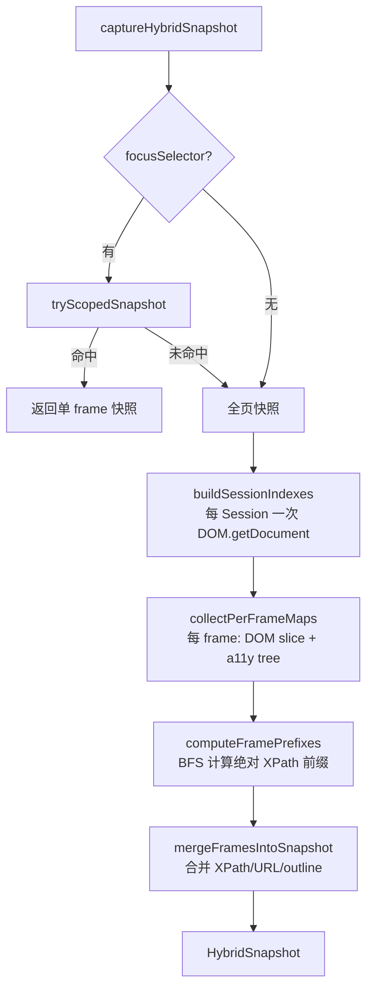
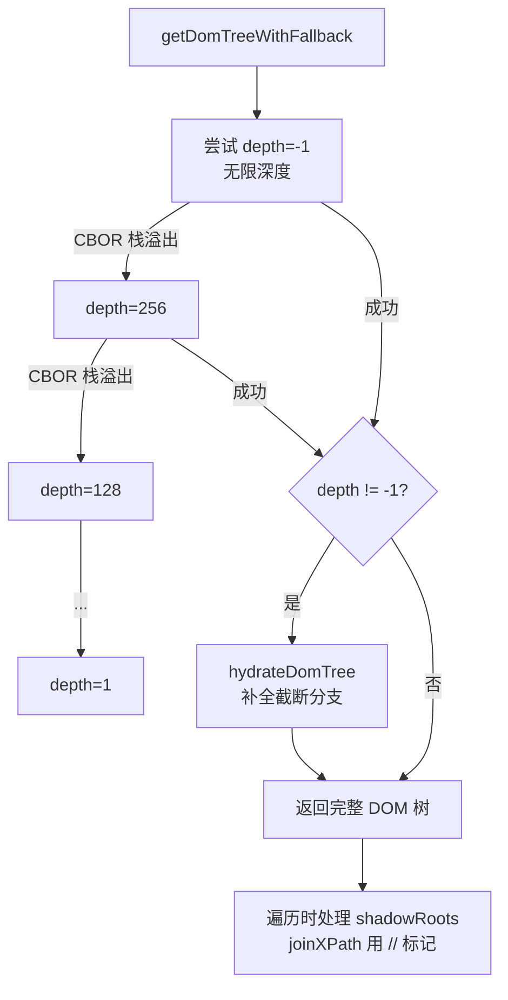
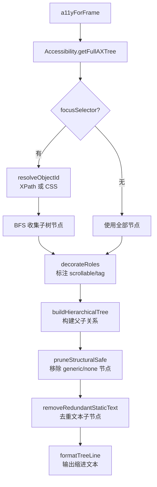

# PD-275.01 Stagehand — 混合 DOM + A11y 树快照与跨 iframe XPath 定位

> 文档编号：PD-275.01
> 来源：Stagehand `packages/core/lib/v3/understudy/a11y/snapshot/`
> GitHub：https://github.com/browserbase/stagehand.git
> 问题域：PD-275 DOM 感知与无障碍树 DOM Awareness & Accessibility Tree
> 状态：可复用方案

---

## 第 1 章 问题与动机

### 1.1 核心问题

浏览器自动化 Agent 需要"看懂"页面才能执行操作。传统方案要么只依赖 DOM 树（结构完整但语义缺失），要么只依赖 a11y 树（语义丰富但缺少精确定位信息）。现实页面还包含 Shadow DOM、嵌套 iframe、OOPIF（Out-of-Process iframe）等复杂结构，单一树模型无法覆盖所有场景。

核心挑战：
1. **DOM 树与 a11y 树信息互补** — DOM 提供 XPath/CSS 定位，a11y 提供角色/名称语义
2. **跨 iframe 定位** — 嵌套 iframe 中的元素需要绝对 XPath 才能从顶层定位
3. **Shadow DOM 穿透** — Web Components 的 Shadow Root 对常规选择器不可见
4. **深层 DOM 的 CDP 限制** — Chrome DevTools Protocol 的 CBOR 编码器在超深 DOM 树上会栈溢出
5. **多 frame 快照合并** — 需要将多个 frame 的独立树合并为统一视图

### 1.2 Stagehand 的解法概述

Stagehand 构建了一套 5 步混合快照管道（`capture.ts:45-91`），核心设计：

1. **Scoped Fast-Path** — 当提供 focusSelector 时，先尝试只捕获目标 frame 的子树，避免全页扫描（`capture.ts:119-234`）
2. **Session-Level DOM Index** — 对每个 CDP Session 只调用一次 `DOM.getDocument`，构建全局索引后按 frame 切片复用（`domTree.ts:257-312`）
3. **Per-Frame A11y + DOM 融合** — 每个 frame 独立获取 a11y 树和 DOM 映射表，通过 `encodedId`（`frameOrdinal-backendNodeId`）关联两棵树（`capture.ts:268-341`）
4. **Frame Prefix 计算** — BFS 遍历 frame 树，为每个子 frame 计算绝对 XPath 前缀，实现跨 iframe 定位（`capture.ts:348-409`）
5. **Adaptive Depth Retry** — DOM.getDocument 遇到 CBOR 栈溢出时，指数降低深度重试，再用 hydrateDomTree 补全截断分支（`domTree.ts:138-171`）

### 1.3 设计思想

| 设计原则 | 具体实现 | 理由 | 替代方案 |
|----------|----------|------|----------|
| 双树互补 | DOM 树提供 XPath/tag/scrollable，a11y 树提供 role/name/description | 单一树无法同时满足定位精度和语义理解 | 纯 DOM + aria 属性解析（丢失浏览器计算的 a11y 语义） |
| Session 级索引复用 | buildSessionDomIndex 一次构建，多 frame 切片共享 | 同进程 iframe 共享 CDP Session，避免重复 DOM.getDocument | 每 frame 独立调用（N 次 CDP 往返） |
| 编码 ID 桥接 | `frameOrdinal-backendNodeId` 作为全局唯一键 | 不同 frame 的 backendNodeId 可能冲突，加 ordinal 前缀消歧 | UUID 映射（额外内存开销） |
| 渐进式深度降级 | DOM_DEPTH_ATTEMPTS = [-1, 256, 128, ..., 1] | CBOR 栈限制随 DOM 深度变化，指数退避找到最大可用深度 | 固定浅深度（丢失深层节点） |
| Scoped 快速路径 | focusSelector 命中时只构建单 frame 快照 | 大多数操作只关注页面局部，全页快照浪费 | 始终全页扫描（延迟高） |

---

## 第 2 章 源码实现分析

### 2.1 架构概览

Stagehand 的混合快照系统由 7 个模块组成，分布在 `packages/core/lib/v3/understudy/a11y/snapshot/` 目录下：

```
┌─────────────────────────────────────────────────────────────────┐
│                    captureHybridSnapshot()                       │
│                      capture.ts:45                               │
├─────────┬──────────┬──────────┬──────────┬─────────────────────┤
│ Step 1  │ Step 2   │ Step 3   │ Step 4   │ Step 5              │
│ Scoped  │ Session  │ Per-Frame│ Frame    │ Merge               │
│ Fast    │ DOM      │ A11y +   │ Prefix   │ Frames              │
│ Path    │ Index    │ DOM Maps │ Compute  │ Into                │
│         │          │          │          │ Snapshot            │
├─────────┼──────────┼──────────┼──────────┼─────────────────────┤
│ focus   │ domTree  │ a11yTree │ xpath    │ treeFormat          │
│Selectors│ .ts      │ .ts      │ Utils.ts │ Utils.ts            │
│ .ts     │          │          │          │                     │
└─────────┴──────────┴──────────┴──────────┴─────────────────────┘
         │                                          │
         ▼                                          ▼
   sessions.ts                              snapshot types
   (CDP Session 路由)                    (HybridSnapshot, A11yNode...)
```

### 2.2 核心实现

#### 2.2.1 混合快照主管道



对应源码 `capture.ts:45-91`：

```typescript
export async function captureHybridSnapshot(
  page: Page,
  options?: SnapshotOptions,
): Promise<HybridSnapshot> {
  const pierce = options?.pierceShadow ?? true;
  const includeIframes = options?.includeIframes !== false;

  const context = buildFrameContext(page);

  // Step 1: Scoped fast-path
  const scopedSnapshot = await tryScopedSnapshot(page, options, context, pierce);
  if (scopedSnapshot) return scopedSnapshot;

  // Step 2: Build session-level DOM indexes
  const framesInScope = includeIframes ? [...context.frames] : [context.rootId];
  const sessionToIndex = await buildSessionIndexes(page, framesInScope, pierce);

  // Step 3: Per-frame DOM maps + a11y outlines
  const { perFrameMaps, perFrameOutlines } = await collectPerFrameMaps(
    page, context, sessionToIndex, options, pierce, framesInScope,
  );

  // Step 4: Compute absolute iframe prefixes
  const { absPrefix, iframeHostEncByChild } = await computeFramePrefixes(
    page, context, perFrameMaps, framesInScope,
  );

  // Step 5: Merge into final snapshot
  return mergeFramesIntoSnapshot(
    context, perFrameMaps, perFrameOutlines,
    absPrefix, iframeHostEncByChild, framesInScope,
  );
}
```

#### 2.2.2 自适应深度 DOM 获取与 Shadow DOM 穿透



对应源码 `domTree.ts:138-171`（自适应深度）和 `domTree.ts:241-247`（Shadow DOM 穿透）：

```typescript
// 自适应深度降级 — domTree.ts:12-13
const DOM_DEPTH_ATTEMPTS = [-1, 256, 128, 64, 32, 16, 8, 4, 2, 1];
const DESCRIBE_DEPTH_ATTEMPTS = [-1, 64, 32, 16, 8, 4, 2, 1];

// getDomTreeWithFallback — domTree.ts:138-171
export async function getDomTreeWithFallback(
  session: CDPSessionLike, pierce: boolean,
): Promise<Protocol.DOM.Node> {
  let lastCborMessage = "";
  for (const depth of DOM_DEPTH_ATTEMPTS) {
    try {
      const { root } = await session.send<{ root: Protocol.DOM.Node }>(
        "DOM.getDocument", { depth, pierce },
      );
      if (depth !== -1) {
        await hydrateDomTree(session, root, pierce);  // 补全截断分支
      }
      return root;
    } catch (err) {
      const message = err instanceof Error ? err.message : String(err);
      if (isCborStackError(message)) { lastCborMessage = message; continue; }
      throw err;
    }
  }
  throw new StagehandDomProcessError(/*...*/);
}

// Shadow DOM 穿透 — domTree.ts:241-247
for (const sr of node.shadowRoots ?? []) {
  stack.push({
    node: sr,
    xpath: joinXPath(xpath, "//"),  // Shadow Root 用 // 标记
  });
}
```

#### 2.2.3 A11y 树获取与结构化裁剪



对应源码 `a11yTree.ts:18-100`：

```typescript
export async function a11yForFrame(
  session: CDPSessionLike, frameId: string | undefined, opts: A11yOptions,
): Promise<AccessibilityTreeResult> {
  await session.send("Accessibility.enable").catch(() => {});
  // 获取完整 AX 树，frame 级别隔离
  let nodes: Protocol.Accessibility.AXNode[] = [];
  try {
    const params = frameId ? ({ frameId } as Record<string, unknown>) : {};
    ({ nodes } = await session.send("Accessibility.getFullAXTree", params));
  } catch (e) {
    // Frame 不存在时回退到全局 AX 树
    const isFrameScopeError = /* ... */;
    if (!isFrameScopeError || !frameId) throw e;
    ({ nodes } = await session.send("Accessibility.getFullAXTree"));
  }
  // 提取 URL 映射
  const urlMap: Record<string, string> = {};
  for (const n of nodes) { /* ... opts.encode(be) -> url ... */ }
  // 可选 focusSelector 子树裁剪
  const nodesForOutline = await (async () => { /* BFS 收集 */ })();
  // 装饰角色 + 构建层级树 + 格式化输出
  const decorated = decorateRoles(nodesForOutline, opts);
  const { tree } = await buildHierarchicalTree(decorated, opts);
  const simplified = tree.map((n) => formatTreeLine(n)).join("\n");
  return { outline: simplified.trimEnd(), urlMap, scopeApplied };
}
```

### 2.3 实现细节

**编码 ID 设计** — `capture.ts:313` 中 `enc = (be: number) => \`${page.getOrdinal(frameId)}-${be}\``，用 frame 序号 + backendNodeId 组成全局唯一键。这个 ID 同时出现在 DOM 映射表（tagNameMap/xpathMap/scrollableMap）和 a11y 树输出（formatTreeLine 中的 `[encodedId]`）中，是两棵树的桥接点。

**XPath 跨 iframe 穿透** — `focusSelectors.ts:62-136` 中 `resolveFocusFrameAndTail` 将绝对 XPath 解析为 Step 数组，遇到 `iframe/frame` 步骤时通过 `DOM.getFrameOwner` 跳入子 frame，最终返回 `(targetFrameId, tailXPath, absPrefix)` 三元组。CSS 选择器通过 `>>` 分隔符实现类似的 iframe 跳转（`focusSelectors.ts:139-200`）。

**树差异检测** — `treeFormatUtils.ts:72-103` 中 `diffCombinedTrees` 用行级 Set 差集计算页面变化，将前后两次快照的文本 outline 做 diff，返回新增行。这种设计避免了复杂的树结构 diff 算法，利用了 a11y 树文本表示的稳定性。

**结构节点裁剪** — `a11yTree.ts:213-216` 中 `isStructural` 将 `generic`、`none`、`InlineTextBox` 标记为结构性节点，在 `pruneStructuralSafe` 中递归移除这些无语义节点，只保留有角色或有名称的节点。当结构节点只有一个子节点时直接提升子节点（`a11yTree.ts:194`），减少树深度。

**冗余文本去除** — `a11yTree.ts:227-243` 中 `removeRedundantStaticTextChildren` 检测父节点 name 与所有 StaticText 子节点拼接后是否相同，相同则移除 StaticText 子节点，避免 LLM 看到重复信息。

---

## 第 3 章 迁移指南

### 3.1 迁移清单

**阶段 1：基础 DOM + A11y 双树捕获**
- [ ] 实现 CDP Session 管理（DOM.enable + Accessibility.enable）
- [ ] 封装 `getDomTreeWithFallback`：自适应深度降级 + hydrate 补全
- [ ] 封装 `a11yForFrame`：获取 AX 树 + 角色装饰 + 结构裁剪
- [ ] 定义 encodedId 编码规则（frameOrdinal-backendNodeId）
- [ ] 构建 tagNameMap / xpathMap / scrollableMap 三张映射表

**阶段 2：跨 iframe 支持**
- [ ] 实现 frame 树索引（parentByFrame Map）
- [ ] 实现 XPath 解析器（parseXPathToSteps + iframe 步骤检测）
- [ ] 实现 CSS `>>` 分隔符的 iframe 跳转
- [ ] 实现 frame prefix 计算（BFS 遍历 + prefixXPath）
- [ ] 实现多 frame 快照合并（mergeFramesIntoSnapshot）

**阶段 3：性能优化**
- [ ] 实现 Session 级 DOM Index 缓存（buildSessionDomIndex）
- [ ] 实现 Scoped Fast-Path（focusSelector 命中时跳过全页扫描）
- [ ] 实现 diffCombinedTrees 增量检测

### 3.2 适配代码模板

以下是一个可直接运行的简化版混合快照捕获器（TypeScript + Playwright CDP）：

```typescript
import type { CDPSession } from "playwright";

// --- 类型定义 ---
interface HybridSnapshot {
  a11yOutline: string;
  xpathMap: Record<string, string>;
  tagNameMap: Record<string, string>;
}

interface A11yNode {
  role: string;
  name?: string;
  nodeId: string;
  backendDOMNodeId?: number;
  parentId?: string;
  childIds?: string[];
  children?: A11yNode[];
  encodedId?: string;
}

// --- 自适应深度 DOM 获取 ---
const DEPTH_ATTEMPTS = [-1, 256, 128, 64, 32, 16, 8, 4, 2, 1];

async function getDomTree(session: CDPSession, pierce = true) {
  for (const depth of DEPTH_ATTEMPTS) {
    try {
      const { root } = await session.send("DOM.getDocument", { depth, pierce });
      return root;
    } catch (err: any) {
      if (err.message?.includes("CBOR")) continue;
      throw err;
    }
  }
  throw new Error("DOM.getDocument failed after all depth retries");
}

// --- DOM 树遍历构建 XPath 映射 ---
function buildDomMaps(root: any, frameOrdinal: number) {
  const tagNameMap: Record<string, string> = {};
  const xpathMap: Record<string, string> = {};
  const stack: Array<{ node: any; xpath: string }> = [{ node: root, xpath: "/" }];

  while (stack.length) {
    const { node, xpath } = stack.pop()!;
    if (node.backendNodeId) {
      const encId = `${frameOrdinal}-${node.backendNodeId}`;
      tagNameMap[encId] = String(node.nodeName).toLowerCase();
      xpathMap[encId] = xpath;
    }
    const kids = node.children ?? [];
    const counts: Record<string, number> = {};
    for (const child of kids) {
      const tag = String(child.nodeName).toLowerCase();
      counts[tag] = (counts[tag] ?? 0) + 1;
      const step = `${tag}[${counts[tag]}]`;
      stack.push({ node: child, xpath: `${xpath}/${step}` });
    }
    // Shadow DOM 穿透
    for (const sr of node.shadowRoots ?? []) {
      stack.push({ node: sr, xpath: `${xpath}//` });
    }
  }
  return { tagNameMap, xpathMap };
}

// --- A11y 树获取与格式化 ---
async function getA11yOutline(
  session: CDPSession,
  tagNameMap: Record<string, string>,
  frameOrdinal: number,
): Promise<string> {
  await session.send("Accessibility.enable");
  const { nodes } = await session.send("Accessibility.getFullAXTree");

  // 装饰 + 构建层级
  const nodeMap = new Map<string, A11yNode>();
  for (const n of nodes as any[]) {
    const role = String(n.role?.value ?? "");
    if (role === "generic" || role === "none") continue;
    const encId = n.backendDOMNodeId ? `${frameOrdinal}-${n.backendDOMNodeId}` : undefined;
    nodeMap.set(n.nodeId, {
      role, name: n.name?.value, nodeId: n.nodeId,
      backendDOMNodeId: n.backendDOMNodeId,
      parentId: n.parentId, childIds: n.childIds, encodedId: encId,
    });
  }
  // 构建父子关系
  for (const n of nodeMap.values()) {
    if (!n.parentId) continue;
    const parent = nodeMap.get(n.parentId);
    if (parent) (parent.children ??= []).push(n);
  }
  // 格式化输出
  const roots = [...nodeMap.values()].filter(n => !n.parentId);
  return roots.map(r => formatNode(r, 0)).join("\n");
}

function formatNode(node: A11yNode, level: number): string {
  const indent = "  ".repeat(level);
  const id = node.encodedId ?? node.nodeId;
  const label = `[${id}] ${node.role}${node.name ? `: ${node.name}` : ""}`;
  const kids = node.children?.map(c => formatNode(c, level + 1)).join("\n") ?? "";
  return kids ? `${indent}${label}\n${kids}` : `${indent}${label}`;
}

// --- 主入口 ---
export async function captureHybridSnapshot(
  session: CDPSession, frameOrdinal = 0,
): Promise<HybridSnapshot> {
  await session.send("DOM.enable");
  const root = await getDomTree(session);
  const { tagNameMap, xpathMap } = buildDomMaps(root, frameOrdinal);
  const a11yOutline = await getA11yOutline(session, tagNameMap, frameOrdinal);
  return { a11yOutline, xpathMap, tagNameMap };
}
```

### 3.3 适用场景

| 场景 | 适用度 | 说明 |
|------|--------|------|
| LLM 驱动的浏览器自动化 | ⭐⭐⭐ | 核心场景：a11y 树提供语义，XPath 提供定位 |
| Web 无障碍审计工具 | ⭐⭐⭐ | 混合树可同时检查 DOM 结构和 a11y 合规性 |
| 跨 iframe 的 E2E 测试 | ⭐⭐⭐ | 绝对 XPath 前缀解决嵌套 iframe 定位难题 |
| 页面变化监控 | ⭐⭐ | diffCombinedTrees 可检测页面结构变化 |
| 简单单页应用自动化 | ⭐ | 无 iframe/Shadow DOM 时双树方案过重 |

---

## 第 4 章 测试用例

```typescript
import { describe, it, expect } from "vitest";
import {
  parseXPathToSteps,
  buildXPathFromSteps,
  IFRAME_STEP_RE,
} from "../focusSelectors";
import {
  prefixXPath,
  normalizeXPath,
  buildChildXPathSegments,
  joinXPath,
} from "../xpathUtils";
import {
  diffCombinedTrees,
  formatTreeLine,
  cleanText,
  normaliseSpaces,
} from "../treeFormatUtils";
import {
  isStructural,
  decorateRoles,
  removeRedundantStaticTextChildren,
} from "../a11yTree";
import {
  shouldExpandNode,
  mergeDomNodes,
  relativizeXPath,
} from "../domTree";

describe("XPath 解析与构建", () => {
  it("解析简单 XPath 为步骤数组", () => {
    const steps = parseXPathToSteps("/html[1]/body[1]/div[2]");
    expect(steps).toHaveLength(3);
    expect(steps[0]).toEqual({ axis: "child", raw: "html[1]", name: "html" });
    expect(steps[2]).toEqual({ axis: "child", raw: "div[2]", name: "div" });
  });

  it("解析含 iframe 的 XPath 并检测 iframe 步骤", () => {
    const steps = parseXPathToSteps("/html[1]/body[1]/iframe[1]/div[1]");
    const iframeStep = steps.find(s => IFRAME_STEP_RE.test(s.name));
    expect(iframeStep).toBeDefined();
    expect(iframeStep!.name).toBe("iframe");
  });

  it("解析含 descendant 轴的 XPath", () => {
    const steps = parseXPathToSteps("//div[1]//span[2]");
    expect(steps[0]!.axis).toBe("desc");
    expect(steps[1]!.axis).toBe("desc");
  });

  it("步骤数组重建为 XPath 字符串", () => {
    const steps = parseXPathToSteps("/html[1]//iframe[1]/div[1]");
    expect(buildXPathFromSteps(steps)).toBe("/html[1]//iframe[1]/div[1]");
  });
});

describe("XPath 工具函数", () => {
  it("prefixXPath 正确拼接父子路径", () => {
    expect(prefixXPath("/html[1]/body[1]", "/div[1]")).toBe("/html[1]/body[1]/div[1]");
    expect(prefixXPath("/", "/div[1]")).toBe("/div[1]");
    expect(prefixXPath("/html[1]", "//shadow-child")).toBe("/html[1]//shadow-child");
  });

  it("normalizeXPath 处理 xpath= 前缀和尾部斜杠", () => {
    expect(normalizeXPath("xpath=/html[1]/body[1]/")).toBe("/html[1]/body[1]");
    expect(normalizeXPath("div[1]")).toBe("/div[1]");
    expect(normalizeXPath(undefined)).toBe("");
  });

  it("joinXPath 处理 Shadow Root 的 // 标记", () => {
    expect(joinXPath("/html[1]", "//")).toBe("/html[1]//");
    expect(joinXPath("/html[1]//", "div[1]")).toBe("/html[1]//div[1]");
  });

  it("buildChildXPathSegments 为同名兄弟生成索引", () => {
    const kids = [
      { nodeName: "div", nodeType: 1 },
      { nodeName: "div", nodeType: 1 },
      { nodeName: "span", nodeType: 1 },
    ] as any[];
    const segs = buildChildXPathSegments(kids);
    expect(segs).toEqual(["div[1]", "div[2]", "span[1]"]);
  });
});

describe("树差异检测", () => {
  it("检测新增行", () => {
    const prev = "[1] button: Submit\n[2] link: Home";
    const next = "[1] button: Submit\n[2] link: Home\n[3] heading: New Section";
    const diff = diffCombinedTrees(prev, next);
    expect(diff).toContain("heading: New Section");
    expect(diff).not.toContain("button: Submit");
  });

  it("空差异返回空字符串", () => {
    const tree = "[1] button: OK";
    expect(diffCombinedTrees(tree, tree)).toBe("");
  });
});

describe("A11y 树裁剪", () => {
  it("isStructural 识别结构性角色", () => {
    expect(isStructural("generic")).toBe(true);
    expect(isStructural("none")).toBe(true);
    expect(isStructural("button")).toBe(false);
  });

  it("removeRedundantStaticTextChildren 去除冗余文本", () => {
    const parent = { role: "link", name: "Click here", nodeId: "1" } as any;
    const children = [
      { role: "StaticText", name: "Click here", nodeId: "2" },
      { role: "img", name: "icon", nodeId: "3" },
    ] as any[];
    const result = removeRedundantStaticTextChildren(parent, children);
    expect(result).toHaveLength(1);
    expect(result[0].role).toBe("img");
  });
});

describe("DOM 树处理", () => {
  it("shouldExpandNode 检测截断节点", () => {
    expect(shouldExpandNode({ childNodeCount: 5, children: [] } as any)).toBe(true);
    expect(shouldExpandNode({ childNodeCount: 2, children: [{}, {}] } as any)).toBe(false);
  });

  it("relativizeXPath 计算相对路径", () => {
    expect(relativizeXPath("/html[1]/body[1]", "/html[1]/body[1]/div[1]")).toBe("/div[1]");
    expect(relativizeXPath("/", "/html[1]")).toBe("/html[1]");
  });
});
```

---

## 第 5 章 跨域关联

| 关联域 | 关系类型 | 说明 |
|--------|----------|------|
| PD-01 上下文管理 | 协同 | a11y 树的文本 outline 是 LLM 上下文的主要输入，树裁剪（pruneStructuralSafe）和 focusSelector 子树限定直接影响 token 消耗 |
| PD-03 容错与重试 | 依赖 | 自适应深度降级（DOM_DEPTH_ATTEMPTS）和 CBOR 栈溢出检测是 DOM 捕获的容错核心，hydrateDomTree 的逐节点补全也是重试模式 |
| PD-04 工具系统 | 协同 | 混合快照为 act/extract/observe 等工具提供页面理解基础，encodedId 是工具定位元素的唯一标识 |
| PD-05 沙箱隔离 | 协同 | locatorScripts 中的 DOM 操作函数通过 `Runtime.callFunctionOn` 在页面沙箱中执行，与主进程隔离 |
| PD-11 可观测性 | 协同 | v3Logger 在 scoped snapshot 回退时记录日志，perFrame 数据结构支持逐 frame 调试 |

---

## 第 6 章 来源文件索引

| 文件 | 行范围 | 关键实现 |
|------|--------|----------|
| `packages/core/lib/v3/understudy/a11y/snapshot/capture.ts` | L45-L91 | captureHybridSnapshot 主管道 5 步流程 |
| `packages/core/lib/v3/understudy/a11y/snapshot/capture.ts` | L119-L234 | tryScopedSnapshot 快速路径 |
| `packages/core/lib/v3/understudy/a11y/snapshot/capture.ts` | L268-L341 | collectPerFrameMaps 每 frame DOM+a11y 融合 |
| `packages/core/lib/v3/understudy/a11y/snapshot/capture.ts` | L348-L409 | computeFramePrefixes BFS 前缀计算 |
| `packages/core/lib/v3/understudy/a11y/snapshot/capture.ts` | L417-L474 | mergeFramesIntoSnapshot 多 frame 合并 |
| `packages/core/lib/v3/understudy/a11y/snapshot/a11yTree.ts` | L18-L100 | a11yForFrame AX 树获取与裁剪 |
| `packages/core/lib/v3/understudy/a11y/snapshot/a11yTree.ts` | L102-L145 | decorateRoles 角色装饰（scrollable/tag） |
| `packages/core/lib/v3/understudy/a11y/snapshot/a11yTree.ts` | L147-L211 | buildHierarchicalTree + pruneStructuralSafe |
| `packages/core/lib/v3/understudy/a11y/snapshot/a11yTree.ts` | L227-L243 | removeRedundantStaticTextChildren |
| `packages/core/lib/v3/understudy/a11y/snapshot/domTree.ts` | L12-L13 | DOM_DEPTH_ATTEMPTS / DESCRIBE_DEPTH_ATTEMPTS 常量 |
| `packages/core/lib/v3/understudy/a11y/snapshot/domTree.ts` | L57-L131 | hydrateDomTree 截断分支补全 |
| `packages/core/lib/v3/understudy/a11y/snapshot/domTree.ts` | L138-L171 | getDomTreeWithFallback 自适应深度 |
| `packages/core/lib/v3/understudy/a11y/snapshot/domTree.ts` | L257-L312 | buildSessionDomIndex Session 级索引 |
| `packages/core/lib/v3/understudy/a11y/snapshot/focusSelectors.ts` | L20-L52 | parseXPathToSteps XPath 解析器 |
| `packages/core/lib/v3/understudy/a11y/snapshot/focusSelectors.ts` | L62-L136 | resolveFocusFrameAndTail 跨 iframe XPath 解析 |
| `packages/core/lib/v3/understudy/a11y/snapshot/focusSelectors.ts` | L139-L200 | resolveCssFocusFrameAndTail CSS >> 跳转 |
| `packages/core/lib/v3/understudy/a11y/snapshot/treeFormatUtils.ts` | L72-L103 | diffCombinedTrees 行级差异检测 |
| `packages/core/lib/v3/understudy/a11y/snapshot/xpathUtils.ts` | L71-L78 | prefixXPath 跨 iframe 路径拼接 |
| `packages/core/lib/v3/understudy/a11y/snapshot/xpathUtils.ts` | L90-L108 | buildChildXPathSegments 兄弟索引 |
| `packages/core/lib/v3/understudy/a11y/snapshot/sessions.ts` | L12-L31 | ownerSession / parentSession CDP 路由 |
| `packages/core/lib/v3/types/private/snapshot.ts` | L1-L132 | 全部类型定义 |
| `packages/core/lib/v3/dom/locatorScripts/scripts.ts` | L1-L521 | DOM 操作脚本（click/fill/scroll/visibility） |

---

## 第 7 章 横向对比维度

```json comparison_data
{
  "project": "Stagehand",
  "dimensions": {
    "快照架构": "5 步管道：Scoped→SessionIndex→PerFrame→Prefix→Merge",
    "树模型": "DOM 树 + a11y 树双树融合，encodedId 桥接",
    "iframe 处理": "XPath 步骤解析 + CSS >> 分隔符，BFS 计算绝对前缀",
    "Shadow DOM": "DOM.getDocument pierce=true + joinXPath // 标记穿透",
    "深层 DOM 容错": "10 级指数深度降级 + hydrateDomTree 逐节点补全",
    "差异检测": "行级 Set 差集，避免复杂树 diff 算法",
    "性能优化": "Session 级 DOM Index 缓存 + focusSelector Scoped 快速路径"
  }
}
```

### 域元数据补充

```json domain_metadata
{
  "solution_summary": "Stagehand 用 5 步管道同时捕获 DOM 树和 a11y 树，通过 encodedId 桥接双树，支持 10 级深度降级容错和 Session 级索引缓存",
  "description": "为 LLM Agent 提供结构化页面理解的双树融合与跨 frame 定位体系",
  "sub_problems": [
    "CBOR 栈溢出的自适应深度降级与截断分支补全",
    "OOPIF 跨进程 iframe 的 CDP Session 路由",
    "a11y 树结构性节点裁剪与冗余文本去除",
    "Scoped 快速路径避免全页快照开销"
  ],
  "best_practices": [
    "用 frameOrdinal-backendNodeId 编码 ID 桥接 DOM 和 a11y 两棵树",
    "Session 级 DOM Index 一次构建多 frame 复用减少 CDP 调用",
    "focusSelector 命中时走 Scoped 快速路径跳过全页扫描",
    "行级 Set 差集做树 diff 比结构化 diff 更简单高效"
  ]
}
```
