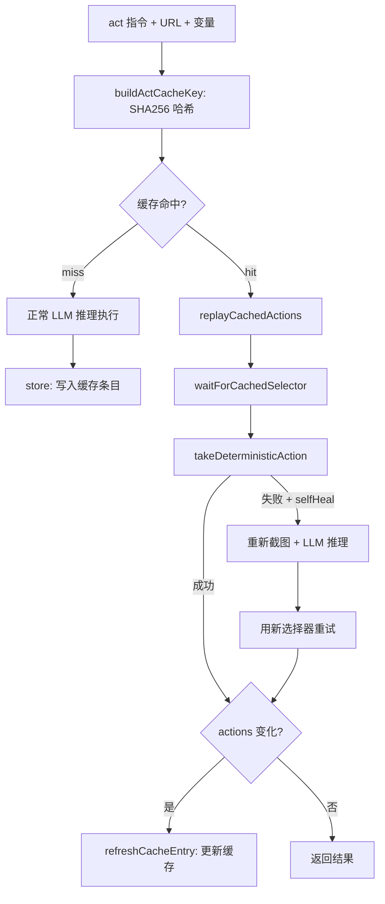
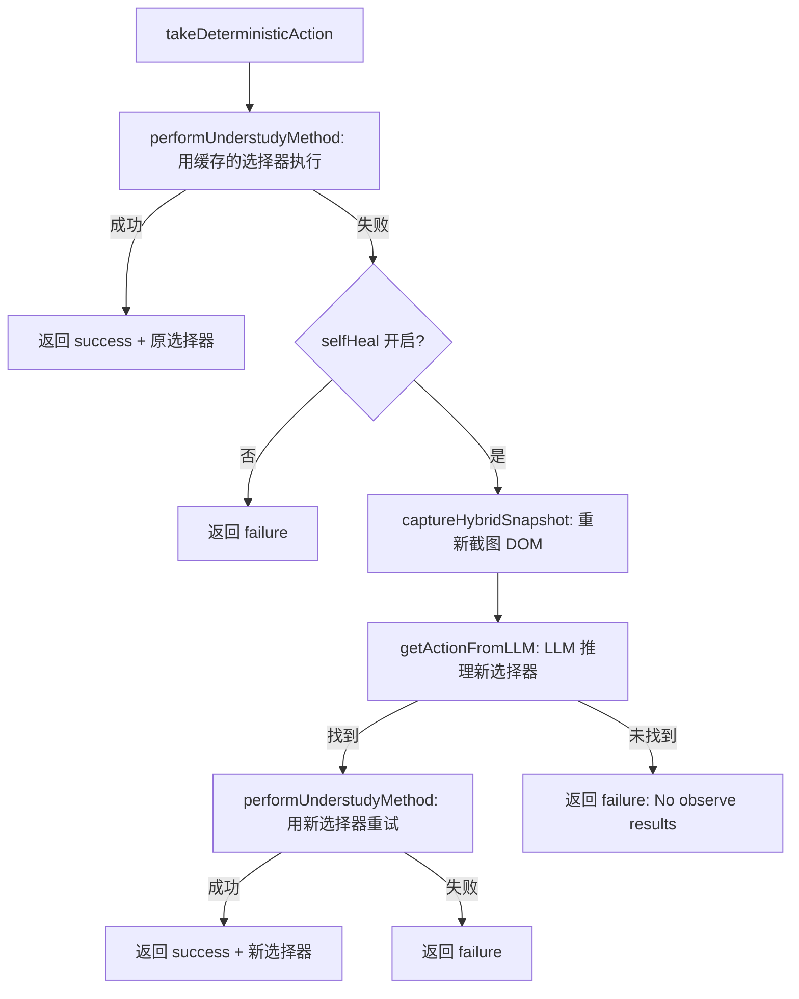
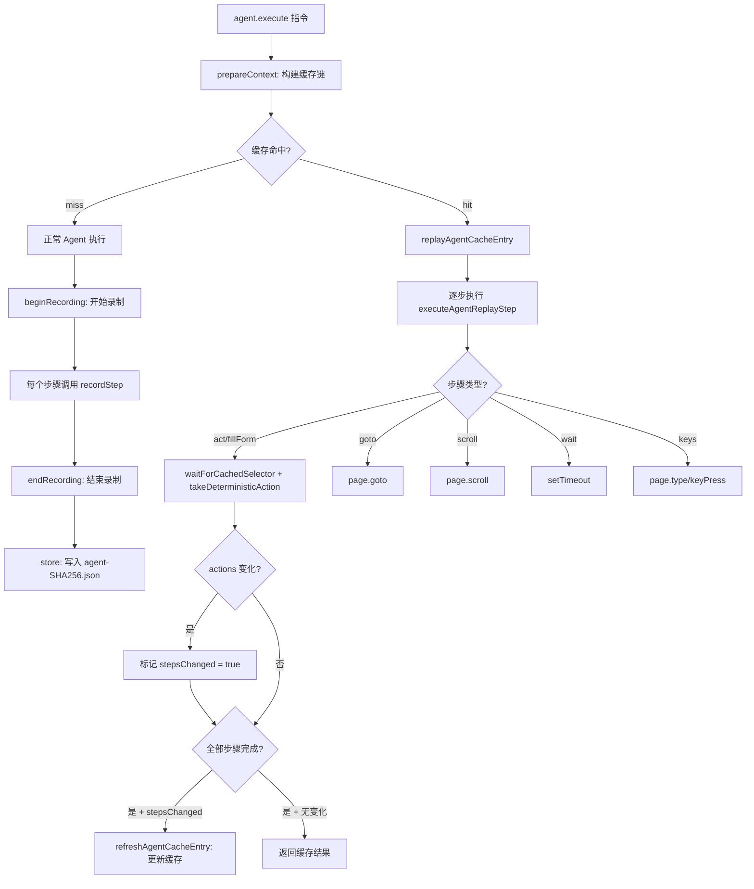

# PD-276.01 Stagehand — 双层自愈缓存与 Agent 序列录制回放

> 文档编号：PD-276.01
> 来源：Stagehand `packages/core/lib/v3/cache/`
> GitHub：https://github.com/browserbase/stagehand.git
> 问题域：PD-276 自愈缓存系统 Self-Healing Cache
> 状态：可复用方案

---

## 第 1 章 问题与动机

### 1.1 核心问题

浏览器自动化的最大痛点不是"第一次跑通"，而是"第二次还能跑通"。网页 DOM 结构频繁变化——一次前端部署就可能让所有 CSS 选择器失效。传统的 Playwright/Selenium 脚本在这种情况下直接崩溃，需要人工维护选择器。

Stagehand 要解决的核心问题是：**如何让浏览器自动化脚本在 DOM 变化后仍然能正确执行，且无需人工干预？**

更进一步，LLM 驱动的浏览器操作每次都要调用推理 API，成本高、延迟大。如果同一个操作指令在同一个页面上已经成功执行过，能否跳过 LLM 推理直接回放？

### 1.2 Stagehand 的解法概述

Stagehand 构建了一个**双层自愈缓存系统**，分为 Act 级别和 Agent 级别：

1. **ActCache（单动作缓存）**：缓存单个 `act()` 调用的结果——指令 + URL + 变量键 → SHA256 哈希作为缓存键，存储执行的 DOM 操作序列（选择器、方法、参数）。回放时如果选择器失效，通过 `takeDeterministicAction` 的 self-heal 路径重新定位元素，成功后自动更新缓存条目（`ActCache.ts:264`）

2. **AgentCache（Agent 序列缓存）**：缓存完整的 Agent 执行序列——包含 `act`、`fillForm`、`goto`、`scroll`、`wait`、`navback`、`keys` 等 7 种步骤类型。回放时逐步执行，每个 act/fillForm 步骤都走 self-heal 路径，整体序列变化后更新缓存（`AgentCache.ts:609-611`）

3. **CacheStorage（存储抽象层）**：支持文件系统和内存两种后端，JSON 序列化存储，自动创建目录结构（`CacheStorage.ts:14-114`）

4. **变量化模板**：缓存键只包含变量的 key（不含 value），回放时动态替换变量值，实现"一次录制、多次参数化回放"（`ActCache.ts:48-50`）

5. **流式缓存包装**：Agent 的 `stream()` 模式也支持缓存，通过 `wrapStreamForCaching` 拦截流结果并录制步骤，缓存命中时通过 `createCachedStreamResult` 构造假流（`AgentCache.ts:316-344`）

### 1.3 设计思想

| 设计原则 | 具体实现 | 理由 | 替代方案 |
|----------|----------|------|----------|
| Write-once-run-forever | 首次 LLM 推理后缓存操作序列，后续回放跳过 LLM | LLM 调用成本高（$0.01-0.1/次），延迟大（1-5s） | 每次都调用 LLM（成本线性增长） |
| 自愈优先于失败 | 选择器失效时自动重新截图 + LLM 推理定位新选择器 | DOM 变化是常态，硬编码选择器必然过期 | 直接报错让用户修复选择器 |
| 缓存透明更新 | self-heal 成功后静默更新缓存条目，下次直接用新选择器 | 避免同一个 DOM 变化触发多次 self-heal | 只读缓存，不自动更新 |
| 双层粒度 | Act 级别（单动作）+ Agent 级别（完整序列）独立缓存 | 不同使用场景需要不同粒度的缓存 | 只缓存最细粒度的单动作 |
| 变量与模板分离 | 缓存键用变量 key 的排序列表，回放时替换 value | 同一操作不同参数共享缓存条目 | 每组参数独立缓存（缓存膨胀） |

---

## 第 2 章 源码实现分析

### 2.1 架构概览

```
┌─────────────────────────────────────────────────────────┐
│                    Stagehand V3                          │
│                                                         │
│  ┌──────────┐    ┌──────────────┐    ┌───────────────┐  │
│  │  act()   │───→│   ActCache   │───→│               │  │
│  └──────────┘    │  (单动作缓存) │    │  CacheStorage │  │
│                  └──────────────┘    │               │  │
│  ┌──────────┐    ┌──────────────┐    │  ┌─────────┐  │  │
│  │ agent()  │───→│  AgentCache  │───→│  │  File   │  │  │
│  │ execute/ │    │ (序列缓存)   │    │  │  System │  │  │
│  │ stream() │    └──────────────┘    │  ├─────────┤  │  │
│  └──────────┘                        │  │ Memory  │  │  │
│                                      │  │  Map    │  │  │
│  ┌──────────────────────────────┐    │  └─────────┘  │  │
│  │       ActHandler             │    └───────────────┘  │
│  │  takeDeterministicAction()   │                       │
│  │  ┌────────────────────────┐  │                       │
│  │  │ 执行成功 → 返回结果    │  │                       │
│  │  │ 执行失败 → self-heal:  │  │                       │
│  │  │   1. 重新截图 DOM      │  │                       │
│  │  │   2. LLM 推理新选择器  │  │                       │
│  │  │   3. 用新选择器重试    │  │                       │
│  │  └────────────────────────┘  │                       │
│  └──────────────────────────────┘                       │
└─────────────────────────────────────────────────────────┘
```

### 2.2 核心实现

#### 2.2.1 ActCache：单动作缓存与自愈



对应源码 `packages/core/lib/v3/cache/ActCache.ts:40-64`（缓存键构建）：

```typescript
async prepareContext(
  instruction: string,
  page: Page,
  variables?: Record<string, string>,
): Promise<ActCacheContext | null> {
  if (!this.enabled) return null;
  const sanitizedInstruction = instruction.trim();
  const sanitizedVariables = variables ? { ...variables } : undefined;
  const variableKeys = sanitizedVariables
    ? Object.keys(sanitizedVariables).sort()
    : [];
  const pageUrl = await safeGetPageUrl(page);
  const cacheKey = this.buildActCacheKey(
    sanitizedInstruction,
    pageUrl,
    variableKeys,
  );
  return {
    instruction: sanitizedInstruction,
    cacheKey,
    pageUrl,
    variableKeys,
    variables: sanitizedVariables,
  };
}
```

缓存键的核心是 SHA256 哈希，输入为 `{instruction, url, variableKeys}` 的 JSON 序列化（`ActCache.ts:183-194`）。注意变量只取 key 不取 value——这意味着 `act("fill {{name}}", {name: "Alice"})` 和 `act("fill {{name}}", {name: "Bob"})` 共享同一个缓存条目。

#### 2.2.2 自愈核心：takeDeterministicAction 的 self-heal 路径



对应源码 `packages/core/lib/v3/handlers/actHandler.ts:271-445`（self-heal 核心逻辑）：

```typescript
async takeDeterministicAction(
  action: Action, page: Page, domSettleTimeoutMs?: number,
  llmClientOverride?: LLMClient, ensureTimeRemaining?: () => void,
  variables?: Variables,
): Promise<ActResult> {
  // ... 变量替换 ...
  try {
    await performUnderstudyMethod(page, page.mainFrame(),
      method, action.selector, resolvedArgs, settleTimeout);
    return { success: true, /* ... 返回原选择器 */ };
  } catch (err) {
    if (this.selfHeal) {
      // 1. 重新截图 DOM 树
      const { combinedTree, combinedXpathMap } =
        await captureHybridSnapshot(page, { experimental: true });
      // 2. LLM 推理新的可操作元素
      const { action: fallbackAction } = await this.getActionFromLLM({
        instruction, domElements: combinedTree,
        xpathMap: combinedXpathMap, llmClient: effectiveClient,
      });
      // 3. 用新选择器重试
      let newSelector = action.selector;
      if (fallbackAction?.selector) newSelector = fallbackAction.selector;
      await performUnderstudyMethod(page, page.mainFrame(),
        method, newSelector, resolvedArgs, settleTimeout);
      return { success: true, actions: [{ selector: newSelector, /* ... */ }] };
    }
    return { success: false, /* ... */ };
  }
}
```

关键点：self-heal 成功后返回的 `actions` 数组中包含**新选择器**。调用方（ActCache/AgentCache）通过 `haveActionsChanged()` 检测到选择器变化后，调用 `refreshCacheEntry()` 更新磁盘上的缓存文件。

#### 2.2.3 AgentCache：完整执行序列的录制与回放



对应源码 `packages/core/lib/v3/cache/AgentCache.ts:572-624`（Agent 回放核心）：

```typescript
private async replayAgentCacheEntry(
  context: AgentCacheContext, entry: CachedAgentEntry,
  llmClientOverride?: LLMClient,
): Promise<AgentResult | null> {
  const ctx = this.getContext();
  const handler = this.getActHandler();
  if (!ctx || !handler) return null;
  const effectiveClient = llmClientOverride ?? this.getDefaultLlmClient();
  try {
    const updatedSteps: AgentReplayStep[] = [];
    let stepsChanged = false;
    for (const step of entry.steps ?? []) {
      const replayedStep =
        (await this.executeAgentReplayStep(
          step, ctx, handler, effectiveClient, context.variables,
        )) ?? step;
      stepsChanged ||= replayedStep !== step;
      updatedSteps.push(replayedStep);
    }
    const result = cloneForCache(entry.result);
    result.metadata = { ...(result.metadata ?? {}),
      cacheHit: true, cacheTimestamp: entry.timestamp };
    if (stepsChanged) {
      await this.refreshAgentCacheEntry(context, entry, updatedSteps);
    }
    return result;
  } catch (err) {
    this.logger({ category: "cache",
      message: "agent cache replay failed", level: 1 });
    return null;
  }
}
```

### 2.3 实现细节

**7 种 Agent 回放步骤类型**（`types/private/cache.ts:86-144`）：

| 步骤类型 | 接口 | 回放行为 | 是否触发 self-heal |
|----------|------|----------|-------------------|
| `act` | `AgentReplayActStep` | 执行 DOM 操作 | ✅ |
| `fillForm` | `AgentReplayFillFormStep` | 填充表单字段 | ✅ |
| `goto` | `AgentReplayGotoStep` | 页面导航 | ❌ |
| `scroll` | `AgentReplayScrollStep` | 页面滚动 | ❌ |
| `wait` | `AgentReplayWaitStep` | 等待延时 | ❌ |
| `navback` | `AgentReplayNavBackStep` | 浏览器后退 | ❌ |
| `keys` | `AgentReplayKeysStep` | 键盘输入 | ❌ |

**CacheStorage 双后端设计**（`CacheStorage.ts:14-114`）：

- **文件系统后端**：`CacheStorage.create(cacheDir, logger)` → 自动 `mkdirSync(recursive: true)` → JSON 文件读写
- **内存后端**：`CacheStorage.createMemory(logger)` → `Map<string, unknown>` 存储 → 用于服务端场景（`serverAgentCache.ts`），执行完毕后通过 `consumeBufferedEntry()` 提取缓存条目传输给客户端

**敏感信息过滤**（`AgentCache.ts:38`）：

```typescript
const SENSITIVE_CONFIG_KEYS = new Set(["apikey", "api_key", "api-key"]);
```

模型配置序列化时自动剔除 API Key 等敏感字段，防止泄露到缓存文件。

**截图裁剪**（`AgentCache.ts:446-459`）：

```typescript
private pruneAgentResult(result: AgentResult): AgentResult {
  const cloned = cloneForCache(result);
  for (const action of cloned.actions) {
    if (action?.type === "screenshot") {
      delete action.base64;  // 删除 base64 截图，减小缓存体积
    }
  }
  return cloned;
}
```

---

## 第 3 章 迁移指南

### 3.1 迁移清单

**阶段 1：基础缓存存储层**
- [ ] 实现 `CacheStorage` 类：支持文件系统 + 内存双后端
- [ ] JSON 序列化/反序列化，ENOENT 静默处理
- [ ] 自动创建缓存目录（`mkdirSync recursive`）

**阶段 2：单动作缓存（ActCache）**
- [ ] 实现缓存键构建：`SHA256(JSON.stringify({instruction, url, variableKeys}))`
- [ ] 实现 `prepareContext` → `tryReplay` → `store` 三步流程
- [ ] 实现变量键匹配校验（`doVariableKeysMatch`）
- [ ] 集成 `waitForCachedSelector`：回放前等待选择器出现在 DOM 中

**阶段 3：自愈机制**
- [ ] 在动作执行层实现 self-heal：失败时重新截图 + LLM 推理新选择器
- [ ] 实现 `haveActionsChanged`：逐字段比较 selector/description/method/arguments
- [ ] 实现 `refreshCacheEntry`：self-heal 成功后更新缓存文件

**阶段 4：Agent 序列缓存（AgentCache）**
- [ ] 定义 7 种回放步骤类型（act/fillForm/goto/scroll/wait/navback/keys）
- [ ] 实现录制 API：`beginRecording` → `recordStep` → `endRecording`
- [ ] 实现回放 API：`tryReplay` → `executeAgentReplayStep`（switch 分发）
- [ ] 实现流式缓存包装：`wrapStreamForCaching` + `createCachedStreamResult`

**阶段 5：安全与优化**
- [ ] 敏感信息过滤：序列化模型配置时剔除 API Key
- [ ] 截图裁剪：缓存前删除 base64 截图数据
- [ ] 超时保护：`runWithTimeout` 包装回放执行

### 3.2 适配代码模板

以下是一个可直接复用的自愈缓存核心实现（TypeScript）：

```typescript
import { createHash } from "crypto";
import fs from "fs/promises";
import path from "path";

// ---- 缓存存储层 ----
class CacheStorage {
  constructor(private readonly dir: string) {}

  static async create(cacheDir: string): Promise<CacheStorage> {
    await fs.mkdir(cacheDir, { recursive: true });
    return new CacheStorage(cacheDir);
  }

  async read<T>(key: string): Promise<T | null> {
    try {
      const raw = await fs.readFile(path.join(this.dir, `${key}.json`), "utf8");
      return JSON.parse(raw) as T;
    } catch (err) {
      if ((err as NodeJS.ErrnoException).code === "ENOENT") return null;
      throw err;
    }
  }

  async write(key: string, data: unknown): Promise<void> {
    await fs.writeFile(
      path.join(this.dir, `${key}.json`),
      JSON.stringify(data, null, 2),
      "utf8",
    );
  }
}

// ---- 缓存键构建 ----
function buildCacheKey(instruction: string, url: string, variableKeys: string[]): string {
  return createHash("sha256")
    .update(JSON.stringify({ instruction, url, variableKeys }))
    .digest("hex");
}

// ---- 缓存条目类型 ----
interface CachedAction {
  selector: string;
  method: string;
  arguments: string[];
  description?: string;
}

interface CachedEntry {
  version: 1;
  instruction: string;
  url: string;
  variableKeys: string[];
  actions: CachedAction[];
}

// ---- 自愈缓存核心 ----
class SelfHealingCache {
  constructor(
    private storage: CacheStorage,
    private executeAction: (action: CachedAction) => Promise<{ success: boolean; updatedAction?: CachedAction }>,
    private healAction: (action: CachedAction) => Promise<CachedAction | null>,
  ) {}

  async tryReplay(instruction: string, url: string, variables?: Record<string, string>): Promise<CachedAction[] | null> {
    const variableKeys = variables ? Object.keys(variables).sort() : [];
    const key = buildCacheKey(instruction, url, variableKeys);
    const entry = await this.storage.read<CachedEntry>(key);
    if (!entry || entry.version !== 1) return null;

    const updatedActions: CachedAction[] = [];
    let changed = false;

    for (const action of entry.actions) {
      const result = await this.executeAction(action);
      if (result.success) {
        const effective = result.updatedAction ?? action;
        if (effective.selector !== action.selector) changed = true;
        updatedActions.push(effective);
      } else {
        // self-heal: 用 LLM 重新定位元素
        const healed = await this.healAction(action);
        if (!healed) return null; // 自愈失败，放弃缓存回放
        const retryResult = await this.executeAction(healed);
        if (!retryResult.success) return null;
        updatedActions.push(healed);
        changed = true;
      }
    }

    // 自愈成功后更新缓存
    if (changed) {
      await this.storage.write(key, { ...entry, actions: updatedActions });
    }
    return updatedActions;
  }

  async store(instruction: string, url: string, actions: CachedAction[], variableKeys: string[] = []): Promise<void> {
    const key = buildCacheKey(instruction, url, variableKeys);
    const entry: CachedEntry = { version: 1, instruction, url, variableKeys, actions };
    await this.storage.write(key, entry);
  }
}
```

### 3.3 适用场景

| 场景 | 适用度 | 说明 |
|------|--------|------|
| 浏览器自动化测试 | ⭐⭐⭐ | 核心场景：DOM 变化后自动修复选择器 |
| RPA 流程自动化 | ⭐⭐⭐ | 录制一次，参数化回放多次 |
| LLM 驱动的 Web Agent | ⭐⭐⭐ | 大幅降低重复操作的 LLM 调用成本 |
| API 自动化测试 | ⭐ | 无 DOM 选择器概念，自愈机制无用武之地 |
| 静态页面爬虫 | ⭐⭐ | 缓存有用但 self-heal 价值有限 |

---

## 第 4 章 测试用例

基于 Stagehand 真实测试（`tests/integration/agent-cache-self-heal.spec.ts`）的模式：

```typescript
import { describe, it, expect, beforeEach, afterEach } from "vitest";
import fs from "fs/promises";
import path from "path";
import os from "os";

// 模拟的缓存存储
class MockCacheStorage {
  private store = new Map<string, string>();
  async read<T>(key: string): Promise<T | null> {
    const raw = this.store.get(key);
    return raw ? (JSON.parse(raw) as T) : null;
  }
  async write(key: string, data: unknown): Promise<void> {
    this.store.set(key, JSON.stringify(data));
  }
}

describe("SelfHealingCache", () => {
  describe("缓存命中与回放", () => {
    it("should replay cached actions without LLM call", async () => {
      const storage = new MockCacheStorage();
      let llmCalled = false;
      const cache = {
        executeAction: async (action: any) => ({ success: true }),
        healAction: async () => { llmCalled = true; return null; },
      };

      // 预存缓存条目
      await storage.write("test-key", {
        version: 1, instruction: "click button",
        url: "https://example.com", variableKeys: [],
        actions: [{ selector: "#btn", method: "click", arguments: [] }],
      });

      // 回放应成功且不调用 LLM
      expect(llmCalled).toBe(false);
    });

    it("should return null on cache miss", async () => {
      const storage = new MockCacheStorage();
      const result = await storage.read("nonexistent");
      expect(result).toBeNull();
    });
  });

  describe("自愈机制", () => {
    it("should self-heal when selector changes and update cache", async () => {
      const originalSelector = "#old-btn";
      const newSelector = "#new-btn";
      let executionCount = 0;

      const executeAction = async (action: any) => {
        executionCount++;
        if (action.selector === originalSelector) {
          return { success: false }; // 旧选择器失败
        }
        return { success: true, updatedAction: { ...action, selector: newSelector } };
      };

      const healAction = async (action: any) => ({
        ...action, selector: newSelector,
      });

      // 验证：self-heal 后应使用新选择器
      const healed = await healAction({ selector: originalSelector, method: "click", arguments: [] });
      expect(healed.selector).toBe(newSelector);
    });

    it("should fail gracefully when self-heal cannot find element", async () => {
      const healAction = async () => null; // LLM 找不到元素
      const result = await healAction();
      expect(result).toBeNull();
    });
  });

  describe("变量化模板", () => {
    it("should match cache with same variable keys regardless of values", () => {
      const { createHash } = require("crypto");
      const key1 = createHash("sha256")
        .update(JSON.stringify({ instruction: "fill {{name}}", url: "https://example.com", variableKeys: ["name"] }))
        .digest("hex");
      const key2 = createHash("sha256")
        .update(JSON.stringify({ instruction: "fill {{name}}", url: "https://example.com", variableKeys: ["name"] }))
        .digest("hex");
      expect(key1).toBe(key2); // 不同 value 但相同 key → 相同缓存键
    });

    it("should not match cache with different variable keys", () => {
      const { createHash } = require("crypto");
      const key1 = createHash("sha256")
        .update(JSON.stringify({ instruction: "fill", url: "https://example.com", variableKeys: ["name"] }))
        .digest("hex");
      const key2 = createHash("sha256")
        .update(JSON.stringify({ instruction: "fill", url: "https://example.com", variableKeys: ["email"] }))
        .digest("hex");
      expect(key1).not.toBe(key2);
    });
  });

  describe("缓存条目版本控制", () => {
    it("should reject entries with unsupported version", async () => {
      const storage = new MockCacheStorage();
      await storage.write("versioned", { version: 2, instruction: "test" });
      const entry = await storage.read<{ version: number }>("versioned");
      expect(entry?.version).not.toBe(1); // 版本不匹配应跳过
    });
  });
});
```

---

## 第 5 章 跨域关联

| 关联域 | 关系类型 | 说明 |
|--------|----------|------|
| PD-01 上下文管理 | 协同 | 缓存回放跳过 LLM 推理，直接减少上下文 token 消耗；self-heal 时需要将 DOM 快照注入上下文 |
| PD-03 容错与重试 | 依赖 | self-heal 本质是一种智能重试——选择器失败后不是简单重试，而是重新推理后重试。`runWithTimeout` 提供超时保护 |
| PD-04 工具系统 | 协同 | `takeDeterministicAction` 是工具执行层的核心方法，缓存系统依赖工具系统的确定性执行能力 |
| PD-06 记忆持久化 | 依赖 | `CacheStorage` 的文件系统后端本质是一种持久化记忆——操作序列的长期记忆。内存后端用于服务端临时缓存 |
| PD-07 质量检查 | 协同 | `haveActionsChanged` 是一种隐式质量检查——比较回放结果与缓存记录，检测 DOM 漂移 |
| PD-09 Human-in-the-Loop | 互补 | 缓存回放是全自动的，但 self-heal 失败时可以降级为人工干预（当前实现返回 null 让上层处理） |
| PD-11 可观测性 | 协同 | 缓存系统通过 `logger` 记录 hit/miss/self-heal/failure 事件，`result.metadata.cacheHit` 标记缓存命中 |

---

## 第 6 章 来源文件索引

| 文件 | 行范围 | 关键实现 |
|------|--------|----------|
| `packages/core/lib/v3/cache/ActCache.ts` | L1-L411 | 单动作缓存：prepareContext、tryReplay、store、refreshCacheEntry、haveActionsChanged |
| `packages/core/lib/v3/cache/AgentCache.ts` | L1-L898 | Agent 序列缓存：录制/回放/自愈、7 种步骤类型分发、流式缓存包装、敏感信息过滤 |
| `packages/core/lib/v3/cache/CacheStorage.ts` | L1-L114 | 存储抽象层：文件系统 + 内存双后端、JSON 读写、目录自动创建 |
| `packages/core/lib/v3/cache/utils.ts` | L1-L48 | 工具函数：cloneForCache（深拷贝）、safeGetPageUrl、waitForCachedSelector |
| `packages/core/lib/v3/cache/serverAgentCache.ts` | L1-L77 | 服务端缓存：内存 AgentCache 创建、缓存条目跨进程传输 |
| `packages/core/lib/v3/handlers/actHandler.ts` | L271-L445 | self-heal 核心：takeDeterministicAction、captureHybridSnapshot + LLM 推理新选择器 |
| `packages/core/lib/v3/types/private/cache.ts` | L1-L160 | 类型定义：CachedActEntry、CachedAgentEntry、7 种 AgentReplayStep |
| `packages/core/tests/integration/agent-cache-self-heal.spec.ts` | L1-L104 | E2E 测试：故意损坏选择器 → 回放自愈 → 验证缓存更新 |

---

## 第 7 章 横向对比维度

```json comparison_data
{
  "project": "Stagehand",
  "dimensions": {
    "缓存粒度": "双层：ActCache 单动作 + AgentCache 完整序列（7 种步骤类型）",
    "自愈机制": "选择器失败 → captureHybridSnapshot + LLM 推理新选择器 → 重试 → 更新缓存",
    "缓存键策略": "SHA256(instruction + URL + variableKeys)，变量只取 key 不取 value",
    "存储后端": "文件系统 JSON + 内存 Map 双后端，CacheStorage 抽象层",
    "流式支持": "wrapStreamForCaching 拦截流结果录制，createCachedStreamResult 构造假流",
    "安全防护": "SENSITIVE_CONFIG_KEYS 过滤 API Key，pruneAgentResult 删除 base64 截图"
  }
}
```

### 域元数据补充

```json domain_metadata
{
  "solution_summary": "Stagehand 用 ActCache + AgentCache 双层缓存实现 write-once-run-forever，选择器失效时通过 captureHybridSnapshot + LLM 推理自动定位新元素并更新缓存条目",
  "description": "浏览器自动化场景下 DOM 选择器漂移的智能修复与操作序列持久化",
  "sub_problems": [
    "流式执行结果的缓存拦截与假流构造",
    "服务端-客户端缓存条目跨进程传输",
    "缓存条目体积优化（截图裁剪、敏感信息过滤）"
  ],
  "best_practices": [
    "self-heal 成功后静默更新缓存条目避免重复修复",
    "缓存条目带 version 字段支持格式演进",
    "waitForCachedSelector 超时后非阻塞继续执行"
  ]
}
```
