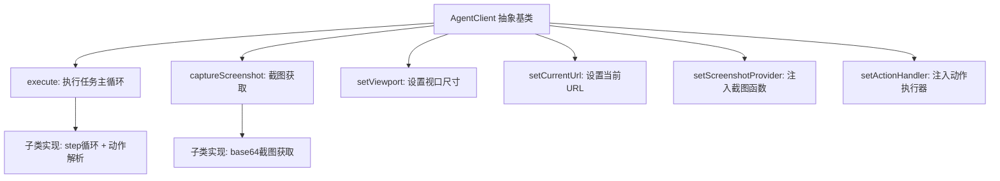
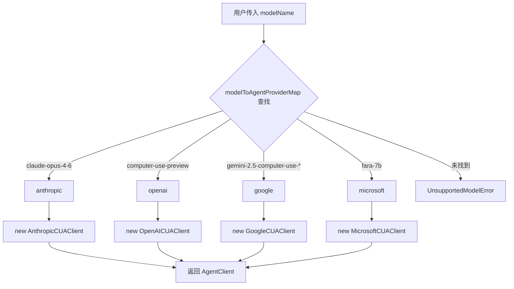

# PD-277.01 Stagehand — 四供应商 CUA 抽象层与三模式工具切换

> 文档编号：PD-277.01
> 来源：Stagehand `packages/core/lib/v3/agent/`
> GitHub：https://github.com/browserbase/stagehand.git
> 问题域：PD-277 Computer Use Agent 多模态
> 状态：可复用方案

---

## 第 1 章 问题与动机

### 1.1 核心问题

Computer Use Agent（CUA）是 LLM 通过截图感知屏幕、通过坐标/键盘操作浏览器的新范式。但各供应商的 CUA API 协议差异巨大：

- **Anthropic** 使用 `tool_use` / `tool_result` 消息格式，坐标以像素绝对值传递，截图以 base64 嵌入 `tool_result` 的 `image` content block
- **OpenAI** 使用 `computer_call` / `computer_call_output` 专用消息类型，截图以 `input_image` + `image_url` 格式返回，支持 `pending_safety_checks` 安全确认
- **Google** 坐标使用 0-1000 归一化范围（非像素值），需要运行时转换为实际视口像素
- **Microsoft (FARA)** 使用 OpenAI 兼容 API 但采用 XML 格式的函数调用，需要独立的 MLM 处理器配置

同时，不同场景对操作粒度的需求不同：简单表单填写用 DOM 语义操作更可靠，复杂视觉交互需要坐标级操作，而纯截图驱动的自动化则需要 CUA 供应商原生能力。

### 1.2 Stagehand 的解法概述

Stagehand 通过三层抽象解决了这个问题：

1. **AgentClient 抽象基类**（`AgentClient.ts:13-45`）— 定义 6 个抽象方法（execute / captureScreenshot / setViewport / setCurrentUrl / setScreenshotProvider / setActionHandler），所有供应商实现同一接口
2. **AgentProvider 工厂**（`AgentProvider.ts:37-130`）— 通过 `modelToAgentProviderMap` 将 13 个模型名映射到 4 个供应商，`getClient()` 按 switch-case 实例化对应客户端
3. **三模式工具系统**（`tools/index.ts:59-85`）— `dom` / `hybrid` / `cua` 三种模式通过 `filterTools()` 动态裁剪 16 个工具集，dom 模式移除坐标工具，hybrid 模式移除 DOM 表单工具，cua 模式直接使用供应商原生 computer_use 能力

### 1.3 设计思想

| 设计原则 | 具体实现 | 理由 | 替代方案 |
|----------|----------|------|----------|
| 协议适配层隔离 | 每个供应商独立 Client 类，各自处理消息格式转换 | 供应商 API 差异太大，无法用配置抹平 | 统一中间格式 + 双向转换器（更复杂） |
| 模型名→供应商自动路由 | `modelToAgentProviderMap` 静态映射表 | 用户只需指定模型名，无需关心底层供应商 | 让用户显式指定 provider（已支持作为 fallback） |
| 三模式渐进增强 | dom → hybrid → cua 三级操作粒度 | 不同场景对可靠性/灵活性的权衡不同 | 只提供 cua 模式（牺牲简单场景的可靠性） |
| 截图压缩保留最近 N 张 | `compressConversationImages()` 保留最近 2 张，旧截图替换为 "screenshot taken" 文本 | CUA 对话中截图占大量 token，必须压缩 | 全部保留（token 爆炸）或全部丢弃（丢失上下文） |
| 坐标归一化统一处理 | Google 的 0-1000 范围通过 `normalizeGoogleCoordinates()` 转为像素值 | 其他供应商直接用像素，只有 Google 需要转换 | 所有供应商都归一化到 0-1（过度设计） |
| 安全确认回调 | `SafetyConfirmationHandler` 回调 + `pending_safety_checks` 处理 | CUA 操作可能触发敏感行为，需要人类确认 | 自动跳过（不安全）或全部阻断（不实用） |

---

## 第 2 章 源码实现分析

### 2.1 架构概览

Stagehand 的 CUA 架构是一个经典的策略模式 + 工厂模式组合：

```
┌─────────────────────────────────────────────────────────────┐
│                      AgentProvider                          │
│  modelToAgentProviderMap: 13 models → 4 providers           │
│  getClient(modelName) → AgentClient                         │
└──────────────┬──────────────────────────────────────────────┘
               │ creates
    ┌──────────┼──────────┬──────────────┬────────────────┐
    ▼          ▼          ▼              ▼                │
┌────────┐ ┌────────┐ ┌────────┐  ┌──────────┐          │
│Anthropic│ │ OpenAI │ │ Google │  │Microsoft │          │
│CUAClient│ │CUAClient│ │CUAClient│  │CUAClient │          │
└────┬───┘ └────┬───┘ └────┬───┘  └─────┬────┘          │
     │          │          │             │               │
     └──────────┴──────────┴─────────────┘               │
               │ all extend                              │
        ┌──────┴──────┐                                  │
        │ AgentClient  │ ← abstract base                 │
        │ (6 methods)  │                                  │
        └─────────────┘                                  │
               │ uses                                    │
    ┌──────────┼──────────────────┐                      │
    ▼          ▼                  ▼                      │
┌────────┐ ┌──────────┐  ┌──────────────┐               │
│  Key   │ │Coordinate│  │   Image      │               │
│Mapping │ │Normalize │  │ Compression  │               │
└────────┘ └──────────┘  └──────────────┘               │
                                                         │
┌─────────────────────────────────────────────────────────┘
│              Tool System (16 tools)
│  ┌─────────┐  ┌─────────┐  ┌─────────┐
│  │dom mode │  │hybrid   │  │cua mode │
│  │(act,    │  │(click,  │  │(native  │
│  │fillForm)│  │type,    │  │computer │
│  │         │  │drag...) │  │use API) │
│  └─────────┘  └─────────┘  └─────────┘
└─────────────────────────────────────────
```

### 2.2 核心实现

#### 2.2.1 AgentClient 抽象基类



对应源码 `packages/core/lib/v3/agent/AgentClient.ts:13-45`：

```typescript
export abstract class AgentClient {
  public type: AgentType;
  public modelName: string;
  public clientOptions: ClientOptions;
  public userProvidedInstructions?: string;

  constructor(type: AgentType, modelName: string, userProvidedInstructions?: string) {
    this.type = type;
    this.modelName = modelName;
    this.userProvidedInstructions = userProvidedInstructions;
    this.clientOptions = {};
  }

  abstract execute(options: AgentExecutionOptions): Promise<AgentResult>;
  abstract captureScreenshot(options?: Record<string, unknown>): Promise<unknown>;
  abstract setViewport(width: number, height: number): void;
  abstract setCurrentUrl(url: string): void;
  abstract setScreenshotProvider(provider: () => Promise<string>): void;
  abstract setActionHandler(handler: (action: AgentAction) => Promise<void>): void;
}
```

关键设计：基类只定义接口契约，不包含任何业务逻辑。`screenshotProvider` 和 `actionHandler` 通过 setter 注入，实现了截图获取和动作执行的解耦——调用方（通常是 Playwright 浏览器实例）负责提供这两个能力，CUA 客户端只负责与 LLM API 交互。

#### 2.2.2 AgentProvider 工厂与模型路由



对应源码 `packages/core/lib/v3/agent/AgentProvider.ts:16-130`：

```typescript
export const modelToAgentProviderMap: Record<string, AgentProviderType> = {
  "computer-use-preview": "openai",
  "computer-use-preview-2025-03-11": "openai",
  "claude-3-7-sonnet-latest": "anthropic",
  "claude-sonnet-4-20250514": "anthropic",
  "claude-sonnet-4-5-20250929": "anthropic",
  "claude-opus-4-5-20251101": "anthropic",
  "claude-opus-4-6": "anthropic",
  "claude-sonnet-4-6": "anthropic",
  "claude-haiku-4-5-20251001": "anthropic",
  "gemini-2.5-computer-use-preview-10-2025": "google",
  "gemini-3-flash-preview": "google",
  "gemini-3-pro-preview": "google",
  "fara-7b": "microsoft",
};

export class AgentProvider {
  getClient(modelName: string, clientOptions?: ClientOptions,
            userProvidedInstructions?: string, tools?: ToolSet): AgentClient {
    const explicitProvider = clientOptions?.provider as AgentProviderType | undefined;
    const type = explicitProvider || AgentProvider.getAgentProvider(modelName);
    switch (type) {
      case "openai":    return new OpenAICUAClient(type, modelName, userProvidedInstructions, clientOptions, tools);
      case "anthropic": return new AnthropicCUAClient(type, modelName, userProvidedInstructions, clientOptions, tools);
      case "google":    return new GoogleCUAClient(type, modelName, userProvidedInstructions, clientOptions, tools);
      case "microsoft": return new MicrosoftCUAClient(type, modelName, userProvidedInstructions, clientOptions);
      default: throw new UnsupportedModelProviderError([...], "Computer Use Agent");
    }
  }

  static getAgentProvider(modelName: string): AgentProviderType {
    const normalized = modelName.includes("/") ? modelName.split("/")[1] : modelName;
    if (normalized in modelToAgentProviderMap) return modelToAgentProviderMap[normalized];
    throw new UnsupportedModelError(Object.keys(modelToAgentProviderMap), "Computer Use Agent");
  }
}
```

注意 `getAgentProvider` 会处理 `provider/model` 格式（如 `anthropic/claude-opus-4-6`），自动提取 `/` 后的模型名进行查找。同时支持 `clientOptions.provider` 显式覆盖，作为自动路由的 fallback。

### 2.3 实现细节

#### 2.3.1 Anthropic 的 computer_use 工具版本适配

Anthropic CUA 客户端需要根据模型版本选择不同的工具协议版本（`AnthropicCUAClient.ts:439-453`）：

```typescript
const modelBase = this.modelName.includes("/") ? this.modelName.split("/")[1] : this.modelName;
const shouldUseNewToolVersion = [
  "claude-opus-4-6", "claude-sonnet-4-6", "claude-opus-4-5-20251101"
].includes(modelBase);

const computerToolType = shouldUseNewToolVersion ? "computer_20251124" : "computer_20250124";
const betaFlag = shouldUseNewToolVersion ? "computer-use-2025-11-24" : "computer-use-2025-01-24";
```

这是一个典型的 API 版本兼容问题：新模型需要新版工具协议，但旧模型仍需旧版。Stagehand 通过模型白名单判断，而非版本号比较。

#### 2.3.2 Anthropic 的 scroll 坐标转换

Anthropic 返回的 scroll 动作使用 `scroll_direction` + `scroll_amount` 格式，需要转换为 Playwright 的 `scroll_x` / `scroll_y` 像素值（`AnthropicCUAClient.ts:839-879`）：

```typescript
const scrollAmount = (input.scroll_amount as number) || 5;
const scrollMultiplier = 100; // Pixels per unit of scroll_amount
if (input.scroll_direction) {
  const direction = input.scroll_direction as string;
  if (direction === "down")  scroll_y = scrollAmount * scrollMultiplier;
  if (direction === "up")    scroll_y = -scrollAmount * scrollMultiplier;
  if (direction === "right") scroll_x = scrollAmount * scrollMultiplier;
  if (direction === "left")  scroll_x = -scrollAmount * scrollMultiplier;
}
```

#### 2.3.3 Google 坐标归一化

Google 的 CUA API 返回 0-1000 范围的归一化坐标，需要转换为实际视口像素（`utils/coordinateNormalization.ts:13-24`）：

```typescript
export function normalizeGoogleCoordinates(
  x: number, y: number, viewport: { width: number; height: number }
): { x: number; y: number } {
  const clampedX = Math.min(999, Math.max(0, x));
  const clampedY = Math.min(999, Math.max(0, y));
  return {
    x: Math.floor((clampedX / 1000) * viewport.width),
    y: Math.floor((clampedY / 1000) * viewport.height),
  };
}
```

#### 2.3.4 三格式截图压缩

`imageCompression.ts` 为三个供应商各实现了独立的压缩函数，核心策略相同：保留最近 2 张截图，旧截图替换为文本占位符。

- **Anthropic**（`imageCompression.ts:64-104`）：遍历 `tool_result` 中的 `image` content block，替换为 `"screenshot taken"` 字符串
- **OpenAI**（`imageCompression.ts:189-220`）：将 `computer_call_output` 的 `input_image` 输出替换为 `"screenshot taken"` 字符串
- **Google**（`imageCompression.ts:229-303`）：处理 `functionResponse.data` 和 `functionResponse.parts` 中的 `inlineData`，过滤 `image/*` MIME 类型

#### 2.3.5 键盘映射统一层

`cuaKeyMapping.ts:10-51` 定义了 40+ 个键名变体到 Playwright 标准键名的映射：

```typescript
const KEY_MAP: Record<string, string> = {
  ENTER: "Enter", RETURN: "Enter",
  ESCAPE: "Escape", ESC: "Escape",
  CTRL: "Control", CONTROL: "Control",
  OPTION: "Alt",    // macOS
  COMMAND: "Meta", CMD: "Meta",  // macOS
  SUPER: "Meta",   // Linux
  WINDOWS: "Meta", WIN: "Meta",  // Windows
  // ... 30+ more mappings
};
```

这解决了不同 LLM 供应商返回不同键名格式的问题（如 Anthropic 可能返回 `RETURN`，OpenAI 可能返回 `ENTER`）。


---

## 第 3 章 迁移指南

### 3.1 迁移清单

**阶段 1：基础抽象层（必须）**

- [ ] 定义 `AgentClient` 抽象基类，包含 `execute()` / `captureScreenshot()` / `setViewport()` / `setScreenshotProvider()` / `setActionHandler()` 方法
- [ ] 定义 `AgentAction` 统一动作类型（type + 扩展字段）
- [ ] 定义 `AgentResult` 统一返回类型（success / actions / message / usage）
- [ ] 实现 `AgentProvider` 工厂，支持模型名→供应商自动路由

**阶段 2：供应商实现（按需）**

- [ ] 实现 Anthropic CUA 客户端（`tool_use` / `tool_result` 协议，`computer_20251124` 工具版本）
- [ ] 实现 OpenAI CUA 客户端（`computer_call` / `computer_call_output` 协议，`computer_use_preview` 工具）
- [ ] 实现 Google CUA 客户端（`functionCall` / `functionResponse` 协议，0-1000 坐标归一化）
- [ ] 实现 Microsoft CUA 客户端（OpenAI 兼容 + XML 函数调用）

**阶段 3：辅助系统（推荐）**

- [ ] 实现截图压缩（保留最近 N 张，旧截图替换为文本）
- [ ] 实现键盘映射统一层（各平台键名 → Playwright 标准键名）
- [ ] 实现坐标归一化（Google 0-1000 → 像素值）
- [ ] 实现安全确认回调（`SafetyConfirmationHandler`）

### 3.2 适配代码模板

#### 模板 1：AgentClient 抽象基类

```typescript
// agent-client.ts — 可直接复用的抽象基类
import type { AgentAction, AgentResult, AgentExecutionOptions } from "./types";

export type AgentType = "openai" | "anthropic" | "google";

export abstract class AgentClient {
  public type: AgentType;
  public modelName: string;
  protected screenshotProvider?: () => Promise<string>;
  protected actionHandler?: (action: AgentAction) => Promise<void>;
  protected viewport = { width: 1280, height: 720 };

  constructor(type: AgentType, modelName: string) {
    this.type = type;
    this.modelName = modelName;
  }

  abstract execute(options: AgentExecutionOptions): Promise<AgentResult>;
  abstract captureScreenshot(): Promise<string>;

  setViewport(width: number, height: number): void {
    this.viewport = { width, height };
  }

  setScreenshotProvider(provider: () => Promise<string>): void {
    this.screenshotProvider = provider;
  }

  setActionHandler(handler: (action: AgentAction) => Promise<void>): void {
    this.actionHandler = handler;
  }

  // 通用的 step 循环，子类只需实现 getAction + takeAction
  protected async runStepLoop(instruction: string, maxSteps: number): Promise<AgentResult> {
    let currentStep = 0;
    let completed = false;
    const actions: AgentAction[] = [];
    let inputItems = this.createInitialInput(instruction);

    while (!completed && currentStep < maxSteps) {
      const result = await this.executeStep(inputItems);
      actions.push(...result.actions);
      completed = result.completed;
      if (!completed) inputItems = result.nextInput;
      currentStep++;
    }

    return { success: completed, actions, completed, message: "" };
  }

  protected abstract createInitialInput(instruction: string): unknown;
  protected abstract executeStep(input: unknown): Promise<{
    actions: AgentAction[];
    completed: boolean;
    nextInput: unknown;
  }>;
}
```

#### 模板 2：截图压缩器

```typescript
// image-compression.ts — 通用截图压缩，保留最近 N 张
export function compressScreenshots<T>(
  items: T[],
  findImages: (item: T) => boolean,
  replaceImage: (item: T) => T,
  keepRecent: number = 2,
): T[] {
  const imageIndices = items
    .map((item, i) => (findImages(item) ? i : -1))
    .filter((i) => i >= 0);

  const cutoff = imageIndices.length - keepRecent;
  return items.map((item, i) => {
    const imageIdx = imageIndices.indexOf(i);
    if (imageIdx >= 0 && imageIdx < cutoff) {
      return replaceImage(item);
    }
    return item;
  });
}
```

#### 模板 3：坐标归一化

```typescript
// coordinate-normalization.ts
export function normalizeCoordinates(
  x: number, y: number,
  sourceRange: { min: number; max: number },
  viewport: { width: number; height: number },
): { x: number; y: number } {
  const range = sourceRange.max - sourceRange.min;
  const clampedX = Math.min(sourceRange.max - 1, Math.max(sourceRange.min, x));
  const clampedY = Math.min(sourceRange.max - 1, Math.max(sourceRange.min, y));
  return {
    x: Math.floor(((clampedX - sourceRange.min) / range) * viewport.width),
    y: Math.floor(((clampedY - sourceRange.min) / range) * viewport.height),
  };
}

// Google: normalizeCoordinates(x, y, { min: 0, max: 1000 }, viewport)
```

### 3.3 适用场景

| 场景 | 适用度 | 说明 |
|------|--------|------|
| 多供应商 CUA 浏览器自动化 | ⭐⭐⭐ | 核心场景，直接复用全部架构 |
| 单供应商 CUA 集成 | ⭐⭐ | 可简化为单个 Client 实现，但抽象层仍有价值（未来扩展） |
| 非浏览器 CUA（桌面自动化） | ⭐⭐ | 架构可复用，但 screenshotProvider 和 actionHandler 需要替换为桌面操作 |
| 纯 DOM 操作（无截图） | ⭐ | 不需要 CUA 层，直接用 dom 模式的工具系统即可 |
| 移动端自动化 | ⭐⭐ | 坐标归一化和截图压缩可复用，但需要新的 actionHandler |

---

## 第 4 章 测试用例

```typescript
import { describe, it, expect, vi } from "vitest";

// ============================================================
// AgentProvider 工厂测试
// ============================================================
describe("AgentProvider", () => {
  it("should route claude-opus-4-6 to anthropic provider", () => {
    const provider = AgentProvider.getAgentProvider("claude-opus-4-6");
    expect(provider).toBe("anthropic");
  });

  it("should handle provider/model format", () => {
    const provider = AgentProvider.getAgentProvider("anthropic/claude-opus-4-6");
    expect(provider).toBe("anthropic");
  });

  it("should route computer-use-preview to openai provider", () => {
    const provider = AgentProvider.getAgentProvider("computer-use-preview");
    expect(provider).toBe("openai");
  });

  it("should route gemini models to google provider", () => {
    const provider = AgentProvider.getAgentProvider("gemini-2.5-computer-use-preview-10-2025");
    expect(provider).toBe("google");
  });

  it("should throw for unknown model", () => {
    expect(() => AgentProvider.getAgentProvider("unknown-model")).toThrow();
  });

  it("should respect explicit provider override", () => {
    const agentProvider = new AgentProvider(vi.fn());
    const client = agentProvider.getClient("custom-model", { provider: "openai" });
    expect(client).toBeInstanceOf(OpenAICUAClient);
  });
});

// ============================================================
// 坐标归一化测试
// ============================================================
describe("normalizeGoogleCoordinates", () => {
  it("should convert 0-1000 range to viewport pixels", () => {
    const result = normalizeGoogleCoordinates(500, 500, { width: 1280, height: 720 });
    expect(result.x).toBe(640);
    expect(result.y).toBe(360);
  });

  it("should clamp values to valid range", () => {
    const result = normalizeGoogleCoordinates(1500, -100, { width: 1280, height: 720 });
    expect(result.x).toBeLessThanOrEqual(1280);
    expect(result.y).toBeGreaterThanOrEqual(0);
  });

  it("should handle edge case at origin", () => {
    const result = normalizeGoogleCoordinates(0, 0, { width: 1280, height: 720 });
    expect(result.x).toBe(0);
    expect(result.y).toBe(0);
  });
});

// ============================================================
// 截图压缩测试
// ============================================================
describe("compressConversationImages", () => {
  it("should keep most recent 2 images and compress older ones", () => {
    const items = createMockItemsWithImages(5); // 5 items with screenshots
    const result = compressConversationImages(items, 2);
    // First 3 should be compressed, last 2 should retain images
    expect(hasImage(result.items[0])).toBe(false);
    expect(hasImage(result.items[1])).toBe(false);
    expect(hasImage(result.items[2])).toBe(false);
    expect(hasImage(result.items[3])).toBe(true);
    expect(hasImage(result.items[4])).toBe(true);
  });

  it("should not compress when fewer items than keepCount", () => {
    const items = createMockItemsWithImages(1);
    const result = compressConversationImages(items, 2);
    expect(hasImage(result.items[0])).toBe(true);
  });
});

// ============================================================
// 键盘映射测试
// ============================================================
describe("mapKeyToPlaywright", () => {
  it("should map RETURN to Enter", () => {
    expect(mapKeyToPlaywright("RETURN")).toBe("Enter");
  });

  it("should map COMMAND to Meta (macOS)", () => {
    expect(mapKeyToPlaywright("COMMAND")).toBe("Meta");
  });

  it("should map WINDOWS to Meta", () => {
    expect(mapKeyToPlaywright("WINDOWS")).toBe("Meta");
  });

  it("should pass through unknown keys unchanged", () => {
    expect(mapKeyToPlaywright("a")).toBe("a");
  });

  it("should be case-insensitive", () => {
    expect(mapKeyToPlaywright("enter")).toBe("Enter");
    expect(mapKeyToPlaywright("Enter")).toBe("Enter");
    expect(mapKeyToPlaywright("ENTER")).toBe("Enter");
  });
});

// ============================================================
// 三模式工具过滤测试
// ============================================================
describe("filterTools", () => {
  it("dom mode should remove coordinate-based tools", () => {
    const tools = createAgentTools(mockV3, { mode: "dom" });
    expect(tools.click).toBeUndefined();
    expect(tools.type).toBeUndefined();
    expect(tools.dragAndDrop).toBeUndefined();
    expect(tools.act).toBeDefined();
    expect(tools.fillForm).toBeDefined();
  });

  it("hybrid mode should remove DOM form tool", () => {
    const tools = createAgentTools(mockV3, { mode: "hybrid" });
    expect(tools.fillForm).toBeUndefined();
    expect(tools.click).toBeDefined();
    expect(tools.type).toBeDefined();
    expect(tools.dragAndDrop).toBeDefined();
  });

  it("should respect excludeTools", () => {
    const tools = createAgentTools(mockV3, { mode: "dom", excludeTools: ["screenshot"] });
    expect(tools.screenshot).toBeUndefined();
    expect(tools.act).toBeDefined();
  });
});
```


---

## 第 5 章 跨域关联

| 关联域 | 关系类型 | 说明 |
|--------|----------|------|
| PD-01 上下文管理 | 依赖 | CUA 对话中截图占大量 token，`compressConversationImages()` 是上下文管理的关键手段，保留最近 2 张截图、旧截图替换为文本 |
| PD-03 容错与重试 | 协同 | `execute()` 的 step 循环内置了 maxSteps 限制防止无限循环；`takeAction()` 中动作执行失败时仍尝试截图并返回错误信息给 LLM，实现了"带截图的错误恢复" |
| PD-04 工具系统 | 依赖 | 三模式工具系统（dom/hybrid/cua）是 CUA 框架的核心组成部分，`createAgentTools()` + `filterTools()` 实现了按模式动态裁剪 16 个工具 |
| PD-09 Human-in-the-Loop | 协同 | `SafetyConfirmationHandler` 回调实现了 CUA 操作的人类确认机制，OpenAI 的 `pending_safety_checks` 和 Google 的安全确认都通过此接口暴露 |
| PD-11 可观测性 | 协同 | `SessionFileLogger.logLlmRequest/logLlmResponse` 记录每次 CUA API 调用的请求/响应，包含 token 用量和推理耗时，`usage` 字段在 `AgentResult` 中累计返回 |
| PD-275 DOM 感知与 A11y Tree | 协同 | dom 模式下的 `ariaTree` 工具获取页面无障碍树，与 CUA 的截图感知形成互补——dom 模式用结构化语义，cua 模式用视觉像素 |

---

## 第 6 章 来源文件索引

| 文件 | 行范围 | 关键实现 |
|------|--------|----------|
| `packages/core/lib/v3/agent/AgentClient.ts` | L13-L45 | 抽象基类，6 个抽象方法定义 |
| `packages/core/lib/v3/agent/AgentProvider.ts` | L16-L130 | 工厂模式，13 模型→4 供应商映射 + getClient() |
| `packages/core/lib/v3/agent/AnthropicCUAClient.ts` | L37-L982 | Anthropic 实现，tool_use 协议 + computer_20251124 版本适配 |
| `packages/core/lib/v3/agent/OpenAICUAClient.ts` | L33-L823 | OpenAI 实现，computer_call 协议 + safety_checks |
| `packages/core/lib/v3/agent/GoogleCUAClient.ts` | L1-L900+ | Google 实现，functionCall 协议 + 0-1000 坐标归一化 |
| `packages/core/lib/v3/agent/MicrosoftCUAClient.ts` | L1-L900+ | Microsoft FARA 实现，XML 函数调用 + MLM 处理器 |
| `packages/core/lib/v3/agent/utils/imageCompression.ts` | L64-L303 | 三格式截图压缩（Anthropic/OpenAI/Google） |
| `packages/core/lib/v3/agent/utils/coordinateNormalization.ts` | L13-L24 | Google 0-1000 坐标→像素归一化 |
| `packages/core/lib/v3/agent/utils/cuaKeyMapping.ts` | L10-L62 | 40+ 键名变体→Playwright 标准映射 |
| `packages/core/lib/v3/agent/tools/index.ts` | L59-L118 | 三模式工具过滤（dom/hybrid/cua）+ 16 工具注册 |
| `packages/core/lib/v3/types/public/agent.ts` | L78-L116 | AgentAction / AgentResult 核心类型定义 |
| `packages/core/lib/v3/types/public/agent.ts` | L421-L442 | AgentType 联合类型 + AVAILABLE_CUA_MODELS 常量（13 模型） |
| `packages/core/lib/v3/types/public/agent.ts` | L614-L620 | AgentToolMode 三模式类型定义 |
| `packages/core/lib/v3/types/public/agent.ts` | L466-L515 | SafetyCheck / SafetyConfirmationHandler 安全确认类型 |

---

## 第 7 章 横向对比维度

```json comparison_data
{
  "project": "Stagehand",
  "dimensions": {
    "供应商覆盖": "4 供应商（Anthropic/OpenAI/Google/Microsoft），13 个模型，静态映射表路由",
    "协议适配": "每供应商独立 Client 类，各自处理 tool_use/computer_call/functionCall/XML 四种协议",
    "坐标处理": "Google 0-1000 归一化→像素转换，Anthropic coordinate 数组→x/y 拆分，OpenAI 直接像素",
    "截图管理": "三格式独立压缩函数，保留最近 2 张，旧截图替换为文本占位符",
    "操作模式": "dom/hybrid/cua 三模式，filterTools 动态裁剪 16 个工具集",
    "安全机制": "SafetyConfirmationHandler 回调 + pending_safety_checks 处理，支持人类确认",
    "键盘映射": "40+ 键名变体统一映射到 Playwright 标准键名，覆盖 macOS/Windows/Linux"
  }
}
```

### 域元数据补充

```json domain_metadata
{
  "solution_summary": "Stagehand 用 AgentClient 抽象基类 + AgentProvider 工厂实现 4 供应商（Anthropic/OpenAI/Google/Microsoft）CUA 协议适配，配合 dom/hybrid/cua 三模式工具动态裁剪和三格式截图压缩",
  "description": "CUA 框架需要处理供应商间的协议差异、坐标体系差异和截图格式差异",
  "sub_problems": [
    "CUA API 版本兼容（如 Anthropic computer_20250124 vs computer_20251124）",
    "安全确认回调与人类审批流程",
    "多模式工具集动态裁剪（dom/hybrid/cua 按场景切换）"
  ],
  "best_practices": [
    "用静态模型名映射表实现自动供应商路由，同时支持显式 provider 覆盖",
    "截图压缩保留最近 N 张而非全部丢弃，平衡 token 成本与上下文连续性",
    "键盘映射统一层覆盖 macOS/Windows/Linux 三平台键名变体"
  ]
}
```

