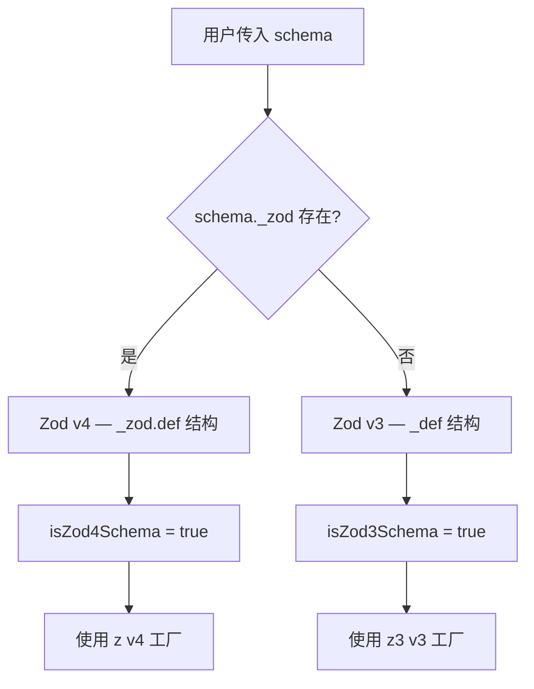
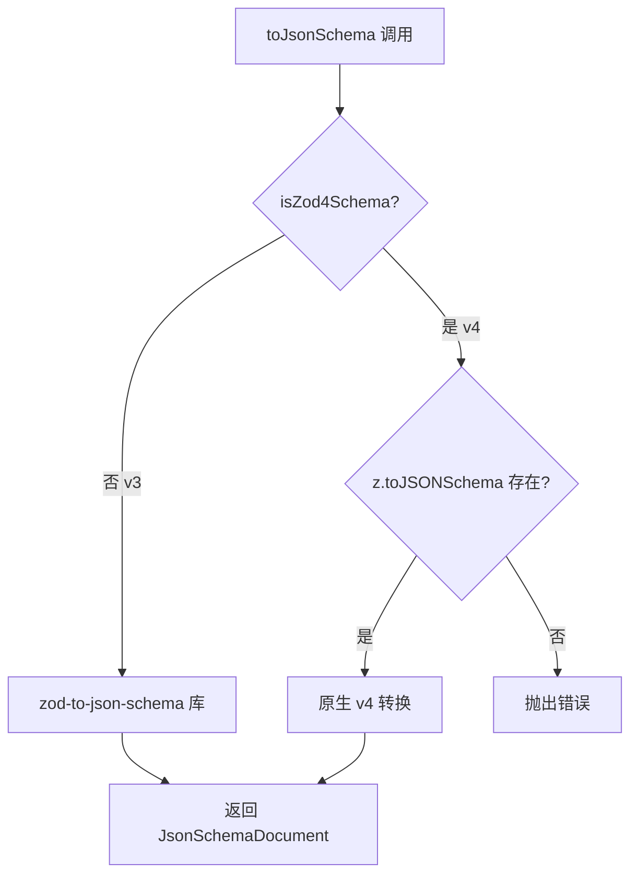
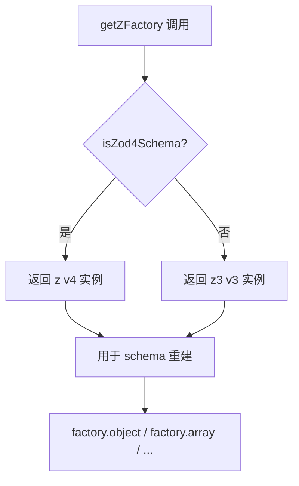

# PD-278.01 Stagehand — Zod v3/v4 跨版本 Schema 兼容层

> 文档编号：PD-278.01
> 来源：Stagehand `packages/core/lib/v3/zodCompat.ts` + `packages/core/lib/utils.ts`
> GitHub：https://github.com/browserbase/stagehand.git
> 问题域：PD-278 Schema 兼容层 Schema Compatibility Layer
> 状态：可复用方案

---

## 第 1 章 问题与动机

### 1.1 核心问题

Zod 是 TypeScript 生态中最流行的 schema 验证库，但 2024-2025 年间经历了 v3 → v4 的重大版本升级。v4 重写了内部结构（`_zod.def` 替代 `_def`），新增了原生 `z.toJSONSchema()` 方法，并改变了 enum、literal、pipe 等类型的内部表示。

对于 Stagehand 这样的 AI 浏览器自动化框架，schema 是核心 API 的一部分——用户通过 Zod schema 定义 `extract()` 的输出结构、Agent 工具的输入格式。如果强制要求用户升级到 v4，会破坏大量现有集成；如果只支持 v3，又无法利用 v4 的性能改进和原生 JSON Schema 支持。

**核心矛盾：** 库需要同时支持两个互不兼容的 Zod 版本，且内部的 schema 操作（类型检测、递归变换、JSON Schema 转换、Gemini Schema 转换）必须对两个版本都正确工作。

### 1.2 Stagehand 的解法概述

1. **联合类型抽象** — `StagehandZodSchema = Zod4TypeAny | z3.ZodTypeAny` 作为所有 API 的 schema 参数类型（`zodCompat.ts:9`）
2. **版本检测 Type Guard** — `isZod4Schema()` 通过检查 `_zod` 属性区分版本（`zodCompat.ts:22-25`）
3. **双路径 JSON Schema 转换** — v3 走 `zod-to-json-schema` 库，v4 走原生 `z.toJSONSchema()`（`zodCompat.ts:33-49`）
4. **版本感知工厂** — `getZFactory()` 返回与输入 schema 同版本的 `z` 实例，确保重建 schema 时版本一致（`utils.ts:18-20`）
5. **双路径内部访问器** — 一套 `getZ4Def()`/`getZ3Def()` 函数族，统一访问两个版本的内部结构（`utils.ts:52-197`）

### 1.3 设计思想

| 设计原则 | 具体实现 | 理由 | 替代方案 |
|----------|----------|------|----------|
| 用户零迁移成本 | peerDependencies 声明 `"zod": "^3.25.76 \|\| ^4.2.0"` | 用户不需要改代码，用哪个版本都行 | 强制 v4（破坏性） |
| 版本隔离不泄漏 | 所有公开 API 只暴露 `StagehandZodSchema` 联合类型 | 内部版本检测逻辑不污染用户代码 | 要求用户传版本标记 |
| 重建保持版本一致 | `getZFactory(schema)` 返回同版本 z 实例 | `transformSchema` 递归重建时不会混用 v3/v4 | 统一用 v4 重建（类型不兼容） |
| 条件类型推断 | `InferStagehandSchema<T>` 用条件类型分发 | TypeScript 层面正确推断两个版本的输出类型 | 强制 `unknown`（丢失类型安全） |
| 渐进式转换 | JSON Schema 只在需要时才生成（LLM API 调用时） | 避免不必要的序列化开销 | 预先全部转换 |

---

## 第 2 章 源码实现分析

### 2.1 架构概览

Stagehand 的 Zod 兼容层分为两个文件：`zodCompat.ts` 负责类型定义和 JSON Schema 转换，`utils.ts` 负责 schema 内部结构访问和递归变换。

```
┌─────────────────────────────────────────────────────────────┐
│                    用户代码 (Zod v3 或 v4)                     │
│  const schema = z.object({ title: z.string() })             │
└──────────────────────────┬──────────────────────────────────┘
                           │ StagehandZodSchema
┌──────────────────────────▼──────────────────────────────────┐
│              zodCompat.ts — 类型层                            │
│  ┌─────────────────┐  ┌──────────────────┐                  │
│  │ isZod4Schema()  │  │ isZod3Schema()   │  版本检测         │
│  └────────┬────────┘  └────────┬─────────┘                  │
│           │                    │                             │
│  ┌────────▼────────────────────▼─────────┐                  │
│  │         toJsonSchema(schema)          │  双路径转换       │
│  │  v3 → zod-to-json-schema 库           │                  │
│  │  v4 → z.toJSONSchema() 原生           │                  │
│  └───────────────────────────────────────┘                  │
│  InferStagehandSchema<T> — 条件类型推断                      │
└──────────────────────────┬──────────────────────────────────┘
                           │
┌──────────────────────────▼──────────────────────────────────┐
│              utils.ts — 操作层                               │
│  ┌──────────────┐  ┌──────────────┐  ┌──────────────┐       │
│  │ getZFactory()│  │ getZodType() │  │ getZ4Def()   │       │
│  │ 版本工厂     │  │ 类型检测     │  │ getZ3Def()   │       │
│  └──────┬───────┘  └──────┬───────┘  │ 内部访问器   │       │
│         │                 │          └──────┬───────┘       │
│  ┌──────▼─────────────────▼─────────────────▼───────┐       │
│  │           transformSchema(schema, path)           │       │
│  │  递归遍历 + 版本感知重建（object/array/union/...） │       │
│  └──────────────────────┬────────────────────────────┘       │
│  ┌──────────────────────▼────────────────────────────┐       │
│  │  toGeminiSchema() / jsonSchemaToZod()             │       │
│  │  多格式转换                                        │       │
│  └───────────────────────────────────────────────────┘       │
└─────────────────────────────────────────────────────────────┘
                           │
          ┌────────────────┼────────────────┐
          ▼                ▼                ▼
   LLM Clients      MCP Integration   Extract Handler
   (OpenAI/Anthropic  (JSON Schema →   (schema 变换 +
    /Groq/Gemini)      Zod 转换)        URL→ID 替换)
```

### 2.2 核心实现

#### 2.2.1 版本检测与类型抽象



对应源码 `packages/core/lib/v3/zodCompat.ts:1-29`：

```typescript
import { z } from "zod";
import type { ZodTypeAny as Zod4TypeAny } from "zod";
import type * as z3 from "zod/v3";

// 联合类型：同时接受 v3 和 v4
export type StagehandZodSchema = Zod4TypeAny | z3.ZodTypeAny;

// 条件类型推断：根据实际版本正确推断输出类型
export type InferStagehandSchema<T extends StagehandZodSchema> =
  T extends z3.ZodTypeAny
    ? z3.infer<T>
    : T extends Zod4TypeAny
      ? z.infer<T>
      : never;

// 版本检测：v4 schema 有 _zod 属性，v3 没有
export const isZod4Schema = (
  schema: StagehandZodSchema,
): schema is Zod4TypeAny & { _zod: unknown } =>
  typeof (schema as { _zod?: unknown })._zod !== "undefined";

export const isZod3Schema = (
  schema: StagehandZodSchema,
): schema is z3.ZodTypeAny => !isZod4Schema(schema);
```

#### 2.2.2 双路径 JSON Schema 转换



对应源码 `packages/core/lib/v3/zodCompat.ts:33-49`：

```typescript
export function toJsonSchema(schema: StagehandZodSchema): JsonSchemaDocument {
  if (!isZod4Schema(schema)) {
    // v3: 使用第三方库 zod-to-json-schema
    return zodToJsonSchema(schema);
  }
  // v4: 使用原生方法
  const zodWithJsonSchema = z as typeof z & {
    toJSONSchema?: (schema: Zod4TypeAny) => JsonSchemaDocument;
  };
  if (zodWithJsonSchema.toJSONSchema) {
    return zodWithJsonSchema.toJSONSchema(schema as Zod4TypeAny);
  }
  throw new Error("Zod v4 toJSONSchema method not found");
}
```

#### 2.2.3 版本感知工厂与内部访问器



对应源码 `packages/core/lib/utils.ts:13-20`：

```typescript
const zFactories = {
  v4: z,
  v3: z3 as unknown as typeof z,
};

export function getZFactory(schema: StagehandZodSchema): typeof z {
  return isZod4Schema(schema) ? zFactories.v4 : zFactories.v3;
}
```

### 2.3 实现细节

#### 双路径内部结构访问

Zod v3 和 v4 的内部结构完全不同。v3 用 `_def` 存储定义，v4 用 `_zod.def`。Stagehand 为每种需要访问的属性都提供了双路径访问器（`utils.ts:52-197`）：

| 访问器 | v4 路径 | v3 路径 | 用途 |
|--------|---------|---------|------|
| `getZ4Def()` | `schema._zod.def` | — | v4 定义 |
| `getZ3Def()` | — | `schema._def` | v3 定义 |
| `getObjectShape()` | `_zod.def.shape` | `_def.shape()` 或 `_def.shape` | 对象字段 |
| `getArrayElement()` | `_zod.def.element` | `_def.type` | 数组元素 |
| `getEnumValues()` | `_zod.def.entries` → `Object.values()` | `_def.values` | 枚举值 |
| `getUnionOptions()` | `_zod.def.options` | `_def.options` | 联合选项 |

注意 `getObjectShape()` 的特殊处理（`utils.ts:70-90`）：v3 的 shape 可能是函数（lazy evaluation），需要调用后才能获取实际 shape。

#### TYPE_NAME_MAP 统一类型名

v3 用 `ZodString`/`ZodNumber` 等 typeName，v4 用 `string`/`number` 等简短名。`TYPE_NAME_MAP`（`utils.ts:22-50`）将两种命名统一映射为标准名，使 `getZodType()` 返回一致的类型标识。

#### MCP 工具 JSON Schema → Zod 动态转换

MCP 协议的工具定义使用 JSON Schema 格式。`jsonSchemaToZod()`（`utils.ts:766-843`）将其动态转换为 Zod schema，支持 object、array、string（含 format: uri/email/uuid）、number（含 min/max）、boolean 类型，使 MCP 工具能无缝接入 AI SDK 的 structured output 体系。

在 `packages/core/lib/v3/mcp/utils.ts:30` 中的实际使用：

```typescript
tools[tool.name] = {
  description: tool.description,
  inputSchema: jsonSchemaToZod(tool.inputSchema as JsonSchema),
  execute: async (input) => {
    const result = await clientInstance.callTool({
      name: tool.name, arguments: input,
    });
    return result;
  },
};
```

---

## 第 3 章 迁移指南

### 3.1 迁移清单

**阶段 1：类型层（1 个文件）**

- [ ] 创建 `zodCompat.ts`，定义 `StagehandZodSchema` 联合类型
- [ ] 实现 `isZod4Schema()` / `isZod3Schema()` type guard
- [ ] 实现 `InferStagehandSchema<T>` 条件类型
- [ ] 实现 `toJsonSchema()` 双路径转换
- [ ] 安装 `zod-to-json-schema` 依赖（v3 路径需要）

**阶段 2：操作层（1 个文件）**

- [ ] 创建版本工厂 `getZFactory()`
- [ ] 创建类型名映射表 `TYPE_NAME_MAP`
- [ ] 实现 `getZodType()` 统一类型检测
- [ ] 按需实现双路径访问器（`getObjectShape`、`getArrayElement` 等）
- [ ] 如需 schema 递归变换，实现 `transformSchema()`

**阶段 3：API 层**

- [ ] 将所有公开 API 的 schema 参数类型改为 `StagehandZodSchema`
- [ ] 在需要重建 schema 的地方使用 `getZFactory()` 而非硬编码 `z`
- [ ] 在 `package.json` 中声明 `peerDependencies: { "zod": "^3.x || ^4.x" }`

### 3.2 适配代码模板

以下是一个可直接复用的最小兼容层实现：

```typescript
// schema-compat.ts — 最小可复用兼容层
import { z } from "zod";
import type { ZodTypeAny as Zod4TypeAny } from "zod";
import zodToJsonSchema from "zod-to-json-schema";
import type * as z3 from "zod/v3";

// ---- 类型定义 ----
export type UnifiedSchema = Zod4TypeAny | z3.ZodTypeAny;

export type InferSchema<T extends UnifiedSchema> =
  T extends z3.ZodTypeAny ? z3.infer<T> :
  T extends Zod4TypeAny ? z.infer<T> : never;

// ---- 版本检测 ----
export const isV4 = (s: UnifiedSchema): s is Zod4TypeAny =>
  typeof (s as { _zod?: unknown })._zod !== "undefined";

// ---- 版本工厂 ----
const factories = { v4: z, v3: z3 as unknown as typeof z };
export const getFactory = (s: UnifiedSchema) =>
  isV4(s) ? factories.v4 : factories.v3;

// ---- JSON Schema 转换 ----
export function toJsonSchema(schema: UnifiedSchema): Record<string, unknown> {
  if (!isV4(schema)) return zodToJsonSchema(schema);
  const zz = z as typeof z & { toJSONSchema?: (s: Zod4TypeAny) => Record<string, unknown> };
  if (zz.toJSONSchema) return zz.toJSONSchema(schema);
  throw new Error("Zod v4 toJSONSchema not available");
}

// ---- 类型检测 ----
const TYPE_MAP: Record<string, string> = {
  ZodString: "string", string: "string",
  ZodNumber: "number", number: "number",
  ZodBoolean: "boolean", boolean: "boolean",
  ZodObject: "object", object: "object",
  ZodArray: "array", array: "array",
  ZodOptional: "optional", optional: "optional",
  ZodEnum: "enum", enum: "enum",
};

export function getSchemaType(s: UnifiedSchema): string {
  const raw = (s as any)._zod?.def?.type ?? (s as any)._def?.typeName ?? "unknown";
  return TYPE_MAP[raw] ?? raw;
}

// ---- 内部访问 ----
export function getObjectShape(s: UnifiedSchema): Record<string, UnifiedSchema> | undefined {
  const v4Shape = (s as any)._zod?.def?.shape;
  if (v4Shape) return v4Shape;
  const v3Shape = (s as any)._def?.shape;
  if (!v3Shape) return undefined;
  return typeof v3Shape === "function" ? v3Shape() : v3Shape;
}
```

### 3.3 适用场景

| 场景 | 适用度 | 说明 |
|------|--------|------|
| SDK/框架需要接受用户 Zod schema | ⭐⭐⭐ | 核心场景，用户可能用 v3 或 v4 |
| AI SDK structured output 集成 | ⭐⭐⭐ | LLM API 需要 JSON Schema，兼容层提供统一转换 |
| MCP 工具 schema 适配 | ⭐⭐⭐ | MCP 用 JSON Schema，需要双向转换 |
| 内部项目统一版本 | ⭐ | 如果能控制版本，直接用 v4 更简单 |
| schema 递归变换（如 URL→ID 替换） | ⭐⭐ | 需要深入访问内部结构，兼容层价值最大 |

---

## 第 4 章 测试用例

```typescript
import { describe, it, expect } from "vitest";
import { z } from "zod";
import z3 from "zod/v3";

// 假设已实现上述兼容层
import {
  isV4, getFactory, toJsonSchema, getSchemaType, getObjectShape,
  type UnifiedSchema, type InferSchema,
} from "./schema-compat";

describe("版本检测", () => {
  it("正确识别 v4 schema", () => {
    const v4Schema = z.object({ name: z.string() });
    expect(isV4(v4Schema)).toBe(true);
  });

  it("正确识别 v3 schema", () => {
    const v3Schema = z3.object({ name: z3.string() });
    expect(isV4(v3Schema)).toBe(false);
  });
});

describe("版本工厂", () => {
  it("v4 schema 返回 v4 工厂", () => {
    const schema = z.string();
    const factory = getFactory(schema);
    // 用工厂创建的 schema 应该也是 v4
    const created = factory.object({ x: factory.number() });
    expect(isV4(created as UnifiedSchema)).toBe(true);
  });

  it("v3 schema 返回 v3 工厂", () => {
    const schema = z3.string() as UnifiedSchema;
    const factory = getFactory(schema);
    const created = factory.object({ x: factory.number() });
    expect(isV4(created as UnifiedSchema)).toBe(false);
  });
});

describe("JSON Schema 转换", () => {
  it("v4 schema 转换为 JSON Schema", () => {
    const schema = z.object({ age: z.number(), name: z.string() });
    const jsonSchema = toJsonSchema(schema);
    expect(jsonSchema).toHaveProperty("type", "object");
    expect(jsonSchema).toHaveProperty("properties");
  });

  it("v3 schema 转换为 JSON Schema", () => {
    const schema = z3.object({ age: z3.number() }) as UnifiedSchema;
    const jsonSchema = toJsonSchema(schema);
    expect(jsonSchema).toHaveProperty("type", "object");
  });
});

describe("类型检测", () => {
  it("v4 object schema 返回 'object'", () => {
    expect(getSchemaType(z.object({}))).toBe("object");
  });

  it("v3 string schema 返回 'string'", () => {
    expect(getSchemaType(z3.string() as UnifiedSchema)).toBe("string");
  });

  it("v4 array schema 返回 'array'", () => {
    expect(getSchemaType(z.array(z.string()))).toBe("array");
  });
});

describe("对象 shape 访问", () => {
  it("v4 对象返回正确 shape", () => {
    const schema = z.object({ a: z.string(), b: z.number() });
    const shape = getObjectShape(schema);
    expect(shape).toBeDefined();
    expect(Object.keys(shape!)).toEqual(["a", "b"]);
  });

  it("v3 对象返回正确 shape", () => {
    const schema = z3.object({ x: z3.boolean() }) as UnifiedSchema;
    const shape = getObjectShape(schema);
    expect(shape).toBeDefined();
    expect(Object.keys(shape!)).toEqual(["x"]);
  });
});

describe("边界情况", () => {
  it("非 schema 对象不会崩溃", () => {
    const fake = { safeParse: () => ({ success: true }) } as unknown as UnifiedSchema;
    expect(isV4(fake)).toBe(false);
  });

  it("嵌套 optional 正确检测", () => {
    const schema = z.object({ name: z.string().optional() });
    const shape = getObjectShape(schema);
    expect(shape).toBeDefined();
    expect(getSchemaType(shape!.name as UnifiedSchema)).toBe("optional");
  });
});
```

---

## 第 5 章 跨域关联

| 关联域 | 关系类型 | 说明 |
|--------|----------|------|
| PD-04 工具系统 | 依赖 | MCP 工具的 inputSchema 是 JSON Schema 格式，需要 `jsonSchemaToZod()` 转换为 Zod 才能接入 AI SDK 的 tool 体系。兼容层是工具系统正常运作的前提 |
| PD-12 推理增强 | 协同 | `toJsonSchema()` 在 LLM 不支持 native structured output 时，将 schema 序列化为 JSON 注入 prompt（`aisdk.ts:163-173`），实现 prompt-based JSON fallback |
| PD-03 容错与重试 | 协同 | `validateZodSchema()` 使用 `safeParse` 统一验证两个版本的 schema，验证失败抛出 `ZodSchemaValidationError`，上层可据此触发重试 |
| PD-11 可观测性 | 协同 | `toJsonSchema()` 的输出用于 `SessionFileLogger` 记录 LLM 请求的 schema 信息，便于调试和成本追踪 |

---

## 第 6 章 来源文件索引

| 文件 | 行范围 | 关键实现 |
|------|--------|----------|
| `packages/core/lib/v3/zodCompat.ts` | L1-49 | 核心兼容层：类型定义、版本检测、JSON Schema 双路径转换 |
| `packages/core/lib/utils.ts` | L13-20 | `getZFactory()` 版本感知工厂 |
| `packages/core/lib/utils.ts` | L22-50 | `TYPE_NAME_MAP` 类型名统一映射 |
| `packages/core/lib/utils.ts` | L52-197 | 双路径内部访问器族（getZ4Def/getZ3Def/getObjectShape 等） |
| `packages/core/lib/utils.ts` | L360-374 | `getZodType()` 统一类型检测 |
| `packages/core/lib/utils.ts` | L389-597 | `transformSchema()` 递归 schema 变换（版本感知重建） |
| `packages/core/lib/utils.ts` | L766-843 | `jsonSchemaToZod()` JSON Schema → Zod 动态转换 |
| `packages/core/lib/utils.ts` | L243-357 | `toGeminiSchema()` Zod → Google Gemini Schema 转换 |
| `packages/core/lib/v3/llm/LLMClient.ts` | L56-58 | `response_model.schema: StagehandZodSchema` API 定义 |
| `packages/core/lib/v3/llm/aisdk.ts` | L22, L163-173 | `toJsonSchema()` 用于 prompt-based JSON fallback |
| `packages/core/lib/v3/agent/utils/handleDoneToolCall.ts` | L6, L47-49 | `getZFactory()` 确保 done schema 版本一致 |
| `packages/core/lib/v3/handlers/extractHandler.ts` | L4-8, L168-173 | `getZFactory()` 包装非 object schema 时保持版本 |
| `packages/core/lib/v3/mcp/utils.ts` | L3, L30 | `jsonSchemaToZod()` 将 MCP 工具 schema 转为 Zod |
| `packages/core/package.json` | L67 | `peerDependencies: "zod": "^3.25.76 \|\| ^4.2.0"` |

---

## 第 7 章 横向对比维度

```json comparison_data
{
  "project": "Stagehand",
  "dimensions": {
    "版本检测": "_zod 属性存在性检测，单属性区分 v3/v4",
    "转换策略": "v3 走 zod-to-json-schema 库，v4 走原生 z.toJSONSchema()",
    "重建一致性": "getZFactory 返回同版本工厂，递归重建不混版本",
    "类型推断": "InferStagehandSchema 条件类型分发，编译期正确推断",
    "内部访问": "15+ 双路径访问器覆盖 object/array/union/enum/pipe 等全类型",
    "多格式输出": "同时支持 JSON Schema、Gemini Schema、Zod 三种格式互转"
  }
}
```

### 域元数据补充

```json domain_metadata
{
  "solution_summary": "Stagehand 用 StagehandZodSchema 联合类型 + isZod4Schema 检测 + getZFactory 版本工厂 + 15 个双路径访问器，实现 Zod v3/v4 全类型递归兼容",
  "description": "跨大版本 schema 库兼容需要类型层、检测层、操作层三层协同",
  "sub_problems": [
    "schema 递归变换时的版本一致性保持",
    "v3 lazy shape（函数式）与 v4 静态 shape 的统一访问",
    "多目标格式转换（JSON Schema / Gemini Schema / Zod 三向）"
  ],
  "best_practices": [
    "用 peerDependencies 宽版本范围声明让用户自选版本",
    "getZFactory 模式确保 schema 重建不混用版本",
    "TYPE_NAME_MAP 统一两套类型命名体系"
  ]
}
```
