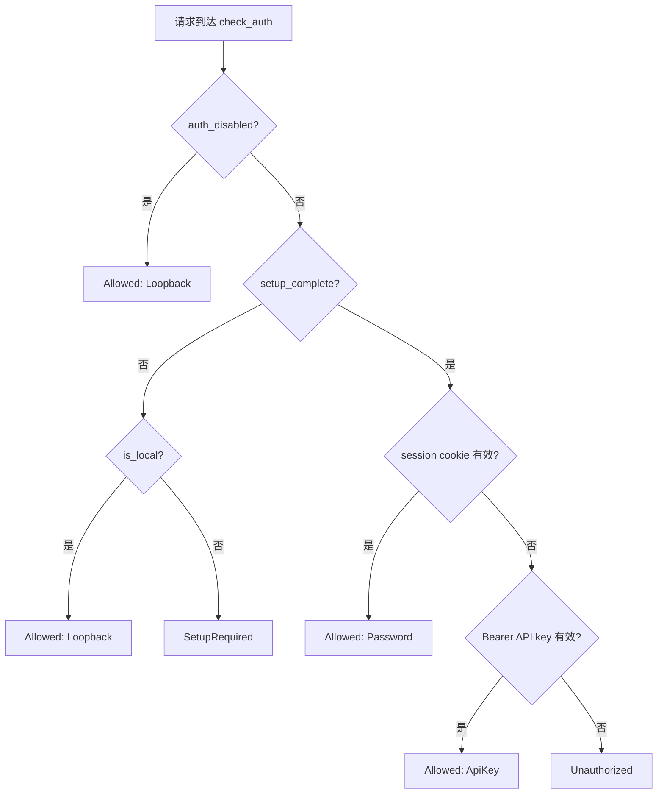
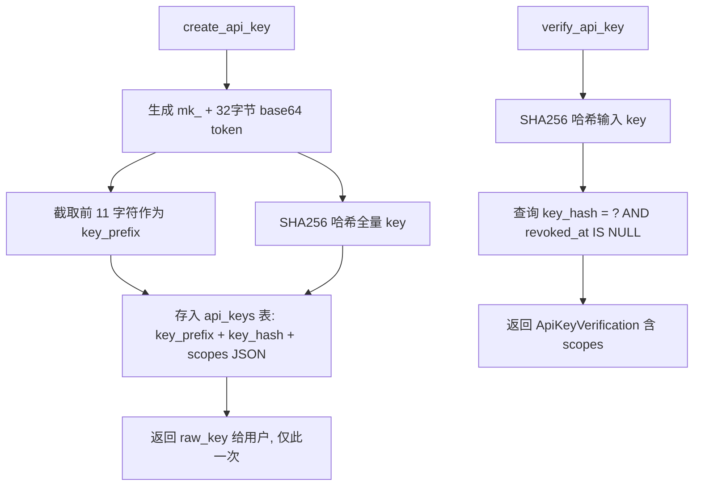
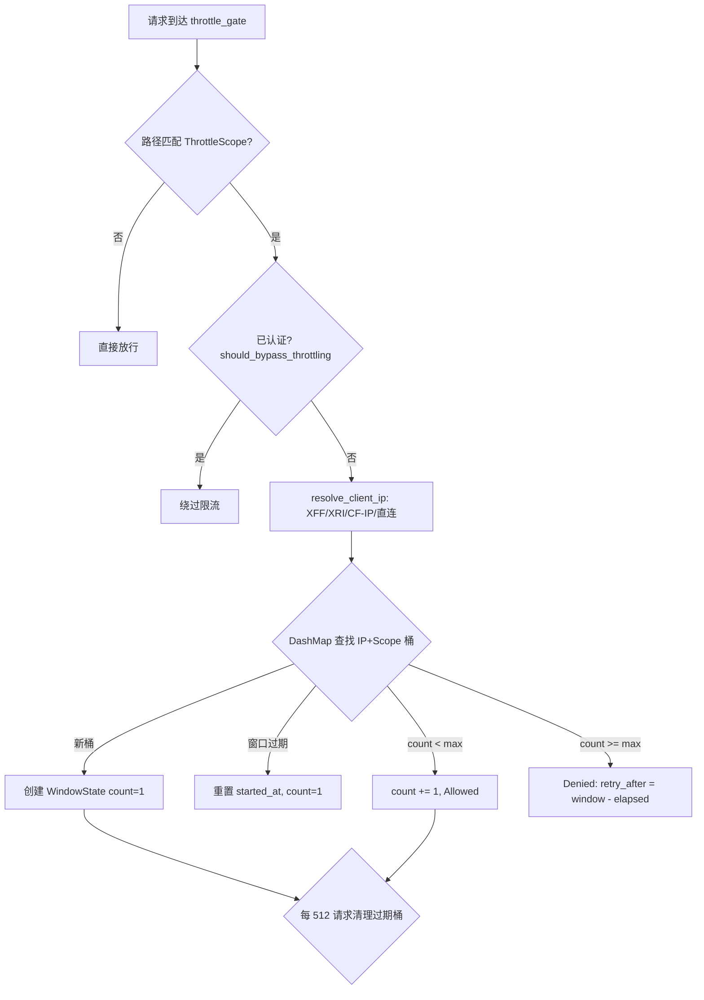

# PD-279.01 Moltis — 多因素认证与 Vault 加密体系

> 文档编号：PD-279.01
> 来源：Moltis `crates/auth/src/credential_store.rs`, `crates/gateway/src/request_throttle.rs`, `crates/gateway/src/auth_middleware.rs`
> GitHub：https://github.com/moltis-org/moltis.git
> 问题域：PD-279 认证授权 Authentication & Authorization
> 状态：可复用方案

---

## 第 1 章 问题与动机

### 1.1 核心问题

自托管 Agent 平台面临一个根本矛盾：既要在首次运行时零配置可用（localhost 直接访问），又要在暴露到网络后提供企业级安全保障。传统做法要么强制用户先配置密码才能使用（体验差），要么默认无认证（安全差）。

Moltis 需要解决的具体问题：
- **首次运行引导**：用户第一次启动时如何安全地建立凭据，而不需要预配置
- **多因素认证**：密码、Passkey、API Key 三种认证方式如何统一管理
- **凭据安全存储**：密码哈希、API Key 哈希、环境变量加密如何分层保护
- **请求限流**：如何防止暴力破解和滥用，同时不影响正常使用
- **Vault 加密**：环境变量等敏感数据如何实现 encryption-at-rest

### 1.2 Moltis 的解法概述

1. **Setup Code 引导流程** — 首次运行生成 6 位数字 setup code 打印到终端，远程用户必须输入此 code 才能设置密码，本地用户可跳过（`auth_routes.rs:556`）
2. **单一认证决策点 `check_auth()`** — 所有认证判断集中在一个函数，避免 `is_setup_complete()` 和 `has_password()` 分散判断导致的 split-brain bug（`auth_middleware.rs:45`）
3. **四方法认证体系** — Password（Argon2id）、Passkey（WebAuthn）、API Key（SHA256 前缀匹配）、Loopback（本地信任），统一为 `AuthMethod` 枚举（`credential_store.rs:25`）
4. **Vault 加密层** — XChaCha20-Poly1305 对称加密，DEK/KEK 分离架构，Bip39 恢复密钥，密码变更时只重新包装 DEK 而非重新加密所有数据（`vault.rs:41`）
5. **五作用域分级限流** — Login/AuthApi/Api/Share/Ws 五个作用域独立限流窗口，已认证请求绕过限流（`request_throttle.rs:33`）

### 1.3 设计思想

| 设计原则 | 具体实现 | 理由 | 替代方案 |
|----------|----------|------|----------|
| 单一决策点 | `check_auth()` 函数是所有认证判断的唯一入口 | 防止 passkey-only 场景下 `has_password()` 返回 false 导致的 split-brain | 每个中间件独立判断（易出 bug） |
| 渐进式安全 | 本地无密码可用 → 设置密码 → 添加 Passkey → 启用 Vault | 降低首次使用门槛，安全性随使用深度递增 | 强制首次配置所有安全选项 |
| DEK/KEK 分离 | 密码变更只重新包装 DEK，不重新加密数据 | 密码轮换 O(1) 而非 O(n)，n 为加密条目数 | 密码直接派生加密密钥（变更需全量重加密） |
| 作用域隔离限流 | 5 个 ThrottleScope 独立计数器 | Login 限 5 次/分不影响 API 的 180 次/分 | 全局统一限流（误伤正常请求） |
| AtomicBool 状态缓存 | `setup_complete` 和 `auth_disabled` 用原子变量缓存 | 热路径避免数据库查询，每次请求 O(1) | 每次请求查 SQLite（性能差） |

---

## 第 2 章 源码实现分析

### 2.1 架构概览

Moltis 的认证授权系统分为四层：

```
┌─────────────────────────────────────────────────────────────┐
│                    Axum Middleware Layer                      │
│  throttle_gate → auth_gate → vault_guard → route handlers    │
├─────────────────────────────────────────────────────────────┤
│                    Auth Decision Layer                        │
│  check_auth() → AuthResult::Allowed/SetupRequired/Unauth    │
├─────────────────────────────────────────────────────────────┤
│                    Credential Store Layer                     │
│  CredentialStore (SQLite) — password/passkey/apikey/session  │
│  WebAuthnState (DashMap) — challenge lifecycle               │
├─────────────────────────────────────────────────────────────┤
│                    Vault Layer (optional)                     │
│  Vault<XChaCha20Poly1305> — DEK/KEK, encrypt/decrypt        │
│  env_variables 表 — encrypted=0/1 标记                       │
└─────────────────────────────────────────────────────────────┘
```

### 2.2 核心实现

#### 2.2.1 认证决策：check_auth() 单一入口



对应源码 `crates/gateway/src/auth_middleware.rs:45-85`：

```rust
pub async fn check_auth(
    store: &CredentialStore,
    headers: &HeaderMap,
    is_local: bool,
) -> AuthResult {
    if store.is_auth_disabled() {
        return AuthResult::Allowed(AuthIdentity {
            method: AuthMethod::Loopback,
        });
    }
    if !store.is_setup_complete() {
        return if is_local {
            AuthResult::Allowed(AuthIdentity {
                method: AuthMethod::Loopback,
            })
        } else {
            AuthResult::SetupRequired
        };
    }
    // Check session cookie.
    if let Some(token) = cookie_header(headers).and_then(|h| parse_cookie(h, SESSION_COOKIE))
        && store.validate_session(token).await.unwrap_or(false)
    {
        return AuthResult::Allowed(AuthIdentity {
            method: AuthMethod::Password,
        });
    }
    // Check Bearer API key.
    if let Some(key) = bearer_token(headers)
        && store.verify_api_key(key).await.ok().flatten().is_some()
    {
        return AuthResult::Allowed(AuthIdentity {
            method: AuthMethod::ApiKey,
        });
    }
    AuthResult::Unauthorized
}
```

关键设计：注释明确写道 "Every code path that needs to decide 'is this request authenticated?' must call this function instead of reimplementing the logic"（`auth_middleware.rs:40-44`），这是防止 split-brain 的核心约束。

#### 2.2.2 API Key 生命周期：SHA256 前缀匹配 + Scope 权限



对应源码 `crates/auth/src/credential_store.rs:445-526`：

```rust
pub async fn create_api_key(
    &self,
    label: &str,
    scopes: Option<&[String]>,
) -> anyhow::Result<(i64, String)> {
    let raw_key = format!("mk_{}", generate_token());
    let prefix = &raw_key[..raw_key.len().min(11)]; // "mk_" + 8 chars
    let hash = sha256_hex(&raw_key);
    let scopes_json = scopes
        .filter(|s| !s.is_empty())
        .map(|s| serde_json::to_string(s).unwrap_or_default());
    let result = sqlx::query(
        "INSERT INTO api_keys (label, key_hash, key_prefix, scopes) VALUES (?, ?, ?, ?)",
    )
    .bind(label).bind(&hash).bind(prefix).bind(&scopes_json)
    .execute(&self.pool).await?;
    Ok((result.last_insert_rowid(), raw_key))
}
```

Scope 定义为 5 个固定值（`credential_store.rs:67-73`）：`operator.admin`, `operator.read`, `operator.write`, `operator.approvals`, `operator.pairing`。


#### 2.2.3 五作用域分级限流



对应源码 `crates/gateway/src/request_throttle.rs:150-191`：

```rust
fn check_at(&self, ip: IpAddr, scope: ThrottleScope, now: Instant) -> ThrottleDecision {
    let limit = self.limit_for(scope);
    if limit.max_requests == 0 {
        return ThrottleDecision::Denied {
            retry_after: limit.window.max(Duration::from_secs(1)),
        };
    }
    let key = ThrottleKey { ip, scope };
    let decision = match self.buckets.entry(key) {
        Entry::Occupied(mut occupied) => {
            let state = occupied.get_mut();
            let elapsed = now.duration_since(state.started_at);
            if elapsed >= limit.window {
                state.started_at = now;
                state.count = 1;
                ThrottleDecision::Allowed
            } else if state.count < limit.max_requests {
                state.count += 1;
                ThrottleDecision::Allowed
            } else {
                ThrottleDecision::Denied {
                    retry_after: limit.window.saturating_sub(elapsed),
                }
            }
        },
        Entry::Vacant(vacant) => {
            vacant.insert(WindowState { started_at: now, count: 1 });
            ThrottleDecision::Allowed
        },
    };
    self.cleanup_if_needed(now);
    decision
}
```

默认限流配置（`request_throttle.rs:89-119`）：

| 作用域 | 最大请求数 | 窗口 | 用途 |
|--------|-----------|------|------|
| Login | 5 | 60s | 暴力破解防护 |
| AuthApi | 120 | 60s | 登录/状态端点 |
| Api | 180 | 60s | 常规 API |
| Share | 90 | 60s | 公开分享链接 |
| Ws | 30 | 60s | WebSocket 重连风暴防护 |

关键设计：已认证请求完全绕过限流（`request_throttle.rs:246-257`），通过 `should_bypass_throttling()` 调用 `check_auth()` 判断。这意味着限流只针对未认证的外部请求，不会误伤合法用户。

### 2.3 实现细节

#### Vault DEK/KEK 架构

Vault 使用经典的信封加密（envelope encryption）模式（`vault.rs:80-130`）：

1. **初始化**：生成随机 32 字节 DEK → 用密码派生 KEK（Argon2id KDF）→ 用 KEK 包装 DEK → 生成 Bip39 恢复密钥 → 用恢复密钥也包装一份 DEK
2. **加密**：读取内存中的 DEK → XChaCha20-Poly1305 加密 → 前置版本标签 → Base64 编码
3. **密码变更**：验证旧密码 → 读取内存 DEK → 新密码派生新 KEK → 重新包装 DEK → 更新数据库。DEK 不变，已加密数据无需重新加密
4. **恢复**：Bip39 助记词 → 派生恢复 KEK → 解包 DEK → 写入内存

AAD（Additional Authenticated Data）绑定上下文，如 `"env:MY_KEY"`，防止密文被移植到其他字段（`vault.rs:234`）。

#### 密码变更时的会话失效

`change_password()` 在更新哈希后立即执行 `DELETE FROM auth_sessions`（`credential_store.rs:389-392`），这是 defense-in-depth 策略：即使 WebSocket 断开通知遗漏了某个客户端，旧会话也无法复用。

#### Setup Code 安全模型

Setup code 是 6 位数字（100,000-999,999），存储在内存中的 `secrecy::Secret<String>`（`auth_routes.rs:329`）。配合 Login 作用域的 5 次/分限流，暴力破解需要 100,000 / 5 = 20,000 分钟 ≈ 13.9 天。Setup code 在设置完成后立即清除（`auth_routes.rs:230`）。

---

## 第 3 章 迁移指南

### 3.1 迁移清单

**阶段 1：基础认证（1-2 天）**
- [ ] 实现 `CredentialStore` 等价物（SQLite 表：auth_password, auth_sessions, api_keys）
- [ ] 实现 `check_auth()` 单一决策函数
- [ ] 实现 Argon2id 密码哈希（`argon2` crate 或等价库）
- [ ] 实现 session token 生成与验证（32 字节随机 + base64）
- [ ] 实现 API Key 创建与验证（SHA256 哈希 + 前缀识别）

**阶段 2：中间件集成**
- [ ] 实现 `auth_gate` 中间件（公开路径白名单 + 认证检查）
- [ ] 实现 `AuthSession` 提取器（从 extensions 或 fallback 到 cookie 验证）
- [ ] 实现 setup code 引导流程（首次运行生成 → 终端打印 → 验证后清除）

**阶段 3：限流**
- [ ] 实现 `RequestThrottle`（DashMap + 滑动窗口）
- [ ] 定义作用域和限流参数
- [ ] 实现已认证请求绕过逻辑

**阶段 4：Vault 加密（可选）**
- [ ] 实现 DEK/KEK 信封加密
- [ ] 实现 XChaCha20-Poly1305 加密/解密
- [ ] 实现密码变更时的 DEK 重新包装
- [ ] 实现 Bip39 恢复密钥

**阶段 5：WebAuthn/Passkey（可选）**
- [ ] 集成 `webauthn-rs`（Rust）或 `@simplewebauthn/server`（Node.js）
- [ ] 实现 challenge 生命周期管理（DashMap + TTL）
- [ ] 实现多主机名 WebAuthn Registry

### 3.2 适配代码模板

#### Python 版 check_auth 单一决策点

```python
from enum import Enum
from dataclasses import dataclass
from typing import Optional

class AuthMethod(Enum):
    PASSWORD = "password"
    PASSKEY = "passkey"
    API_KEY = "api_key"
    LOOPBACK = "loopback"

class AuthResultType(Enum):
    ALLOWED = "allowed"
    SETUP_REQUIRED = "setup_required"
    UNAUTHORIZED = "unauthorized"

@dataclass
class AuthResult:
    type: AuthResultType
    method: Optional[AuthMethod] = None

async def check_auth(
    store: "CredentialStore",
    headers: dict,
    is_local: bool,
) -> AuthResult:
    """Single source of truth for auth decisions.
    Every code path must call this instead of reimplementing."""
    if store.is_auth_disabled():
        return AuthResult(AuthResultType.ALLOWED, AuthMethod.LOOPBACK)

    if not store.is_setup_complete():
        if is_local:
            return AuthResult(AuthResultType.ALLOWED, AuthMethod.LOOPBACK)
        return AuthResult(AuthResultType.SETUP_REQUIRED)

    # Check session cookie
    session_token = extract_cookie(headers, "session")
    if session_token and await store.validate_session(session_token):
        return AuthResult(AuthResultType.ALLOWED, AuthMethod.PASSWORD)

    # Check Bearer API key
    api_key = extract_bearer(headers)
    if api_key and await store.verify_api_key(api_key):
        return AuthResult(AuthResultType.ALLOWED, AuthMethod.API_KEY)

    return AuthResult(AuthResultType.UNAUTHORIZED)
```

#### Python 版分级限流

```python
import time
from dataclasses import dataclass, field
from enum import Enum
from threading import Lock

class ThrottleScope(Enum):
    LOGIN = ("login", 5, 60)
    AUTH_API = ("auth_api", 120, 60)
    API = ("api", 180, 60)

    def __init__(self, label: str, max_requests: int, window_secs: int):
        self.label = label
        self.max_requests = max_requests
        self.window_secs = window_secs

@dataclass
class WindowState:
    started_at: float
    count: int

class RequestThrottle:
    def __init__(self):
        self._buckets: dict[tuple[str, ThrottleScope], WindowState] = {}
        self._lock = Lock()

    def check(self, ip: str, scope: ThrottleScope) -> tuple[bool, float]:
        """Returns (allowed, retry_after_secs)."""
        now = time.monotonic()
        key = (ip, scope)
        with self._lock:
            state = self._buckets.get(key)
            if state is None:
                self._buckets[key] = WindowState(now, 1)
                return True, 0
            elapsed = now - state.started_at
            if elapsed >= scope.window_secs:
                state.started_at = now
                state.count = 1
                return True, 0
            if state.count < scope.max_requests:
                state.count += 1
                return True, 0
            return False, scope.window_secs - elapsed
```

### 3.3 适用场景

| 场景 | 适用度 | 说明 |
|------|--------|------|
| 自托管单用户 Agent 平台 | ⭐⭐⭐ | 完美匹配：setup code 引导 + 本地信任 + 渐进安全 |
| 多用户 SaaS 平台 | ⭐⭐ | 需扩展为多用户模型，CredentialStore 需改为 per-user |
| 纯 API 服务 | ⭐⭐⭐ | API Key scope 模型可直接复用 |
| 内网工具 | ⭐⭐⭐ | Loopback 信任 + 可选密码的渐进模型非常适合 |
| 公网高安全场景 | ⭐⭐ | 需补充 MFA（TOTP）、IP 白名单等额外层 |


---

## 第 4 章 测试用例

基于 Moltis 真实测试模式（`credential_store.rs:958-1340`），以下为可移植的测试框架：

```python
import pytest
import hashlib
import secrets
import time

class TestCredentialStore:
    """基于 Moltis credential_store.rs 测试模式的 Python 移植。"""

    @pytest.fixture
    def store(self):
        """创建内存数据库的 CredentialStore。"""
        # 对应 Moltis: SqlitePool::connect("sqlite::memory:")
        return InMemoryCredentialStore()

    def test_initial_state_not_setup(self, store):
        """对应 credential_store.rs:963"""
        assert not store.is_setup_complete()
        assert not store.verify_password("test")

    def test_set_initial_password(self, store):
        """对应 credential_store.rs:966-972"""
        store.set_initial_password("mypassword")
        assert store.is_setup_complete()
        assert store.verify_password("mypassword")
        assert not store.verify_password("wrong")
        # 不能重复设置
        with pytest.raises(Exception):
            store.set_initial_password("another")

    def test_change_password_invalidates_sessions(self, store):
        """对应 credential_store.rs:1205-1227
        密码变更后所有旧会话必须失效。"""
        store.set_initial_password("original")
        token1 = store.create_session()
        token2 = store.create_session()
        assert store.validate_session(token1)
        assert store.validate_session(token2)

        store.change_password("original", "newpass")
        assert not store.validate_session(token1)
        assert not store.validate_session(token2)
        # 新会话仍然有效
        token3 = store.create_session()
        assert store.validate_session(token3)

    def test_api_key_lifecycle(self, store):
        """对应 credential_store.rs:1000-1029"""
        key_id, raw_key = store.create_api_key("test key", scopes=None)
        assert raw_key.startswith("mk_")
        # 验证有效
        verification = store.verify_api_key(raw_key)
        assert verification is not None
        assert verification.key_id == key_id
        # 无效 key 返回 None
        assert store.verify_api_key("mk_bogus") is None
        # 撤销后失效
        store.revoke_api_key(key_id)
        assert store.verify_api_key(raw_key) is None

    def test_api_key_with_scopes(self, store):
        """对应 credential_store.rs:1032-1071"""
        scopes = ["operator.read", "operator.write"]
        key_id, raw_key = store.create_api_key("scoped", scopes=scopes)
        verification = store.verify_api_key(raw_key)
        assert verification.scopes == scopes

    def test_reset_clears_everything(self, store):
        """对应 credential_store.rs:1074-1108"""
        store.set_initial_password("testpass")
        token = store.create_session()
        _, raw_key = store.create_api_key("test", scopes=None)

        store.reset_all()
        assert store.is_auth_disabled()
        assert not store.is_setup_complete()
        assert not store.validate_session(token)
        assert store.verify_api_key(raw_key) is None

        # 重新设置后恢复
        store.set_initial_password("newpass")
        assert store.is_setup_complete()
        assert not store.is_auth_disabled()


class TestRequestThrottle:
    """基于 request_throttle.rs 测试模式。"""

    def test_login_window_limits(self):
        """对应 request_throttle.rs:378-426"""
        throttle = RequestThrottle(login_max=2, login_window=10)
        ip = "127.0.0.1"
        # 前两次允许
        assert throttle.check(ip, "login")[0] is True
        assert throttle.check(ip, "login")[0] is True
        # 第三次拒绝
        allowed, retry_after = throttle.check(ip, "login")
        assert allowed is False
        assert retry_after > 0

    def test_scopes_are_independent(self):
        """Login 限流不影响 API 限流。"""
        throttle = RequestThrottle(login_max=1, api_max=100)
        ip = "127.0.0.1"
        throttle.check(ip, "login")  # 用完 login 配额
        assert throttle.check(ip, "login")[0] is False
        assert throttle.check(ip, "api")[0] is True  # API 不受影响


class TestVaultEnvelopeEncryption:
    """基于 vault.rs 测试模式。"""

    def test_encrypt_decrypt_round_trip(self):
        """对应 vault.rs:384-401"""
        vault = TestVault("password")
        encrypted = vault.encrypt("my secret api key", aad="env:OPENAI_API_KEY")
        decrypted = vault.decrypt(encrypted, aad="env:OPENAI_API_KEY")
        assert decrypted == "my secret api key"

    def test_wrong_aad_fails(self):
        """对应 vault.rs:418-429"""
        vault = TestVault("password")
        encrypted = vault.encrypt("secret", aad="env:KEY1")
        with pytest.raises(Exception):
            vault.decrypt(encrypted, aad="env:KEY2")

    def test_password_change_preserves_data(self):
        """对应 vault.rs:432-458
        密码变更后旧数据仍可解密（DEK 不变）。"""
        vault = TestVault("oldpass")
        encrypted = vault.encrypt("secret", aad="test")
        vault.change_password("oldpass", "newpass")
        # 旧数据仍可解密
        assert vault.decrypt(encrypted, aad="test") == "secret"
```

---

## 第 5 章 跨域关联

| 关联域 | 关系类型 | 说明 |
|--------|----------|------|
| PD-06 记忆持久化 | 协同 | CredentialStore 使用 SQLite 持久化所有凭据和会话，Vault 加密环境变量也存入 SQLite |
| PD-03 容错与重试 | 协同 | Vault unseal 在 login 时 best-effort 执行，失败不阻塞登录（`auth_routes.rs:271-282`） |
| PD-11 可观测性 | 协同 | 认证事件通过 `tracing::info!` 记录（vault initialized/unsealed/sealed），限流拒绝返回结构化 JSON |
| PD-10 中间件管道 | 依赖 | auth_gate 和 throttle_gate 作为 Axum 中间件串联，顺序为 throttle → auth → vault_guard |
| PD-05 沙箱隔离 | 协同 | CredentialStore 实现 `EnvVarProvider` trait，将解密后的环境变量注入沙箱执行环境（`credential_store.rs:753-763`） |

---

## 第 6 章 来源文件索引

| 文件 | 行范围 | 关键实现 |
|------|--------|----------|
| `crates/auth/src/credential_store.rs` | L1-L918 | CredentialStore 全部实现：密码哈希、会话管理、API Key、Passkey 存储、环境变量、legacy 兼容 |
| `crates/auth/src/credential_store.rs` | L25-L30 | AuthMethod 枚举定义 |
| `crates/auth/src/credential_store.rs` | L67-L73 | VALID_SCOPES 常量 |
| `crates/auth/src/credential_store.rs` | L445-L526 | API Key 创建与验证 |
| `crates/auth/src/credential_store.rs` | L771-L777 | Argon2id 密码哈希 |
| `crates/auth/src/credential_store.rs` | L813-L823 | 常量时间字符串比较 |
| `crates/gateway/src/auth_middleware.rs` | L45-L85 | check_auth() 单一认证决策点 |
| `crates/gateway/src/auth_middleware.rs` | L94-L156 | auth_gate 中间件 |
| `crates/gateway/src/auth_middleware.rs` | L160-L168 | 公开路径白名单 |
| `crates/gateway/src/auth_middleware.rs` | L178-L200 | vault_guard 中间件 |
| `crates/gateway/src/request_throttle.rs` | L26-L30 | RequestThrottle 结构体 |
| `crates/gateway/src/request_throttle.rs` | L33-L59 | ThrottleScope 五作用域定义 |
| `crates/gateway/src/request_throttle.rs` | L89-L119 | 默认限流参数 |
| `crates/gateway/src/request_throttle.rs` | L150-L191 | 滑动窗口限流核心算法 |
| `crates/gateway/src/request_throttle.rs` | L246-L257 | 已认证请求绕过限流 |
| `crates/gateway/src/auth_routes.rs` | L45-L83 | auth_router 路由定义 |
| `crates/gateway/src/auth_routes.rs` | L150-L254 | setup_handler 首次运行引导 |
| `crates/gateway/src/auth_routes.rs` | L263-L299 | login_handler + vault unseal |
| `crates/gateway/src/auth_routes.rs` | L315-L334 | reset_auth_handler + setup code 生成 |
| `crates/gateway/src/auth_routes.rs` | L556-L559 | generate_setup_code() |
| `crates/auth/src/webauthn.rs` | L24-L28 | WebAuthnState 结构体 |
| `crates/auth/src/webauthn.rs` | L56-L89 | start_registration + challenge TTL |
| `crates/auth/src/webauthn.rs` | L190-L235 | WebAuthnRegistry 多主机名支持 |
| `crates/vault/src/vault.rs` | L41-L45 | Vault 泛型结构体（DEK RwLock） |
| `crates/vault/src/vault.rs` | L80-L130 | initialize: DEK 生成 + KEK 包装 + 恢复密钥 |
| `crates/vault/src/vault.rs` | L184-L228 | change_password: DEK 重新包装 |
| `crates/vault/src/vault.rs` | L230-L269 | encrypt_string / decrypt_string + 版本标签 |

---

## 第 7 章 横向对比维度

```json comparison_data
{
  "project": "Moltis",
  "dimensions": {
    "认证方式": "四方法统一枚举：Argon2id 密码 + WebAuthn Passkey + SHA256 API Key + Loopback 本地信任",
    "密钥存储": "SQLite 单表存哈希，API Key 前缀识别 + SHA256 全量哈希，环境变量 Vault 加密",
    "限流策略": "DashMap 五作用域滑动窗口，已认证请求绕过，每 512 请求清理过期桶",
    "首次引导": "6 位 setup code 终端打印 + 本地连接免密跳过 + 渐进式安全升级",
    "加密架构": "XChaCha20-Poly1305 信封加密，DEK/KEK 分离，Bip39 恢复密钥，密码变更 O(1)",
    "会话管理": "SQLite 持久化 30 天 session token，密码变更全量失效，HttpOnly+SameSite=Strict cookie"
  }
}
```

### 域元数据补充

```json domain_metadata
{
  "solution_summary": "Moltis 用 check_auth() 单一决策点统一四方法认证（Argon2id/WebAuthn/API Key/Loopback），配合 XChaCha20 Vault 信封加密和五作用域 DashMap 滑动窗口限流",
  "description": "自托管场景下渐进式安全引导与 encryption-at-rest 集成",
  "sub_problems": [
    "首次运行安全引导（setup code + 本地信任）",
    "Vault encryption-at-rest 与密码轮换",
    "认证决策 split-brain 防护"
  ],
  "best_practices": [
    "所有认证判断集中到单一函数防止 split-brain",
    "DEK/KEK 分离使密码变更 O(1) 无需重加密数据",
    "已认证请求绕过限流避免误伤合法用户",
    "密码变更后全量清除 session 实现 defense-in-depth"
  ]
}
```
