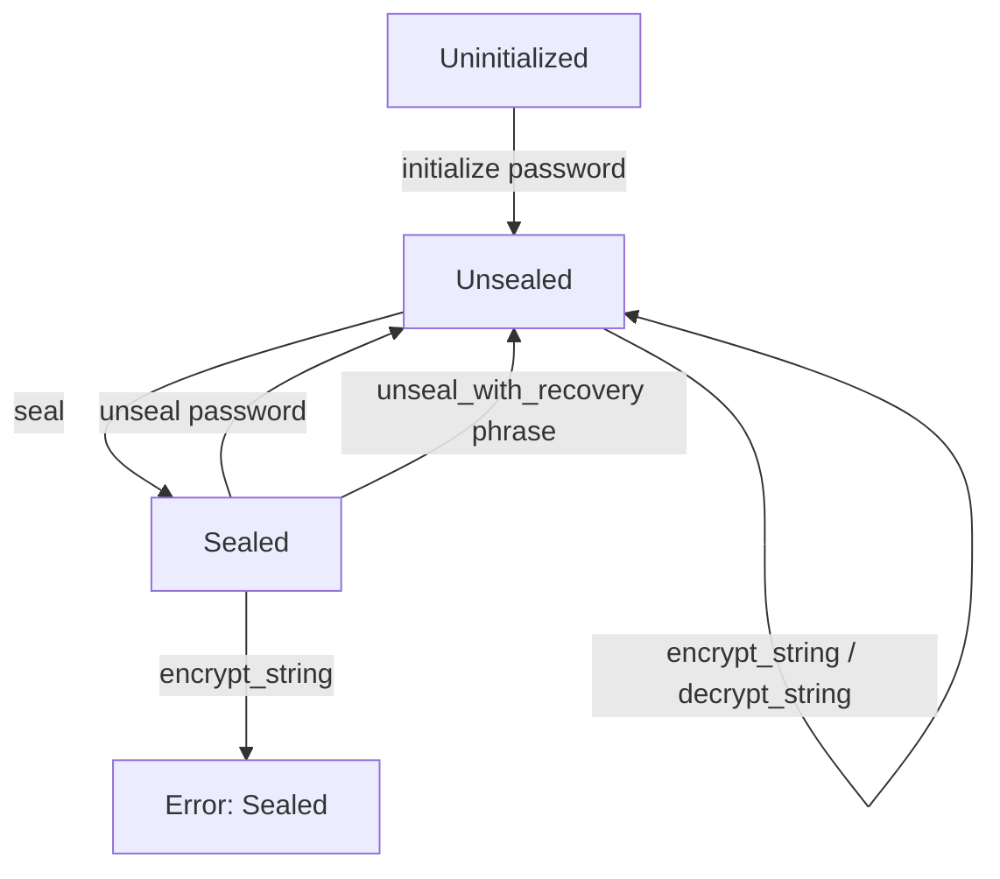
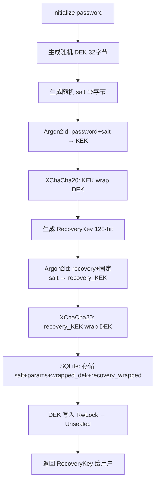
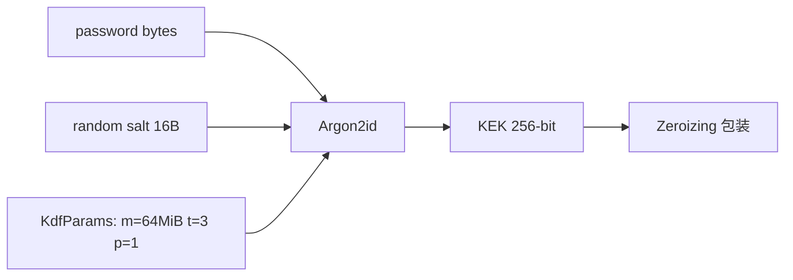

# PD-280.01 Moltis — XChaCha20-Poly1305 Encryption-at-Rest Vault

> 文档编号：PD-280.01
> 来源：Moltis `crates/vault/src/`
> GitHub：https://github.com/moltis-org/moltis.git
> 问题域：PD-280 加密保险库 Encryption-at-Rest Vault
> 状态：可复用方案

---

## 第 1 章 问题与动机

### 1.1 核心问题

Agent 系统需要管理大量敏感凭证（API Key、OAuth Token、环境变量），这些数据在磁盘/数据库中以明文存储是严重的安全隐患。一旦数据库文件泄露，所有凭证即刻暴露。

encryption-at-rest（静态加密）要求：
- 数据在存储层始终加密，只在内存中短暂解密
- 密钥不能与加密数据存放在同一位置
- 用户忘记密码时有恢复路径
- 密码变更不需要重新加密所有数据
- 密钥在内存中使用完毕后必须清零

### 1.2 Moltis 的解法概述

Moltis 的 `moltis-vault` crate 实现了一个完整的 encryption-at-rest 保险库：

1. **双层密钥架构**：Password → Argon2id → KEK → wrap(DEK)，数据用 DEK 加密，密码变更只需重新包装 DEK（`vault.rs:187-228`）
2. **三态状态机**：Uninitialized → Sealed → Unsealed，DEK 仅在 Unsealed 态存在于内存中（`vault.rs:17-24`）
3. **Trait 抽象加密后端**：`Cipher` trait 支持未来替换加密算法，版本标签嵌入密文头部（`traits.rs:10-23`）
4. **Recovery Key 独立包装**：128-bit 随机恢复密钥通过独立 Argon2id 派生 KEK 包装 DEK，与密码路径完全解耦（`recovery.rs:49-103`）
5. **透明迁移**：首次 unseal 时自动将明文数据加密，原文件重命名为 `.bak`（`migration.rs:48-89`）

### 1.3 设计思想

| 设计原则 | 具体实现 | 理由 | 替代方案 |
|----------|----------|------|----------|
| DEK/KEK 分离 | Password→KEK→wrap(DEK)，数据用 DEK 加密 | 密码变更 O(1)，不需重加密数据 | 直接用密码派生密钥加密数据（密码变更需全量重加密） |
| XChaCha20-Poly1305 | 24-byte nonce AEAD，随机 nonce 无碰撞风险 | nonce 空间 2^192 远大于 AES-GCM 的 2^96 | AES-256-GCM（nonce 仅 12 字节，需计数器管理） |
| Argon2id KDF | 64MiB 内存 + 3 次迭代 | 抗 GPU/ASIC 暴力破解 | bcrypt/scrypt（Argon2id 是 OWASP 推荐） |
| Zeroize 内存清零 | `Zeroizing<[u8; 32]>` 包装所有密钥 | Drop 时自动清零，防止内存残留 | 手动 memset（容易遗漏，编译器可能优化掉） |
| 版本标签前缀 | 密文首字节 `0x01` 标识加密算法 | 支持未来无缝迁移到新算法 | 无版本（迁移时需全量重加密） |
| AAD 域分离 | 每个加密上下文用不同 AAD（如 `env:KEY_NAME`） | 防止密文跨上下文重放 | 无 AAD（密文可被移植到其他字段） |

---

## 第 2 章 源码实现分析

### 2.1 架构概览

```
┌─────────────────────────────────────────────────────────────────┐
│                        moltis-vault crate                       │
├─────────────────────────────────────────────────────────────────┤
│                                                                 │
│  ┌──────────┐    ┌──────────┐    ┌──────────────────────────┐  │
│  │  Vault   │───→│ key_wrap │───→│  Cipher trait            │  │
│  │ (状态机) │    │ (DEK包装)│    │  └─ XChaCha20Poly1305    │  │
│  └────┬─────┘    └──────────┘    └──────────────────────────┘  │
│       │                                                         │
│       ├──→ kdf.rs (Argon2id: password → KEK)                   │
│       ├──→ recovery.rs (recovery key → KEK → wrap DEK)         │
│       ├──→ migration.rs (明文 → 密文 透明迁移)                  │
│       └──→ SQLite vault_metadata (salt, params, wrapped_dek)   │
│                                                                 │
│  密钥层级:                                                      │
│  Password ──Argon2id──→ KEK ──wrap──→ DEK ──encrypt──→ Data   │
│  RecoveryKey ─Argon2id→ KEK ──wrap──→ DEK (独立路径)           │
│                                                                 │
│  状态机: Uninitialized ──init──→ Unsealed ←──unseal── Sealed   │
│                                    │                    ↑       │
│                                    └──────seal──────────┘       │
└─────────────────────────────────────────────────────────────────┘
```

### 2.2 核心实现

#### 2.2.1 Vault 三态状态机与 DEK 生命周期



对应源码 `crates/vault/src/vault.rs:14-44`：

```rust
#[derive(Debug, Clone, Copy, PartialEq, Eq, serde::Serialize, serde::Deserialize)]
#[serde(rename_all = "lowercase")]
pub enum VaultStatus {
    Uninitialized,  // 无密码，vault 不存在
    Sealed,         // vault 存在但 DEK 不在内存
    Unsealed,       // DEK 在内存中，可加解密
}

pub struct Vault<C: Cipher = XChaCha20Poly1305Cipher> {
    pool: SqlitePool,
    cipher: C,
    dek: RwLock<Option<Zeroizing<[u8; 32]>>>,  // None = sealed
}
```

关键设计：`dek` 字段用 `RwLock<Option<Zeroizing<[u8; 32]>>>` 三层包装——`RwLock` 提供并发安全，`Option` 表达 seal/unseal 状态，`Zeroizing` 确保 Drop 时内存清零。

#### 2.2.2 初始化流程：DEK 生成与双路径包装



对应源码 `crates/vault/src/vault.rs:85-130`：

```rust
pub async fn initialize(&self, password: &str) -> Result<RecoveryKey, VaultError> {
    if self.load_metadata().await?.is_some() {
        return Err(VaultError::AlreadyInitialized);
    }
    // 生成随机 DEK
    let mut dek = Zeroizing::new([0u8; 32]);
    rand::RngCore::fill_bytes(&mut rand::rng(), dek.as_mut());
    // Argon2id 派生 KEK
    let salt_b64 = kdf::generate_salt();
    let salt = kdf::decode_salt(&salt_b64)?;
    let params = KdfParams::default();
    let kek = kdf::derive_key(password.as_bytes(), &salt, &params)?;
    // 密码路径包装 DEK
    let wrapped_dek = key_wrap::wrap_dek(&self.cipher, &kek, &dek)?;
    // Recovery 路径包装 DEK
    let recovery_key = recovery::generate_recovery_key();
    let (recovery_wrapped, recovery_hash) =
        recovery::wrap_with_recovery(&self.cipher, &dek, recovery_key.phrase())?;
    // 持久化到 SQLite
    sqlx::query("INSERT INTO vault_metadata ...")
        .bind(&salt_b64).bind(&params_json)
        .bind(&wrapped_dek).bind(&recovery_wrapped).bind(&recovery_hash)
        .execute(&self.pool).await?;
    *self.dek.write().await = Some(dek);
    Ok(recovery_key)
}
```

#### 2.2.3 Argon2id KDF 参数化设计



对应源码 `crates/vault/src/kdf.rs:9-49`：

```rust
#[derive(Debug, Clone, serde::Serialize, serde::Deserialize)]
pub struct KdfParams {
    pub m_cost: u32,  // 内存成本 KiB（默认 65536 = 64MiB）
    pub t_cost: u32,  // 迭代次数（默认 3）
    pub p_cost: u32,  // 并行度（默认 1）
}

pub fn derive_key(
    password: &[u8], salt: &[u8], params: &KdfParams,
) -> Result<Zeroizing<[u8; 32]>, VaultError> {
    let argon2 = Argon2::new(
        argon2::Algorithm::Argon2id,
        argon2::Version::V0x13,
        argon2::Params::new(params.m_cost, params.t_cost, params.p_cost, Some(32))?,
    );
    let mut output = Zeroizing::new([0u8; 32]);
    argon2.hash_password_into(password, salt, output.as_mut())?;
    Ok(output)
}
```

KdfParams 序列化为 JSON 存入数据库，支持未来调整参数而不破坏已有数据。

### 2.3 实现细节

#### 版本标签与密文格式

每个加密 blob 的格式为 `[version_tag: 1B][nonce: 24B][ciphertext + Poly1305 tag]`，version_tag 由 `Cipher::version_tag()` 返回（XChaCha20 = `0x01`，见 `xchacha20.rs:13`）。这使得未来引入新算法（如 AES-256-GCM-SIV）时，可以通过首字节路由到正确的解密器。

#### AAD 域分离

数据加密使用上下文相关的 AAD（如 `"env:OPENAI_API_KEY"`），密钥包装使用固定 AAD `"dek-wrap"`（`key_wrap.rs:12`）。这确保：
- 环境变量密文不能被移植到其他环境变量字段
- 密钥包装密文不能被当作数据密文解密

#### Recovery Key 设计

Recovery key 是 128-bit 随机值，编码为 `XXXX-XXXX-XXXX-XXXX-XXXX-XXXX-XXXX-XXXX` 格式（8 组 4 字符，字符集排除了易混淆的 I/O/0/1，见 `recovery.rs:46`）。Recovery KDF 使用固定 salt（`recovery.rs:20`）和较轻的参数（16MiB/2 次迭代），因为 recovery key 本身已有 128-bit 熵。

#### 透明迁移

`migration.rs` 提供两种迁移路径：
- **SQL 行级迁移**（`migrate_env_vars`，`migration.rs:15-42`）：逐行加密 `encrypted=0` 的环境变量
- **文件级迁移**（`migrate_json_file`，`migration.rs:48-89`）：`.json` → 加密 → `.json.enc`，原文件重命名为 `.json.bak`，Unix 下设置 `0o600` 权限

`load_encrypted_or_plaintext`（`migration.rs:92-121`）实现优雅降级：优先读 `.enc` 文件，无 vault 时回退到明文。


---

## 第 3 章 迁移指南

### 3.1 迁移清单

**阶段 1：核心加密层（必须）**

- [ ] 引入依赖：`chacha20poly1305`、`argon2`、`zeroize`、`rand`、`base64`
- [ ] 实现 `Cipher` trait 和 `XChaCha20Poly1305Cipher`
- [ ] 实现 `KdfParams` + `derive_key()` Argon2id 派生
- [ ] 实现 `wrap_dek()` / `unwrap_dek()` 密钥包装
- [ ] 创建 `vault_metadata` 表（SQLite/Postgres）

**阶段 2：Vault 状态机（必须）**

- [ ] 实现 `Vault` struct 与三态状态机
- [ ] 实现 `initialize()` / `unseal()` / `seal()` / `encrypt_string()` / `decrypt_string()`
- [ ] 用 `RwLock<Option<Zeroizing<[u8; 32]>>>` 管理 DEK 生命周期

**阶段 3：Recovery Key（推荐）**

- [ ] 实现 recovery key 生成（128-bit 随机 + 人类友好编码）
- [ ] 实现 recovery 路径的 DEK 包装/解包装
- [ ] 在 `initialize()` 中同时生成 recovery key

**阶段 4：数据迁移（按需）**

- [ ] 实现 SQL 行级明文→密文迁移
- [ ] 实现文件级 `.json` → `.json.enc` 迁移
- [ ] 实现 `load_encrypted_or_plaintext()` 优雅降级

### 3.2 适配代码模板

以下是一个可直接运行的 Rust 最小实现（基于 Moltis 的设计，简化为单文件）：

```rust
use chacha20poly1305::{XChaCha20Poly1305, XNonce, aead::{Aead, KeyInit, Payload}};
use argon2::Argon2;
use zeroize::Zeroizing;
use rand::RngCore;

const NONCE_LEN: usize = 24;
const WRAP_AAD: &[u8] = b"dek-wrap";

/// Argon2id 派生 256-bit 密钥
fn derive_kek(password: &[u8], salt: &[u8]) -> Zeroizing<[u8; 32]> {
    let params = argon2::Params::new(65536, 3, 1, Some(32)).unwrap();
    let argon2 = Argon2::new(argon2::Algorithm::Argon2id, argon2::Version::V0x13, params);
    let mut kek = Zeroizing::new([0u8; 32]);
    argon2.hash_password_into(password, salt, kek.as_mut()).unwrap();
    kek
}

/// XChaCha20-Poly1305 加密
fn encrypt(key: &[u8; 32], plaintext: &[u8], aad: &[u8]) -> Vec<u8> {
    let cipher = XChaCha20Poly1305::new(key.into());
    let mut nonce = [0u8; NONCE_LEN];
    rand::rng().fill_bytes(&mut nonce);
    let ct = cipher.encrypt(XNonce::from_slice(&nonce), Payload { msg: plaintext, aad }).unwrap();
    [nonce.as_slice(), &ct].concat()
}

/// XChaCha20-Poly1305 解密
fn decrypt(key: &[u8; 32], blob: &[u8], aad: &[u8]) -> Vec<u8> {
    let (nonce, ct) = blob.split_at(NONCE_LEN);
    let cipher = XChaCha20Poly1305::new(key.into());
    cipher.decrypt(XNonce::from_slice(nonce), Payload { msg: ct, aad }).unwrap()
}

/// DEK 包装：KEK 加密 DEK
fn wrap_dek(kek: &[u8; 32], dek: &[u8; 32]) -> Vec<u8> {
    encrypt(kek, dek, WRAP_AAD)
}

/// DEK 解包装
fn unwrap_dek(kek: &[u8; 32], wrapped: &[u8]) -> Zeroizing<[u8; 32]> {
    let plain = decrypt(kek, wrapped, WRAP_AAD);
    let mut dek = Zeroizing::new([0u8; 32]);
    dek.copy_from_slice(&plain);
    dek
}
```

### 3.3 适用场景

| 场景 | 适用度 | 说明 |
|------|--------|------|
| Agent 凭证管理（API Key、Token） | ⭐⭐⭐ | 核心场景，DEK/KEK 分离确保密码变更不影响已加密数据 |
| 桌面应用本地加密存储 | ⭐⭐⭐ | seal/unseal 状态机天然适配"启动时输入主密码"模式 |
| 多用户 SaaS 密钥管理 | ⭐⭐ | 需扩展为每用户独立 vault，当前设计是单 vault |
| 高吞吐服务端加密 | ⭐⭐ | RwLock 读锁并发足够，但 Argon2id unseal 较慢（设计如此） |
| 嵌入式/资源受限环境 | ⭐ | Argon2id 64MiB 内存需求较高，需调低 m_cost |

---

## 第 4 章 测试用例

基于 Moltis 真实测试签名的 Rust 测试模板：

```rust
#[cfg(test)]
mod tests {
    use super::*;

    // ---- KDF 测试 ----
    #[test]
    fn kdf_deterministic() {
        let salt = b"test-salt-16byte";
        let params = KdfParams { m_cost: 256, t_cost: 1, p_cost: 1 };
        let k1 = derive_key(b"password", salt, &params).unwrap();
        let k2 = derive_key(b"password", salt, &params).unwrap();
        assert_eq!(*k1, *k2, "相同输入必须产生相同密钥");
    }

    #[test]
    fn kdf_different_passwords() {
        let salt = b"test-salt-16byte";
        let params = KdfParams { m_cost: 256, t_cost: 1, p_cost: 1 };
        let k1 = derive_key(b"pass1", salt, &params).unwrap();
        let k2 = derive_key(b"pass2", salt, &params).unwrap();
        assert_ne!(*k1, *k2, "不同密码必须产生不同密钥");
    }

    // ---- 状态机测试 ----
    #[tokio::test]
    async fn vault_lifecycle() {
        let vault = setup_test_vault().await;
        assert_eq!(vault.status().await.unwrap(), VaultStatus::Uninitialized);

        let rk = vault.initialize("mypassword").await.unwrap();
        assert_eq!(vault.status().await.unwrap(), VaultStatus::Unsealed);

        vault.seal().await;
        assert_eq!(vault.status().await.unwrap(), VaultStatus::Sealed);

        // 密码 unseal
        vault.unseal("mypassword").await.unwrap();
        assert_eq!(vault.status().await.unwrap(), VaultStatus::Unsealed);

        // Recovery unseal
        vault.seal().await;
        vault.unseal_with_recovery(rk.phrase()).await.unwrap();
        assert_eq!(vault.status().await.unwrap(), VaultStatus::Unsealed);
    }

    // ---- 加解密测试 ----
    #[tokio::test]
    async fn encrypt_decrypt_with_aad() {
        let vault = setup_unsealed_vault().await;
        let enc = vault.encrypt_string("sk-secret", "env:API_KEY").await.unwrap();
        let dec = vault.decrypt_string(&enc, "env:API_KEY").await.unwrap();
        assert_eq!(dec, "sk-secret");
    }

    #[tokio::test]
    async fn wrong_aad_fails() {
        let vault = setup_unsealed_vault().await;
        let enc = vault.encrypt_string("secret", "env:KEY1").await.unwrap();
        assert!(vault.decrypt_string(&enc, "env:KEY2").await.is_err());
    }

    #[tokio::test]
    async fn sealed_vault_rejects_encrypt() {
        let vault = setup_unsealed_vault().await;
        vault.seal().await;
        assert!(matches!(
            vault.encrypt_string("data", "aad").await,
            Err(VaultError::Sealed)
        ));
    }

    // ---- 密码变更测试 ----
    #[tokio::test]
    async fn change_password_preserves_data() {
        let vault = setup_unsealed_vault().await;
        let enc = vault.encrypt_string("secret", "test").await.unwrap();
        vault.change_password("oldpass", "newpass").await.unwrap();
        vault.seal().await;
        vault.unseal("newpass").await.unwrap();
        assert_eq!(vault.decrypt_string(&enc, "test").await.unwrap(), "secret");
        vault.seal().await;
        assert!(vault.unseal("oldpass").await.is_err());
    }
}
```


---

## 第 5 章 跨域关联

| 关联域 | 关系类型 | 说明 |
|--------|----------|------|
| PD-06 记忆持久化 | 协同 | Vault 为记忆系统提供加密存储层，敏感记忆（API Key、用户凭证）应通过 vault 加密后持久化 |
| PD-03 容错与重试 | 协同 | Vault sealed 状态下的操作返回 `VaultError::Sealed`，上层需要容错处理（提示用户 unseal 或自动重试） |
| PD-11 可观测性 | 协同 | Vault 通过 `#[cfg(feature = "tracing")]` 条件编译集成 tracing，seal/unseal/migrate 事件可被追踪 |
| PD-04 工具系统 | 依赖 | Agent 工具调用外部 API 时需要从 vault 获取解密后的凭证，工具系统依赖 vault 的 unseal 状态 |
| PD-09 Human-in-the-Loop | 协同 | vault 初始化和 unseal 是典型的 HITL 场景——需要人类输入密码才能继续 |

---

## 第 6 章 来源文件索引

| 文件 | 行范围 | 关键实现 |
|------|--------|----------|
| `crates/vault/src/vault.rs` | L1-482 | Vault 状态机、initialize/unseal/seal/encrypt/decrypt 全流程 |
| `crates/vault/src/kdf.rs` | L1-130 | Argon2id KDF 参数化派生、salt 生成与编解码 |
| `crates/vault/src/key_wrap.rs` | L1-125 | DEK 包装/解包装，版本标签验证，AAD 域分离 |
| `crates/vault/src/recovery.rs` | L1-186 | Recovery key 生成（128-bit）、独立 KEK 派生、包装/解包装 |
| `crates/vault/src/xchacha20.rs` | L1-165 | XChaCha20-Poly1305 Cipher trait 实现，nonce 管理 |
| `crates/vault/src/migration.rs` | L1-260 | 明文→密文透明迁移（SQL 行级 + 文件级），优雅降级读取 |
| `crates/vault/src/traits.rs` | L1-23 | Cipher trait 定义（version_tag + encrypt + decrypt） |
| `crates/vault/src/error.rs` | L1-41 | VaultError 枚举（Sealed/BadCredential/CipherError 等） |
| `crates/vault/src/lib.rs` | L1-34 | 模块导出 + SQLx 迁移入口 |
| `crates/vault/Cargo.toml` | L1-31 | 依赖声明：chacha20poly1305, argon2, zeroize, sqlx 等 |

---

## 第 7 章 横向对比维度

```json comparison_data
{
  "project": "Moltis",
  "dimensions": {
    "加密算法": "XChaCha20-Poly1305 AEAD，24字节随机nonce",
    "密钥派生": "Argon2id KDF，64MiB/3次迭代，参数可序列化",
    "密钥架构": "DEK/KEK双层分离，密码变更O(1)不重加密数据",
    "状态管理": "三态状态机 Uninitialized→Sealed→Unsealed，RwLock并发",
    "恢复机制": "128-bit RecoveryKey独立Argon2id路径包装DEK",
    "内存安全": "Zeroizing<[u8;32]>自动清零，Drop时擦除密钥",
    "版本迁移": "密文首字节version_tag，Cipher trait可插拔替换",
    "数据迁移": "透明迁移：SQL行级+文件级，.bak备份+0o600权限",
    "域分离": "AAD上下文绑定（env:KEY_NAME / dek-wrap / provider_keys）"
  }
}
```

### 域元数据补充

```json domain_metadata
{
  "solution_summary": "Moltis 用 XChaCha20-Poly1305 + Argon2id 双层密钥架构实现 encryption-at-rest，三态状态机管理 DEK 生命周期，支持 Recovery Key 独立恢复路径与透明数据迁移",
  "description": "涵盖密钥层级设计、版本化密文格式与明文到密文的透明迁移策略",
  "sub_problems": [
    "版本化密文格式与算法迁移路径",
    "AAD 域分离防止密文跨上下文重放",
    "明文数据透明迁移（SQL行级+文件级）",
    "KDF 参数序列化与未来可调整性"
  ],
  "best_practices": [
    "DEK/KEK 分离使密码变更 O(1) 无需重加密数据",
    "密文首字节嵌入 version_tag 支持未来算法无缝迁移",
    "Recovery Key 使用较轻 KDF 参数因其本身已有 128-bit 熵",
    "迁移时原文件重命名为 .bak 而非删除，Unix 下 .enc 设置 0o600 权限"
  ]
}
```

