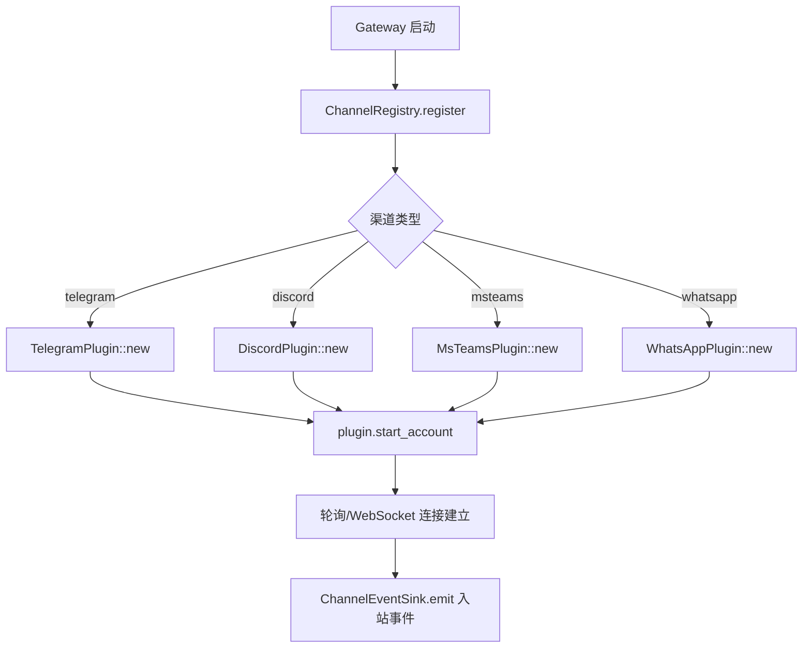
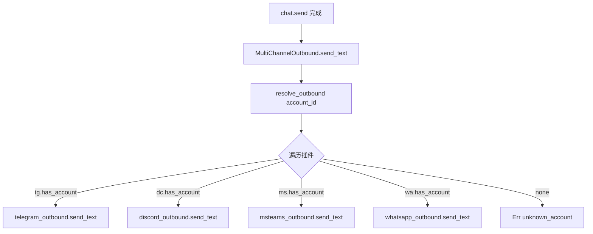
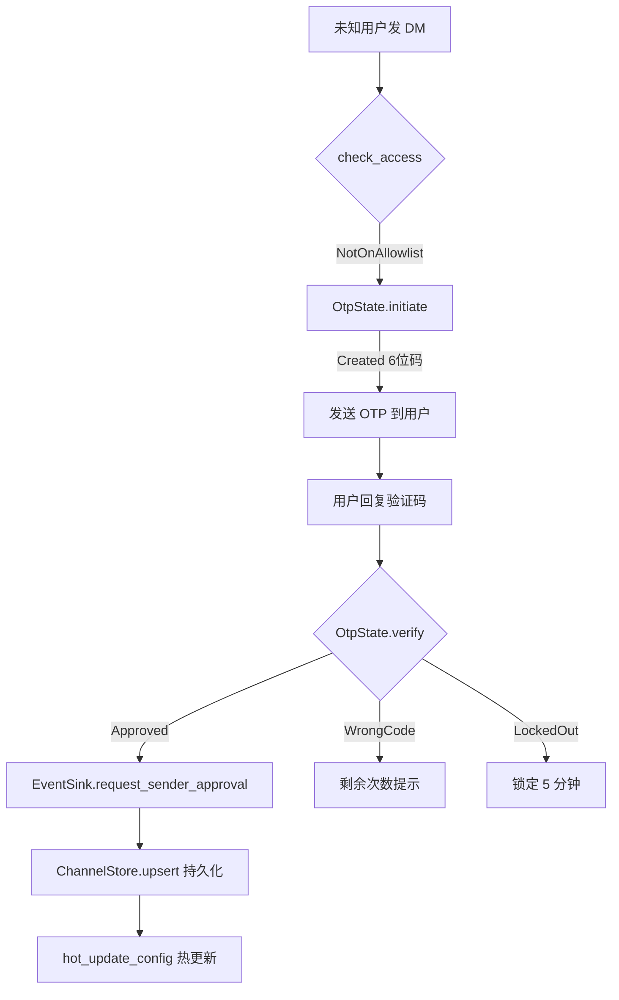

# PD-281.01 Moltis — Rust Trait 多渠道插件与级联路由

> 文档编号：PD-281.01
> 来源：Moltis `crates/channels/src/plugin.rs`, `crates/routing/src/lib.rs`, `crates/gateway/src/channel_outbound.rs`
> GitHub：https://github.com/moltis-org/moltis.git
> 问题域：PD-281 多渠道通信 Multi-Channel Communication
> 状态：可复用方案

---

## 第 1 章 问题与动机

### 1.1 核心问题

AI Agent 需要同时接入 Telegram、Discord、Microsoft Teams、WhatsApp 等多个即时通讯平台，面临以下工程挑战：

1. **接口碎片化**：每个平台的 API 协议、消息格式、认证方式完全不同
2. **消息路由**：同一个 Agent 实例需要根据来源渠道、用户身份、群组归属将消息路由到正确的会话
3. **访问控制**：不同渠道需要不同的安全策略（DM 白名单、群组 @提及、OTP 自审批）
4. **出站格式化**：Markdown 到 Telegram HTML、Discord Embed、Teams Adaptive Card 的转换各不相同
5. **流式响应**：LLM 的流式输出需要在各平台上实现"编辑消息"的实时更新效果
6. **生命周期管理**：多个 bot 账号的启停、健康检查、配置热更新需要统一管理

### 1.2 Moltis 的解法概述

Moltis 采用 Rust trait 体系构建了一套四层渠道抽象架构：

1. **ChannelPlugin trait** (`crates/channels/src/plugin.rs:288-307`)：定义渠道插件的统一接口——`id()`、`name()`、`start_account()`、`stop_account()`、`outbound()`、`status()`
2. **ChannelOutbound + ChannelStreamOutbound trait** (`crates/channels/src/plugin.rs:314-439`)：分离普通消息发送与流式编辑更新两种出站模式
3. **MultiChannelOutbound 路由器** (`crates/gateway/src/channel_outbound.rs:22-246`)：按 account_id 动态解析到具体渠道插件，实现透明的多渠道出站路由
4. **ChannelEventSink trait** (`crates/channels/src/plugin.rs:124-232`)：入站事件的反向通道，将渠道消息分发到 Gateway 的 chat 会话系统
5. **六级绑定级联路由** (`crates/routing/src/lib.rs:1-17`)：peer → guild → team → account → channel → default 的消息路由优先级

### 1.3 设计思想

| 设计原则 | 具体实现 | 理由 | 替代方案 |
|----------|----------|------|----------|
| Trait 多态替代枚举分发 | `ChannelPlugin` / `ChannelOutbound` 为 `dyn Trait` | 新增渠道只需实现 trait，无需修改路由器 | 枚举 match（每加一个渠道改一处） |
| 出站/入站分离 | Outbound trait 与 EventSink trait 独立 | 出站是同步调用，入站是异步事件流，关注点分离 | 单一双向 trait |
| account_id 作为路由键 | MultiChannelOutbound 按 account_id 遍历插件 | 同一渠道可有多个 bot 账号，account_id 是最细粒度标识 | channel_type 路由（不支持多账号） |
| 配置热更新不重启轮询 | `update_account_config()` 只改内存中的 config | 避免 Telegram offset 重置导致消息重放 | stop + start（有消息丢失风险） |
| OTP 自审批闭环 | OtpState 内存状态 + EventSink 回调 + ChannelStore 持久化 | 用户在渠道内完成验证，无需切换到 Web UI | 仅 Web UI 审批 |

---

## 第 2 章 源码实现分析

### 2.1 架构概览

```
┌─────────────────────────────────────────────────────────────────┐
│                        Gateway Layer                            │
│  ┌──────────────────┐  ┌──────────────────┐                     │
│  │ LiveChannelService│  │ GatewayChannel   │                     │
│  │ (CRUD + status)  │  │ EventSink        │                     │
│  └────────┬─────────┘  └────────┬─────────┘                     │
│           │                     │                               │
│  ┌────────▼─────────────────────▼─────────┐                     │
│  │        MultiChannelOutbound            │                     │
│  │  resolve_outbound(account_id) →        │                     │
│  │    TG / Discord / Teams / WA           │                     │
│  └────────┬──────┬──────┬──────┬──────────┘                     │
└───────────┼──────┼──────┼──────┼────────────────────────────────┘
            │      │      │      │
   ┌────────▼──┐ ┌─▼────┐ ┌▼────┐ ┌▼────────┐
   │ Telegram  │ │Discord│ │Teams│ │WhatsApp  │
   │ Plugin    │ │Plugin │ │Plugin│ │Plugin   │
   │ (teloxide)│ │(seren)│ │(http)│ │(whatsapp│
   │           │ │       │ │     │ │ -rs)    │
   └───────────┘ └───────┘ └─────┘ └─────────┘
        │            │         │         │
   ChannelPlugin trait + ChannelOutbound trait
   ChannelStreamOutbound trait + ChannelStatus trait
```

每个渠道 crate 独立编译，通过 Cargo feature flag 控制（如 WhatsApp 通过 `#[cfg(feature = "whatsapp")]` 条件编译）。

### 2.2 核心实现

#### 2.2.1 ChannelPlugin Trait — 渠道插件统一接口



对应源码 `crates/channels/src/plugin.rs:288-307`：

```rust
/// Core channel plugin trait. Each messaging platform implements this.
#[async_trait]
pub trait ChannelPlugin: Send + Sync {
    /// Channel identifier (e.g. "telegram", "discord").
    fn id(&self) -> &str;

    /// Human-readable channel name.
    fn name(&self) -> &str;

    /// Start an account connection.
    async fn start_account(&mut self, account_id: &str, config: serde_json::Value) -> Result<()>;

    /// Stop an account connection.
    async fn stop_account(&mut self, account_id: &str) -> Result<()>;

    /// Get outbound adapter for sending messages.
    fn outbound(&self) -> Option<&dyn ChannelOutbound>;

    /// Get status adapter for health checks.
    fn status(&self) -> Option<&dyn ChannelStatus>;
}
```

`ChannelRegistry` (`crates/channels/src/registry.rs:7-41`) 用 `HashMap<String, Box<dyn ChannelPlugin>>` 存储所有已注册插件，支持按 id 查找和可变引用获取。

#### 2.2.2 MultiChannelOutbound — 动态路由出站消息



对应源码 `crates/gateway/src/channel_outbound.rs:75-102`：

```rust
async fn resolve_outbound(&self, account_id: &str) -> ChannelResult<&dyn ChannelOutbound> {
    {
        let tg = self.telegram_plugin.read().await;
        if tg.has_account(account_id) {
            return Ok(self.telegram_outbound.as_ref());
        }
    }
    {
        let ms = self.msteams_plugin.read().await;
        if ms.has_account(account_id) {
            return Ok(self.msteams_outbound.as_ref());
        }
    }
    {
        let dc = self.discord_plugin.read().await;
        if dc.has_account(account_id) {
            return Ok(self.discord_outbound.as_ref());
        }
    }
    #[cfg(feature = "whatsapp")]
    {
        let wa = self.whatsapp_plugin.read().await;
        if wa.has_account(account_id) {
            return Ok(self.whatsapp_outbound.as_ref());
        }
    }
    Err(ChannelError::unknown_account(account_id))
}
```

关键设计：每个插件的 `RwLock` 读锁在作用域结束后立即释放，避免跨插件死锁。

#### 2.2.3 OTP 自审批 — 渠道内闭环验证



对应源码 `crates/channels/src/otp.rs:89-126`：

```rust
pub fn initiate(
    &mut self,
    peer_id: &str,
    username: Option<String>,
    sender_name: Option<String>,
) -> OtpInitResult {
    let now = Instant::now();
    // Check lockout first.
    if let Some(lockout) = self.lockouts.get(peer_id) {
        if now < lockout.until {
            return OtpInitResult::LockedOut;
        }
        self.lockouts.remove(peer_id);
    }
    // Check for existing unexpired challenge.
    if let Some(existing) = self.challenges.get(peer_id) {
        if now < existing.expires_at {
            return OtpInitResult::AlreadyPending;
        }
        self.challenges.remove(peer_id);
    }
    let code = generate_otp_code();
    let challenge = OtpChallenge {
        code: code.clone(),
        peer_id: peer_id.to_string(),
        username,
        sender_name,
        created_at: now,
        expires_at: now + OTP_TTL,
        attempts: 0,
    };
    self.challenges.insert(peer_id.to_string(), challenge);
    OtpInitResult::Created(code)
}
```

安全要点：`update_account_config()` 不会取消 CancellationToken（`crates/telegram/src/plugin.rs:311-333` 的安全测试验证了这一点），避免 Telegram 轮询重启导致 OTP 消息重放。

### 2.3 实现细节

**访问控制三层策略** (`crates/telegram/src/access.rs:12-86`)：

- DM 层：`DmPolicy` 枚举（Open / Allowlist / Disabled），Allowlist 模式下空列表 = 拒绝所有
- Group 层：`GroupPolicy` 枚举 + `MentionMode` 枚举（Mention / Always / None）
- Gating 层：`is_allowed()` 支持大小写不敏感匹配和 `*` 通配符 (`crates/channels/src/gating.rs:8-52`)

**流式出站** (`crates/telegram/src/outbound.rs:810-965`)：

- 使用 `tokio::select!` 同时监听 stream 事件和 typing 刷新定时器
- 累积文本达到 `min_initial_chars`（默认 30）后才发送首条消息
- 编辑节流 `edit_throttle_ms`（默认 300ms）防止 Telegram API 限流
- HTML 发送失败自动降级为纯文本（`send_chunk_with_fallback`）
- 429 RetryAfter 自动等待重试，最多 4 次 (`crates/telegram/src/outbound.rs:188-236`)

**会话键生成** (`crates/gateway/src/channel_events.rs:23-48`)：

- 确定性键：`{channel_type}:{account_id}:{chat_id}`
- 支持 `set_active_session` 覆盖映射，实现 `/new` 创建新会话、`/sessions N` 切换会话

---

## 第 3 章 迁移指南

### 3.1 迁移清单

**阶段 1：核心 Trait 定义（1-2 天）**

- [ ] 定义 `ChannelPlugin` trait（id / name / start / stop / outbound / status）
- [ ] 定义 `ChannelOutbound` trait（send_text / send_media / send_typing）
- [ ] 定义 `ChannelStreamOutbound` trait（send_stream / is_stream_enabled）
- [ ] 定义 `ChannelEventSink` trait（emit / dispatch_to_chat）
- [ ] 定义 `ChannelType` 枚举 + FromStr / Display / Serialize

**阶段 2：渠道适配器实现（每个渠道 2-3 天）**

- [ ] 实现 TelegramPlugin（teloxide 库）
- [ ] 实现 DiscordPlugin（serenity 库）
- [ ] 实现 MsTeamsPlugin（HTTP webhook）
- [ ] 实现 WhatsAppPlugin（条件编译 feature flag）

**阶段 3：路由与安全（1-2 天）**

- [ ] 实现 MultiChannelOutbound 路由器
- [ ] 实现 ChannelRegistry 注册表
- [ ] 实现 DmPolicy / GroupPolicy / MentionMode 访问控制
- [ ] 实现 OTP 自审批流程

**阶段 4：Gateway 集成（1-2 天）**

- [ ] 实现 GatewayChannelEventSink（WebSocket 广播）
- [ ] 实现 LiveChannelService（CRUD + 健康检查）
- [ ] 实现 ChannelStore 持久化

### 3.2 适配代码模板

以下是一个可直接复用的 Python 版多渠道插件框架（从 Moltis 的 Rust trait 体系翻译）：

```python
from abc import ABC, abstractmethod
from dataclasses import dataclass, field
from enum import Enum
from typing import Optional, Dict, Any, AsyncIterator
import asyncio


class ChannelType(str, Enum):
    TELEGRAM = "telegram"
    DISCORD = "discord"
    MSTEAMS = "msteams"
    WHATSAPP = "whatsapp"


@dataclass
class ChannelReplyTarget:
    channel_type: ChannelType
    account_id: str
    chat_id: str
    message_id: Optional[str] = None


@dataclass
class ChannelHealthSnapshot:
    connected: bool
    account_id: str
    details: Optional[str] = None


class ChannelOutbound(ABC):
    """Send messages to a channel — mirrors Moltis ChannelOutbound trait."""

    @abstractmethod
    async def send_text(
        self, account_id: str, to: str, text: str, reply_to: Optional[str] = None
    ) -> None: ...

    @abstractmethod
    async def send_media(
        self, account_id: str, to: str, payload: dict, reply_to: Optional[str] = None
    ) -> None: ...

    async def send_typing(self, account_id: str, to: str) -> None:
        pass  # no-op default, like Moltis


class ChannelStreamOutbound(ABC):
    """Stream responses via edit-in-place — mirrors Moltis ChannelStreamOutbound."""

    @abstractmethod
    async def send_stream(
        self, account_id: str, to: str, reply_to: Optional[str],
        stream: AsyncIterator[str],
    ) -> None: ...

    async def is_stream_enabled(self, account_id: str) -> bool:
        return True


class ChannelPlugin(ABC):
    """Core channel plugin — mirrors Moltis ChannelPlugin trait."""

    @abstractmethod
    def id(self) -> str: ...

    @abstractmethod
    def name(self) -> str: ...

    @abstractmethod
    async def start_account(self, account_id: str, config: dict) -> None: ...

    @abstractmethod
    async def stop_account(self, account_id: str) -> None: ...

    @abstractmethod
    def outbound(self) -> Optional[ChannelOutbound]: ...

    async def probe(self, account_id: str) -> ChannelHealthSnapshot:
        return ChannelHealthSnapshot(connected=False, account_id=account_id)


class ChannelRegistry:
    """Registry of loaded channel plugins — mirrors Moltis ChannelRegistry."""

    def __init__(self):
        self._plugins: Dict[str, ChannelPlugin] = {}

    def register(self, plugin: ChannelPlugin) -> None:
        self._plugins[plugin.id()] = plugin

    def get(self, channel_id: str) -> Optional[ChannelPlugin]:
        return self._plugins.get(channel_id)

    def list(self) -> list[str]:
        return list(self._plugins.keys())


class MultiChannelOutbound(ChannelOutbound):
    """Routes outbound messages by account_id — mirrors Moltis MultiChannelOutbound."""

    def __init__(self, plugins: Dict[str, ChannelPlugin]):
        self._plugins = plugins

    def _resolve(self, account_id: str) -> ChannelOutbound:
        for plugin in self._plugins.values():
            if hasattr(plugin, 'has_account') and plugin.has_account(account_id):
                out = plugin.outbound()
                if out:
                    return out
        raise ValueError(f"unknown channel account: {account_id}")

    async def send_text(self, account_id, to, text, reply_to=None):
        return await self._resolve(account_id).send_text(account_id, to, text, reply_to)

    async def send_media(self, account_id, to, payload, reply_to=None):
        return await self._resolve(account_id).send_media(account_id, to, payload, reply_to)
```

### 3.3 适用场景

| 场景 | 适用度 | 说明 |
|------|--------|------|
| AI Agent 多平台接入 | ⭐⭐⭐ | 核心场景，trait 体系直接适用 |
| 客服系统多渠道统一 | ⭐⭐⭐ | ChannelOutbound + EventSink 模式完美匹配 |
| 消息转发/桥接 | ⭐⭐ | 需要额外的跨渠道消息映射层 |
| 单渠道 Bot | ⭐ | 过度设计，直接用平台 SDK 即可 |
| 高并发消息推送 | ⭐⭐ | 需要补充消息队列，当前是同步路由 |

---

## 第 4 章 测试用例

基于 Moltis 真实测试模式（`crates/channels/src/plugin.rs:441-630`, `crates/channels/src/otp.rs:228-418`），以下是可运行的 Python 测试：

```python
import pytest
import asyncio
from unittest.mock import AsyncMock, MagicMock
from dataclasses import dataclass
from typing import Optional, Dict
from enum import Enum


# --- Minimal stubs matching Moltis types ---

class ChannelType(str, Enum):
    TELEGRAM = "telegram"
    DISCORD = "discord"

@dataclass
class OtpChallenge:
    code: str
    peer_id: str
    attempts: int = 0
    expired: bool = False

class OtpState:
    """Mirrors crates/channels/src/otp.rs OtpState."""
    MAX_ATTEMPTS = 3

    def __init__(self, cooldown_secs: int = 300):
        self.challenges: Dict[str, OtpChallenge] = {}
        self.lockouts: set = set()

    def initiate(self, peer_id: str) -> str:
        if peer_id in self.lockouts:
            raise PermissionError("locked out")
        if peer_id in self.challenges and not self.challenges[peer_id].expired:
            raise ValueError("already pending")
        import random
        code = f"{random.randint(100000, 999999)}"
        self.challenges[peer_id] = OtpChallenge(code=code, peer_id=peer_id)
        return code

    def verify(self, peer_id: str, code: str) -> bool:
        if peer_id in self.lockouts:
            raise PermissionError("locked out")
        ch = self.challenges.get(peer_id)
        if not ch:
            raise KeyError("no pending")
        if ch.code == code:
            del self.challenges[peer_id]
            return True
        ch.attempts += 1
        if ch.attempts >= self.MAX_ATTEMPTS:
            del self.challenges[peer_id]
            self.lockouts.add(peer_id)
            raise PermissionError("locked out")
        return False


class TestOtpSelfApproval:
    """Mirrors crates/channels/src/otp.rs tests."""

    def test_initiate_creates_six_digit_code(self):
        state = OtpState()
        code = state.initiate("user1")
        assert len(code) == 6
        assert code.isdigit()

    def test_initiate_already_pending(self):
        state = OtpState()
        state.initiate("user1")
        with pytest.raises(ValueError, match="already pending"):
            state.initiate("user1")

    def test_verify_correct_code(self):
        state = OtpState()
        code = state.initiate("user1")
        assert state.verify("user1", code) is True
        assert "user1" not in state.challenges

    def test_verify_wrong_code_lockout(self):
        state = OtpState()
        state.initiate("user1")
        assert state.verify("user1", "000000") is False
        assert state.verify("user1", "000001") is False
        with pytest.raises(PermissionError, match="locked out"):
            state.verify("user1", "000002")

    def test_lockout_prevents_initiate(self):
        state = OtpState()
        code = state.initiate("user1")
        state.verify("user1", "000000")
        state.verify("user1", "000001")
        with pytest.raises(PermissionError):
            state.verify("user1", "000002")
        with pytest.raises(PermissionError, match="locked out"):
            state.initiate("user1")


class TestAccessControl:
    """Mirrors crates/telegram/src/access.rs tests."""

    def test_open_dm_allows_all(self):
        assert is_allowed("anyone", []) is True  # empty = open

    def test_allowlist_exact_match(self):
        assert is_allowed("alice", ["alice", "bob"]) is True
        assert is_allowed("Alice", ["alice"]) is True  # case-insensitive
        assert is_allowed("charlie", ["alice", "bob"]) is False

    def test_allowlist_glob_wildcard(self):
        assert is_allowed("admin_alice", ["admin_*"]) is True
        assert is_allowed("user_bob", ["admin_*"]) is False

    def test_allowlist_glob_suffix(self):
        assert is_allowed("user@example.com", ["*@example.com"]) is True
        assert is_allowed("user@other.com", ["*@example.com"]) is False


def is_allowed(peer_id: str, allowlist: list[str]) -> bool:
    """Mirrors crates/channels/src/gating.rs is_allowed."""
    if not allowlist:
        return True
    peer_lower = peer_id.lower()
    for pattern in allowlist:
        pat = pattern.lower()
        if "*" in pat:
            import fnmatch
            if fnmatch.fnmatch(peer_lower, pat):
                return True
        elif pat == peer_lower:
            return True
    return False


class TestMultiChannelRouting:
    """Mirrors crates/gateway/src/channel_outbound.rs resolve logic."""

    @pytest.mark.asyncio
    async def test_resolve_routes_to_correct_plugin(self):
        tg_outbound = AsyncMock()
        dc_outbound = AsyncMock()
        plugins = {
            "telegram": MagicMock(
                has_account=lambda aid: aid == "tg_bot1",
                outbound=lambda: tg_outbound,
            ),
            "discord": MagicMock(
                has_account=lambda aid: aid == "dc_bot1",
                outbound=lambda: dc_outbound,
            ),
        }
        router = MultiChannelOutbound(plugins)
        await router.send_text("tg_bot1", "12345", "hello")
        tg_outbound.send_text.assert_awaited_once()
        dc_outbound.send_text.assert_not_awaited()

    @pytest.mark.asyncio
    async def test_resolve_unknown_account_raises(self):
        router = MultiChannelOutbound({})
        with pytest.raises(ValueError, match="unknown channel account"):
            await router.send_text("ghost", "12345", "hello")


class MultiChannelOutbound:
    def __init__(self, plugins):
        self._plugins = plugins

    def _resolve(self, account_id):
        for plugin in self._plugins.values():
            if plugin.has_account(account_id):
                return plugin.outbound()
        raise ValueError(f"unknown channel account: {account_id}")

    async def send_text(self, account_id, to, text, reply_to=None):
        return await self._resolve(account_id).send_text(account_id, to, text, reply_to)
```

---

## 第 5 章 跨域关联

| 关联域 | 关系类型 | 说明 |
|--------|----------|------|
| PD-06 记忆持久化 | 依赖 | ChannelStore 持久化渠道配置，SessionMetadata 持久化会话绑定关系 |
| PD-04 工具系统 | 协同 | 渠道内 `/sh` 命令模式将用户消息重写为工具调用，`dispatch_command` 处理 `/model`、`/agent` 等控制命令 |
| PD-09 Human-in-the-Loop | 协同 | OTP 自审批是 HITL 的一种实现——用户在渠道内完成身份验证后才能与 Agent 交互 |
| PD-11 可观测性 | 依赖 | MessageLog 记录每条入站消息（含 access_granted 标记），ChannelHealthSnapshot 提供渠道健康探针 |
| PD-03 容错与重试 | 协同 | Telegram outbound 的 429 RetryAfter 自动等待、HTML→纯文本降级、CancellationToken 优雅关闭 |
| PD-01 上下文管理 | 协同 | 渠道会话键 `{type}:{account}:{chat}` 与 Gateway 会话系统共享上下文窗口，`/compact` 命令触发上下文压缩 |

---

## 第 6 章 来源文件索引

| 文件 | 行范围 | 关键实现 |
|------|--------|----------|
| `crates/channels/src/plugin.rs` | L124-439 | ChannelPlugin / ChannelOutbound / ChannelStreamOutbound / ChannelEventSink trait 定义 |
| `crates/channels/src/registry.rs` | L7-41 | ChannelRegistry HashMap 注册表 |
| `crates/channels/src/gating.rs` | L8-52 | is_allowed() 大小写不敏感 + 通配符匹配 |
| `crates/channels/src/otp.rs` | L89-126 | OtpState.initiate() 六位码生成与锁定逻辑 |
| `crates/channels/src/store.rs` | L1-23 | StoredChannel 结构体 + ChannelStore trait |
| `crates/channels/src/message_log.rs` | L1-47 | MessageLog trait + MessageLogEntry / SenderSummary |
| `crates/telegram/src/plugin.rs` | L1-333 | TelegramPlugin 实现 ChannelPlugin trait |
| `crates/telegram/src/access.rs` | L12-86 | check_access() 三层访问控制（DM/Group/Mention） |
| `crates/telegram/src/outbound.rs` | L810-965 | 流式出站 send_stream + 编辑节流 + HTML 降级 |
| `crates/discord/src/plugin.rs` | L31-250 | DiscordPlugin 实现 + serenity 客户端生命周期 |
| `crates/gateway/src/channel.rs` | L36-775 | LiveChannelService CRUD + 多渠道状态聚合 |
| `crates/gateway/src/channel_outbound.rs` | L22-246 | MultiChannelOutbound 动态路由 |
| `crates/gateway/src/channel_events.rs` | L23-1622 | GatewayChannelEventSink + dispatch_to_chat + 渠道命令处理 |
| `crates/routing/src/lib.rs` | L1-17 | 六级绑定级联路由定义 |

---

## 第 7 章 横向对比维度

```json comparison_data
{
  "project": "Moltis",
  "dimensions": {
    "渠道接口": "Rust async_trait 四 trait 体系（Plugin/Outbound/StreamOutbound/EventSink）",
    "路由机制": "account_id 遍历 + RwLock 读锁即释放，六级绑定级联优先级",
    "访问控制": "三层策略（DmPolicy/GroupPolicy/MentionMode）+ OTP 自审批闭环",
    "出站格式化": "HTML 优先 + 纯文本降级，流式编辑节流 300ms，429 自动重试",
    "生命周期管理": "CancellationToken 优雅关闭 + 配置热更新不重启轮询",
    "条件编译": "WhatsApp 通过 Cargo feature flag 可选编译，零成本抽象"
  }
}
```

### 域元数据补充

```json domain_metadata
{
  "solution_summary": "Moltis 用 Rust async_trait 四 trait 体系（Plugin/Outbound/StreamOutbound/EventSink）统一 Telegram/Discord/Teams/WhatsApp 四渠道，配合 account_id 动态路由、OTP 自审批闭环和流式编辑节流实现多渠道通信",
  "description": "渠道插件的流式响应编辑与出站格式降级策略",
  "sub_problems": [
    "流式 LLM 响应在各平台的编辑节流与降级",
    "多实例部署下同一 bot 的冲突检测与自动禁用",
    "渠道内 slash 命令路由与会话管理"
  ],
  "best_practices": [
    "CancellationToken 实现配置热更新不中断轮询",
    "account_id 遍历 + RwLock 即释放避免跨插件死锁",
    "空 allowlist 显式拒绝防止安全降级"
  ]
}
```
