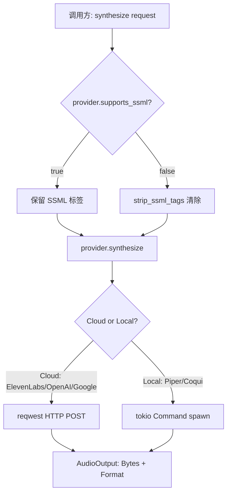
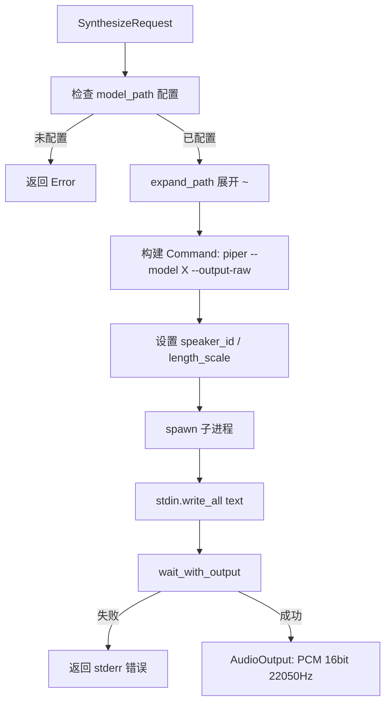
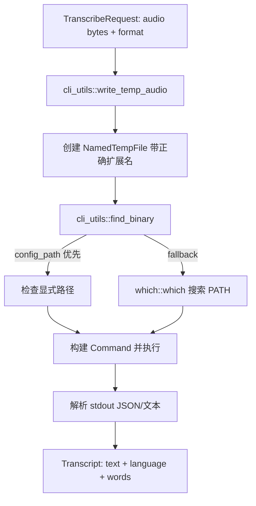

# PD-282.01 Moltis — Trait 双轨 TTS/STT 提供者抽象与本地推理集成

> 文档编号：PD-282.01
> 来源：Moltis `crates/voice/`
> GitHub：https://github.com/moltis-org/moltis.git
> 问题域：PD-282 语音 I/O Voice I/O
> 状态：可复用方案

---

## 第 1 章 问题与动机

### 1.1 核心问题

语音 I/O 是 Agent 系统中连接人类与 AI 的关键通道。核心挑战在于：

1. **提供者碎片化**：TTS 领域有 ElevenLabs、OpenAI、Google Cloud、Coqui、Piper 等，STT 领域有 Whisper、Deepgram、Groq、SherpaOnnx 等，每家 API 协议不同
2. **云端与本地推理的统一**：云端 API（ElevenLabs/OpenAI）走 HTTP REST，本地推理（Piper/whisper.cpp/sherpa-onnx）走子进程 stdin/stdout，两种调用模式需要统一抽象
3. **音频格式多样性**：不同渠道（Telegram 用 Opus/OGG、浏览器用 WebM、通用场景用 MP3）需要不同格式，提供者支持的格式也各不相同
4. **SSML 兼容性差异**：部分提供者（ElevenLabs、Google）原生支持 SSML，其他不支持，需要透明处理
5. **LLM 输出清洗**：Agent 的文本输出包含 Markdown 格式（代码块、表格、URL、标题等），直接送入 TTS 会被逐字朗读

### 1.2 Moltis 的解法概述

Moltis 的 `moltis-voice` crate 提供了一套 Rust trait 驱动的双轨抽象层：

1. **`TtsProvider` trait**（`crates/voice/src/tts/mod.rs:138`）：定义 `id()` / `name()` / `is_configured()` / `supports_ssml()` / `voices()` / `synthesize()` 六方法接口，5 个实现（ElevenLabs/OpenAI/Google/Piper/Coqui）
2. **`SttProvider` trait**（`crates/voice/src/stt/mod.rs:72`）：定义 `id()` / `name()` / `is_configured()` / `transcribe()` 四方法接口，9 个实现（Whisper/Groq/Deepgram/Google/Mistral/VoxtralLocal/WhisperCli/SherpaOnnx/ElevenLabs）
3. **`AudioFormat` 枚举**（`crates/voice/src/tts/mod.rs:38`）：统一 5 种格式（Mp3/Opus/Aac/Pcm/Webm），提供 MIME 类型、扩展名、content-type 解析
4. **`sanitize_text_for_tts()`**（`crates/voice/src/tts/mod.rs:217`）：8 步管道清洗 LLM 输出中的 Markdown 格式，含零分配快速路径
5. **`cli_utils` 模块**（`crates/voice/src/stt/cli_utils.rs:1`）：为本地 CLI 推理工具提供共享的二进制查找、路径展开、临时文件管理

### 1.3 设计思想

| 设计原则 | 具体实现 | 理由 | 替代方案 |
|----------|----------|------|----------|
| Trait 多态 | `TtsProvider` / `SttProvider` async trait + `Send + Sync` | 编译期类型安全 + 运行时动态分发，Rust 惯用模式 | 枚举分发（不可扩展）、回调函数（类型不安全） |
| 云端/本地统一 | 云端走 reqwest HTTP，本地走 tokio::process::Command，同一 trait 接口 | 调用方无需关心底层是 API 还是子进程 | 分离两套接口（增加调用方复杂度） |
| 零分配快速路径 | `sanitize_text_for_tts()` 用 `Cow<str>` 返回，纯文本不分配 | 大部分 Agent 输出是纯文本，避免不必要的堆分配 | 始终返回 `String`（浪费内存） |
| SSML 透明处理 | `supports_ssml()` 默认返回 false，网关层统一 strip | 提供者无需关心 SSML 兼容性，由上层统一处理 | 每个提供者自行处理（重复逻辑） |
| 配置即能力 | `is_configured()` 方法检查 API key 或本地二进制是否就绪 | 运行时动态发现可用提供者，支持优雅降级 | 启动时硬检查（不灵活） |
| Secret 保护 | API key 用 `secrecy::Secret<String>` 包装，Debug 输出 `[REDACTED]` | 防止日志泄露密钥 | 裸 String（安全风险） |

---

## 第 2 章 源码实现分析

### 2.1 架构概览

```
┌─────────────────────────────────────────────────────────────────┐
│                        moltis-voice crate                       │
├─────────────────────────────────────────────────────────────────┤
│                                                                 │
│  ┌──────────────────────┐    ┌──────────────────────┐          │
│  │   TtsProvider trait   │    │   SttProvider trait   │          │
│  │  ┌────────────────┐  │    │  ┌────────────────┐  │          │
│  │  │  synthesize()   │  │    │  │  transcribe()   │  │          │
│  │  │  voices()       │  │    │  │  is_configured() │  │          │
│  │  │  supports_ssml()│  │    │  └────────────────┘  │          │
│  │  └────────────────┘  │    └──────────┬───────────┘          │
│  └──────────┬───────────┘               │                       │
│             │                           │                       │
│  ┌──────────┴───────────────────────────┴───────────┐          │
│  │              Cloud Providers (HTTP)                │          │
│  │  ElevenLabs │ OpenAI │ Google │ Deepgram │ Groq   │          │
│  │  Mistral    │ ElevenLabs-STT                      │          │
│  └───────────────────────────────────────────────────┘          │
│  ┌───────────────────────────────────────────────────┐          │
│  │              Local Providers (CLI)                 │          │
│  │  Piper │ Coqui │ WhisperCli │ SherpaOnnx          │          │
│  │  VoxtralLocal                                     │          │
│  │         ↓ cli_utils (find_binary, temp_audio)     │          │
│  └───────────────────────────────────────────────────┘          │
│                                                                 │
│  ┌───────────────────────────────────────────────────┐          │
│  │  AudioFormat (Mp3/Opus/Aac/Pcm/Webm)             │          │
│  │  sanitize_text_for_tts() — 8-step Markdown strip  │          │
│  │  strip_ssml_tags() — SSML 兼容层                   │          │
│  └───────────────────────────────────────────────────┘          │
│                                                                 │
│  ┌───────────────────────────────────────────────────┐          │
│  │  config.rs — VoiceConfig / TtsConfig / SttConfig  │          │
│  │  TtsProviderId / SttProviderId 枚举               │          │
│  │  Secret<String> API key 保护                       │          │
│  └───────────────────────────────────────────────────┘          │
└─────────────────────────────────────────────────────────────────┘
```

### 2.2 核心实现

#### TtsProvider trait — 语音合成统一接口



对应源码 `crates/voice/src/tts/mod.rs:134-162`：

```rust
/// Text-to-Speech provider trait.
#[async_trait]
pub trait TtsProvider: Send + Sync {
    fn id(&self) -> &'static str;
    fn name(&self) -> &'static str;
    fn is_configured(&self) -> bool;

    /// Whether this provider supports SSML tags natively.
    /// Providers that return `false` will have SSML tags stripped before
    /// synthesis (handled centrally in the gateway's `convert()` handler).
    fn supports_ssml(&self) -> bool {
        false  // 默认不支持，由具体实现覆盖
    }

    async fn voices(&self) -> Result<Vec<Voice>>;
    async fn synthesize(&self, request: SynthesizeRequest) -> Result<AudioOutput>;
}
```

关键设计点：`supports_ssml()` 提供默认实现 `false`，只有 ElevenLabs（`crates/voice/src/tts/elevenlabs.rs:112`）和 Google（`crates/voice/src/tts/google.rs:63`）覆盖为 `true`。网关层根据此标志决定是否在合成前调用 `strip_ssml_tags()`。

#### 本地推理 — Piper TTS 子进程模式



对应源码 `crates/voice/src/tts/piper.rs:89-159`：

```rust
async fn synthesize(&self, request: SynthesizeRequest) -> Result<AudioOutput> {
    let model_path = self.model_path.as_ref()
        .ok_or_else(|| anyhow!("Piper model path not configured"))?;
    let model_path = Self::expand_path(model_path);

    let mut cmd = Command::new(self.get_binary());
    cmd.arg("--model").arg(&model_path);

    if let Some(speaker_id) = self.speaker_id {
        cmd.arg("--speaker").arg(speaker_id.to_string());
    }

    // speed 参数转换为 length_scale（倒数关系）
    let length_scale = request.speed.map(|s| 1.0 / s).unwrap_or(self.length_scale);
    cmd.arg("--length-scale").arg(length_scale.to_string());
    cmd.arg("--output-raw");

    cmd.stdin(Stdio::piped()).stdout(Stdio::piped()).stderr(Stdio::piped());
    let mut child = cmd.spawn()?;

    if let Some(mut stdin) = child.stdin.take() {
        stdin.write_all(request.text.as_bytes()).await?;
        stdin.shutdown().await?;
    }

    let output = child.wait_with_output().await?;
    // 返回 PCM 格式，由调用方按需转换
    Ok(AudioOutput { data: Bytes::from(output.stdout), format: AudioFormat::Pcm, duration_ms: None })
}
```

#### STT 本地推理 — cli_utils 共享基础设施



对应源码 `crates/voice/src/stt/cli_utils.rs:14-53`：

```rust
/// Find a binary in PATH or at a specific path.
pub fn find_binary(name: &str, config_path: Option<&str>) -> Option<PathBuf> {
    if let Some(path_str) = config_path {
        let path = expand_tilde(path_str);
        if path.exists() && path.is_file() {
            return Some(path);
        }
    }
    which::which(name).ok()  // fallback 到系统 PATH
}

/// Write audio data to a temporary file for CLI processing.
pub fn write_temp_audio(audio: &[u8], format: AudioFormat) -> Result<(NamedTempFile, PathBuf)> {
    let ext = format.extension();
    let temp_file = NamedTempFile::with_suffix(format!(".{}", ext))?;
    std::fs::write(temp_file.path(), audio)?;
    let path = temp_file.path().to_path_buf();
    Ok((temp_file, path))  // 返回 handle 保持文件存活
}
```

### 2.3 实现细节

#### sanitize_text_for_tts — 8 步 Markdown 清洗管道

这是 Moltis 独特的 LLM→TTS 文本预处理管道（`crates/voice/src/tts/mod.rs:217-275`），处理顺序：

1. **快速路径检测**：`needs_sanitization()` 检查是否包含任何需要清洗的标记，纯文本直接返回 `Cow::Borrowed`（零分配）
2. **移除代码块**：`remove_code_fences()` 删除 ` ``` ` 围栏内的所有内容
3. **移除表格**：`remove_tables()` 检测 `|` 分隔符 + 分隔行模式，整表删除
4. **逐行处理**：strip markdown headers (`##`)、bullet prefixes (`- `, `* `, `1. `)、inline backticks
5. **移除 URL**：`remove_urls()` 删除 `http://` 和 `https://` 开头的链接
6. **清除粗体/斜体**：`strip_bold_italic()` 处理 `**`、`__`、`*`、`_`，保留缩写中的撇号（如 `don't`）
7. **折叠空白**：`collapse_whitespace()` 将多个空行合并为一个
8. **清除 SSML 标签**：`strip_ssml_tags()` 移除 `<break .../>` 标签

#### 音频格式统一层

`AudioFormat` 枚举（`crates/voice/src/tts/mod.rs:38-101`）提供三种解析入口：
- `from_content_type("audio/webm;codecs=opus")` — 从 HTTP Content-Type 解析
- `from_short_name("ogg")` — 从短名称解析，默认 Mp3
- `mime_type()` / `extension()` — 反向映射

每个 TTS 提供者内部将 `AudioFormat` 映射为自己的格式参数，如 ElevenLabs 的 `mp3_44100_128`（`crates/voice/src/tts/elevenlabs.rs:87-95`）。

#### 配置体系 — Provider ID 枚举 + 扁平配置

`TtsProviderId` 和 `SttProviderId`（`crates/voice/src/config.rs:12-161`）是 serde 可序列化的枚举，支持：
- `parse("openai-tts")` — 接受 UI 别名
- `all()` — 返回所有提供者列表
- `name()` — 人类可读名称

`VoiceConfig` 采用扁平结构，每个提供者的配置作为独立字段嵌入 `TtsConfig` / `SttConfig`，而非 HashMap，保证编译期类型安全。


---

## 第 3 章 迁移指南

### 3.1 迁移清单

**阶段 1：核心 trait 定义**
- [ ] 定义 `TtsProvider` trait（async_trait + Send + Sync）
- [ ] 定义 `SttProvider` trait
- [ ] 定义 `AudioFormat` 枚举及格式转换方法
- [ ] 定义请求/响应结构体（`SynthesizeRequest`、`AudioOutput`、`TranscribeRequest`、`Transcript`）

**阶段 2：云端提供者实现**
- [ ] 实现 ElevenLabs TTS（HTTP REST + SSML 支持）
- [ ] 实现 OpenAI TTS
- [ ] 实现 OpenAI Whisper STT（multipart form upload）
- [ ] 实现 Deepgram / Groq STT

**阶段 3：本地推理集成**
- [ ] 实现 `cli_utils` 模块（二进制查找、临时文件、路径展开）
- [ ] 实现 Piper TTS（子进程 stdin→stdout）
- [ ] 实现 whisper.cpp STT（子进程 + JSON 输出解析）
- [ ] 实现 sherpa-onnx STT（模型文件自动检测）

**阶段 4：文本预处理**
- [ ] 实现 `sanitize_text_for_tts()` 8 步管道
- [ ] 实现 `strip_ssml_tags()` 兼容层
- [ ] 添加 `Cow<str>` 零分配快速路径

### 3.2 适配代码模板

以下是一个可直接复用的 Rust trait 定义模板：

```rust
use anyhow::Result;
use async_trait::async_trait;
use bytes::Bytes;
use std::borrow::Cow;

// ── 音频格式 ──
#[derive(Debug, Clone, Copy, PartialEq, Eq, Default)]
pub enum AudioFormat {
    #[default]
    Mp3,
    Opus,
    Pcm,
    Webm,
}

impl AudioFormat {
    pub fn mime_type(&self) -> &'static str {
        match self {
            Self::Mp3 => "audio/mpeg",
            Self::Opus => "audio/ogg",
            Self::Pcm => "audio/pcm",
            Self::Webm => "audio/webm",
        }
    }

    pub fn extension(&self) -> &'static str {
        match self {
            Self::Mp3 => "mp3",
            Self::Opus => "ogg",
            Self::Pcm => "pcm",
            Self::Webm => "webm",
        }
    }

    pub fn from_content_type(ct: &str) -> Option<Self> {
        let base = ct.split(';').next()?.trim();
        match base {
            "audio/mpeg" | "audio/mp3" => Some(Self::Mp3),
            "audio/ogg" | "audio/opus" => Some(Self::Opus),
            "audio/pcm" | "audio/wav" => Some(Self::Pcm),
            "audio/webm" => Some(Self::Webm),
            _ => None,
        }
    }
}

// ── TTS trait ──
pub struct SynthesizeRequest {
    pub text: String,
    pub voice_id: Option<String>,
    pub output_format: AudioFormat,
    pub speed: Option<f32>,
}

pub struct AudioOutput {
    pub data: Bytes,
    pub format: AudioFormat,
    pub duration_ms: Option<u64>,
}

#[async_trait]
pub trait TtsProvider: Send + Sync {
    fn id(&self) -> &'static str;
    fn name(&self) -> &'static str;
    fn is_configured(&self) -> bool;
    fn supports_ssml(&self) -> bool { false }
    async fn synthesize(&self, request: SynthesizeRequest) -> Result<AudioOutput>;
}

// ── STT trait ──
pub struct TranscribeRequest {
    pub audio: Bytes,
    pub format: AudioFormat,
    pub language: Option<String>,
}

pub struct Transcript {
    pub text: String,
    pub language: Option<String>,
    pub confidence: Option<f32>,
}

#[async_trait]
pub trait SttProvider: Send + Sync {
    fn id(&self) -> &'static str;
    fn name(&self) -> &'static str;
    fn is_configured(&self) -> bool;
    async fn transcribe(&self, request: TranscribeRequest) -> Result<Transcript>;
}

// ── 文本清洗（简化版） ──
pub fn sanitize_for_tts(text: &str) -> Cow<'_, str> {
    if !text.contains("```") && !text.contains("http") && !text.contains('#') {
        return Cow::Borrowed(text);
    }
    // ... 完整实现参考 Moltis 的 8 步管道
    Cow::Owned(text.to_string()) // placeholder
}
```

### 3.3 适用场景

| 场景 | 适用度 | 说明 |
|------|--------|------|
| 多渠道 Agent（Telegram/Web/API） | ⭐⭐⭐ | 不同渠道需要不同音频格式，AudioFormat 统一层直接适用 |
| 成本敏感场景（本地优先） | ⭐⭐⭐ | Piper/whisper.cpp 本地推理零 API 成本，trait 抽象支持无缝切换 |
| 高质量语音场景 | ⭐⭐⭐ | ElevenLabs + SSML 支持，voice_settings 精细控制 |
| 纯 STT 场景（无 TTS） | ⭐⭐ | 可只实现 SttProvider trait，但 AudioFormat 依赖 TTS 模块 |
| 流式语音（实时对话） | ⭐ | 当前实现是请求-响应模式，不支持流式合成/识别 |

---

## 第 4 章 测试用例

基于 Moltis 真实测试模式，以下是可运行的测试代码：

```rust
#[cfg(test)]
mod tests {
    use super::*;

    // ── AudioFormat 测试 ──
    #[test]
    fn test_audio_format_roundtrip() {
        // MIME → Format → Extension
        let format = AudioFormat::from_content_type("audio/webm;codecs=opus").unwrap();
        assert_eq!(format, AudioFormat::Webm);
        assert_eq!(format.extension(), "webm");
        assert_eq!(format.mime_type(), "audio/webm");
    }

    #[test]
    fn test_audio_format_unknown_defaults_mp3() {
        assert_eq!(AudioFormat::from_short_name("unknown"), AudioFormat::Mp3);
    }

    // ── TTS Provider 配置检测 ──
    #[test]
    fn test_provider_not_configured_without_key() {
        let provider = ElevenLabsTts::new(None);
        assert!(!provider.is_configured());
        assert_eq!(provider.id(), "elevenlabs");
        assert!(provider.supports_ssml());
    }

    #[test]
    fn test_provider_configured_with_key() {
        let provider = ElevenLabsTts::new(Some(Secret::new("test-key".into())));
        assert!(provider.is_configured());
    }

    // ── SSML 处理 ──
    #[test]
    fn test_ssml_detection() {
        assert!(contains_ssml("Hello <break time=\"0.5s\"/> world"));
        assert!(!contains_ssml("Hello world"));
    }

    #[test]
    fn test_strip_ssml_zero_alloc_fast_path() {
        let text = "No SSML here";
        let result = strip_ssml_tags(text);
        assert!(matches!(result, Cow::Borrowed(_)));
    }

    #[test]
    fn test_strip_ssml_removes_break_tags() {
        assert_eq!(
            strip_ssml_tags("A<break time=\"0.5s\"/> B<break time=\"0.7s\"/> C"),
            "A B C"
        );
    }

    // ── 文本清洗 ──
    #[test]
    fn test_sanitize_strips_code_fences() {
        let text = "Before\n```rust\nfn main() {}\n```\nAfter";
        let result = sanitize_text_for_tts(text);
        assert!(result.contains("Before"));
        assert!(result.contains("After"));
        assert!(!result.contains("fn main"));
    }

    #[test]
    fn test_sanitize_strips_tables() {
        let text = "Before\n| A | B |\n|---|---|\n| 1 | 2 |\nAfter";
        let result = sanitize_text_for_tts(text);
        assert!(!result.contains("|"));
        assert!(result.contains("Before"));
        assert!(result.contains("After"));
    }

    #[test]
    fn test_sanitize_preserves_contractions() {
        let text = "I don't think it's a problem.";
        let result = sanitize_text_for_tts(text);
        assert_eq!(result.as_ref(), text);
    }

    // ── 本地推理配置 ──
    #[test]
    fn test_piper_not_configured_without_model() {
        let config = PiperTtsConfig::default();
        let tts = PiperTts::new(&config);
        assert!(!tts.is_configured());
    }

    // ── Secret 保护 ──
    #[test]
    fn test_debug_redacts_api_key() {
        let provider = ElevenLabsTts::new(Some(Secret::new("super-secret".into())));
        let debug = format!("{:?}", provider);
        assert!(debug.contains("[REDACTED]"));
        assert!(!debug.contains("super-secret"));
    }

    // ── 降级行为 ──
    #[tokio::test]
    async fn test_synthesize_fails_gracefully_without_key() {
        let provider = ElevenLabsTts::new(None);
        let req = SynthesizeRequest { text: "Hello".into(), ..Default::default() };
        let result = provider.synthesize(req).await;
        assert!(result.is_err());
        assert!(result.unwrap_err().to_string().contains("not configured"));
    }
}
```


---

## 第 5 章 跨域关联

| 关联域 | 关系类型 | 说明 |
|--------|----------|------|
| PD-04 工具系统 | 协同 | TTS/STT 提供者可作为 Agent 工具注册，trait 设计与工具注册模式一致 |
| PD-03 容错与重试 | 依赖 | 云端提供者需要 HTTP 错误处理和重试逻辑，当前实现仅返回 Error 无自动重试 |
| PD-01 上下文管理 | 协同 | `sanitize_text_for_tts()` 是上下文输出到语音通道的桥梁，清洗 LLM 输出格式 |
| PD-11 可观测性 | 协同 | ElevenLabs 实现使用 `tracing` 记录请求参数和音频大小，可接入统一追踪 |
| PD-10 中间件管道 | 协同 | `sanitize_text_for_tts()` 的 8 步管道本身就是中间件模式，可扩展为可插拔管道 |

---

## 第 6 章 来源文件索引

| 文件 | 行范围 | 关键实现 |
|------|--------|----------|
| `crates/voice/src/lib.rs` | L1-27 | 模块导出与公共 API 定义 |
| `crates/voice/src/tts/mod.rs` | L22-33 | Voice 结构体定义 |
| `crates/voice/src/tts/mod.rs` | L36-102 | AudioFormat 枚举及格式转换 |
| `crates/voice/src/tts/mod.rs` | L104-162 | SynthesizeRequest / AudioOutput / TtsProvider trait |
| `crates/voice/src/tts/mod.rs` | L164-275 | SSML 处理 + sanitize_text_for_tts 8 步管道 |
| `crates/voice/src/tts/mod.rs` | L277-840 | 完整测试套件（30+ 测试用例） |
| `crates/voice/src/stt/mod.rs` | L29-84 | TranscribeRequest / Transcript / Word / SttProvider trait |
| `crates/voice/src/stt/cli_utils.rs` | L14-53 | find_binary / expand_tilde / write_temp_audio |
| `crates/voice/src/tts/elevenlabs.rs` | L28-233 | ElevenLabs TTS 完整实现（SSML + voice_settings） |
| `crates/voice/src/tts/piper.rs` | L20-160 | Piper 本地 TTS（子进程 stdin/stdout） |
| `crates/voice/src/tts/google.rs` | L17-197 | Google Cloud TTS（SSML 原生支持 + base64 解码） |
| `crates/voice/src/stt/whisper.rs` | L30-173 | OpenAI Whisper STT（multipart form + verbose_json） |
| `crates/voice/src/stt/whisper_cli.rs` | L30-185 | whisper.cpp 本地 STT（JSON 输出 + 词级时间戳） |
| `crates/voice/src/stt/sherpa_onnx.rs` | L22-204 | sherpa-onnx 离线 STT（模型文件自动检测） |
| `crates/voice/src/config.rs` | L12-161 | TtsProviderId / SttProviderId 枚举 + parse/all/name |
| `crates/voice/src/config.rs` | L165-433 | VoiceConfig / TtsConfig / SttConfig 扁平配置 |
| `crates/voice/src/config.rs` | L593-615 | Secret 序列化/反序列化辅助函数 |

---

## 第 7 章 横向对比维度

```json comparison_data
{
  "project": "Moltis",
  "dimensions": {
    "提供者抽象": "Rust async trait 双轨（TtsProvider + SttProvider），编译期类型安全",
    "云端/本地统一": "同一 trait 接口，云端走 reqwest HTTP，本地走 tokio Command 子进程",
    "SSML 处理": "supports_ssml() 默认 false + 网关层统一 strip，ElevenLabs/Google 覆盖为 true",
    "文本预处理": "sanitize_text_for_tts() 8 步管道清洗 Markdown，Cow<str> 零分配快速路径",
    "音频格式": "AudioFormat 枚举统一 5 格式，支持 MIME/短名称/content-type 三向解析",
    "密钥保护": "secrecy::Secret<String> 包装 API key，Debug 输出 [REDACTED]",
    "配置模式": "扁平 struct 嵌入所有提供者配置，Provider ID 枚举支持别名解析",
    "本地推理": "cli_utils 共享二进制查找 + 临时文件管理，Piper/whisper.cpp/sherpa-onnx 三引擎"
  }
}
```

### 域元数据补充

```json domain_metadata
{
  "solution_summary": "Moltis 用 Rust async trait 双轨抽象统一 5 个 TTS + 9 个 STT 提供者，cli_utils 共享本地推理基础设施，sanitize_text_for_tts 8 步管道清洗 LLM 输出",
  "description": "语音 I/O 需要解决 LLM 文本输出到语音的格式清洗问题",
  "sub_problems": [
    "LLM 输出 Markdown 清洗（代码块/表格/URL/标题去除）",
    "云端 HTTP API 与本地 CLI 子进程的统一调用抽象",
    "多渠道音频格式适配（Telegram Opus/浏览器 WebM/通用 MP3）",
    "API 密钥安全保护与日志脱敏"
  ],
  "best_practices": [
    "Cow<str> 零分配快速路径避免纯文本不必要的堆分配",
    "cli_utils 共享模块统一本地二进制查找和临时文件管理",
    "supports_ssml() 默认 false + 网关层统一 strip 避免重复逻辑",
    "扁平配置 struct 替代 HashMap 保证编译期类型安全"
  ]
}
```

