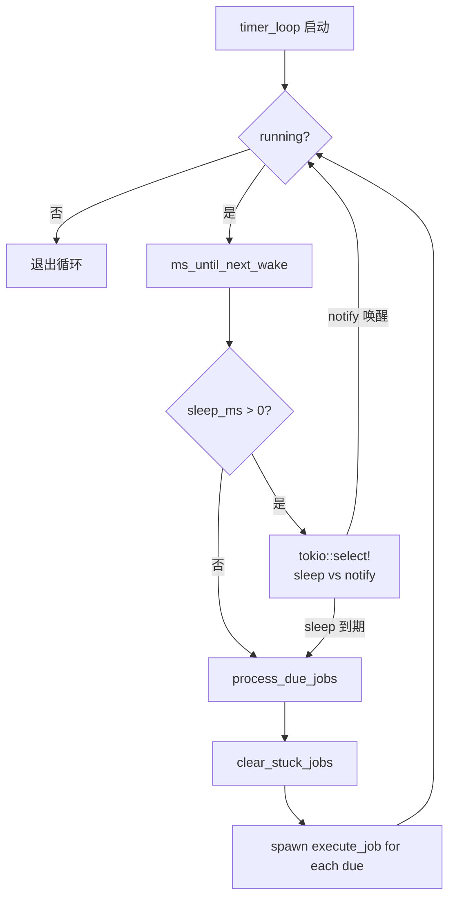
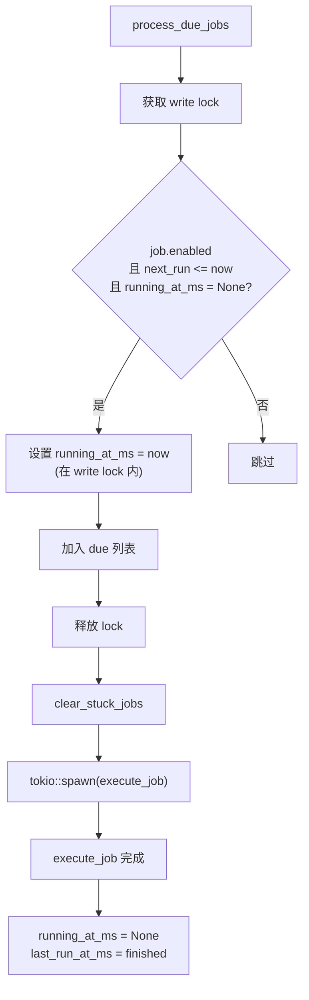
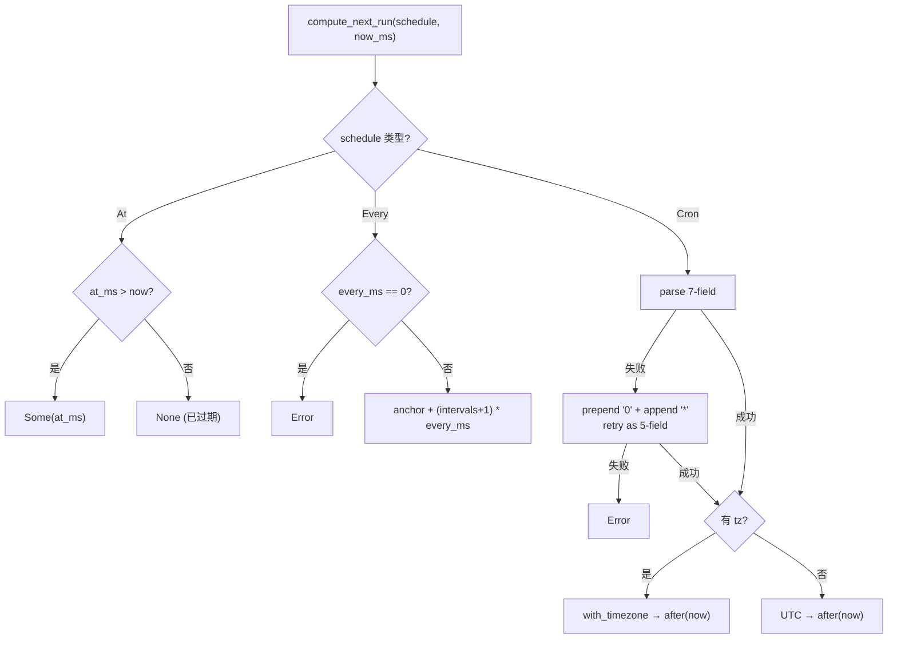

# PD-283.01 Moltis — Tokio 异步 Cron 调度与三后端存储隔离执行

> 文档编号：PD-283.01
> 来源：Moltis `crates/cron/src/service.rs`
> GitHub：https://github.com/moltis-org/moltis.git
> 问题域：PD-283 任务调度 Task Scheduling
> 状态：可复用方案

---

## 第 1 章 问题与动机

### 1.1 核心问题

Agent 系统需要在无人值守时自动执行周期性任务——定时检查收件箱、发送提醒、执行健康检查。这要求一个可靠的调度引擎，能够：

1. 支持多种调度模式（一次性、固定间隔、cron 表达式）
2. 在任务执行失败时不影响主会话
3. 持久化任务状态，进程重启后恢复调度
4. 防止用户或 Agent 创建过多任务导致资源耗尽
5. 将任务执行结果反馈回主会话上下文

传统 cron 守护进程（如 Linux crontab）无法满足 Agent 场景的需求：任务执行需要调用 LLM、结果需要注入会话上下文、任务需要沙箱隔离。Moltis 的 `moltis-cron` crate 从零构建了一个面向 Agent 的调度系统。

### 1.2 Moltis 的解法概述

1. **三种调度模式统一抽象** — `CronSchedule` 枚举统一 `At`（一次性）、`Every`（固定间隔+锚点）、`Cron`（标准 cron 表达式+时区），由 `compute_next_run()` 统一计算下次执行时间（`crates/cron/src/schedule.rs:13`）
2. **双 Payload 执行路径** — `SystemEvent` 注入主会话上下文（零成本），`AgentTurn` 启动隔离 agent 回调（含 model/timeout/sandbox 配置），通过 `SessionTarget` 三态（Main/Isolated/Named）控制执行隔离级别（`crates/cron/src/service.rs:540-568`）
3. **三后端存储抽象** — `CronStore` trait 定义 6 个异步方法，SQLite（生产）、File（轻量部署）、InMemory（测试）三种实现可互换（`crates/cron/src/store.rs:12-19`）
4. **滑动窗口限流** — `RateLimiter` 用 `VecDeque<u64>` 实现滑动窗口，默认 10 jobs/min，系统任务（heartbeat）豁免限流（`crates/cron/src/service.rs:67-101`）
5. **Heartbeat 健康检查** — 特殊 `__heartbeat__` 系统任务 + `SystemEventsQueue` 有界去重缓冲区 + `HEARTBEAT_OK` 哨兵令牌剥离，实现 Agent 自主健康巡检（`crates/cron/src/heartbeat.rs:15-21`）

### 1.3 设计思想

| 设计原则 | 具体实现 | 理由 | 替代方案 |
|----------|----------|------|----------|
| 调度与执行分离 | `CronService` 只负责调度，执行通过 `AgentTurnFn`/`SystemEventFn` 回调委托 | 调度引擎不依赖 LLM 实现细节，可独立测试 | 直接在调度器中调用 LLM SDK |
| 存储后端可插拔 | `CronStore` trait + 三种实现 | 测试用内存、开发用文件、生产用 SQLite | 硬编码单一存储 |
| 防御性并发控制 | `running_at_ms` 标记 + 写锁内设置 + 2h 卡死检测 | 防止同一 job 被 timer_loop 重复拾取 | 分布式锁（过重） |
| 有界事件缓冲 | `SystemEventsQueue` 最大 20 条 + 连续去重 | 防止事件风暴淹没 heartbeat prompt | 无界队列（OOM 风险） |
| 向后兼容序列化 | `#[serde(default)]` + `skip_serializing_if` | 新增字段（sandbox、wake_mode、tokens）不破坏旧数据 | 版本号迁移 |

---

## 第 2 章 源码实现分析

### 2.1 架构概览

Moltis cron 系统由 12 个模块组成，核心架构如下：

```
┌─────────────────────────────────────────────────────────────┐
│                      CronService                            │
│  ┌──────────┐  ┌──────────┐  ┌───────────┐  ┌───────────┐  │
│  │ timer_   │  │ RateLi-  │  │ SystemE-  │  │ Notify    │  │
│  │ loop()   │  │ miter    │  │ ventsQueue│  │ Callback  │  │
│  │ (tokio)  │  │ (sliding │  │ (bounded  │  │ (CRUD     │  │
│  │          │  │  window) │  │  dedup)   │  │  events)  │  │
│  └────┬─────┘  └──────────┘  └───────────┘  └───────────┘  │
│       │                                                      │
│  ┌────▼─────────────────────────────────────────────────┐   │
│  │              process_due_jobs()                        │   │
│  │  ┌─────────────┐        ┌──────────────────┐         │   │
│  │  │ SystemEvent │        │ AgentTurn        │         │   │
│  │  │ → callback  │        │ → callback       │         │   │
│  │  │ (sync)      │        │ (async, isolated) │         │   │
│  │  └─────────────┘        └──────────────────┘         │   │
│  └──────────────────────────────────────────────────────┘   │
│       │                                                      │
│  ┌────▼──────────────────────────────────────────┐          │
│  │           CronStore (trait)                    │          │
│  │  ┌──────────┐ ┌──────────┐ ┌──────────────┐  │          │
│  │  │ SQLite   │ │ File     │ │ InMemory     │  │          │
│  │  │ (sqlx)   │ │ (atomic  │ │ (HashMap)    │  │          │
│  │  │          │ │  write)  │ │              │  │          │
│  │  └──────────┘ └──────────┘ └──────────────┘  │          │
│  └───────────────────────────────────────────────┘          │
└─────────────────────────────────────────────────────────────┘
```

### 2.2 核心实现

#### 2.2.1 Timer Loop 与 Notify 唤醒

调度核心是一个 tokio 异步循环，通过 `tokio::select!` 实现精确睡眠与即时唤醒的双模式。



对应源码 `crates/cron/src/service.rs:462-487`：

```rust
async fn timer_loop(self: &Arc<Self>) {
    loop {
        if !*self.running.read().await {
            break;
        }
        let sleep_ms = self.ms_until_next_wake().await;
        if sleep_ms > 0 {
            let notify = Arc::clone(&self.wake_notify);
            tokio::select! {
                () = tokio::time::sleep(Duration::from_millis(sleep_ms)) => {},
                () = notify.notified() => {
                    debug!("timer loop woken by notify");
                    continue;
                },
            }
        }
        if !*self.running.read().await {
            break;
        }
        self.process_due_jobs().await;
    }
}
```

关键设计：`wake_notify` 是 `tokio::sync::Notify`，任何 CRUD 操作（add/update/remove）都会调用 `self.wake_notify.notify_one()` 立即唤醒 timer_loop 重新计算睡眠时间，避免新任务等到下一个 tick 才被发现。

#### 2.2.2 防重复执行与卡死检测



对应源码 `crates/cron/src/service.rs:500-529`：

```rust
async fn process_due_jobs(self: &Arc<Self>) {
    let now = now_ms();
    let due_jobs: Vec<CronJob> = {
        let mut jobs = self.jobs.write().await;
        let mut due = Vec::new();
        for job in jobs.iter_mut() {
            if job.enabled
                && job.state.next_run_at_ms.is_some_and(|t| t <= now)
                && job.state.running_at_ms.is_none()
            {
                // Mark as running under the write lock BEFORE spawning
                job.state.running_at_ms = Some(now);
                due.push(job.clone());
            }
        }
        due
    };
    self.clear_stuck_jobs(now).await;
    for job in due_jobs {
        let svc = Arc::clone(self);
        tokio::spawn(async move { svc.execute_job(&job_clone).await; });
    }
}
```

`clear_stuck_jobs` 在 `service.rs:684-698` 中实现，使用 `STUCK_THRESHOLD_MS = 2h` 常量，对超时任务重置 `running_at_ms` 并标记错误状态。`saturating_sub` 防止时钟回拨导致的溢出。

#### 2.2.3 Cron 表达式解析与 5-field 自动补全



对应源码 `crates/cron/src/schedule.rs:41-78`：

```rust
CronSchedule::Cron { expr, tz } => {
    let schedule: Schedule = expr
        .parse()
        .or_else(|_| {
            // The `cron` crate requires 7 fields (sec min hour dom month dow year).
            // Users typically provide 5 fields (min hour dom month dow).
            // Prepend "0" for seconds and append "*" for year.
            let padded = format!("0 {expr} *");
            padded.parse::<Schedule>()
        })
        .map_err(|source| Error::external(
            format!("invalid cron expression '{expr}': {source}"), source,
        ))?;
    let now_dt = DateTime::from_timestamp_millis(now_ms as i64)
        .unwrap_or_else(|| Utc.timestamp_millis_opt(0).unwrap());
    let next = if let Some(tz_name) = tz {
        let tz: chrono_tz::Tz = tz_name.parse()
            .map_err(|_| Error::unknown_timezone(tz_name.clone()))?;
        let now_local = now_dt.with_timezone(&tz);
        schedule.after(&now_local).next().map(|dt| dt.timestamp_millis() as u64)
    } else {
        schedule.after(&now_dt).next().map(|dt| dt.timestamp_millis() as u64)
    };
    Ok(next)
}
```

### 2.3 实现细节

**SQLite 存储的 JSON-in-column 模式**（`crates/cron/src/store_sqlite.rs:46-58`）：jobs 表只有 `id` 和 `data` 两列，`data` 存储完整 JSON。这种设计牺牲了 SQL 查询能力，换取了 schema 演进的极大灵活性——新增字段只需在 Rust struct 上加 `#[serde(default)]`，无需 ALTER TABLE。

**File 存储的原子写入**（`crates/cron/src/store_file.rs:45-59`）：写入 `.tmp` → 备份为 `.bak` → rename 覆盖。JSONL 格式存储 run history，每个 job 一个文件（`{job_id}.jsonl`），append-only 写入 + `sync_data()` 确保持久化。

**SystemEventsQueue 有界去重**（`crates/cron/src/system_events.rs:30-67`）：`MAX_EVENTS = 20`，连续相同 `text` 去重（`back().is_some_and(|last| last.text == text)`），超限时 `pop_front()` 丢弃最旧事件。heartbeat 通过 `drain()` 一次性消费所有事件，注入 prompt 前缀。

**Heartbeat 哨兵令牌**（`crates/cron/src/heartbeat.rs:66-112`）：LLM 返回 `HEARTBEAT_OK` 表示无事发生，`strip_heartbeat_token()` 处理 `**HEARTBEAT_OK**`、`<b>HEARTBEAT_OK</b>` 等格式变体。`StripMode::Trim` 模式下可从混合回复中剥离令牌，保留有价值内容。

**Metrics 条件编译**（`crates/cron/src/service.rs:19-20`）：`#[cfg(feature = "metrics")]` 门控所有 counter/gauge/histogram 调用，零成本抽象——不启用 metrics feature 时完全无开销。

---

## 第 3 章 迁移指南

### 3.1 迁移清单

**阶段 1：核心调度引擎（最小可用）**

- [ ] 定义 `Schedule` 枚举（At/Every/Cron 三种模式）
- [ ] 实现 `compute_next_run()` 函数，处理 5-field cron 自动补全
- [ ] 定义 `Job` 结构体（id, name, schedule, payload, state）
- [ ] 实现 `InMemoryStore`（用于开发测试）
- [ ] 实现 `Scheduler` 核心：timer_loop + process_due_jobs + execute_job
- [ ] 使用 `tokio::sync::Notify` 实现 CRUD 即时唤醒

**阶段 2：持久化与安全**

- [ ] 实现 `SqliteStore`（JSON-in-column 模式）
- [ ] 实现 `FileStore`（原子写入 + JSONL run history）
- [ ] 添加 `RateLimiter`（滑动窗口，VecDeque 实现）
- [ ] 添加 `running_at_ms` 防重复执行 + stuck job 检测
- [ ] 实现 `CronRunRecord` 执行历史记录

**阶段 3：Agent 集成**

- [ ] 实现 `SystemEventsQueue`（有界去重缓冲区）
- [ ] 实现 heartbeat 系统任务 + `HEARTBEAT_OK` 令牌剥离
- [ ] 添加 `SessionTarget`（Main/Isolated/Named）执行隔离
- [ ] 添加 `CronSandboxConfig` 沙箱配置
- [ ] 添加 `CronNotification` CRUD 事件回调

### 3.2 适配代码模板

以下是一个可直接运行的 Rust 调度引擎骨架，提取了 Moltis 的核心模式：

```rust
use std::{collections::VecDeque, sync::Arc, time::Duration};
use tokio::sync::{Mutex, Notify, RwLock};

/// 三种调度模式统一枚举
#[derive(Clone, Debug)]
pub enum Schedule {
    /// 一次性：在指定时间执行
    At { at_ms: u64 },
    /// 固定间隔：每 N 毫秒执行，可选锚点
    Every { every_ms: u64, anchor_ms: Option<u64> },
    /// Cron 表达式（5-field 自动补全为 7-field）
    Cron { expr: String, tz: Option<String> },
}

/// 滑动窗口限流器
pub struct RateLimiter {
    timestamps: VecDeque<u64>,
    max_per_window: usize,
    window_ms: u64,
}

impl RateLimiter {
    pub fn new(max_per_window: usize, window_ms: u64) -> Self {
        Self { timestamps: VecDeque::new(), max_per_window, window_ms }
    }

    pub fn check(&mut self, now_ms: u64) -> bool {
        let cutoff = now_ms.saturating_sub(self.window_ms);
        while self.timestamps.front().is_some_and(|&ts| ts < cutoff) {
            self.timestamps.pop_front();
        }
        if self.timestamps.len() >= self.max_per_window {
            return false;
        }
        self.timestamps.push_back(now_ms);
        true
    }
}

/// 调度器核心：timer_loop + Notify 唤醒
pub struct Scheduler {
    running: RwLock<bool>,
    wake_notify: Arc<Notify>,
    // ... jobs, store, callbacks
}

impl Scheduler {
    /// 核心循环：精确睡眠 + 即时唤醒
    async fn timer_loop(self: &Arc<Self>) {
        loop {
            if !*self.running.read().await { break; }
            let sleep_ms = self.ms_until_next_wake().await;
            if sleep_ms > 0 {
                let notify = Arc::clone(&self.wake_notify);
                tokio::select! {
                    _ = tokio::time::sleep(Duration::from_millis(sleep_ms)) => {},
                    _ = notify.notified() => continue,
                }
            }
            self.process_due_jobs().await;
        }
    }

    async fn ms_until_next_wake(&self) -> u64 {
        // 遍历 enabled jobs，取最近的 next_run_at_ms
        60_000 // fallback: poll every 60s
    }

    async fn process_due_jobs(self: &Arc<Self>) {
        // 1. 在 write lock 内标记 running_at_ms（防重复）
        // 2. tokio::spawn 执行每个 due job
        // 3. 执行完成后重置 running_at_ms，计算 next_run
    }
}
```

### 3.3 适用场景

| 场景 | 适用度 | 说明 |
|------|--------|------|
| Agent 定时任务（检查邮件、发提醒） | ⭐⭐⭐ | 核心设计目标，SystemEvent + AgentTurn 双路径完美匹配 |
| 单进程 cron 替代 | ⭐⭐⭐ | 三后端存储 + 滑动窗口限流，比 Linux crontab 更灵活 |
| 分布式任务调度 | ⭐ | 单进程设计，无分布式锁，不适合多实例部署 |
| 高频任务（<1s 间隔） | ⭐⭐ | timer_loop 精度受 tokio 调度影响，适合秒级以上 |
| 需要任务依赖 DAG | ⭐ | 无 DAG 支持，每个 job 独立执行 |

---

## 第 4 章 测试用例

基于 Moltis 真实测试模式（`crates/cron/src/service.rs:742-1591`），提取可复用的测试骨架：

```rust
#[cfg(test)]
mod tests {
    use std::sync::{Arc, atomic::{AtomicUsize, Ordering}};
    use tokio::time::Duration;

    // ── 测试辅助：计数回调 ──────────────────────────────────

    fn counting_callback(counter: Arc<AtomicUsize>) -> impl Fn(String) {
        move |_text| { counter.fetch_add(1, Ordering::SeqCst); }
    }

    // ── 正常路径：CRUD + 调度执行 ─────────────────────────

    #[tokio::test]
    async fn test_add_and_list_jobs() {
        let store = InMemoryStore::new();
        let svc = CronService::new(Arc::new(store), noop_event(), noop_agent());
        let job = svc.add(CronJobCreate {
            name: "test".into(),
            schedule: CronSchedule::Every { every_ms: 60_000, anchor_ms: None },
            // ...
        }).await.unwrap();
        let jobs = svc.list().await;
        assert_eq!(jobs.len(), 1);
        assert!(jobs[0].state.next_run_at_ms.is_some());
    }

    #[tokio::test]
    async fn test_timer_loop_executes_due_jobs() {
        let counter = Arc::new(AtomicUsize::new(0));
        let svc = make_svc_with_counting(counter.clone());
        svc.add(CronJobCreate {
            schedule: CronSchedule::Every { every_ms: 25, anchor_ms: None },
            // ...
        }).await.unwrap();
        svc.start().await.unwrap();
        // 等待至少一次执行
        tokio::time::timeout(Duration::from_secs(2), async {
            while counter.load(Ordering::SeqCst) == 0 {
                tokio::time::sleep(Duration::from_millis(20)).await;
            }
        }).await.expect("scheduler did not execute due jobs");
        svc.stop().await;
    }

    // ── 边界情况 ────────────────────────────────────────────

    #[tokio::test]
    async fn test_rate_limiting_blocks_excess_jobs() {
        let svc = CronService::with_config(
            store, noop_event(), noop_agent(), None,
            RateLimitConfig { max_per_window: 3, window_ms: 60_000 },
        );
        for _ in 0..3 { svc.add(create_job()).await.unwrap(); }
        let err = svc.add(create_job()).await;
        assert!(err.unwrap_err().to_string().contains("rate limit exceeded"));
    }

    #[tokio::test]
    async fn test_system_jobs_bypass_rate_limit() {
        let svc = CronService::with_config(
            store, noop_event(), noop_agent(), None,
            RateLimitConfig { max_per_window: 1, window_ms: 60_000 },
        );
        // system: true 的任务不受限流
        svc.add(CronJobCreate { system: true, .. }).await.unwrap();
        svc.add(CronJobCreate { system: true, .. }).await.unwrap();
        assert_eq!(svc.list().await.len(), 2);
    }

    // ── 降级行为 ────────────────────────────────────────────

    #[tokio::test]
    async fn test_one_shot_job_disabled_after_run() {
        let svc = make_svc();
        let job = svc.add(CronJobCreate {
            schedule: CronSchedule::At { at_ms: 1000 }, // 已过期
            // ...
        }).await.unwrap();
        svc.run(&job.id, true).await.unwrap();
        tokio::time::sleep(Duration::from_millis(100)).await;
        let jobs = svc.list().await;
        assert!(!jobs.iter().find(|j| j.id == job.id).unwrap().enabled);
    }

    #[tokio::test]
    async fn test_session_target_validation() {
        // Main + AgentTurn → 应该报错
        let err = svc.add(CronJobCreate {
            session_target: SessionTarget::Main,
            payload: CronPayload::AgentTurn { .. },
            // ...
        }).await;
        assert!(err.is_err());
    }
}
```

---

## 第 5 章 跨域关联

| 关联域 | 关系类型 | 说明 |
|--------|----------|------|
| PD-03 容错与重试 | 协同 | `clear_stuck_jobs()` 2h 超时检测 + `saturating_sub` 防溢出是容错设计；`RateLimiter` 防止任务爆炸也是防御性容错 |
| PD-05 沙箱隔离 | 依赖 | `CronSandboxConfig` 控制 AgentTurn 是否在沙箱中执行，`SessionTarget::Isolated` 确保任务不污染主会话 |
| PD-06 记忆持久化 | 协同 | `CronStore` 三后端存储与记忆持久化共享设计模式（trait 抽象 + 多后端）；SQLite JSON-in-column 模式可复用 |
| PD-09 Human-in-the-Loop | 协同 | `CronWakeMode::Now` 允许 cron 任务完成后立即唤醒 heartbeat，heartbeat 可将结果呈现给用户决策 |
| PD-10 中间件管道 | 协同 | `SystemEventsQueue` 是一个简化的事件管道，heartbeat 的 `build_event_enriched_prompt()` 将事件注入 prompt 前缀 |
| PD-11 可观测性 | 依赖 | `#[cfg(feature = "metrics")]` 条件编译的 counter/gauge/histogram 提供执行次数、耗时、token 用量、卡死任务等指标 |

---

## 第 6 章 来源文件索引

| 文件 | 行范围 | 关键实现 |
|------|--------|----------|
| `crates/cron/src/service.rs` | L1-L738 | CronService 核心：timer_loop、process_due_jobs、execute_job、RateLimiter、validate_job_spec |
| `crates/cron/src/service.rs` | L742-L1591 | 完整测试套件（20+ 测试用例） |
| `crates/cron/src/schedule.rs` | L1-L187 | compute_next_run()：At/Every/Cron 三种调度模式计算 |
| `crates/cron/src/types.rs` | L1-L534 | 全部数据类型：CronSchedule、CronPayload、SessionTarget、CronJob、CronRunRecord、CronSandboxConfig、CronWakeMode |
| `crates/cron/src/store.rs` | L1-L19 | CronStore trait 定义（6 个异步方法） |
| `crates/cron/src/store_sqlite.rs` | L1-L271 | SQLite 存储：JSON-in-column、UPSERT、run history 查询 |
| `crates/cron/src/store_file.rs` | L1-L291 | File 存储：原子写入（tmp→bak→rename）、JSONL run history |
| `crates/cron/src/store_memory.rs` | L1-L175 | InMemory 存储：HashMap 实现，用于测试 |
| `crates/cron/src/system_events.rs` | L1-L163 | SystemEventsQueue：有界去重事件缓冲区（MAX_EVENTS=20） |
| `crates/cron/src/heartbeat.rs` | L1-L479 | Heartbeat 逻辑：HEARTBEAT_OK 令牌剥离、active hours 检查、prompt 解析、事件富化 |
| `crates/cron/src/parse.rs` | L1-L114 | 解析工具：duration（30s/5m/2h/1d）、ISO 8601 时间戳 |
| `crates/cron/src/lib.rs` | L1-L29 | Crate 入口：模块声明 + SQLite migration |

---

## 第 7 章 横向对比维度

```json comparison_data
{
  "project": "Moltis",
  "dimensions": {
    "调度模式": "At/Every/Cron 三枚举 + 5-field 自动补全 + chrono_tz 时区",
    "存储后端": "CronStore trait + SQLite(JSON-in-column)/File(atomic)/InMemory 三实现",
    "限流机制": "VecDeque 滑动窗口 10 jobs/min，system 任务豁免",
    "执行隔离": "SessionTarget 三态(Main/Isolated/Named) + CronSandboxConfig",
    "健康检查": "__heartbeat__ 系统任务 + HEARTBEAT_OK 哨兵令牌 + active hours",
    "防重复执行": "running_at_ms 写锁内标记 + 2h STUCK_THRESHOLD 卡死检测",
    "事件通知": "SystemEventsQueue 有界去重(MAX=20) + CronNotification CRUD 回调"
  }
}
```

### 域元数据补充

```json domain_metadata
{
  "solution_summary": "Moltis 用 tokio::select! 精确睡眠 + Notify 即时唤醒实现 timer_loop，CronStore trait 抽象三后端存储，running_at_ms 写锁防重复 + 2h 卡死检测，SystemEventsQueue 有界去重缓冲桥接 cron 与 heartbeat",
  "description": "面向 Agent 的异步调度引擎，需要处理 LLM 回调隔离与会话上下文注入",
  "sub_problems": [
    "session_target 与 payload 类型的兼容性校验",
    "cron 表达式 5-field/7-field 自动适配",
    "一次性任务执行后的自动禁用/删除",
    "HEARTBEAT_OK 哨兵令牌的多格式变体剥离"
  ],
  "best_practices": [
    "write lock 内标记 running_at_ms 再 spawn，防止 timer tick 重复拾取",
    "JSON-in-column 存储模式配合 serde(default) 实现零迁移 schema 演进",
    "tokio::select! 睡眠 + Notify 唤醒实现 CRUD 操作的即时响应",
    "条件编译 metrics feature 实现零成本可观测性"
  ]
}
```
