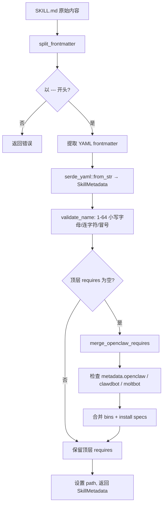
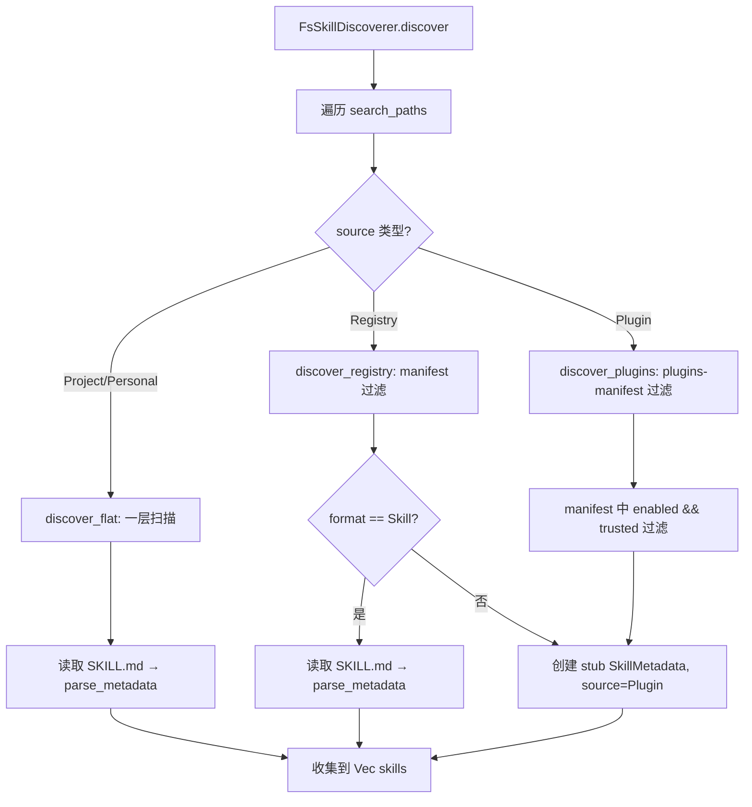
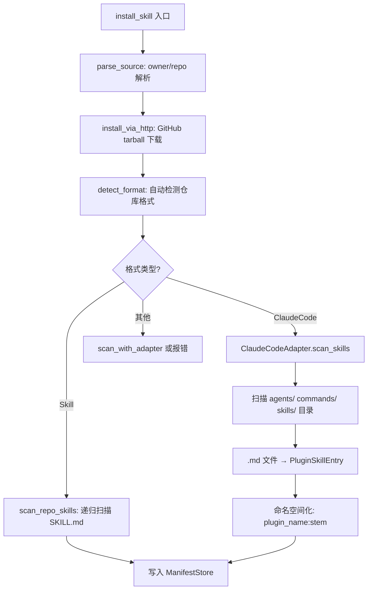

# PD-284.01 Moltis — Rust 多源技能发现与多格式适配安装系统

> 文档编号：PD-284.01
> 来源：Moltis `crates/skills/`
> GitHub：https://github.com/moltis-org/moltis.git
> 问题域：PD-284 技能系统 Skill System
> 状态：可复用方案

---

## 第 1 章 问题与动机（≥ 30 行）

### 1.1 核心问题

Agent 系统需要一种可扩展的能力注入机制——"技能"。核心挑战包括：

1. **格式碎片化**：不同 AI 编码工具（Claude Code、Codex、原生 SKILL.md）使用不同的插件/技能布局，需要统一抽象
2. **多源发现**：技能可能来自项目本地、用户个人目录、远程注册表、第三方插件，需要按优先级扫描并合并
3. **安全安装**：从 GitHub 下载 tarball 时需防范路径穿越、符号链接攻击等安全风险
4. **依赖声明与校验**：技能可能依赖外部二进制（如 `brew`、`npm`、`cargo` 安装的工具），需要声明式依赖 + 运行时校验 + 自动安装
5. **信任门控**：远程安装的技能默认不可信，需要显式信任后才能激活
6. **热更新感知**：技能文件变更后需要实时通知 agent 重新加载

### 1.2 Moltis 的解法概述

Moltis 的 `moltis-skills` crate 用 Rust 实现了完整的技能生命周期管理：

1. **SKILL.md 声明式格式** — YAML frontmatter + Markdown body，解析为 `SkillMetadata` + `SkillContent` 二元结构（`crates/skills/src/parse.rs:26-62`）
2. **四源优先级发现** — `FsSkillDiscoverer` 按 Project → Personal → Registry → Plugin 顺序扫描，每种源有独立的过滤逻辑（`crates/skills/src/discover.rs:33-42`）
3. **多格式适配器** — `FormatAdapter` trait + `detect_format()` 自动检测仓库格式（SKILL.md / Claude Code / Codex / Generic），用适配器归一化为统一元数据（`crates/skills/src/formats.rs:63-69`）
4. **安全 HTTP 安装** — GitHub tarball 下载 + 路径消毒 + 符号链接拒绝 + 目录逃逸检测（`crates/skills/src/install.rs:136-207`）
5. **原子清单持久化** — `ManifestStore` 通过 tmp + rename 原子写入 JSON 清单，记录每个 repo 的 skills 启用/信任状态（`crates/skills/src/manifest.rs:31-39`）

### 1.3 设计思想

| 设计原则 | 具体实现 | 理由 | 替代方案 |
|----------|----------|------|----------|
| 声明式格式 | YAML frontmatter + Markdown body | 降低技能开发门槛，人类可读 | JSON Schema（不够直观） |
| Trait 抽象 | `SkillDiscoverer` / `SkillRegistry` / `FormatAdapter` 三个 trait | 可测试、可替换、可扩展 | 具体类直接实现（不可测试） |
| 四源优先级 | Project > Personal > Registry > Plugin | 本地覆盖远程，项目覆盖个人 | 单一目录（不够灵活） |
| 信任门控 | `trusted + enabled` 双布尔字段 | 安装≠信任≠启用，三态分离 | 单一 enabled 字段（安全不足） |
| 原子写入 | tmp file + rename | 防止写入中断导致清单损坏 | 直接覆写（有损坏风险） |
| 路径消毒 | `sanitize_archive_path` + canonical 检查 | 防止 tarball 路径穿越攻击 | 信任上游（不安全） |

---

## 第 2 章 源码实现分析（核心章节）

### 2.1 架构概览

```
┌─────────────────────────────────────────────────────────────────┐
│                        moltis-skills crate                       │
├─────────────────────────────────────────────────────────────────┤
│                                                                   │
│  ┌──────────┐   ┌──────────────┐   ┌──────────────┐             │
│  │  parse.rs │   │ discover.rs  │   │  install.rs  │             │
│  │ SKILL.md  │   │ FsDiscoverer │   │ HTTP tarball │             │
│  │ 解析器    │   │ 四源扫描     │   │ 安全下载     │             │
│  └─────┬────┘   └──────┬───────┘   └──────┬───────┘             │
│        │               │                   │                     │
│        ▼               ▼                   ▼                     │
│  ┌──────────┐   ┌──────────────┐   ┌──────────────┐             │
│  │ types.rs │   │ registry.rs  │   │ manifest.rs  │             │
│  │ 数据模型  │◄──│ InMemory     │──►│ 原子 JSON    │             │
│  │          │   │ Registry     │   │ 持久化       │             │
│  └──────────┘   └──────────────┘   └──────────────┘             │
│        │                                                         │
│        ▼                                                         │
│  ┌──────────────┐   ┌──────────────┐   ┌──────────────┐         │
│  │ formats.rs   │   │prompt_gen.rs │   │requirements.rs│         │
│  │ 多格式适配器  │   │ XML prompt   │   │ 依赖校验     │         │
│  │ ClaudeCode   │   │ 注入生成     │   │ 自动安装     │         │
│  └──────────────┘   └──────────────┘   └──────────────┘         │
│                                                                   │
│  ┌──────────────┐   ┌──────────────┐                             │
│  │ watcher.rs   │   │ migration.rs │                             │
│  │ FS 事件监听  │   │ 插件→技能    │                             │
│  │ 500ms 防抖   │   │ 幂等迁移     │                             │
│  └──────────────┘   └──────────────┘                             │
└─────────────────────────────────────────────────────────────────┘
```

### 2.2 核心实现

#### 2.2.1 SKILL.md 解析与 OpenClaw 兼容



对应源码 `crates/skills/src/parse.rs:26-41`：

```rust
pub fn parse_metadata(content: &str, skill_dir: &Path) -> anyhow::Result<SkillMetadata> {
    let (frontmatter, _body) = split_frontmatter(content)?;
    let mut meta: SkillMetadata =
        serde_yaml::from_str(&frontmatter).context("invalid SKILL.md frontmatter")?;

    if !validate_name(&meta.name) {
        bail!(
            "invalid skill name '{}': must be 1-64 lowercase alphanumeric/hyphen chars",
            meta.name
        );
    }

    merge_openclaw_requires(&frontmatter, &mut meta);
    meta.path = skill_dir.to_path_buf();
    Ok(meta)
}
```

关键设计：`merge_openclaw_requires` 支持三个命名空间（`openclaw` / `clawdbot` / `moltbot`），实现了对 OpenClaw Store 生态的向后兼容（`crates/skills/src/parse.rs:127-192`）。`InstallKind` 枚举覆盖 Brew/Npm/Go/Cargo/Uv/Download 六种安装方式，`pkg` 字段根据 kind 自动映射到 `package` 或 `module`。

#### 2.2.2 四源优先级发现



对应源码 `crates/skills/src/discover.rs:33-42`（默认搜索路径）：

```rust
pub fn default_paths() -> Vec<(PathBuf, SkillSource)> {
    let workspace_root = moltis_config::data_dir();
    let data = workspace_root.clone();
    vec![
        (workspace_root.join(".moltis/skills"), SkillSource::Project),
        (data.join("skills"), SkillSource::Personal),
        (data.join("installed-skills"), SkillSource::Registry),
        (data.join("installed-plugins"), SkillSource::Plugin),
    ]
}
```

Registry 和 Plugin 源的关键区别：它们通过 `ManifestStore` 加载清单，只发现 `enabled && trusted` 的技能（`crates/skills/src/discover.rs:131-133`）。这实现了安装后默认不激活的安全策略。


#### 2.2.3 多格式适配器与 Claude Code 插件支持



对应源码 `crates/skills/src/formats.rs:369-426`（ClaudeCodeAdapter 核心扫描逻辑）：

```rust
impl FormatAdapter for ClaudeCodeAdapter {
    fn detect(&self, repo_dir: &Path) -> bool {
        repo_dir.join(".claude-plugin/plugin.json").is_file()
            || repo_dir.join(".claude-plugin/marketplace.json").is_file()
    }

    fn scan_skills(&self, repo_dir: &Path) -> anyhow::Result<Vec<PluginSkillEntry>> {
        if repo_dir.join(".claude-plugin/plugin.json").is_file() {
            return self.scan_single_plugin(repo_dir, repo_dir);
        }
        // Marketplace repo: scan plugins/ and external_plugins/ subdirs
        let mut seen_names = HashSet::new();
        let mut results = if repo_dir.join(".claude-plugin/marketplace.json").is_file() {
            self.scan_marketplace_manifest(repo_dir, &mut seen_names)?
        } else {
            Vec::new()
        };
        for container in &["plugins", "external_plugins"] {
            // ... scan sub-plugins with dedup
        }
        Ok(results)
    }
}
```

`ClaudeCodeAdapter` 支持两种 Claude Code 仓库布局：单插件（`plugin.json` 在根目录）和 marketplace 仓库（`marketplace.json` + `plugins/` + `external_plugins/` 子目录）。每个 `.md` 文件被命名空间化为 `plugin_name:stem` 格式（如 `pr-review-toolkit:code-reviewer`），避免跨插件名称冲突。

#### 2.2.4 安全安装与路径消毒

安装流程的安全设计集中在 `install_via_http`（`crates/skills/src/install.rs:136-207`）：

1. **符号链接拒绝**：tarball 中的 symlink/hardlink 条目直接跳过（L166-169）
2. **路径消毒**：`sanitize_archive_path` 拒绝 `..`、绝对路径、前缀路径（L234-251）
3. **目录逃逸检测**：解压后用 `canonicalize` 验证目标路径仍在安装目录内（L181-183）
4. **符号链接目标检测**：解压前检查目标路径是否已是符号链接（L187-192）

### 2.3 实现细节

**Prompt 注入生成**（`crates/skills/src/prompt_gen.rs:4-36`）：`generate_skills_prompt` 将所有已发现技能生成 `<available_skills>` XML 块，注入 agent 系统提示。Plugin 源的技能直接使用目录路径（不追加 `/SKILL.md`），而 Skill 源的技能追加 `/SKILL.md`。

**文件系统监听**（`crates/skills/src/watcher.rs:29-86`）：基于 `notify-debouncer-full` 的 500ms 防抖监听，只关注 `SKILL.md` 文件的 Create/Modify/Remove 事件，通过 `mpsc::UnboundedReceiver<SkillWatchEvent>` 通知上层重新发现。

**插件→技能迁移**（`crates/skills/src/migration.rs:20-84`）：幂等迁移逻辑，将旧的 `plugins-manifest.json` + `installed-plugins/` 合并到统一的 `skills-manifest.json` + `installed-skills/`，支持跨文件系统 rename 失败时的 copy + remove 降级。

**依赖校验与自动安装**（`crates/skills/src/requirements.rs:104-146`）：`check_requirements` 检查 `bins`（全部必须存在）和 `any_bins`（至少一个存在），返回 `SkillEligibility` 包含缺失列表和按当前 OS 过滤的安装选项。`run_install` 异步执行安装命令，npm 安装强制 `--ignore-scripts` 防止供应链攻击。

---

## 第 3 章 迁移指南

### 3.1 迁移清单

**阶段 1：核心数据模型**
- [ ] 定义 `SkillMetadata` 结构体（name, description, allowed_tools, requires, path, source）
- [ ] 定义 `SkillSource` 枚举（Project / Personal / Registry / Plugin）
- [ ] 定义 `SkillRequirements`（bins, any_bins, install specs）
- [ ] 实现 SKILL.md 解析器（YAML frontmatter + Markdown body 分割）

**阶段 2：发现与注册**
- [ ] 实现 `SkillDiscoverer` trait 和 `FsSkillDiscoverer`
- [ ] 配置四源搜索路径（项目 → 个人 → 注册表 → 插件）
- [ ] 实现 `InMemoryRegistry`（HashMap 存储 + 按需加载 body）
- [ ] 实现 `ManifestStore`（原子 JSON 持久化）

**阶段 3：安装与安全**
- [ ] 实现 GitHub tarball HTTP 下载
- [ ] 实现路径消毒（拒绝 `..`、symlink、目录逃逸）
- [ ] 实现 `trusted + enabled` 双布尔信任门控
- [ ] 实现依赖校验（`check_bin` + OS 过滤）

**阶段 4：扩展**
- [ ] 实现 `FormatAdapter` trait 和 Claude Code 适配器
- [ ] 实现文件系统监听（防抖 + SKILL.md 过滤）
- [ ] 实现 prompt 注入生成（`<available_skills>` XML）

### 3.2 适配代码模板

以下 Rust 模板可直接复用，实现最小可用的技能发现系统：

```rust
use std::{collections::HashMap, path::{Path, PathBuf}};
use serde::{Deserialize, Serialize};

// ── 数据模型 ──

#[derive(Debug, Clone, Serialize, Deserialize)]
pub struct SkillMetadata {
    pub name: String,
    #[serde(default)]
    pub description: String,
    #[serde(default, alias = "allowed-tools")]
    pub allowed_tools: Vec<String>,
    #[serde(default)]
    pub requires: SkillRequirements,
    #[serde(skip)]
    pub path: PathBuf,
    #[serde(skip)]
    pub source: Option<SkillSource>,
}

#[derive(Debug, Clone, PartialEq, Eq)]
pub enum SkillSource { Project, Personal, Registry }

#[derive(Debug, Clone, Default, Serialize, Deserialize)]
pub struct SkillRequirements {
    #[serde(default)]
    pub bins: Vec<String>,
}

// ── 解析器 ──

pub fn parse_skill_md(content: &str, dir: &Path) -> anyhow::Result<SkillMetadata> {
    let trimmed = content.trim_start();
    anyhow::ensure!(trimmed.starts_with("---"), "missing frontmatter");
    let after = &trimmed[3..];
    let close = after.find("\n---").context("missing closing ---")?;
    let frontmatter = &after[..close];
    let mut meta: SkillMetadata = serde_yaml::from_str(frontmatter)?;
    meta.path = dir.to_path_buf();
    Ok(meta)
}

// ── 发现器 ──

pub fn discover_skills(search_paths: &[(PathBuf, SkillSource)]) -> Vec<SkillMetadata> {
    let mut skills = Vec::new();
    for (base, source) in search_paths {
        if !base.is_dir() { continue; }
        for entry in std::fs::read_dir(base).into_iter().flatten().flatten() {
            let dir = entry.path();
            if !dir.is_dir() { continue; }
            let skill_md = dir.join("SKILL.md");
            if let Ok(content) = std::fs::read_to_string(&skill_md) {
                if let Ok(mut meta) = parse_skill_md(&content, &dir) {
                    meta.source = Some(source.clone());
                    skills.push(meta);
                }
            }
        }
    }
    skills
}

// ── Prompt 注入 ──

pub fn generate_prompt(skills: &[SkillMetadata]) -> String {
    if skills.is_empty() { return String::new(); }
    let mut out = String::from("<available_skills>\n");
    for s in skills {
        out.push_str(&format!(
            "<skill name=\"{}\" path=\"{}\">{}</skill>\n",
            s.name, s.path.join("SKILL.md").display(), s.description
        ));
    }
    out.push_str("</available_skills>\n");
    out
}
```

### 3.3 适用场景

| 场景 | 适用度 | 说明 |
|------|--------|------|
| CLI Agent 工具（类 Claude Code） | ⭐⭐⭐ | 完美匹配：本地文件发现 + 远程安装 + prompt 注入 |
| IDE 插件系统 | ⭐⭐⭐ | 四源优先级 + 文件监听 + 信任门控 |
| SaaS Agent 平台 | ⭐⭐ | 需要替换文件系统发现为数据库查询 |
| 嵌入式/IoT Agent | ⭐ | 依赖文件系统和网络，不适合资源受限环境 |

---

## 第 4 章 测试用例

基于 Moltis 真实测试模式，以下测试覆盖核心路径：

```rust
#[cfg(test)]
mod tests {
    use super::*;
    use tempfile::tempdir;

    // ── 解析测试 ──

    #[test]
    fn test_parse_valid_skill_md() {
        let content = "---\nname: my-skill\ndescription: A test\n---\n# Body\n";
        let meta = parse_skill_md(content, Path::new("/tmp/my-skill")).unwrap();
        assert_eq!(meta.name, "my-skill");
        assert_eq!(meta.description, "A test");
    }

    #[test]
    fn test_parse_missing_frontmatter_fails() {
        let content = "# No frontmatter";
        assert!(parse_skill_md(content, Path::new("/tmp")).is_err());
    }

    // ── 发现测试 ──

    #[test]
    fn test_discover_finds_skills_in_dir() {
        let tmp = tempdir().unwrap();
        let skill_dir = tmp.path().join("skills/demo");
        std::fs::create_dir_all(&skill_dir).unwrap();
        std::fs::write(
            skill_dir.join("SKILL.md"),
            "---\nname: demo\ndescription: test\n---\nbody\n",
        ).unwrap();

        let paths = vec![(tmp.path().join("skills"), SkillSource::Project)];
        let skills = discover_skills(&paths);
        assert_eq!(skills.len(), 1);
        assert_eq!(skills[0].name, "demo");
        assert_eq!(skills[0].source, Some(SkillSource::Project));
    }

    #[test]
    fn test_discover_skips_missing_dirs() {
        let paths = vec![(PathBuf::from("/nonexistent"), SkillSource::Personal)];
        let skills = discover_skills(&paths);
        assert!(skills.is_empty());
    }

    #[test]
    fn test_discover_skips_dirs_without_skill_md() {
        let tmp = tempdir().unwrap();
        let dir = tmp.path().join("skills/no-skill");
        std::fs::create_dir_all(&dir).unwrap();
        std::fs::write(dir.join("README.md"), "not a skill").unwrap();

        let paths = vec![(tmp.path().join("skills"), SkillSource::Project)];
        let skills = discover_skills(&paths);
        assert!(skills.is_empty());
    }

    // ── Prompt 注入测试 ──

    #[test]
    fn test_empty_skills_empty_prompt() {
        assert_eq!(generate_prompt(&[]), "");
    }

    #[test]
    fn test_prompt_contains_skill_info() {
        let skills = vec![SkillMetadata {
            name: "commit".into(),
            description: "Git commits".into(),
            allowed_tools: vec![],
            requires: Default::default(),
            path: PathBuf::from("/skills/commit"),
            source: None,
        }];
        let prompt = generate_prompt(&skills);
        assert!(prompt.contains("name=\"commit\""));
        assert!(prompt.contains("Git commits"));
    }
}
```


---

## 第 5 章 跨域关联

| 关联域 | 关系类型 | 说明 |
|--------|----------|------|
| PD-04 工具系统 | 协同 | 技能系统是工具系统的上层抽象——技能声明 `allowed_tools` 约束可用工具集 |
| PD-10 中间件管道 | 协同 | `prompt_gen` 生成的 XML 块通过中间件管道注入 agent 系统提示 |
| PD-05 沙箱隔离 | 协同 | `dockerfile` 字段支持技能声明自定义沙箱环境 |
| PD-03 容错与重试 | 依赖 | `requirements.rs` 的 `run_install` 依赖外部命令执行，需要容错处理 |
| PD-06 记忆持久化 | 协同 | `ManifestStore` 的原子 JSON 写入模式可复用于记忆持久化 |
| PD-11 可观测性 | 协同 | 全模块使用 `tracing` 结构化日志，技能发现/安装/加载全链路可追踪 |

---

## 第 6 章 来源文件索引

| 文件 | 行范围 | 关键实现 |
|------|--------|----------|
| `crates/skills/src/types.rs` | L1-L225 | 核心数据模型：SkillMetadata, SkillSource, SkillRequirements, InstallSpec, SkillsManifest |
| `crates/skills/src/parse.rs` | L26-L240 | SKILL.md 解析器 + OpenClaw 兼容层 + 名称校验 |
| `crates/skills/src/discover.rs` | L12-L228 | FsSkillDiscoverer 四源发现 + manifest 过滤 |
| `crates/skills/src/registry.rs` | L12-L113 | SkillRegistry trait + InMemoryRegistry HashMap 实现 |
| `crates/skills/src/install.rs` | L18-L357 | HTTP tarball 安装 + 路径消毒 + 多格式扫描 + source 解析 |
| `crates/skills/src/formats.rs` | L17-L483 | PluginFormat 枚举 + FormatAdapter trait + ClaudeCodeAdapter |
| `crates/skills/src/manifest.rs` | L1-L45 | ManifestStore 原子 JSON 持久化 |
| `crates/skills/src/prompt_gen.rs` | L1-L36 | `<available_skills>` XML prompt 生成 |
| `crates/skills/src/requirements.rs` | L1-L172 | 依赖校验 + OS 过滤 + 自动安装执行 |
| `crates/skills/src/watcher.rs` | L1-L87 | notify-debouncer-full 文件监听 + 500ms 防抖 |
| `crates/skills/src/migration.rs` | L1-L111 | 插件→技能幂等迁移 + 跨 FS rename 降级 |
| `crates/skills/Cargo.toml` | L1-L33 | 依赖声明：serde_yaml, reqwest, flate2, tar, notify |

---

## 第 7 章 横向对比维度

```json comparison_data
{
  "project": "Moltis",
  "dimensions": {
    "技能格式": "YAML frontmatter + Markdown body (SKILL.md)，兼容 OpenClaw 三命名空间",
    "发现机制": "四源优先级文件系统扫描 (Project > Personal > Registry > Plugin)",
    "注册管理": "InMemoryRegistry HashMap + ManifestStore 原子 JSON 持久化",
    "安装方式": "GitHub tarball HTTP 下载 + 路径消毒 + 符号链接拒绝",
    "多格式适配": "FormatAdapter trait 支持 SKILL.md / Claude Code / Codex / Generic 四格式",
    "信任模型": "trusted + enabled 双布尔三态门控，安装默认不信任不启用",
    "依赖声明": "bins/anyBins/install 三层声明 + 六种包管理器自动安装",
    "热更新": "notify-debouncer-full 500ms 防抖 + mpsc 事件通道",
    "Prompt注入": "XML <available_skills> 块注入 agent 系统提示"
  }
}
```

### 域元数据补充

```json domain_metadata
{
  "solution_summary": "Moltis 用 Rust 实现四源优先级文件系统发现 + FormatAdapter trait 多格式适配（SKILL.md/Claude Code/Codex）+ GitHub tarball 安全安装 + trusted/enabled 双布尔信任门控的完整技能生命周期管理",
  "description": "技能系统需要处理多格式兼容、安全安装、信任门控和热更新等生命周期问题",
  "sub_problems": [
    "多格式仓库适配（Claude Code plugin.json / marketplace.json）",
    "安装时路径穿越与符号链接安全防护",
    "插件系统向技能系统的幂等迁移",
    "文件系统变更实时监听与防抖通知"
  ],
  "best_practices": [
    "trusted + enabled 双布尔三态门控确保安装≠信任≠启用",
    "原子 tmp+rename 写入防止清单损坏",
    "tarball 路径消毒 + canonical 检查防止目录逃逸",
    "npm install 强制 --ignore-scripts 防供应链攻击"
  ]
}
```
