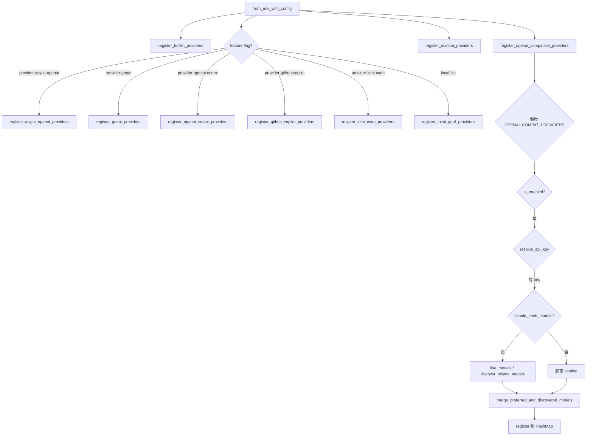
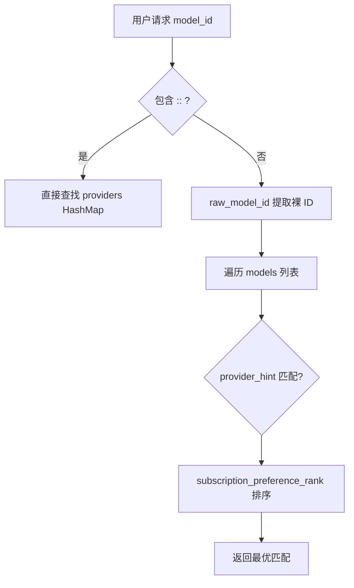
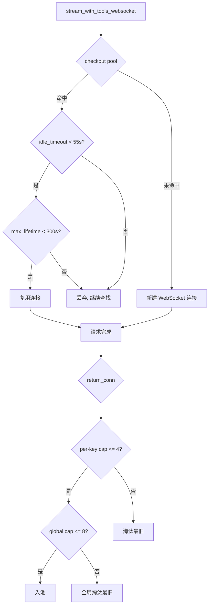

# PD-285.01 Moltis — ProviderRegistry 表驱动多 Provider 注册与动态模型发现

> 文档编号：PD-285.01
> 来源：Moltis `crates/providers/src/lib.rs`, `crates/provider-setup/src/lib.rs`, `crates/providers/src/ws_pool.rs`
> GitHub：https://github.com/moltis-org/moltis.git
> 问题域：PD-285 多 LLM Provider 管理 Multi-Provider Management
> 状态：可复用方案

---

## 第 1 章 问题与动机

### 1.1 核心问题

当一个 AI 编码助手需要同时支持 OpenAI、Anthropic、Gemini、Groq、xAI、DeepSeek、Mistral、Ollama、OpenRouter、Cerebras、MiniMax、Z.AI、Moonshot、Venice、GitHub Copilot、OpenAI Codex、Kimi Code 以及本地 GGUF 模型时，面临以下工程挑战：

1. **Provider 差异巨大**：有的用 OpenAI 兼容 API，有的用私有协议（Anthropic），有的需要 OAuth（Copilot/Codex），有的完全本地运行（GGUF）
2. **模型发现不统一**：有的支持 `/v1/models` 端点，有的不支持（MiniMax 返回 404），有的用 `/api/tags`（Ollama）
3. **二进制体积膨胀**：不是所有用户都需要所有 provider，llama-cpp-2 等本地推理依赖非常重
4. **连接资源浪费**：每个 provider 独立创建 HTTP client 会导致连接池碎片化
5. **凭证来源多样**：环境变量、配置文件、OAuth token store、Codex CLI auth.json 等多种来源需要统一管理

### 1.2 Moltis 的解法概述

Moltis 采用 **表驱动注册 + feature flag 门控 + 共享连接池** 的三层架构：

1. **`LlmProvider` trait 统一抽象**（`crates/agents/src/model.rs:320`）：所有 provider 实现同一 trait，包含 `complete`/`stream`/`stream_with_tools` 三种调用模式
2. **`ProviderRegistry` 中心注册表**（`crates/providers/src/lib.rs:802`）：HashMap<String, Arc<dyn LlmProvider>> 按 `provider::model_id` 命名空间键存储
3. **`OPENAI_COMPAT_PROVIDERS` 表驱动注册**（`crates/providers/src/lib.rs:626`）：8 个 OpenAI 兼容 provider 用一张静态表声明，共享同一注册逻辑
4. **`DynamicModelDiscovery` trait 动态发现**（`crates/providers/src/lib.rs:703`）：OAuth provider（Codex/Copilot）通过 trait 实现运行时模型列表刷新
5. **`shared_http_client()` 全局单例**（`crates/providers/src/lib.rs:51`）：LazyLock 全局 reqwest::Client，所有 provider 共享 DNS 缓存和 TLS 会话

### 1.3 设计思想

| 设计原则 | 具体实现 | 理由 | 替代方案 |
|----------|----------|------|----------|
| 表驱动消除重复 | `OPENAI_COMPAT_PROVIDERS` 静态数组 | 8 个 OpenAI 兼容 provider 共享注册逻辑，新增 provider 只需加一行 | 每个 provider 独立注册函数（代码膨胀） |
| Feature flag 门控编译 | `#[cfg(feature = "provider-github-copilot")]` | llama-cpp-2 等重依赖不编译进默认二进制 | 运行时动态加载（Rust 不适合） |
| 命名空间隔离 | `provider::model_id` 双冒号分隔 | 不同 provider 的同名模型不冲突（如 openai::gpt-4o vs openrouter::gpt-4o） | 全局唯一 ID（需要额外映射） |
| 连接池单例 | `LazyLock<reqwest::Client>` | 避免每个 provider 独立 TCP 连接池 | 依赖注入（增加 API 复杂度） |
| 优先级排序 | `subscription_preference_rank()` | 订阅制 provider（Codex/Copilot）优先选择 | 用户手动排序（体验差） |

---

## 第 2 章 源码实现分析

### 2.1 架构概览

Moltis 的 provider 系统分为三个 crate，职责清晰分离：

```
┌─────────────────────────────────────────────────────────────────┐
│                    crates/provider-setup                         │
│  LiveProviderSetupService: UI 引导配置 + OAuth 流程 + 注册重建   │
│  KeyStore: 文件级凭证持久化 (~/.config/moltis/provider_keys.json)│
│  KnownProvider: 已知 provider 静态定义表                         │
└──────────────────────────┬──────────────────────────────────────┘
                           │ 调用
┌──────────────────────────▼──────────────────────────────────────┐
│                    crates/providers                              │
│  ProviderRegistry: 中心注册表 (HashMap<ns_model_id, Provider>)   │
│  ├── register_builtin_providers()     → Anthropic, OpenAI       │
│  ├── register_openai_compatible()     → 8 个表驱动 provider      │
│  ├── register_custom_providers()      → 用户自定义 endpoint      │
│  ├── register_*_codex/copilot()       → OAuth 动态发现           │
│  ├── register_kimi_code_providers()   → Kimi Code               │
│  └── register_local_gguf_providers()  → 本地 GGUF/MLX           │
│                                                                  │
│  shared_http_client(): 全局 reqwest::Client 单例                 │
│  shared_ws_pool():     全局 WebSocket 连接池单例                  │
│  OPENAI_COMPAT_PROVIDERS: 表驱动 provider 定义                   │
└──────────────────────────┬──────────────────────────────────────┘
                           │ 实现
┌──────────────────────────▼──────────────────────────────────────┐
│                    crates/agents                                 │
│  LlmProvider trait: complete / stream / stream_with_tools        │
│  ChatMessage / StreamEvent / ToolCall: 统一消息模型               │
└─────────────────────────────────────────────────────────────────┘
```

### 2.2 核心实现

#### 2.2.1 表驱动 OpenAI 兼容 Provider 注册



对应源码 `crates/providers/src/lib.rs:626-700`：

```rust
const OPENAI_COMPAT_PROVIDERS: &[OpenAiCompatDef] = &[
    OpenAiCompatDef {
        config_name: "mistral",
        env_key: "MISTRAL_API_KEY",
        env_base_url_key: "MISTRAL_BASE_URL",
        default_base_url: "https://api.mistral.ai/v1",
        models: MISTRAL_MODELS,
        supports_model_discovery: true,
    },
    OpenAiCompatDef {
        config_name: "minimax",
        env_key: "MINIMAX_API_KEY",
        env_base_url_key: "MINIMAX_BASE_URL",
        default_base_url: "https://api.minimax.io/v1",
        models: MINIMAX_MODELS,
        supports_model_discovery: false, // MiniMax API 返回 404
    },
    // ... ollama, openrouter, cerebras, moonshot, zai, venice, deepseek
];
```

每个 `OpenAiCompatDef` 声明了 provider 名称、环境变量 key、默认 base URL、静态模型目录和是否支持 `/v1/models` 发现。`register_openai_compatible_providers` 遍历此表，对每个 provider 执行相同的注册逻辑（`crates/providers/src/lib.rs:1497-1624`）。

#### 2.2.2 命名空间模型 ID 与优先级选择



对应源码 `crates/providers/src/lib.rs:85-101`：

```rust
const MODEL_ID_NAMESPACE_SEP: &str = "::";

pub fn namespaced_model_id(provider: &str, model_id: &str) -> String {
    if model_id.contains(MODEL_ID_NAMESPACE_SEP) {
        return model_id.to_string();
    }
    format!("{provider}{MODEL_ID_NAMESPACE_SEP}{model_id}")
}

pub fn raw_model_id(model_id: &str) -> &str {
    model_id
        .rsplit_once(MODEL_ID_NAMESPACE_SEP)
        .map(|(_, raw)| raw)
        .unwrap_or(model_id)
}
```

订阅制 provider 优先级（`crates/providers/src/lib.rs:129-135`）：

```rust
fn subscription_preference_rank(provider_name: &str) -> usize {
    if matches!(provider_name, "openai-codex" | "github-copilot") {
        0  // 最高优先级
    } else {
        1
    }
}
```

#### 2.2.3 WebSocket 连接池



对应源码 `crates/providers/src/ws_pool.rs:22-28`：

```rust
const MAX_IDLE_PER_KEY: usize = 4;
const MAX_IDLE_TOTAL: usize = 8;
const IDLE_TIMEOUT: std::time::Duration = std::time::Duration::from_secs(55);
const MAX_LIFETIME: std::time::Duration = std::time::Duration::from_secs(300);
```

连接池按 `(ws_url, key_hash)` 分桶，API key 立即哈希不存储明文（`ws_pool.rs:46-54`）。无后台 reaper 线程，惰性淘汰过期连接。

### 2.3 实现细节

**凭证解析优先级链**（`crates/providers/src/lib.rs:369-380`）：

```
config.api_key → env_var → env_overrides → (空则跳过)
```

`resolve_api_key` 函数先查配置文件中的 `Secret<String>`，再查环境变量，最后查 env_overrides（来自配置文件 `[env]` 段），全程用 `secrecy::Secret` 包裹防止日志泄露。

**模型能力静态推断**（`crates/providers/src/lib.rs:384-540`）：

由于 provider API 不暴露模型能力元数据，Moltis 用前缀匹配推断 context_window、is_chat_capable、supports_tools、supports_vision 四个维度。这是一个务实的工程妥协——比维护一个完整的模型能力数据库简单得多。

**KeyStore 原子写入**（`crates/provider-setup/src/lib.rs:275-305`）：

写入 `provider_keys.json` 时先写临时文件再 `rename`，Unix 下设置 `0o600` 权限，确保读者永远不会看到半写的 JSON。

**异步注册重建**（`crates/provider-setup/src/lib.rs:1298-1366`）：

`queue_registry_rebuild` 使用 `AtomicU64` 序列号防止过时的重建覆盖新的。每次保存 key 后触发 `spawn_blocking` 重建整个 registry，通过序列号比较丢弃过时结果。

---

## 第 3 章 迁移指南

### 3.1 迁移清单

**阶段 1：定义 Provider trait**

- [ ] 定义统一的 `LlmProvider` trait，包含 `complete`、`stream`、`stream_with_tools` 方法
- [ ] 添加能力查询方法：`supports_tools()`、`supports_vision()`、`context_window()`
- [ ] 使用 `async_trait` 支持异步方法（或 Rust nightly 的 async fn in trait）

**阶段 2：实现 ProviderRegistry**

- [ ] 创建 `ProviderRegistry` 结构体，内部 `HashMap<String, Arc<dyn LlmProvider>>`
- [ ] 实现命名空间 model ID：`provider::model_id` 格式
- [ ] 实现 `from_env_with_config()` 自动发现注册
- [ ] 实现 `get()`、`first()`、`first_with_tools()` 查询方法

**阶段 3：表驱动注册**

- [ ] 定义 `OpenAiCompatDef` 结构体（config_name, env_key, default_base_url, models, supports_model_discovery）
- [ ] 创建 `OPENAI_COMPAT_PROVIDERS` 静态数组
- [ ] 实现 `register_openai_compatible_providers()` 遍历注册

**阶段 4：Feature flag 门控**

- [ ] 在 `Cargo.toml` 中定义 feature flag（`provider-github-copilot`、`local-llm` 等）
- [ ] 用 `#[cfg(feature = "...")]` 门控重依赖模块
- [ ] 确保默认 feature 集合最小化

**阶段 5：连接池共享**

- [ ] 实现 `shared_http_client()` 全局 reqwest::Client 单例
- [ ] 如需 WebSocket，实现 `shared_ws_pool()` 连接池

### 3.2 适配代码模板

以下是一个可直接复用的 Rust 表驱动 provider 注册模板：

```rust
use std::{collections::HashMap, sync::Arc};
use secrecy::Secret;

// ── Provider trait ──────────────────────────────────────────
#[async_trait::async_trait]
pub trait LlmProvider: Send + Sync {
    fn name(&self) -> &str;
    fn id(&self) -> &str;
    async fn complete(&self, messages: &[Message], tools: &[serde_json::Value])
        -> anyhow::Result<CompletionResponse>;
    fn supports_tools(&self) -> bool { false }
    fn context_window(&self) -> u32 { 200_000 }
}

// ── 表驱动定义 ─────────────────────────────────────────────
struct CompatProviderDef {
    config_name: &'static str,
    env_key: &'static str,
    default_base_url: &'static str,
    static_models: &'static [(&'static str, &'static str)],
    supports_discovery: bool,
}

const COMPAT_PROVIDERS: &[CompatProviderDef] = &[
    CompatProviderDef {
        config_name: "mistral",
        env_key: "MISTRAL_API_KEY",
        default_base_url: "https://api.mistral.ai/v1",
        static_models: &[("mistral-large-latest", "Mistral Large")],
        supports_discovery: true,
    },
    // 新增 provider 只需加一行
];

// ── 命名空间 model ID ──────────────────────────────────────
const NS_SEP: &str = "::";

fn namespaced_id(provider: &str, model: &str) -> String {
    if model.contains(NS_SEP) { model.to_string() }
    else { format!("{provider}{NS_SEP}{model}") }
}

fn raw_id(model: &str) -> &str {
    model.rsplit_once(NS_SEP).map(|(_, r)| r).unwrap_or(model)
}

// ── Registry ───────────────────────────────────────────────
pub struct ProviderRegistry {
    providers: HashMap<String, Arc<dyn LlmProvider>>,
    models: Vec<ModelInfo>,
}

impl ProviderRegistry {
    pub fn from_env(config: &Config) -> Self {
        let mut reg = Self::empty();
        // 1. 内置 provider（Anthropic, OpenAI）
        reg.register_builtin(config);
        // 2. 表驱动 OpenAI 兼容 provider
        for def in COMPAT_PROVIDERS {
            if !config.is_enabled(def.config_name) { continue; }
            let Some(key) = resolve_key(config, def.config_name, def.env_key) else { continue; };
            let models = if def.supports_discovery {
                discover_models(&key, def.default_base_url)
                    .unwrap_or_else(|_| static_models(def.static_models))
            } else {
                static_models(def.static_models)
            };
            for m in models {
                reg.register(def.config_name, m, key.clone(), def.default_base_url);
            }
        }
        reg
    }
}

// ── 全局 HTTP client ───────────────────────────────────────
pub fn shared_http_client() -> &'static reqwest::Client {
    static CLIENT: std::sync::LazyLock<reqwest::Client> =
        std::sync::LazyLock::new(reqwest::Client::new);
    &CLIENT
}
```

### 3.3 适用场景

| 场景 | 适用度 | 说明 |
|------|--------|------|
| 多 LLM provider 的 AI 编码助手 | ⭐⭐⭐ | Moltis 的核心场景，完全匹配 |
| 需要 OpenAI 兼容 API 聚合的网关 | ⭐⭐⭐ | 表驱动注册 + 动态发现非常适合 |
| 单 provider 的简单 chatbot | ⭐ | 过度设计，直接用 SDK 即可 |
| Python/TypeScript 项目 | ⭐⭐ | 设计思想可迁移，但 feature flag 是 Rust 特有 |
| 需要运行时热加载 provider 的系统 | ⭐⭐ | 需要额外实现 `queue_registry_rebuild` 模式 |

---

## 第 4 章 测试用例

Moltis 的 ws_pool 模块自带完整测试（`crates/providers/src/ws_pool.rs:184-381`），以下是基于真实函数签名的测试模板：

```rust
#[cfg(test)]
mod tests {
    use super::*;

    // ── 命名空间 model ID 测试 ─────────────────────────────
    #[test]
    fn namespaced_model_id_adds_prefix() {
        assert_eq!(
            namespaced_model_id("openai", "gpt-4o"),
            "openai::gpt-4o"
        );
    }

    #[test]
    fn namespaced_model_id_preserves_existing_namespace() {
        assert_eq!(
            namespaced_model_id("openai", "openrouter::gpt-4o"),
            "openrouter::gpt-4o"
        );
    }

    #[test]
    fn raw_model_id_strips_namespace() {
        assert_eq!(raw_model_id("openai::gpt-4o"), "gpt-4o");
        assert_eq!(raw_model_id("gpt-4o"), "gpt-4o");
    }

    // ── 模型能力推断测试 ───────────────────────────────────
    #[test]
    fn context_window_known_models() {
        assert_eq!(context_window_for_model("claude-sonnet-4-20250514"), 200_000);
        assert_eq!(context_window_for_model("gpt-4o"), 128_000);
        assert_eq!(context_window_for_model("gemini-2.0-flash"), 1_000_000);
        assert_eq!(context_window_for_model("codestral-latest"), 256_000);
    }

    #[test]
    fn is_chat_capable_filters_non_chat() {
        assert!(!is_chat_capable_model("dall-e-3"));
        assert!(!is_chat_capable_model("tts-1"));
        assert!(!is_chat_capable_model("text-embedding-3-small"));
        assert!(is_chat_capable_model("gpt-4o"));
        assert!(is_chat_capable_model("claude-sonnet-4-20250514"));
    }

    #[test]
    fn supports_tools_excludes_legacy() {
        assert!(!supports_tools_for_model("babbage-002"));
        assert!(!supports_tools_for_model("davinci-002"));
        assert!(supports_tools_for_model("gpt-4o"));
    }

    // ── Registry 注册与查询测试 ────────────────────────────
    #[test]
    fn registry_get_by_namespaced_id() {
        let mut reg = ProviderRegistry::empty();
        let provider = Arc::new(MockProvider::new("openai", "gpt-4o"));
        reg.register(
            ModelInfo { id: "gpt-4o".into(), provider: "openai".into(),
                        display_name: "GPT-4o".into(), created_at: None },
            provider,
        );
        assert!(reg.get("openai::gpt-4o").is_some());
        assert!(reg.get("gpt-4o").is_some()); // 裸 ID 也能解析
    }

    #[test]
    fn subscription_providers_preferred() {
        // openai-codex 和 github-copilot 的 rank 为 0，其他为 1
        assert_eq!(subscription_preference_rank("openai-codex"), 0);
        assert_eq!(subscription_preference_rank("github-copilot"), 0);
        assert_eq!(subscription_preference_rank("openai"), 1);
        assert_eq!(subscription_preference_rank("anthropic"), 1);
    }

    // ── 模型合并测试 ──────────────────────────────────────
    #[test]
    fn merge_preferred_and_discovered_preserves_order() {
        let preferred = vec!["gpt-5".to_string(), "gpt-4o".to_string()];
        let discovered = vec![
            DiscoveredModel::new("gpt-4o", "GPT-4o"),
            DiscoveredModel::new("gpt-4o-mini", "GPT-4o Mini"),
        ];
        let merged = merge_preferred_and_discovered_models(preferred, discovered);
        assert_eq!(merged[0].id, "gpt-5");     // preferred 优先
        assert_eq!(merged[1].id, "gpt-4o");    // preferred 第二
        assert_eq!(merged[2].id, "gpt-4o-mini"); // discovered 补充
    }

    // ── WebSocket 连接池测试 ──────────────────────────────
    #[tokio::test]
    async fn ws_pool_checkout_empty_returns_none() {
        let pool = WsPool::new();
        let key = PoolKey::new("wss://api.openai.com/v1/responses",
                               &secrecy::Secret::new("sk-test".into()));
        assert!(pool.checkout(&key).await.is_none());
    }

    #[tokio::test]
    async fn ws_pool_different_keys_isolated() {
        let pool = WsPool::new();
        let key_a = PoolKey::new("wss://example.com", &secrecy::Secret::new("key-a".into()));
        let key_b = PoolKey::new("wss://example.com", &secrecy::Secret::new("key-b".into()));
        // key_a 的连接不会被 key_b checkout
        // (需要真实 WS 连接，参见 ws_pool.rs:346-363 的完整测试)
    }
}
```

---

## 第 5 章 跨域关联

| 关联域 | 关系类型 | 说明 |
|--------|----------|------|
| PD-03 容错与重试 | 协同 | `retry_after_ms_from_headers()` 解析 429 响应的 Retry-After 头，`with_retry_after_marker()` 在错误消息中嵌入重试提示供上层 runner 消费（`lib.rs:232-245`） |
| PD-04 工具系统 | 协同 | `openai_compat.rs` 的 `patch_schema_for_strict_mode()` 递归修补 JSON Schema 满足 OpenAI strict mode 要求，`supports_tools_for_model()` 按模型 ID 推断工具支持 |
| PD-01 上下文管理 | 依赖 | `context_window_for_model()` 提供每个模型的上下文窗口大小，供上层 auto-compact 机制判断何时触发压缩 |
| PD-06 记忆持久化 | 协同 | `KeyStore` 的原子写入模式（temp file + rename + 0o600 权限）可复用于任何需要安全持久化的场景 |
| PD-11 可观测性 | 协同 | `ProviderSetupTiming` 的 RAII Drop 计时模式自动记录每个 setup 操作的耗时，`provider_summary()` 提供注册表摘要 |

---

## 第 6 章 来源文件索引

| 文件 | 行范围 | 关键实现 |
|------|--------|----------|
| `crates/agents/src/model.rs` | L320-L350 | `LlmProvider` trait 定义（complete/stream/supports_tools/context_window/supports_vision） |
| `crates/providers/src/lib.rs` | L51-L55 | `shared_http_client()` 全局 reqwest::Client LazyLock 单例 |
| `crates/providers/src/lib.rs` | L85-L101 | `namespaced_model_id()` / `raw_model_id()` 命名空间 ID 系统 |
| `crates/providers/src/lib.rs` | L129-L135 | `subscription_preference_rank()` 订阅制 provider 优先级 |
| `crates/providers/src/lib.rs` | L158-L221 | `merge_preferred_and_discovered_models()` / `merge_discovered_with_fallback_catalog()` 模型合并 |
| `crates/providers/src/lib.rs` | L258-L300 | `discover_ollama_models_from_api()` Ollama `/api/tags` 模型发现 |
| `crates/providers/src/lib.rs` | L384-L540 | `context_window_for_model()` / `is_chat_capable_model()` / `supports_tools_for_model()` / `supports_vision_for_model()` 模型能力推断 |
| `crates/providers/src/lib.rs` | L612-L700 | `OpenAiCompatDef` 结构体 + `OPENAI_COMPAT_PROVIDERS` 表驱动定义 |
| `crates/providers/src/lib.rs` | L702-L799 | `DynamicModelDiscovery` trait + `OpenAiCodexDiscovery` / `GitHubCopilotDiscovery` 实现 |
| `crates/providers/src/lib.rs` | L802-L833 | `ProviderRegistry` 结构体定义与核心查询方法 |
| `crates/providers/src/lib.rs` | L964-L974 | `register()` 方法：命名空间包装 + HashMap 插入 |
| `crates/providers/src/lib.rs` | L1009-L1061 | `from_env_with_config()` 注册顺序：builtin → compat → custom → async-openai → genai → codex → copilot → kimi → local |
| `crates/providers/src/lib.rs` | L1497-L1624 | `register_openai_compatible_providers()` 表驱动遍历注册 |
| `crates/providers/src/lib.rs` | L1626-L1705 | `register_custom_providers()` 用户自定义 endpoint 注册 |
| `crates/providers/src/lib.rs` | L1770-L1799 | `fallback_providers_for()` 四级亲和度降级排序 |
| `crates/providers/src/ws_pool.rs` | L22-L28 | WebSocket 连接池常量（MAX_IDLE_PER_KEY=4, MAX_IDLE_TOTAL=8, IDLE_TIMEOUT=55s, MAX_LIFETIME=300s） |
| `crates/providers/src/ws_pool.rs` | L36-L55 | `PoolKey` 按 (ws_url, key_hash) 分桶，API key 立即哈希 |
| `crates/providers/src/ws_pool.rs` | L89-L113 | `checkout()` 惰性淘汰过期连接 |
| `crates/providers/src/ws_pool.rs` | L119-L151 | `return_conn()` 双层容量限制（per-key + global） |
| `crates/providers/Cargo.toml` | L7-L17 | Feature flag 定义：7 个可选 provider feature |
| `crates/provider-setup/src/lib.rs` | L43-L59 | `ProviderConfig` 结构体（api_key, base_url, models, display_name） |
| `crates/provider-setup/src/lib.rs` | L163-L391 | `KeyStore` 文件级凭证存储（原子写入 + 格式迁移） |
| `crates/provider-setup/src/lib.rs` | L397-L489 | `config_with_saved_keys()` 三层配置合并（home config → home key store → current key store） |
| `crates/provider-setup/src/lib.rs` | L698-L910 | `KnownProvider` 定义 + `known_providers()` 15+ provider 静态列表 |
| `crates/provider-setup/src/lib.rs` | L1201-L1366 | `LiveProviderSetupService` + `queue_registry_rebuild()` 异步重建 |

---

## 第 7 章 横向对比维度

```json comparison_data
{
  "project": "Moltis",
  "dimensions": {
    "Provider 抽象": "LlmProvider trait 统一 complete/stream/stream_with_tools 三模式",
    "注册机制": "表驱动 OPENAI_COMPAT_PROVIDERS 静态数组 + feature flag 门控编译",
    "模型发现": "三路发现：/v1/models + /api/tags(Ollama) + OAuth 动态刷新",
    "连接池策略": "双单例：shared_http_client(reqwest) + shared_ws_pool(WebSocket 分桶池)",
    "凭证管理": "四源合并：env → config → home key store → current key store，Secret 包裹防泄露",
    "降级排序": "四级亲和度 fallback：同模型跨 provider → 订阅制 → 同 provider 其他模型 → 其他"
  }
}
```

### 域元数据补充

```json domain_metadata
{
  "solution_summary": "Moltis 用 OPENAI_COMPAT_PROVIDERS 表驱动注册 + 7 个 Cargo feature flag 门控 + LazyLock 双单例连接池管理 15+ LLM provider",
  "description": "provider 降级排序与 fallback 亲和度策略",
  "sub_problems": [
    "模型能力静态推断（context window/tools/vision 前缀匹配）",
    "自定义 OpenAI 兼容 endpoint 动态注册",
    "异步 registry 重建与序列号防过时覆盖"
  ],
  "best_practices": [
    "API key 立即哈希后存入连接池 key，不存储明文",
    "原子写入凭证文件（temp + rename + 0o600 权限）",
    "表驱动消除 OpenAI 兼容 provider 的重复注册代码"
  ]
}
```
