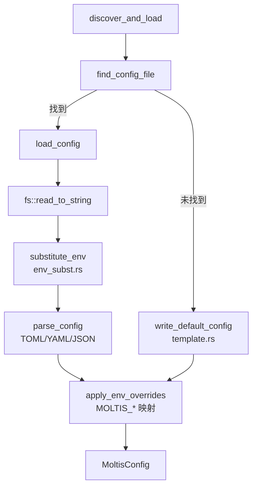
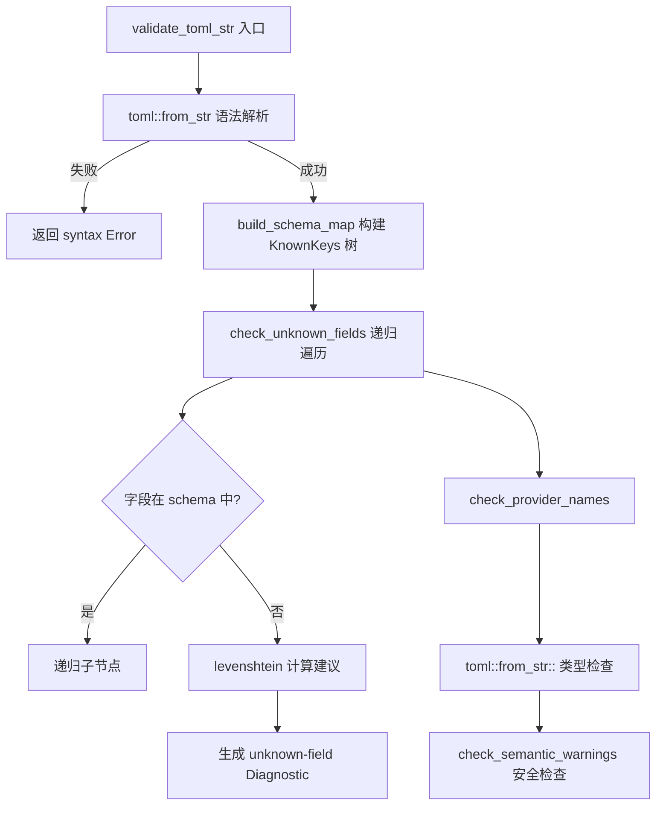
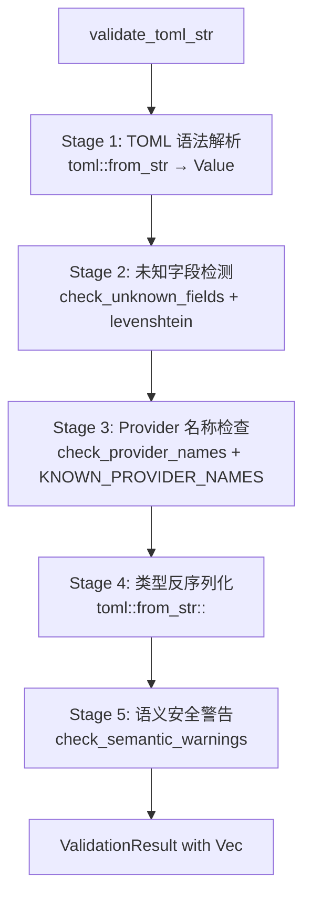
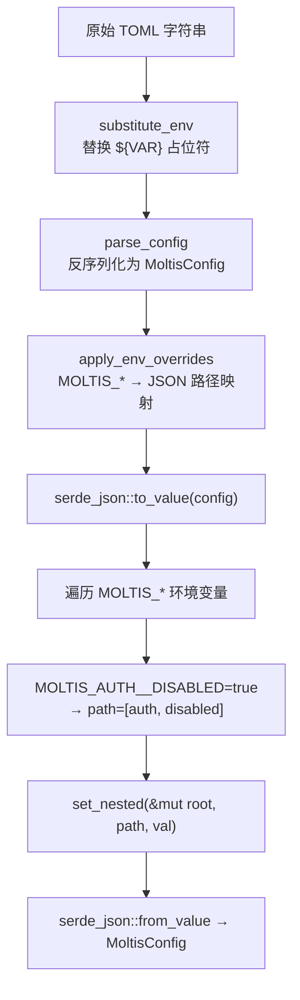
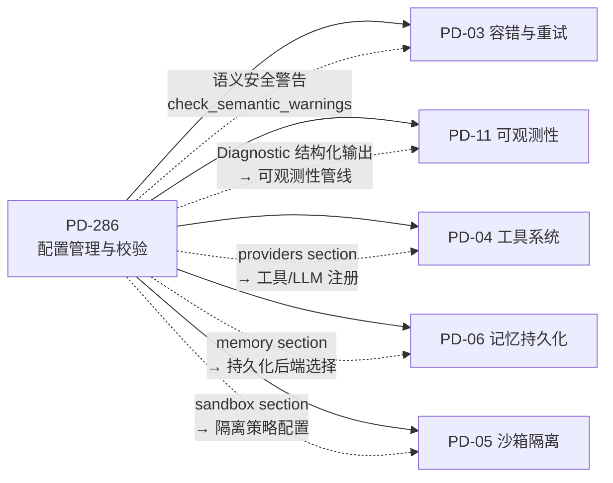

# PD-286.01 Moltis — TOML Schema-Map 校验与环境变量覆盖

> 文档编号：PD-286.01
> 来源：Moltis `crates/config/src/`
> GitHub：https://github.com/moltis-org/moltis.git
> 问题域：PD-286 配置管理与校验 Configuration Management & Validation
> 状态：可复用方案

---

## 第 1 章 问题与动机（Problem & Motivation）

### 1.1 核心问题

Agent 系统的配置复杂度远超传统 Web 应用——Moltis 的 `MoltisConfig` 根结构包含 20+ 顶层 section（server、providers、chat、tools、skills、mcp、channels、tls、auth、graphql、metrics、identity、user、hooks、memory、tailscale、failover、heartbeat、voice、cron、caldav、env），每个 section 又有多层嵌套。用户在 TOML 中拼写错误（如 `sever` 而非 `server`）不会导致解析失败——serde 的 `#[serde(default)]` 会静默忽略未知字段，导致配置"看起来正确但实际没生效"。

此外，12-factor 部署要求配置可通过环境变量覆盖，但 Rust 的 serde 生态没有内建的"环境变量 → 嵌套结构"映射机制。

### 1.2 Moltis 的解法概述

1. **手写 Schema Map**：在 `validate.rs:107` 用 `KnownKeys` 枚举递归构建完整配置树，与 `schema.rs` 的 serde 结构体一一对应
2. **Levenshtein 拼写建议**：未知字段触发编辑距离计算（`validate.rs:575`），给出 "did you mean X?" 提示
3. **五阶段校验管线**：语法解析 → 未知字段检测 → Provider 名称检查 → 类型反序列化 → 语义安全警告（`validate.rs:663-711`）
4. **`${ENV_VAR}` 文本替换**：在 TOML 解析前对原始字符串做正则替换（`env_subst.rs:12`），支持 12-factor 部署
5. **`MOLTIS_*` 环境变量覆盖**：解析后通过 JSON 中间表示做嵌套路径映射（`loader.rs:1001-1062`），`__` 分隔符映射到嵌套层级

### 1.3 设计思想

| 设计原则 | 具体实现 | 理由 | 替代方案 |
|----------|----------|------|----------|
| 静态 Schema 与运行时结构同步 | `build_schema_map()` 手写 + `schema_drift_guard` 测试 | 编译期无法自动从 serde derive 提取字段列表 | proc-macro 自动生成（复杂度高） |
| 渐进式错误报告 | 5 阶段管线，每阶段独立产出 `Diagnostic` | 一次校验暴露所有问题，避免"修一个报一个" | 短路式校验（用户体验差） |
| 双层环境变量注入 | 文本替换（`${VAR}`）+ 结构覆盖（`MOLTIS_*`） | 文本替换适合 API key 注入；结构覆盖适合布尔/数值 | 仅文本替换（无法处理类型转换） |
| 安全语义检查 | `check_semantic_warnings` 检测 auth+非 localhost 等 | 配置合法但不安全的组合需要主动警告 | 仅做语法/类型检查（遗漏安全风险） |
| 注释保留写回 | `toml_edit` 合并而非覆盖（`loader.rs:923-968`） | 用户手写注释是重要文档，不应丢失 | 直接 `toml::to_string_pretty`（丢失注释） |

---

## 第 2 章 源码实现分析（Source Code Analysis）

### 2.1 架构概览

```
┌─────────────────────────────────────────────────────────────────┐
│                    moltis-config crate                          │
├─────────────┬──────────────┬──────────────┬────────────────────┤
│  schema.rs  │  validate.rs │  loader.rs   │  env_subst.rs      │
│  (类型定义)  │  (校验引擎)   │  (加载/保存)  │  (${VAR} 替换)     │
│             │              │              │                    │
│ MoltisConfig│ KnownKeys    │ discover_    │ substitute_env()   │
│ 20+ section │ build_schema │ and_load()   │                    │
│ #[serde(    │ _map()       │ load_config()│                    │
│  default)]  │ validate_    │ apply_env_   │                    │
│             │ toml_str()   │ overrides()  │                    │
├─────────────┼──────────────┼──────────────┼────────────────────┤
│ template.rs │  error.rs    │  migrate.rs  │                    │
│ (默认模板)   │  (错误类型)   │  (版本迁移)   │                    │
└─────────────┴──────────────┴──────────────┴────────────────────┘
```

加载流程：



### 2.2 核心实现

#### 2.2.1 KnownKeys Schema 树与未知字段检测



对应源码 `crates/config/src/validate.rs:68-84`：

```rust
/// Represents the expected shape of the configuration schema.
enum KnownKeys {
    /// A struct with fixed field names.
    Struct(HashMap<&'static str, KnownKeys>),
    /// A map with dynamic keys (providers, mcp.servers, etc.) whose values
    /// have a known shape.
    Map(Box<KnownKeys>),
    /// A map with dynamic keys plus explicit static keys.
    MapWithFields {
        value: Box<KnownKeys>,
        fields: HashMap<&'static str, KnownKeys>,
    },
    /// An array of typed items.
    Array(Box<KnownKeys>),
    /// Scalar value — stop recursion.
    Leaf,
}
```

`MapWithFields` 变体是关键设计——`[providers]` section 既有固定的 `offered` 字段，又有动态的 provider 名称键（如 `anthropic`、`openai`），需要同时支持两种校验模式。

对应源码 `crates/config/src/validate.rs:289-304`：

```rust
("providers", MapWithFields {
    value: Box::new(provider_entry()),
    fields: HashMap::from([("offered", Array(Box::new(Leaf)))]),
}),
```

#### 2.2.2 五阶段校验管线



对应源码 `crates/config/src/validate.rs:663-711`：

```rust
pub fn validate_toml_str(toml_str: &str) -> ValidationResult {
    let mut diagnostics = Vec::new();

    // 1. Syntax — parse raw TOML
    let toml_value: toml::Value = match toml::from_str(toml_str) {
        Ok(v) => v,
        Err(e) => {
            diagnostics.push(Diagnostic {
                severity: Severity::Error,
                category: "syntax",
                path: String::new(),
                message: format!("TOML syntax error: {e}"),
            });
            return ValidationResult { diagnostics, config_path: None };
        },
    };

    // 2. Unknown fields — walk the TOML tree against KnownKeys
    let schema = build_schema_map();
    check_unknown_fields(&toml_value, &schema, "", &mut diagnostics);

    // 3. Provider name hints
    if let Some(providers) = toml_value.get("providers").and_then(|v| v.as_table()) {
        check_provider_names(providers, &mut diagnostics);
    }

    // 4. Type check — attempt full deserialization
    if let Err(e) = toml::from_str::<MoltisConfig>(toml_str) {
        diagnostics.push(Diagnostic {
            severity: Severity::Error,
            category: "type-error",
            path: String::new(),
            message: format!("type error: {e}"),
        });
    }

    // 5. Semantic warnings on parsed config
    if let Ok(config) = toml::from_str::<MoltisConfig>(toml_str) {
        check_semantic_warnings(&config, &mut diagnostics);
    }

    ValidationResult { diagnostics, config_path: None }
}
```

#### 2.2.3 环境变量双层注入



对应源码 `crates/config/src/env_subst.rs:12-49`：

```rust
fn substitute_env_with(input: &str, lookup: impl Fn(&str) -> Option<String>) -> String {
    let mut result = String::with_capacity(input.len());
    let mut chars = input.chars().peekable();

    while let Some(ch) = chars.next() {
        if ch == '$' && chars.peek() == Some(&'{') {
            chars.next(); // consume '{'
            let mut var_name = String::new();
            let mut closed = false;
            for c in chars.by_ref() {
                if c == '}' { closed = true; break; }
                var_name.push(c);
            }
            if closed && !var_name.is_empty() {
                match lookup(&var_name) {
                    Some(val) => result.push_str(&val),
                    None => {
                        result.push_str("${");
                        result.push_str(&var_name);
                        result.push('}');
                    },
                }
            } else {
                result.push_str("${");
                result.push_str(&var_name);
            }
        } else {
            result.push(ch);
        }
    }
    result
}
```

### 2.3 实现细节

**Schema Drift Guard 测试**（`validate.rs:1723-1734`）：将 `MoltisConfig::default()` 序列化为 TOML，再与 `build_schema_map()` 对比，确保每个字段都有对应的 schema 节点。这是防止 schema.rs 新增字段而 validate.rs 遗漏的关键防线。

**注释保留写回**（`loader.rs:923-968`）：使用 `toml_edit::DocumentMut` 解析现有文件和新序列化结果，递归合并 table，保留原有 decor（注释和空白）。当合并失败时降级为全量覆盖写入。

**Secret 类型安全**：所有 API key 字段使用 `secrecy::Secret<String>` 包装，自定义 serde 序列化/反序列化（`schema.rs:1842-1858`），Debug 输出自动 REDACTED，防止日志泄露。

**多格式支持**：`parse_config` 根据文件扩展名分发到 `toml`/`serde_yaml`/`serde_json`（`loader.rs:1119-1130`），支持 `.toml`、`.yaml`、`.yml`、`.json` 四种格式。

## 第 3 章 迁移指南（Migration Guide）

### 3.1 迁移清单

| # | 步骤 | 输入 | 输出 | 验证方式 |
|---|------|------|------|----------|
| 1 | 定义配置根结构体 | 业务需求 | `AppConfig` + `#[serde(default)]` | 编译通过 |
| 2 | 构建 KnownKeys schema map | `AppConfig` 字段列表 | `build_schema_map()` 函数 | schema_drift_guard 测试 |
| 3 | 实现未知字段检测 | TOML Value + schema map | `check_unknown_fields()` + levenshtein | 拼写错误测试 |
| 4 | 实现多阶段校验管线 | 原始 TOML 字符串 | `Vec<Diagnostic>` | 各阶段独立测试 |
| 5 | 实现 `${VAR}` 文本替换 | 原始配置字符串 | 替换后字符串 | 环境变量注入测试 |
| 6 | 实现 `PREFIX_*` 结构覆盖 | 已解析 config + env vars | 覆盖后 config | 嵌套路径映射测试 |
| 7 | 实现注释保留写回 | 修改后 config + 原文件 | 保留注释的 TOML | diff 对比测试 |
| 8 | 添加 schema drift guard | schema map + default config | 自动化测试 | CI 集成 |

### 3.2 适配代码模板

#### 3.2.1 最小化 Schema Map（TypeScript 适配）

```typescript
// config-schema.ts — 从 Moltis validate.rs:68-84 移植
type KnownKeys =
  | { kind: "struct"; fields: Record<string, KnownKeys> }
  | { kind: "map"; value: KnownKeys }
  | { kind: "mapWithFields"; value: KnownKeys; fields: Record<string, KnownKeys> }
  | { kind: "array"; items: KnownKeys }
  | { kind: "leaf" };

function buildSchemaMap(): KnownKeys {
  return {
    kind: "struct",
    fields: {
      server: {
        kind: "struct",
        fields: {
          host: { kind: "leaf" },
          port: { kind: "leaf" },
          tls: { kind: "struct", fields: { cert: { kind: "leaf" }, key: { kind: "leaf" } } },
        },
      },
      providers: {
        kind: "mapWithFields",
        value: {
          kind: "struct",
          fields: { api_key: { kind: "leaf" }, model: { kind: "leaf" }, base_url: { kind: "leaf" } },
        },
        fields: { offered: { kind: "array", items: { kind: "leaf" } } },
      },
      // ... 按需扩展
    },
  };
}

// 未知字段检测 — 从 validate.rs:check_unknown_fields 移植
function checkUnknownFields(
  value: Record<string, unknown>,
  schema: KnownKeys,
  path: string,
  diagnostics: Diagnostic[]
): void {
  if (schema.kind !== "struct" && schema.kind !== "mapWithFields") return;

  const knownFields = schema.kind === "struct" ? schema.fields : schema.fields;
  for (const key of Object.keys(value)) {
    const childPath = path ? `${path}.${key}` : key;
    if (schema.kind === "struct" && !(key in knownFields)) {
      const suggestion = findClosest(key, Object.keys(knownFields));
      diagnostics.push({
        severity: "warning",
        category: "unknown-field",
        path: childPath,
        message: suggestion
          ? `Unknown field "${key}". Did you mean "${suggestion}"?`
          : `Unknown field "${key}"`,
      });
    } else {
      const childSchema = knownFields[key] ?? (schema.kind === "mapWithFields" ? schema.value : undefined);
      if (childSchema && typeof value[key] === "object" && value[key] !== null) {
        checkUnknownFields(value[key] as Record<string, unknown>, childSchema, childPath, diagnostics);
      }
    }
  }
}

// Levenshtein 编辑距离 — 从 validate.rs:575 移植
function levenshtein(a: string, b: string): number {
  const m = a.length, n = b.length;
  const dp: number[][] = Array.from({ length: m + 1 }, (_, i) =>
    Array.from({ length: n + 1 }, (_, j) => (i === 0 ? j : j === 0 ? i : 0))
  );
  for (let i = 1; i <= m; i++)
    for (let j = 1; j <= n; j++)
      dp[i][j] = Math.min(
        dp[i - 1][j] + 1,
        dp[i][j - 1] + 1,
        dp[i - 1][j - 1] + (a[i - 1] === b[j - 1] ? 0 : 1)
      );
  return dp[m][n];
}

function findClosest(key: string, candidates: string[], maxDist = 3): string | null {
  let best: string | null = null, bestDist = maxDist + 1;
  for (const c of candidates) {
    const d = levenshtein(key, c);
    if (d < bestDist) { bestDist = d; best = c; }
  }
  return best;
}
```

#### 3.2.2 环境变量结构覆盖（TypeScript 适配）

```typescript
// env-override.ts — 从 Moltis loader.rs:1001-1062 移植
function applyEnvOverrides<T>(config: T, prefix: string): T {
  const root = JSON.parse(JSON.stringify(config)); // deep clone via JSON
  const prefixUpper = prefix.toUpperCase() + "_";

  for (const [key, val] of Object.entries(process.env)) {
    if (!key.startsWith(prefixUpper) || val === undefined) continue;
    const path = key.slice(prefixUpper.length).toLowerCase().split("__");
    setNested(root, path, parseEnvValue(val));
  }

  return root as T;
}

// 从 loader.rs:1065 parse_env_value 移植
function parseEnvValue(val: string): unknown {
  if (val === "true") return true;
  if (val === "false") return false;
  const num = Number(val);
  if (!isNaN(num) && val.trim() !== "") return num;
  if (val.startsWith("[") || val.startsWith("{")) {
    try { return JSON.parse(val); } catch { /* fall through */ }
  }
  return val;
}

// 从 loader.rs:1095 set_nested 移植
function setNested(obj: Record<string, unknown>, path: string[], value: unknown): void {
  let current = obj;
  for (let i = 0; i < path.length - 1; i++) {
    if (!(path[i] in current) || typeof current[path[i]] !== "object") {
      current[path[i]] = {};
    }
    current = current[path[i]] as Record<string, unknown>;
  }
  current[path[path.length - 1]] = value;
}
```

### 3.3 适用场景矩阵

| 场景 | 推荐方案 | 理由 |
|------|----------|------|
| Rust Agent 系统，20+ 配置 section | 完整移植（KnownKeys + 5 阶段 + 双层 env） | 与 Moltis 同构，直接复用 |
| TypeScript/Node Agent | 3.2 模板 + TOML 库（如 `@iarna/toml`） | 核心逻辑可移植，TOML 解析用现成库 |
| Python Agent（如 LangGraph） | Pydantic `model_validator` + `python-dotenv` | Python 生态有更好的原生方案 |
| 配置项 < 10 个的小型工具 | 仅 `${VAR}` 文本替换 | Schema map 过度工程 |
| Kubernetes 部署 | `MOLTIS_*` 结构覆盖 + ConfigMap | 环境变量是 K8s 原生配置注入方式 |
| 多租户 SaaS | 增加 tenant-level 配置层 | Moltis 方案是单实例设计，需扩展 |

---

## 第 4 章 测试用例（Test Cases）

### 4.1 Schema Map 与未知字段检测测试

```rust
// tests/validate_test.rs — 基于 Moltis validate.rs 测试模式
#[cfg(test)]
mod tests {
    use super::*;

    #[test]
    fn test_unknown_field_with_suggestion() {
        let toml_str = r#"
[sever]
host = "0.0.0.0"
port = 8080
"#;
        let result = validate_toml_str(toml_str);
        assert!(result.diagnostics.iter().any(|d| {
            d.category == "unknown-field"
                && d.message.contains("sever")
                && d.message.contains("server")
        }));
    }

    #[test]
    fn test_valid_config_no_diagnostics() {
        let toml_str = r#"
[server]
host = "127.0.0.1"
port = 3000
"#;
        let result = validate_toml_str(toml_str);
        assert!(result.diagnostics.iter().all(|d| d.severity != Severity::Error));
    }

    #[test]
    fn test_syntax_error_short_circuits() {
        let toml_str = "invalid = [unclosed";
        let result = validate_toml_str(toml_str);
        assert_eq!(result.diagnostics.len(), 1);
        assert_eq!(result.diagnostics[0].category, "syntax");
    }

    #[test]
    fn test_semantic_warning_auth_disabled_non_localhost() {
        let toml_str = r#"
[server]
host = "0.0.0.0"

[auth]
disabled = true
"#;
        let result = validate_toml_str(toml_str);
        assert!(result.diagnostics.iter().any(|d| {
            d.severity == Severity::Warning && d.message.contains("auth")
        }));
    }

    // 从 validate.rs:1723-1734 schema_drift_guard 移植
    #[test]
    fn test_schema_drift_guard() {
        let default_config = MoltisConfig::default();
        let toml_str = toml::to_string_pretty(&default_config).unwrap();
        let result = validate_toml_str(&toml_str);
        let errors: Vec<_> = result.diagnostics.iter()
            .filter(|d| d.category == "unknown-field")
            .collect();
        assert!(errors.is_empty(), "Schema drift detected: {errors:?}");
    }
}
```

### 4.2 环境变量注入测试

```rust
#[cfg(test)]
mod env_tests {
    use super::*;

    #[test]
    fn test_substitute_env_basic() {
        let input = "api_key = \"${MY_API_KEY}\"";
        let result = substitute_env_with(input, |name| {
            if name == "MY_API_KEY" { Some("sk-test-123".into()) } else { None }
        });
        assert_eq!(result, "api_key = \"sk-test-123\"");
    }

    #[test]
    fn test_substitute_env_missing_var_preserved() {
        let input = "key = \"${UNDEFINED_VAR}\"";
        let result = substitute_env_with(input, |_| None);
        assert_eq!(result, "key = \"${UNDEFINED_VAR}\"");
    }

    #[test]
    fn test_apply_env_overrides_nested() {
        let mut config = MoltisConfig::default();
        let overrides = vec![
            ("MOLTIS_SERVER__PORT".into(), "9090".into()),
            ("MOLTIS_AUTH__DISABLED".into(), "true".into()),
        ];
        let result = apply_env_overrides_with(config, overrides.into_iter());
        assert_eq!(result.server.port, 9090);
        assert!(result.auth.disabled);
    }

    #[test]
    fn test_parse_env_value_types() {
        assert_eq!(parse_env_value("true"), serde_json::Value::Bool(true));
        assert_eq!(parse_env_value("42"), serde_json::json!(42));
        assert_eq!(parse_env_value("[1,2]"), serde_json::json!([1, 2]));
        assert_eq!(parse_env_value("hello"), serde_json::Value::String("hello".into()));
    }
}
```

---

## 第 5 章 跨域关联（Cross-Domain Relations）



### 5.1 关联详情

| 关联域 | 关联方式 | 具体接口 |
|--------|----------|----------|
| PD-03 容错与重试 | 配置校验的语义警告层可检测不安全的容错配置（如 retry=0 + 无 fallback） | `check_semantic_warnings()` 可扩展 |
| PD-11 可观测性 | `Diagnostic` 结构体（severity + category + path + message）天然适配结构化日志 | `ValidationResult.diagnostics` → tracing span |
| PD-04 工具系统 | `[providers]` 和 `[tools]` section 的 `MapWithFields` 校验确保工具注册正确 | `build_schema_map()` 中的 tools/mcp 子树 |
| PD-06 记忆持久化 | `[memory]` section 配置持久化后端（sqlite/redis/file），环境变量覆盖支持部署切换 | `MOLTIS_MEMORY__BACKEND=redis` |
| PD-05 沙箱隔离 | `[sandbox]` section 配置隔离策略，`check_semantic_warnings` 可检测不安全组合 | sandbox.enabled + sandbox.mode 校验 |


---

## 第 6 章 来源文件索引（Source File Index）

| 文件路径 | 行数 | 核心职责 | 关键函数/结构 |
|----------|------|----------|---------------|
| `crates/config/src/schema.rs` | ~1900 | 配置类型定义，20+ section 结构体 | `MoltisConfig`, `ServerConfig`, `ProviderEntry`, `Secret<String>` |
| `crates/config/src/validate.rs` | ~1750 | 五阶段校验引擎 | `KnownKeys`, `build_schema_map()`, `validate_toml_str()`, `check_unknown_fields()`, `check_semantic_warnings()` |
| `crates/config/src/loader.rs` | ~1783 | 配置发现/加载/保存/环境覆盖 | `discover_and_load()`, `load_config()`, `apply_env_overrides_with()`, `save_config_to_path()`, `merge_toml_preserving_comments()` |
| `crates/config/src/env_subst.rs` | ~80 | `${VAR}` 文本替换 | `substitute_env()`, `substitute_env_with()` |
| `crates/config/src/template.rs` | ~636 | 默认配置模板生成 | `default_config_template(port)` |
| `crates/config/src/error.rs` | ~54 | 错误类型定义 | `Error` enum (Io/Json/Yaml/TomlDe/TomlSer/TomlEdit/Message/External) |
| `crates/config/src/migrate.rs` | ~4 | 版本迁移（未实现） | `migrate_if_needed()` — `todo!()` stub |
| `crates/config/Cargo.toml` | — | 依赖声明 | toml, toml_edit, serde, serde_json, serde_yaml, secrecy, thiserror |

---

## 第 7 章 对比数据与域元数据

### 7.1 comparison_data

```json
{
  "project": "moltis",
  "domain": "PD-286",
  "sub_id": "PD-286.01",
  "title": "TOML Schema-Map 校验与环境变量覆盖",
  "language": "Rust",
  "key_patterns": [
    "KnownKeys 递归枚举 schema 树",
    "MapWithFields 混合静态+动态键校验",
    "Levenshtein 拼写建议",
    "五阶段渐进式校验管线",
    "${VAR} 文本替换 + MOLTIS_* 结构覆盖双层注入",
    "JSON 中间表示做嵌套路径映射",
    "toml_edit 注释保留写回",
    "secrecy::Secret<String> API key 防泄露",
    "schema_drift_guard 测试防漂移"
  ],
  "strengths": [
    "一次校验暴露所有问题，用户体验好",
    "拼写建议大幅降低配置调试时间",
    "双层环境变量注入覆盖 12-factor 全场景",
    "注释保留写回尊重用户文档",
    "Secret 类型从根源防止 API key 泄露"
  ],
  "weaknesses": [
    "手写 schema map 与 serde 结构体需手动同步（靠测试兜底）",
    "migrate.rs 尚未实现，版本迁移是空白",
    "validate_toml_str 中 Stage 4 和 5 各做一次 toml::from_str 反序列化（重复解析）",
    "仅支持单实例配置，无多租户/多环境 overlay 机制"
  ],
  "complexity": "medium-high",
  "lines_of_code": 4207,
  "files_count": 8,
  "dependencies": ["toml", "toml_edit", "serde", "serde_json", "serde_yaml", "secrecy", "thiserror", "tracing", "directories"]
}
```

### 7.2 domain_metadata

```json
{
  "domain_id": "PD-286",
  "domain_name": "配置管理与校验 Configuration Management & Validation",
  "new_sub_problems": [
    {
      "id": "SP-286.04",
      "name": "Schema-Runtime 同步保障",
      "description": "配置 schema 定义与运行时结构体之间的一致性保障机制，防止新增字段遗漏校验"
    },
    {
      "id": "SP-286.05",
      "name": "拼写纠错与友好诊断",
      "description": "对配置中的拼写错误提供编辑距离建议，渐进式多阶段诊断报告"
    },
    {
      "id": "SP-286.06",
      "name": "注释保留写回",
      "description": "程序化修改配置文件时保留用户手写注释和格式"
    },
    {
      "id": "SP-286.07",
      "name": "Secret 字段防泄露",
      "description": "API key 等敏感字段的类型级保护，防止 Debug/日志输出泄露"
    }
  ],
  "new_best_practices": [
    {
      "id": "BP-286.05",
      "name": "Schema Drift Guard 测试",
      "description": "将默认配置序列化后与 schema map 对比，CI 中自动检测 schema 漂移",
      "source": "moltis validate.rs:1723-1734"
    },
    {
      "id": "BP-286.06",
      "name": "MapWithFields 混合键校验",
      "description": "对同时包含固定字段和动态键的 section（如 providers），使用 MapWithFields 变体分别校验",
      "source": "moltis validate.rs:289-304"
    },
    {
      "id": "BP-286.07",
      "name": "双层环境变量注入",
      "description": "文本替换（${VAR}）处理字符串注入 + 结构覆盖（PREFIX_*）处理类型化值，两层互补",
      "source": "moltis env_subst.rs + loader.rs:1001-1062"
    },
    {
      "id": "BP-286.08",
      "name": "toml_edit 注释保留合并",
      "description": "使用 toml_edit::DocumentMut 递归合并 table 而非全量覆盖，保留用户注释和空白",
      "source": "moltis loader.rs:923-968"
    }
  ]
}
```
