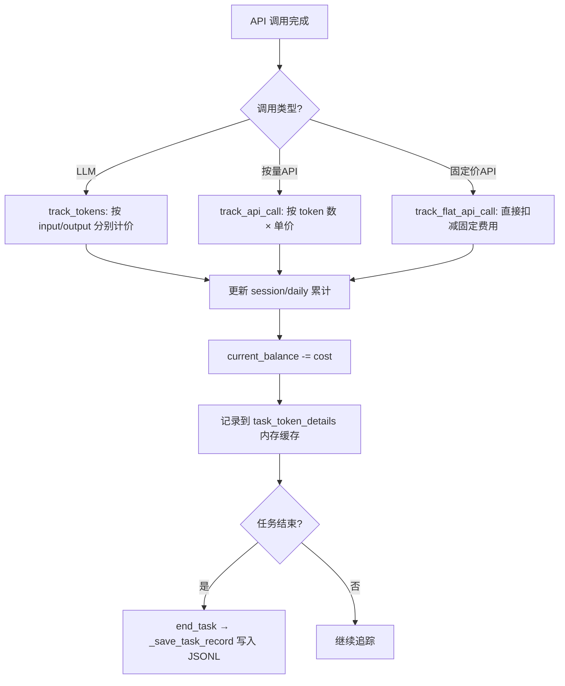
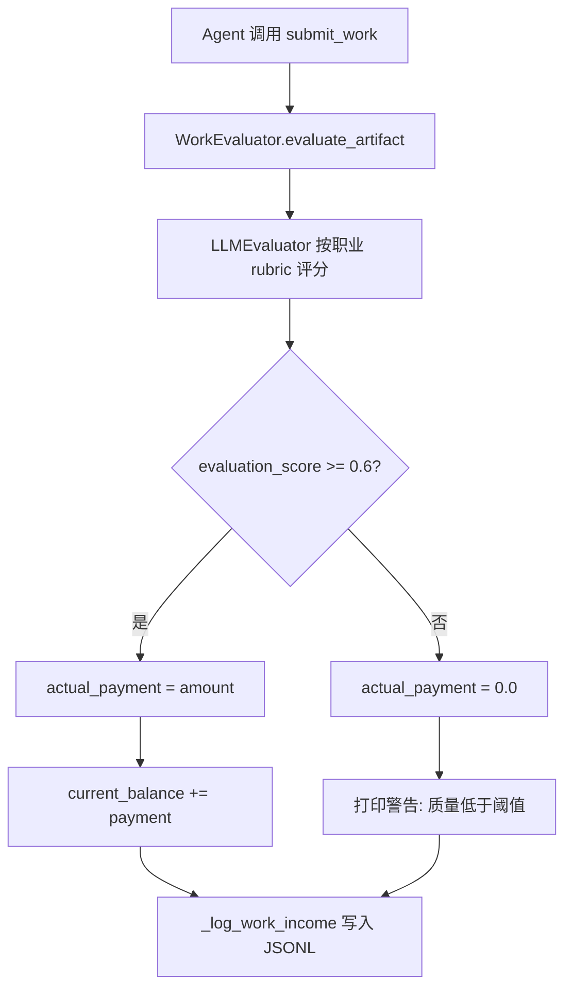

# PD-287.01 ClawWork — Agent 经济生存模拟系统

> 文档编号：PD-287.01
> 来源：ClawWork `livebench/agent/economic_tracker.py`, `livebench/agent/live_agent.py`, `livebench/prompts/live_agent_prompt.py`
> GitHub：https://github.com/HKUDS/ClawWork.git
> 问题域：PD-287 Agent 经济系统 Agent Economic System
> 状态：可复用方案

---

## 第 1 章 问题与动机

### 1.1 核心问题

当 Agent 可以无限制地调用 LLM 和外部 API 时，它缺乏对资源消耗的自我约束。这导致两个问题：(1) 运行成本不可控，Agent 可能在低价值任务上消耗大量 token；(2) Agent 无法学会"经济决策"——在有限资源下权衡质量与成本。

ClawWork 的 LiveBench 模块通过引入完整的经济生存模拟来解决这个问题：给 Agent 一个初始余额（$1000），每次 API 调用实时扣减成本，完成工作任务按质量评分发放收入，余额归零即"破产"停止运行。Agent 必须在收支之间博弈求生。

### 1.2 ClawWork 的解法概述

1. **EconomicTracker 实时记账**：每次 `track_tokens()` 调用立即从余额扣减成本，支持 LLM token 计费和 flat-rate API 计费两种模式（`economic_tracker.py:158-201`）
2. **四级生存状态机**：基于余额阈值划分 thriving(≥$500) / stable($100-$500) / struggling(<$100) / bankrupt(≤$0) 四个状态（`economic_tracker.py:524-538`）
3. **评分阈值支付**：工作收入不是无条件发放，而是要求 LLM 评估分数 ≥ 0.6 才支付，低于阈值则零收入（`economic_tracker.py:358-395`）
4. **经济状态注入 Prompt**：每个 session 开始时将余额、成本、生存状态注入系统 prompt，Agent 能"看到"自己的财务状况并据此决策（`live_agent_prompt.py:152-170`）
5. **三文件 JSONL 持久化**：balance.jsonl（每日快照）、token_costs.jsonl（每任务明细）、task_completions.jsonl（完成记录），支持断点续跑（`economic_tracker.py:52-54`）

### 1.3 设计思想

| 设计原则 | 具体实现 | 理由 | 替代方案 |
|----------|----------|------|----------|
| 实时扣减而非事后结算 | `track_tokens()` 在每次 API 调用后立即更新 `current_balance` | Agent 需要实时感知成本压力，事后结算无法影响当前决策 | 批量结算（延迟反馈，Agent 无法自我约束） |
| 悬崖式支付而非线性比例 | 评分 < 0.6 → 零收入，≥ 0.6 → 全额支付 | 激励 Agent 确保最低质量，避免提交垃圾工作 | 线性比例支付（低质量也能获得部分收入，缺乏约束力） |
| 状态注入而非外部监控 | 经济状态写入 system prompt | Agent 自主决策需要信息透明，外部监控无法改变 Agent 行为 | 仅日志记录（Agent 无感知） |
| 多通道成本分离 | llm_tokens / search_api / ocr_api / other_api 四通道 | 不同 API 价格差异大，分通道追踪才能精确分析成本结构 | 统一成本池（无法定位成本热点） |
| JSONL 追加写入 | 所有持久化文件使用 append-only JSONL | 支持断点续跑、避免写入冲突、便于流式分析 | SQLite（更复杂，单文件锁） |

---

## 第 2 章 源码实现分析

### 2.1 架构概览

ClawWork 的经济系统由四个核心组件构成，围绕 `EconomicTracker` 形成闭环：

```
┌─────────────────────────────────────────────────────────────┐
│                      LiveAgent 主循环                        │
│  run_daily_session(date)                                     │
│                                                              │
│  ┌──────────┐    ┌──────────────┐    ┌──────────────────┐   │
│  │TaskManager│───→│ EconomicTracker│←──│ SystemPrompt     │   │
│  │ 任务分配  │    │  实时记账      │    │ 经济状态注入     │   │
│  │ 定价查询  │    │  余额管理      │    │ 生存指导         │   │
│  └──────────┘    │  状态判定      │    └──────────────────┘   │
│                  └───────┬───────┘                            │
│                          │                                    │
│                  ┌───────▼───────┐                            │
│                  │ WorkEvaluator │                            │
│                  │ LLM 评分      │                            │
│                  │ 阈值支付      │                            │
│                  └───────────────┘                            │
│                                                              │
│  持久化层：                                                   │
│  ├── balance.jsonl          (每日余额快照)                    │
│  ├── token_costs.jsonl      (每任务成本明细 + 收入记录)       │
│  └── task_completions.jsonl (任务完成统计)                    │
└─────────────────────────────────────────────────────────────┘
```

### 2.2 核心实现

#### 2.2.1 EconomicTracker 实时成本追踪



对应源码 `livebench/agent/economic_tracker.py:158-201`：

```python
def track_tokens(self, input_tokens: int, output_tokens: int,
                 api_name: str = "agent", cost: Optional[float] = None) -> float:
    if cost is None:
        cost = (
            (input_tokens / 1_000_000.0) * self.input_token_price +
            (output_tokens / 1_000_000.0) * self.output_token_price
        )
    # Update session tracking
    self.session_input_tokens += input_tokens
    self.session_output_tokens += output_tokens
    self.session_cost += cost
    self.daily_cost += cost
    # Update task-level tracking
    if self.current_task_id:
        self.task_costs["llm_tokens"] += cost
        self.task_token_details["llm_calls"].append({
            "timestamp": datetime.now().isoformat(),
            "api_name": api_name,
            "input_tokens": input_tokens,
            "output_tokens": output_tokens,
            "cost": cost
        })
    # Update totals — 关键：实时扣减余额
    self.total_token_cost += cost
    self.current_balance -= cost
    return cost
```

特别值得注意的是 OpenRouter 集成（`economic_tracker.py:842-876`）：当使用 OpenRouter 时，直接采用其返回的 `cost` 字段而非本地计算，避免价格不一致：

```python
def track_response_tokens(response, economic_tracker, logger, is_openrouter, api_name="agent"):
    raw = response.response_metadata.get("token_usage")
    if raw and raw.get("prompt_tokens") and raw.get("completion_tokens"):
        input_tokens = raw["prompt_tokens"]
        output_tokens = raw["completion_tokens"]
    else:
        usage = response.usage_metadata
        input_tokens = usage["input_tokens"]
        output_tokens = usage["output_tokens"]
    openrouter_cost = raw.get("cost") if (is_openrouter and raw) else None
    economic_tracker.track_tokens(input_tokens, output_tokens,
                                  api_name=api_name, cost=openrouter_cost)
```

#### 2.2.2 评分阈值支付机制



对应源码 `livebench/agent/economic_tracker.py:358-395`：

```python
def add_work_income(self, amount: float, task_id: str,
                    evaluation_score: float, description: str = "") -> float:
    # 悬崖式支付：低于阈值直接零收入
    if evaluation_score < self.min_evaluation_threshold:
        actual_payment = 0.0
        print(f"⚠️  Work quality below threshold "
              f"(score: {evaluation_score:.2f} < {self.min_evaluation_threshold:.2f})")
    else:
        actual_payment = amount
        self.current_balance += actual_payment
        self.total_work_income += actual_payment
    self._log_work_income(task_id, amount, actual_payment, evaluation_score, description)
    return actual_payment
```

### 2.3 实现细节

#### 经济状态注入 Agent 上下文

LiveAgent 在每个 session 开始时，将完整经济状态注入系统 prompt（`live_agent_prompt.py:152-170`）：

```
📊 CURRENT ECONOMIC STATUS - {date}
   Status: {survival_status} {emoji}
   💰 Balance: ${balance:.2f}
   📈 Net Worth: ${net_worth:.2f}
   💸 Total Token Cost: ${total_token_cost:.2f}
   Session Cost So Far: ${session_cost:.4f}
   Daily Cost So Far: ${daily_cost:.4f}
```

并根据生存状态提供差异化指导（`live_agent_prompt.py:128-149`）：
- **bankrupt**: "You are BANKRUPT! Balance is zero or negative."
- **struggling**: "Your balance is critically low! Be extremely efficient..."
- **stable**: "Your balance is stable but not comfortable..."
- **thriving**: "Your balance is healthy! You have room to take calculated risks."

#### 任务定价与成本通道

TaskManager 从 `task_values.jsonl` 加载每个任务的定价（`task_manager.py:209-234`），不同任务的 `max_payment` 不同。EconomicTracker 按四个通道分别追踪成本（`economic_tracker.py:133-138`）：

```python
self.task_costs = {
    "llm_tokens": 0.0,    # LLM 调用成本
    "search_api": 0.0,    # 搜索 API（Jina/Tavily）
    "ocr_api": 0.0,       # OCR API
    "other_api": 0.0      # 其他 API
}
```

通道分类通过 API 名称关键词匹配实现（`economic_tracker.py:222-228`）：搜索类 API 匹配 "search"/"jina"/"tavily"，OCR 类匹配 "ocr"，其余归入 other_api。

#### 断点续跑机制

LiveAgent 通过 `_load_already_done()` 方法（`live_agent.py:895-932`）读取 `task_completions.jsonl`，恢复已完成任务集合和已使用日期集合，跳过已处理的任务。Exhaust 模式同样支持断点续跑（`live_agent.py:1023-1075`），从上次最后记录日期的下一天继续。

---

## 第 3 章 迁移指南

### 3.1 迁移清单

**阶段 1：核心记账（1 个文件）**
- [ ] 实现 `EconomicTracker` 类：初始余额、`track_tokens()`、`current_balance` 实时扣减
- [ ] 实现四级生存状态判定：`get_survival_status()` 基于余额阈值
- [ ] 实现 JSONL 持久化：`balance.jsonl` 每日快照

**阶段 2：收入评估（2 个文件）**
- [ ] 实现评分阈值支付：`add_work_income()` 带 `min_evaluation_threshold`
- [ ] 集成 LLM 评估器：对 Agent 提交的工作进行 0.0-1.0 评分
- [ ] 实现 `token_costs.jsonl` 每任务成本明细记录

**阶段 3：上下文注入（1 个文件）**
- [ ] 在 system prompt 中注入经济状态（余额、成本、状态）
- [ ] 根据生存状态提供差异化行为指导
- [ ] 注入 token 成本警告，促进 Agent 自我约束

**阶段 4：生命周期管理**
- [ ] 实现破产检测与 session 终止
- [ ] 实现断点续跑（从 JSONL 恢复状态）
- [ ] 实现成本分析 API（`get_cost_analytics()`）

### 3.2 适配代码模板

以下是一个可直接运行的最小经济追踪器实现：

```python
"""Minimal Agent Economic Tracker — 可直接复用"""
import json
from datetime import datetime
from pathlib import Path
from typing import Optional, Dict, List
from dataclasses import dataclass, field


@dataclass
class EconomicState:
    """Agent 经济状态快照"""
    balance: float
    total_cost: float
    total_income: float
    survival_status: str
    session_cost: float = 0.0


class AgentEconomicTracker:
    """
    Agent 经济追踪器 — 从 ClawWork 提炼的最小可用版本
    
    核心机制：
    1. 实时扣减：每次 API 调用立即从余额扣减
    2. 阈值支付：工作评分 >= threshold 才发放收入
    3. 四级状态：thriving/stable/struggling/bankrupt
    4. JSONL 持久化：支持断点续跑
    """
    
    SURVIVAL_THRESHOLDS = {
        "thriving": 500.0,   # balance >= 500
        "stable": 100.0,     # 100 <= balance < 500
        "struggling": 0.01,  # 0 < balance < 100
        "bankrupt": 0.0      # balance <= 0
    }
    
    def __init__(
        self,
        agent_id: str,
        initial_balance: float = 1000.0,
        input_price_per_1m: float = 2.5,
        output_price_per_1m: float = 10.0,
        payment_threshold: float = 0.6,
        data_dir: Optional[str] = None,
    ):
        self.agent_id = agent_id
        self.balance = initial_balance
        self.initial_balance = initial_balance
        self.input_price = input_price_per_1m
        self.output_price = output_price_per_1m
        self.payment_threshold = payment_threshold
        
        self.total_cost = 0.0
        self.total_income = 0.0
        self.session_cost = 0.0
        
        self.data_dir = Path(data_dir or f"./data/{agent_id}/economic")
        self.data_dir.mkdir(parents=True, exist_ok=True)
        self.balance_file = self.data_dir / "balance.jsonl"
    
    def track_llm_call(self, input_tokens: int, output_tokens: int,
                       cost_override: Optional[float] = None) -> float:
        """实时扣减 LLM 调用成本"""
        cost = cost_override or (
            (input_tokens / 1_000_000) * self.input_price +
            (output_tokens / 1_000_000) * self.output_price
        )
        self.balance -= cost
        self.total_cost += cost
        self.session_cost += cost
        return cost
    
    def add_work_income(self, amount: float, score: float) -> float:
        """悬崖式支付：评分 >= 阈值才发放全额"""
        if score < self.payment_threshold:
            return 0.0
        self.balance += amount
        self.total_income += amount
        return amount
    
    def get_status(self) -> str:
        """四级生存状态判定"""
        if self.balance <= 0:
            return "bankrupt"
        elif self.balance < 100:
            return "struggling"
        elif self.balance < 500:
            return "stable"
        return "thriving"
    
    def is_bankrupt(self) -> bool:
        return self.balance <= 0
    
    def get_state(self) -> EconomicState:
        return EconomicState(
            balance=self.balance,
            total_cost=self.total_cost,
            total_income=self.total_income,
            survival_status=self.get_status(),
            session_cost=self.session_cost,
        )
    
    def save_snapshot(self, date: str, **extra) -> None:
        """追加写入每日快照到 JSONL"""
        record = {
            "date": date,
            "balance": self.balance,
            "total_cost": self.total_cost,
            "total_income": self.total_income,
            "survival_status": self.get_status(),
            "session_cost": self.session_cost,
            **extra,
        }
        with open(self.balance_file, "a") as f:
            f.write(json.dumps(record) + "\n")
        self.session_cost = 0.0
    
    def load_state(self) -> bool:
        """从 JSONL 恢复最新状态（断点续跑）"""
        if not self.balance_file.exists():
            return False
        last_record = None
        with open(self.balance_file) as f:
            for line in f:
                last_record = json.loads(line)
        if last_record:
            self.balance = last_record["balance"]
            self.total_cost = last_record["total_cost"]
            self.total_income = last_record["total_income"]
            return True
        return False


def inject_economic_context(state: EconomicState) -> str:
    """生成注入 system prompt 的经济状态文本"""
    status_emoji = {
        "thriving": "💪", "stable": "👍",
        "struggling": "⚠️", "bankrupt": "💀"
    }
    guidance = {
        "thriving": "Balance healthy. You can take calculated risks.",
        "stable": "Balance stable. Be mindful of costs.",
        "struggling": "Balance critically low! Be extremely efficient.",
        "bankrupt": "BANKRUPT. Cannot continue.",
    }
    return f"""
📊 ECONOMIC STATUS
   Status: {state.survival_status.upper()} {status_emoji.get(state.survival_status, '❓')}
   💰 Balance: ${state.balance:.2f}
   💸 Total Cost: ${state.total_cost:.2f}
   Session Cost: ${state.session_cost:.4f}

{guidance.get(state.survival_status, '')}

⚠️ EVERY API CALL COSTS MONEY. Be efficient.
"""
```

### 3.3 适用场景

| 场景 | 适用度 | 说明 |
|------|--------|------|
| Agent Benchmark 经济约束 | ⭐⭐⭐ | 核心场景：评估 Agent 在资源约束下的表现 |
| 多 Agent 竞争模拟 | ⭐⭐⭐ | 每个 Agent 独立经济系统，比较生存能力 |
| LLM 成本控制 | ⭐⭐ | 可单独使用 EconomicTracker 做成本追踪 |
| Agent 自我约束训练 | ⭐⭐⭐ | 通过经济压力训练 Agent 高效使用资源 |
| 生产环境预算管理 | ⭐ | 需要额外的并发安全和持久化增强 |

---

## 第 4 章 测试用例

```python
"""基于 ClawWork EconomicTracker 真实签名的测试用例"""
import json
import tempfile
import os
import pytest


class TestEconomicTracker:
    """测试经济追踪器核心功能"""
    
    def setup_method(self):
        self.tmp_dir = tempfile.mkdtemp()
        # 使用迁移模板中的 AgentEconomicTracker
        from economic_tracker import AgentEconomicTracker
        self.tracker = AgentEconomicTracker(
            agent_id="test-agent",
            initial_balance=1000.0,
            input_price_per_1m=2.5,
            output_price_per_1m=10.0,
            payment_threshold=0.6,
            data_dir=self.tmp_dir,
        )
    
    def test_initial_state(self):
        """初始状态应为 thriving"""
        assert self.tracker.balance == 1000.0
        assert self.tracker.get_status() == "thriving"
        assert not self.tracker.is_bankrupt()
    
    def test_track_llm_call_deducts_balance(self):
        """LLM 调用应实时扣减余额"""
        cost = self.tracker.track_llm_call(
            input_tokens=1_000_000, output_tokens=100_000
        )
        # 1M input × $2.5/1M + 100K output × $10/1M = $2.5 + $1.0 = $3.5
        assert abs(cost - 3.5) < 0.01
        assert abs(self.tracker.balance - 996.5) < 0.01
    
    def test_cost_override_from_openrouter(self):
        """OpenRouter 返回的 cost 应直接使用"""
        cost = self.tracker.track_llm_call(
            input_tokens=500_000, output_tokens=50_000,
            cost_override=0.0042
        )
        assert cost == 0.0042
        assert abs(self.tracker.balance - (1000.0 - 0.0042)) < 0.0001
    
    def test_cliff_payment_above_threshold(self):
        """评分 >= 0.6 应获得全额支付"""
        payment = self.tracker.add_work_income(amount=50.0, score=0.75)
        assert payment == 50.0
        assert self.tracker.balance == 1050.0
    
    def test_cliff_payment_below_threshold(self):
        """评分 < 0.6 应获得零收入"""
        payment = self.tracker.add_work_income(amount=50.0, score=0.55)
        assert payment == 0.0
        assert self.tracker.balance == 1000.0  # 余额不变
    
    def test_survival_status_transitions(self):
        """生存状态应随余额变化正确转换"""
        assert self.tracker.get_status() == "thriving"  # $1000
        
        self.tracker.balance = 300.0
        assert self.tracker.get_status() == "stable"
        
        self.tracker.balance = 50.0
        assert self.tracker.get_status() == "struggling"
        
        self.tracker.balance = 0.0
        assert self.tracker.get_status() == "bankrupt"
        assert self.tracker.is_bankrupt()
        
        self.tracker.balance = -10.0
        assert self.tracker.get_status() == "bankrupt"
    
    def test_snapshot_persistence_and_restore(self):
        """JSONL 快照应支持断点续跑"""
        self.tracker.track_llm_call(500_000, 50_000)
        self.tracker.add_work_income(30.0, score=0.8)
        self.tracker.save_snapshot("2025-01-20")
        
        # 创建新 tracker 并恢复
        new_tracker = AgentEconomicTracker.__new__(AgentEconomicTracker)
        new_tracker.__init__(
            agent_id="test-agent",
            data_dir=self.tmp_dir,
        )
        assert new_tracker.load_state()
        assert abs(new_tracker.balance - self.tracker.balance) < 0.01
    
    def test_bankruptcy_stops_session(self):
        """破产后 is_bankrupt 应返回 True"""
        # 模拟大量 API 调用耗尽余额
        for _ in range(100):
            self.tracker.track_llm_call(1_000_000, 500_000)
        assert self.tracker.is_bankrupt()
        assert self.tracker.get_status() == "bankrupt"
```

---

## 第 5 章 跨域关联

| 关联域 | 关系类型 | 说明 |
|--------|----------|------|
| PD-01 上下文管理 | 协同 | 经济状态注入 system prompt 是上下文管理的一部分；token 成本追踪依赖上下文长度 |
| PD-03 容错与重试 | 协同 | LiveAgent 的 `_ainvoke_with_retry` 指数退避重试会产生额外成本，需要经济系统感知 |
| PD-07 质量检查 | 依赖 | 收入发放依赖 WorkEvaluator 的 LLM 评分结果，评分质量直接影响经济系统公平性 |
| PD-09 Human-in-the-Loop | 协同 | Agent 的 `decide_activity` 工具要求提供 reasoning（≥50字），是经济决策的人机交互点 |
| PD-11 可观测性 | 协同 | 三文件 JSONL 持久化（balance/token_costs/task_completions）本身就是可观测性基础设施 |
| PD-06 记忆持久化 | 协同 | Agent 的 learn 活动将知识存入 memory.jsonl，学习投资与工作收入构成经济博弈 |

---

## 第 6 章 来源文件索引

| 文件 | 行范围 | 关键实现 |
|------|--------|----------|
| `livebench/agent/economic_tracker.py` | L12-L78 | EconomicTracker 类定义与初始化 |
| `livebench/agent/economic_tracker.py` | L158-L201 | `track_tokens()` 实时成本扣减 |
| `livebench/agent/economic_tracker.py` | L246-L282 | `track_flat_api_call()` 固定价 API 计费 |
| `livebench/agent/economic_tracker.py` | L288-L356 | `_save_task_record()` 任务级成本汇总 |
| `livebench/agent/economic_tracker.py` | L358-L421 | `add_work_income()` 阈值支付 + 收入日志 |
| `livebench/agent/economic_tracker.py` | L476-L513 | `_save_balance_record()` 每日快照持久化 |
| `livebench/agent/economic_tracker.py` | L524-L542 | `get_survival_status()` 四级状态判定 |
| `livebench/agent/economic_tracker.py` | L577-L676 | `get_cost_analytics()` 多维成本分析 |
| `livebench/agent/economic_tracker.py` | L678-L732 | `record_task_completion()` 幂等任务完成记录 |
| `livebench/agent/economic_tracker.py` | L842-L876 | `track_response_tokens()` OpenRouter 成本适配 |
| `livebench/agent/live_agent.py` | L131-L137 | EconomicTracker 初始化与组件注入 |
| `livebench/agent/live_agent.py` | L504-L538 | `run_daily_session()` 破产检测与任务分配 |
| `livebench/agent/live_agent.py` | L634-L651 | 经济状态注入 system prompt |
| `livebench/agent/live_agent.py` | L723-L748 | submit_work 后的支付处理 |
| `livebench/agent/live_agent.py` | L851-L862 | 任务完成统计记录 |
| `livebench/agent/live_agent.py` | L895-L932 | `_load_already_done()` 断点续跑 |
| `livebench/agent/live_agent.py` | L991-L1143 | `run_exhaust_mode()` 穷举模式 |
| `livebench/prompts/live_agent_prompt.py` | L12-L399 | 完整 system prompt 生成（含经济状态注入） |
| `livebench/prompts/live_agent_prompt.py` | L128-L149 | 四级生存指导文本 |
| `livebench/prompts/live_agent_prompt.py` | L537-L557 | `format_cost_update()` 实时成本更新消息 |
| `livebench/work/evaluator.py` | L11-L54 | WorkEvaluator 初始化（强制 LLM 评估） |
| `livebench/work/evaluator.py` | L56-L147 | `evaluate_artifact()` 工件评估与支付判定 |
| `livebench/work/task_manager.py` | L209-L234 | `_load_task_values()` 任务定价加载 |
| `livebench/work/task_manager.py` | L302-L372 | `select_daily_task()` 任务选择与定价注入 |
| `livebench/configs/default_config.json` | L1-L36 | 经济参数配置（初始余额、token 定价） |
| `clawmode_integration/tools.py` | L29-L41 | ClawWorkState 共享状态（含 economic_tracker） |
| `clawmode_integration/tools.py` | L112-L245 | SubmitWorkTool 评估与支付流程 |
| `clawmode_integration/tools.py` | L326-L358 | GetStatusTool 经济状态查询 |

---

## 第 7 章 横向对比维度

```json comparison_data
{
  "project": "ClawWork",
  "dimensions": {
    "成本模型": "双费率 token 计价 + flat-rate API，支持 OpenRouter 直传成本",
    "收入机制": "悬崖式阈值支付：评分 ≥ 0.6 全额，< 0.6 零收入",
    "状态分级": "四级余额阈值：thriving/stable/struggling/bankrupt",
    "持久化方式": "三文件 JSONL append-only（balance + costs + completions）",
    "上下文注入": "system prompt 注入完整经济状态 + 分级生存指导",
    "成本通道": "四通道分离追踪：llm_tokens/search_api/ocr_api/other_api",
    "断点续跑": "从 task_completions.jsonl 恢复已完成任务集合"
  }
}
```

### 域元数据补充

```json domain_metadata
{
  "solution_summary": "ClawWork 用 EconomicTracker 实时扣减 + 四级生存状态机 + 悬崖式阈值支付 + system prompt 经济注入，构建完整 Agent 经济生存模拟",
  "description": "Agent 在有限预算下通过工作/学习博弈求生的经济模拟框架",
  "sub_problems": [
    "多通道成本分离追踪（LLM/搜索/OCR/其他）",
    "OpenRouter 等第三方计费适配",
    "穷举模式下的断点续跑与任务重试"
  ],
  "best_practices": [
    "根据生存状态在 prompt 中提供差异化行为指导",
    "使用 JSONL append-only 持久化支持断点续跑",
    "任务完成记录幂等写入（同 task_id 覆盖旧记录）"
  ]
}
```
