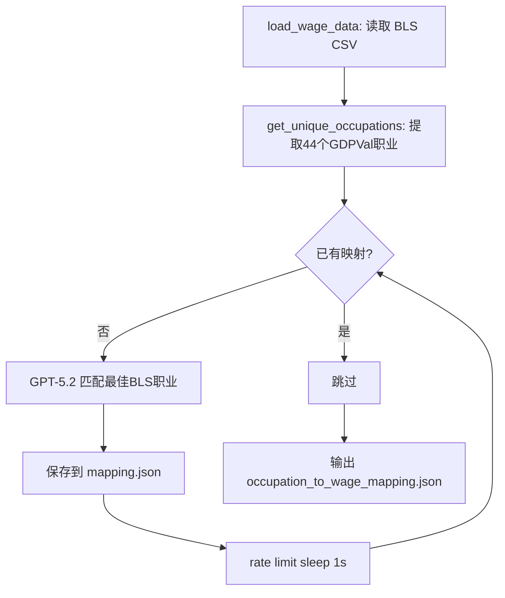
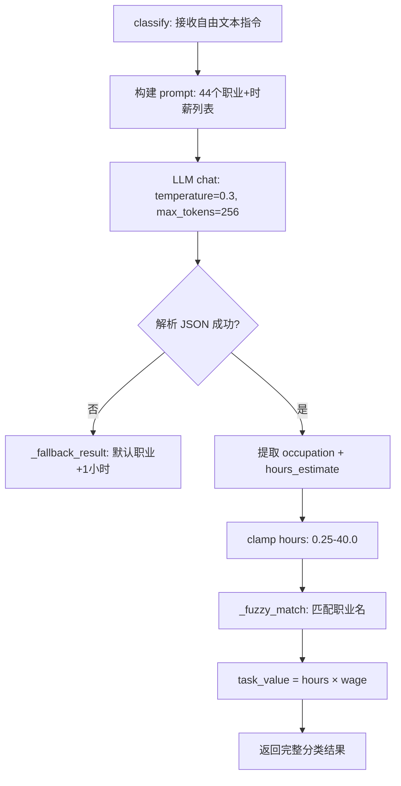

# PD-288.01 ClawWork — LLM 职业分类与 BLS 工资映射动态定价

> 文档编号：PD-288.01
> 来源：ClawWork `clawmode_integration/task_classifier.py` `scripts/calculate_task_values.py`
> GitHub：https://github.com/HKUDS/ClawWork.git
> 问题域：PD-288 任务分类与定价 Task Classification & Pricing
> 状态：可复用方案

---

## 第 1 章 问题与动机

### 1.1 核心问题

Agent 经济系统中，如何为自由文本形式的任务指令自动定价？传统做法是固定价格或人工标注，但面对数百种不同类型的任务（从写代码到做财务分析），固定价格既不公平也不准确。核心挑战在于：

1. **任务类型识别**：自由文本指令没有结构化标签，需要自动分类到可定价的类别
2. **价格锚定**：分类后需要有可靠的价格基准，不能凭空定价
3. **工时估算**：同一职业类别的任务复杂度差异巨大，需要动态估算工时
4. **容错降级**：LLM 分类可能失败或返回不在列表中的职业名，需要稳健的 fallback

### 1.2 ClawWork 的解法概述

ClawWork 采用"LLM 分类 + BLS 工资锚定 + 工时估算"三层架构实现动态任务定价：

1. **BLS 工资数据作为价格锚点**：从美国劳工统计局（BLS）获取 100+ 职业的时薪数据，用 GPT-5.2 将 GDPVal 数据集的 44 个职业映射到 BLS 标准职业分类，生成 `occupation_to_wage_mapping.json`（`scripts/calculate_task_values.py:142-199`）
2. **运行时 LLM 分类器**：`TaskClassifier` 接收自由文本指令，通过 LLM 将其分类到 44 个职业之一，同时估算工时（`clawmode_integration/task_classifier.py:90-149`）
3. **三级模糊匹配 fallback**：LLM 返回的职业名可能不精确，通过精确匹配 → 大小写无关匹配 → 子串匹配 → 默认 fallback 四级降级保证总能返回有效价格（`task_classifier.py:68-88`）
4. **双路径定价**：离线批量计算（`calculate_task_values.py`）产出 `task_values.jsonl` 供 `TaskManager` 加载；在线实时分类（`TaskClassifier.classify()`）供 `/clawwork` 命令使用
5. **经济闭环集成**：分类结果直接注入 Agent 的任务上下文，`max_payment` 字段驱动后续的工作评估和支付（`clawmode_integration/agent_loop.py:160-183`）

### 1.3 设计思想

| 设计原则 | 具体实现 | 理由 | 替代方案 |
|----------|----------|------|----------|
| 外部权威数据锚定 | BLS 时薪数据作为价格基准 | 避免主观定价，有统计学支撑 | 人工标注价格表、市场调研 |
| LLM 作为分类器 | GPT 将自由文本映射到职业类别 | 自然语言理解能力强，无需训练 | 传统 NLP 分类器、关键词匹配 |
| 离线+在线双路径 | 批量预计算 + 实时分类 | 批量场景高效，实时场景灵活 | 纯实时（成本高）、纯离线（不灵活） |
| 渐进式模糊匹配 | 精确→忽略大小写→子串→fallback | LLM 输出不可控，需多级容错 | 严格匹配+重试、embedding 相似度 |
| 价值=工时×时薪 | `task_value = hours_estimate * hourly_wage` | 符合劳动经济学直觉 | 固定价格、竞价机制、难度评分 |

---

## 第 2 章 源码实现分析

### 2.1 架构概览

ClawWork 的任务定价系统分为离线预计算和在线实时分类两条路径，共享同一份职业-工资映射表：

```
┌─────────────────────────────────────────────────────────────────┐
│                    离线预计算路径                                  │
│  BLS hourly_wage.csv ──→ GPT-5.2 职业匹配 ──→ mapping.json     │
│  task_hours.jsonl ─────→ hours × wage ──────→ task_values.jsonl │
└─────────────────────────────────────────────────────────────────┘
                              ↓ mapping.json
┌─────────────────────────────────────────────────────────────────┐
│                    在线实时分类路径                                │
│  /clawwork <instruction>                                        │
│       ↓                                                         │
│  TaskClassifier.classify()                                      │
│       ├─ LLM → {occupation, hours_estimate}                     │
│       ├─ _fuzzy_match(occupation) → (name, wage)                │
│       └─ task_value = hours × wage                              │
│       ↓                                                         │
│  ClawWorkAgentLoop._handle_clawwork()                           │
│       └─ synthetic task {max_payment: task_value}               │
└─────────────────────────────────────────────────────────────────┘
                              ↓ task_values.jsonl
┌─────────────────────────────────────────────────────────────────┐
│                    TaskManager 加载路径                           │
│  _load_task_values() → self.task_values[task_id] = value        │
│  select_daily_task() → task['max_payment'] = value              │
└─────────────────────────────────────────────────────────────────┘
```

### 2.2 核心实现

#### 2.2.1 离线职业匹配：BLS 工资数据 → 职业映射表



对应源码 `scripts/calculate_task_values.py:142-199`：

```python
def match_occupation_to_wage(
    gdpval_occupation: str,
    wage_data: List[Dict[str, str]]
) -> Optional[Dict[str, Any]]:
    """Use GPT-5.2 to match a GDPVal occupation to a BLS wage occupation"""
    global client
    if client is None:
        client = OpenAI(api_key=os.environ.get("OPENAI_API_KEY"))

    wage_titles = [w['occ_title'] for w in wage_data]
    prompt = create_occupation_matching_prompt(gdpval_occupation, wage_titles)

    response = client.chat.completions.create(
        model=MODEL,
        messages=[
            {"role": "system", "content": "You are an expert in occupational classification..."},
            {"role": "user", "content": prompt}
        ],
        response_format={"type": "json_object"}
    )

    result = json.loads(response.choices[0].message.content)
    matched_title = result['matched_bls_title']
    matched_wage = next((w for w in wage_data if w['occ_title'] == matched_title), None)

    if matched_wage:
        return {
            'gdpval_occupation': gdpval_occupation,
            'bls_occupation': matched_wage['occ_title'],
            'hourly_wage': matched_wage['h_mean'],
            'confidence': result['confidence'],
            'reasoning': result['reasoning'],
            'matched_at': datetime.now().isoformat(),
            'model': MODEL
        }
```

映射结果带有 `confidence` 字段（high/medium/low），记录匹配质量。例如 "Software Developers" 是 high confidence 精确匹配（$69.50/hr），而 "Concierges" 只能 low confidence 映射到 "Lodging Managers"（$37.24/hr）。

#### 2.2.2 运行时 LLM 分类器



对应源码 `clawmode_integration/task_classifier.py:90-149`：

```python
async def classify(self, instruction: str) -> dict[str, Any]:
    if not self._occupations:
        return self._fallback_result(instruction)

    occupation_list = "\n".join(
        f"- {name} (${wage:.2f}/hr)"
        for name, wage in sorted(self._occupations.items())
    )

    prompt = _CLASSIFICATION_PROMPT.format(
        occupation_list=occupation_list,
        instruction=instruction,
    )

    try:
        response = await self._provider.chat(
            messages=[{"role": "user", "content": prompt}],
            tools=None,
            temperature=0.3,
            max_tokens=256,
        )

        text = response.content.strip()
        if text.startswith("```"):
            text = text.split("\n", 1)[-1].rsplit("```", 1)[0].strip()

        parsed = json.loads(text)
        raw_occupation = parsed.get("occupation", "")
        hours = float(parsed.get("hours_estimate", 1.0))
        hours = max(0.25, min(40.0, hours))

        occupation, wage = self._fuzzy_match(raw_occupation)
        task_value = round(hours * wage, 2)

        return {
            "occupation": occupation,
            "hourly_wage": wage,
            "hours_estimate": hours,
            "task_value": task_value,
            "reasoning": reasoning,
        }
    except Exception as exc:
        logger.warning(f"Classification failed ({exc}), using fallback")
        return self._fallback_result(instruction)
```

关键设计点：
- **Prompt 中嵌入时薪**：`- Software Developers ($69.50/hr)` 格式让 LLM 同时看到职业名和价格，有助于更准确的分类
- **temperature=0.3**：低温度保证分类稳定性
- **max_tokens=256**：限制输出长度，避免 LLM 啰嗦
- **Markdown fence 剥离**：`task_classifier.py:126-127` 处理 LLM 可能包裹的 ` ```json ` 标记

### 2.3 实现细节

#### 三级模糊匹配（`task_classifier.py:68-88`）

这是整个分类系统的容错核心。LLM 返回的职业名可能与映射表中的名称不完全一致：

```python
def _fuzzy_match(self, name: str) -> tuple[str, float]:
    if not self._occupations:
        return _FALLBACK_OCCUPATION, _FALLBACK_WAGE

    # Level 1: 精确匹配
    if name in self._occupations:
        return name, self._occupations[name]

    # Level 2: 大小写无关匹配
    lower = name.lower()
    for occ, wage in self._occupations.items():
        if occ.lower() == lower:
            return occ, wage

    # Level 3: 子串匹配（双向）
    for occ, wage in self._occupations.items():
        if lower in occ.lower() or occ.lower() in lower:
            return occ, wage

    # Level 4: 默认 fallback
    return _FALLBACK_OCCUPATION, self._occupations.get(
        _FALLBACK_OCCUPATION, _FALLBACK_WAGE
    )
```

Fallback 默认值：`General and Operations Managers`，$64.00/hr — 选择中位数水平的管理类职业作为安全默认值。

#### TaskManager 价格注入（`livebench/work/task_manager.py:348-355`）

```python
# select_daily_task() 中的价格注入逻辑
task_id = task['task_id']
if task_id in self.task_values:
    task['max_payment'] = self.task_values[task_id]
else:
    task['max_payment'] = self.default_max_payment  # $50.00
```

#### /clawwork 命令集成（`clawmode_integration/agent_loop.py:141-248`）

`ClawWorkAgentLoop._handle_clawwork()` 将分类结果转化为 Agent 可执行的任务上下文：
- 构建 synthetic task dict，`max_payment = task_value`（`agent_loop.py:177`）
- 重写用户消息，注入职业、估值、工作流指引（`agent_loop.py:188-204`）
- 通过 `EconomicTracker.start_task()` 开始成本追踪（`agent_loop.py:224`）

---

## 第 3 章 迁移指南

### 3.1 迁移清单

**阶段 1：数据准备**
- [ ] 获取目标领域的职业/角色分类体系（不一定是 BLS，可以是内部角色表）
- [ ] 为每个角色确定基准价格（时薪、单价或难度系数）
- [ ] 生成 `occupation_to_wage_mapping.json` 格式的映射文件

**阶段 2：分类器实现**
- [ ] 实现 `TaskClassifier` 类，加载映射表
- [ ] 编写分类 prompt，将职业列表嵌入 prompt
- [ ] 实现模糊匹配 fallback 链
- [ ] 配置 fallback 默认职业和价格

**阶段 3：集成**
- [ ] 在 Agent 入口处调用分类器
- [ ] 将 `task_value` 注入任务上下文
- [ ] 连接到支付/评估系统

### 3.2 适配代码模板

以下模板可直接复用，替换职业映射数据即可：

```python
"""通用任务分类与定价模块 — 从 ClawWork 迁移"""

import json
from pathlib import Path
from typing import Any, Optional

FALLBACK_ROLE = "General Assistant"
FALLBACK_RATE = 50.0

CLASSIFICATION_PROMPT = """\
You are a task classifier. Given a task instruction:
1. Pick the single best-fit role from the list below.
2. Estimate hours needed (0.25–40).
3. Return ONLY valid JSON.

Roles (with hourly rates):
{role_list}

Task instruction:
{instruction}

Respond: {{"role": "<exact role name>", "hours_estimate": <number>, "reasoning": "<one sentence>"}}"""


class TaskPricer:
    """Classifies tasks and calculates value based on role-rate mapping."""

    def __init__(self, llm_client: Any, mapping_path: str):
        self._llm = llm_client
        self._roles: dict[str, float] = {}
        self._load_mapping(mapping_path)

    def _load_mapping(self, path: str) -> None:
        data = json.loads(Path(path).read_text())
        for entry in data:
            name = entry.get("role", "")
            rate = entry.get("hourly_rate")
            if name and rate:
                self._roles[name] = float(rate)

    def _fuzzy_match(self, name: str) -> tuple[str, float]:
        # Level 1: exact
        if name in self._roles:
            return name, self._roles[name]
        # Level 2: case-insensitive
        lower = name.lower()
        for role, rate in self._roles.items():
            if role.lower() == lower:
                return role, rate
        # Level 3: substring
        for role, rate in self._roles.items():
            if lower in role.lower() or role.lower() in lower:
                return role, rate
        # Level 4: fallback
        return FALLBACK_ROLE, self._roles.get(FALLBACK_ROLE, FALLBACK_RATE)

    async def price(self, instruction: str) -> dict[str, Any]:
        role_list = "\n".join(
            f"- {name} (${rate:.2f}/hr)"
            for name, rate in sorted(self._roles.items())
        )
        prompt = CLASSIFICATION_PROMPT.format(
            role_list=role_list, instruction=instruction
        )

        try:
            response = await self._llm.chat(prompt, temperature=0.3, max_tokens=256)
            parsed = json.loads(response.strip().strip("`").strip())
            role_name = parsed.get("role", "")
            hours = max(0.25, min(40.0, float(parsed.get("hours_estimate", 1.0))))
            role, rate = self._fuzzy_match(role_name)
            value = round(hours * rate, 2)
            return {
                "role": role, "hourly_rate": rate,
                "hours_estimate": hours, "task_value": value,
                "reasoning": parsed.get("reasoning", ""),
            }
        except Exception:
            rate = self._roles.get(FALLBACK_ROLE, FALLBACK_RATE)
            return {
                "role": FALLBACK_ROLE, "hourly_rate": rate,
                "hours_estimate": 1.0, "task_value": round(rate, 2),
                "reasoning": "Fallback classification",
            }
```

### 3.3 适用场景

| 场景 | 适用度 | 说明 |
|------|--------|------|
| Agent 经济系统（任务定价） | ⭐⭐⭐ | 核心场景，直接复用 |
| 自由职业平台（自动报价） | ⭐⭐⭐ | 替换 BLS 数据为平台历史报价 |
| 内部工单系统（优先级排序） | ⭐⭐ | 用价值估算辅助优先级决策 |
| 教育平台（作业难度评估） | ⭐⭐ | 替换职业为学科，时薪为难度系数 |
| 固定价格产品 | ⭐ | 不适用，无需动态定价 |

---

## 第 4 章 测试用例

基于 ClawWork 真实函数签名的测试代码（参考 `scripts/test_task_value_integration.py`）：

```python
import json
import pytest
from unittest.mock import AsyncMock, MagicMock, patch
from pathlib import Path


class TestTaskClassifier:
    """测试 TaskClassifier 核心功能"""

    @pytest.fixture
    def mock_provider(self):
        provider = AsyncMock()
        return provider

    @pytest.fixture
    def sample_mapping(self, tmp_path):
        mapping = [
            {"gdpval_occupation": "Software Developers", "hourly_wage": 69.50},
            {"gdpval_occupation": "Financial Managers", "hourly_wage": 86.76},
            {"gdpval_occupation": "General and Operations Managers", "hourly_wage": 64.0},
        ]
        path = tmp_path / "mapping.json"
        path.write_text(json.dumps(mapping))
        return path

    def test_fuzzy_match_exact(self, mock_provider, sample_mapping):
        """精确匹配应返回正确职业和工资"""
        with patch("clawmode_integration.task_classifier._WAGE_MAPPING_PATH", sample_mapping):
            from clawmode_integration.task_classifier import TaskClassifier
            classifier = TaskClassifier(mock_provider)
            name, wage = classifier._fuzzy_match("Software Developers")
            assert name == "Software Developers"
            assert wage == 69.50

    def test_fuzzy_match_case_insensitive(self, mock_provider, sample_mapping):
        """大小写无关匹配"""
        with patch("clawmode_integration.task_classifier._WAGE_MAPPING_PATH", sample_mapping):
            from clawmode_integration.task_classifier import TaskClassifier
            classifier = TaskClassifier(mock_provider)
            name, wage = classifier._fuzzy_match("software developers")
            assert name == "Software Developers"
            assert wage == 69.50

    def test_fuzzy_match_substring(self, mock_provider, sample_mapping):
        """子串匹配"""
        with patch("clawmode_integration.task_classifier._WAGE_MAPPING_PATH", sample_mapping):
            from clawmode_integration.task_classifier import TaskClassifier
            classifier = TaskClassifier(mock_provider)
            name, wage = classifier._fuzzy_match("Software")
            assert name == "Software Developers"

    def test_fuzzy_match_fallback(self, mock_provider, sample_mapping):
        """无匹配时 fallback 到默认职业"""
        with patch("clawmode_integration.task_classifier._WAGE_MAPPING_PATH", sample_mapping):
            from clawmode_integration.task_classifier import TaskClassifier
            classifier = TaskClassifier(mock_provider)
            name, wage = classifier._fuzzy_match("Underwater Basket Weaver")
            assert name == "General and Operations Managers"
            assert wage == 64.0

    @pytest.mark.asyncio
    async def test_classify_normal(self, mock_provider, sample_mapping):
        """正常分类路径"""
        mock_response = MagicMock()
        mock_response.content = json.dumps({
            "occupation": "Software Developers",
            "hours_estimate": 2.5,
            "reasoning": "This is a coding task"
        })
        mock_provider.chat.return_value = mock_response

        with patch("clawmode_integration.task_classifier._WAGE_MAPPING_PATH", sample_mapping):
            from clawmode_integration.task_classifier import TaskClassifier
            classifier = TaskClassifier(mock_provider)
            result = await classifier.classify("Write a Python web scraper")

            assert result["occupation"] == "Software Developers"
            assert result["hours_estimate"] == 2.5
            assert result["hourly_wage"] == 69.50
            assert result["task_value"] == round(2.5 * 69.50, 2)

    @pytest.mark.asyncio
    async def test_classify_hours_clamped(self, mock_provider, sample_mapping):
        """工时估算应被 clamp 到 [0.25, 40.0]"""
        mock_response = MagicMock()
        mock_response.content = json.dumps({
            "occupation": "Software Developers",
            "hours_estimate": 100,
            "reasoning": "Huge task"
        })
        mock_provider.chat.return_value = mock_response

        with patch("clawmode_integration.task_classifier._WAGE_MAPPING_PATH", sample_mapping):
            from clawmode_integration.task_classifier import TaskClassifier
            classifier = TaskClassifier(mock_provider)
            result = await classifier.classify("Build an entire OS")
            assert result["hours_estimate"] == 40.0

    @pytest.mark.asyncio
    async def test_classify_llm_failure_fallback(self, mock_provider, sample_mapping):
        """LLM 调用失败时应 fallback"""
        mock_provider.chat.side_effect = Exception("API error")

        with patch("clawmode_integration.task_classifier._WAGE_MAPPING_PATH", sample_mapping):
            from clawmode_integration.task_classifier import TaskClassifier
            classifier = TaskClassifier(mock_provider)
            result = await classifier.classify("Do something")

            assert result["occupation"] == "General and Operations Managers"
            assert result["hours_estimate"] == 1.0
            assert result["reasoning"] == "Fallback classification"


class TestTaskManagerPricing:
    """测试 TaskManager 的价格加载和注入"""

    def test_load_task_values(self, tmp_path):
        """验证 task_values.jsonl 正确加载"""
        values_file = tmp_path / "task_values.jsonl"
        values_file.write_text(
            '{"task_id": "t1", "task_value_usd": 157.36}\n'
            '{"task_id": "t2", "task_value_usd": 82.78}\n'
        )
        from livebench.work.task_manager import TaskManager
        tm = TaskManager(
            task_source_type="inline",
            inline_tasks=[
                {"task_id": "t1", "sector": "Tech", "occupation": "Dev", "prompt": "test"},
            ],
            task_values_path=str(values_file),
        )
        tm.load_tasks()
        assert tm.task_values["t1"] == 157.36
        assert tm.task_values["t2"] == 82.78

    def test_default_payment_fallback(self):
        """无 task_values 时使用默认支付"""
        from livebench.work.task_manager import TaskManager
        tm = TaskManager(
            task_source_type="inline",
            inline_tasks=[
                {"task_id": "t1", "sector": "Tech", "occupation": "Dev", "prompt": "test"},
            ],
            default_max_payment=50.0,
        )
        tm.load_tasks()
        task = tm.select_daily_task(date="2025-01-01")
        assert task["max_payment"] == 50.0
```

---

## 第 5 章 跨域关联

| 关联域 | 关系类型 | 说明 |
|--------|----------|------|
| PD-01 上下文管理 | 协同 | 分类 prompt 中嵌入 44 个职业+时薪列表，占用约 2K tokens，需要上下文预算管理 |
| PD-03 容错与重试 | 依赖 | TaskClassifier 的 fallback 机制本质是容错设计：LLM 失败→默认分类，模糊匹配→默认职业 |
| PD-04 工具系统 | 协同 | 分类结果通过 ClawWorkAgentLoop 注入 Agent 工具上下文，驱动 submit_work 等经济工具 |
| PD-11 可观测性 | 协同 | EconomicTracker 追踪每次分类的成本（token 消耗），分类结果记录到 JSONL 任务日志 |
| PD-287 Agent 经济系统 | 强依赖 | 任务定价是经济系统的输入端，`max_payment` 直接驱动 Agent 的收支平衡和生存状态 |
| PD-289 多模态制品评估 | 协同 | 定价结果（`max_payment`）作为评估的支付上限，评估质量决定实际支付比例 |

---

## 第 6 章 来源文件索引

| 文件 | 行范围 | 关键实现 |
|------|--------|----------|
| `clawmode_integration/task_classifier.py` | L1-166 | TaskClassifier 完整实现：分类 prompt、LLM 调用、模糊匹配、fallback |
| `clawmode_integration/task_classifier.py` | L23-36 | `_CLASSIFICATION_PROMPT` 分类提示词模板 |
| `clawmode_integration/task_classifier.py` | L68-88 | `_fuzzy_match()` 三级模糊匹配 |
| `clawmode_integration/task_classifier.py` | L90-149 | `classify()` 核心分类方法 |
| `clawmode_integration/agent_loop.py` | L70 | TaskClassifier 实例化 |
| `clawmode_integration/agent_loop.py` | L141-248 | `_handle_clawwork()` 命令处理与任务注入 |
| `clawmode_integration/agent_loop.py` | L160 | 调用 `self._classifier.classify(instruction)` |
| `clawmode_integration/agent_loop.py` | L172-181 | 构建 synthetic task dict |
| `scripts/calculate_task_values.py` | L89-140 | `create_occupation_matching_prompt()` GPT-5.2 职业匹配 prompt |
| `scripts/calculate_task_values.py` | L142-199 | `match_occupation_to_wage()` 离线职业匹配 |
| `scripts/calculate_task_values.py` | L237-290 | `calculate_task_values()` 批量价值计算 |
| `scripts/task_value_estimates/occupation_to_wage_mapping.json` | 全文 | 44 个职业→BLS 工资映射表 |
| `livebench/work/task_manager.py` | L209-235 | `_load_task_values()` 加载 JSONL 价格数据 |
| `livebench/work/task_manager.py` | L348-355 | `select_daily_task()` 中的 max_payment 注入 |
| `scripts/test_task_value_integration.py` | L1-223 | 集成测试：加载、fallback、评估器、文件结构 |

---

## 第 7 章 横向对比维度

```json comparison_data
{
  "project": "ClawWork",
  "dimensions": {
    "分类方法": "LLM 将自由文本分类到44个BLS职业类别",
    "价格锚定": "美国劳工统计局(BLS)真实时薪数据",
    "工时估算": "LLM 同步输出 hours_estimate，clamp 到 0.25-40h",
    "模糊匹配": "四级降级：精确→忽略大小写→子串→默认fallback",
    "双路径定价": "离线批量预计算 + 在线实时LLM分类",
    "置信度追踪": "映射表记录 high/medium/low confidence 和 reasoning"
  }
}
```

### 域元数据补充

```json domain_metadata
{
  "solution_summary": "ClawWork 用 LLM 将自由文本指令分类到44个BLS职业类别，结合真实时薪数据和工时估算实现 task_value=hours×wage 动态定价，支持四级模糊匹配 fallback",
  "description": "Agent 经济系统中基于劳动经济学原理的自动化任务估值",
  "sub_problems": [
    "离线批量预计算与在线实时分类的双路径协调",
    "BLS 等外部权威数据源的职业映射置信度管理"
  ],
  "best_practices": [
    "在分类 prompt 中同时展示职业名和时薪帮助 LLM 理解价格语境",
    "用 temperature=0.3 + max_tokens=256 约束分类输出的稳定性和简洁性"
  ]
}
```
