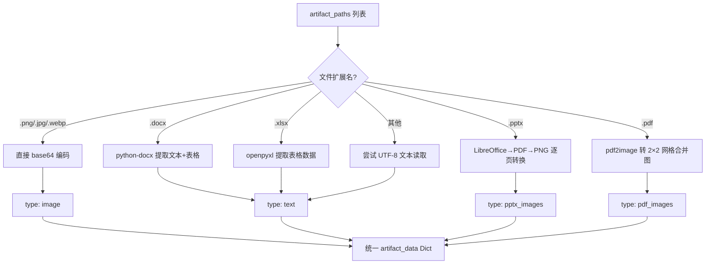
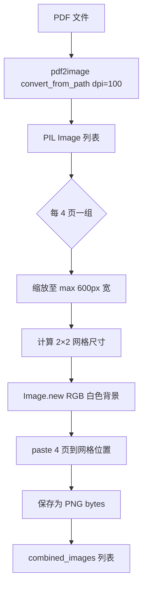

# PD-289.01 ClawWork — 多模态产物 LLM 评估与经济门控

> 文档编号：PD-289.01
> 来源：ClawWork `livebench/work/llm_evaluator.py`, `livebench/tools/productivity/file_reading.py`
> GitHub：https://github.com/HKUDS/ClawWork.git
> 问题域：PD-289 多模态产物评估 Multimodal Artifact Evaluation
> 状态：可复用方案

---

## 第 1 章 问题与动机

### 1.1 核心问题

Agent 生成的工作产物不仅仅是文本——它们可能是 DOCX 报告、XLSX 数据表、PPTX 演示文稿、PDF 文档、甚至图片。传统的文本匹配或规则评估无法处理这些多模态产物。核心挑战在于：

1. **格式多样性**：Agent 输出涵盖 7+ 种文件格式，每种需要不同的解析策略
2. **视觉内容评估**：PPTX 的排版质量、图片的视觉效果无法通过纯文本评估
3. **领域专属标准**：44 个不同职业（Software Developer vs Financial Analyst vs Nurse）对产物质量的评判标准完全不同
4. **评分一致性**：需要可复现的、结构化的评分体系，而非主观判断
5. **经济激励对齐**：评估分数需要直接关联支付决策，形成闭环激励

### 1.2 ClawWork 的解法概述

ClawWork 构建了一个完整的多模态评估管道，核心设计：

1. **文件→图片转换管道**：PPTX 通过 LibreOffice→PDF→PNG 两步转换，PDF 通过 pdf2image 转换为 2×2 网格合并图（4 页/张），直接送入 VLM 视觉评估 (`file_reading.py:291-374`)
2. **46 个职业专属 rubric**：每个职业有独立的 JSON 评分标准，包含 4 维加权评分（completeness 40% + correctness 30% + quality 20% + domain_standards 10%）(`eval/meta_prompts/Software_Developers.json`)
3. **多模态 OpenAI API 调用**：将文本内容和 base64 图片组装为 content array，通过 GPT-4o 的 vision 能力进行视觉+文本联合评估 (`llm_evaluator.py:514-647`)
4. **0.6 分经济门控**：评估分数低于 0.6 则不发放任何报酬，形成质量-收入闭环 (`economic_tracker.py:381-395`)
5. **无降级设计**：LLM 评估失败直接抛异常，不提供启发式 fallback，确保评估质量底线 (`evaluator.py:43-47`)

### 1.3 设计思想

| 设计原则 | 具体实现 | 理由 | 替代方案 |
|----------|----------|------|----------|
| 视觉优先 | PPTX/PDF 转图片而非提取文本 | 排版、图表、视觉设计只有图片才能评估 | 纯文本提取（丢失视觉信息） |
| 领域专属 | 46 个职业各有独立 rubric JSON | 不同职业对"好"的定义完全不同 | 通用评分标准（无法区分领域差异） |
| 经济闭环 | 0.6 分门控 + 线性支付 | 低质量产物零收入，激励 Agent 提升质量 | 固定支付（无质量激励） |
| 严格无降级 | LLM 失败直接 raise，无 fallback | 启发式评估质量不可控，宁可失败也不误判 | 启发式 fallback（评分不一致） |
| 成本优化 | PDF 4 页合并为 1 张 2×2 网格图 | 减少 API 调用次数和 token 消耗 | 每页单独发送（成本 4 倍） |

---

## 第 2 章 源码实现分析

### 2.1 架构概览

ClawWork 的多模态评估系统由三层组成：

```
┌─────────────────────────────────────────────────────────────┐
│                    SubmitWorkTool                            │
│  clawmode_integration/tools.py:220                          │
│  收集产物路径 → 调用评估 → 记录经济数据                        │
└──────────────────────┬──────────────────────────────────────┘
                       │
┌──────────────────────▼──────────────────────────────────────┐
│                   WorkEvaluator                              │
│  livebench/work/evaluator.py:11                             │
│  验证产物存在 → 委托 LLM 评估 → 记录 JSONL 日志              │
└──────────────────────┬──────────────────────────────────────┘
                       │
┌──────────────────────▼──────────────────────────────────────┐
│                  LLMEvaluator                                │
│  livebench/work/llm_evaluator.py:20                         │
│  ┌──────────┐  ┌──────────────┐  ┌────────────────────┐     │
│  │MetaPrompt│  │ArtifactReader│  │MultimodalBuilder   │     │
│  │  Cache   │  │ (7 formats)  │  │(text+image content)│     │
│  └────┬─────┘  └──────┬───────┘  └─────────┬──────────┘     │
│       │               │                     │                │
│       └───────────────┼─────────────────────┘                │
│                       ▼                                      │
│              GPT-4o Vision API                               │
│              → Score Extraction                              │
│              → Normalization (0-10 → 0.0-1.0)               │
└──────────────────────┬──────────────────────────────────────┘
                       │
┌──────────────────────▼──────────────────────────────────────┐
│                EconomicTracker                               │
│  livebench/agent/economic_tracker.py:12                     │
│  0.6 门控 → 支付/拒付 → JSONL 记录                           │
└─────────────────────────────────────────────────────────────┘
```

### 2.2 核心实现

#### 2.2.1 多格式产物读取与图片转换



对应源码 `livebench/work/llm_evaluator.py:374-512`：

```python
def _read_artifacts_with_images(self, artifact_paths: list[str], max_size_kb: int = 2000) -> Dict[str, Dict[str, Union[str, bytes]]]:
    artifacts = {}
    for path in artifact_paths:
        file_size = os.path.getsize(path)
        file_ext = os.path.splitext(path)[1].lower()

        if file_size > max_size_kb * 1024:
            raise RuntimeError(f"File too large: {file_size} bytes (>{max_size_kb}KB)")
        if file_size == 0:
            raise ValueError(f"Empty file submitted for evaluation: {path}")

        if file_ext in ['.png', '.jpg', '.jpeg', '.gif', '.webp']:
            with open(path, 'rb') as f:
                image_data = f.read()
            artifacts[path] = {'type': 'image', 'format': file_ext[1:], 'data': image_data, 'size': file_size}

        elif file_ext == '.pptx':
            from livebench.tools.productivity.file_reading import read_pptx_as_images
            pptx_images = read_pptx_as_images(Path(path))
            if not pptx_images:
                raise RuntimeError(f"PPTX conversion failed for {path}.")
            artifacts[path] = {'type': 'pptx_images', 'images': pptx_images, 'slide_count': len(pptx_images)}

        elif file_ext == '.pdf':
            from livebench.tools.productivity.file_reading import read_pdf_as_images
            pdf_images = read_pdf_as_images(Path(path))
            if not pdf_images:
                raise RuntimeError(f"PDF conversion failed for {path}.")
            artifacts[path] = {'type': 'pdf_images', 'images': pdf_images, 'image_count': len(pdf_images)}
    return artifacts
```

#### 2.2.2 PDF 4 页合并为 2×2 网格图



对应源码 `livebench/tools/productivity/file_reading.py:377-463`：

```python
def read_pdf_as_images(pdf_path: Path) -> Optional[List[bytes]]:
    images = convert_from_path(str(pdf_path), dpi=100)
    combined_images = []
    pages_per_image = 4

    for i in range(0, len(images), pages_per_image):
        batch = images[i:i + pages_per_image]
        max_width = 600
        resized_batch = []
        for img in batch:
            if img.width > max_width:
                ratio = max_width / img.width
                new_height = int(img.height * ratio)
                img = img.resize((max_width, new_height), Image.Resampling.LANCZOS)
            resized_batch.append(img)

        cols = 2
        rows = (len(resized_batch) + cols - 1) // cols
        max_page_width = max(img.width for img in resized_batch)
        max_page_height = max(img.height for img in resized_batch)
        combined = Image.new('RGB', (max_page_width * cols, max_page_height * rows), 'white')

        for idx, img in enumerate(resized_batch):
            row = idx // cols
            col = idx % cols
            combined.paste(img, (col * max_page_width, row * max_page_height))

        buf = BytesIO()
        combined.save(buf, format='PNG', optimize=True)
        combined_images.append(buf.getvalue())
    return combined_images
```

### 2.3 实现细节

#### 多模态 content array 构建

`_build_multimodal_evaluation_content` (`llm_evaluator.py:514-647`) 将文本和图片组装为 OpenAI 多模态 API 格式：

- 文本部分：包含 rubric、task prompt、metadata、agent description
- 图片部分：每张图片作为独立的 `image_url` content block，`detail: "high"` 请求高分辨率分析
- PPTX 每页幻灯片作为独立图片发送
- PDF 每个 2×2 合并图作为独立图片发送

#### 评分提取与归一化

`_extract_score` (`llm_evaluator.py:742-780`) 使用 4 级正则匹配：
1. `OVERALL SCORE: X` → 首选
2. `Overall Score: X` → 备选
3. `Score: X/10` → 兼容格式
4. `Final Score: X` → 兜底

所有分数 clamp 到 [0, 10]，然后 `/10.0` 归一化到 [0.0, 1.0]。未匹配时默认 5.0。

#### 职业 rubric 缓存

`_load_meta_prompt` (`llm_evaluator.py:197-232`) 使用内存字典缓存已加载的 rubric JSON，避免重复磁盘 IO。职业名通过 `replace(' ', '_').replace(',', '')` 归一化后匹配文件名。

#### 评估 API 配置隔离

`LLMEvaluator.__init__` (`llm_evaluator.py:26-70`) 支持独立的评估 API 配置：
- `EVALUATION_API_KEY` 优先于 `OPENAI_API_KEY`
- `EVALUATION_API_BASE` 优先于 `OPENAI_API_BASE`
- `EVALUATION_MODEL` 可覆盖默认模型

这允许评估使用与 Agent 推理不同的 LLM 提供商。

---

## 第 3 章 迁移指南

### 3.1 迁移清单

**阶段 1：文件解析层（1-2 天）**
- [ ] 安装系统依赖：`libreoffice`, `poppler-utils`
- [ ] 安装 Python 依赖：`pdf2image`, `Pillow`, `python-docx`, `openpyxl`
- [ ] 实现 `ArtifactReader` 类，支持 7 种格式的统一读取接口
- [ ] 实现 PPTX→PDF→PNG 转换管道（LibreOffice headless 模式）
- [ ] 实现 PDF 4 页合并为 2×2 网格图的优化策略

**阶段 2：评估引擎（1-2 天）**
- [ ] 设计领域专属 rubric JSON schema
- [ ] 实现 rubric 加载器（带内存缓存）
- [ ] 实现多模态 content array 构建器（text + image_url blocks）
- [ ] 实现评分提取器（多模式正则匹配 + clamp + 归一化）
- [ ] 对接 OpenAI/兼容 API 的 vision 能力

**阶段 3：经济集成（可选）**
- [ ] 实现评估分数门控（如 0.6 阈值）
- [ ] 实现 JSONL 评估日志记录
- [ ] 对接支付/激励系统

### 3.2 适配代码模板

以下是一个可直接复用的多模态产物评估器骨架：

```python
"""Multimodal Artifact Evaluator — 从 ClawWork 迁移的核心模式"""

import base64
import json
import os
import re
import subprocess
import tempfile
from io import BytesIO
from pathlib import Path
from typing import Dict, List, Optional, Tuple, Union

from PIL import Image
from pdf2image import convert_from_path


class ArtifactReader:
    """统一的多格式产物读取器"""

    SUPPORTED_FORMATS = {'.png', '.jpg', '.jpeg', '.gif', '.webp',
                         '.docx', '.xlsx', '.pptx', '.pdf', '.txt'}

    def read(self, path: str, max_size_kb: int = 2000) -> Dict[str, Union[str, bytes, list]]:
        ext = os.path.splitext(path)[1].lower()
        size = os.path.getsize(path)

        if size > max_size_kb * 1024:
            raise RuntimeError(f"File too large: {size} bytes")
        if size == 0:
            raise ValueError(f"Empty file: {path}")

        if ext in {'.png', '.jpg', '.jpeg', '.gif', '.webp'}:
            return self._read_image(path, ext)
        elif ext == '.pptx':
            return self._read_pptx(path)
        elif ext == '.pdf':
            return self._read_pdf(path)
        elif ext == '.docx':
            return self._read_docx(path)
        elif ext == '.xlsx':
            return self._read_xlsx(path)
        else:
            return self._read_text(path)

    def _read_image(self, path: str, ext: str) -> dict:
        with open(path, 'rb') as f:
            return {'type': 'image', 'format': ext[1:], 'data': f.read()}

    def _read_pptx(self, path: str) -> dict:
        """PPTX → LibreOffice → PDF → PNG per slide"""
        tmp = tempfile.mkdtemp()
        try:
            subprocess.run(
                ['libreoffice', '--headless', '--convert-to', 'pdf', '--outdir', tmp, path],
                capture_output=True, timeout=30, check=True
            )
            pdf_path = os.path.join(tmp, Path(path).stem + '.pdf')
            images = convert_from_path(pdf_path, dpi=150)
            return {
                'type': 'pptx_images',
                'images': [self._pil_to_png_bytes(img, max_width=1200) for img in images]
            }
        finally:
            import shutil; shutil.rmtree(tmp, ignore_errors=True)

    def _read_pdf(self, path: str, pages_per_grid: int = 4) -> dict:
        """PDF → 2×2 grid combined images"""
        images = convert_from_path(path, dpi=100)
        combined = []
        for i in range(0, len(images), pages_per_grid):
            batch = [self._resize(img, 600) for img in images[i:i+pages_per_grid]]
            grid = self._make_grid(batch, cols=2)
            combined.append(self._pil_to_png_bytes(grid))
        return {'type': 'pdf_images', 'images': combined}

    @staticmethod
    def _resize(img: Image.Image, max_w: int) -> Image.Image:
        if img.width > max_w:
            ratio = max_w / img.width
            img = img.resize((max_w, int(img.height * ratio)), Image.Resampling.LANCZOS)
        return img

    @staticmethod
    def _make_grid(images: List[Image.Image], cols: int = 2) -> Image.Image:
        rows = (len(images) + cols - 1) // cols
        w = max(i.width for i in images)
        h = max(i.height for i in images)
        grid = Image.new('RGB', (w * cols, h * rows), 'white')
        for idx, img in enumerate(images):
            grid.paste(img, ((idx % cols) * w, (idx // cols) * h))
        return grid

    @staticmethod
    def _pil_to_png_bytes(img: Image.Image, max_width: int = 0) -> bytes:
        if max_width and img.width > max_width:
            ratio = max_width / img.width
            img = img.resize((max_width, int(img.height * ratio)), Image.Resampling.LANCZOS)
        buf = BytesIO()
        img.save(buf, format='PNG', optimize=True)
        return buf.getvalue()

    def _read_docx(self, path: str) -> dict:
        from docx import Document
        doc = Document(path)
        text = "\n".join(p.text for p in doc.paragraphs if p.text.strip())
        return {'type': 'text', 'content': text}

    def _read_xlsx(self, path: str) -> dict:
        from openpyxl import load_workbook
        wb = load_workbook(path, data_only=True)
        lines = []
        for name in wb.sheetnames:
            ws = wb[name]
            lines.append(f"=== {name} ===")
            for row in ws.iter_rows(max_row=50, values_only=True):
                lines.append(" | ".join(str(c) if c else "" for c in row))
        return {'type': 'text', 'content': "\n".join(lines)}

    def _read_text(self, path: str) -> dict:
        with open(path, 'r', encoding='utf-8') as f:
            return {'type': 'text', 'content': f.read()}


class MultimodalEvaluator:
    """基于 VLM 的多模态产物评估器"""

    def __init__(self, rubric_dir: str, model: str = "gpt-4o"):
        self.rubric_dir = Path(rubric_dir)
        self.model = model
        self.reader = ArtifactReader()
        self._cache: Dict[str, dict] = {}

    def evaluate(self, task: dict, artifact_paths: List[str]) -> Tuple[float, str]:
        """返回 (normalized_score 0.0-1.0, feedback_text)"""
        rubric = self._load_rubric(task['category'])
        artifacts = {p: self.reader.read(p) for p in artifact_paths}
        content = self._build_content(rubric, task, artifacts)
        # 调用 OpenAI API（此处省略 client 初始化）
        # response = client.chat.completions.create(model=self.model, messages=[...])
        # return self._extract_score(response.choices[0].message.content)
        raise NotImplementedError("Connect your OpenAI client here")

    def _load_rubric(self, category: str) -> dict:
        key = category.replace(' ', '_').replace(',', '')
        if key not in self._cache:
            path = self.rubric_dir / f"{key}.json"
            with open(path) as f:
                self._cache[key] = json.load(f)
        return self._cache[key]

    def _build_content(self, rubric: dict, task: dict, artifacts: dict) -> list:
        content = [{"type": "text", "text": f"Rubric: {json.dumps(rubric)}\nTask: {task['prompt']}"}]
        for path, data in artifacts.items():
            if data['type'] == 'image':
                b64 = base64.b64encode(data['data']).decode()
                content.append({"type": "image_url", "image_url": {"url": f"data:image/png;base64,{b64}", "detail": "high"}})
            elif data['type'] in ('pptx_images', 'pdf_images'):
                for img_bytes in data['images']:
                    b64 = base64.b64encode(img_bytes).decode()
                    content.append({"type": "image_url", "image_url": {"url": f"data:image/png;base64,{b64}", "detail": "high"}})
        return content

    @staticmethod
    def extract_score(text: str) -> float:
        for pat in [r'OVERALL SCORE:\s*(\d+(?:\.\d+)?)', r'Score:\s*(\d+(?:\.\d+)?)/10']:
            m = re.search(pat, text, re.IGNORECASE)
            if m:
                return max(0.0, min(1.0, float(m.group(1)) / 10.0))
        return 0.5
```

### 3.3 适用场景

| 场景 | 适用度 | 说明 |
|------|--------|------|
| Agent Benchmark 评估 | ⭐⭐⭐ | 核心场景，44 职业 rubric 直接可用 |
| 自动化代码审查 | ⭐⭐⭐ | Software Developer rubric 覆盖代码质量评估 |
| 文档质量评估 | ⭐⭐⭐ | DOCX/PDF 多模态评估天然适合 |
| 演示文稿评估 | ⭐⭐⭐ | PPTX→图片管道专为此设计 |
| 实时交互评估 | ⭐ | 转换管道有延迟，不适合实时场景 |
| 纯文本评估 | ⭐⭐ | 可用但杀鸡用牛刀，简单 prompt 即可 |

---

## 第 4 章 测试用例

```python
"""Tests for ClawWork multimodal artifact evaluation patterns"""
import json
import os
import tempfile
from pathlib import Path
from unittest.mock import MagicMock, patch
import pytest


class TestScoreExtraction:
    """测试评分提取与归一化逻辑 — 对应 llm_evaluator.py:742-780"""

    def _extract_score(self, text: str) -> float:
        """复制 ClawWork 的评分提取逻辑"""
        import re
        patterns = [
            r'OVERALL SCORE:\s*(\d+(?:\.\d+)?)',
            r'Overall Score:\s*(\d+(?:\.\d+)?)',
            r'Score:\s*(\d+(?:\.\d+)?)/10',
            r'Final Score:\s*(\d+(?:\.\d+)?)',
        ]
        for pattern in patterns:
            match = re.search(pattern, text, re.IGNORECASE)
            if match:
                score = float(match.group(1))
                return max(0.0, min(10.0, score))
        return 5.0

    def test_standard_format(self):
        assert self._extract_score("**OVERALL SCORE:** 8") == 8.0

    def test_decimal_score(self):
        assert self._extract_score("OVERALL SCORE: 7.5") == 7.5

    def test_slash_format(self):
        assert self._extract_score("Score: 9/10") == 9.0

    def test_clamp_high(self):
        assert self._extract_score("OVERALL SCORE: 15") == 10.0

    def test_clamp_low(self):
        assert self._extract_score("OVERALL SCORE: -3") == 5.0  # 不匹配负数，fallback

    def test_no_score_default(self):
        assert self._extract_score("This evaluation has no numeric score.") == 5.0

    def test_normalization(self):
        raw = self._extract_score("OVERALL SCORE: 8")
        normalized = raw / 10.0
        assert normalized == 0.8


class TestEconomicGating:
    """测试 0.6 分经济门控 — 对应 economic_tracker.py:380-395"""

    def test_above_threshold_gets_payment(self):
        threshold = 0.6
        score = 0.8
        base_payment = 50.0
        actual = base_payment if score >= threshold else 0.0
        assert actual == 50.0

    def test_below_threshold_zero_payment(self):
        threshold = 0.6
        score = 0.5
        base_payment = 50.0
        actual = base_payment if score >= threshold else 0.0
        assert actual == 0.0

    def test_exact_threshold(self):
        threshold = 0.6
        score = 0.6
        base_payment = 50.0
        actual = base_payment if score >= threshold else 0.0
        assert actual == 50.0


class TestRubricLoading:
    """测试职业 rubric 加载与缓存 — 对应 llm_evaluator.py:197-232"""

    def test_occupation_name_normalization(self):
        occupation = "Software Developers"
        normalized = occupation.replace(' ', '_').replace(',', '')
        assert normalized == "Software_Developers"

    def test_rubric_has_required_fields(self):
        """验证 rubric JSON 结构"""
        rubric = {
            "category": "Software Developers",
            "evaluation_prompt": "...",
            "evaluation_rubric": {
                "completeness": {"weight": 0.4},
                "correctness": {"weight": 0.3},
                "quality": {"weight": 0.2},
                "domain_standards": {"weight": 0.1},
            }
        }
        weights = [v["weight"] for v in rubric["evaluation_rubric"].values()]
        assert abs(sum(weights) - 1.0) < 0.001

    def test_cache_hit(self):
        cache = {}
        key = "Software_Developers"
        cache[key] = {"category": "Software Developers"}
        # 第二次访问应命中缓存
        assert key in cache
        assert cache[key]["category"] == "Software Developers"


class TestArtifactTypeDetection:
    """测试文件类型分发 — 对应 llm_evaluator.py:395-510"""

    @pytest.mark.parametrize("ext,expected_type", [
        (".png", "image"), (".jpg", "image"), (".jpeg", "image"),
        (".docx", "text"), (".xlsx", "text"), (".txt", "text"),
        (".pptx", "pptx_images"), (".pdf", "pdf_images"),
    ])
    def test_format_routing(self, ext, expected_type):
        """验证文件扩展名到处理类型的路由"""
        image_exts = {'.png', '.jpg', '.jpeg', '.gif', '.webp'}
        text_exts = {'.docx', '.xlsx', '.txt'}
        if ext in image_exts:
            assert expected_type == "image"
        elif ext in text_exts:
            assert expected_type == "text"
        elif ext == '.pptx':
            assert expected_type == "pptx_images"
        elif ext == '.pdf':
            assert expected_type == "pdf_images"
```

---

## 第 5 章 跨域关联

| 关联域 | 关系类型 | 说明 |
|--------|----------|------|
| PD-07 质量检查 | 协同 | PD-289 是 PD-07 在多模态场景的具体实现；PD-07 关注通用质量检查流程，PD-289 聚焦多格式产物的视觉+文本联合评估 |
| PD-11 可观测性 | 协同 | EconomicTracker 的 JSONL 日志记录（token_costs.jsonl, evaluations.jsonl）是可观测性的一部分，评估成本追踪直接关联 PD-11 |
| PD-03 容错与重试 | 依赖 | LLMEvaluator 采用"无降级"设计（失败直接 raise），与 PD-03 的重试策略形成对比——评估场景选择了严格一致性而非可用性 |
| PD-04 工具系统 | 协同 | `read_file` 作为 LangChain @tool 注册，是工具系统的一部分；`SubmitWorkTool` 也是工具系统中的评估入口 |
| PD-12 推理增强 | 协同 | 多模态评估本质上是利用 VLM 的视觉推理能力来增强评估质量，GPT-4o vision 的 `detail: "high"` 设置是推理增强的具体应用 |

---

## 第 6 章 来源文件索引

| 文件 | 行范围 | 关键实现 |
|------|--------|----------|
| `livebench/work/llm_evaluator.py` | L20-L829 | LLMEvaluator 核心类：多模态评估、rubric 加载、评分提取 |
| `livebench/work/llm_evaluator.py` | L374-L512 | `_read_artifacts_with_images`：7 格式产物读取与图片转换 |
| `livebench/work/llm_evaluator.py` | L514-L647 | `_build_multimodal_evaluation_content`：多模态 content array 构建 |
| `livebench/work/llm_evaluator.py` | L742-L780 | `_extract_score`：4 级正则评分提取与归一化 |
| `livebench/tools/productivity/file_reading.py` | L291-L374 | `read_pptx_as_images`：PPTX→LibreOffice→PDF→PNG 管道 |
| `livebench/tools/productivity/file_reading.py` | L377-L463 | `read_pdf_as_images`：PDF 4 页合并 2×2 网格图 |
| `livebench/tools/productivity/file_reading.py` | L466-L658 | `read_pdf_ocr` + `_call_qwen_ocr`：OCR fallback（非多模态模型用） |
| `livebench/work/evaluator.py` | L11-L237 | WorkEvaluator：评估编排层，验证+委托+日志 |
| `clawmode_integration/tools.py` | L220-L245 | SubmitWorkTool：评估入口，连接评估器与经济追踪器 |
| `livebench/agent/economic_tracker.py` | L12-L100 | EconomicTracker：0.6 门控、支付记录、生存状态 |
| `livebench/agent/economic_tracker.py` | L370-L421 | `add_work_income`：评估分数门控与支付逻辑 |
| `eval/meta_prompts/Software_Developers.json` | 全文 | 职业专属 rubric 示例：4 维加权评分 + 检查清单 + 失败模式 |

---

## 第 7 章 横向对比维度

```json comparison_data
{
  "project": "ClawWork",
  "dimensions": {
    "评估方式": "GPT-4o Vision 多模态评估，文本+图片联合送入",
    "评估维度": "4 维加权：completeness 40% + correctness 30% + quality 20% + domain 10%",
    "评估粒度": "46 个职业各有独立 rubric JSON，含检查清单和失败模式",
    "迭代机制": "无迭代，单次评估直接出分，失败直接 raise 无 fallback",
    "文件转换管道": "PPTX→LibreOffice→PDF→PNG；PDF→2×2 网格合并图节省 token",
    "经济门控": "0.6 分阈值，低于门控零支付，线性映射到 max_payment",
    "多模态支持": "7 格式统一读取：PNG/JPG/DOCX/XLSX/PPTX/PDF/TXT"
  }
}
```

### 域元数据补充

```json domain_metadata
{
  "solution_summary": "ClawWork 用 LibreOffice+pdf2image 将 PPTX/PDF 转为图片，base64 编码后送入 GPT-4o Vision 进行 46 职业专属 rubric 的 4 维加权多模态评估，0.6 分门控关联支付",
  "description": "Agent 产物的视觉+文本联合评估与经济激励闭环",
  "sub_problems": [
    "评估 API 配置隔离(评估用独立 API Key/Base/Model)",
    "非多模态模型的 OCR fallback 路径(Qwen VL OCR)",
    "评估分数与经济系统的门控集成"
  ],
  "best_practices": [
    "PDF 4 页合并为 2×2 网格图可节省约 75% 的 vision API token",
    "评估 API 应与 Agent 推理 API 配置隔离以避免互相影响",
    "评估失败应直接抛异常而非降级到启发式评估以保证一致性"
  ]
}
```
