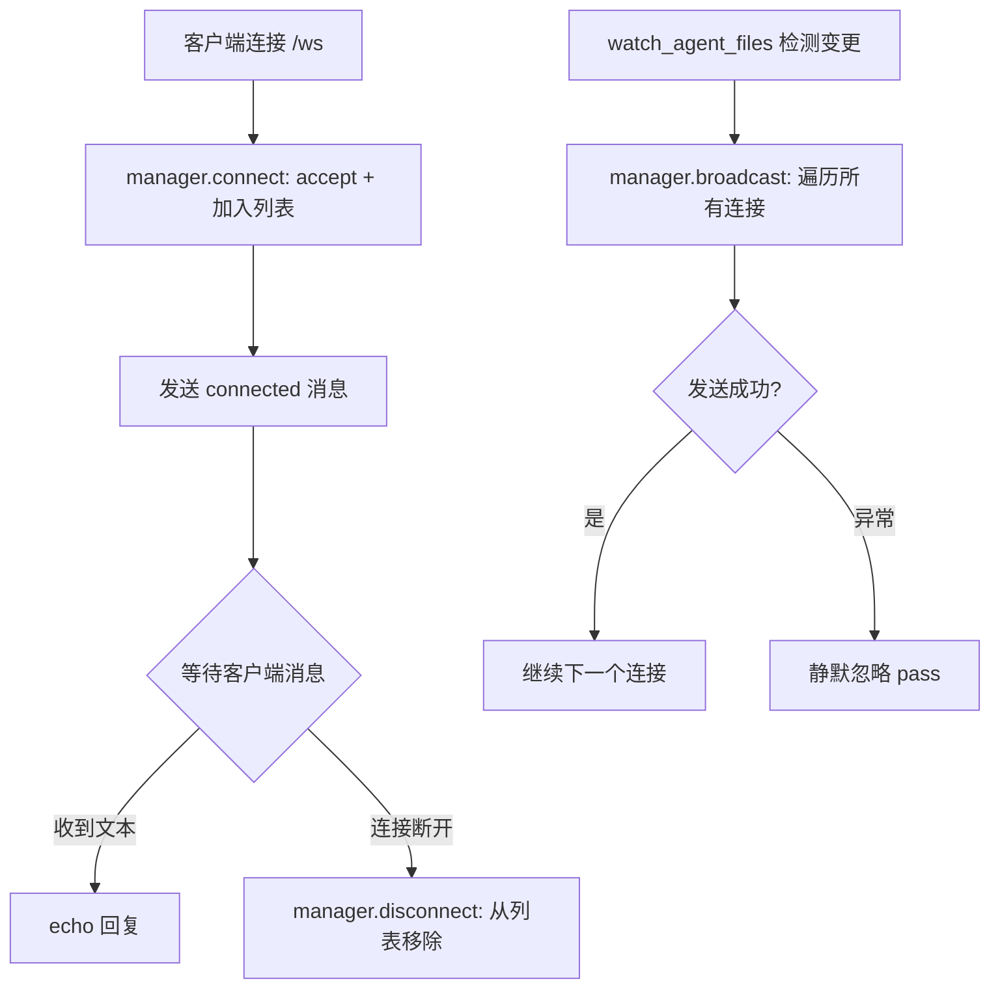
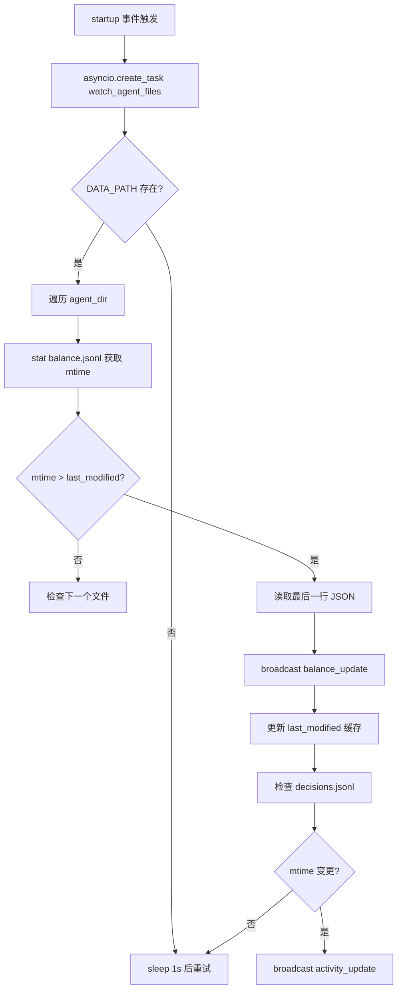

# PD-290.01 ClawWork — FastAPI+WebSocket 实时仪表盘与文件监听广播

> 文档编号：PD-290.01
> 来源：ClawWork `livebench/api/server.py` `frontend/src/hooks/useWebSocket.js` `frontend/src/pages/Leaderboard.jsx`
> GitHub：https://github.com/HKUDS/ClawWork.git
> 问题域：PD-290 实时仪表盘与 WebSocket
> 状态：可复用方案

---

## 第 1 章 问题与动机（≥ 30 行）

### 1.1 核心问题

Agent 经济模拟系统（ClawWork 自称 "Squid Game for AI Agents"）需要实时展示多个 Agent 的余额变化、决策行为、任务完成情况和排行榜。核心挑战：

1. **数据源是文件系统**：Agent 运行时将经济数据写入 JSONL 文件（balance.jsonl、decisions.jsonl、evaluations.jsonl），不经过数据库
2. **多 Agent 并行**：多个 Agent 同时运行，各自独立写文件，需要统一监听和广播
3. **前端多视图**：排行榜、个人仪表盘、任务列表、产物预览、终端日志回放等多个视图需要实时更新
4. **双部署模式**：既要支持本地实时 WebSocket 模式，也要支持 GitHub Pages 静态部署

### 1.2 ClawWork 的解法概述

1. **ConnectionManager 单例广播**：`livebench/api/server.py:156-176` 实现 WebSocket 连接管理器，维护活跃连接列表，提供 `broadcast()` 方法向所有客户端推送 JSON 消息
2. **文件 mtime 轮询监听**：`livebench/api/server.py:747-804` 后台 asyncio 任务每秒扫描 Agent 数据目录，通过 `stat().st_mtime` 检测文件变更，读取最新行并广播
3. **双通道更新**：WebSocket 推送实时增量（balance_update / activity_update），前端收到后触发 REST API 全量刷新（`frontend/src/App.jsx:67-73`）
4. **静态/动态 API 抽象层**：`frontend/src/api.js:9-13` 通过 `VITE_STATIC_DATA` 环境变量切换 live 模式（FastAPI 后端）和 static 模式（预生成 JSON 文件）
5. **前端轮询兜底**：Leaderboard 每 10 秒轮询（`Leaderboard.jsx:208-209`），Agent 列表每 5 秒轮询（`App.jsx:49`），即使 WebSocket 断开也能更新

### 1.3 设计思想

| 设计原则 | 具体实现 | 理由 | 替代方案 |
|----------|----------|------|----------|
| 文件即数据库 | JSONL 文件作为唯一数据源，API 直接读文件 | 零依赖，Agent 只需 append 文件即可 | SQLite / Redis |
| mtime 轮询 > inotify | 每秒 stat() 检测变更而非 inotify | 跨平台兼容，实现简单 | watchdog / inotify |
| 通知即信号 | WebSocket 只推通知，前端收到后自行 fetch 全量 | 避免 WebSocket 传输大量数据 | WebSocket 直接推全量数据 |
| 双模式部署 | 同一前端代码支持 live + static | GitHub Pages 免费展示，本地开发实时调试 | 分两套前端 |
| 轮询兜底 | 即使 WebSocket 断开，定时轮询保证数据更新 | 容错，WebSocket 不可靠时仍可用 | 仅依赖 WebSocket |

---

## 第 2 章 源码实现分析（≥ 60 行，核心章节）

### 2.1 架构概览

```
┌─────────────────────────────────────────────────────────────┐
│                    ClawWork 实时仪表盘架构                      │
├─────────────────────────────────────────────────────────────┤
│                                                             │
│  Agent 进程                    FastAPI Server                │
│  ┌──────────┐                 ┌──────────────────────┐      │
│  │LiveAgent │──append──→      │ watch_agent_files()  │      │
│  │  写 JSONL │  balance.jsonl │  每秒 stat() 检测     │      │
│  │  文件     │  decisions.jsonl│  mtime 变更           │      │
│  └──────────┘                 │         │             │      │
│                               │         ▼             │      │
│                               │ ConnectionManager     │      │
│                               │  .broadcast()         │      │
│                               │    │                  │      │
│                               │    ▼                  │      │
│                               │ WebSocket /ws ────────┼──→ React 前端  │
│                               │                       │    │
│                               │ REST /api/agents ─────┼──→ useEffect   │
│                               │ REST /api/leaderboard─┼──→ setInterval │
│                               └───────────────────────┘    │
│                                                             │
│  React 前端                                                  │
│  ┌──────────────────────────────────────────────────┐       │
│  │ useWebSocket() ──→ lastMessage ──→ fetchAgents() │       │
│  │ setInterval(5s)  ──→ fetchAgents()               │       │
│  │ setInterval(10s) ──→ fetchLeaderboard()          │       │
│  └──────────────────────────────────────────────────┘       │
└─────────────────────────────────────────────────────────────┘
```

### 2.2 核心实现

#### 2.2.1 ConnectionManager — WebSocket 连接管理与广播



对应源码 `livebench/api/server.py:156-176`：

```python
class ConnectionManager:
    def __init__(self):
        self.active_connections: List[WebSocket] = []

    async def connect(self, websocket: WebSocket):
        await websocket.accept()
        self.active_connections.append(websocket)

    def disconnect(self, websocket: WebSocket):
        self.active_connections.remove(websocket)

    async def broadcast(self, message: dict):
        """Broadcast message to all connected clients"""
        for connection in self.active_connections:
            try:
                await connection.send_json(message)
            except:
                pass

manager = ConnectionManager()
```

关键设计点：
- 全局单例 `manager`（`server.py:176`），所有 WebSocket 端点和广播入口共享
- `broadcast()` 对发送失败静默忽略（`server.py:172-173`），不因单个客户端断开影响其他客户端
- 无心跳机制，依赖 WebSocket 协议自身的 ping/pong

#### 2.2.2 文件监听器 — mtime 轮询与增量广播



对应源码 `livebench/api/server.py:747-810`：

```python
async def watch_agent_files():
    """Watch agent data files for changes and broadcast updates"""
    import time
    last_modified = {}

    while True:
        try:
            if DATA_PATH.exists():
                for agent_dir in DATA_PATH.iterdir():
                    if agent_dir.is_dir():
                        signature = agent_dir.name
                        # Check balance file
                        balance_file = agent_dir / "economic" / "balance.jsonl"
                        if balance_file.exists():
                            mtime = balance_file.stat().st_mtime
                            key = f"{signature}_balance"
                            if key not in last_modified or mtime > last_modified[key]:
                                last_modified[key] = mtime
                                with open(balance_file, 'r') as f:
                                    lines = f.readlines()
                                    if lines:
                                        data = json.loads(lines[-1])
                                        await manager.broadcast({
                                            "type": "balance_update",
                                            "signature": signature,
                                            "data": data
                                        })
        except Exception as e:
            print(f"Error watching files: {e}")
        await asyncio.sleep(1)  # Check every second

@app.on_event("startup")
async def startup_event():
    asyncio.create_task(watch_agent_files())
```

关键设计点：
- `last_modified` 字典缓存每个文件的 mtime，避免重复广播（`server.py:753`）
- 每次读取整个文件的所有行取最后一行（`readlines()[-1]`），对大文件有性能隐患
- 监听两类文件：`balance.jsonl`（经济数据）和 `decisions.jsonl`（决策行为）
- 异常被 catch 后仅打印，不中断监听循环（`server.py:801-802`）

### 2.3 实现细节

#### 前端 WebSocket Hook — 自动重连与双模式

对应源码 `frontend/src/hooks/useWebSocket.js:1-47`：

```javascript
export const useWebSocket = () => {
  const [lastMessage, setLastMessage] = useState(null)
  const [connectionStatus, setConnectionStatus] = useState(
    IS_STATIC ? 'github-pages' : 'connecting'
  )
  const ws = useRef(null)

  useEffect(() => {
    if (IS_STATIC) return  // GitHub Pages 模式跳过 WebSocket

    const connectWebSocket = () => {
      const protocol = window.location.protocol === 'https:' ? 'wss:' : 'ws:'
      const wsUrl = `${protocol}//${window.location.hostname}:${window.location.port}/ws`
      ws.current = new WebSocket(wsUrl)

      ws.current.onopen = () => setConnectionStatus('connected')
      ws.current.onmessage = (event) => {
        try { setLastMessage(JSON.parse(event.data)) } catch {}
      }
      ws.current.onclose = () => {
        setConnectionStatus('disconnected')
        setTimeout(connectWebSocket, 3000)  // 3 秒后自动重连
      }
    }
    connectWebSocket()
    return () => { if (ws.current) ws.current.close() }
  }, [])

  return { lastMessage, connectionStatus }
}
```

关键设计点：
- `IS_STATIC` 检测（`api.js:9`）：静态部署时完全跳过 WebSocket，状态显示 "github-pages"
- 3 秒固定间隔重连（`useWebSocket.js:35`），无指数退避
- `lastMessage` 作为 React state，App.jsx 通过 `useEffect` 监听变化触发 REST 刷新

#### 排行榜余额闪烁检测

对应源码 `frontend/src/pages/Leaderboard.jsx:217-228`：

```javascript
// Detect balance changes → flash
const newFlash = {}
result.agents?.forEach(a => {
  const prev = prevBalances.current[a.signature]
  if (prev !== undefined && prev !== a.current_balance) {
    newFlash[a.signature] = a.current_balance > prev ? 'up' : 'down'
  }
  prevBalances.current[a.signature] = a.current_balance
})
if (Object.keys(newFlash).length) {
  setFlashMap(newFlash)
  setTimeout(() => setFlashMap({}), 1200)  // 1.2 秒后清除闪烁
}
```

通过 `useRef` 保存上次余额快照，每次轮询对比检测变化方向（up/down），触发行级 CSS 动画。

#### API 双模式抽象层

对应源码 `frontend/src/api.js:9-16`：

```javascript
const STATIC   = import.meta.env.VITE_STATIC_DATA === 'true'
const BASE_URL = import.meta.env.BASE_URL || '/'

const staticUrl = (path) => `${BASE_URL}data/${path}`
const liveUrl   = (path) => `/api/${path}`

const get = (url) => fetch(url).then(r => {
  if (!r.ok) throw new Error(r.status); return r.json()
})

export const fetchLeaderboard = () =>
  get(STATIC ? staticUrl('leaderboard.json') : liveUrl('leaderboard'))
```

同一套 React 组件，通过环境变量切换数据源：live 模式走 FastAPI REST API，static 模式读预生成的 JSON 文件。

---

## 第 3 章 迁移指南（≥ 40 行）

### 3.1 迁移清单

**阶段 1：后端 WebSocket 基础设施**
- [ ] 安装 FastAPI + uvicorn + websockets
- [ ] 实现 ConnectionManager 类（connect / disconnect / broadcast）
- [ ] 添加 `/ws` WebSocket 端点
- [ ] 添加 `/api/broadcast` POST 端点（供 Agent 进程主动推送）

**阶段 2：文件监听器**
- [ ] 实现 `watch_agent_files()` 异步任务
- [ ] 定义监听的文件类型和消息类型映射
- [ ] 注册为 FastAPI startup 事件

**阶段 3：前端 WebSocket Hook**
- [ ] 实现 `useWebSocket` React Hook（含自动重连）
- [ ] 在 App 根组件消费 `lastMessage`，触发数据刷新
- [ ] 添加连接状态指示器（Sidebar 中的绿/黄/红点）

**阶段 4：双模式部署**
- [ ] 实现 API 抽象层（live / static URL 切换）
- [ ] 编写静态数据导出脚本（从 JSONL 生成 JSON）
- [ ] 配置 GitHub Pages 部署

### 3.2 适配代码模板

#### 最小可用 ConnectionManager + 文件监听器

```python
"""Minimal WebSocket broadcast server with file watching"""
import asyncio
import json
from pathlib import Path
from typing import List, Dict
from fastapi import FastAPI, WebSocket, WebSocketDisconnect

app = FastAPI()

class ConnectionManager:
    def __init__(self):
        self.connections: List[WebSocket] = []

    async def connect(self, ws: WebSocket):
        await ws.accept()
        self.connections.append(ws)

    def disconnect(self, ws: WebSocket):
        self.connections.remove(ws)

    async def broadcast(self, msg: dict):
        for conn in self.connections:
            try:
                await conn.send_json(msg)
            except Exception:
                pass  # 静默忽略断开的连接

manager = ConnectionManager()
DATA_DIR = Path("./data/agents")

@app.websocket("/ws")
async def ws_endpoint(ws: WebSocket):
    await manager.connect(ws)
    try:
        await ws.send_json({"type": "connected"})
        while True:
            await ws.receive_text()  # 保持连接
    except WebSocketDisconnect:
        manager.disconnect(ws)

async def file_watcher():
    """每秒扫描文件变更并广播"""
    mtimes: Dict[str, float] = {}
    while True:
        try:
            if DATA_DIR.exists():
                for agent_dir in DATA_DIR.iterdir():
                    if not agent_dir.is_dir():
                        continue
                    for jsonl_file in agent_dir.rglob("*.jsonl"):
                        key = str(jsonl_file)
                        mtime = jsonl_file.stat().st_mtime
                        if key not in mtimes or mtime > mtimes[key]:
                            mtimes[key] = mtime
                            with open(jsonl_file) as f:
                                lines = f.readlines()
                                if lines:
                                    data = json.loads(lines[-1])
                                    await manager.broadcast({
                                        "type": "file_update",
                                        "agent": agent_dir.name,
                                        "file": jsonl_file.name,
                                        "data": data,
                                    })
        except Exception as e:
            print(f"Watcher error: {e}")
        await asyncio.sleep(1)

@app.on_event("startup")
async def startup():
    asyncio.create_task(file_watcher())
```

#### 最小可用前端 WebSocket Hook

```javascript
import { useEffect, useState, useRef } from 'react'

export function useWebSocket(url = '/ws') {
  const [lastMessage, setLastMessage] = useState(null)
  const [status, setStatus] = useState('connecting')
  const ws = useRef(null)

  useEffect(() => {
    let reconnectTimer = null
    const connect = () => {
      const protocol = location.protocol === 'https:' ? 'wss:' : 'ws:'
      ws.current = new WebSocket(`${protocol}//${location.host}${url}`)
      ws.current.onopen = () => setStatus('connected')
      ws.current.onmessage = (e) => {
        try { setLastMessage(JSON.parse(e.data)) } catch {}
      }
      ws.current.onclose = () => {
        setStatus('disconnected')
        reconnectTimer = setTimeout(connect, 3000)
      }
    }
    connect()
    return () => {
      clearTimeout(reconnectTimer)
      ws.current?.close()
    }
  }, [url])

  return { lastMessage, status }
}
```

### 3.3 适用场景

| 场景 | 适用度 | 说明 |
|------|--------|------|
| Agent 经济模拟仪表盘 | ⭐⭐⭐ | 完美匹配：多 Agent 并行 + JSONL 数据源 + 实时排行榜 |
| 小规模实时监控（<50 Agent） | ⭐⭐⭐ | mtime 轮询在小规模下性能足够 |
| 大规模生产环境（>1000 连接） | ⭐ | ConnectionManager 无分片、无心跳、无背压控制 |
| 需要精确实时性（<100ms 延迟） | ⭐ | 1 秒轮询间隔 + REST 全量刷新，延迟在 1-2 秒级 |
| 双模式部署（实时 + 静态展示） | ⭐⭐⭐ | API 抽象层设计优雅，一套代码两种部署 |
| 需要消息持久化/回放 | ⭐ | 无消息队列，断线重连后无法获取错过的消息 |

---

## 第 4 章 测试用例（≥ 20 行）

```python
import pytest
import asyncio
import json
import tempfile
from pathlib import Path
from unittest.mock import AsyncMock, MagicMock, patch
from fastapi.testclient import TestClient
from fastapi.websockets import WebSocket


class TestConnectionManager:
    """测试 WebSocket 连接管理器"""

    def test_connect_adds_to_list(self):
        from livebench.api.server import ConnectionManager
        mgr = ConnectionManager()
        ws = AsyncMock(spec=WebSocket)
        asyncio.get_event_loop().run_until_complete(mgr.connect(ws))
        assert ws in mgr.active_connections
        ws.accept.assert_awaited_once()

    def test_disconnect_removes_from_list(self):
        from livebench.api.server import ConnectionManager
        mgr = ConnectionManager()
        ws = AsyncMock(spec=WebSocket)
        mgr.active_connections.append(ws)
        mgr.disconnect(ws)
        assert ws not in mgr.active_connections

    def test_broadcast_sends_to_all(self):
        from livebench.api.server import ConnectionManager
        mgr = ConnectionManager()
        ws1, ws2 = AsyncMock(), AsyncMock()
        mgr.active_connections = [ws1, ws2]
        msg = {"type": "balance_update", "data": {"balance": 100}}
        asyncio.get_event_loop().run_until_complete(mgr.broadcast(msg))
        ws1.send_json.assert_awaited_once_with(msg)
        ws2.send_json.assert_awaited_once_with(msg)

    def test_broadcast_ignores_failed_connection(self):
        from livebench.api.server import ConnectionManager
        mgr = ConnectionManager()
        ws_ok = AsyncMock()
        ws_bad = AsyncMock()
        ws_bad.send_json.side_effect = Exception("connection closed")
        mgr.active_connections = [ws_bad, ws_ok]
        msg = {"type": "test"}
        asyncio.get_event_loop().run_until_complete(mgr.broadcast(msg))
        # ws_ok 仍然收到消息，不受 ws_bad 影响
        ws_ok.send_json.assert_awaited_once_with(msg)


class TestFileWatcher:
    """测试文件监听与 mtime 检测"""

    def test_mtime_change_triggers_broadcast(self, tmp_path):
        """模拟文件变更触发广播"""
        agent_dir = tmp_path / "agent1" / "economic"
        agent_dir.mkdir(parents=True)
        balance_file = agent_dir / "balance.jsonl"
        balance_file.write_text(
            json.dumps({"date": "2026-01-01", "balance": 500.0}) + "\n"
        )
        mtime = balance_file.stat().st_mtime
        # 首次检测应触发广播
        last_modified = {}
        key = "agent1_balance"
        assert key not in last_modified or mtime > last_modified.get(key, 0)

    def test_no_broadcast_when_mtime_unchanged(self, tmp_path):
        """mtime 未变化时不应触发广播"""
        agent_dir = tmp_path / "agent1" / "economic"
        agent_dir.mkdir(parents=True)
        balance_file = agent_dir / "balance.jsonl"
        balance_file.write_text('{"balance": 100}\n')
        mtime = balance_file.stat().st_mtime
        last_modified = {"agent1_balance": mtime}
        # 同一 mtime 不应触发
        assert not (mtime > last_modified["agent1_balance"])


class TestAPIEndpoints:
    """测试 REST API 端点"""

    def test_leaderboard_sorts_by_balance(self, tmp_path):
        """排行榜应按余额降序排列"""
        # 验证排序逻辑
        agents = [
            {"signature": "a", "current_balance": 100},
            {"signature": "b", "current_balance": 500},
            {"signature": "c", "current_balance": 300},
        ]
        agents.sort(key=lambda a: a["current_balance"], reverse=True)
        assert agents[0]["signature"] == "b"
        assert agents[1]["signature"] == "c"
        assert agents[2]["signature"] == "a"

    def test_dual_mode_api_url_generation(self):
        """测试双模式 URL 生成"""
        # Live mode
        assert "/api/leaderboard" == f"/api/leaderboard"
        # Static mode
        base_url = "/-Live-Bench/"
        assert f"{base_url}data/leaderboard.json" == "/-Live-Bench/data/leaderboard.json"
```

---

## 第 5 章 跨域关联

| 关联域 | 关系类型 | 说明 |
|--------|----------|------|
| PD-11 可观测性 | 协同 | 仪表盘是可观测性的前端呈现层；EconomicTracker 的 JSONL 日志同时服务于成本追踪和仪表盘展示 |
| PD-06 记忆持久化 | 依赖 | 仪表盘数据源依赖 JSONL 文件持久化；EconomicTracker（`economic_tracker.py:52-53`）定义了 balance.jsonl / token_costs.jsonl 的存储路径 |
| PD-07 质量检查 | 协同 | WorkEvaluator（`evaluator.py:56-147`）的评估结果通过 evaluations.jsonl 写入，仪表盘 WorkView 展示评估分数和反馈 |
| PD-03 容错与重试 | 互补 | ConnectionManager 的 broadcast 静默忽略失败连接 + 前端 3 秒自动重连 + 轮询兜底，构成三层容错 |
| PD-09 Human-in-the-Loop | 协同 | 仪表盘的 Agent 可见性设置（`Sidebar.jsx:66-83`）允许人类隐藏/显示 Agent，通过 PUT /api/settings/hidden-agents 持久化 |

---

## 第 6 章 来源文件索引

| 文件 | 行范围 | 关键实现 |
|------|--------|----------|
| `livebench/api/server.py` | L156-L176 | ConnectionManager 类：WebSocket 连接管理与广播 |
| `livebench/api/server.py` | L747-L810 | watch_agent_files()：mtime 轮询文件监听器 |
| `livebench/api/server.py` | L178-L195 | /ws WebSocket 端点 |
| `frontend/src/hooks/useWebSocket.js` | L1-L47 | useWebSocket Hook：自动重连 + 双模式检测 |
| `frontend/src/api.js` | L1-L68 | API 抽象层：live/static 双模式 URL 切换 |
| `frontend/src/App.jsx` | L14-L74 | 根组件：WebSocket 消息处理 + 轮询兜底 |
| `frontend/src/pages/Leaderboard.jsx` | L208-L228 | 排行榜：10 秒轮询 + 余额闪烁检测 |
| `frontend/src/components/Sidebar.jsx` | L44-L63 | 连接状态指示器（绿/黄/红/紫点） |
| `frontend/src/pages/WorkView.jsx` | L172-L238 | 终端日志回放 Modal |
| `frontend/src/pages/Artifacts.jsx` | L462-L587 | 产物预览（PDF/DOCX/XLSX/PPTX 在线渲染） |
| `livebench/agent/economic_tracker.py` | L12-L78 | EconomicTracker：JSONL 经济数据写入 |
| `livebench/work/evaluator.py` | L56-L147 | WorkEvaluator：LLM 评估 + evaluations.jsonl 写入 |
| `start_dashboard.sh` | L1-L153 | 一键启动脚本：后端 + 前端 + 端口清理 |

---

## 第 7 章 横向对比维度

> **重要：** 本章用于自动填充 Butcher Wiki 的横向对比表。

```json comparison_data
{
  "project": "ClawWork",
  "dimensions": {
    "推送协议": "FastAPI WebSocket + ConnectionManager 单例广播",
    "数据源": "JSONL 文件 + mtime 轮询（1 秒间隔）",
    "连接管理": "List 存储 + broadcast 静默忽略失败 + 无心跳",
    "前端更新策略": "WebSocket 通知触发 REST 全量刷新 + 定时轮询兜底",
    "部署模式": "双模式：live WebSocket + GitHub Pages 静态 JSON",
    "可视化维度": "排行榜 + 经济仪表盘 + 任务列表 + 产物预览 + 终端日志回放"
  }
}
```

### 域元数据补充

```json domain_metadata
{
  "solution_summary": "ClawWork 用 FastAPI WebSocket + ConnectionManager 单例广播 + mtime 轮询文件监听实现多 Agent 经济模拟实时仪表盘，支持 live/static 双模式部署",
  "description": "Agent 经济模拟场景下的多视图实时可视化与双模式部署",
  "sub_problems": [
    "双模式部署（实时 WebSocket + 静态 JSON）的 API 抽象",
    "余额变化方向检测与行级闪烁动画"
  ],
  "best_practices": [
    "WebSocket 仅推通知信号，前端收到后自行 REST 全量刷新，避免 WebSocket 传输大量数据",
    "前端定时轮询作为 WebSocket 断线兜底，确保数据最终一致"
  ]
}
```
