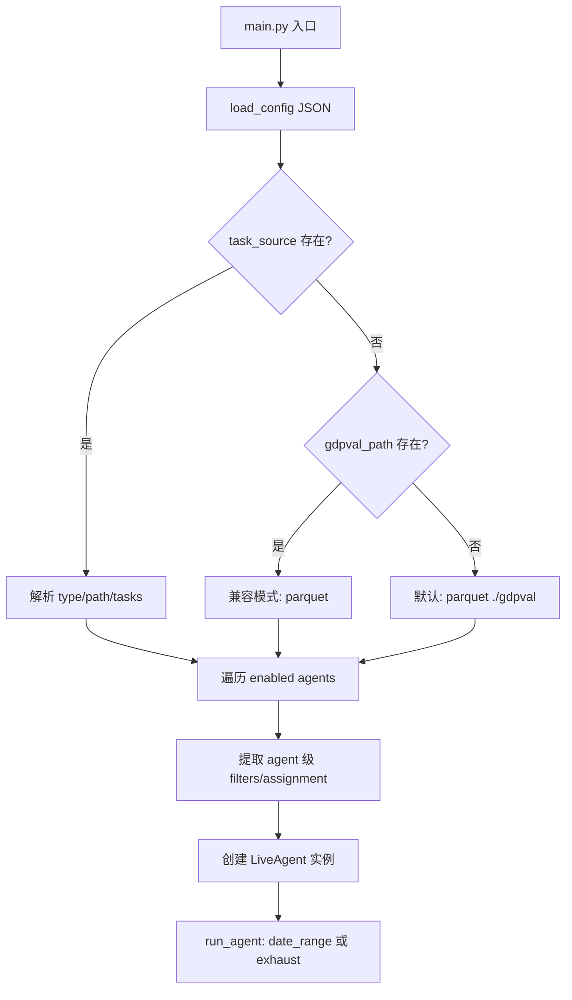
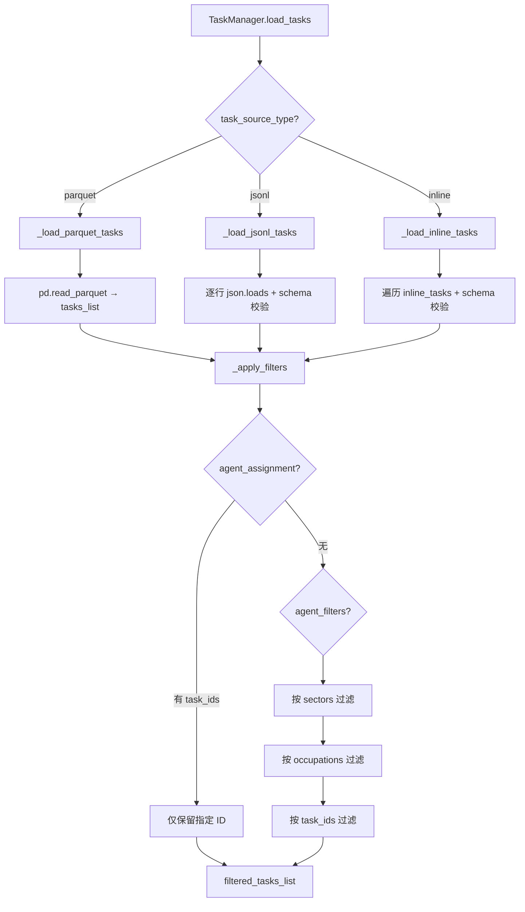

# PD-291.01 ClawWork — JSON 配置驱动多 Agent 经济生存基准测试

> 文档编号：PD-291.01
> 来源：ClawWork `livebench/configs/default_config.json` `livebench/main.py` `livebench/work/task_manager.py`
> GitHub：https://github.com/HKUDS/ClawWork.git
> 问题域：PD-291 配置驱动的 Agent 基准测试 Config-Driven Agent Benchmark
> 状态：可复用方案

---

## 第 1 章 问题与动机

### 1.1 核心问题

Agent 基准测试面临三大挑战：

1. **可复现性**：不同运行之间参数不一致导致结果不可比。模型选择、重试策略、任务分配方式等散落在代码各处，修改一个参数需要改多处代码。
2. **多 Agent 对比**：需要在相同条件下运行多个 Agent（不同模型、不同策略），逐个手动配置效率极低。
3. **任务源多样性**：真实评测场景中任务来源多样——大规模数据集用 parquet、自定义测试用 JSONL、快速验证用内联 JSON——需要统一的加载接口。

ClawWork（LiveBench）将这些问题统一收敛到一个 JSON 配置文件中，实现"改配置不改代码"的可复现评测。

### 1.2 ClawWork 的解法概述

1. **单一 JSON 配置入口**：所有评测参数（日期范围、经济模型、Agent 列表、任务源、评估策略）集中在一个 `default_config.json` 中（`livebench/configs/default_config.json:1-36`）
2. **三种任务源适配器**：TaskManager 通过 `task_source_type` 字段路由到 parquet/jsonl/inline 三种加载器（`livebench/work/task_manager.py:114-124`）
3. **Agent 级过滤与分配**：每个 Agent 可独立配置 `task_filters`（按行业/职业过滤）和 `task_assignment`（显式指定任务 ID + 分配模式）（`livebench/main.py:140-141`）
4. **Exhaust 模式**：`--exhaust` 命令行标志启动全量任务遍历，每个任务最多重试 10 次 API 错误，日期自动递增直到所有任务完成（`livebench/agent/live_agent.py:991-1143`）
5. **经济生存约束**：Agent 有初始余额和 token 成本，余额归零即"破产"停止，迫使 Agent 在成本和质量之间权衡（`livebench/agent/economic_tracker.py:12-22`）

### 1.3 设计思想

| 设计原则 | 具体实现 | 理由 | 替代方案 |
|----------|----------|------|----------|
| 配置外部化 | 所有参数集中在 JSON 文件，代码零硬编码 | 改配置不改代码，保证可复现 | 环境变量（散乱）、YAML（无 schema 校验优势） |
| 任务源多态 | `task_source_type` 路由到三种加载器 | 适配不同规模和场景的评测需求 | 统一格式（限制灵活性） |
| Agent 级隔离 | 每个 Agent 独立的 filters/assignment/data_path | 同一次运行中多 Agent 互不干扰 | 全局共享（无法对比） |
| 经济约束评测 | 余额 + token 成本 + 评分阈值 | 评测不仅看质量，还看成本效率 | 纯质量评分（忽略成本） |
| 断点续跑 | task_completions.jsonl 记录已完成任务 | exhaust 模式中断后可从断点恢复 | 从头重跑（浪费资源） |

---

## 第 2 章 源码实现分析

### 2.1 架构概览

ClawWork 的配置驱动架构分为四层：

```
┌─────────────────────────────────────────────────────────────┐
│                    JSON Config File                          │
│  date_range / economic / agents[] / task_source / evaluation │
└──────────────────────────┬──────────────────────────────────┘
                           │ load_config()
┌──────────────────────────▼──────────────────────────────────┐
│                     main.py 编排层                            │
│  解析 config → 创建 Agent 实例 → 注入 task_source/filters    │
└──────────────────────────┬──────────────────────────────────┘
                           │ for agent in enabled_agents
┌──────────────────────────▼──────────────────────────────────┐
│                   LiveAgent 执行层                            │
│  TaskManager(三源加载) → 日循环 → 工具调用 → 评估 → 经济追踪  │
└──────────────────────────┬──────────────────────────────────┘
                           │ JSONL append
┌──────────────────────────▼──────────────────────────────────┐
│                   持久化层                                    │
│  balance.jsonl / token_costs.jsonl / task_completions.jsonl  │
│  evaluations.jsonl / tasks.jsonl                             │
└─────────────────────────────────────────────────────────────┘
```

### 2.2 核心实现

#### 2.2.1 配置解析与 Agent 创建



对应源码 `livebench/main.py:49-111`：

```python
async def main(config_path: str, exhaust: bool = False):
    config = load_config(config_path)
    lb_config = config["livebench"]

    # 日期范围支持环境变量覆盖
    init_date = os.getenv("INIT_DATE") or lb_config["date_range"]["init_date"]
    end_date = os.getenv("END_DATE") or lb_config["date_range"]["end_date"]

    # 三种任务源配置解析
    if "task_source" in lb_config:
        task_source = lb_config["task_source"]
        task_source_config = {
            "task_source_type": task_source["type"],
            "task_source_path": task_source.get("path"),
            "inline_tasks": task_source.get("tasks")
        }
    elif "gdpval_path" in lb_config:
        # 向后兼容旧配置格式
        task_source_config = {
            "task_source_type": "parquet",
            "task_source_path": lb_config["gdpval_path"],
            "inline_tasks": None
        }
```

#### 2.2.2 TaskManager 三源加载与过滤



对应源码 `livebench/work/task_manager.py:99-124`：

```python
def load_tasks(self) -> int:
    # 加载任务定价（如果配置了路径）
    if self.task_values_path:
        self._load_task_values()

    if self.task_source_type == "parquet":
        return self._load_parquet_tasks()
    elif self.task_source_type == "jsonl":
        return self._load_jsonl_tasks()
    elif self.task_source_type == "inline":
        return self._load_inline_tasks()
    else:
        raise ValueError(
            f"Invalid task_source_type: {self.task_source_type}. "
            f"Must be 'parquet', 'jsonl', or 'inline'"
        )
```

过滤链实现 `livebench/work/task_manager.py:260-300`：

```python
def _apply_filters(self) -> None:
    self.filtered_tasks_list = self.tasks_list.copy()

    # 显式分配优先级最高，跳过其他过滤
    if self.agent_assignment and 'task_ids' in self.agent_assignment:
        assigned_ids = set(self.agent_assignment['task_ids'])
        self.filtered_tasks_list = [
            t for t in self.filtered_tasks_list
            if t['task_id'] in assigned_ids
        ]
        return  # 不再应用其他过滤器

    # 行业过滤
    if 'sectors' in self.agent_filters and self.agent_filters['sectors']:
        allowed_sectors = set(self.agent_filters['sectors'])
        self.filtered_tasks_list = [
            t for t in self.filtered_tasks_list
            if t['sector'] in allowed_sectors
        ]

    # 职业过滤
    if 'occupations' in self.agent_filters and self.agent_filters['occupations']:
        allowed_occupations = set(self.agent_filters['occupations'])
        self.filtered_tasks_list = [
            t for t in self.filtered_tasks_list
            if t['occupation'] in allowed_occupations
        ]
```

### 2.3 实现细节

#### Exhaust 模式的断点续跑

Exhaust 模式是 ClawWork 最独特的设计——遍历所有任务，API 错误自动重试，支持中断后恢复。

核心数据流：

```
task_completions.jsonl（已完成记录）
        ↓ _load_already_done()
已完成任务 ID 集合 → 从 pending_queue 中排除
        ↓
pending_queue（待执行队列）
        ↓ pop(0) → force_assign_task()
run_daily_session()
        ↓
API_ERROR → 重入 pending_queue（最多 max_task_failures 次）
SUCCESS   → task_conducted 集合
```

关键代码 `livebench/agent/live_agent.py:1064-1067`：

```python
# 从全量任务中排除已完成的，构建待执行队列
pending_queue: List[str] = [
    tid for tid in all_task_ids if tid not in already_recorded
]
```

#### 任务定价系统

每个任务有独立的经济价值（从 `task_values.jsonl` 加载），Agent 完成任务后根据 LLM 评分 × 任务价值计算实际收入。评分低于 0.6 阈值则零收入（`livebench/agent/economic_tracker.py:31`）。

#### Agent 级配置隔离

每个 Agent 在配置中是独立对象，支持不同的模型、过滤器、分配策略和 tasks_per_day：

```json
{
  "signature": "tech-specialist",
  "basemodel": "gpt-4o",
  "enabled": true,
  "task_filters": {
    "sectors": ["Technology"],
    "occupations": ["Software Engineer", "Data Scientist"]
  },
  "tasks_per_day": 2
}
```

对应解析逻辑 `livebench/main.py:134-191`，每个 Agent 创建独立的 LiveAgent 实例，拥有独立的 TaskManager、EconomicTracker 和 data_path。

---

## 第 3 章 迁移指南

### 3.1 迁移清单

**阶段 1：配置层（1 个文件）**

- [ ] 定义 JSON 配置 schema：`date_range`、`economic`、`agents[]`、`task_source`、`agent_params`、`evaluation`
- [ ] 实现 `load_config()` 函数，支持环境变量覆盖关键字段
- [ ] 为每种 Agent 配置提供 example 文件（filters、assignment、inline）

**阶段 2：任务管理层（1 个类）**

- [ ] 实现 TaskManager 类，支持 parquet/jsonl/inline 三种任务源
- [ ] 实现 `_validate_task_schema()` 校验必填字段（task_id, sector, occupation, prompt）
- [ ] 实现 `_apply_filters()` 过滤链：assignment > sectors > occupations > task_ids
- [ ] 实现 `select_daily_task()` 任务选择（随机/顺序/循环三种模式）
- [ ] 实现 `force_assign_task()` 用于 exhaust 模式的强制分配

**阶段 3：执行层**

- [ ] 实现 Agent 日循环：select_task → execute → evaluate → track_economics
- [ ] 实现 exhaust 模式：全量遍历 + API 错误重试 + 断点续跑
- [ ] 实现经济追踪：balance.jsonl + token_costs.jsonl + task_completions.jsonl

### 3.2 适配代码模板

以下是一个可直接运行的最小化 TaskManager 实现：

```python
import json
import random
from typing import Dict, List, Optional, Any
from pathlib import Path


class ConfigDrivenTaskManager:
    """
    配置驱动的任务管理器 — 从 ClawWork 提取的可复用组件
    支持 jsonl/inline 两种任务源 + 过滤 + 三种分配模式
    """

    def __init__(self, config: Dict[str, Any]):
        """
        Args:
            config: 任务配置字典，格式：
            {
                "task_source": {"type": "jsonl", "path": "tasks.jsonl"},
                "agent_filters": {"sectors": ["Tech"]},  # 可选
                "agent_assignment": {"mode": "sequential", "task_ids": [...]},  # 可选
                "seed": 42  # 可选
            }
        """
        self.source_type = config["task_source"]["type"]
        self.source_path = config["task_source"].get("path")
        self.inline_tasks = config["task_source"].get("tasks", [])
        self.filters = config.get("agent_filters", {})
        self.assignment = config.get("agent_assignment")
        self.tasks: List[Dict] = []
        self.filtered: List[Dict] = []
        self.used: set = set()
        self.assignment_idx = 0

        if config.get("seed") is not None:
            random.seed(config["seed"])

    def load(self) -> int:
        """加载并过滤任务，返回可用任务数"""
        if self.source_type == "jsonl":
            self.tasks = self._load_jsonl()
        elif self.source_type == "inline":
            self.tasks = self.inline_tasks
        else:
            raise ValueError(f"Unsupported source type: {self.source_type}")

        for t in self.tasks:
            self._validate(t)
        self._apply_filters()
        return len(self.filtered)

    def _load_jsonl(self) -> List[Dict]:
        tasks = []
        with open(self.source_path, "r", encoding="utf-8") as f:
            for line in f:
                line = line.strip()
                if line:
                    tasks.append(json.loads(line))
        return tasks

    def _validate(self, task: Dict) -> None:
        required = ["task_id", "prompt"]
        missing = [f for f in required if f not in task]
        if missing:
            raise ValueError(f"Task missing fields: {missing}")

    def _apply_filters(self) -> None:
        self.filtered = self.tasks.copy()
        if self.assignment and "task_ids" in self.assignment:
            ids = set(self.assignment["task_ids"])
            self.filtered = [t for t in self.filtered if t["task_id"] in ids]
            return
        for key in ["sectors", "occupations"]:
            if key in self.filters and self.filters[key]:
                allowed = set(self.filters[key])
                field = key.rstrip("s")  # sectors -> sector
                self.filtered = [t for t in self.filtered if t.get(field) in allowed]

    def next_task(self) -> Optional[Dict]:
        """获取下一个任务，返回 None 表示无可用任务"""
        available = [t for t in self.filtered if t["task_id"] not in self.used]
        if not available:
            return None

        if self.assignment and "mode" in self.assignment:
            mode = self.assignment["mode"]
            if mode == "sequential":
                task = available[min(self.assignment_idx, len(available) - 1)]
                self.assignment_idx += 1
            elif mode == "random":
                task = random.choice(available)
            else:
                task = available[self.assignment_idx % len(available)]
                self.assignment_idx += 1
        else:
            task = random.choice(available)

        self.used.add(task["task_id"])
        return task

    def all_task_ids(self) -> List[str]:
        """获取所有过滤后的任务 ID（用于 exhaust 模式）"""
        return [t["task_id"] for t in self.filtered]
```

### 3.3 适用场景

| 场景 | 适用度 | 说明 |
|------|--------|------|
| 多模型 Agent 对比评测 | ⭐⭐⭐ | 核心场景：同一任务集、不同模型、统一经济约束 |
| 单 Agent 回归测试 | ⭐⭐⭐ | 固定 seed + 固定任务 ID 实现确定性复现 |
| 大规模数据集评测 | ⭐⭐⭐ | parquet 源 + exhaust 模式 + 断点续跑 |
| 快速原型验证 | ⭐⭐ | inline 任务源，3-5 个任务快速跑通 |
| 实时在线评测 | ⭐ | 设计为批量离线运行，不适合实时场景 |

---

## 第 4 章 测试用例

```python
import json
import pytest
import tempfile
import os
from typing import Dict, List


class TestTaskManagerMultiSource:
    """测试 TaskManager 三种任务源加载"""

    def _create_jsonl_file(self, tasks: List[Dict]) -> str:
        """创建临时 JSONL 文件"""
        fd, path = tempfile.mkstemp(suffix=".jsonl")
        with os.fdopen(fd, "w") as f:
            for task in tasks:
                f.write(json.dumps(task) + "\n")
        return path

    def _sample_tasks(self) -> List[Dict]:
        return [
            {"task_id": "t1", "sector": "Tech", "occupation": "Engineer", "prompt": "Build API"},
            {"task_id": "t2", "sector": "Finance", "occupation": "Analyst", "prompt": "Analyze risk"},
            {"task_id": "t3", "sector": "Tech", "occupation": "Designer", "prompt": "Design UI"},
        ]

    def test_jsonl_loading(self):
        """JSONL 源正确加载所有任务"""
        tasks = self._sample_tasks()
        path = self._create_jsonl_file(tasks)
        try:
            from livebench.work.task_manager import TaskManager
            tm = TaskManager(task_source_type="jsonl", task_source_path=path)
            count = tm.load_tasks()
            assert count == 3
            assert len(tm.tasks_list) == 3
        finally:
            os.unlink(path)

    def test_inline_loading(self):
        """Inline 源正确加载内联任务"""
        tasks = self._sample_tasks()
        from livebench.work.task_manager import TaskManager
        tm = TaskManager(task_source_type="inline", inline_tasks=tasks)
        count = tm.load_tasks()
        assert count == 3

    def test_invalid_source_type(self):
        """无效源类型抛出 ValueError"""
        from livebench.work.task_manager import TaskManager
        tm = TaskManager(task_source_type="csv")
        with pytest.raises(ValueError, match="Invalid task_source_type"):
            tm.load_tasks()


class TestTaskFiltering:
    """测试 Agent 级过滤与分配"""

    def _make_tm(self, **kwargs) -> "TaskManager":
        from livebench.work.task_manager import TaskManager
        tasks = [
            {"task_id": "t1", "sector": "Tech", "occupation": "Engineer", "prompt": "p1"},
            {"task_id": "t2", "sector": "Finance", "occupation": "Analyst", "prompt": "p2"},
            {"task_id": "t3", "sector": "Tech", "occupation": "Designer", "prompt": "p3"},
        ]
        tm = TaskManager(task_source_type="inline", inline_tasks=tasks, **kwargs)
        tm.load_tasks()
        return tm

    def test_sector_filter(self):
        """按行业过滤只保留匹配任务"""
        tm = self._make_tm(agent_filters={"sectors": ["Tech"]})
        assert len(tm.filtered_tasks_list) == 2
        assert all(t["sector"] == "Tech" for t in tm.filtered_tasks_list)

    def test_explicit_assignment_overrides_filters(self):
        """显式分配优先于过滤器"""
        tm = self._make_tm(
            agent_filters={"sectors": ["Finance"]},
            agent_assignment={"task_ids": ["t1", "t3"]}
        )
        # assignment 优先，忽略 sector filter
        ids = {t["task_id"] for t in tm.filtered_tasks_list}
        assert ids == {"t1", "t3"}

    def test_sequential_assignment(self):
        """顺序分配模式按序返回任务"""
        tm = self._make_tm(
            agent_assignment={"mode": "sequential", "task_ids": ["t1", "t2", "t3"]}
        )
        task1 = tm.select_daily_task("2025-01-20")
        task2 = tm.select_daily_task("2025-01-21")
        assert task1["task_id"] == "t1"
        assert task2["task_id"] == "t2"


class TestExhaustMode:
    """测试 Exhaust 模式的任务耗尽与重试"""

    def test_used_tasks_tracking(self):
        """已使用任务不会被重复分配"""
        from livebench.work.task_manager import TaskManager
        tasks = [
            {"task_id": "t1", "sector": "A", "occupation": "B", "prompt": "p"},
            {"task_id": "t2", "sector": "A", "occupation": "B", "prompt": "p"},
        ]
        tm = TaskManager(task_source_type="inline", inline_tasks=tasks)
        tm.load_tasks()

        t1 = tm.select_daily_task("2025-01-20")
        t2 = tm.select_daily_task("2025-01-21")
        t3 = tm.select_daily_task("2025-01-22")

        assert t1 is not None
        assert t2 is not None
        assert t3 is None  # 两个任务都已用完

    def test_force_assign(self):
        """force_assign_task 绕过 used 检查"""
        from livebench.work.task_manager import TaskManager
        tasks = [{"task_id": "t1", "sector": "A", "occupation": "B", "prompt": "p"}]
        tm = TaskManager(task_source_type="inline", inline_tasks=tasks)
        tm.load_tasks()

        result = tm.force_assign_task("t1", "2025-01-20")
        assert result is not None
        assert result["task_id"] == "t1"
        assert "max_payment" in result
```

---

## 第 5 章 跨域关联

| 关联域 | 关系类型 | 说明 |
|--------|----------|------|
| PD-03 容错与重试 | 协同 | Exhaust 模式的 API 错误重试机制（max_task_failures=10）是容错设计的具体应用，`_ainvoke_with_retry` 实现指数退避 |
| PD-11 可观测性 | 协同 | EconomicTracker 通过 JSONL 文件持久化 balance/token_costs/task_completions，提供完整的成本追踪和评测可观测性 |
| PD-02 多 Agent 编排 | 依赖 | 多 Agent 配置（agents[] 数组）依赖编排层按序创建和运行各 Agent，当前为串行执行 |
| PD-06 记忆持久化 | 协同 | task_completions.jsonl 作为断点续跑的"记忆"，`_load_already_done()` 从中恢复已完成状态 |
| PD-07 质量检查 | 协同 | WorkEvaluator 使用 LLM 评分（0.0-1.0），低于 0.6 阈值不付款，是质量门控的具体实现 |

---

## 第 6 章 来源文件索引

| 文件 | 行范围 | 关键实现 |
|------|--------|----------|
| `livebench/configs/default_config.json` | L1-L36 | 默认配置模板：date_range + economic + agents + agent_params + evaluation |
| `livebench/configs/example_task_filters.json` | L1-L45 | Agent 级 task_filters 配置示例（sectors/occupations 过滤） |
| `livebench/configs/example_task_assignment.json` | L1-L46 | Agent 级 task_assignment 配置示例（sequential/random 模式） |
| `livebench/configs/example_inline_tasks.json` | L1-L55 | Inline 任务源配置示例（任务直接嵌入 JSON） |
| `livebench/configs/example_jsonl.json` | L1-L33 | JSONL 任务源配置示例 |
| `livebench/main.py` | L49-L111 | 配置解析与任务源路由逻辑 |
| `livebench/main.py` | L134-L191 | Agent 创建：提取 filters/assignment/tasks_per_day 并注入 LiveAgent |
| `livebench/work/task_manager.py` | L14-L98 | TaskManager 初始化：三源参数 + 过滤器 + 分配配置 |
| `livebench/work/task_manager.py` | L99-L124 | `load_tasks()` 三源路由分发 |
| `livebench/work/task_manager.py` | L158-L207 | JSONL 和 Inline 加载器 + schema 校验 |
| `livebench/work/task_manager.py` | L260-L300 | `_apply_filters()` 过滤链：assignment > sectors > occupations > task_ids |
| `livebench/work/task_manager.py` | L302-L372 | `select_daily_task()` 任务选择 + 定价注入 + 使用追踪 |
| `livebench/work/task_manager.py` | L374-L436 | `_select_assigned_task()` 三种分配模式：sequential/cycle/random |
| `livebench/work/task_manager.py` | L614-L651 | `force_assign_task()` exhaust 模式强制分配 |
| `livebench/agent/live_agent.py` | L50-L180 | LiveAgent 初始化：接收所有配置参数并创建 TaskManager/EconomicTracker/Evaluator |
| `livebench/agent/live_agent.py` | L504-L893 | `run_daily_session()` 日循环：选任务 → 工具调用循环 → 评估 → 经济追踪 |
| `livebench/agent/live_agent.py` | L895-L932 | `_load_already_done()` 断点续跑：从 task_completions.jsonl 恢复已完成状态 |
| `livebench/agent/live_agent.py` | L991-L1143 | `run_exhaust_mode()` 全量遍历 + API 重试 + 断点恢复 |
| `livebench/agent/economic_tracker.py` | L12-L83 | EconomicTracker 初始化：余额/token 成本/评分阈值 |
| `livebench/work/evaluator.py` | L11-L54 | WorkEvaluator：LLM 评分 + 职业特定 rubric + 无降级模式 |

---

## 第 7 章 横向对比维度

```json comparison_data
{
  "project": "ClawWork",
  "dimensions": {
    "配置格式": "单一 JSON 文件，嵌套结构含 agents[]/task_source/economic/evaluation",
    "任务源适配": "parquet/jsonl/inline 三源路由，统一 schema 校验",
    "Agent 参数化": "agents[] 数组，每个 Agent 独立 filters/assignment/model/tasks_per_day",
    "评估机制": "LLM 评分 0.0-1.0 + 0.6 阈值门控 + 职业特定 rubric",
    "经济约束": "初始余额 + token 成本扣减 + 破产终止，评测成本效率",
    "断点续跑": "task_completions.jsonl 记录已完成任务，exhaust 模式自动跳过"
  }
}
```

### 域元数据补充

```json domain_metadata
{
  "solution_summary": "ClawWork 用单一 JSON 配置驱动多 Agent 经济生存评测：三种任务源适配、Agent 级过滤分配、exhaust 全量遍历断点续跑、LLM 评分+经济约束双重门控",
  "description": "将经济生存约束引入 Agent 基准测试，评测不仅看质量还看成本效率",
  "sub_problems": [
    "经济约束下的 Agent 成本效率评测",
    "断点续跑与已完成任务状态恢复",
    "Agent 级配置隔离与多模型并行对比"
  ],
  "best_practices": [
    "用 JSONL append-only 日志实现断点续跑而非数据库事务",
    "显式分配(assignment)优先级高于过滤器(filters)避免配置冲突",
    "经济约束(余额+token成本+评分阈值)作为评测的第二维度"
  ]
}
```
