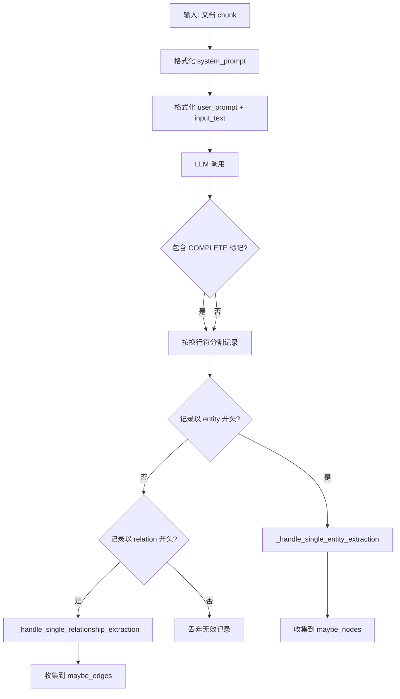
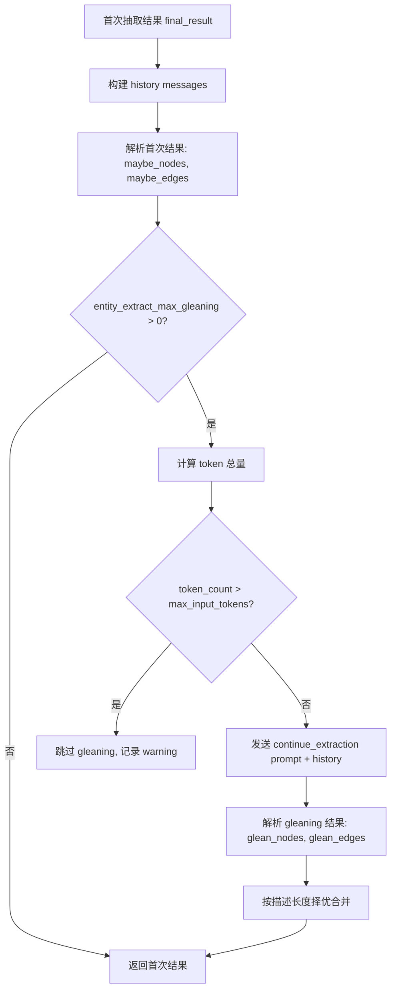

# PD-292.01 LightRAG — LLM 驱动知识图谱构建与 Gleaning 多轮抽取

> 文档编号：PD-292.01
> 来源：LightRAG `lightrag/operate.py`, `lightrag/prompt.py`, `lightrag/kg/networkx_impl.py`
> GitHub：https://github.com/HKUDS/LightRAG.git
> 问题域：PD-292 知识图谱构建 Knowledge Graph Construction
> 状态：可复用方案

---

## 第 1 章 问题与动机

### 1.1 核心问题

RAG 系统中，纯向量检索只能捕获语义相似性，无法表达实体间的结构化关系。当用户查询涉及多跳推理（"A 和 B 之间有什么关系？"）时，向量检索往往失效。知识图谱（KG）通过显式的实体-关系三元组弥补了这一缺陷，但从非结构化文档自动构建高质量 KG 面临三大挑战：

1. **抽取质量**：LLM 单次抽取容易遗漏低频实体和隐含关系
2. **描述膨胀**：同一实体在不同文档中产生大量重复/冲突描述，需要智能合并
3. **增量一致性**：新文档插入时，已有图谱的实体和关系需要无损合并而非覆盖

### 1.2 LightRAG 的解法概述

LightRAG 采用 LLM 驱动的结构化抽取管线，核心设计包括：

1. **Prompt 驱动的实体/关系抽取**：通过精心设计的 `entity_extraction_system_prompt`（`lightrag/prompt.py:11`）指导 LLM 输出固定格式的 entity/relation 记录，使用 `<|#|>` 作为字段分隔符
2. **Gleaning 多轮补充抽取**：首次抽取后，发送 `entity_continue_extraction_user_prompt`（`lightrag/prompt.py:84`）要求 LLM 补充遗漏的实体和关系，通过描述长度对比选择更优版本
3. **Map-Reduce 描述摘要**：当同一实体/关系积累多条描述时，`_handle_entity_relation_summary`（`lightrag/operate.py:165`）采用迭代式 map-reduce 策略，将描述分组摘要后递归合并
4. **两阶段并行合并**：Phase 1 并行处理所有实体的 merge-upsert，Phase 2 并行处理所有关系（`lightrag/operate.py:2488-2590`），通过 keyed lock 保证并发安全
5. **多后端图存储抽象**：`BaseGraphStorage`（`lightrag/base.py:44`）定义统一接口，NetworkX/Neo4j/PostgreSQL 等后端实现可插拔替换

### 1.3 设计思想

| 设计原则 | 具体实现 | 理由 | 替代方案 |
|----------|----------|------|----------|
| LLM 即抽取器 | 用 system prompt 定义抽取格式，LLM 直接输出结构化记录 | 无需训练 NER 模型，泛化能力强 | spaCy/Stanford NER 规则抽取 |
| Gleaning 补充 | 二次调用 LLM 补充遗漏，按描述长度择优 | 单次抽取召回率不足，多轮可提升 10-20% | 增大 temperature 多次采样 |
| Map-Reduce 摘要 | 描述超 token 限制时分组摘要再递归合并 | 避免单次 LLM 调用超出上下文窗口 | 截断丢弃旧描述 |
| 两阶段合并 | 先实体后关系，各阶段内部并行 | 关系依赖实体存在，阶段间有序保证一致性 | 全串行处理 |
| 存储抽象 | BaseGraphStorage 接口 + 多后端实现 | 开发用 NetworkX，生产用 Neo4j，无需改业务代码 | 硬编码单一存储 |

---

## 第 2 章 源码实现分析

### 2.1 架构概览

LightRAG 的知识图谱构建管线从文档分块开始，经过 LLM 抽取、Gleaning 补充、解析验证、合并去重、描述摘要，最终写入图存储：

```
┌──────────────┐     ┌───────────────────┐     ┌──────────────────┐
│  文档分块     │────→│  LLM 实体/关系抽取  │────→│  Gleaning 补充    │
│ chunking_by_ │     │  entity_extraction │     │  continue_extract│
│ token_size   │     │  _system_prompt    │     │  _user_prompt    │
└──────────────┘     └───────────────────┘     └──────────────────┘
                                                        │
                     ┌───────────────────┐              ▼
                     │  描述 Map-Reduce   │     ┌──────────────────┐
                     │  _handle_entity_  │◀────│  解析 & 验证      │
                     │  relation_summary │     │  _process_extract│
                     └───────────────────┘     │  _ion_result     │
                              │                └──────────────────┘
                              ▼
                     ┌───────────────────┐     ┌──────────────────┐
                     │  Phase 1: 实体合并 │────→│  Phase 2: 关系合并│
                     │  _merge_nodes_    │     │  _merge_edges_   │
                     │  then_upsert      │     │  then_upsert     │
                     └───────────────────┘     └──────────────────┘
                                                        │
                                                        ▼
                                               ┌──────────────────┐
                                               │  图存储后端       │
                                               │  NetworkX/Neo4j  │
                                               │  /PostgreSQL     │
                                               └──────────────────┘
```

### 2.2 核心实现

#### 2.2.1 实体/关系抽取 Prompt 设计

LightRAG 的抽取 prompt 是整个管线的灵魂。它定义了严格的输出格式规范，包括字段分隔符协议、N-ary 关系分解规则、去重指令等。



对应源码 `lightrag/prompt.py:11-61`：

```python
PROMPTS["entity_extraction_system_prompt"] = """---Role---
You are a Knowledge Graph Specialist responsible for extracting entities and relationships from the input text.

---Instructions---
1.  **Entity Extraction & Output:**
    *   **Identification:** Identify clearly defined and meaningful entities in the input text.
    *   **Entity Details:** For each identified entity, extract the following information:
        *   `entity_name`: The name of the entity. If the entity name is case-insensitive, capitalize the first letter of each significant word (title case).
        *   `entity_type`: Categorize the entity using one of the following types: `{entity_types}`.
        *   `entity_description`: Provide a concise yet comprehensive description of the entity's attributes and activities.
    *   **Output Format - Entities:** Output a total of 4 fields for each entity, delimited by `{tuple_delimiter}`, on a single line.
        *   Format: `entity{tuple_delimiter}entity_name{tuple_delimiter}entity_type{tuple_delimiter}entity_description`

2.  **Relationship Extraction & Output:**
    *   **N-ary Relationship Decomposition:** If a single statement describes a relationship involving more than two entities, decompose it into multiple binary relationship pairs.
    *   **Output Format - Relationships:** Output a total of 5 fields for each relationship, delimited by `{tuple_delimiter}`, on a single line.
        *   Format: `relation{tuple_delimiter}source_entity{tuple_delimiter}target_entity{tuple_delimiter}relationship_keywords{tuple_delimiter}relationship_description`
...
"""
```

#### 2.2.2 Gleaning 多轮补充抽取

Gleaning 是 LightRAG 提升抽取召回率的关键机制。首次抽取完成后，将结果作为 history 上下文，再次调用 LLM 要求补充遗漏项。



对应源码 `lightrag/operate.py:2884-2960`：

```python
# Process additional gleaning results only 1 time when entity_extract_max_gleaning is greater than zero.
if entity_extract_max_gleaning > 0:
    # Calculate total tokens for the gleaning request to prevent context window overflow
    tokenizer = global_config["tokenizer"]
    max_input_tokens = global_config["max_extract_input_tokens"]

    history_str = json.dumps(history, ensure_ascii=False)
    full_context_str = (
        entity_extraction_system_prompt
        + history_str
        + entity_continue_extraction_user_prompt
    )
    token_count = len(tokenizer.encode(full_context_str))

    if token_count > max_input_tokens:
        logger.warning(
            f"Gleaning stopped for chunk {chunk_key}: Input tokens ({token_count}) exceeded limit ({max_input_tokens})."
        )
    else:
        glean_result, timestamp = await use_llm_func_with_cache(
            entity_continue_extraction_user_prompt,
            use_llm_func,
            system_prompt=entity_extraction_system_prompt,
            llm_response_cache=llm_response_cache,
            history_messages=history,
            cache_type="extract",
            chunk_id=chunk_key,
            cache_keys_collector=cache_keys_collector,
        )

        glean_nodes, glean_edges = await _process_extraction_result(
            glean_result, chunk_key, timestamp, file_path,
            tuple_delimiter=context_base["tuple_delimiter"],
            completion_delimiter=context_base["completion_delimiter"],
        )

        # Merge results - compare description lengths to choose better version
        for entity_name, glean_entities in glean_nodes.items():
            if entity_name in maybe_nodes:
                original_desc_len = len(maybe_nodes[entity_name][0].get("description", "") or "")
                glean_desc_len = len(glean_entities[0].get("description", "") or "")
                if glean_desc_len > original_desc_len:
                    maybe_nodes[entity_name] = list(glean_entities)
            else:
                maybe_nodes[entity_name] = list(glean_entities)
```

### 2.3 实现细节

#### Map-Reduce 描述摘要

当同一实体在多个文档中被提及时，描述列表会不断增长。`_handle_entity_relation_summary`（`lightrag/operate.py:165-294`）采用迭代式 map-reduce：

1. 若总 token 数 < `summary_context_size` 且描述数 < `force_llm_summary_on_merge`，直接拼接（无 LLM 调用）
2. 若总 token 数 < `summary_max_tokens`，一次 LLM 调用完成摘要
3. 否则，将描述分组（每组不超过 `summary_context_size` token），每组独立摘要，递归处理直到收敛

这种设计的关键优势是：少量描述时零 LLM 开销，大量描述时通过分治避免上下文溢出。

#### 两阶段并行合并与 Keyed Lock

`lightrag/operate.py:2488-2590` 实现了两阶段并行合并：

- **Phase 1**：所有实体通过 `asyncio.create_task` 并行执行 `_merge_nodes_then_upsert`，受 `asyncio.Semaphore(graph_max_async)` 控制并发度
- **Phase 2**：所有关系并行执行 `_merge_edges_then_upsert`，使用 `get_storage_keyed_lock` 对 `(src_id, tgt_id)` 排序后加锁，防止死锁

#### LLM 输出容错解析

`_process_extraction_result`（`lightrag/operate.py:920-1037`）对 LLM 输出做了大量容错处理：
- 修复 LLM 用 `tuple_delimiter` 替代换行符分隔记录的情况（L948-977）
- 修复 `tuple_delimiter` 格式损坏（L989-997）
- 实体名清洗：去引号、Unicode 规范化、空值检测（L394-403）
- 关系自环检测：`source == target` 时丢弃（L488-492）
- 实体名长度截断：超过 `DEFAULT_ENTITY_NAME_MAX_LENGTH` 时截断并告警（L1006-1012）


---

## 第 3 章 迁移指南

### 3.1 迁移清单

**阶段 1：Prompt 模板迁移（1-2 天）**
- [ ] 复制 `entity_extraction_system_prompt` 和 `entity_extraction_user_prompt` 模板
- [ ] 根据业务领域自定义 `entity_types` 列表（如金融领域：Company, Person, Product, Market）
- [ ] 定义 `tuple_delimiter` 和 `completion_delimiter`，确保不与业务文本冲突
- [ ] 准备 2-3 个领域相关的 few-shot examples

**阶段 2：抽取管线实现（2-3 天）**
- [ ] 实现 `extract_entities` 主函数，支持 chunk 级并行
- [ ] 实现 `_process_extraction_result` 解析器，包含容错逻辑
- [ ] 实现 Gleaning 补充抽取（可选，建议 `max_gleaning=1`）
- [ ] 实现 LLM 响应缓存，避免重复调用

**阶段 3：合并与摘要（1-2 天）**
- [ ] 实现 `_merge_nodes_then_upsert`：实体去重、描述合并、类型投票
- [ ] 实现 `_handle_entity_relation_summary`：map-reduce 描述摘要
- [ ] 实现 keyed lock 并发控制

**阶段 4：存储后端（1 天）**
- [ ] 选择图存储后端（开发用 NetworkX，生产用 Neo4j/PostgreSQL）
- [ ] 实现 `BaseGraphStorage` 接口的 `upsert_node`、`upsert_edge`、`get_node`、`get_edge` 方法

### 3.2 适配代码模板

以下是一个可直接运行的简化版实体抽取管线：

```python
import asyncio
import json
from dataclasses import dataclass, field
from collections import defaultdict
from typing import Any

# --- Prompt 模板 ---
ENTITY_EXTRACTION_SYSTEM_PROMPT = """You are a Knowledge Graph Specialist.
Extract entities and relationships from the input text.

Entity format: entity<|#|>name<|#|>type<|#|>description
Relation format: relation<|#|>source<|#|>target<|#|>keywords<|#|>description

Entity types: {entity_types}
Output language: {language}
End with: <|COMPLETE|>
"""

ENTITY_EXTRACTION_USER_PROMPT = """Extract entities and relationships from:
```
{input_text}
```
"""

GLEANING_PROMPT = """Based on the last extraction, identify any missed entities and relationships.
Do NOT re-output already extracted items. Only output new or corrected items.
End with: <|COMPLETE|>
"""

TUPLE_DELIMITER = "<|#|>"
COMPLETION_DELIMITER = "<|COMPLETE|>"


# --- 抽取结果解析 ---
def parse_extraction_result(
    result: str,
    chunk_id: str,
    tuple_delimiter: str = TUPLE_DELIMITER,
    completion_delimiter: str = COMPLETION_DELIMITER,
) -> tuple[dict[str, list[dict]], dict[tuple, list[dict]]]:
    """解析 LLM 输出的实体/关系记录"""
    nodes: dict[str, list[dict]] = defaultdict(list)
    edges: dict[tuple, list[dict]] = defaultdict(list)

    records = result.replace(completion_delimiter, "").strip().split("\n")

    for record in records:
        record = record.strip()
        if not record:
            continue

        fields = [f.strip() for f in record.split(tuple_delimiter)]

        if len(fields) == 4 and fields[0].lower() == "entity":
            name = fields[1].strip().strip('"')
            if name:
                nodes[name].append({
                    "entity_name": name,
                    "entity_type": fields[2].strip().lower(),
                    "description": fields[3].strip(),
                    "source_id": chunk_id,
                })

        elif len(fields) == 5 and "relation" in fields[0].lower():
            src = fields[1].strip().strip('"')
            tgt = fields[2].strip().strip('"')
            if src and tgt and src != tgt:
                key = tuple(sorted([src, tgt]))
                edges[key].append({
                    "src_id": src,
                    "tgt_id": tgt,
                    "keywords": fields[3].strip(),
                    "description": fields[4].strip(),
                    "source_id": chunk_id,
                })

    return dict(nodes), dict(edges)


# --- Gleaning 合并 ---
def merge_gleaning_results(
    original_nodes: dict, original_edges: dict,
    glean_nodes: dict, glean_edges: dict,
) -> tuple[dict, dict]:
    """按描述长度择优合并 gleaning 结果"""
    for name, glean_list in glean_nodes.items():
        if name in original_nodes:
            orig_len = len(original_nodes[name][0].get("description", ""))
            glean_len = len(glean_list[0].get("description", ""))
            if glean_len > orig_len:
                original_nodes[name] = glean_list
        else:
            original_nodes[name] = glean_list

    for key, glean_list in glean_edges.items():
        if key in original_edges:
            orig_len = len(original_edges[key][0].get("description", ""))
            glean_len = len(glean_list[0].get("description", ""))
            if glean_len > orig_len:
                original_edges[key] = glean_list
        else:
            original_edges[key] = glean_list

    return original_nodes, original_edges


# --- Map-Reduce 描述摘要 ---
async def summarize_descriptions(
    descriptions: list[str],
    llm_func,
    max_context_tokens: int = 4000,
    token_counter=None,
) -> str:
    """迭代式 map-reduce 描述摘要"""
    if len(descriptions) <= 1:
        return descriptions[0] if descriptions else ""

    if len(descriptions) <= 3:
        # 少量描述直接拼接
        return " | ".join(descriptions)

    # 分组摘要
    chunks = []
    current_chunk = []
    for desc in descriptions:
        current_chunk.append(desc)
        if len(current_chunk) >= 5:
            chunks.append(current_chunk)
            current_chunk = []
    if current_chunk:
        chunks.append(current_chunk)

    summaries = []
    for chunk in chunks:
        joined = "\n".join(f'- {d}' for d in chunk)
        prompt = f"Summarize these descriptions into one paragraph:\n{joined}"
        summary = await llm_func(prompt)
        summaries.append(summary)

    # 递归直到收敛
    if len(summaries) > 1:
        return await summarize_descriptions(summaries, llm_func, max_context_tokens)
    return summaries[0]
```

### 3.3 适用场景

| 场景 | 适用度 | 说明 |
|------|--------|------|
| RAG 系统增强 | ⭐⭐⭐ | 最典型场景，KG 补充向量检索的结构化推理能力 |
| 企业知识库构建 | ⭐⭐⭐ | 从内部文档自动抽取组织架构、产品关系等 |
| 学术文献分析 | ⭐⭐⭐ | 抽取论文中的方法、数据集、实验结果关系 |
| 实时新闻图谱 | ⭐⭐ | 需要高频增量更新，Gleaning 增加延迟 |
| 小规模精确抽取 | ⭐ | 数据量小时 LLM 成本偏高，规则抽取更经济 |

---

## 第 4 章 测试用例

```python
import pytest
from collections import defaultdict


# --- 测试 parse_extraction_result ---
class TestParseExtractionResult:
    def test_normal_entity_and_relation(self):
        """正常路径：标准格式的实体和关系"""
        result = (
            "entity<|#|>Apple Inc<|#|>organization<|#|>Apple Inc is a technology company.\n"
            "entity<|#|>Tim Cook<|#|>person<|#|>Tim Cook is the CEO of Apple Inc.\n"
            "relation<|#|>Tim Cook<|#|>Apple Inc<|#|>leadership<|#|>Tim Cook leads Apple Inc as CEO.\n"
            "<|COMPLETE|>"
        )
        nodes, edges = parse_extraction_result(result, "chunk-001")

        assert "Apple Inc" in nodes
        assert "Tim Cook" in nodes
        assert len(nodes) == 2
        assert nodes["Apple Inc"][0]["entity_type"] == "organization"

        edge_key = tuple(sorted(["Tim Cook", "Apple Inc"]))
        assert edge_key in edges
        assert edges[edge_key][0]["keywords"] == "leadership"

    def test_self_loop_relation_discarded(self):
        """边界情况：自环关系应被丢弃"""
        result = (
            "entity<|#|>Python<|#|>language<|#|>Python is a programming language.\n"
            "relation<|#|>Python<|#|>Python<|#|>self<|#|>Python relates to itself.\n"
            "<|COMPLETE|>"
        )
        nodes, edges = parse_extraction_result(result, "chunk-002")

        assert "Python" in nodes
        assert len(edges) == 0  # 自环被丢弃

    def test_empty_entity_name_skipped(self):
        """边界情况：空实体名应被跳过"""
        result = (
            'entity<|#|><|#|>person<|#|>No name entity.\n'
            "entity<|#|>Valid Entity<|#|>concept<|#|>A valid entity.\n"
            "<|COMPLETE|>"
        )
        nodes, edges = parse_extraction_result(result, "chunk-003")

        assert "" not in nodes
        assert "Valid Entity" in nodes

    def test_missing_completion_delimiter(self):
        """降级行为：缺少 COMPLETE 标记仍能解析"""
        result = (
            "entity<|#|>Tokyo<|#|>location<|#|>Tokyo is the capital of Japan.\n"
        )
        nodes, edges = parse_extraction_result(result, "chunk-004")

        assert "Tokyo" in nodes
        assert nodes["Tokyo"][0]["entity_type"] == "location"


# --- 测试 merge_gleaning_results ---
class TestMergeGleaningResults:
    def test_gleaning_adds_new_entity(self):
        """Gleaning 发现新实体"""
        original = {"A": [{"description": "short"}]}
        glean = {"B": [{"description": "new entity B"}]}
        merged, _ = merge_gleaning_results(original, {}, glean, {})

        assert "A" in merged
        assert "B" in merged

    def test_gleaning_replaces_shorter_description(self):
        """Gleaning 描述更长时替换原有"""
        original = {"A": [{"description": "short"}]}
        glean = {"A": [{"description": "a much longer and better description"}]}
        merged, _ = merge_gleaning_results(original, {}, glean, {})

        assert merged["A"][0]["description"] == "a much longer and better description"

    def test_gleaning_keeps_longer_original(self):
        """原有描述更长时保留"""
        original = {"A": [{"description": "a very detailed original description"}]}
        glean = {"A": [{"description": "short"}]}
        merged, _ = merge_gleaning_results(original, {}, glean, {})

        assert merged["A"][0]["description"] == "a very detailed original description"
```


---

## 第 5 章 跨域关联

| 关联域 | 关系类型 | 说明 |
|--------|----------|------|
| PD-01 上下文管理 | 依赖 | Gleaning 需要将首次抽取结果作为 history 注入上下文，token 预算计算直接影响是否执行 gleaning |
| PD-03 容错与重试 | 协同 | `_process_extraction_result` 的容错解析（delimiter 修复、格式纠错）是典型的容错设计 |
| PD-06 记忆持久化 | 协同 | 实体/关系描述的 map-reduce 摘要本质上是知识记忆的压缩与持久化 |
| PD-08 搜索与检索 | 依赖 | 构建的知识图谱直接服务于 KG-augmented RAG 检索（local/global/hybrid 模式） |
| PD-11 可观测性 | 协同 | 每个 chunk 的抽取结果（实体数、关系数）通过 pipeline_status 实时上报 |

---

## 第 6 章 来源文件索引

| 文件 | 行范围 | 关键实现 |
|------|--------|----------|
| `lightrag/prompt.py` | L11-L61 | `entity_extraction_system_prompt`：实体/关系抽取的 system prompt 模板 |
| `lightrag/prompt.py` | L63-L82 | `entity_extraction_user_prompt`：用户 prompt 模板，注入 input_text |
| `lightrag/prompt.py` | L84-L100 | `entity_continue_extraction_user_prompt`：Gleaning 补充抽取 prompt |
| `lightrag/prompt.py` | L185-L218 | `summarize_entity_descriptions`：描述摘要 prompt 模板 |
| `lightrag/operate.py` | L99-L162 | `chunking_by_token_size`：文档分块，支持字符分割和 token 重叠 |
| `lightrag/operate.py` | L165-L294 | `_handle_entity_relation_summary`：map-reduce 迭代式描述摘要 |
| `lightrag/operate.py` | L297-L376 | `_summarize_descriptions`：单次 LLM 摘要调用，含缓存和 token 限制检查 |
| `lightrag/operate.py` | L379-L448 | `_handle_single_entity_extraction`：单条实体记录解析与验证 |
| `lightrag/operate.py` | L451-L535 | `_handle_single_relationship_extraction`：单条关系记录解析与验证 |
| `lightrag/operate.py` | L920-L1037 | `_process_extraction_result`：LLM 输出容错解析，delimiter 修复 |
| `lightrag/operate.py` | L1598-L1800 | `_merge_nodes_then_upsert`：实体合并（类型投票、描述去重、source_id 限制） |
| `lightrag/operate.py` | L1886-L2085 | `_merge_edges_then_upsert`：关系合并（权重累加、关键词去重、描述摘要） |
| `lightrag/operate.py` | L2460-L2660 | 两阶段并行合并：Phase 1 实体 + Phase 2 关系，Semaphore + keyed lock |
| `lightrag/operate.py` | L2781-L2980 | `extract_entities`：主抽取函数，含 Gleaning 逻辑和缓存管理 |
| `lightrag/kg/networkx_impl.py` | L25-L67 | `NetworkXStorage.__post_init__`：GraphML 文件加载与 workspace 隔离 |
| `lightrag/kg/networkx_impl.py` | L80-L96 | `_get_graph`：跨进程更新检测与自动重载 |
| `lightrag/kg/networkx_impl.py` | L132-L152 | `upsert_node` / `upsert_edge`：图节点/边写入 |
| `lightrag/kg/networkx_impl.py` | L297-L400 | `get_knowledge_graph`：BFS 子图检索，按度数优先 |

---

## 第 7 章 横向对比维度

```json comparison_data
{
  "project": "LightRAG",
  "dimensions": {
    "抽取方式": "LLM prompt 驱动，entity/relation 固定格式输出 + delimiter 协议",
    "多轮补充": "Gleaning 机制：首次抽取后二次调用 LLM 补充遗漏，按描述长度择优",
    "描述合并": "迭代式 map-reduce：分组摘要 → 递归合并，支持 force_llm_summary 阈值",
    "图存储后端": "BaseGraphStorage 抽象接口，支持 NetworkX/Neo4j/Memgraph/PostgreSQL",
    "并发控制": "两阶段并行（先实体后关系）+ asyncio.Semaphore + keyed lock 防死锁",
    "容错解析": "delimiter 损坏修复、N-ary 关系分解、自环检测、实体名截断"
  }
}
```

### 域元数据补充

```json domain_metadata
{
  "solution_summary": "LightRAG 用 Prompt 驱动的 entity/relation 固定格式抽取 + Gleaning 二次补充 + map-reduce 迭代摘要构建知识图谱，支持 NetworkX/Neo4j 等多后端",
  "description": "从非结构化文档自动构建可查询的实体-关系知识图谱",
  "sub_problems": [
    "LLM 输出格式损坏的容错解析与修复",
    "多后端图存储的统一抽象与跨进程同步",
    "并发合并时的 keyed lock 死锁预防"
  ],
  "best_practices": [
    "Gleaning 二次抽取按描述长度择优合并提升召回率",
    "两阶段并行合并（先实体后关系）保证依赖顺序",
    "描述数少于阈值时跳过 LLM 直接拼接节省成本"
  ]
}
```

