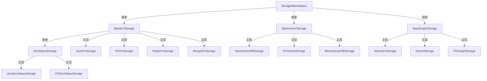
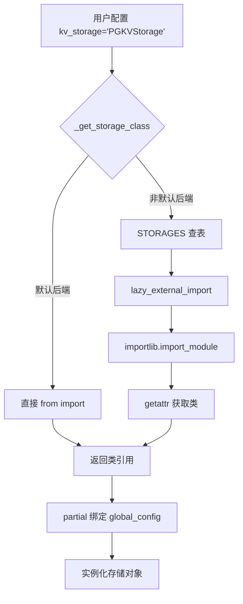

# PD-293.01 LightRAG — 四层存储抽象与 STORAGES 注册表插件化

> 文档编号：PD-293.01
> 来源：LightRAG `lightrag/base.py` `lightrag/kg/__init__.py` `lightrag/lightrag.py`
> GitHub：https://github.com/HKUDS/LightRAG.git
> 问题域：PD-293 多后端存储抽象 Multi-Backend Storage Abstraction
> 状态：可复用方案

---

## 第 1 章 问题与动机

### 1.1 核心问题

RAG 系统需要同时管理四种截然不同的数据形态：键值对（文档/缓存）、向量嵌入（语义检索）、图结构（知识图谱）和文档状态（处理流水线）。不同部署环境对存储后端的要求差异巨大——本地开发用 JSON 文件 + NetworkX 即可，生产环境则需要 PostgreSQL + Milvus + Neo4j 的组合。如果每种后端都硬编码在核心逻辑中，代码会变成一团依赖地狱，且新增后端需要修改核心代码。

### 1.2 LightRAG 的解法概述

LightRAG 设计了一套四层存储抽象体系，核心要点：

1. **四个 ABC 基类**：`StorageNameSpace` → `BaseKVStorage` / `BaseVectorStorage` / `BaseGraphStorage` / `DocStatusStorage`，定义在 `lightrag/base.py:173-823`，每层有独立的抽象方法契约
2. **STORAGES 注册表**：`lightrag/kg/__init__.py:97-119` 维护一个 `{类名: 模块路径}` 的静态字典，18 个存储实现全部注册
3. **lazy import + 直接 import 双模式**：`lightrag/lightrag.py:1098-1120` 中 `_get_storage_class()` 对默认后端（Json/NanoVector/NetworkX）使用直接 import 避免启动开销，非默认后端走 `lazy_external_import()` 动态加载
4. **环境变量前置校验**：`STORAGE_ENV_REQUIREMENTS` 字典 + `check_storage_env_vars()` 在实例化前检查必需环境变量，fail-fast
5. **兼容性矩阵验证**：`STORAGE_IMPLEMENTATIONS` 字典 + `verify_storage_implementation()` 确保用户不会把 KV 实现配到 Graph 槽位

### 1.3 设计思想

| 设计原则 | 具体实现 | 理由 | 替代方案 |
|----------|----------|------|----------|
| 四层职责分离 | KV/Vector/Graph/DocStatus 四个独立 ABC | 每种数据形态的操作语义完全不同，强制分离避免 God Interface | 单一 BaseStorage 统一接口 |
| 注册表 + lazy import | STORAGES dict + importlib 动态加载 | 18 个后端各自依赖 asyncpg/neo4j/pymilvus 等重型库，启动时全部 import 不现实 | 入口文件 import all |
| 字符串配置驱动 | `kv_storage="PGKVStorage"` 字符串传入 | 用户只需改一个字符串即可切换后端，无需修改任何 import | 直接传入类引用 |
| 环境变量前置校验 | STORAGE_ENV_REQUIREMENTS + check_storage_env_vars | 避免运行到一半才发现缺少数据库密码，fail-fast 原则 | 连接时才报错 |
| batch 方法默认实现 | BaseGraphStorage 提供 get_nodes_batch 等 5 个默认逐条实现 | 新后端只需实现核心方法即可工作，性能优化可渐进覆盖 | 全部 abstract |

---

## 第 2 章 源码实现分析

### 2.1 架构概览

LightRAG 的存储抽象分为三层：抽象层（base.py）、注册层（kg/__init__.py）、实现层（kg/*_impl.py）。

```
┌─────────────────────────────────────────────────────────────────┐
│                    LightRAG 主类 (lightrag.py)                   │
│  kv_storage="PGKVStorage"  vector_storage="MilvusVectorDBStorage"│
│  graph_storage="Neo4JStorage"  doc_status_storage="PGDocStatus"  │
└──────────┬──────────────────────────────────────────────────────┘
           │ _get_storage_class(name)
           ▼
┌─────────────────────────────────────────────────────────────────┐
│              STORAGES 注册表 (kg/__init__.py)                     │
│  {"PGKVStorage": ".kg.postgres_impl", ...}  18 个映射            │
│  STORAGE_IMPLEMENTATIONS: 兼容性矩阵                              │
│  STORAGE_ENV_REQUIREMENTS: 环境变量需求表                          │
└──────────┬──────────────────────────────────────────────────────┘
           │ lazy_external_import / direct import
           ▼
┌─────────────────────────────────────────────────────────────────┐
│                    四层 ABC 基类 (base.py)                        │
│  StorageNameSpace (namespace, workspace, global_config)          │
│    ├── BaseKVStorage      (get_by_id, upsert, filter_keys, ...) │
│    ├── BaseVectorStorage  (query, upsert, delete_entity, ...)   │
│    ├── BaseGraphStorage   (has_node, upsert_node, get_edge, ...)│
│    └── DocStatusStorage   (get_status_counts, get_docs_by_*, ..)│
└──────────┬──────────────────────────────────────────────────────┘
           │ 继承实现
           ▼
┌─────────────────────────────────────────────────────────────────┐
│                   13 个实现文件 (kg/*_impl.py)                    │
│  json_kv_impl / nano_vector_db_impl / networkx_impl (默认)       │
│  postgres_impl (PGKVStorage+PGVectorStorage+PGGraphStorage+PGDoc)│
│  mongo_impl / redis_impl / neo4j_impl / milvus_impl / ...       │
└─────────────────────────────────────────────────────────────────┘
```

### 2.2 核心实现

#### 2.2.1 四层 ABC 基类继承体系



对应源码 `lightrag/base.py:173-215`（StorageNameSpace 根基类）：

```python
@dataclass
class StorageNameSpace(ABC):
    namespace: str
    workspace: str
    global_config: dict[str, Any]

    async def initialize(self):
        """Initialize the storage"""
        pass

    async def finalize(self):
        """Finalize the storage"""
        pass

    @abstractmethod
    async def index_done_callback(self) -> None:
        """Commit the storage operations after indexing"""

    @abstractmethod
    async def drop(self) -> dict[str, str]:
        """Drop all data from storage and clean up resources"""
```

`BaseVectorStorage` 在此基础上增加了 embedding 相关字段和 8 个抽象方法（`lightrag/base.py:218-353`）：

```python
@dataclass
class BaseVectorStorage(StorageNameSpace, ABC):
    embedding_func: EmbeddingFunc
    cosine_better_than_threshold: float = field(default=0.2)
    meta_fields: set[str] = field(default_factory=set)

    @abstractmethod
    async def query(self, query: str, top_k: int,
                    query_embedding: list[float] = None) -> list[dict[str, Any]]: ...
    @abstractmethod
    async def upsert(self, data: dict[str, dict[str, Any]]) -> None: ...
    @abstractmethod
    async def delete_entity(self, entity_name: str) -> None: ...
    @abstractmethod
    async def get_by_id(self, id: str) -> dict[str, Any] | None: ...
    @abstractmethod
    async def get_by_ids(self, ids: list[str]) -> list[dict[str, Any]]: ...
    @abstractmethod
    async def delete(self, ids: list[str]): ...
    @abstractmethod
    async def get_vectors_by_ids(self, ids: list[str]) -> dict[str, list[float]]: ...
```

#### 2.2.2 STORAGES 注册表与 lazy import



对应源码 `lightrag/lightrag.py:1098-1120`：

```python
def _get_storage_class(self, storage_name: str) -> Callable[..., Any]:
    # Direct imports for default storage implementations
    if storage_name == "JsonKVStorage":
        from lightrag.kg.json_kv_impl import JsonKVStorage
        return JsonKVStorage
    elif storage_name == "NanoVectorDBStorage":
        from lightrag.kg.nano_vector_db_impl import NanoVectorDBStorage
        return NanoVectorDBStorage
    elif storage_name == "NetworkXStorage":
        from lightrag.kg.networkx_impl import NetworkXStorage
        return NetworkXStorage
    elif storage_name == "JsonDocStatusStorage":
        from lightrag.kg.json_doc_status_impl import JsonDocStatusStorage
        return JsonDocStatusStorage
    else:
        # Fallback to dynamic import for other storage implementations
        import_path = STORAGES[storage_name]
        storage_class = lazy_external_import(import_path, storage_name)
        return storage_class
```

对应源码 `lightrag/utils.py:1867-1883`（lazy_external_import 实现）：

```python
def lazy_external_import(module_name: str, class_name: str) -> Callable[..., Any]:
    """Lazily import a class from an external module based on the package of the caller."""
    import inspect
    caller_frame = inspect.currentframe().f_back
    module = inspect.getmodule(caller_frame)
    package = module.__package__ if module else None

    def import_class(*args: Any, **kwargs: Any):
        import importlib
        module = importlib.import_module(module_name, package=package)
        cls = getattr(module, class_name)
        return cls(*args, **kwargs)

    return import_class
```

### 2.3 实现细节

#### 环境变量前置校验

`lightrag/kg/__init__.py:44-94` 定义了每个后端的环境变量需求：

```python
STORAGE_ENV_REQUIREMENTS: dict[str, list[str]] = {
    "JsonKVStorage": [],                    # 无外部依赖
    "PGKVStorage": ["POSTGRES_USER", "POSTGRES_PASSWORD", "POSTGRES_DATABASE"],
    "Neo4JStorage": ["NEO4J_URI", "NEO4J_USERNAME", "NEO4J_PASSWORD"],
    "MilvusVectorDBStorage": ["MILVUS_URI", "MILVUS_DB_NAME"],
    "MongoKVStorage": ["MONGO_URI", "MONGO_DATABASE"],
    # ... 共 18 个后端
}
```

`lightrag/lightrag.py:484-495` 在 `__post_init__` 中循环校验四个槽位：

```python
storage_configs = [
    ("KV_STORAGE", self.kv_storage),
    ("VECTOR_STORAGE", self.vector_storage),
    ("GRAPH_STORAGE", self.graph_storage),
    ("DOC_STATUS_STORAGE", self.doc_status_storage),
]
for storage_type, storage_name in storage_configs:
    verify_storage_implementation(storage_type, storage_name)
    check_storage_env_vars(storage_name)
```

#### 兼容性矩阵

`lightrag/kg/__init__.py:1-42` 定义了哪些实现可以放在哪个槽位：

```python
STORAGE_IMPLEMENTATIONS = {
    "KV_STORAGE": {
        "implementations": ["JsonKVStorage", "RedisKVStorage", "PGKVStorage", "MongoKVStorage"],
        "required_methods": ["get_by_id", "upsert"],
    },
    "GRAPH_STORAGE": {
        "implementations": ["NetworkXStorage", "Neo4JStorage", "PGGraphStorage",
                           "MongoGraphStorage", "MemgraphStorage"],
        "required_methods": ["upsert_node", "upsert_edge"],
    },
    # ...
}
```

#### Namespace + Workspace 数据隔离

每个存储实例通过 `namespace`（数据类型）和 `workspace`（租户）两个维度隔离。`lightrag/lightrag.py:584-658` 展示了 12 个存储实例的创建，每个都绑定不同的 NameSpace：

```python
self.full_docs: BaseKVStorage = self.key_string_value_json_storage_cls(
    namespace=NameSpace.KV_STORE_FULL_DOCS,
    workspace=self.workspace,
    embedding_func=self.embedding_func,
)
self.chunk_entity_relation_graph: BaseGraphStorage = self.graph_storage_cls(
    namespace=NameSpace.GRAPH_STORE_CHUNK_ENTITY_RELATION,
    workspace=self.workspace,
    embedding_func=self.embedding_func,
)
```

#### BaseGraphStorage 的 batch 默认实现

`lightrag/base.py:493-566` 提供了 5 个 batch 方法的默认逐条实现，子类可选择性覆盖以优化性能：

```python
async def get_nodes_batch(self, node_ids: list[str]) -> dict[str, dict]:
    """Default implementation fetches nodes one by one.
    Override this method for better performance in storage backends
    that support batch operations."""
    result = {}
    for node_id in node_ids:
        node = await self.get_node(node_id)
        if node is not None:
            result[node_id] = node
    return result
```

---

## 第 3 章 迁移指南

### 3.1 迁移清单

**阶段 1：定义抽象层**
- [ ] 创建 `StorageNameSpace` 根 dataclass，包含 `namespace`、`workspace`、`global_config` 三个字段
- [ ] 根据数据形态定义 ABC 子类（KV / Vector / Graph / DocStatus），每个声明 `@abstractmethod`
- [ ] 为 Graph 类的 batch 方法提供默认逐条实现

**阶段 2：构建注册表**
- [ ] 创建 `STORAGES` 字典：`{类名: 模块相对路径}`
- [ ] 创建 `STORAGE_IMPLEMENTATIONS` 兼容性矩阵
- [ ] 创建 `STORAGE_ENV_REQUIREMENTS` 环境变量需求表
- [ ] 实现 `verify_storage_implementation()` 和 `check_storage_env_vars()`

**阶段 3：实现 lazy import**
- [ ] 实现 `lazy_external_import(module_name, class_name)` 工具函数
- [ ] 在主类中实现 `_get_storage_class()`，默认后端直接 import，其余走 lazy import
- [ ] 用 `functools.partial` 绑定 `global_config` 到存储类

**阶段 4：实现具体后端**
- [ ] 先实现 JSON 文件后端（零依赖，用于开发和测试）
- [ ] 再实现 PostgreSQL 后端（覆盖 KV + Vector + Graph + DocStatus 四层）
- [ ] 按需添加 Redis / MongoDB / Neo4j / Milvus 等后端

### 3.2 适配代码模板

以下是一个可直接复用的四层存储抽象骨架：

```python
from abc import ABC, abstractmethod
from dataclasses import dataclass, field
from typing import Any, Callable
import importlib
import inspect
import os


# ── 注册表 ──────────────────────────────────────────────
STORAGES: dict[str, str] = {
    "JsonKVStorage": ".backends.json_impl",
    "PGKVStorage": ".backends.pg_impl",
    "NanoVectorStorage": ".backends.nano_impl",
    "PGVectorStorage": ".backends.pg_impl",
    "NetworkXGraphStorage": ".backends.networkx_impl",
    "PGGraphStorage": ".backends.pg_impl",
}

STORAGE_ENV_REQUIREMENTS: dict[str, list[str]] = {
    "JsonKVStorage": [],
    "PGKVStorage": ["PG_USER", "PG_PASSWORD", "PG_DATABASE"],
    "NanoVectorStorage": [],
    "PGVectorStorage": ["PG_USER", "PG_PASSWORD", "PG_DATABASE"],
    "NetworkXGraphStorage": [],
    "PGGraphStorage": ["PG_USER", "PG_PASSWORD", "PG_DATABASE"],
}

STORAGE_SLOTS: dict[str, list[str]] = {
    "KV": ["JsonKVStorage", "PGKVStorage"],
    "VECTOR": ["NanoVectorStorage", "PGVectorStorage"],
    "GRAPH": ["NetworkXGraphStorage", "PGGraphStorage"],
}


def check_env_vars(storage_name: str) -> None:
    required = STORAGE_ENV_REQUIREMENTS.get(storage_name, [])
    missing = [v for v in required if v not in os.environ]
    if missing:
        raise ValueError(
            f"Storage '{storage_name}' requires env vars: {', '.join(missing)}"
        )


def verify_slot(slot: str, storage_name: str) -> None:
    allowed = STORAGE_SLOTS.get(slot, [])
    if storage_name not in allowed:
        raise ValueError(
            f"'{storage_name}' not compatible with slot {slot}. "
            f"Allowed: {allowed}"
        )


# ── lazy import ─────────────────────────────────────────
def lazy_import(module_path: str, class_name: str) -> Callable:
    caller = inspect.getmodule(inspect.currentframe().f_back)
    package = caller.__package__ if caller else None

    def factory(*args, **kwargs):
        mod = importlib.import_module(module_path, package=package)
        cls = getattr(mod, class_name)
        return cls(*args, **kwargs)
    return factory


# ── 抽象基类 ────────────────────────────────────────────
@dataclass
class StorageNameSpace(ABC):
    namespace: str
    workspace: str
    global_config: dict[str, Any]

    async def initialize(self): pass
    async def finalize(self): pass

    @abstractmethod
    async def index_done_callback(self) -> None: ...

    @abstractmethod
    async def drop(self) -> dict[str, str]: ...


@dataclass
class BaseKVStorage(StorageNameSpace, ABC):
    @abstractmethod
    async def get_by_id(self, id: str) -> dict | None: ...
    @abstractmethod
    async def upsert(self, data: dict[str, dict]) -> None: ...
    @abstractmethod
    async def delete(self, ids: list[str]) -> None: ...


@dataclass
class BaseVectorStorage(StorageNameSpace, ABC):
    embedding_dim: int = 1536

    @abstractmethod
    async def query(self, text: str, top_k: int) -> list[dict]: ...
    @abstractmethod
    async def upsert(self, data: dict[str, dict]) -> None: ...


@dataclass
class BaseGraphStorage(StorageNameSpace, ABC):
    @abstractmethod
    async def upsert_node(self, node_id: str, data: dict) -> None: ...
    @abstractmethod
    async def upsert_edge(self, src: str, tgt: str, data: dict) -> None: ...
    @abstractmethod
    async def get_node(self, node_id: str) -> dict | None: ...

    # 默认 batch 实现，子类可覆盖优化
    async def get_nodes_batch(self, ids: list[str]) -> dict[str, dict]:
        result = {}
        for nid in ids:
            node = await self.get_node(nid)
            if node:
                result[nid] = node
        return result
```

### 3.3 适用场景

| 场景 | 适用度 | 说明 |
|------|--------|------|
| RAG 系统多后端切换 | ⭐⭐⭐ | 完美匹配：KV + Vector + Graph 三层正好覆盖 RAG 核心数据 |
| Agent 工具系统存储 | ⭐⭐⭐ | 工具执行结果、缓存、状态都可映射到 KV 层 |
| 知识图谱应用 | ⭐⭐⭐ | Graph 层抽象直接可用，支持 Neo4j/NetworkX/PG 切换 |
| 简单 CRUD 应用 | ⭐ | 过度设计，直接用 ORM 更合适 |
| 单一后端项目 | ⭐ | 不需要抽象层，直接用具体实现即可 |

---

## 第 4 章 测试用例

```python
import pytest
from unittest.mock import AsyncMock, patch, MagicMock
from dataclasses import dataclass
from typing import Any


# ── 测试注册表校验 ──────────────────────────────────────
class TestStorageRegistry:
    def test_verify_slot_valid(self):
        """验证合法的槽位-实现组合不抛异常"""
        verify_slot("KV", "JsonKVStorage")
        verify_slot("KV", "PGKVStorage")
        verify_slot("VECTOR", "NanoVectorStorage")

    def test_verify_slot_invalid(self):
        """验证非法组合抛出 ValueError"""
        with pytest.raises(ValueError, match="not compatible"):
            verify_slot("KV", "PGVectorStorage")

    def test_check_env_vars_missing(self):
        """验证缺少环境变量时 fail-fast"""
        with patch.dict("os.environ", {}, clear=True):
            with pytest.raises(ValueError, match="requires env vars"):
                check_env_vars("PGKVStorage")

    def test_check_env_vars_present(self):
        """验证环境变量齐全时不抛异常"""
        env = {"PG_USER": "u", "PG_PASSWORD": "p", "PG_DATABASE": "db"}
        with patch.dict("os.environ", env):
            check_env_vars("PGKVStorage")

    def test_json_storage_no_env_required(self):
        """验证 JSON 后端无需环境变量"""
        with patch.dict("os.environ", {}, clear=True):
            check_env_vars("JsonKVStorage")  # 不应抛异常


# ── 测试 lazy import ────────────────────────────────────
class TestLazyImport:
    def test_lazy_import_defers_loading(self):
        """验证 lazy import 不会立即加载模块"""
        factory = lazy_import(".backends.pg_impl", "PGKVStorage")
        # factory 是一个 callable，此时模块尚未加载
        assert callable(factory)

    @patch("importlib.import_module")
    def test_lazy_import_loads_on_call(self, mock_import):
        """验证调用时才触发 import"""
        mock_cls = MagicMock()
        mock_module = MagicMock()
        mock_module.PGKVStorage = mock_cls
        mock_import.return_value = mock_module

        factory = lazy_import(".backends.pg_impl", "PGKVStorage")
        factory(namespace="test", workspace="default", global_config={})

        mock_import.assert_called_once()
        mock_cls.assert_called_once()


# ── 测试存储基类契约 ────────────────────────────────────
class TestBaseGraphStorageBatch:
    @pytest.mark.asyncio
    async def test_default_batch_delegates_to_single(self):
        """验证默认 batch 实现逐条调用 get_node"""
        @dataclass
        class MockGraph(BaseGraphStorage):
            async def index_done_callback(self): pass
            async def drop(self): return {"status": "success", "message": "dropped"}
            async def upsert_node(self, nid, data): pass
            async def upsert_edge(self, src, tgt, data): pass
            async def get_node(self, nid):
                return {"name": nid} if nid != "missing" else None

        graph = MockGraph(namespace="test", workspace="", global_config={})
        result = await graph.get_nodes_batch(["a", "b", "missing"])
        assert result == {"a": {"name": "a"}, "b": {"name": "b"}}
        assert "missing" not in result
```

---

## 第 5 章 跨域关联

| 关联域 | 关系类型 | 说明 |
|--------|----------|------|
| PD-04 工具系统 | 协同 | 存储后端本身可作为工具暴露给 Agent，LightRAG 的 KV/Vector/Graph 查询方法可封装为 Tool |
| PD-06 记忆持久化 | 依赖 | 记忆系统的底层存储正是 KV 层（如 llm_response_cache），LightRAG 用 BaseKVStorage 承载 LLM 缓存 |
| PD-08 搜索与检索 | 依赖 | RAG 检索依赖 Vector 层的 query 方法和 Graph 层的 get_knowledge_graph 方法 |
| PD-03 容错与重试 | 协同 | PostgreSQL 后端内置了 tenacity 重试（`lightrag/kg/postgres_impl.py:17-25`），存储层的容错直接影响系统可靠性 |
| PD-11 可观测性 | 协同 | 存储初始化和操作过程中的 logger 调用提供了可观测性基础，如 `lightrag/kg/json_kv_impl.py:73-75` 的加载日志 |

---

## 第 6 章 来源文件索引

| 文件 | 行范围 | 关键实现 |
|------|--------|----------|
| `lightrag/base.py` | L173-L215 | StorageNameSpace 根基类定义 |
| `lightrag/base.py` | L218-L353 | BaseVectorStorage 抽象类（8 个抽象方法） |
| `lightrag/base.py` | L356-L402 | BaseKVStorage 抽象类（6 个抽象方法） |
| `lightrag/base.py` | L405-L702 | BaseGraphStorage 抽象类（15+ 方法含 5 个 batch 默认实现） |
| `lightrag/base.py` | L762-L823 | DocStatusStorage 抽象类（分页、状态查询） |
| `lightrag/kg/__init__.py` | L1-L42 | STORAGE_IMPLEMENTATIONS 兼容性矩阵 |
| `lightrag/kg/__init__.py` | L44-L94 | STORAGE_ENV_REQUIREMENTS 环境变量需求表 |
| `lightrag/kg/__init__.py` | L97-L119 | STORAGES 注册表（18 个后端映射） |
| `lightrag/kg/__init__.py` | L122-L141 | verify_storage_implementation 校验函数 |
| `lightrag/lightrag.py` | L143-L153 | LightRAG 四个存储字符串配置字段 |
| `lightrag/lightrag.py` | L484-L495 | __post_init__ 中的四槽位循环校验 |
| `lightrag/lightrag.py` | L562-L579 | _get_storage_class + partial 绑定 |
| `lightrag/lightrag.py` | L584-L658 | 12 个存储实例创建（namespace 隔离） |
| `lightrag/lightrag.py` | L678-L716 | initialize_storages 顺序初始化 |
| `lightrag/lightrag.py` | L1098-L1120 | _get_storage_class 双模式加载 |
| `lightrag/utils.py` | L1867-L1883 | lazy_external_import 实现 |
| `lightrag/utils.py` | L2337-L2355 | check_storage_env_vars 实现 |
| `lightrag/kg/json_kv_impl.py` | L27-L76 | JsonKVStorage 默认 KV 后端实现 |
| `lightrag/kg/postgres_impl.py` | L128-L201 | PostgreSQLDB 连接池管理（SSL + 重试） |
| `lightrag/kg/postgres_impl.py` | L1887-L1946 | PGKVStorage 实现（workspace 优先级） |

---

## 第 7 章 横向对比维度

```json comparison_data
{
  "project": "LightRAG",
  "dimensions": {
    "存储分层": "四层 ABC：KV / Vector / Graph / DocStatus，职责严格分离",
    "注册机制": "STORAGES 静态字典 + STORAGE_IMPLEMENTATIONS 兼容性矩阵双重校验",
    "加载策略": "默认后端直接 import + 非默认 lazy_external_import 双模式",
    "环境校验": "STORAGE_ENV_REQUIREMENTS 前置 fail-fast，启动时即检查缺失变量",
    "后端数量": "18 个实现覆盖 JSON/Redis/PG/Mongo/Neo4j/Milvus/Qdrant/Faiss/Memgraph",
    "数据隔离": "namespace × workspace 二维隔离，同一后端可承载多租户多数据类型",
    "渐进优化": "BaseGraphStorage 提供 5 个 batch 默认实现，子类可选择性覆盖"
  }
}
```

### 域元数据补充

```json domain_metadata
{
  "solution_summary": "LightRAG 用四层 ABC(KV/Vector/Graph/DocStatus) + STORAGES 静态注册表 + lazy_external_import 实现 18 个存储后端的插件化切换，默认后端直接 import 零开销",
  "description": "多后端存储系统需要兼容性矩阵防止槽位错配，以及 namespace×workspace 二维数据隔离",
  "sub_problems": [
    "槽位兼容性校验（防止 KV 实现误配到 Graph 槽位）",
    "默认后端与非默认后端的加载性能差异处理",
    "多租户 namespace×workspace 二维数据隔离"
  ],
  "best_practices": [
    "默认后端直接 import + 非默认 lazy import 双模式平衡启动速度",
    "batch 方法提供默认逐条实现，新后端可渐进优化",
    "兼容性矩阵 + 环境变量需求表双重前置校验"
  ]
}
```
