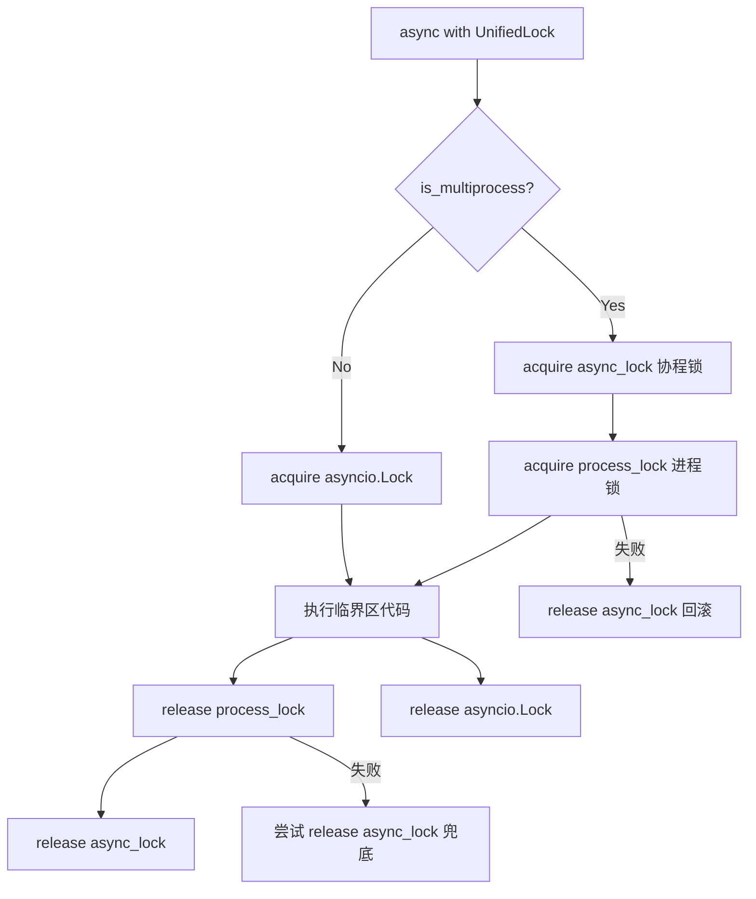
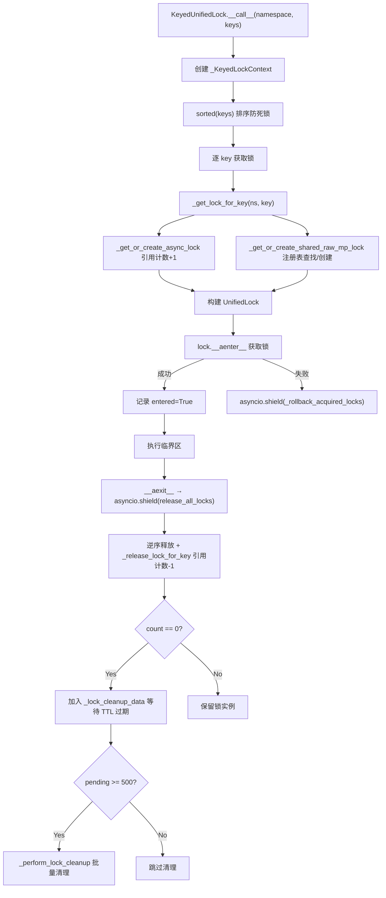
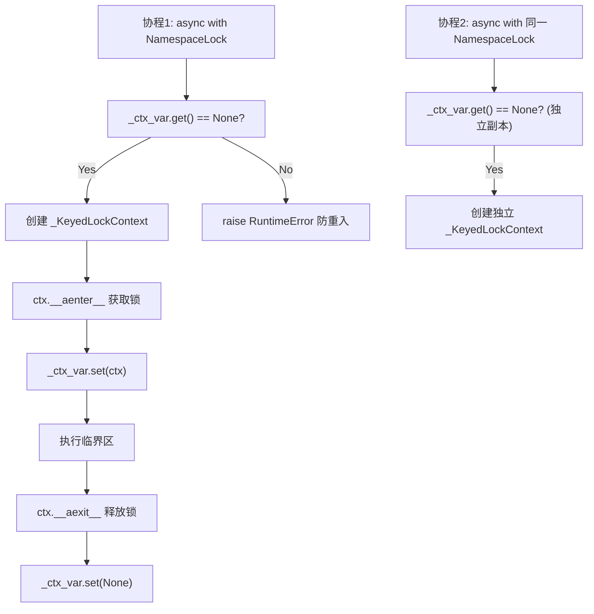

# PD-294.01 LightRAG — UnifiedLock 统一锁抽象与多进程并发控制

> 文档编号：PD-294.01
> 来源：LightRAG `lightrag/kg/shared_storage.py`
> GitHub：https://github.com/HKUDS/LightRAG.git
> 问题域：PD-294 多进程并发控制 Multi-Process Concurrency Control
> 状态：可复用方案

---

## 第 1 章 问题与动机

### 1.1 核心问题

RAG 系统在生产环境中通常通过 Gunicorn 多 worker 模式部署以提升吞吐量。这带来一个根本性挑战：**同一份知识图谱数据需要被多个进程安全地并发读写**。

具体子问题包括：

1. **锁类型不统一**：单进程用 `asyncio.Lock`（协程级），多进程用 `multiprocessing.Lock`（进程级），两者 API 不兼容，业务代码需要到处 if-else
2. **细粒度锁管理**：知识图谱中每个实体/关系需要独立的锁（keyed lock），但锁数量可能达到数万级别，需要自动清理机制
3. **死锁风险**：多个协程同时获取多把 keyed lock 时，获取顺序不一致会导致死锁
4. **协程隔离**：同一个 NamespaceLock 实例在多个协程中并发使用时，需要防止状态互相干扰
5. **取消安全**：asyncio 任务被取消时，已获取的锁必须被正确释放，否则造成永久死锁

### 1.2 LightRAG 的解法概述

LightRAG 在 `lightrag/kg/shared_storage.py` 中实现了一套三层锁抽象体系：

1. **UnifiedLock**（`shared_storage.py:137`）— 统一锁接口，封装 `asyncio.Lock` 和 `multiprocessing.Lock`，支持 `async with` 和 `with` 两种上下文管理器
2. **KeyedUnifiedLock**（`shared_storage.py:529`）— 带键锁管理器，为每个 key 动态创建/复用锁实例，含引用计数和过期清理
3. **NamespaceLock**（`shared_storage.py:1486`）— 命名空间锁包装器，通过 `ContextVar` 实现协程隔离，支持同一实例在多协程中安全复用
4. **_KeyedLockContext**（`shared_storage.py:817`）— 多键上下文管理器，排序获取防死锁，`asyncio.shield` 保护释放过程
5. **initialize_share_data**（`shared_storage.py:1176`）— 工厂函数，根据 worker 数量自动选择单进程或多进程模式

### 1.3 设计思想

| 设计原则 | 具体实现 | 理由 | 替代方案 |
|----------|----------|------|----------|
| 运行时多态 | `initialize_share_data(workers)` 根据 worker 数决定锁类型 | 业务代码零感知切换单/多进程 | 编译时泛型（不适合 Python 动态场景） |
| 排序获取 | `_KeyedLockContext.__init__` 中 `sorted(keys)` | 全局一致的获取顺序消除死锁 | 超时检测+重试（复杂且不确定） |
| 引用计数+延迟清理 | `_lock_registry_count` + `_lock_cleanup_data` + 300s TTL | 避免锁泄漏，同时避免频繁创建销毁 | LRU 缓存（无法精确追踪使用状态） |
| ContextVar 协程隔离 | `NamespaceLock._ctx_var` 每协程独立上下文 | 同一锁实例可安全并发使用 | 每次创建新实例（内存浪费） |
| asyncio.shield 保护 | `__aexit__` 和 `_rollback_acquired_locks` 中使用 | 任务取消时仍能完成锁释放 | 不保护（可能永久死锁） |
| 双层锁（进程锁+协程锁） | 多进程模式下 `UnifiedLock` 同时持有 `_lock` 和 `_async_lock` | 进程锁是同步阻塞的，需要协程锁防止事件循环阻塞 | 纯进程锁（会阻塞事件循环） |

---

## 第 2 章 源码实现分析

### 2.1 架构概览

LightRAG 的并发控制体系分为三层，从底层到上层依次是：

```
┌─────────────────────────────────────────────────────────────┐
│                    业务层 (operate.py / utils_graph.py)       │
│  get_storage_keyed_lock(["entity_name"], namespace="GraphDB")│
│  get_namespace_lock("pipeline_status", workspace="ws1")      │
├─────────────────────────────────────────────────────────────┤
│                    管理层 (shared_storage.py)                 │
│  ┌──────────────┐  ┌──────────────────┐  ┌───────────────┐ │
│  │NamespaceLock │  │KeyedUnifiedLock  │  │FactoryFuncs   │ │
│  │ContextVar    │  │引用计数+TTL清理   │  │get_internal_  │ │
│  │协程隔离      │  │排序获取防死锁     │  │lock/data_init │ │
│  └──────┬───────┘  └────────┬─────────┘  └───────┬───────┘ │
│         │                   │                     │         │
│         └───────────────────┼─────────────────────┘         │
│                             ▼                               │
│  ┌──────────────────────────────────────────────────────┐   │
│  │              UnifiedLock (统一锁接口)                  │   │
│  │  async with / with 双模式上下文管理器                  │   │
│  │  双层锁: process_lock + async_lock (多进程模式)        │   │
│  └──────────────────────┬───────────────────────────────┘   │
├─────────────────────────┼───────────────────────────────────┤
│                    基础层 │                                   │
│         ┌────────────────┼────────────────┐                 │
│         ▼                ▼                ▼                 │
│  ┌─────────────┐  ┌─────────────┐  ┌──────────────┐       │
│  │asyncio.Lock │  │mp.Manager   │  │mp.Manager    │       │
│  │(单进程模式)  │  │.Lock()      │  │.RLock()      │       │
│  │             │  │(多进程模式)   │  │(注册表守卫)   │       │
│  └─────────────┘  └─────────────┘  └──────────────┘       │
└─────────────────────────────────────────────────────────────┘
```

### 2.2 核心实现

#### 2.2.1 UnifiedLock — 统一锁接口



对应源码 `lightrag/kg/shared_storage.py:137-317`：

```python
class UnifiedLock(Generic[T]):
    """Provide a unified lock interface type for asyncio.Lock and multiprocessing.Lock"""

    def __init__(
        self,
        lock: Union[ProcessLock, asyncio.Lock],
        is_async: bool,
        name: str = "unnamed",
        enable_logging: bool = True,
        async_lock: Optional[asyncio.Lock] = None,
    ):
        self._lock = lock
        self._is_async = is_async
        self._async_lock = async_lock  # auxiliary lock for coroutine synchronization

    async def __aenter__(self) -> "UnifiedLock[T]":
        try:
            # If in multiprocess mode and async lock exists, acquire it first
            if not self._is_async and self._async_lock is not None:
                await self._async_lock.acquire()
            # Acquire the main lock
            if self._is_async:
                await self._lock.acquire()
            else:
                self._lock.acquire()  # 同步阻塞，但已被 async_lock 保护
            return self
        except Exception as e:
            # If main lock acquisition fails, release the async lock if it was acquired
            if not self._is_async and self._async_lock is not None and self._async_lock.locked():
                self._async_lock.release()
            raise
```

关键设计：多进程模式下采用**双层锁**策略。`multiprocessing.Manager.Lock()` 是同步阻塞的，直接在 async 上下文中调用会阻塞事件循环。因此先获取一个 `asyncio.Lock` 作为协程级门卫，确保同一进程内同一时刻只有一个协程去获取进程锁（`shared_storage.py:157-172`）。

#### 2.2.2 KeyedUnifiedLock — 带键锁管理器与自动清理



对应源码 `lightrag/kg/shared_storage.py:529-660`（KeyedUnifiedLock 核心方法）：

```python
class KeyedUnifiedLock:
    def __init__(self, *, default_enable_logging: bool = True) -> None:
        self._async_lock: Dict[str, asyncio.Lock] = {}       # 本地 keyed 协程锁
        self._async_lock_count: Dict[str, int] = {}           # 引用计数
        self._async_lock_cleanup_data: Dict[str, float] = {}  # 清理时间戳
        self._mp_locks: Dict[str, mp.synchronize.Lock] = {}   # 多进程锁代理

    def _get_lock_for_key(self, namespace: str, key: str, enable_logging: bool = False) -> UnifiedLock:
        combined_key = _get_combined_key(namespace, key)
        # 获取或创建协程锁（引用计数+1）
        async_lock = self._get_or_create_async_lock(combined_key)
        # 获取或创建进程锁（通过 Manager 共享）
        raw_lock = _get_or_create_shared_raw_mp_lock(namespace, key)
        is_multiprocess = raw_lock is not None
        if not is_multiprocess:
            raw_lock = async_lock  # 单进程模式直接用 asyncio.Lock
        # 构建 UnifiedLock
        if is_multiprocess:
            return UnifiedLock(lock=raw_lock, is_async=False, async_lock=async_lock)
        else:
            return UnifiedLock(lock=raw_lock, is_async=True, async_lock=None)
```

锁清理机制（`shared_storage.py:324-442`）采用**延迟清理+阈值触发**策略：引用计数归零后不立即删除，而是记录时间戳到 `_lock_cleanup_data`；当待清理数量超过 `CLEANUP_THRESHOLD=500` 且距上次清理超过 `MIN_CLEANUP_INTERVAL_SECONDS=30s` 时，批量清理超过 `CLEANUP_KEYED_LOCKS_AFTER_SECONDS=300s` 的过期锁。

#### 2.2.3 NamespaceLock — ContextVar 协程隔离



对应源码 `lightrag/kg/shared_storage.py:1486-1553`：

```python
class NamespaceLock:
    def __init__(self, namespace: str, workspace: str | None = None, enable_logging: bool = False):
        self._namespace = namespace
        self._workspace = workspace
        # ContextVar 为每个协程提供独立存储
        self._ctx_var: ContextVar[Optional[_KeyedLockContext]] = ContextVar("lock_ctx", default=None)

    async def __aenter__(self):
        # 检查当前协程是否已持有锁（防重入）
        if self._ctx_var.get() is not None:
            raise RuntimeError("NamespaceLock already acquired in current coroutine context")
        ctx = get_storage_keyed_lock(["default_key"], namespace=final_namespace)
        # 先获取锁，成功后才设置 ContextVar（防止获取失败时污染状态）
        result = await ctx.__aenter__()
        self._ctx_var.set(ctx)
        return result

    async def __aexit__(self, exc_type, exc_val, exc_tb):
        ctx = self._ctx_var.get()
        if ctx is None:
            raise RuntimeError("NamespaceLock exited without being entered")
        result = await ctx.__aexit__(exc_type, exc_val, exc_tb)
        self._ctx_var.set(None)  # 清除当前协程的上下文
        return result
```

### 2.3 实现细节

**初始化分叉**（`shared_storage.py:1176-1264`）：`initialize_share_data(workers)` 是整个系统的入口。当 `workers > 1` 时，通过 `multiprocessing.Manager()` 创建共享字典和锁；当 `workers == 1` 时，使用普通 Python 字典和 `asyncio.Lock`。Gunicorn 入口（`run_with_gunicorn.py:269-274`）在 fork worker 之前调用此函数，确保 Manager 对象被所有子进程继承。

**多进程锁注册表**（`shared_storage.py:445-527`）：`_get_or_create_shared_raw_mp_lock` 在 `_registry_guard`（Manager.RLock）保护下操作 `_lock_registry`（Manager.dict），确保跨进程的锁创建是原子的。引用计数归零时不删除锁，而是标记到 `_lock_cleanup_data` 等待 TTL 过期。如果在 TTL 内被重新获取，则从清理列表中移除（`shared_storage.py:466-468`）。

**取消安全的锁释放**（`shared_storage.py:901-906`）：`_KeyedLockContext.__aenter__` 中，如果获取第 N 把锁时失败（包括 `asyncio.CancelledError`），会通过 `asyncio.shield(self._rollback_acquired_locks())` 回滚前 N-1 把已获取的锁。`__aexit__` 同样用 `asyncio.shield` 包裹整个释放过程（`shared_storage.py:1054`），确保即使外部取消也能完成释放。

---

## 第 3 章 迁移指南

### 3.1 迁移清单

**阶段 1：基础锁抽象（1 个文件）**
- [ ] 实现 `UnifiedLock` 类，支持 `async with` 和 `with` 双模式
- [ ] 实现 `initialize_share_data(workers)` 工厂函数
- [ ] 单进程模式使用 `asyncio.Lock`，多进程模式使用 `multiprocessing.Manager.Lock`

**阶段 2：带键锁管理（扩展同一文件）**
- [ ] 实现 `KeyedUnifiedLock` 类，支持按 key 动态创建锁
- [ ] 实现引用计数机制（`_lock_count` 字典）
- [ ] 实现延迟清理机制（TTL + 阈值触发）
- [ ] 实现 `_KeyedLockContext`，支持多键排序获取

**阶段 3：协程隔离与安全（扩展同一文件）**
- [ ] 实现 `NamespaceLock`，使用 `ContextVar` 隔离协程状态
- [ ] 在 `__aenter__` 和 `__aexit__` 中使用 `asyncio.shield` 保护锁释放
- [ ] 实现 `_rollback_acquired_locks` 回滚机制

**阶段 4：集成与部署**
- [ ] 在 Gunicorn 启动脚本中调用 `initialize_share_data(workers)`
- [ ] 在 FastAPI lifespan 中调用 `finalize_share_data()` 清理资源
- [ ] 业务代码统一使用 `get_storage_keyed_lock` 和 `get_namespace_lock`

### 3.2 适配代码模板

以下是一个可直接复用的最小化统一锁实现：

```python
"""unified_lock.py — 可移植的统一锁抽象模板"""
import asyncio
import os
import time
from multiprocessing import Manager
from multiprocessing.synchronize import Lock as ProcessLock
from contextvars import ContextVar
from typing import Dict, Optional, Union

# ---- 全局状态 ----
_is_multiprocess: Optional[bool] = None
_manager: Optional[Manager] = None
_lock_registry: Optional[Dict[str, ProcessLock]] = None
_lock_count: Optional[Dict[str, int]] = None
_registry_guard = None

CLEANUP_TTL = 300  # 锁过期时间（秒）
CLEANUP_THRESHOLD = 500  # 触发清理的待清理数量阈值


class UnifiedLock:
    """统一锁接口：单进程用 asyncio.Lock，多进程用 Manager.Lock + asyncio.Lock 双层"""

    def __init__(self, lock: Union[ProcessLock, asyncio.Lock], is_async: bool,
                 async_lock: Optional[asyncio.Lock] = None):
        self._lock = lock
        self._is_async = is_async
        self._async_lock = async_lock

    async def __aenter__(self):
        if not self._is_async and self._async_lock:
            await self._async_lock.acquire()
        if self._is_async:
            await self._lock.acquire()
        else:
            self._lock.acquire()
        return self

    async def __aexit__(self, *args):
        self._lock.release()
        if not self._is_async and self._async_lock:
            self._async_lock.release()


class KeyedLockManager:
    """带键锁管理器：按 key 动态创建锁，引用计数 + TTL 清理"""

    def __init__(self):
        self._async_locks: Dict[str, asyncio.Lock] = {}
        self._async_count: Dict[str, int] = {}

    def get_lock(self, key: str) -> UnifiedLock:
        async_lock = self._async_locks.get(key)
        if async_lock is None:
            async_lock = asyncio.Lock()
            self._async_locks[key] = async_lock
        self._async_count[key] = self._async_count.get(key, 0) + 1

        if _is_multiprocess:
            with _registry_guard:
                raw = _lock_registry.get(key) or _manager.Lock()
                _lock_registry[key] = raw
            return UnifiedLock(lock=raw, is_async=False, async_lock=async_lock)
        return UnifiedLock(lock=async_lock, is_async=True)

    def release_lock(self, key: str):
        self._async_count[key] = max(0, self._async_count.get(key, 0) - 1)


class SortedKeyedLockContext:
    """多键上下文管理器：排序获取防死锁，shield 保护释放"""

    def __init__(self, manager: KeyedLockManager, keys: list[str]):
        self._manager = manager
        self._keys = sorted(keys)  # 排序防死锁
        self._locks = []

    async def __aenter__(self):
        try:
            for key in self._keys:
                lock = self._manager.get_lock(key)
                await lock.__aenter__()
                self._locks.append((key, lock))
        except BaseException:
            await asyncio.shield(self._rollback())
            raise
        return self

    async def __aexit__(self, *args):
        await asyncio.shield(self._release_all(*args))

    async def _rollback(self):
        for key, lock in reversed(self._locks):
            try:
                await lock.__aexit__(None, None, None)
            except Exception:
                pass
            self._manager.release_lock(key)
        self._locks.clear()

    async def _release_all(self, *args):
        for key, lock in reversed(self._locks):
            try:
                await lock.__aexit__(*args)
            except Exception:
                pass
            self._manager.release_lock(key)
        self._locks.clear()


class NamespaceLock:
    """命名空间锁：ContextVar 协程隔离，支持同一实例多协程安全复用"""

    def __init__(self, namespace: str, manager: KeyedLockManager):
        self._namespace = namespace
        self._manager = manager
        self._ctx: ContextVar[Optional[UnifiedLock]] = ContextVar("ns_lock", default=None)

    async def __aenter__(self):
        if self._ctx.get() is not None:
            raise RuntimeError("NamespaceLock already acquired in current coroutine")
        lock = self._manager.get_lock(self._namespace)
        await lock.__aenter__()
        self._ctx.set(lock)
        return self

    async def __aexit__(self, *args):
        lock = self._ctx.get()
        if lock is None:
            raise RuntimeError("NamespaceLock exited without being entered")
        await lock.__aexit__(*args)
        self._manager.release_lock(self._namespace)
        self._ctx.set(None)


def initialize(workers: int = 1):
    """初始化：根据 worker 数量选择锁模式"""
    global _is_multiprocess, _manager, _lock_registry, _lock_count, _registry_guard
    if workers > 1:
        _is_multiprocess = True
        _manager = Manager()
        _lock_registry = _manager.dict()
        _lock_count = _manager.dict()
        _registry_guard = _manager.RLock()
    else:
        _is_multiprocess = False
```

### 3.3 适用场景

| 场景 | 适用度 | 说明 |
|------|--------|------|
| Gunicorn 多 worker 部署的 Web 服务 | ⭐⭐⭐ | 核心场景，直接复用 |
| 知识图谱/数据库的实体级细粒度锁 | ⭐⭐⭐ | KeyedUnifiedLock 专为此设计 |
| 单进程 asyncio 服务需要未来扩展到多进程 | ⭐⭐⭐ | 零改动切换，只需改 workers 参数 |
| 多进程数据处理管线 | ⭐⭐ | 可用，但可能需要适配非 Web 场景 |
| 纯多线程场景（无 asyncio） | ⭐ | 需要移除 async 相关代码，改用 threading.Lock |

---

## 第 4 章 测试用例

```python
"""test_unified_lock.py — 基于 LightRAG 真实接口的测试用例"""
import asyncio
import time
import pytest
from unittest.mock import MagicMock, AsyncMock


class TestUnifiedLockSafety:
    """测试 UnifiedLock 的安全性"""

    def test_factory_raises_when_not_initialized(self):
        """未初始化时工厂函数应抛出 RuntimeError"""
        # 对应 shared_storage.py:1073-1076
        from lightrag.kg.shared_storage import finalize_share_data, get_internal_lock
        finalize_share_data()
        with pytest.raises(RuntimeError, match="Shared data not initialized"):
            get_internal_lock()

    @pytest.mark.asyncio
    async def test_no_double_release_on_async_lock_failure(self):
        """async_lock 释放失败时不应二次释放"""
        # 对应 shared_storage.py:196-257 的 __aexit__ 双释放防护
        from lightrag.kg.shared_storage import UnifiedLock
        main_lock = MagicMock()
        main_lock.acquire = MagicMock()
        main_lock.release = MagicMock()
        async_lock = AsyncMock()
        release_count = 0
        def mock_fail():
            nonlocal release_count
            release_count += 1
            raise RuntimeError("release failed")
        async_lock.release = MagicMock(side_effect=mock_fail)
        lock = UnifiedLock(lock=main_lock, is_async=False, name="test")
        lock._async_lock = async_lock
        with pytest.raises(RuntimeError):
            async with lock:
                pass
        assert release_count == 1, "async_lock.release should be called exactly once"


class TestKeyedLockDeadlockPrevention:
    """测试排序获取防死锁"""

    @pytest.mark.asyncio
    async def test_sorted_key_acquisition(self):
        """多键获取应按排序顺序，防止死锁"""
        from lightrag.kg.shared_storage import initialize_share_data, finalize_share_data, get_storage_keyed_lock
        initialize_share_data(1)
        try:
            acquired_order = []
            original_aenter = None

            # 验证 _KeyedLockContext 中 keys 已排序
            ctx = get_storage_keyed_lock(["z_key", "a_key", "m_key"], namespace="test")
            assert ctx._keys == ["a_key", "m_key", "z_key"], "Keys should be sorted"
        finally:
            finalize_share_data()


class TestNamespaceLockIsolation:
    """测试 NamespaceLock 的协程隔离"""

    @pytest.mark.asyncio
    async def test_reentrance_blocked(self):
        """同一协程重入应抛出 RuntimeError"""
        from lightrag.kg.shared_storage import initialize_share_data, finalize_share_data, get_namespace_lock, set_default_workspace
        initialize_share_data(1)
        set_default_workspace("test")
        try:
            lock = get_namespace_lock("test_ns", "test_ws")
            with pytest.raises(RuntimeError, match="already acquired"):
                async with lock:
                    async with lock:  # 重入
                        pass
        finally:
            finalize_share_data()

    @pytest.mark.asyncio
    async def test_concurrent_coroutines_isolated(self):
        """不同协程使用同一 NamespaceLock 实例应互不干扰"""
        from lightrag.kg.shared_storage import initialize_share_data, finalize_share_data, get_namespace_lock, set_default_workspace
        initialize_share_data(1)
        set_default_workspace("test")
        try:
            lock = get_namespace_lock("test_ns", "test_ws")
            results = []
            async def worker(cid):
                async with lock:
                    results.append(f"{cid}_start")
                    await asyncio.sleep(0.05)
                    results.append(f"{cid}_end")
            await asyncio.gather(worker(1), worker(2))
            assert len(results) == 4, "Both coroutines should complete"
        finally:
            finalize_share_data()


class TestLockCleanup:
    """测试锁资源自动清理"""

    @pytest.mark.asyncio
    async def test_cleanup_expired_locks(self):
        """过期锁应被正确清理"""
        from lightrag.kg.shared_storage import initialize_share_data, finalize_share_data, cleanup_keyed_lock
        initialize_share_data(1)
        try:
            result = cleanup_keyed_lock()
            assert "cleanup_performed" in result
            assert "current_status" in result
            assert result["cleanup_performed"]["mp_cleaned"] == 0
            assert result["cleanup_performed"]["async_cleaned"] == 0
        finally:
            finalize_share_data()
```

---

## 第 5 章 跨域关联

| 关联域 | 关系类型 | 说明 |
|--------|----------|------|
| PD-06 记忆持久化 | 依赖 | 共享字典 `_shared_dicts` 通过 `Manager.dict()` 实现跨进程持久化，锁系统保护其读写一致性 |
| PD-03 容错与重试 | 协同 | `asyncio.shield` 保护锁释放是容错设计的一部分；`_rollback_acquired_locks` 是获取失败时的回滚策略 |
| PD-05 沙箱隔离 | 协同 | workspace 隔离机制（`get_final_namespace` 的 `workspace:namespace` 前缀）与锁系统配合实现多租户数据隔离 |
| PD-11 可观测性 | 协同 | `direct_log` 函数提供锁操作的结构化日志；`DEBUG_LOCKS` 开关和 `get_debug_n_locks_acquired` 提供锁计数追踪 |
| PD-04 工具系统 | 依赖 | `get_storage_keyed_lock` 被 `operate.py` 和 `utils_graph.py` 中的知识图谱操作工具广泛使用 |

---

## 第 6 章 来源文件索引

| 文件 | 行范围 | 关键实现 |
|------|--------|----------|
| `lightrag/kg/shared_storage.py` | L137-L317 | `UnifiedLock` 统一锁接口，双模式上下文管理器 |
| `lightrag/kg/shared_storage.py` | L324-L442 | `_perform_lock_cleanup` 通用锁清理函数 |
| `lightrag/kg/shared_storage.py` | L445-L527 | `_get_or_create_shared_raw_mp_lock` / `_release_shared_raw_mp_lock` 多进程锁注册表 |
| `lightrag/kg/shared_storage.py` | L529-L815 | `KeyedUnifiedLock` 带键锁管理器 |
| `lightrag/kg/shared_storage.py` | L817-L1069 | `_KeyedLockContext` 多键上下文管理器（排序获取+shield释放） |
| `lightrag/kg/shared_storage.py` | L1071-L1103 | `get_internal_lock` / `get_storage_keyed_lock` / `get_data_init_lock` 工厂函数 |
| `lightrag/kg/shared_storage.py` | L1176-L1264 | `initialize_share_data` 初始化分叉逻辑 |
| `lightrag/kg/shared_storage.py` | L1486-L1583 | `NamespaceLock` + `get_namespace_lock` ContextVar 协程隔离 |
| `lightrag/kg/shared_storage.py` | L1586-L1671 | `finalize_share_data` 资源清理 |
| `lightrag/api/run_with_gunicorn.py` | L269-L274 | Gunicorn 入口调用 `initialize_share_data(workers)` |
| `lightrag/operate.py` | L698-L733 | 业务层使用 `get_storage_keyed_lock` 保护实体重建 |
| `lightrag/utils_graph.py` | L86-L91 | 业务层使用 `get_storage_keyed_lock` 保护实体删除 |
| `tests/test_unified_lock_safety.py` | L1-L123 | UnifiedLock 安全性测试（None 检查、双释放防护） |
| `tests/test_workspace_isolation.py` | L1-L1183 | 11 个场景的工作区隔离测试（锁并行/串行、重入保护、数据隔离） |

---

## 第 7 章 横向对比维度

```json comparison_data
{
  "project": "LightRAG",
  "dimensions": {
    "锁抽象层级": "三层：UnifiedLock → KeyedUnifiedLock → NamespaceLock",
    "并发模型": "asyncio + multiprocessing.Manager 双层锁，运行时按 worker 数切换",
    "死锁预防": "sorted(keys) 全局排序获取 + ContextVar 防重入",
    "锁资源管理": "引用计数 + 300s TTL + 500阈值批量清理",
    "取消安全": "asyncio.shield 保护 __aexit__ 和 rollback，CancelledError 安全",
    "工作区隔离": "workspace:namespace 前缀实现多租户锁隔离"
  }
}
```

### 域元数据补充

```json domain_metadata
{
  "solution_summary": "LightRAG 用 UnifiedLock/KeyedUnifiedLock/NamespaceLock 三层锁抽象实现 asyncio.Lock 与 multiprocessing.Manager.Lock 运行时无缝切换，含引用计数 TTL 清理和 asyncio.shield 取消安全",
  "description": "Gunicorn 多 worker 部署下 RAG 知识图谱的实体级细粒度并发控制",
  "sub_problems": [
    "多进程模式下同步锁阻塞事件循环",
    "锁获取中途被 asyncio.CancelledError 中断的回滚",
    "多租户 workspace 级锁隔离"
  ],
  "best_practices": [
    "双层锁策略：async_lock 门卫 + process_lock 互斥",
    "引用计数+TTL+阈值三重条件触发锁清理",
    "ContextVar.set 延迟到锁获取成功后防止状态污染"
  ]
}
```
