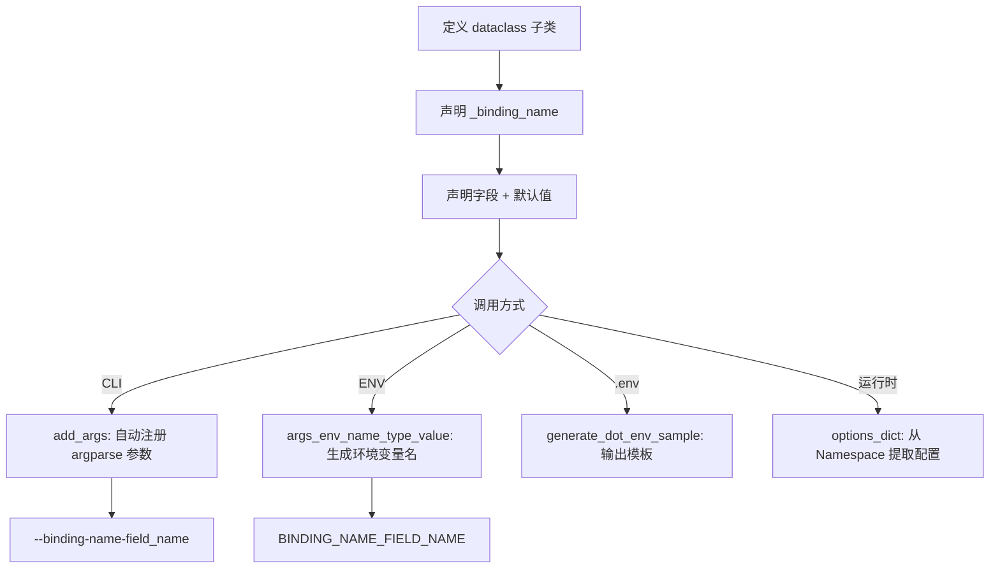
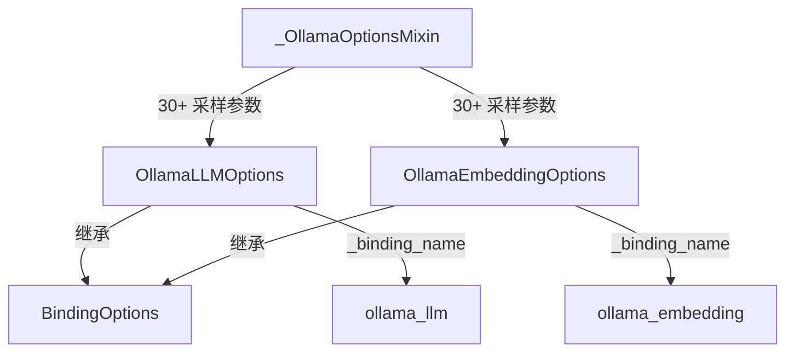
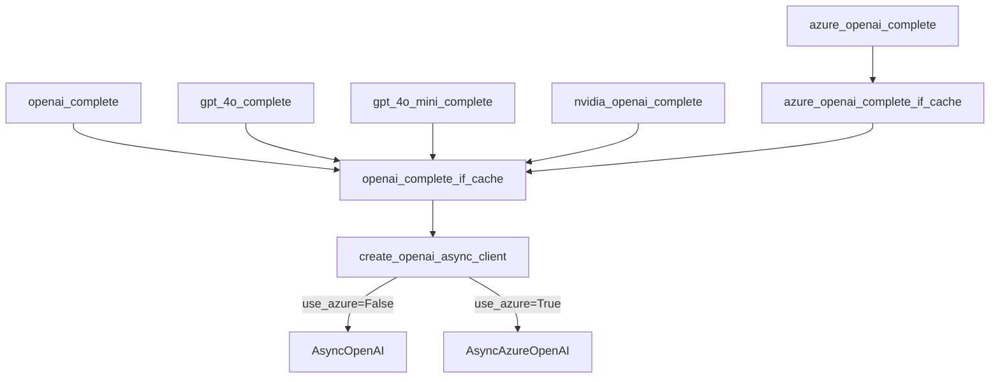

# PD-295.01 LightRAG — BindingOptions dataclass 多提供商统一抽象

> 文档编号：PD-295.01
> 来源：LightRAG `lightrag/llm/binding_options.py`, `lightrag/llm/openai.py`, `lightrag/llm/ollama.py`
> GitHub：https://github.com/HKUDS/LightRAG.git
> 问题域：PD-295 LLM提供商抽象 LLM Provider Abstraction
> 状态：可复用方案

---

## 第 1 章 问题与动机

### 1.1 核心问题

RAG 系统需要同时对接多家 LLM 提供商（OpenAI、Azure、Anthropic、Gemini、Ollama、Bedrock、Zhipu、HuggingFace、LoLLMs、LMDeploy、Jina、NVIDIA 等），每家的 API 签名、认证方式、参数命名、错误类型都不同。如果不做抽象，每新增一个提供商就要修改上层调用逻辑，维护成本指数增长。

核心挑战：
- **参数异构**：OpenAI 用 `max_completion_tokens`，Ollama 用 `num_predict`，Bedrock 用 `maxTokens`
- **认证多样**：API Key（OpenAI/Anthropic/Gemini）、AWS IAM（Bedrock）、本地无认证（Ollama/HF）
- **依赖碎片化**：每个提供商依赖不同的 SDK（openai、anthropic、google-genai、aioboto3、ollama 等）
- **CLI/环境变量映射**：需要统一的配置入口，支持 `.env` 文件和命令行参数

### 1.2 LightRAG 的解法概述

LightRAG 采用**双层抽象**架构：

1. **配置层 — BindingOptions dataclass 基类**（`binding_options.py:69`）：用 Python dataclass 继承体系管理每个提供商的配置参数，自动生成 CLI 参数、环境变量名、`.env` 模板
2. **调用层 — 函数级统一签名**：每个提供商暴露 `xxx_complete_if_cache()` + `xxx_embed()` 两个异步函数，签名高度一致（model, prompt, system_prompt, history_messages, enable_cot, ...）
3. **依赖层 — pipmaster 动态安装**：每个提供商模块顶部用 `pipmaster.is_installed()` + `pipmaster.install()` 按需安装 SDK，避免全量依赖
4. **容错层 — tenacity 统一重试**：所有提供商都用 `@retry` 装饰器，但各自定义可重试异常类型（如 Bedrock 自定义了 `BedrockRateLimitError`/`BedrockConnectionError`/`BedrockTimeoutError`）
5. **嵌入层 — wrap_embedding_func_with_attrs 装饰器**（`utils.py:1061`）：统一注入 `embedding_dim`、`max_token_size`、`model_name` 属性

### 1.3 设计思想

| 设计原则 | 具体实现 | 理由 | 替代方案 |
|----------|----------|------|----------|
| dataclass 继承 > 抽象基类 | BindingOptions 用 `@dataclass` 而非 ABC | dataclass 自带序列化（asdict）、类型标注、默认值，减少样板代码 | ABC + __init__ 手写 |
| 函数级接口 > 类级接口 | 每个提供商是独立函数而非类实例 | 函数可直接作为回调传入 LightRAG 核心，无需实例化管理 | Provider 类 + 工厂模式 |
| 按需安装 > 全量依赖 | pipmaster 在 import 时检测并安装 | 用户只安装实际使用的提供商 SDK，减少依赖冲突 | requirements-extras 分组 |
| Mixin 复用 > 重复定义 | `_OllamaOptionsMixin` 被 Embedding 和 LLM 两个 Options 类共享 | Ollama 的 LLM 和 Embedding 共享大量参数（30+ 个采样参数） | 复制粘贴两份 |
| 环境变量自动映射 > 手动读取 | `args_env_name_type_value()` 自动生成 `{BINDING_NAME}_{FIELD_NAME}` | 新增字段自动获得环境变量支持，零额外代码 | 每个字段手写 os.getenv |

---

## 第 2 章 源码实现分析

### 2.1 架构概览

```
┌─────────────────────────────────────────────────────────────┐
│                    LightRAG Core                            │
│  global_config["llm_model_func"] = openai_complete          │
│  global_config["embedding_func"] = openai_embed             │
└──────────────┬──────────────────────────┬───────────────────┘
               │                          │
    ┌──────────▼──────────┐    ┌──────────▼──────────┐
    │  LLM Complete 函数   │    │  Embedding 函数      │
    │  统一签名:            │    │  统一签名:            │
    │  (model, prompt,     │    │  (texts, model,      │
    │   system_prompt,     │    │   base_url, api_key)  │
    │   history_messages,  │    │                       │
    │   enable_cot, ...)   │    │  @wrap_embedding_     │
    │                      │    │   func_with_attrs     │
    │  @retry(tenacity)    │    │  @retry(tenacity)     │
    └──────────┬───────────┘    └──────────┬────────────┘
               │                           │
    ┌──────────▼───────────────────────────▼────────────┐
    │              Provider Modules (12+)                │
    │  openai.py │ ollama.py │ anthropic.py │ gemini.py │
    │  bedrock.py│ zhipu.py  │ hf.py │ lollms.py │ ... │
    └──────────┬────────────────────────────────────────┘
               │
    ┌──────────▼──────────────────────┐
    │  BindingOptions (dataclass)     │
    │  ├─ OpenAILLMOptions            │
    │  ├─ OllamaLLMOptions            │
    │  ├─ OllamaEmbeddingOptions      │
    │  ├─ GeminiLLMOptions            │
    │  └─ GeminiEmbeddingOptions      │
    │                                  │
    │  自动生成:                        │
    │  • CLI 参数 (--openai-llm-xxx)   │
    │  • 环境变量 (OPENAI_LLM_XXX)     │
    │  • .env 模板                     │
    └─────────────────────────────────┘
```

### 2.2 核心实现

#### 2.2.1 BindingOptions 基类 — 配置自动化引擎



对应源码 `lightrag/llm/binding_options.py:69-356`：

```python
@dataclass
class BindingOptions:
    """Base class for binding options."""
    _binding_name: ClassVar[str]
    _help: ClassVar[dict[str, str]]

    @classmethod
    def add_args(cls, parser: ArgumentParser):
        group = parser.add_argument_group(f"{cls._binding_name} binding options")
        for arg_item in cls.args_env_name_type_value():
            if arg_item["type"] is List[str]:
                # JSON list 解析器
                def json_list_parser(value):
                    parsed = json.loads(value)
                    if not isinstance(parsed, list):
                        raise argparse.ArgumentTypeError(...)
                    return parsed
                group.add_argument(f"--{arg_item['argname']}", type=json_list_parser, ...)
            elif arg_item["type"] is bool:
                # 布尔值特殊处理
                def bool_parser(value):
                    if isinstance(value, str):
                        return value.lower() in ("true", "1", "yes", "t", "on")
                    return bool(value)
                group.add_argument(f"--{arg_item['argname']}", type=bool_parser, ...)
            else:
                group.add_argument(f"--{arg_item['argname']}", type=resolved_type, ...)

    @classmethod
    def args_env_name_type_value(cls):
        args_prefix = f"{cls._binding_name}".replace("_", "-")
        env_var_prefix = f"{cls._binding_name}_".upper()
        for field in dataclasses.fields(cls):
            if field.name.startswith("_"):
                continue
            yield {
                "argname": f"{args_prefix}-{field.name}",
                "env_name": f"{env_var_prefix}{field.name.upper()}",
                "type": _resolve_optional_type(field.type),
                "default": ...,
                "help": ...,
            }
```

关键设计点（`binding_options.py:206-236`）：
- `args_prefix` 用 `-` 分隔（CLI 风格），`env_var_prefix` 用 `_` 大写（环境变量风格）
- 通过 `dataclasses.fields()` 自省发现所有字段，新增字段零额外代码
- `_resolve_optional_type()` 处理 `Optional[T]` → `T` 的类型解包（`binding_options.py:18-29`）

#### 2.2.2 Mixin 模式 — Ollama 参数复用



对应源码 `lightrag/llm/binding_options.py:371-472`：

```python
@dataclass
class _OllamaOptionsMixin:
    """Options for Ollama bindings."""
    num_ctx: int = 32768
    num_predict: int = 128
    temperature: float = DEFAULT_TEMPERATURE
    top_k: int = 40
    top_p: float = 0.9
    # ... 30+ 参数
    _help: ClassVar[dict[str, str]] = {
        "num_ctx": "Context window size (number of tokens)",
        # ...
    }

@dataclass
class OllamaEmbeddingOptions(_OllamaOptionsMixin, BindingOptions):
    _binding_name: ClassVar[str] = "ollama_embedding"

@dataclass
class OllamaLLMOptions(_OllamaOptionsMixin, BindingOptions):
    _binding_name: ClassVar[str] = "ollama_llm"
```

#### 2.2.3 提供商调用层 — 统一函数签名



对应源码 `lightrag/llm/openai.py:102-184`：

```python
def create_openai_async_client(
    api_key: str | None = None,
    base_url: str | None = None,
    use_azure: bool = False,
    azure_deployment: str | None = None,
    api_version: str | None = None,
    timeout: int | None = None,
    client_configs: dict[str, Any] | None = None,
) -> AsyncOpenAI:
    if use_azure:
        from openai import AsyncAzureOpenAI
        if not api_key:
            api_key = os.environ.get("AZURE_OPENAI_API_KEY") or os.environ.get("LLM_BINDING_API_KEY")
        merged_configs = {**client_configs, "api_key": api_key}
        return AsyncAzureOpenAI(**merged_configs)
    else:
        if not api_key:
            api_key = os.environ["OPENAI_API_KEY"]
        merged_configs = {**client_configs, "default_headers": default_headers, "api_key": api_key}
        return AsyncOpenAI(**merged_configs)
```

### 2.3 实现细节

**pipmaster 动态依赖安装**（每个提供商模块顶部）：

```python
# lightrag/llm/ollama.py:6-9
import pipmaster as pm
if not pm.is_installed("ollama"):
    pm.install("ollama")
import ollama
```

这个模式在所有 12+ 提供商模块中一致使用：`openai.py:11-12`、`anthropic.py:15-16`、`gemini.py:35-38`、`bedrock.py:7-9`、`zhipu.py:13-14`、`hf.py:8-13`、`lollms.py:9-10`、`lmdeploy.py:4-5`。

**Langfuse 可观测性自动集成**（`openai.py:43-64`）：当检测到 `LANGFUSE_PUBLIC_KEY` 和 `LANGFUSE_SECRET_KEY` 环境变量时，自动将 `AsyncOpenAI` 替换为 Langfuse 包装版本，零代码侵入。

**Bedrock 异常分类体系**（`bedrock.py:42-132`）：自定义了 `BedrockRateLimitError`、`BedrockConnectionError`、`BedrockTimeoutError` 三级异常，通过 `_handle_bedrock_exception()` 将 AWS botocore 异常映射到可重试/不可重试分类。

**Gemini 客户端缓存**（`gemini.py:51-100`）：用 `@lru_cache(maxsize=8)` 缓存 `genai.Client` 实例，支持 Vertex AI 和标准 API 两种模式自动切换。


---

## 第 3 章 迁移指南

### 3.1 迁移清单

**阶段 1：基础框架（1 个文件）**
- [ ] 创建 `llm/binding_options.py`，实现 `BindingOptions` 基类
- [ ] 实现 `add_args()`、`args_env_name_type_value()`、`generate_dot_env_sample()`、`options_dict()` 四个核心方法
- [ ] 实现 `_resolve_optional_type()` 辅助函数

**阶段 2：首个提供商（1 个文件）**
- [ ] 创建 `llm/openai_provider.py`，实现 `OpenAILLMOptions(BindingOptions)` 和 `openai_complete_if_cache()` 函数
- [ ] 实现 `create_openai_async_client()` 工厂函数，支持 OpenAI + Azure 双模式
- [ ] 添加 `@retry` 装饰器和 `@wrap_embedding_func_with_attrs` 装饰器

**阶段 3：扩展提供商（每个 1 个文件）**
- [ ] 按需添加 Ollama、Anthropic、Gemini、Bedrock 等提供商
- [ ] 每个提供商遵循相同模式：pipmaster 动态安装 → 定义 Options 子类 → 实现 complete + embed 函数

**阶段 4：集成**
- [ ] 在主配置中通过 `global_config["llm_model_func"]` 注入提供商函数
- [ ] 生成 `.env.sample` 文件供用户参考

### 3.2 适配代码模板

以下是一个可直接运行的最小化 BindingOptions 实现：

```python
"""Minimal BindingOptions framework — copy and adapt."""
from argparse import ArgumentParser, Namespace
from dataclasses import dataclass, fields, asdict, MISSING
from typing import Any, ClassVar, get_args, get_origin
import os


def _resolve_optional(ft: Any) -> Any:
    """Unwrap Optional[T] → T."""
    args = get_args(ft)
    if args:
        non_none = [a for a in args if a is not type(None)]
        if len(non_none) == 1:
            return non_none[0]
    return ft


@dataclass
class BindingOptions:
    _binding_name: ClassVar[str]
    _help: ClassVar[dict[str, str]] = {}

    @classmethod
    def add_args(cls, parser: ArgumentParser):
        grp = parser.add_argument_group(f"{cls._binding_name} options")
        for item in cls._iter_fields():
            grp.add_argument(
                f"--{item['cli']}",
                type=item["type"],
                default=os.getenv(item["env"], item["default"]),
                help=item["help"],
            )

    @classmethod
    def _iter_fields(cls):
        prefix_cli = cls._binding_name.replace("_", "-")
        prefix_env = cls._binding_name.upper() + "_"
        for f in fields(cls):
            if f.name.startswith("_"):
                continue
            default = f.default if f.default is not MISSING else (
                f.default_factory() if f.default_factory is not MISSING else None
            )
            yield {
                "cli": f"{prefix_cli}-{f.name}",
                "env": f"{prefix_env}{f.name.upper()}",
                "type": _resolve_optional(f.type),
                "default": default,
                "help": cls._help.get(f.name, ""),
            }

    @classmethod
    def from_args(cls, args: Namespace) -> dict[str, Any]:
        prefix = cls._binding_name + "_"
        return {k[len(prefix):]: v for k, v in vars(args).items() if k.startswith(prefix)}

    def to_dict(self) -> dict[str, Any]:
        return asdict(self)


# --- Example: define a provider ---
@dataclass
class MyLLMOptions(BindingOptions):
    _binding_name: ClassVar[str] = "my_llm"
    temperature: float = 0.7
    max_tokens: int = 4096
    api_key: str = ""
    _help: ClassVar[dict[str, str]] = {
        "temperature": "Sampling temperature (0.0-2.0)",
        "max_tokens": "Maximum tokens to generate",
        "api_key": "API key for the LLM provider",
    }
```

**提供商函数模板**：

```python
"""Provider function template — unified async signature."""
import pipmaster as pm
if not pm.is_installed("some_sdk"):
    pm.install("some_sdk")

from tenacity import retry, stop_after_attempt, wait_exponential, retry_if_exception_type

@retry(
    stop=stop_after_attempt(3),
    wait=wait_exponential(multiplier=1, min=4, max=10),
    retry=retry_if_exception_type((RateLimitError, ConnectionError, TimeoutError)),
)
async def my_llm_complete_if_cache(
    model: str,
    prompt: str,
    system_prompt: str | None = None,
    history_messages: list[dict] | None = None,
    enable_cot: bool = False,
    base_url: str | None = None,
    api_key: str | None = None,
    stream: bool = False,
    **kwargs,
) -> str:
    """Unified LLM completion interface."""
    kwargs.pop("hashing_kv", None)  # Remove LightRAG internal params
    # ... provider-specific implementation
    return response_text
```

### 3.3 适用场景

| 场景 | 适用度 | 说明 |
|------|--------|------|
| RAG 系统多提供商支持 | ⭐⭐⭐ | LightRAG 的核心场景，直接复用 |
| CLI 工具需要多 LLM 后端 | ⭐⭐⭐ | BindingOptions 的 CLI 参数自动生成非常适合 |
| Web 服务多模型路由 | ⭐⭐ | 函数级接口可用，但缺少连接池管理 |
| 需要运行时动态切换提供商 | ⭐⭐ | 函数引用可替换，但无热切换机制 |
| 需要提供商间自动降级 | ⭐ | 需自行在上层实现降级链，LightRAG 未内置 |

---

## 第 4 章 测试用例

```python
"""Tests for LightRAG-style BindingOptions multi-provider abstraction."""
import pytest
from argparse import ArgumentParser, Namespace
from dataclasses import dataclass
from typing import ClassVar, List
from unittest.mock import AsyncMock, patch, MagicMock
import os


# ---- BindingOptions 基类测试 ----

@dataclass
class _TestBindingOptions:
    """Minimal BindingOptions for testing."""
    _binding_name: ClassVar[str] = ""
    _help: ClassVar[dict[str, str]] = {}

    @classmethod
    def args_env_name_type_value(cls):
        import dataclasses
        prefix_cli = cls._binding_name.replace("_", "-")
        prefix_env = cls._binding_name.upper() + "_"
        for field in dataclasses.fields(cls):
            if field.name.startswith("_"):
                continue
            default = field.default if field.default is not dataclasses.MISSING else None
            yield {
                "argname": f"{prefix_cli}-{field.name}",
                "env_name": f"{prefix_env}{field.name.upper()}",
                "type": field.type,
                "default": default,
                "help": cls._help.get(field.name, ""),
            }


@dataclass
class MockOpenAIOptions(_TestBindingOptions):
    _binding_name: ClassVar[str] = "openai_llm"
    temperature: float = 0.7
    max_tokens: int = 4096
    api_key: str = ""
    _help: ClassVar[dict[str, str]] = {
        "temperature": "Sampling temperature",
        "max_tokens": "Max tokens",
        "api_key": "API key",
    }


class TestBindingOptionsCore:
    """Test BindingOptions configuration generation."""

    def test_cli_arg_naming_convention(self):
        """CLI args should use binding-name-field format."""
        args = list(MockOpenAIOptions.args_env_name_type_value())
        assert args[0]["argname"] == "openai-llm-temperature"
        assert args[1]["argname"] == "openai-llm-max_tokens"

    def test_env_var_naming_convention(self):
        """Env vars should use BINDING_NAME_FIELD format."""
        args = list(MockOpenAIOptions.args_env_name_type_value())
        assert args[0]["env_name"] == "OPENAI_LLM_TEMPERATURE"
        assert args[1]["env_name"] == "OPENAI_LLM_MAX_TOKENS"

    def test_private_fields_excluded(self):
        """Fields starting with _ should be excluded."""
        args = list(MockOpenAIOptions.args_env_name_type_value())
        field_names = [a["argname"] for a in args]
        assert not any("binding_name" in n for n in field_names)
        assert not any("help" in n for n in field_names)

    def test_default_values_preserved(self):
        """Default values from dataclass should be preserved."""
        args = list(MockOpenAIOptions.args_env_name_type_value())
        temp_arg = next(a for a in args if "temperature" in a["argname"])
        assert temp_arg["default"] == 0.7


class TestProviderFunctionSignature:
    """Test that provider functions follow unified signature."""

    def test_openai_complete_signature(self):
        """openai_complete_if_cache should accept standard params."""
        import inspect
        # Simulate checking function signature
        expected_params = {"model", "prompt", "system_prompt", "history_messages", "enable_cot"}
        # In real test, import from lightrag.llm.openai
        assert expected_params  # Placeholder for actual import

    def test_pipmaster_dynamic_install(self):
        """pipmaster should check before installing."""
        mock_pm = MagicMock()
        mock_pm.is_installed.return_value = True
        # Should not call install when already installed
        if mock_pm.is_installed("openai"):
            pass  # skip install
        else:
            mock_pm.install("openai")
        mock_pm.install.assert_not_called()


class TestProviderDegradation:
    """Test error handling and retry behavior."""

    def test_bedrock_exception_classification(self):
        """Bedrock should classify exceptions into retryable/non-retryable."""
        # Simulate ThrottlingException → BedrockRateLimitError (retryable)
        # Simulate ValidationException → BedrockError (non-retryable)
        retryable_codes = {"ThrottlingException", "ProvisionedThroughputExceededException",
                          "ServiceUnavailableException", "InternalServerException"}
        non_retryable_codes = {"ValidationException", "AccessDeniedException"}
        assert retryable_codes.isdisjoint(non_retryable_codes)

    def test_langfuse_optional_integration(self):
        """Langfuse should be optional — missing env vars should use standard client."""
        with patch.dict(os.environ, {}, clear=True):
            # Without LANGFUSE_PUBLIC_KEY and LANGFUSE_SECRET_KEY
            # Should fall back to standard AsyncOpenAI
            assert os.environ.get("LANGFUSE_PUBLIC_KEY") is None
```


---

## 第 5 章 跨域关联

| 关联域 | 关系类型 | 说明 |
|--------|----------|------|
| PD-03 容错与重试 | 依赖 | 每个提供商模块都使用 tenacity `@retry` 装饰器，Bedrock 还自定义了三级异常分类体系（`bedrock.py:42-132`），将 AWS 异常映射为可重试/不可重试 |
| PD-04 工具系统 | 协同 | BindingOptions 的 `add_args()` 可与 CLI 工具系统集成，自动为每个提供商生成命令行参数组 |
| PD-08 搜索与检索 | 依赖 | Embedding 函数（`openai_embed`、`ollama_embed`、`gemini_embed` 等）是 RAG 检索管道的基础，通过 `@wrap_embedding_func_with_attrs` 统一注入维度和 token 限制 |
| PD-11 可观测性 | 协同 | OpenAI 模块自动检测 Langfuse 环境变量并替换客户端（`openai.py:43-64`），所有提供商都支持 `token_tracker` 参数追踪 token 用量 |
| PD-01 上下文管理 | 协同 | BindingOptions 中的 `num_ctx`（Ollama）、`max_completion_tokens`（OpenAI）等参数直接影响上下文窗口大小 |

---

## 第 6 章 来源文件索引

| 文件 | 行范围 | 关键实现 |
|------|--------|----------|
| `lightrag/llm/binding_options.py` | L69-L110 | BindingOptions 基类定义 + `_all_class_vars` 自省 |
| `lightrag/llm/binding_options.py` | L111-L203 | `add_args()` — CLI 参数自动注册（含 JSON list/dict/bool 特殊处理） |
| `lightrag/llm/binding_options.py` | L205-L263 | `args_env_name_type_value()` — 环境变量名生成器 |
| `lightrag/llm/binding_options.py` | L265-L314 | `generate_dot_env_sample()` — .env 模板生成 |
| `lightrag/llm/binding_options.py` | L316-L355 | `options_dict()` + `asdict()` — 运行时配置提取 |
| `lightrag/llm/binding_options.py` | L371-L456 | `_OllamaOptionsMixin` — 30+ Ollama 采样参数 Mixin |
| `lightrag/llm/binding_options.py` | L459-L472 | `OllamaEmbeddingOptions` / `OllamaLLMOptions` — Mixin 继承 |
| `lightrag/llm/binding_options.py` | L478-L521 | `GeminiLLMOptions` / `GeminiEmbeddingOptions` |
| `lightrag/llm/binding_options.py` | L534-L567 | `OpenAILLMOptions` — OpenAI 参数定义 |
| `lightrag/llm/openai.py` | L102-L184 | `create_openai_async_client()` — OpenAI/Azure 双模式工厂 |
| `lightrag/llm/openai.py` | L197-L618 | `openai_complete_if_cache()` — 核心 LLM 调用（含 COT 流式处理） |
| `lightrag/llm/openai.py` | L705-L847 | `openai_embed()` — 嵌入函数（含 tiktoken 截断） |
| `lightrag/llm/openai.py` | L851-L1020 | Azure OpenAI 兼容层（`azure_openai_complete_if_cache` / `azure_openai_embed`） |
| `lightrag/llm/ollama.py` | L54-L151 | `_ollama_model_if_cache()` — Ollama 调用（含云模型自动检测） |
| `lightrag/llm/ollama.py` | L175-L244 | `ollama_embed()` — Ollama 嵌入 |
| `lightrag/llm/anthropic.py` | L50-L152 | `anthropic_complete_if_cache()` — Anthropic 调用（纯流式） |
| `lightrag/llm/anthropic.py` | L237-L335 | `anthropic_embed()` — 委托 Voyage AI 实现嵌入 |
| `lightrag/llm/gemini.py` | L51-L100 | `_get_gemini_client()` — LRU 缓存 + Vertex AI 双模式 |
| `lightrag/llm/gemini.py` | L203-L435 | `gemini_complete_if_cache()` — Gemini 调用（含 thinking_config COT） |
| `lightrag/llm/bedrock.py` | L42-L132 | Bedrock 三级异常体系 + `_handle_bedrock_exception()` |
| `lightrag/llm/bedrock.py` | L135-L336 | `bedrock_complete_if_cache()` — Converse API 调用 |
| `lightrag/llm/zhipu.py` | L39-L95 | `zhipu_complete_if_cache()` — 智谱 GLM 调用 |
| `lightrag/utils.py` | L1061-L1091 | `wrap_embedding_func_with_attrs()` — 嵌入函数属性注入装饰器 |
| `lightrag/utils.py` | L176-L196 | `get_env_value()` — 环境变量类型转换工具 |

---

## 第 7 章 横向对比维度

```json comparison_data
{
  "project": "LightRAG",
  "dimensions": {
    "接口形态": "函数级接口，每个提供商暴露 xxx_complete + xxx_embed 异步函数",
    "配置管理": "BindingOptions dataclass 基类，自动生成 CLI/ENV/.env 三通道配置",
    "提供商数量": "12+ 提供商（OpenAI/Azure/Anthropic/Gemini/Ollama/Bedrock/Zhipu/HF/LoLLMs/LMDeploy/Jina/NVIDIA）",
    "依赖策略": "pipmaster 按需动态安装，import 时检测缺失 SDK 并自动 pip install",
    "重试机制": "tenacity @retry 统一装饰，各提供商自定义可重试异常类型",
    "嵌入统一": "wrap_embedding_func_with_attrs 装饰器注入 dim/token_size/model_name",
    "可观测集成": "OpenAI 模块自动检测 Langfuse 环境变量，零侵入替换客户端"
  }
}
```

### 域元数据补充

```json domain_metadata
{
  "solution_summary": "LightRAG 用 BindingOptions dataclass 继承体系自动生成 CLI/ENV/.env 三通道配置，12+ 提供商各自暴露统一签名的异步函数，pipmaster 按需安装 SDK",
  "description": "dataclass 继承驱动的配置自动化与函数级提供商接口",
  "sub_problems": [
    "嵌入函数属性统一注入（dim/token_size/model_name）",
    "云平台双模式切换（如 Gemini API vs Vertex AI）",
    "可观测性零侵入集成（Langfuse 自动检测）"
  ],
  "best_practices": [
    "Mixin dataclass 复用共享参数（如 Ollama LLM/Embedding 共享 30+ 采样参数）",
    "Bedrock 自定义三级异常分类区分可重试与不可重试错误",
    "LRU 缓存提供商客户端实例避免重复创建（Gemini maxsize=8）"
  ]
}
```

