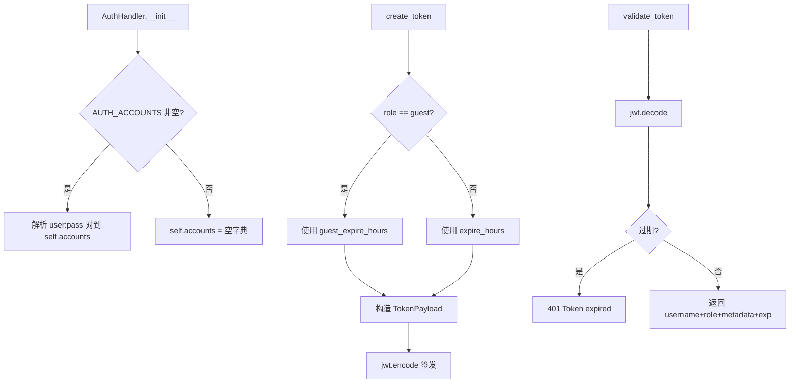
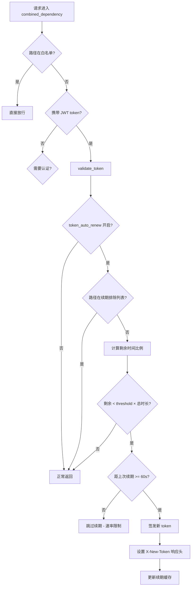

# PD-296.01 LightRAG — JWT 双角色滑动窗口认证

> 文档编号：PD-296.01
> 来源：LightRAG `lightrag/api/auth.py` `lightrag/api/utils_api.py`
> GitHub：https://github.com/HKUDS/LightRAG.git
> 问题域：PD-296 认证授权 Authentication & Authorization
> 状态：可复用方案

---

## 第 1 章 问题与动机

### 1.1 核心问题

RAG 服务通常以 HTTP API 形式暴露，面临两个核心认证挑战：

1. **双模式访问控制**：既需要支持正式用户的密码登录，也需要在未配置认证时提供无缝的访客体验，避免前端因缺少 token 而报错。
2. **令牌续期的性能权衡**：传统 JWT 是无状态的，过期后必须重新登录。但 RAG 场景中用户可能长时间进行文档查询和知识图谱浏览，频繁重新登录体验极差。需要一种既保持 JWT 无状态优势、又能自动续期的机制。
3. **多层认证共存**：API Key（面向程序调用）和 JWT Token（面向 WebUI 用户）需要在同一个中间件中协调，且支持路径白名单跳过认证。

### 1.2 LightRAG 的解法概述

LightRAG 实现了一套三层认证体系，核心设计点：

1. **AuthHandler 单例** (`lightrag/api/auth.py:23-109`)：封装 JWT 生成/验证逻辑，通过环境变量 `AUTH_ACCOUNTS` 解析 `user:pass` 对，支持 user/guest 双角色，角色不同过期时间不同。
2. **滑动窗口令牌续期** (`lightrag/api/utils_api.py:130-200`)：在认证中间件中检测令牌剩余有效期，低于阈值时自动签发新令牌通过 `X-New-Token` 响应头返回，附带 60 秒速率限制防止高频轮询端点触发过多续期。
3. **三层认证合并依赖** (`lightrag/api/utils_api.py:80-262`)：`get_combined_auth_dependency` 将白名单路径检查、JWT 验证、API Key 验证合并为单个 FastAPI 依赖，按优先级短路返回。
4. **路径白名单与续期排除** (`lightrag/api/utils_api.py:36-40`)：健康检查和高频轮询端点被排除在令牌续期之外，避免无意义的 token 刷新。
5. **环境变量驱动配置** (`lightrag/api/config.py:396-404`)：所有认证参数（密钥、过期时间、续期阈值、算法）均通过环境变量注入，支持多实例独立配置。

### 1.3 设计思想

| 设计原则 | 具体实现 | 理由 | 替代方案 |
|----------|----------|------|----------|
| 零配置可用 | 未设 AUTH_ACCOUNTS 时自动签发 guest token | 开发/演示场景无需配置即可使用 WebUI | 返回 403 要求配置（体验差） |
| 无状态续期 | 通过响应头 X-New-Token 返回新令牌 | 不需要 Redis/数据库存储 session | Refresh Token 双令牌（复杂度高） |
| 速率限制续期 | 内存字典记录每用户最后续期时间，60s 间隔 | 防止高频轮询端点（2s 间隔）触发大量签发 | 无限制（CPU 浪费） |
| 路径级豁免 | 白名单 + 续期排除列表双层过滤 | 健康检查不需认证，轮询端点不需续期 | 全局统一策略（不灵活） |
| 单依赖合并 | 白名单→JWT→API Key 优先级链 | 一个 Depends() 覆盖所有认证场景 | 多个中间件叠加（顺序难控制） |

---

## 第 2 章 源码实现分析

### 2.1 架构概览

LightRAG 的认证系统由三个文件协作完成：

```
┌─────────────────────────────────────────────────────────────┐
│                    FastAPI Application                        │
│                                                              │
│  ┌──────────┐    ┌───────────────────────┐    ┌──────────┐  │
│  │ /login   │───→│ auth_handler.create_   │    │ /health  │  │
│  │ /auth-   │    │ token()                │    │ (白名单) │  │
│  │  status  │    └───────────────────────┘    └──────────┘  │
│  └──────────┘              │                                 │
│       │                    ▼                                 │
│       │         ┌───────────────────────┐                    │
│       │         │   JWT Token (HS256)   │                    │
│       │         │  {sub, exp, role,     │                    │
│       │         │   metadata}           │                    │
│       │         └───────────────────────┘                    │
│       │                    │                                 │
│       ▼                    ▼                                 │
│  ┌──────────────────────────────────────────────────────┐   │
│  │         combined_auth_dependency (中间件)              │   │
│  │                                                       │   │
│  │  1. 白名单路径检查 ──→ 跳过                            │   │
│  │  2. JWT 验证 + 滑动窗口续期 ──→ X-New-Token           │   │
│  │  3. API Key 验证 ──→ X-API-Key header                 │   │
│  │  4. 无认证配置 ──→ 放行                                │   │
│  └──────────────────────────────────────────────────────┘   │
│                    │                                         │
│                    ▼                                         │
│  ┌──────────────────────────────────────────────────────┐   │
│  │  业务路由: /documents, /query, /graph, /api (Ollama)  │   │
│  └──────────────────────────────────────────────────────┘   │
└─────────────────────────────────────────────────────────────┘
```

**文件职责：**
- `auth.py` — AuthHandler 类：JWT 签发与验证
- `utils_api.py` — combined_auth_dependency：认证中间件 + 滑动窗口续期
- `config.py` — 环境变量解析：所有认证参数的配置入口
- `lightrag_server.py` — 路由注册：/login、/auth-status 端点 + CORS 配置

### 2.2 核心实现

#### 2.2.1 AuthHandler — JWT 签发与验证



对应源码 `lightrag/api/auth.py:16-109`：

```python
class TokenPayload(BaseModel):
    sub: str  # Username
    exp: datetime  # Expiration time
    role: str = "user"  # User role, default is regular user
    metadata: dict = {}  # Additional metadata


class AuthHandler:
    def __init__(self):
        self.secret = global_args.token_secret
        self.algorithm = global_args.jwt_algorithm
        self.expire_hours = global_args.token_expire_hours
        self.guest_expire_hours = global_args.guest_token_expire_hours
        self.accounts = {}
        auth_accounts = global_args.auth_accounts
        if auth_accounts:
            for account in auth_accounts.split(","):
                username, password = account.split(":", 1)
                self.accounts[username] = password

    def create_token(
        self,
        username: str,
        role: str = "user",
        custom_expire_hours: int = None,
        metadata: dict = None,
    ) -> str:
        if custom_expire_hours is None:
            if role == "guest":
                expire_hours = self.guest_expire_hours
            else:
                expire_hours = self.expire_hours
        else:
            expire_hours = custom_expire_hours

        expire = datetime.utcnow() + timedelta(hours=expire_hours)
        payload = TokenPayload(
            sub=username, exp=expire, role=role, metadata=metadata or {}
        )
        return jwt.encode(payload.dict(), self.secret, algorithm=self.algorithm)

    def validate_token(self, token: str) -> dict:
        try:
            payload = jwt.decode(token, self.secret, algorithms=[self.algorithm])
            expire_time = datetime.utcfromtimestamp(payload["exp"])
            if datetime.utcnow() > expire_time:
                raise HTTPException(
                    status_code=status.HTTP_401_UNAUTHORIZED, detail="Token expired"
                )
            return {
                "username": payload["sub"],
                "role": payload.get("role", "user"),
                "metadata": payload.get("metadata", {}),
                "exp": expire_time,
            }
        except jwt.PyJWTError:
            raise HTTPException(
                status_code=status.HTTP_401_UNAUTHORIZED, detail="Invalid token"
            )
```

**关键设计点：**
- `TokenPayload` 使用 Pydantic BaseModel 做结构化验证（`auth.py:16-20`）
- 密码以明文存储在内存字典中（从环境变量解析），未使用 bcrypt（`auth.py:31-34`）
- `validate_token` 做了双重过期检查：PyJWT 自身会检查 exp，代码又手动检查了一次（`auth.py:88-94`）

#### 2.2.2 滑动窗口令牌续期



对应源码 `lightrag/api/utils_api.py:130-200`：

```python
# 速率限制缓存（模块级）
_token_renewal_cache: dict[str, float] = {}
_RENEWAL_MIN_INTERVAL = 60  # 最少 60 秒间隔

# 续期排除路径
_TOKEN_RENEWAL_SKIP_PATHS = [
    "/health",
    "/documents/paginated",
    "/documents/pipeline_status",
]

# 在 combined_dependency 内部：
if global_args.token_auto_renew:
    skip_renewal = any(
        path == skip_path or path.startswith(skip_path + "/")
        for skip_path in _TOKEN_RENEWAL_SKIP_PATHS
    )
    if not skip_renewal:
        expire_time = token_info.get("exp")
        if expire_time:
            now = datetime.utcnow()
            remaining_seconds = (expire_time - now).total_seconds()
            role = token_info.get("role", "user")
            total_hours = (
                auth_handler.guest_expire_hours
                if role == "guest"
                else auth_handler.expire_hours
            )
            total_seconds = total_hours * 3600
            if remaining_seconds < total_seconds * global_args.token_renew_threshold:
                username = token_info["username"]
                current_time = time.time()
                last_renewal = _token_renewal_cache.get(username, 0)
                if (current_time - last_renewal) >= _RENEWAL_MIN_INTERVAL:
                    new_token = auth_handler.create_token(
                        username=username,
                        role=role,
                        metadata=token_info.get("metadata", {}),
                    )
                    response.headers["X-New-Token"] = new_token
                    _token_renewal_cache[username] = current_time
```

### 2.3 实现细节

**认证优先级链** (`utils_api.py:109-262`)：

合并依赖按以下优先级短路返回：
1. 白名单路径 → 直接放行（`utils_api.py:118-123`）
2. JWT token 有效 → 放行 + 可能续期（`utils_api.py:126-214`）
3. API Key 匹配 → 放行（`utils_api.py:226-231`）
4. 无认证配置 → 全部放行（`utils_api.py:222-223`）
5. 以上都不满足 → 401/403（`utils_api.py:236-260`）

**登录端点的双模式** (`lightrag_server.py:1162-1195`)：

```python
@app.post("/login")
async def login(form_data: OAuth2PasswordRequestForm = Depends()):
    if not auth_handler.accounts:
        # 未配置认证 → 签发 guest token
        guest_token = auth_handler.create_token(
            username="guest", role="guest", metadata={"auth_mode": "disabled"}
        )
        return {"access_token": guest_token, "token_type": "bearer", ...}
    # 已配置认证 → 验证密码
    if auth_handler.accounts.get(username) != form_data.password:
        raise HTTPException(status_code=401, detail="Incorrect credentials")
    user_token = auth_handler.create_token(
        username=username, role="user", metadata={"auth_mode": "enabled"}
    )
    return {"access_token": user_token, "token_type": "bearer", ...}
```

**CORS 配置暴露续期头** (`lightrag_server.py:448-457`)：

```python
app.add_middleware(
    CORSMiddleware,
    allow_origins=get_cors_origins(),
    allow_credentials=True,
    allow_methods=["*"],
    allow_headers=["*"],
    expose_headers=["X-New-Token"],  # 关键：暴露续期头给跨域前端
)
```

**环境变量配置矩阵** (`config.py:396-404`)：

| 环境变量 | 默认值 | 说明 |
|----------|--------|------|
| `AUTH_ACCOUNTS` | `""` | 账户列表，格式 `user1:pass1,user2:pass2` |
| `TOKEN_SECRET` | `lightrag-jwt-default-secret` | JWT 签名密钥 |
| `TOKEN_EXPIRE_HOURS` | `48` | 用户令牌过期时间（小时） |
| `GUEST_TOKEN_EXPIRE_HOURS` | `24` | 访客令牌过期时间（小时） |
| `JWT_ALGORITHM` | `HS256` | JWT 签名算法 |
| `TOKEN_AUTO_RENEW` | `True` | 是否启用滑动窗口续期 |
| `TOKEN_RENEW_THRESHOLD` | `0.5` | 续期阈值（剩余时间 < 总时长 × 阈值时触发） |
| `WHITELIST_PATHS` | `/health,/api/*` | 免认证路径白名单 |

---

## 第 3 章 迁移指南

### 3.1 迁移清单

**阶段 1：基础 JWT 认证（1 个文件）**
- [ ] 创建 `auth.py`，实现 AuthHandler 类
- [ ] 从环境变量解析 `AUTH_ACCOUNTS`（`user:pass` 格式）
- [ ] 实现 `create_token` / `validate_token` 方法
- [ ] 支持 user/guest 双角色，不同过期时间

**阶段 2：合并认证中间件（1 个文件）**
- [ ] 创建 `get_combined_auth_dependency` 工厂函数
- [ ] 实现白名单路径检查（支持前缀匹配 `/api/*`）
- [ ] 实现 JWT → API Key 优先级链
- [ ] 未配置认证时全部放行

**阶段 3：滑动窗口续期（在中间件中添加）**
- [ ] 添加续期阈值检查（剩余时间 < 总时长 × threshold）
- [ ] 通过 `X-New-Token` 响应头返回新令牌
- [ ] 添加速率限制（内存字典，60s 间隔）
- [ ] 配置续期排除路径列表
- [ ] CORS 中 `expose_headers` 添加 `X-New-Token`

**阶段 4：前端适配**
- [ ] 前端拦截器检查响应头 `X-New-Token`，自动替换本地存储的 token
- [ ] `/auth-status` 端点用于前端判断是否需要显示登录界面

### 3.2 适配代码模板

以下是一个可直接复用的 FastAPI 认证模块：

```python
"""auth_module.py — 可移植的 JWT 双角色认证模块"""
import os
import time
from datetime import datetime, timedelta
from typing import Optional

import jwt
from fastapi import HTTPException, Request, Response, Security, status
from fastapi.security import APIKeyHeader, OAuth2PasswordBearer
from pydantic import BaseModel


class TokenPayload(BaseModel):
    sub: str
    exp: datetime
    role: str = "user"
    metadata: dict = {}


class AuthHandler:
    def __init__(
        self,
        secret: str = None,
        algorithm: str = "HS256",
        user_expire_hours: float = 48,
        guest_expire_hours: float = 24,
        accounts_str: str = "",
    ):
        self.secret = secret or os.getenv("TOKEN_SECRET", "change-me-in-production")
        self.algorithm = algorithm
        self.user_expire_hours = user_expire_hours
        self.guest_expire_hours = guest_expire_hours
        self.accounts = {}
        if accounts_str:
            for account in accounts_str.split(","):
                username, password = account.split(":", 1)
                self.accounts[username.strip()] = password.strip()

    def create_token(self, username: str, role: str = "user", metadata: dict = None) -> str:
        expire_hours = self.guest_expire_hours if role == "guest" else self.user_expire_hours
        expire = datetime.utcnow() + timedelta(hours=expire_hours)
        payload = TokenPayload(sub=username, exp=expire, role=role, metadata=metadata or {})
        return jwt.encode(payload.dict(), self.secret, algorithm=self.algorithm)

    def validate_token(self, token: str) -> dict:
        try:
            payload = jwt.decode(token, self.secret, algorithms=[self.algorithm])
            return {
                "username": payload["sub"],
                "role": payload.get("role", "user"),
                "metadata": payload.get("metadata", {}),
                "exp": datetime.utcfromtimestamp(payload["exp"]),
            }
        except jwt.ExpiredSignatureError:
            raise HTTPException(status_code=401, detail="Token expired")
        except jwt.PyJWTError:
            raise HTTPException(status_code=401, detail="Invalid token")


def create_auth_dependency(
    auth: AuthHandler,
    api_key: Optional[str] = None,
    whitelist_paths: list[str] = None,
    renewal_threshold: float = 0.5,
    renewal_min_interval: int = 60,
    renewal_skip_paths: list[str] = None,
):
    """工厂函数：创建合并认证依赖"""
    _renewal_cache: dict[str, float] = {}
    oauth2 = OAuth2PasswordBearer(tokenUrl="login", auto_error=False)
    api_key_header = APIKeyHeader(name="X-API-Key", auto_error=False) if api_key else None
    whitelist = whitelist_paths or ["/health"]
    skip_paths = renewal_skip_paths or []

    async def dependency(
        request: Request,
        response: Response,
        token: str = Security(oauth2),
        key_value: Optional[str] = None if api_key_header is None else Security(api_key_header),
    ):
        path = request.url.path
        # 1. 白名单
        if any(path == p or (p.endswith("/*") and path.startswith(p[:-2])) for p in whitelist):
            return
        # 2. JWT
        if token:
            info = auth.validate_token(token)
            # 滑动窗口续期
            if path not in skip_paths:
                remaining = (info["exp"] - datetime.utcnow()).total_seconds()
                total = (auth.guest_expire_hours if info["role"] == "guest" else auth.user_expire_hours) * 3600
                if remaining < total * renewal_threshold:
                    now = time.time()
                    if (now - _renewal_cache.get(info["username"], 0)) >= renewal_min_interval:
                        new_token = auth.create_token(info["username"], info["role"], info["metadata"])
                        response.headers["X-New-Token"] = new_token
                        _renewal_cache[info["username"]] = now
            return
        # 3. API Key
        if api_key and key_value == api_key:
            return
        # 4. 无认证配置
        if not auth.accounts and not api_key:
            return
        raise HTTPException(status_code=401, detail="Authentication required")

    return dependency
```

### 3.3 适用场景

| 场景 | 适用度 | 说明 |
|------|--------|------|
| 单体 RAG/AI 服务 | ⭐⭐⭐ | 完美匹配：环境变量配置、双角色、自动续期 |
| 多实例独立部署 | ⭐⭐⭐ | 每个实例独立 .env，独立密钥和账户 |
| 微服务网关后端 | ⭐⭐ | 网关已有认证时，可只用 API Key 模式 |
| 多租户 SaaS | ⭐ | 需要扩展：当前账户存内存，不支持动态增删用户 |
| 高安全场景 | ⭐ | 密码明文比对，无 bcrypt；默认密钥需替换 |

---

## 第 4 章 测试用例

```python
"""test_auth.py — LightRAG 认证系统测试"""
import time
from datetime import datetime, timedelta
from unittest.mock import MagicMock, patch

import jwt
import pytest
from fastapi import HTTPException


# ---- AuthHandler 测试 ----

class TestAuthHandler:
    """测试 AuthHandler 核心功能"""

    def setup_method(self):
        """模拟 global_args 初始化 AuthHandler"""
        mock_args = MagicMock()
        mock_args.token_secret = "test-secret-key"
        mock_args.jwt_algorithm = "HS256"
        mock_args.token_expire_hours = 48
        mock_args.guest_token_expire_hours = 24
        mock_args.auth_accounts = "admin:password123,viewer:view456"

        with patch("lightrag.api.auth.global_args", mock_args):
            from lightrag.api.auth import AuthHandler
            self.handler = AuthHandler()

    def test_accounts_parsing(self):
        """验证 user:pass 格式解析"""
        assert self.handler.accounts == {"admin": "password123", "viewer": "view456"}

    def test_create_user_token(self):
        """验证用户令牌签发"""
        token = self.handler.create_token(username="admin", role="user")
        payload = jwt.decode(token, "test-secret-key", algorithms=["HS256"])
        assert payload["sub"] == "admin"
        assert payload["role"] == "user"
        # 过期时间应接近 48 小时后
        exp = datetime.utcfromtimestamp(payload["exp"])
        expected = datetime.utcnow() + timedelta(hours=48)
        assert abs((exp - expected).total_seconds()) < 5

    def test_create_guest_token_shorter_expiry(self):
        """验证访客令牌过期时间更短"""
        token = self.handler.create_token(username="guest", role="guest")
        payload = jwt.decode(token, "test-secret-key", algorithms=["HS256"])
        exp = datetime.utcfromtimestamp(payload["exp"])
        expected = datetime.utcnow() + timedelta(hours=24)
        assert abs((exp - expected).total_seconds()) < 5

    def test_validate_valid_token(self):
        """验证有效令牌解析"""
        token = self.handler.create_token(username="admin", role="user", metadata={"auth_mode": "enabled"})
        result = self.handler.validate_token(token)
        assert result["username"] == "admin"
        assert result["role"] == "user"
        assert result["metadata"]["auth_mode"] == "enabled"

    def test_validate_expired_token(self):
        """验证过期令牌拒绝"""
        token = self.handler.create_token(username="admin", custom_expire_hours=-1)
        with pytest.raises(HTTPException) as exc_info:
            self.handler.validate_token(token)
        assert exc_info.value.status_code == 401

    def test_validate_tampered_token(self):
        """验证篡改令牌拒绝"""
        token = self.handler.create_token(username="admin")
        with pytest.raises(HTTPException) as exc_info:
            self.handler.validate_token(token + "tampered")
        assert exc_info.value.status_code == 401


# ---- 滑动窗口续期测试 ----

class TestTokenRenewal:
    """测试令牌自动续期逻辑"""

    def test_renewal_triggered_when_below_threshold(self):
        """剩余时间低于阈值时应触发续期"""
        total_hours = 48
        threshold = 0.5
        remaining_seconds = total_hours * 3600 * 0.3  # 30% 剩余，低于 50% 阈值
        total_seconds = total_hours * 3600
        assert remaining_seconds < total_seconds * threshold

    def test_renewal_skipped_when_above_threshold(self):
        """剩余时间高于阈值时不应触发续期"""
        total_hours = 48
        threshold = 0.5
        remaining_seconds = total_hours * 3600 * 0.8  # 80% 剩余
        total_seconds = total_hours * 3600
        assert remaining_seconds >= total_seconds * threshold

    def test_rate_limiting_prevents_rapid_renewal(self):
        """60 秒内不应重复续期"""
        cache = {"admin": time.time()}
        current = time.time()
        interval = 60
        assert (current - cache["admin"]) < interval  # 应被速率限制

    def test_rate_limiting_allows_after_interval(self):
        """超过 60 秒后应允许续期"""
        cache = {"admin": time.time() - 61}
        current = time.time()
        interval = 60
        assert (current - cache["admin"]) >= interval  # 应允许续期
```

---

## 第 5 章 跨域关联

| 关联域 | 关系类型 | 说明 |
|--------|----------|------|
| PD-10 中间件管道 | 协同 | `combined_auth_dependency` 本质是一个认证中间件，与其他中间件（CORS、日志）共同构成请求处理管道 |
| PD-11 可观测性 | 协同 | 令牌续期事件通过 `logger.info` 记录，可接入结构化日志追踪认证行为 |
| PD-09 Human-in-the-Loop | 依赖 | WebUI 的交互式操作依赖认证系统提供的用户身份，`/auth-status` 端点驱动前端登录流程 |

---

## 第 6 章 来源文件索引

| 文件 | 行范围 | 关键实现 |
|------|--------|----------|
| `lightrag/api/auth.py` | L1-L109 | AuthHandler 类：JWT 签发/验证、TokenPayload 模型、双角色过期策略 |
| `lightrag/api/utils_api.py` | L25-L40 | 令牌续期速率限制缓存与排除路径定义 |
| `lightrag/api/utils_api.py` | L80-L262 | `get_combined_auth_dependency`：三层认证合并依赖 + 滑动窗口续期 |
| `lightrag/api/config.py` | L396-L404 | JWT 相关环境变量解析（密钥、过期时间、续期阈值、算法） |
| `lightrag/api/lightrag_server.py` | L1132-L1160 | `/auth-status` 端点：认证状态查询 + 访客 token 自动签发 |
| `lightrag/api/lightrag_server.py` | L1162-L1195 | `/login` 端点：OAuth2 密码流登录 + 双模式处理 |
| `lightrag/api/lightrag_server.py` | L448-L457 | CORS 中间件配置：`expose_headers: ["X-New-Token"]` |

---

## 第 7 章 横向对比维度

```json comparison_data
{
  "project": "LightRAG",
  "dimensions": {
    "认证架构": "三层合并依赖：白名单→JWT→API Key 优先级链",
    "令牌续期": "滑动窗口：剩余<50%总时长时通过 X-New-Token 响应头续期",
    "角色模型": "user/guest 双角色，角色区分过期时间（48h/24h）",
    "密码存储": "环境变量明文，内存字典比对，无 bcrypt",
    "速率控制": "内存字典记录每用户最后续期时间，60s 最小间隔",
    "配置方式": "全环境变量驱动，7 个 JWT 相关变量，支持多实例独立配置"
  }
}
```

### 域元数据补充

```json domain_metadata
{
  "solution_summary": "LightRAG 用三层合并依赖（白名单→JWT→API Key）+ 滑动窗口响应头续期实现无状态认证，支持 user/guest 双角色与 60s 速率限制",
  "description": "无状态令牌的自动续期与多认证方式合并调度",
  "sub_problems": [
    "滑动窗口令牌续期的速率限制",
    "高频轮询端点的续期排除策略",
    "多认证方式（JWT+API Key）的优先级合并"
  ],
  "best_practices": [
    "通过响应头 X-New-Token 实现无状态续期，避免 Refresh Token 复杂度",
    "续期排除高频轮询路径防止无意义 token 签发",
    "CORS expose_headers 暴露自定义续期头给跨域前端"
  ]
}
```
