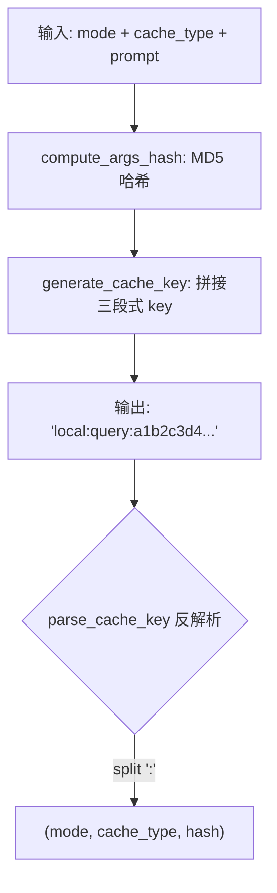
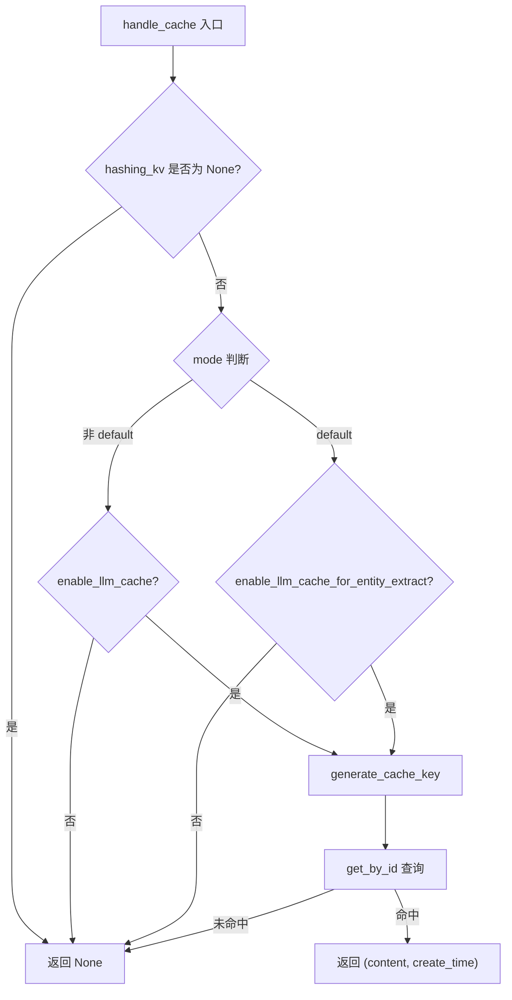

# PD-297.01 LightRAG — 扁平化三类型 LLM 响应缓存

> 文档编号：PD-297.01
> 来源：LightRAG `lightrag/utils.py`, `lightrag/operate.py`, `lightrag/lightrag.py`
> GitHub：https://github.com/HKUDS/LightRAG.git
> 问题域：PD-297 LLM响应缓存 LLM Response Caching
> 状态：可复用方案

---

## 第 1 章 问题与动机

### 1.1 核心问题

RAG 系统中 LLM 调用是最大的成本和延迟来源。LightRAG 在三个关键环节调用 LLM：

1. **实体抽取（entity extraction）**：对每个文本 chunk 调用 LLM 提取实体和关系，含 gleaning 多轮追加抽取
2. **关键词提取（keywords extraction）**：查询时从用户问题中提取高层/低层关键词
3. **查询回答（query）**：基于检索到的上下文生成最终回答

同一 chunk 的实体抽取在文档重新索引时会重复执行；同一查询在不同会话中可能被多次提交。如果不缓存，每次都要付出完整的 LLM 调用成本。

核心挑战在于：三种缓存场景的 key 结构、命中策略、失效逻辑各不相同，需要一个统一但可区分的缓存框架。

### 1.2 LightRAG 的解法概述

LightRAG 采用**扁平化 key 结构 + 三类型缓存 + 双开关控制**的方案：

1. **扁平化 key**：`{mode}:{cache_type}:{md5_hash}` 三段式结构，所有缓存类型共用同一 KV 存储（`lightrag/utils.py:560-571`）
2. **三种缓存类型**：`extract`（实体抽取）、`query`（查询回答）、`keywords`（关键词提取），通过 `cache_type` 字段区分（`lightrag/utils.py:1416`）
3. **双开关控制**：`enable_llm_cache` 控制 query/keywords 缓存，`enable_llm_cache_for_entity_extract` 独立控制抽取缓存（`lightrag/lightrag.py:373-377`）
4. **去重检测**：写入前检查已有缓存内容是否相同，避免无意义的重复写入（`lightrag/utils.py:1442-1450`）
5. **流式响应跳过**：检测 `__aiter__` 属性，自动跳过流式响应的缓存（`lightrag/utils.py:1432-1435`）
6. **chunk-cache 反向索引**：每个 chunk 维护 `llm_cache_list` 字段，记录关联的缓存 key，支持按文档删除缓存（`lightrag/utils.py:1886-1925`）

### 1.3 设计思想

| 设计原则 | 具体实现 | 理由 | 替代方案 |
|----------|----------|------|----------|
| 扁平化 key | `mode:type:hash` 三段式 | 单一 KV 存储即可承载所有缓存类型，无需多表 | 嵌套 dict（`{mode: {type: {hash: data}}}`），增加查询复杂度 |
| 双开关独立控制 | `enable_llm_cache` + `enable_llm_cache_for_entity_extract` | 抽取缓存和查询缓存的失效需求不同，需独立控制 | 单一开关，无法细粒度控制 |
| 写前去重 | `save_to_cache` 中比较 `existing_content == cache_data.content` | 避免相同内容重复写入触发不必要的持久化 | 直接覆盖写入，浪费 I/O |
| chunk-cache 反向索引 | `llm_cache_list` 字段 | 删除文档时可精确定位并清理关联缓存 | 全量扫描缓存表匹配 chunk_id，O(n) 复杂度 |
| 流式跳过 | `hasattr(content, "__aiter__")` 检测 | 流式响应是 AsyncIterator，无法序列化存储 | 强制收集完整响应后缓存，增加首 token 延迟 |

---

## 第 2 章 源码实现分析

### 2.1 架构概览

LightRAG 的缓存系统围绕一个共享的 `BaseKVStorage` 实例（`llm_response_cache`）构建，所有缓存操作通过三个核心函数完成：

```
┌─────────────────────────────────────────────────────────────────┐
│                    LightRAG 实例初始化                           │
│  llm_response_cache = key_string_value_json_storage_cls(        │
│      namespace=KV_STORE_LLM_RESPONSE_CACHE)                    │
└──────────────┬──────────────────────────────────────────────────┘
               │
    ┌──────────┼──────────────────────────────┐
    ▼          ▼                              ▼
┌────────┐ ┌────────┐                   ┌──────────┐
│extract │ │ query  │                   │ keywords │
│缓存类型│ │缓存类型│                   │ 缓存类型  │
└───┬────┘ └───┬────┘                   └────┬─────┘
    │          │                              │
    ▼          ▼                              ▼
┌─────────────────────────────────────────────────────────────────┐
│              统一缓存层 (utils.py)                               │
│  generate_cache_key() → handle_cache() → save_to_cache()       │
│  Key 格式: {mode}:{cache_type}:{md5_hash}                      │
│  去重检测 + 流式跳过 + 统计计数                                  │
└─────────────────────────────────────────────────────────────────┘
               │
               ▼
┌─────────────────────────────────────────────────────────────────┐
│           BaseKVStorage (base.py)                               │
│  get_by_id() / get_by_ids() / upsert() / delete() / drop()    │
│  支持 JSON 文件 / PostgreSQL / Oracle 等多后端                   │
└─────────────────────────────────────────────────────────────────┘
```

### 2.2 核心实现

#### 2.2.1 缓存 Key 生成与解析



对应源码 `lightrag/utils.py:530-586`：

```python
def compute_args_hash(*args: Any) -> str:
    """Compute a hash for the given arguments with safe Unicode handling."""
    args_str = "".join([str(arg) for arg in args])
    try:
        return md5(args_str.encode("utf-8")).hexdigest()
    except UnicodeEncodeError:
        safe_bytes = args_str.encode("utf-8", errors="replace")
        return md5(safe_bytes).hexdigest()


def generate_cache_key(mode: str, cache_type: str, hash_value: str) -> str:
    """Generate a flattened cache key in the format {mode}:{cache_type}:{hash}"""
    return f"{mode}:{cache_type}:{hash_value}"


def parse_cache_key(cache_key: str) -> tuple[str, str, str] | None:
    """Parse a flattened cache key back into its components"""
    parts = cache_key.split(":", 2)
    if len(parts) == 3:
        return parts[0], parts[1], parts[2]
    return None
```

关键设计：`compute_args_hash` 将所有参数拼接后取 MD5，对于 query 缓存会将 `mode + query + response_type + top_k` 等 11 个参数全部纳入哈希（`operate.py:3178-3191`），确保查询参数变化时缓存不会误命中。

#### 2.2.2 缓存读取与写入



对应源码 `lightrag/utils.py:1375-1466`：

```python
async def handle_cache(
    hashing_kv, args_hash, prompt, mode="default", cache_type="unknown",
) -> tuple[str, int] | None:
    if hashing_kv is None:
        return None
    if mode != "default":  # query/keywords 缓存
        if not hashing_kv.global_config.get("enable_llm_cache"):
            return None
    else:  # entity extraction 缓存
        if not hashing_kv.global_config.get("enable_llm_cache_for_entity_extract"):
            return None

    flattened_key = generate_cache_key(mode, cache_type, args_hash)
    cache_entry = await hashing_kv.get_by_id(flattened_key)
    if cache_entry:
        content = cache_entry["return"]
        timestamp = cache_entry.get("create_time", 0)
        return content, timestamp
    return None


async def save_to_cache(hashing_kv, cache_data: CacheData):
    if hashing_kv is None or not cache_data.content:
        return
    # 流式响应跳过
    if hasattr(cache_data.content, "__aiter__"):
        return
    flattened_key = generate_cache_key(
        cache_data.mode, cache_data.cache_type, cache_data.args_hash
    )
    # 去重检测
    existing_cache = await hashing_kv.get_by_id(flattened_key)
    if existing_cache:
        if existing_cache.get("return") == cache_data.content:
            return  # 内容相同，跳过写入
    cache_entry = {
        "return": cache_data.content,
        "cache_type": cache_data.cache_type,
        "chunk_id": cache_data.chunk_id,
        "original_prompt": cache_data.prompt,
        "queryparam": cache_data.queryparam,
    }
    await hashing_kv.upsert({flattened_key: cache_entry})
```

### 2.3 实现细节

#### chunk-cache 反向索引机制

LightRAG 在每个 text chunk 中维护 `llm_cache_list` 字段，记录该 chunk 关联的所有缓存 key。这是通过 `cache_keys_collector` 模式实现的：

1. 调用方创建空列表 `cache_keys_collector = []`（`operate.py:2845`）
2. `use_llm_func_with_cache` 在缓存命中或写入时将 key 追加到 collector（`utils.py:2016-2017, 2050-2052`）
3. 所有 LLM 调用完成后，批量更新 chunk 的 `llm_cache_list`（`utils.py:1886-1925`）

```python
async def update_chunk_cache_list(
    chunk_id: str, text_chunks_storage, cache_keys: list[str],
    cache_scenario: str = "batch_update",
) -> None:
    chunk_data = await text_chunks_storage.get_by_id(chunk_id)
    if chunk_data:
        if "llm_cache_list" not in chunk_data:
            chunk_data["llm_cache_list"] = []
        existing_keys = set(chunk_data["llm_cache_list"])
        new_keys = [key for key in cache_keys if key not in existing_keys]
        if new_keys:
            chunk_data["llm_cache_list"].extend(new_keys)
            await text_chunks_storage.upsert({chunk_id: chunk_data})
```

#### 文档删除时的缓存清理

当删除文档时，LightRAG 通过反向索引精确清理关联缓存（`lightrag.py:3177-3226`）：

1. 遍历文档的所有 chunk，收集 `llm_cache_list` 中的缓存 ID
2. 用 `seen_cache_ids` 集合去重
3. 批量调用 `llm_response_cache.delete(doc_llm_cache_ids)` 删除

#### 全局统计计数

`statistic_data` 字典（`utils.py:273`）追踪 `llm_call`（实际调用次数）和 `llm_cache`（缓存命中次数），可用于计算缓存命中率。

---

## 第 3 章 迁移指南

### 3.1 迁移清单

**阶段 1：基础缓存框架**
- [ ] 实现 `generate_cache_key(mode, cache_type, hash)` 三段式 key 生成
- [ ] 实现 `compute_args_hash(*args)` 基于 MD5 的参数哈希
- [ ] 定义 `CacheData` 数据类，包含 `args_hash, content, prompt, mode, cache_type, chunk_id`
- [ ] 实现 `handle_cache()` 读取函数，含双开关判断逻辑
- [ ] 实现 `save_to_cache()` 写入函数，含去重检测和流式跳过

**阶段 2：业务集成**
- [ ] 在 entity extraction 流程中集成 `use_llm_func_with_cache`
- [ ] 在 query 流程中集成 `handle_cache` + `save_to_cache`
- [ ] 在 keywords extraction 流程中集成缓存
- [ ] 实现 `cache_keys_collector` 批量收集模式

**阶段 3：生命周期管理**
- [ ] 实现 chunk 的 `llm_cache_list` 反向索引
- [ ] 实现 `update_chunk_cache_list()` 批量更新
- [ ] 实现文档删除时的缓存级联清理
- [ ] 实现 `aclear_cache()` 全量清理接口

### 3.2 适配代码模板

以下是可直接复用的缓存框架核心代码：

```python
import hashlib
import time
from dataclasses import dataclass
from typing import Any, Optional
from abc import ABC, abstractmethod


class CacheStorage(ABC):
    """缓存存储抽象接口"""
    @abstractmethod
    async def get(self, key: str) -> Optional[dict]:
        ...
    @abstractmethod
    async def set(self, key: str, value: dict) -> None:
        ...
    @abstractmethod
    async def delete(self, keys: list[str]) -> None:
        ...


def compute_args_hash(*args: Any) -> str:
    """将任意参数拼接后取 MD5"""
    args_str = "".join(str(a) for a in args)
    return hashlib.md5(args_str.encode("utf-8", errors="replace")).hexdigest()


def make_cache_key(mode: str, cache_type: str, hash_val: str) -> str:
    """三段式扁平化 key: mode:type:hash"""
    return f"{mode}:{cache_type}:{hash_val}"


@dataclass
class CacheData:
    args_hash: str
    content: str
    prompt: str
    mode: str = "default"
    cache_type: str = "query"
    chunk_id: str | None = None


async def read_cache(
    storage: CacheStorage,
    args_hash: str,
    mode: str,
    cache_type: str,
    config: dict,
) -> tuple[str, int] | None:
    """读取缓存，含双开关判断"""
    if mode != "default":
        if not config.get("enable_llm_cache"):
            return None
    else:
        if not config.get("enable_llm_cache_for_extract"):
            return None

    key = make_cache_key(mode, cache_type, args_hash)
    entry = await storage.get(key)
    if entry:
        return entry["return"], entry.get("create_time", 0)
    return None


async def write_cache(storage: CacheStorage, data: CacheData) -> str | None:
    """写入缓存，含去重和流式跳过"""
    if not data.content:
        return None
    if hasattr(data.content, "__aiter__"):
        return None  # 流式响应不缓存

    key = make_cache_key(data.mode, data.cache_type, data.args_hash)

    # 去重检测
    existing = await storage.get(key)
    if existing and existing.get("return") == data.content:
        return None

    await storage.set(key, {
        "return": data.content,
        "cache_type": data.cache_type,
        "chunk_id": data.chunk_id,
        "original_prompt": data.prompt,
        "create_time": int(time.time()),
    })
    return key
```

### 3.3 适用场景

| 场景 | 适用度 | 说明 |
|------|--------|------|
| RAG 系统的 LLM 调用缓存 | ⭐⭐⭐ | 完美匹配，三种缓存类型覆盖 RAG 全流程 |
| 多轮对话系统 | ⭐⭐ | query 缓存可复用，但对话上下文变化导致命中率低 |
| 批量文档处理 | ⭐⭐⭐ | entity extraction 缓存在重新索引时价值极高 |
| 实时流式问答 | ⭐ | 流式响应被跳过，仅非流式场景受益 |
| 多租户 SaaS | ⭐⭐ | 需要在 key 中增加 tenant_id 维度 |

---

## 第 4 章 测试用例

```python
import pytest
import hashlib
from dataclasses import dataclass
from typing import Any, Optional


# ---- 被测函数（从 LightRAG 提取的核心逻辑） ----

def compute_args_hash(*args: Any) -> str:
    args_str = "".join(str(a) for a in args)
    return hashlib.md5(args_str.encode("utf-8", errors="replace")).hexdigest()

def generate_cache_key(mode: str, cache_type: str, hash_value: str) -> str:
    return f"{mode}:{cache_type}:{hash_value}"

def parse_cache_key(cache_key: str) -> tuple[str, str, str] | None:
    parts = cache_key.split(":", 2)
    if len(parts) == 3:
        return parts[0], parts[1], parts[2]
    return None


# ---- 测试用例 ----

class TestCacheKeyGeneration:
    def test_generate_cache_key_format(self):
        key = generate_cache_key("local", "query", "abc123")
        assert key == "local:query:abc123"

    def test_generate_cache_key_default_mode(self):
        key = generate_cache_key("default", "extract", "def456")
        assert key == "default:extract:def456"

    def test_parse_cache_key_valid(self):
        result = parse_cache_key("local:query:abc123")
        assert result == ("local", "query", "abc123")

    def test_parse_cache_key_invalid(self):
        assert parse_cache_key("invalid_key") is None
        assert parse_cache_key("only:two") is None

    def test_parse_cache_key_with_colons_in_hash(self):
        """hash 中包含冒号时，split(:, 2) 确保只分割前两个"""
        result = parse_cache_key("local:query:hash:with:colons")
        assert result == ("local", "query", "hash:with:colons")


class TestComputeArgsHash:
    def test_deterministic(self):
        h1 = compute_args_hash("hello", "world")
        h2 = compute_args_hash("hello", "world")
        assert h1 == h2

    def test_different_args_different_hash(self):
        h1 = compute_args_hash("query1", "local", 10)
        h2 = compute_args_hash("query2", "local", 10)
        assert h1 != h2

    def test_unicode_handling(self):
        """含 Unicode 字符的参数不应抛异常"""
        h = compute_args_hash("你好世界", "🎉", "café")
        assert isinstance(h, str) and len(h) == 32

    def test_parameter_order_matters(self):
        """参数顺序不同应产生不同哈希"""
        h1 = compute_args_hash("a", "b")
        h2 = compute_args_hash("b", "a")
        assert h1 != h2


class TestStreamingDetection:
    def test_async_iterator_detected(self):
        class FakeStream:
            async def __aiter__(self):
                yield "chunk"
        stream = FakeStream()
        assert hasattr(stream, "__aiter__")

    def test_string_not_detected(self):
        assert not hasattr("normal string", "__aiter__")


class TestDeduplication:
    def test_identical_content_skipped(self):
        """模拟去重逻辑：相同内容应跳过写入"""
        existing = {"return": "same content"}
        new_content = "same content"
        assert existing.get("return") == new_content  # 应跳过

    def test_different_content_written(self):
        existing = {"return": "old content"}
        new_content = "new content"
        assert existing.get("return") != new_content  # 应写入
```

---

## 第 5 章 跨域关联

| 关联域 | 关系类型 | 说明 |
|--------|----------|------|
| PD-01 上下文管理 | 协同 | 缓存命中可避免重复 LLM 调用，间接减少上下文窗口压力 |
| PD-06 记忆持久化 | 依赖 | 缓存存储依赖 BaseKVStorage 持久化层，与记忆系统共享存储抽象 |
| PD-08 搜索与检索 | 协同 | query 缓存和 keywords 缓存直接服务于检索流程的加速 |
| PD-11 可观测性 | 协同 | `statistic_data` 的 `llm_call/llm_cache` 计数为成本追踪提供数据源 |
| PD-03 容错与重试 | 协同 | 缓存命中时跳过 LLM 调用，天然规避了 LLM API 的不稳定性 |

---

## 第 6 章 来源文件索引

| 文件 | 行范围 | 关键实现 |
|------|--------|----------|
| `lightrag/utils.py` | L273 | `statistic_data` 全局统计字典 |
| `lightrag/utils.py` | L530-548 | `compute_args_hash` MD5 哈希函数 |
| `lightrag/utils.py` | L560-586 | `generate_cache_key` / `parse_cache_key` 三段式 key |
| `lightrag/utils.py` | L1375-1407 | `handle_cache` 缓存读取 + 双开关判断 |
| `lightrag/utils.py` | L1410-1418 | `CacheData` 数据类定义 |
| `lightrag/utils.py` | L1421-1466 | `save_to_cache` 写入 + 去重 + 流式跳过 |
| `lightrag/utils.py` | L1886-1925 | `update_chunk_cache_list` 反向索引更新 |
| `lightrag/utils.py` | L1936-2075 | `use_llm_func_with_cache` 完整缓存包装器 |
| `lightrag/lightrag.py` | L373-377 | `enable_llm_cache` / `enable_llm_cache_for_entity_extract` 配置 |
| `lightrag/lightrag.py` | L584-589 | `llm_response_cache` 存储实例初始化 |
| `lightrag/lightrag.py` | L2885-2913 | `aclear_cache` / `clear_cache` 全量清理 |
| `lightrag/lightrag.py` | L3177-3226 | 文档删除时的缓存 ID 收集与级联清理 |
| `lightrag/operate.py` | L2844-2967 | entity extraction 中的 cache_keys_collector 模式 |
| `lightrag/operate.py` | L3177-3233 | query 缓存的哈希计算与命中逻辑 |
| `lightrag/operate.py` | L3311-3396 | keywords extraction 缓存集成 |
| `lightrag/operate.py` | L825-912 | `_get_cached_extraction_results` 批量缓存重建 |
| `lightrag/base.py` | L356-401 | `BaseKVStorage` 抽象接口定义 |

---

## 第 7 章 横向对比维度

```json comparison_data
{
  "project": "LightRAG",
  "dimensions": {
    "缓存key设计": "扁平化三段式 mode:cache_type:md5_hash，单表存储所有类型",
    "缓存命中策略": "MD5 精确匹配，query 含 11 参数哈希，extract 含 prompt+system+history",
    "流式响应处理": "hasattr(__aiter__) 检测 AsyncIterator，自动跳过不缓存",
    "缓存失效与清理": "chunk-cache 反向索引 llm_cache_list，支持按文档级联删除 + 全量 drop",
    "去重检测": "写入前比较 existing_content == new_content，相同则跳过",
    "双开关控制": "enable_llm_cache 控制 query/keywords，enable_llm_cache_for_entity_extract 独立控制抽取",
    "缓存重建": "_get_cached_extraction_results 从缓存重建知识图谱，按 create_time 排序"
  }
}
```

### 域元数据补充

```json domain_metadata
{
  "solution_summary": "LightRAG 用扁平化三段式 key(mode:type:hash) + 双开关 + chunk-cache 反向索引实现 extract/query/keywords 三类型 LLM 响应缓存",
  "description": "LLM 响应缓存需处理流式跳过、去重检测和按文档级联清理等生命周期问题",
  "sub_problems": [
    "缓存与文档生命周期的级联删除",
    "缓存重建：从缓存恢复知识图谱而非重新调用 LLM"
  ],
  "best_practices": [
    "chunk 维护 llm_cache_list 反向索引支持精确级联删除",
    "cache_keys_collector 模式批量收集后统一更新反向索引",
    "hasattr(__aiter__) 检测流式响应自动跳过缓存"
  ]
}
```
