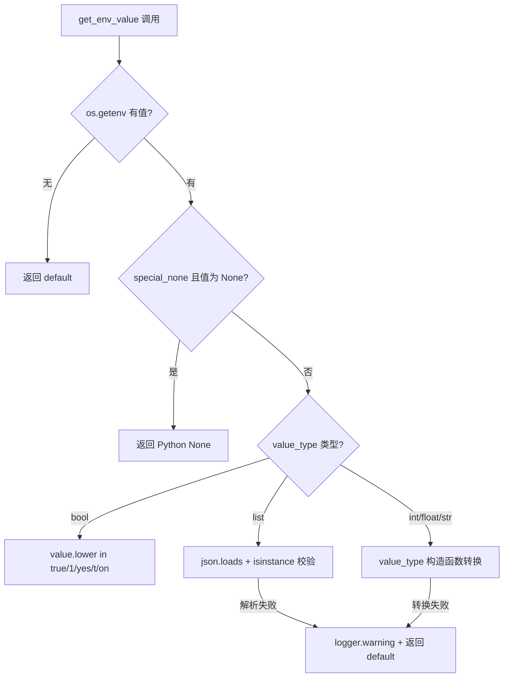
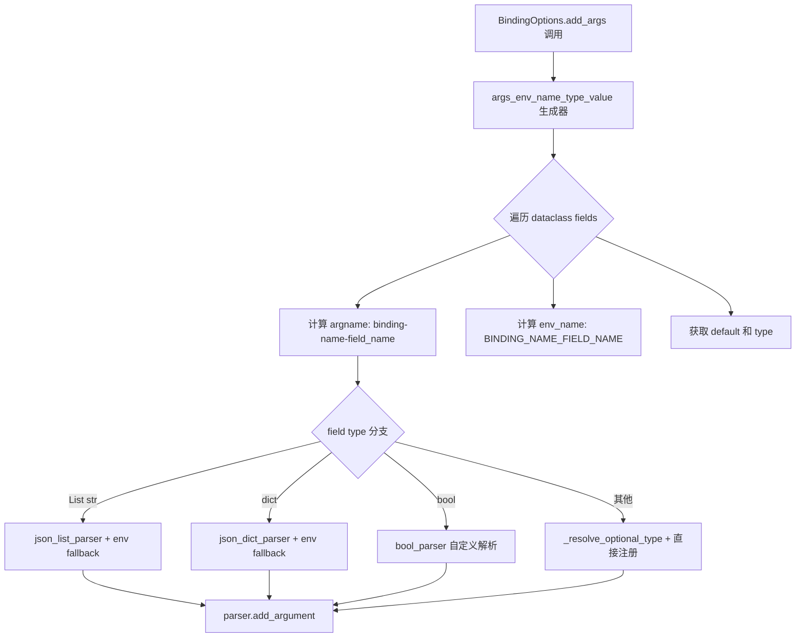

# PD-298.01 LightRAG — 四层配置优先级与 BindingOptions 自动生成

> 文档编号：PD-298.01
> 来源：LightRAG `lightrag/api/config.py` `lightrag/llm/binding_options.py` `lightrag/utils.py` `lightrag/constants.py`
> GitHub：https://github.com/HKUDS/LightRAG.git
> 问题域：PD-298 配置管理 Configuration Management
> 状态：可复用方案

---

## 第 1 章 问题与动机

### 1.1 核心问题

RAG 系统的配置参数极其庞大——LightRAG 仅 API 层就有 60+ 个可配置项，涵盖服务器端口、LLM 绑定类型、Embedding 参数、存储后端、JWT 认证、Rerank 模型等。这些参数需要同时支持：

1. **开发者默认值**：代码中硬编码合理默认值，零配置即可启动
2. **运维 .env 文件**：部署时通过 `.env` 文件覆盖，不改代码
3. **CLI 参数**：启动时通过命令行精细调整
4. **多 LLM Provider 差异化**：Ollama/OpenAI/Gemini 各有独立参数集，不能互相污染

如果每个参数都手写 argparse + env 读取 + 类型转换，60+ 参数意味着数百行重复样板代码，且极易出现类型不一致、优先级混乱的 bug。

### 1.2 LightRAG 的解法概述

1. **`get_env_value` 统一类型转换函数**（`lightrag/utils.py:176`）：一个函数处理 bool/int/float/list/str 五种类型的环境变量读取与转换，含 JSON 解析和 `"None"` 特殊值处理
2. **`constants.py` 集中默认值**（`lightrag/constants.py:1-114`）：所有默认值定义在一个文件中，被 config.py 和 lightrag.py 共同引用，确保一致性
3. **`BindingOptions` dataclass 基类**（`lightrag/llm/binding_options.py:69-356`）：通过 dataclass 字段自省自动生成 argparse 参数和 `.env` 模板，新增 Provider 只需定义字段
4. **`_GlobalArgsProxy` 惰性初始化代理**（`lightrag/api/config.py:529-580`）：全局配置对象延迟到首次访问时才解析，支持编程式注入和 `vars()` 调用
5. **条件化 Binding 注册**（`lightrag/api/config.py:274-313`）：根据 `--llm-binding` 值动态注册对应 Provider 的 argparse 参数组，避免参数命名空间污染

### 1.3 设计思想

| 设计原则 | 具体实现 | 理由 | 替代方案 |
|----------|----------|------|----------|
| 单一职责类型转换 | `get_env_value` 统一处理 5 种类型 | 避免每处 `os.getenv` 后手写转换逻辑 | 每处调用自行 `int(os.getenv(...))` |
| 默认值集中管理 | `constants.py` 定义所有 `DEFAULT_*` | API 层和 SDK 层共享同一默认值 | 各模块各自硬编码默认值 |
| 元编程消除样板 | `BindingOptions` 通过 dataclass 自省生成 argparse | 新增 Provider 零样板代码 | 每个 Provider 手写 `add_argument` |
| 惰性初始化 | `_GlobalArgsProxy.__getattribute__` 拦截 | 支持测试注入和 uvicorn 多进程 | 模块级 `parse_args()` 立即执行 |
| 条件注册 | 根据 binding 值动态 `add_args` | 避免 Ollama 参数出现在 OpenAI 的 `--help` 中 | 注册所有 Provider 参数 |

---

## 第 2 章 源码实现分析

### 2.1 架构概览

LightRAG 的配置体系分为四层，优先级从低到高：

```
┌─────────────────────────────────────────────────────────────┐
│                    配置优先级（高→低）                         │
├─────────────────────────────────────────────────────────────┤
│  Layer 4: CLI 参数        --port 8080                       │
│  Layer 3: 环境变量/.env    PORT=8080                         │
│  Layer 2: config.ini      [section] key=value (遗留)         │
│  Layer 1: constants.py    DEFAULT_* 硬编码默认值              │
├─────────────────────────────────────────────────────────────┤
│                                                             │
│  ┌──────────┐    ┌──────────────┐    ┌──────────────────┐   │
│  │constants │───→│ get_env_value│───→│ parse_args()     │   │
│  │  .py     │    │  (utils.py)  │    │ (config.py)      │   │
│  └──────────┘    └──────────────┘    └────────┬─────────┘   │
│                                               │             │
│  ┌──────────────────┐    ┌────────────────────▼──────────┐  │
│  │ BindingOptions   │───→│ _GlobalArgsProxy              │  │
│  │ (自动生成 args)   │    │ (惰性全局配置)                 │  │
│  └──────────────────┘    └───────────────────────────────┘  │
│                                                             │
└─────────────────────────────────────────────────────────────┘
```

### 2.2 核心实现

#### 2.2.1 get_env_value — 统一类型转换



对应源码 `lightrag/utils.py:176-225`：

```python
def get_env_value(
    env_key: str, default: any, value_type: type = str, special_none: bool = False
) -> any:
    value = os.getenv(env_key)
    if value is None:
        return default

    # Handle special case for "None" string
    if special_none and value == "None":
        return None

    if value_type is bool:
        return value.lower() in ("true", "1", "yes", "t", "on")

    # Handle list type with JSON parsing
    if value_type is list:
        try:
            import json
            parsed_value = json.loads(value)
            if isinstance(parsed_value, list):
                return parsed_value
            else:
                logger.warning(
                    f"Environment variable {env_key} is not a valid JSON list, using default"
                )
                return default
        except (json.JSONDecodeError, ValueError) as e:
            logger.warning(f"Failed to parse {env_key} as JSON list: {e}, using default")
            return default

    try:
        return value_type(value)
    except (ValueError, TypeError):
        return default
```

关键设计点：
- `special_none` 参数处理 `TIMEOUT=None` 这类"显式禁用"场景（`config.py:117`）
- bool 转换支持 5 种真值字符串，不依赖 Python 的 `bool()` 构造函数（`bool("false")` 返回 `True`）
- list 类型通过 JSON 解析，失败时 warning 并降级到默认值，不抛异常

#### 2.2.2 BindingOptions — dataclass 自省自动生成 argparse



对应源码 `lightrag/llm/binding_options.py:111-203`：

```python
@classmethod
def add_args(cls, parser: ArgumentParser):
    group = parser.add_argument_group(f"{cls._binding_name} binding options")
    for arg_item in cls.args_env_name_type_value():
        if arg_item["type"] is List[str]:
            def json_list_parser(value):
                try:
                    parsed = json.loads(value)
                    if not isinstance(parsed, list):
                        raise argparse.ArgumentTypeError(
                            f"Expected JSON array, got {type(parsed).__name__}"
                        )
                    return parsed
                except json.JSONDecodeError as e:
                    raise argparse.ArgumentTypeError(f"Invalid JSON: {e}")

            env_value = get_env_value(f"{arg_item['env_name']}", argparse.SUPPRESS)
            if env_value is not argparse.SUPPRESS:
                try:
                    env_value = json_list_parser(env_value)
                except argparse.ArgumentTypeError:
                    env_value = argparse.SUPPRESS

            group.add_argument(
                f"--{arg_item['argname']}",
                type=json_list_parser,
                default=env_value,
                help=arg_item["help"],
            )
        elif arg_item["type"] is bool:
            def bool_parser(value):
                if isinstance(value, bool):
                    return value
                if isinstance(value, str):
                    return value.lower() in ("true", "1", "yes", "t", "on")
                return bool(value)

            env_value = get_env_value(
                f"{arg_item['env_name']}", argparse.SUPPRESS, bool
            )
            group.add_argument(
                f"--{arg_item['argname']}",
                type=bool_parser,
                default=env_value,
                help=arg_item["help"],
            )
```

命名约定自动推导（`binding_options.py:206-236`）：
- CLI 参数名：`{binding_name}-{field_name}`，下划线转连字符（如 `ollama-llm-num_ctx`）
- 环境变量名：`{BINDING_NAME}_{FIELD_NAME}`，全大写（如 `OLLAMA_LLM_NUM_CTX`）

### 2.3 实现细节

#### 条件化 Binding 注册

`config.py:274-313` 实现了一个巧妙的两阶段解析：先从 `sys.argv` 手动提取 `--llm-binding` 值，再根据该值决定注册哪个 Provider 的参数组：

```python
# 第一阶段：手动从 sys.argv 提取 binding 类型
llm_binding_value = None
if "--llm-binding" in sys.argv:
    try:
        idx = sys.argv.index("--llm-binding")
        if idx + 1 < len(sys.argv) and not sys.argv[idx + 1].startswith("-"):
            llm_binding_value = sys.argv[idx + 1]
    except IndexError:
        pass

if llm_binding_value is None:
    llm_binding_value = get_env_value("LLM_BINDING", "ollama")

# 第二阶段：根据 binding 类型注册对应参数组
if llm_binding_value == "ollama":
    OllamaLLMOptions.add_args(parser)
elif llm_binding_value in ["openai", "azure_openai"]:
    OpenAILLMOptions.add_args(parser)
elif llm_binding_value == "gemini":
    GeminiLLMOptions.add_args(parser)
```

#### _GlobalArgsProxy 惰性代理

`config.py:529-580` 通过 `__getattribute__` 拦截实现延迟初始化：

```python
class _GlobalArgsProxy:
    def __getattribute__(self, name):
        global _initialized, _global_args
        if name == "__dict__":
            if not _initialized:
                initialize_config()
            return vars(_global_args)
        if name in ("__class__", "__repr__", "__getattribute__", "__setattr__"):
            return object.__getattribute__(self, name)
        if not _initialized:
            initialize_config()
        return getattr(_global_args, name)
```

这使得 `from config import global_args` 在模块导入时不触发解析，直到首次访问属性才执行 `parse_args()`。

#### .env 模板自动生成

`binding_options.py:266-314` 的 `generate_dot_env_sample` 遍历所有 `BindingOptions` 子类，自动生成带注释的 `.env` 模板：

```python
@classmethod
def generate_dot_env_sample(cls):
    sample_stream = StringIO()
    sample_stream.write(sample_top)
    for klass in cls.__subclasses__():
        for arg_item in klass.args_env_name_type_value():
            if arg_item["help"]:
                sample_stream.write(f"# {arg_item['help']}\n")
            sample_stream.write(f"# {arg_item['env_name']}={default_value}\n\n")
    sample_stream.write(sample_bottom)
    return sample_stream.getvalue()
```

运行 `python -m lightrag.llm.binding_options` 即可生成完整 `.env` 样例文件。

---

## 第 3 章 迁移指南

### 3.1 迁移清单

**阶段 1：基础设施（1 个文件）**
- [ ] 创建 `constants.py`，集中定义所有 `DEFAULT_*` 常量
- [ ] 实现 `get_env_value(env_key, default, value_type, special_none)` 工具函数

**阶段 2：Binding 自动化（2 个文件）**
- [ ] 创建 `BindingOptions` dataclass 基类，含 `add_args`、`args_env_name_type_value`、`generate_dot_env_sample`、`options_dict` 四个类方法
- [ ] 为每个 Provider 创建子类，只定义字段和 `_help` 字典

**阶段 3：全局配置（1 个文件）**
- [ ] 实现 `parse_args()` 函数，使用 `get_env_value` 作为 argparse default
- [ ] 实现 `_GlobalArgsProxy` 惰性代理 + `initialize_config(args, force)` 接口
- [ ] 添加条件化 Binding 注册逻辑

### 3.2 适配代码模板

#### 最小可运行的 get_env_value

```python
import os
import json
import logging

logger = logging.getLogger(__name__)

def get_env_value(
    env_key: str, default, value_type: type = str, special_none: bool = False
):
    """从环境变量读取值并自动类型转换。

    Args:
        env_key: 环境变量名
        default: 默认值
        value_type: 目标类型 (str/int/float/bool/list)
        special_none: 若为 True，字符串 "None" 返回 Python None
    """
    value = os.getenv(env_key)
    if value is None:
        return default

    if special_none and value == "None":
        return None

    if value_type is bool:
        return value.lower() in ("true", "1", "yes", "t", "on")

    if value_type is list:
        try:
            parsed = json.loads(value)
            if isinstance(parsed, list):
                return parsed
            logger.warning(f"{env_key} is not a JSON list, using default")
            return default
        except (json.JSONDecodeError, ValueError):
            logger.warning(f"Failed to parse {env_key} as JSON list, using default")
            return default

    try:
        return value_type(value)
    except (ValueError, TypeError):
        return default
```

#### 最小可运行的 BindingOptions 基类

```python
from dataclasses import dataclass, fields
from argparse import ArgumentParser, Namespace
from typing import ClassVar, Any

@dataclass
class BindingOptions:
    _binding_name: ClassVar[str]
    _help: ClassVar[dict[str, str]]

    @classmethod
    def add_args(cls, parser: ArgumentParser):
        prefix = cls._binding_name.replace("_", "-")
        env_prefix = f"{cls._binding_name}_".upper()
        group = parser.add_argument_group(f"{cls._binding_name} options")

        for f in fields(cls):
            if f.name.startswith("_"):
                continue
            argname = f"--{prefix}-{f.name}"
            env_name = f"{env_prefix}{f.name.upper()}"
            help_text = cls._help.get(f.name, "")

            default = get_env_value(env_name, f.default, f.type)
            group.add_argument(argname, type=f.type, default=default, help=help_text)

    @classmethod
    def options_dict(cls, args: Namespace) -> dict[str, Any]:
        prefix = cls._binding_name + "_"
        return {
            k[len(prefix):]: v
            for k, v in vars(args).items()
            if k.startswith(prefix)
        }
```

### 3.3 适用场景

| 场景 | 适用度 | 说明 |
|------|--------|------|
| 多 LLM Provider 的 RAG/Agent 系统 | ⭐⭐⭐ | 每个 Provider 参数集不同，BindingOptions 自动化收益最大 |
| 单 Provider 但参数多的 CLI 工具 | ⭐⭐⭐ | get_env_value + constants.py 模式即可，不需要 BindingOptions |
| 微服务配置（少量参数） | ⭐⭐ | 参数少时 BindingOptions 过度设计，直接 argparse 即可 |
| 需要 config.ini 分节管理的场景 | ⭐ | LightRAG 的 config.ini 是遗留代码（标注 TODO: TO REMOVE），不推荐 |

---

## 第 4 章 测试用例

```python
import os
import json
import argparse
import pytest
from dataclasses import dataclass
from typing import ClassVar, List


# ---- 测试 get_env_value ----

class TestGetEnvValue:
    """测试统一类型转换函数"""

    def test_default_when_env_not_set(self):
        """环境变量不存在时返回默认值"""
        os.environ.pop("TEST_KEY_NONEXIST", None)
        assert get_env_value("TEST_KEY_NONEXIST", 42, int) == 42

    def test_bool_true_variants(self):
        """bool 类型支持多种真值字符串"""
        for val in ("true", "1", "yes", "t", "on", "True", "YES"):
            os.environ["TEST_BOOL"] = val
            assert get_env_value("TEST_BOOL", False, bool) is True
        os.environ.pop("TEST_BOOL", None)

    def test_bool_false_variants(self):
        """非真值字符串返回 False"""
        for val in ("false", "0", "no", "off", "anything"):
            os.environ["TEST_BOOL"] = val
            assert get_env_value("TEST_BOOL", True, bool) is False
        os.environ.pop("TEST_BOOL", None)

    def test_int_conversion(self):
        os.environ["TEST_INT"] = "9621"
        assert get_env_value("TEST_INT", 0, int) == 9621
        os.environ.pop("TEST_INT", None)

    def test_int_invalid_fallback(self):
        """无效 int 字符串降级到默认值"""
        os.environ["TEST_INT"] = "not_a_number"
        assert get_env_value("TEST_INT", 42, int) == 42
        os.environ.pop("TEST_INT", None)

    def test_list_json_parsing(self):
        os.environ["TEST_LIST"] = '["a", "b", "c"]'
        assert get_env_value("TEST_LIST", [], list) == ["a", "b", "c"]
        os.environ.pop("TEST_LIST", None)

    def test_list_invalid_json_fallback(self):
        os.environ["TEST_LIST"] = "not json"
        assert get_env_value("TEST_LIST", ["default"], list) == ["default"]
        os.environ.pop("TEST_LIST", None)

    def test_special_none(self):
        """special_none=True 时字符串 'None' 返回 Python None"""
        os.environ["TEST_NONE"] = "None"
        assert get_env_value("TEST_NONE", 300, int, special_none=True) is None
        os.environ.pop("TEST_NONE", None)

    def test_special_none_disabled(self):
        """special_none=False 时字符串 'None' 不特殊处理"""
        os.environ["TEST_NONE"] = "None"
        # int("None") 会失败，降级到默认值
        assert get_env_value("TEST_NONE", 300, int, special_none=False) == 300
        os.environ.pop("TEST_NONE", None)


# ---- 测试 BindingOptions ----

class TestBindingOptions:
    """测试 dataclass 自省生成 argparse"""

    def test_add_args_creates_arguments(self):
        """子类 add_args 应注册带前缀的参数"""
        @dataclass
        class TestProvider(BindingOptions):
            _binding_name: ClassVar[str] = "test_provider"
            _help: ClassVar[dict] = {"temperature": "LLM temperature"}
            temperature: float = 0.7

        parser = argparse.ArgumentParser()
        TestProvider.add_args(parser)
        args = parser.parse_args(["--test-provider-temperature", "0.9"])
        assert args.test_provider_temperature == 0.9

    def test_options_dict_extracts_prefix(self):
        """options_dict 应去除前缀返回干净字典"""
        ns = argparse.Namespace(
            test_provider_temperature=0.9,
            test_provider_top_k=40,
            other_param="ignored",
        )

        @dataclass
        class TestProvider(BindingOptions):
            _binding_name: ClassVar[str] = "test_provider"
            _help: ClassVar[dict] = {}

        result = TestProvider.options_dict(ns)
        assert result == {"temperature": 0.9, "top_k": 40}
        assert "other_param" not in result

    def test_env_fallback_in_add_args(self):
        """argparse default 应从环境变量读取"""
        os.environ["TEST_PROVIDER_TEMPERATURE"] = "0.3"

        @dataclass
        class TestProvider(BindingOptions):
            _binding_name: ClassVar[str] = "test_provider"
            _help: ClassVar[dict] = {"temperature": "temp"}
            temperature: float = 0.7

        parser = argparse.ArgumentParser()
        TestProvider.add_args(parser)
        args = parser.parse_args([])  # 无 CLI 参数
        assert float(args.test_provider_temperature) == 0.3
        os.environ.pop("TEST_PROVIDER_TEMPERATURE", None)
```

---

## 第 5 章 跨域关联

| 关联域 | 关系类型 | 说明 |
|--------|----------|------|
| PD-04 工具系统 | 协同 | BindingOptions 的 Provider 子类本质上是工具系统的配置层，每个 LLM Provider 就是一个"工具" |
| PD-11 可观测性 | 依赖 | 配置中的 `LOG_LEVEL`、`VERBOSE` 等参数直接控制可观测性行为 |
| PD-03 容错与重试 | 协同 | `TIMEOUT`、`MAX_ASYNC` 等配置参数是容错策略的参数化入口 |
| PD-06 记忆持久化 | 协同 | 存储后端选择（`KV_STORAGE`、`VECTOR_STORAGE`、`GRAPH_STORAGE`）通过配置管理切换 |

---

## 第 6 章 来源文件索引

| 文件 | 行范围 | 关键实现 |
|------|--------|----------|
| `lightrag/utils.py` | L176-L225 | `get_env_value` 统一类型转换函数 |
| `lightrag/constants.py` | L1-L114 | 所有 `DEFAULT_*` 常量集中定义 |
| `lightrag/llm/binding_options.py` | L69-L356 | `BindingOptions` 基类 + `add_args` + `generate_dot_env_sample` |
| `lightrag/llm/binding_options.py` | L371-L567 | Ollama/Gemini/OpenAI 三个 Provider 子类 |
| `lightrag/api/config.py` | L77-L462 | `parse_args()` 60+ 参数定义 + 条件化 Binding 注册 |
| `lightrag/api/config.py` | L476-L580 | `_GlobalArgsProxy` 惰性代理 + `initialize_config` |
| `lightrag/lightrag.py` | L125-L126 | `configparser` 遗留 config.ini 读取（标注 TODO: TO REMOVE） |
| `lightrag/lightrag.py` | L131-L417 | `LightRAG` dataclass 字段默认值 + `get_env_value` 集成 |

---

## 第 7 章 横向对比维度

```json comparison_data
{
  "project": "LightRAG",
  "dimensions": {
    "配置层级": "四层：constants默认值→.env→config.ini(遗留)→CLI argparse",
    "类型转换": "get_env_value统一处理bool/int/float/list/str+special_none",
    "自动生成": "BindingOptions dataclass自省→argparse参数+.env模板",
    "惰性初始化": "_GlobalArgsProxy拦截__getattribute__延迟parse_args",
    "Provider隔离": "条件化add_args：根据--llm-binding值动态注册参数组"
  }
}
```

### 域元数据补充

```json domain_metadata
{
  "solution_summary": "LightRAG用BindingOptions dataclass自省自动生成argparse参数和.env模板，get_env_value统一5种类型转换，_GlobalArgsProxy惰性代理支持编程式注入",
  "description": "配置参数的自动化生成与Provider级命名空间隔离",
  "sub_problems": [
    "条件化参数注册：根据运行时选择动态加载Provider参数组",
    "惰性配置初始化：支持测试注入和多进程延迟解析"
  ],
  "best_practices": [
    "通过dataclass字段自省消除argparse样板代码",
    "_GlobalArgsProxy代理模式实现配置惰性初始化与编程式注入"
  ]
}
```
