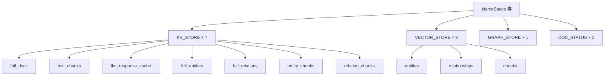
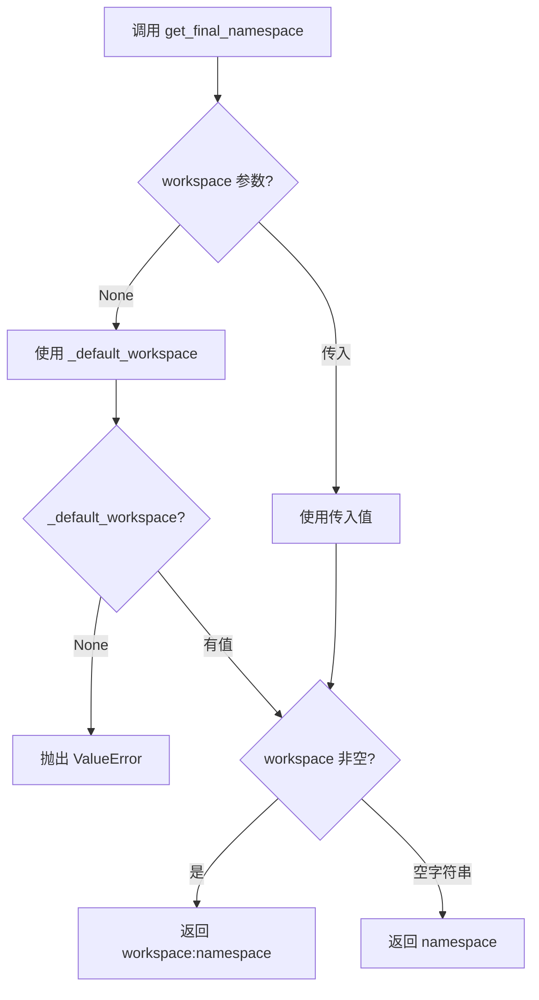
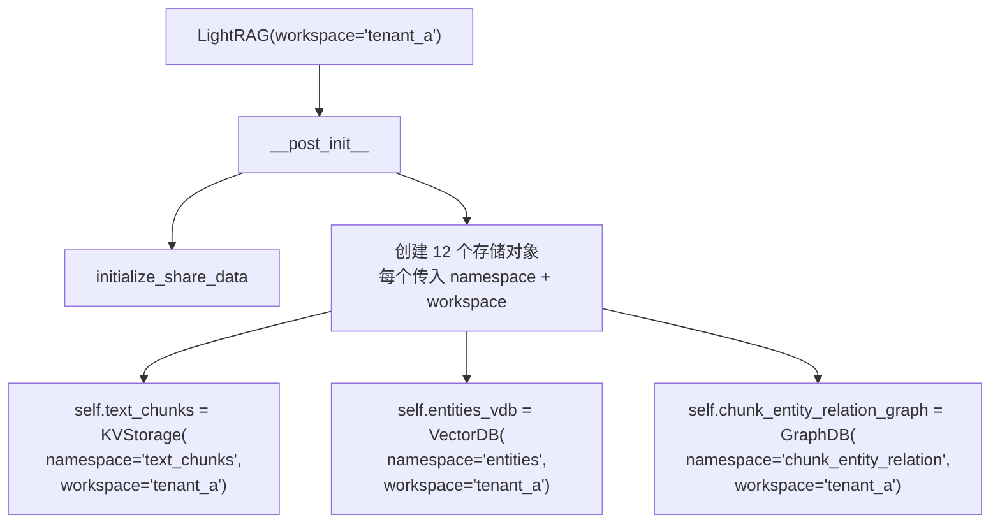

# PD-299.01 LightRAG — workspace+namespace 双层多租户数据隔离

> 文档编号：PD-299.01
> 来源：LightRAG `lightrag/kg/shared_storage.py`, `lightrag/namespace.py`, `lightrag/lightrag.py`, `lightrag/base.py`
> GitHub：https://github.com/HKUDS/LightRAG.git
> 问题域：PD-299 多租户数据隔离 Multi-Tenant Data Isolation
> 状态：可复用方案

---

## 第 1 章 问题与动机

### 1.1 核心问题

RAG 系统在多租户场景下面临三层隔离挑战：

1. **存储隔离**：不同租户的文档、向量、知识图谱必须物理分离，防止数据泄露
2. **进程隔离**：Gunicorn 多 worker 部署时，共享内存中的命名空间数据需要跨进程安全访问
3. **初始化隔离**：多个 worker 同时启动时，每个 workspace 的存储只能被初始化一次，避免重复加载和数据竞争

LightRAG 作为一个支持多种存储后端（JSON/MongoDB/Neo4j/Milvus 等）的 RAG 框架，需要在不侵入具体存储实现的前提下，提供统一的多租户隔离机制。

### 1.2 LightRAG 的解法概述

LightRAG 采用 **workspace + namespace 双层隔离** 架构：

1. **workspace 层**（租户级）：每个 LightRAG 实例绑定一个 workspace，对应文件系统的独立子目录，实现租户间物理隔离（`lightrag/lightrag.py:158`）
2. **namespace 层**（存储类型级）：12 个预定义 namespace 常量覆盖 KV/Vector/Graph/DocStatus 四类存储，每个 namespace 对应独立的存储文件（`lightrag/namespace.py:7-22`）
3. **shared_storage 统一管理**：通过 `get_final_namespace()` 将 workspace:namespace 组合为唯一 key，在跨进程共享字典中管理初始化标志和更新标志（`lightrag/kg/shared_storage.py:99-112`）
4. **KeyedUnifiedLock 锁体系**：支持 asyncio 单进程和 multiprocessing 多进程两种模式，按 namespace 粒度提供细粒度锁（`lightrag/kg/shared_storage.py:529-654`）
5. **默认 workspace 兼容**：`set_default_workspace()` 机制确保不传 workspace 参数的旧代码仍能正常工作（`lightrag/kg/shared_storage.py:1674-1688`）

### 1.3 设计思想

| 设计原则 | 具体实现 | 理由 | 替代方案 |
|----------|----------|------|----------|
| 双层命名空间 | `workspace:namespace` 组合 key | 租户隔离和存储类型隔离正交，互不干扰 | 单层 flat key（无法区分租户和存储类型） |
| 文件系统目录隔离 | workspace 对应子目录 | 物理隔离最彻底，便于备份和迁移 | 数据库 schema 隔离（依赖特定数据库） |
| 常量枚举 namespace | NameSpace 类定义 12 个常量 | 编译期可检查，防止拼写错误 | 字符串字面量（易出错） |
| 双模式锁 | asyncio.Lock / mp.Lock 自动切换 | 单进程零开销，多进程安全 | 始终用 mp.Lock（单进程性能损失） |
| 默认 workspace 回退 | `_default_workspace` 全局变量 | 向后兼容不传 workspace 的旧 API | 强制所有调用传 workspace（破坏兼容性） |

---

## 第 2 章 源码实现分析

### 2.1 架构概览

LightRAG 的多租户隔离架构分为三层：

```
┌─────────────────────────────────────────────────────────────┐
│                    LightRAG Instance                         │
│                  workspace="tenant_a"                         │
├─────────────────────────────────────────────────────────────┤
│  ┌──────────┐ ┌──────────┐ ┌──────────┐ ┌──────────┐       │
│  │ KV Store │ │ VectorDB │ │ GraphDB  │ │DocStatus │       │
│  │ ×7 ns    │ │ ×3 ns    │ │ ×1 ns    │ │ ×1 ns    │       │
│  └────┬─────┘ └────┬─────┘ └────┬─────┘ └────┬─────┘       │
│       │             │            │             │              │
│  ┌────▼─────────────▼────────────▼─────────────▼──────┐     │
│  │          StorageNameSpace (base class)               │     │
│  │          namespace: str + workspace: str             │     │
│  └────────────────────┬────────────────────────────────┘     │
│                       │                                       │
│  ┌────────────────────▼────────────────────────────────┐     │
│  │              shared_storage module                    │     │
│  │  get_final_namespace() → "tenant_a:text_chunks"      │     │
│  │  _shared_dicts["tenant_a:text_chunks"] → {}          │     │
│  │  _init_flags["tenant_a:text_chunks"] → True          │     │
│  └──────────────────────────────────────────────────────┘     │
├─────────────────────────────────────────────────────────────┤
│  File System:                                                │
│  ./rag_storage/tenant_a/kv_store_text_chunks.json           │
│  ./rag_storage/tenant_a/vdb_entities.json                   │
│  ./rag_storage/tenant_a/graph_chunk_entity_relation.graphml │
└─────────────────────────────────────────────────────────────┘
```

### 2.2 核心实现

#### 2.2.1 NameSpace 常量枚举



对应源码 `lightrag/namespace.py:7-22`：

```python
class NameSpace:
    KV_STORE_FULL_DOCS = "full_docs"
    KV_STORE_TEXT_CHUNKS = "text_chunks"
    KV_STORE_LLM_RESPONSE_CACHE = "llm_response_cache"
    KV_STORE_FULL_ENTITIES = "full_entities"
    KV_STORE_FULL_RELATIONS = "full_relations"
    KV_STORE_ENTITY_CHUNKS = "entity_chunks"
    KV_STORE_RELATION_CHUNKS = "relation_chunks"

    VECTOR_STORE_ENTITIES = "entities"
    VECTOR_STORE_RELATIONSHIPS = "relationships"
    VECTOR_STORE_CHUNKS = "chunks"

    GRAPH_STORE_CHUNK_ENTITY_RELATION = "chunk_entity_relation"

    DOC_STATUS = "doc_status"
```

12 个常量覆盖了 RAG 系统的全部存储需求。每个 LightRAG 实例创建时，会为每个 namespace 实例化一个独立的存储对象，并绑定当前 workspace。

#### 2.2.2 workspace:namespace 组合 key 机制



对应源码 `lightrag/kg/shared_storage.py:99-112`：

```python
def get_final_namespace(namespace: str, workspace: str | None = None):
    global _default_workspace
    if workspace is None:
        workspace = _default_workspace

    if workspace is None:
        direct_log(
            f"Error: Invoke namespace operation without workspace, pid={os.getpid()}",
            level="ERROR",
        )
        raise ValueError("Invoke namespace operation without workspace")

    final_namespace = f"{workspace}:{namespace}" if workspace else f"{namespace}"
    return final_namespace
```

这个函数是整个隔离体系的核心枢纽。所有共享内存操作（`get_namespace_data`、`try_initialize_namespace`、`get_namespace_lock`）都通过它生成唯一 key。

#### 2.2.3 LightRAG 实例绑定 workspace



对应源码 `lightrag/lightrag.py:584-658`：

```python
self.llm_response_cache: BaseKVStorage = self.key_string_value_json_storage_cls(
    namespace=NameSpace.KV_STORE_LLM_RESPONSE_CACHE,
    workspace=self.workspace,
    global_config=global_config,
    embedding_func=self.embedding_func,
)

self.text_chunks: BaseKVStorage = self.key_string_value_json_storage_cls(
    namespace=NameSpace.KV_STORE_TEXT_CHUNKS,
    workspace=self.workspace,
    embedding_func=self.embedding_func,
)

# ... 共 12 个存储对象，每个都传入 workspace
```

### 2.3 实现细节

#### 2.3.1 文件系统目录隔离

每个具体存储实现（JsonKVStorage、NanoVectorDBStorage、NetworkXStorage）在 `__post_init__` 中统一执行目录隔离逻辑：

```python
# 以 JsonKVStorage 为例 (lightrag/kg/json_kv_impl.py:29-39)
working_dir = self.global_config["working_dir"]
if self.workspace:
    workspace_dir = os.path.join(working_dir, self.workspace)
else:
    workspace_dir = working_dir
    self.workspace = ""

self._file_name = os.path.join(workspace_dir, f"kv_store_{self.namespace}.json")
```

最终文件布局：

```
rag_storage/
├── tenant_a/                          # workspace = "tenant_a"
│   ├── kv_store_full_docs.json
│   ├── kv_store_text_chunks.json
│   ├── vdb_entities.json
│   ├── vdb_relationships.json
│   ├── graph_chunk_entity_relation.graphml
│   └── kv_store_doc_status.json
├── tenant_b/                          # workspace = "tenant_b"
│   ├── kv_store_full_docs.json
│   └── ...
└── kv_store_full_docs.json            # workspace = "" (全局/默认)
```

#### 2.3.2 跨进程共享内存隔离

`shared_storage.py` 中的 `_shared_dicts` 是一个以 `workspace:namespace` 为 key 的字典，在多进程模式下使用 `multiprocessing.Manager().dict()` 实现跨进程共享：

```python
# shared_storage.py:1176-1264 (initialize_share_data)
if workers > 1:
    _is_multiprocess = True
    _manager = Manager()
    _shared_dicts = _manager.dict()      # 跨进程共享字典
    _init_flags = _manager.dict()        # 初始化标志
    _update_flags = _manager.dict()      # 更新通知标志
else:
    _is_multiprocess = False
    _shared_dicts = {}                   # 普通字典
    _init_flags = {}
    _update_flags = {}
```

#### 2.3.3 初始化竞争保护

`try_initialize_namespace()` 使用 `_init_flags` 确保每个 `workspace:namespace` 只被一个 worker 初始化一次（`shared_storage.py:1417-1442`）：

```python
async def try_initialize_namespace(
    namespace: str, workspace: str | None = None
) -> bool:
    final_namespace = get_final_namespace(namespace, workspace)
    async with get_internal_lock():
        if final_namespace not in _init_flags:
            _init_flags[final_namespace] = True
            return True  # 获得初始化权限
    return False  # 已被其他 worker 初始化
```

#### 2.3.4 默认 workspace 向后兼容

首个 LightRAG 实例初始化时自动设置默认 workspace（`lightrag.py:681-685`）：

```python
default_workspace = get_default_workspace()
if default_workspace is None:
    set_default_workspace(self.workspace)
```

后续不传 workspace 的调用会自动使用默认值，确保旧代码无需修改。

---

## 第 3 章 迁移指南

### 3.1 迁移清单

**阶段 1：定义命名空间常量**

- [ ] 创建 `NameSpace` 类，枚举所有存储类型（KV、Vector、Graph 等）
- [ ] 确保常量名与存储文件名一致，便于调试

**阶段 2：实现 StorageNameSpace 基类**

- [ ] 定义 `namespace: str` + `workspace: str` 两个字段
- [ ] 在基类中提供 `get_final_namespace()` 方法生成组合 key
- [ ] 所有具体存储类继承此基类

**阶段 3：实现文件系统隔离**

- [ ] 在存储初始化时，根据 workspace 创建子目录
- [ ] 文件名包含 namespace 后缀：`{type}_{namespace}.{ext}`
- [ ] 空 workspace 回退到根目录

**阶段 4：实现共享内存隔离**

- [ ] 创建 `shared_storage` 模块管理跨进程状态
- [ ] 使用 `workspace:namespace` 组合 key 索引共享字典
- [ ] 实现 `try_initialize_namespace()` 防止重复初始化

**阶段 5：实现锁体系**

- [ ] 单进程模式使用 `asyncio.Lock`
- [ ] 多进程模式使用 `multiprocessing.Manager().Lock()`
- [ ] 按 namespace 粒度提供细粒度锁

### 3.2 适配代码模板

以下是一个可直接复用的双层隔离模板：

```python
from __future__ import annotations
import os
import asyncio
from dataclasses import dataclass, field
from abc import ABC, abstractmethod
from typing import Any, Dict, Optional

# --- 阶段 1: 命名空间常量 ---
class NameSpace:
    """存储类型枚举，每个常量对应一个独立的存储文件"""
    DOCUMENTS = "documents"
    EMBEDDINGS = "embeddings"
    GRAPH = "graph"
    METADATA = "metadata"


# --- 阶段 2: 存储基类 ---
@dataclass
class StorageNameSpace(ABC):
    namespace: str
    workspace: str
    config: dict[str, Any]

    def get_workspace_dir(self) -> str:
        base_dir = self.config["working_dir"]
        if self.workspace:
            workspace_dir = os.path.join(base_dir, self.workspace)
        else:
            workspace_dir = base_dir
        os.makedirs(workspace_dir, exist_ok=True)
        return workspace_dir

    def get_final_namespace(self) -> str:
        if self.workspace:
            return f"{self.workspace}:{self.namespace}"
        return self.namespace

    @abstractmethod
    async def initialize(self): ...

    @abstractmethod
    async def finalize(self): ...


# --- 阶段 3: 共享状态管理 ---
class SharedStateManager:
    """跨进程共享状态管理器（简化版）"""

    def __init__(self):
        self._shared_dicts: Dict[str, Dict[str, Any]] = {}
        self._init_flags: Dict[str, bool] = {}
        self._locks: Dict[str, asyncio.Lock] = {}

    def get_namespace_data(self, final_ns: str) -> Dict[str, Any]:
        if final_ns not in self._shared_dicts:
            self._shared_dicts[final_ns] = {}
        return self._shared_dicts[final_ns]

    def try_initialize(self, final_ns: str) -> bool:
        if final_ns not in self._init_flags:
            self._init_flags[final_ns] = True
            return True
        return False

    def get_lock(self, final_ns: str) -> asyncio.Lock:
        if final_ns not in self._locks:
            self._locks[final_ns] = asyncio.Lock()
        return self._locks[final_ns]


# --- 阶段 4: 具体存储实现 ---
@dataclass
class JsonKVStorage(StorageNameSpace):
    _file_path: str = field(init=False)

    def __post_init__(self):
        workspace_dir = self.get_workspace_dir()
        self._file_path = os.path.join(
            workspace_dir, f"kv_{self.namespace}.json"
        )

    async def initialize(self):
        # 从文件加载数据
        pass

    async def finalize(self):
        # 持久化到文件
        pass


# --- 使用示例 ---
async def main():
    state_mgr = SharedStateManager()

    # 租户 A
    config = {"working_dir": "./storage"}
    store_a = JsonKVStorage(
        namespace=NameSpace.DOCUMENTS,
        workspace="tenant_a",
        config=config,
    )
    # 文件路径: ./storage/tenant_a/kv_documents.json

    # 租户 B
    store_b = JsonKVStorage(
        namespace=NameSpace.DOCUMENTS,
        workspace="tenant_b",
        config=config,
    )
    # 文件路径: ./storage/tenant_b/kv_documents.json

    # 共享状态隔离
    ns_a = store_a.get_final_namespace()  # "tenant_a:documents"
    ns_b = store_b.get_final_namespace()  # "tenant_b:documents"
    assert ns_a != ns_b
```

### 3.3 适用场景

| 场景 | 适用度 | 说明 |
|------|--------|------|
| RAG 系统多租户 SaaS | ⭐⭐⭐ | 完美匹配：每个租户独立 workspace，12 种存储类型自动隔离 |
| 多环境部署（dev/staging/prod） | ⭐⭐⭐ | workspace 可映射为环境名，共享同一进程 |
| Gunicorn 多 worker 部署 | ⭐⭐⭐ | shared_storage 的 Manager 模式专为此设计 |
| 单租户单进程 | ⭐⭐ | 可用但过度设计，空 workspace 回退到根目录即可 |
| 数据库级隔离（PostgreSQL schema） | ⭐ | 本方案面向文件系统，数据库隔离需另行设计 |

---

## 第 4 章 测试用例

```python
import pytest
import os
import asyncio
from unittest.mock import patch, MagicMock


class TestNameSpace:
    """测试命名空间常量定义"""

    def test_namespace_constants_unique(self):
        """所有 namespace 常量值必须唯一"""
        from lightrag.namespace import NameSpace
        values = [
            v for k, v in vars(NameSpace).items()
            if not k.startswith("_")
        ]
        assert len(values) == len(set(values)), "Namespace 常量存在重复值"

    def test_namespace_covers_all_storage_types(self):
        """确保覆盖 KV/Vector/Graph/DocStatus 四类存储"""
        from lightrag.namespace import NameSpace
        attrs = [k for k in vars(NameSpace) if not k.startswith("_")]
        prefixes = {a.split("_")[0] for a in attrs}
        # KV, VECTOR, GRAPH, DOC 四类
        assert "KV" in prefixes
        assert "VECTOR" in prefixes
        assert "GRAPH" in prefixes
        assert "DOC" in prefixes


class TestGetFinalNamespace:
    """测试 workspace:namespace 组合 key 生成"""

    def test_with_workspace(self):
        from lightrag.kg.shared_storage import get_final_namespace, set_default_workspace
        set_default_workspace("test_ws")
        result = get_final_namespace("text_chunks", workspace="tenant_a")
        assert result == "tenant_a:text_chunks"

    def test_empty_workspace(self):
        from lightrag.kg.shared_storage import get_final_namespace, set_default_workspace
        set_default_workspace("")
        result = get_final_namespace("text_chunks", workspace="")
        assert result == "text_chunks"  # 空 workspace 不加前缀

    def test_none_workspace_uses_default(self):
        from lightrag.kg.shared_storage import (
            get_final_namespace, set_default_workspace
        )
        set_default_workspace("default_ws")
        result = get_final_namespace("text_chunks", workspace=None)
        assert result == "default_ws:text_chunks"

    def test_none_workspace_no_default_raises(self):
        from lightrag.kg.shared_storage import get_final_namespace
        import lightrag.kg.shared_storage as ss
        original = ss._default_workspace
        ss._default_workspace = None
        with pytest.raises(ValueError, match="without workspace"):
            get_final_namespace("text_chunks", workspace=None)
        ss._default_workspace = original


class TestTryInitializeNamespace:
    """测试初始化竞争保护"""

    @pytest.mark.asyncio
    async def test_first_call_returns_true(self):
        from lightrag.kg.shared_storage import (
            initialize_share_data, try_initialize_namespace,
            set_default_workspace, finalize_share_data
        )
        finalize_share_data()
        initialize_share_data(workers=1)
        set_default_workspace("test")
        result = await try_initialize_namespace("test_ns", workspace="test")
        assert result is True
        finalize_share_data()

    @pytest.mark.asyncio
    async def test_second_call_returns_false(self):
        from lightrag.kg.shared_storage import (
            initialize_share_data, try_initialize_namespace,
            set_default_workspace, finalize_share_data
        )
        finalize_share_data()
        initialize_share_data(workers=1)
        set_default_workspace("test")
        await try_initialize_namespace("test_ns", workspace="test")
        result = await try_initialize_namespace("test_ns", workspace="test")
        assert result is False
        finalize_share_data()


class TestFileSystemIsolation:
    """测试文件系统目录隔离"""

    def test_workspace_creates_subdirectory(self, tmp_path):
        """workspace 非空时应创建子目录"""
        workspace_dir = os.path.join(str(tmp_path), "tenant_a")
        os.makedirs(workspace_dir, exist_ok=True)
        file_path = os.path.join(workspace_dir, "kv_store_text_chunks.json")
        assert "tenant_a" in file_path
        assert file_path.endswith("kv_store_text_chunks.json")

    def test_empty_workspace_uses_root(self, tmp_path):
        """workspace 为空时应使用根目录"""
        working_dir = str(tmp_path)
        workspace = ""
        if workspace:
            workspace_dir = os.path.join(working_dir, workspace)
        else:
            workspace_dir = working_dir
        assert workspace_dir == working_dir
```

---

## 第 5 章 跨域关联

| 关联域 | 关系类型 | 说明 |
|--------|----------|------|
| PD-06 记忆持久化 | 协同 | namespace 定义了 7 个 KV 存储类型，直接决定记忆数据的持久化路径和隔离粒度 |
| PD-08 搜索与检索 | 协同 | 向量检索的 3 个 namespace（entities/relationships/chunks）确保跨租户搜索不会泄露数据 |
| PD-05 沙箱隔离 | 协同 | workspace 目录隔离与沙箱文件系统隔离互补，workspace 隔离数据，沙箱隔离执行环境 |
| PD-02 多 Agent 编排 | 依赖 | 多 Agent 场景下每个 Agent 可能操作不同 workspace，编排层需要感知 workspace 上下文 |
| PD-11 可观测性 | 协同 | shared_storage 的 `direct_log()` 在所有日志中包含 workspace 和 pid 信息，支持多租户审计追踪 |

---

## 第 6 章 来源文件索引

| 文件 | 行范围 | 关键实现 |
|------|--------|----------|
| `lightrag/namespace.py` | L7-L22 | NameSpace 常量枚举：12 个存储类型定义 |
| `lightrag/base.py` | L173-L215 | StorageNameSpace 抽象基类：namespace + workspace 字段 |
| `lightrag/kg/shared_storage.py` | L99-L112 | `get_final_namespace()`：workspace:namespace 组合 key 生成 |
| `lightrag/kg/shared_storage.py` | L529-L654 | `KeyedUnifiedLock`：按 namespace 粒度的细粒度锁管理器 |
| `lightrag/kg/shared_storage.py` | L1176-L1264 | `initialize_share_data()`：单/多进程模式初始化 |
| `lightrag/kg/shared_storage.py` | L1417-L1442 | `try_initialize_namespace()`：初始化竞争保护 |
| `lightrag/kg/shared_storage.py` | L1445-L1483 | `get_namespace_data()`：按 final_namespace 获取共享数据 |
| `lightrag/kg/shared_storage.py` | L1486-L1583 | `NamespaceLock`：基于 ContextVar 的可重入命名空间锁 |
| `lightrag/kg/shared_storage.py` | L1674-L1703 | `set/get_default_workspace()`：默认 workspace 兼容机制 |
| `lightrag/lightrag.py` | L158-L159 | LightRAG dataclass workspace 字段定义 |
| `lightrag/lightrag.py` | L584-L658 | 12 个存储对象创建，每个绑定 namespace + workspace |
| `lightrag/lightrag.py` | L678-L695 | `initialize_storages()`：默认 workspace 设置 + pipeline 初始化 |

---

## 第 7 章 横向对比维度

```json comparison_data
{
  "project": "LightRAG",
  "dimensions": {
    "隔离层级": "workspace(租户)+namespace(存储类型) 双层正交隔离",
    "存储隔离方式": "文件系统目录隔离，workspace 对应子目录",
    "共享状态管理": "multiprocessing.Manager 跨进程共享字典 + init_flags 竞争保护",
    "锁粒度": "namespace 级 KeyedUnifiedLock，asyncio/mp 双模式自动切换",
    "向后兼容": "set_default_workspace 全局回退，旧 API 无需修改"
  }
}
```

### 域元数据补充

```json domain_metadata
{
  "solution_summary": "LightRAG 用 workspace+namespace 双层正交隔离实现多租户，12 个 NameSpace 常量覆盖 KV/Vector/Graph/DocStatus 四类存储，shared_storage 通过 Manager 跨进程共享 init_flags 防止重复初始化",
  "description": "文件系统目录级物理隔离与进程内逻辑命名空间的正交组合",
  "sub_problems": [
    "多进程 worker 间的初始化竞争保护",
    "namespace 级细粒度锁与 asyncio/mp 双模式切换",
    "ContextVar 实现协程安全的可重入命名空间锁"
  ],
  "best_practices": [
    "NameSpace 常量枚举防止拼写错误",
    "try_initialize_namespace 原子标志防止多 worker 重复加载",
    "KeyedUnifiedLock 按 sorted(keys) 顺序获取锁避免死锁"
  ]
}
```
