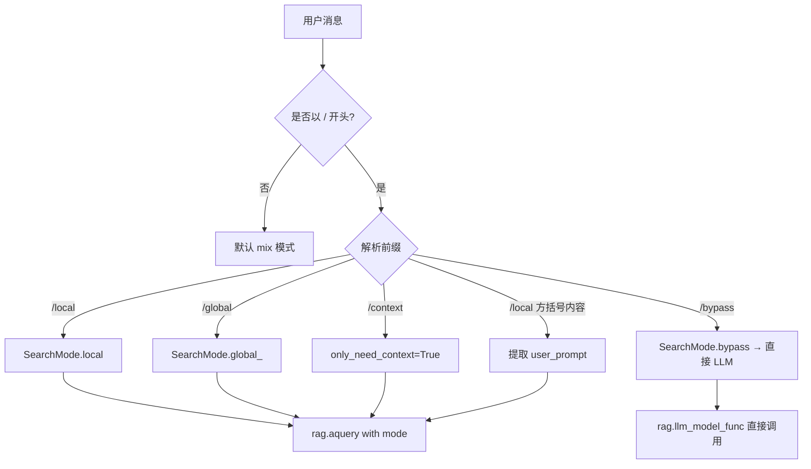
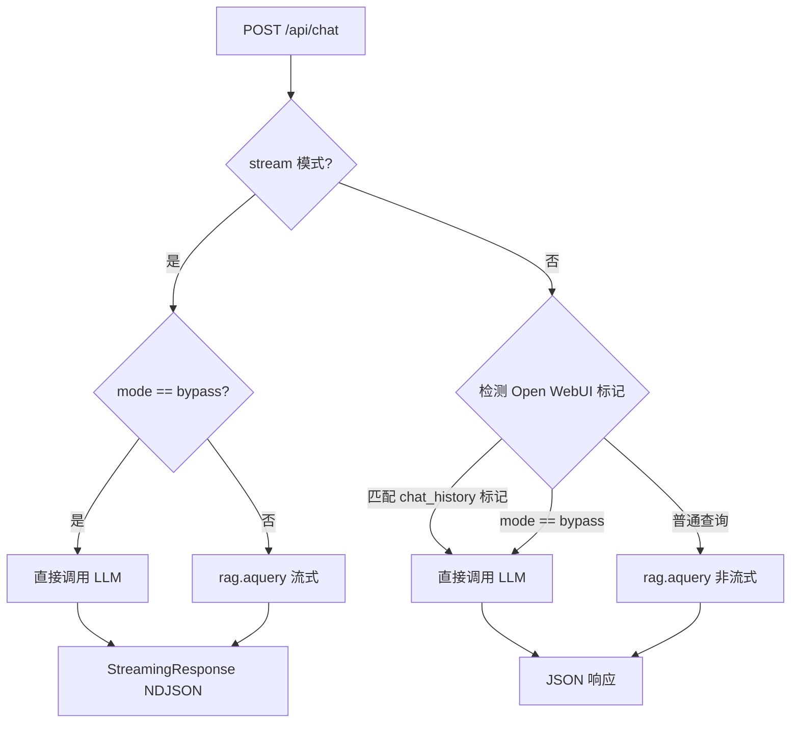

# PD-300.01 LightRAG — Ollama 兼容 API 层与双协议路由

> 文档编号：PD-300.01
> 来源：LightRAG `lightrag/api/routers/ollama_api.py`
> GitHub：https://github.com/HKUDS/LightRAG.git
> 问题域：PD-300 API兼容层 API Compatibility Layer
> 状态：可复用方案

---

## 第 1 章 问题与动机

### 1.1 核心问题

RAG 系统面临一个关键的生态接入问题：用户已经习惯了 Ollama、OpenAI 等成熟 AI 工具链的交互方式，如果 RAG 系统只提供自定义 API，用户就必须学习新的接口协议、修改现有工具配置，甚至重写客户端代码。这极大地提高了接入门槛，限制了 RAG 系统的实际使用范围。

具体痛点包括：

- Open WebUI、Continue.dev 等第三方 AI 聊天工具只支持 Ollama/OpenAI 协议，无法直接对接自定义 RAG API
- 用户需要在"使用 RAG 增强回答"和"使用熟悉的工具链"之间做选择
- RAG 系统的查询模式（local/global/hybrid/mix）无法通过标准聊天协议暴露
- 流式响应格式不兼容，导致第三方工具无法正确渲染增量输出

### 1.2 LightRAG 的解法概述

LightRAG 采用"协议伪装 + 双 API 并行"策略，在保持原生 RESTful API 完整功能的同时，额外实现了一套完整的 Ollama 兼容 API 层：

1. **OllamaAPI 类**（`ollama_api.py:220`）：完整实现 Ollama 的 `/api/chat`、`/api/generate`、`/api/tags`、`/api/ps`、`/api/version` 五个核心端点
2. **模型信息伪装**（`base.py:41-71`）：通过 `OllamaServerInfos` 数据类伪造模型元数据（名称、大小、digest、量化级别），让第三方工具认为连接的是真实 Ollama 模型
3. **查询模式前缀路由**（`ollama_api.py:165-217`）：通过 `/local`、`/global`、`/bypass` 等消息前缀，在标准聊天协议内透传 RAG 查询模式
4. **NDJSON 流式兼容**（`ollama_api.py:419-428`）：精确模拟 Ollama 的 `application/x-ndjson` 流式响应格式，包括 token 统计和耗时字段
5. **Open WebUI 会话检测**（`ollama_api.py:676-678`）：自动识别 Open WebUI 的标题/关键词生成请求，绕过 RAG 直接转发给 LLM

### 1.3 设计思想

| 设计原则 | 具体实现 | 理由 | 替代方案 |
|----------|----------|------|----------|
| 协议伪装而非协议桥接 | 完整实现 Ollama API 端点，返回 Ollama 格式响应 | 桥接需要中间转换层，增加延迟和出错概率 | 写 Ollama 插件反向代理到 LightRAG |
| 前缀路由透传模式 | 用 `/local`、`/global` 等前缀在聊天消息中编码查询模式 | 不修改 Ollama 协议即可暴露 RAG 特有功能 | 自定义 HTTP Header（第三方工具不支持） |
| 双 API 并行不互斥 | RESTful API 和 Ollama API 共享同一个 `LightRAG` 实例 | 不同场景用不同 API，无需二选一 | 只提供一种 API |
| 伪造模型元数据 | `OllamaServerInfos` 返回虚假的模型大小、digest、量化级别 | 第三方工具会校验模型信息，不伪造会被拒绝 | 只返回名称不返回详情（部分工具会报错） |
| 智能请求分流 | 检测 Open WebUI 的 `<chat_history>` 标记自动 bypass RAG | 元数据生成任务不需要 RAG，直接走 LLM 更快更准 | 所有请求都走 RAG（浪费资源且结果差） |

---

## 第 2 章 源码实现分析

### 2.1 架构概览

LightRAG 的 API 层采用 FastAPI 路由器分离架构，四个路由器挂载在同一个 FastAPI 应用上：

```
┌─────────────────────────────────────────────────────────────┐
│                    FastAPI Application                        │
│                  (lightrag_server.py)                         │
├──────────┬──────────┬──────────┬────────────────────────────┤
│ /documents│  /query  │  /graph  │       /api (Ollama)        │
│ (CRUD)   │ (RAG)    │ (KG)    │  /api/chat  /api/generate  │
│          │          │          │  /api/tags  /api/ps         │
│          │          │          │  /api/version               │
├──────────┴──────────┴──────────┴────────────────────────────┤
│                    LightRAG Core Instance                     │
│              (rag.aquery / rag.llm_model_func)               │
├─────────────────────────────────────────────────────────────┤
│  OllamaServerInfos │ LLMConfigCache │ Combined Auth Dep     │
└─────────────────────────────────────────────────────────────┘
```

关键设计：Ollama API 路由器挂载在 `/api` 前缀下（`lightrag_server.py:1103`），与 Ollama 官方 API 路径完全一致，第三方工具只需将 Ollama 地址改为 LightRAG 地址即可无缝切换。

### 2.2 核心实现

#### 2.2.1 模型信息伪装体系

```mermaid
graph TD
    A[OllamaServerInfos 初始化] --> B{环境变量/命令行参数}
    B -->|OLLAMA_EMULATING_MODEL_NAME| C[设置模型名称]
    B -->|OLLAMA_EMULATING_MODEL_TAG| D[设置模型标签]
    C --> E[LIGHTRAG_MODEL = name:tag]
    D --> E
    E --> F[/api/tags 返回模型列表]
    E --> G[/api/ps 返回运行中模型]
    E --> H[/api/version 返回版本号]
    F --> I[第三方工具识别为 Ollama 模型]
```

对应源码 `lightrag/base.py:41-71`：

```python
class OllamaServerInfos:
    def __init__(self, name=None, tag=None):
        self._lightrag_name = name or os.getenv(
            "OLLAMA_EMULATING_MODEL_NAME", DEFAULT_OLLAMA_MODEL_NAME
        )
        self._lightrag_tag = tag or os.getenv(
            "OLLAMA_EMULATING_MODEL_TAG", DEFAULT_OLLAMA_MODEL_TAG
        )
        self.LIGHTRAG_SIZE = DEFAULT_OLLAMA_MODEL_SIZE
        self.LIGHTRAG_CREATED_AT = DEFAULT_OLLAMA_CREATED_AT
        self.LIGHTRAG_DIGEST = DEFAULT_OLLAMA_DIGEST

    @property
    def LIGHTRAG_MODEL(self):
        return f"{self._lightrag_name}:{self._lightrag_tag}"
```

`/api/tags` 端点（`ollama_api.py:238-259`）返回完整的模型详情，包括伪造的 `parameter_size: "13B"`、`quantization_level: "Q4_0"`、`format: "gguf"` 等字段，让 Open WebUI 等工具将 LightRAG 显示为一个普通的 Ollama 模型。

#### 2.2.2 查询模式前缀路由



对应源码 `lightrag/api/routers/ollama_api.py:165-217`：

```python
def parse_query_mode(query: str) -> tuple[str, SearchMode, bool, Optional[str]]:
    user_prompt = None
    # 方括号格式解析: /local[use mermaid format] query
    bracket_pattern = r"^/([a-z]*)\[(.*?)\](.*)"
    bracket_match = re.match(bracket_pattern, query)
    if bracket_match:
        mode_prefix = bracket_match.group(1)
        user_prompt = bracket_match.group(2)
        remaining_query = bracket_match.group(3).lstrip()
        query = f"/{mode_prefix} {remaining_query}".strip()

    mode_map = {
        "/local ": (SearchMode.local, False),
        "/global ": (SearchMode.global_, False),
        "/bypass ": (SearchMode.bypass, False),
        "/context": (SearchMode.mix, True),
        "/localcontext": (SearchMode.local, True),
        # ... 更多模式
    }
    for prefix, (mode, only_need_context) in mode_map.items():
        if query.startswith(prefix):
            cleaned_query = query[len(prefix):].lstrip()
            return cleaned_query, mode, only_need_context, user_prompt
    return query, SearchMode.mix, False, user_prompt
```

这个设计巧妙之处在于：用户在 Open WebUI 的聊天框中输入 `/local 什么是机器学习` 就能切换到 local 模式查询，而 `/bypass 你好` 则完全绕过 RAG 直接和 LLM 对话。方括号语法 `/local[请用 Mermaid 格式] 解释架构` 还能注入自定义 prompt。

#### 2.2.3 Open WebUI 会话检测与智能分流



对应源码 `lightrag/api/routers/ollama_api.py:676-692`：

```python
# 非流式模式下检测 Open WebUI 的会话标题/关键词生成任务
match_result = re.search(
    r"\n<chat_history>\nUSER:", cleaned_query, re.MULTILINE
)
if match_result or mode == SearchMode.bypass:
    if request.system:
        self.rag.llm_model_kwargs["system_prompt"] = request.system
    response_text = await self.rag.llm_model_func(
        cleaned_query,
        stream=False,
        history_messages=conversation_history,
        **self.rag.llm_model_kwargs,
    )
else:
    response_text = await self.rag.aquery(
        cleaned_query, param=query_param
    )
```

Open WebUI 在生成会话标题和关键词时会发送包含 `<chat_history>\nUSER:` 标记的特殊请求。LightRAG 检测到这个标记后自动绕过 RAG 检索，直接将请求转发给底层 LLM，避免了不必要的知识图谱查询。

### 2.3 实现细节

**NDJSON 流式响应格式**：Ollama 使用 `application/x-ndjson`（换行分隔 JSON）格式进行流式传输。LightRAG 精确模拟了这个格式（`ollama_api.py:419-428`），包括：

- 每个 chunk 是独立的 JSON 对象，以 `\n` 分隔
- 中间 chunk 的 `done: false`，最后一个 chunk 的 `done: true`
- 最终 chunk 包含 `total_duration`、`prompt_eval_count`、`eval_count` 等 Ollama 特有的性能统计字段
- 使用 tiktoken 估算 token 数（`ollama_api.py:159-162`）
- 设置 `X-Accel-Buffering: no` 头确保 Nginx 代理不缓冲流式响应

**Content-Type 兼容**：`parse_request_body` 函数（`ollama_api.py:120-156`）同时支持 `application/json` 和 `application/octet-stream` 两种请求格式，因为不同版本的 Ollama 客户端可能使用不同的 Content-Type。

**双 API 路由挂载**（`lightrag_server.py:1091-1103`）：

```python
# 原生 RESTful API
app.include_router(create_document_routes(rag, doc_manager, api_key))
app.include_router(create_query_routes(rag, api_key, args.top_k))
app.include_router(create_graph_routes(rag, api_key))

# Ollama 兼容 API
ollama_api = OllamaAPI(rag, top_k=args.top_k, api_key=api_key)
app.include_router(ollama_api.router, prefix="/api")
```

两套 API 共享同一个 `rag` 实例和认证依赖，确保数据一致性和安全策略统一。

---

## 第 3 章 迁移指南

### 3.1 迁移清单

**阶段一：协议伪装层（1-2 天）**

- [ ] 定义目标协议的 Pydantic 请求/响应模型（参考 `ollama_api.py:28-117` 的 12 个模型类）
- [ ] 实现模型信息伪装数据类（参考 `OllamaServerInfos`），支持环境变量配置模型名称
- [ ] 实现 `/api/tags`、`/api/ps`、`/api/version` 等元数据端点
- [ ] 实现 `parse_request_body` 多 Content-Type 兼容解析

**阶段二：核心聊天端点（2-3 天）**

- [ ] 实现 `/api/chat` 端点，支持流式和非流式两种模式
- [ ] 实现 `/api/generate` 端点（纯文本补全）
- [ ] 实现 NDJSON 流式响应生成器，包含 token 统计字段
- [ ] 实现查询模式前缀路由（`parse_query_mode`）
- [ ] 实现第三方工具特殊请求检测与分流

**阶段三：集成与认证（1 天）**

- [ ] 将兼容 API 路由器挂载到主应用，使用统一认证依赖
- [ ] 配置 CORS 和反向代理头（`X-Accel-Buffering: no`）
- [ ] 在第三方工具中测试端到端连通性

### 3.2 适配代码模板

以下是一个可直接复用的 Ollama 兼容 API 层骨架：

```python
"""Ollama-compatible API layer for any RAG/LLM system."""
from fastapi import APIRouter, Request, HTTPException
from fastapi.responses import StreamingResponse
from pydantic import BaseModel
from typing import List, Dict, Any, Optional
import json
import time
import re


# ---- 模型信息伪装 ----
class ModelServerInfos:
    """伪装为 Ollama 模型的元数据配置"""
    def __init__(self, name: str = "myrag", tag: str = "latest"):
        self.name = name
        self.tag = tag
        self.model = f"{name}:{tag}"
        self.size = 7365960935
        self.digest = "sha256:" + "a" * 64
        self.created_at = "2024-01-01T00:00:00Z"


# ---- Pydantic 请求模型 ----
class ChatMessage(BaseModel):
    role: str
    content: str

class ChatRequest(BaseModel):
    model: str
    messages: List[ChatMessage]
    stream: bool = True
    options: Optional[Dict[str, Any]] = None


# ---- 查询模式前缀路由 ----
def parse_query_prefix(query: str) -> tuple[str, str, Optional[str]]:
    """解析消息前缀，返回 (cleaned_query, mode, user_prompt)"""
    bracket_match = re.match(r"^/([a-z]*)\[(.*?)\](.*)", query)
    user_prompt = None
    if bracket_match:
        user_prompt = bracket_match.group(2)
        query = f"/{bracket_match.group(1)} {bracket_match.group(3)}".strip()

    mode_map = {"/local ": "local", "/global ": "global", "/bypass ": "bypass"}
    for prefix, mode in mode_map.items():
        if query.startswith(prefix):
            return query[len(prefix):].lstrip(), mode, user_prompt
    return query, "mix", user_prompt


# ---- 路由器 ----
def create_ollama_compat_router(rag_query_func, llm_func, server_infos: ModelServerInfos):
    """
    创建 Ollama 兼容路由器。
    rag_query_func: async (query, mode, stream) -> str | AsyncGenerator
    llm_func: async (query, stream) -> str | AsyncGenerator
    """
    router = APIRouter(tags=["ollama-compat"])

    @router.get("/version")
    async def version():
        return {"version": "0.9.3"}

    @router.get("/tags")
    async def tags():
        return {"models": [{
            "name": server_infos.model, "model": server_infos.model,
            "size": server_infos.size, "digest": server_infos.digest,
            "modified_at": server_infos.created_at,
            "details": {"parent_model": "", "format": "gguf",
                        "family": server_infos.name, "families": [server_infos.name],
                        "parameter_size": "13B", "quantization_level": "Q4_0"},
        }]}

    @router.post("/chat")
    async def chat(raw_request: Request):
        body = await raw_request.json()
        request = ChatRequest(**body)
        query = request.messages[-1].content
        cleaned, mode, user_prompt = parse_query_prefix(query)
        history = [{"role": m.role, "content": m.content} for m in request.messages[:-1]]

        # 分流：bypass 模式直接走 LLM
        query_func = llm_func if mode == "bypass" else rag_query_func
        start = time.time_ns()

        if request.stream:
            response = await query_func(cleaned, mode=mode, stream=True)

            async def gen():
                total = ""
                async for chunk in response:
                    total += chunk
                    yield json.dumps({
                        "model": server_infos.model,
                        "created_at": server_infos.created_at,
                        "message": {"role": "assistant", "content": chunk, "images": None},
                        "done": False,
                    }) + "\n"
                yield json.dumps({
                    "model": server_infos.model,
                    "created_at": server_infos.created_at,
                    "message": {"role": "assistant", "content": "", "images": None},
                    "done": True, "done_reason": "stop",
                    "total_duration": time.time_ns() - start,
                }) + "\n"

            return StreamingResponse(gen(), media_type="application/x-ndjson",
                headers={"Cache-Control": "no-cache", "X-Accel-Buffering": "no"})
        else:
            result = await query_func(cleaned, mode=mode, stream=False)
            return {
                "model": server_infos.model, "created_at": server_infos.created_at,
                "message": {"role": "assistant", "content": str(result), "images": None},
                "done": True, "done_reason": "stop",
                "total_duration": time.time_ns() - start,
            }

    return router


# ---- 使用示例 ----
# app.include_router(create_ollama_compat_router(my_rag.query, my_llm.complete, ModelServerInfos("myrag")), prefix="/api")
```

### 3.3 适用场景

| 场景 | 适用度 | 说明 |
|------|--------|------|
| RAG 系统接入 Open WebUI | ⭐⭐⭐ | 最典型场景，LightRAG 的核心用例 |
| 自定义 LLM 服务伪装为 Ollama | ⭐⭐⭐ | 任何 LLM 服务都可以用此模式接入 Ollama 生态 |
| 多后端统一入口 | ⭐⭐ | 可扩展为同时伪装 Ollama + OpenAI 协议 |
| 内部微服务间通信 | ⭐ | 内部服务建议直接用原生 API，协议伪装增加不必要的开销 |
| 高性能低延迟场景 | ⭐ | 伪装层增加了序列化/反序列化开销，对延迟敏感场景不推荐 |

---

## 第 4 章 测试用例

```python
import pytest
import json
import re
from unittest.mock import AsyncMock, MagicMock, patch
from fastapi.testclient import TestClient


# ---- 测试 parse_query_mode ----

class TestParseQueryMode:
    """测试查询模式前缀解析，对应 ollama_api.py:165-217"""

    def test_default_mode_no_prefix(self):
        """无前缀时默认 mix 模式"""
        from lightrag.api.routers.ollama_api import parse_query_mode, SearchMode
        query, mode, only_ctx, prompt = parse_query_mode("什么是机器学习")
        assert mode == SearchMode.mix
        assert only_ctx is False
        assert prompt is None

    def test_local_mode(self):
        from lightrag.api.routers.ollama_api import parse_query_mode, SearchMode
        query, mode, only_ctx, prompt = parse_query_mode("/local 什么是机器学习")
        assert query == "什么是机器学习"
        assert mode == SearchMode.local
        assert only_ctx is False

    def test_bypass_mode(self):
        from lightrag.api.routers.ollama_api import parse_query_mode, SearchMode
        query, mode, only_ctx, prompt = parse_query_mode("/bypass 你好")
        assert query == "你好"
        assert mode == SearchMode.bypass

    def test_context_mode(self):
        from lightrag.api.routers.ollama_api import parse_query_mode, SearchMode
        query, mode, only_ctx, prompt = parse_query_mode("/context 获取上下文")
        assert only_ctx is True
        assert mode == SearchMode.mix

    def test_bracket_user_prompt(self):
        from lightrag.api.routers.ollama_api import parse_query_mode, SearchMode
        query, mode, only_ctx, prompt = parse_query_mode(
            "/local[请用 Mermaid 格式] 解释架构"
        )
        assert mode == SearchMode.local
        assert prompt == "请用 Mermaid 格式"
        assert "解释架构" in query

    def test_bracket_without_mode(self):
        from lightrag.api.routers.ollama_api import parse_query_mode, SearchMode
        query, mode, only_ctx, prompt = parse_query_mode(
            "/[use bullet points] explain RAG"
        )
        assert prompt == "use bullet points"
        assert mode == SearchMode.mix  # 无模式前缀默认 mix


# ---- 测试 OllamaServerInfos ----

class TestOllamaServerInfos:
    """测试模型信息伪装，对应 base.py:41-71"""

    def test_default_model_name(self):
        from lightrag.base import OllamaServerInfos
        infos = OllamaServerInfos(name="testrag", tag="v1")
        assert infos.LIGHTRAG_MODEL == "testrag:v1"

    def test_model_name_setter(self):
        from lightrag.base import OllamaServerInfos
        infos = OllamaServerInfos()
        infos.LIGHTRAG_NAME = "custom"
        infos.LIGHTRAG_TAG = "beta"
        assert infos.LIGHTRAG_MODEL == "custom:beta"


# ---- 测试 NDJSON 流式响应格式 ----

class TestNDJSONStreamFormat:
    """测试流式响应是否符合 Ollama NDJSON 规范"""

    def test_stream_chunk_format(self):
        """验证中间 chunk 格式"""
        chunk = {
            "model": "lightrag:latest",
            "created_at": "2024-01-01T00:00:00Z",
            "message": {"role": "assistant", "content": "Hello", "images": None},
            "done": False,
        }
        line = json.dumps(chunk) + "\n"
        parsed = json.loads(line.strip())
        assert parsed["done"] is False
        assert parsed["message"]["content"] == "Hello"

    def test_final_chunk_has_stats(self):
        """验证最终 chunk 包含性能统计"""
        final = {
            "model": "lightrag:latest",
            "created_at": "2024-01-01T00:00:00Z",
            "message": {"role": "assistant", "content": "", "images": None},
            "done": True,
            "done_reason": "stop",
            "total_duration": 1000000000,
            "prompt_eval_count": 10,
            "eval_count": 50,
        }
        parsed = json.loads(json.dumps(final))
        assert parsed["done"] is True
        assert "total_duration" in parsed
        assert "eval_count" in parsed


# ---- 测试 Content-Type 兼容 ----

class TestContentTypeCompat:
    """测试多 Content-Type 解析，对应 ollama_api.py:120-156"""

    @pytest.mark.asyncio
    async def test_parse_json_content_type(self):
        from lightrag.api.routers.ollama_api import parse_request_body, OllamaChatRequest
        mock_request = AsyncMock()
        mock_request.headers = {"content-type": "application/json"}
        mock_request.json.return_value = {
            "model": "test", "messages": [{"role": "user", "content": "hi"}]
        }
        result = await parse_request_body(mock_request, OllamaChatRequest)
        assert result.model == "test"

    @pytest.mark.asyncio
    async def test_parse_octet_stream(self):
        from lightrag.api.routers.ollama_api import parse_request_body, OllamaChatRequest
        mock_request = AsyncMock()
        mock_request.headers = {"content-type": "application/octet-stream"}
        mock_request.body.return_value = json.dumps({
            "model": "test", "messages": [{"role": "user", "content": "hi"}]
        }).encode()
        result = await parse_request_body(mock_request, OllamaChatRequest)
        assert result.model == "test"
```

---

## 第 5 章 跨域关联

| 关联域 | 关系类型 | 说明 |
|--------|----------|------|
| PD-03 容错与重试 | 协同 | Ollama 流式响应中的 `asyncio.CancelledError` 捕获和错误 chunk 发送（`ollama_api.py:367-394`）是容错设计的一部分，确保流中断时客户端收到明确的错误信息而非静默断开 |
| PD-04 工具系统 | 依赖 | Ollama 兼容层依赖 LightRAG 的核心查询接口（`rag.aquery`、`rag.llm_model_func`），这些接口由工具系统提供 |
| PD-08 搜索与检索 | 协同 | 前缀路由（`/local`、`/global`、`/mix`）直接映射到 RAG 的不同检索模式，兼容层是检索能力的协议适配器 |
| PD-11 可观测性 | 协同 | 流式响应中的 `total_duration`、`prompt_eval_count`、`eval_count` 字段（`ollama_api.py:398-416`）提供了 token 级别的性能追踪数据 |
| PD-09 Human-in-the-Loop | 互补 | 前缀路由的 `/bypass` 模式允许用户在聊天中临时绕过 RAG，实现人工控制查询行为 |

---

## 第 6 章 来源文件索引

| 文件 | 行范围 | 关键实现 |
|------|--------|----------|
| `lightrag/api/routers/ollama_api.py` | L1-L724 | Ollama 兼容 API 完整实现：12 个 Pydantic 模型、前缀路由解析、OllamaAPI 类（chat/generate/tags/ps/version 五端点） |
| `lightrag/api/routers/ollama_api.py` | L18-L24 | SearchMode 枚举：7 种查询模式定义（naive/local/global/hybrid/mix/bypass/context） |
| `lightrag/api/routers/ollama_api.py` | L120-L156 | `parse_request_body`：多 Content-Type 兼容解析（JSON + octet-stream） |
| `lightrag/api/routers/ollama_api.py` | L165-L217 | `parse_query_mode`：前缀路由解析，支持方括号 user_prompt 注入 |
| `lightrag/api/routers/ollama_api.py` | L220-L228 | `OllamaAPI.__init__`：路由器初始化，注入 RAG 实例和认证依赖 |
| `lightrag/api/routers/ollama_api.py` | L462-L723 | `/api/chat` 端点：流式/非流式双模式、Open WebUI 会话检测、bypass 分流 |
| `lightrag/base.py` | L41-L71 | `OllamaServerInfos`：模型信息伪装数据类，支持环境变量和属性动态设置 |
| `lightrag/api/lightrag_server.py` | L287-L1363 | `create_app`：FastAPI 应用工厂，四路由器挂载、LLM 绑定工厂、认证配置 |
| `lightrag/api/lightrag_server.py` | L1043-L1103 | Ollama 伪装配置注入 + 路由器挂载到 `/api` 前缀 |
| `lightrag/api/config.py` | L192-L204 | `--simulated-model-name/tag` 命令行参数定义 |
| `lightrag/api/routers/query_routes.py` | L16-L144 | `QueryRequest` 模型：原生 RESTful API 的查询参数定义（与 Ollama 层形成对比） |
| `lightrag/api/utils_api.py` | L80-L262 | `get_combined_auth_dependency`：统一认证依赖，Ollama API 和 RESTful API 共用 |

---

## 第 7 章 横向对比维度

```json comparison_data
{
  "project": "LightRAG",
  "dimensions": {
    "协议模拟": "完整实现 Ollama 5 端点（chat/generate/tags/ps/version），12 个 Pydantic 模型精确匹配协议",
    "流式响应": "NDJSON 格式 + tiktoken token 估算 + Ollama 性能统计字段（total_duration/eval_count）",
    "模型伪装": "OllamaServerInfos 伪造 name:tag/size/digest/quantization_level，支持环境变量配置",
    "多端点路由": "FastAPI 四路由器并行（documents/query/graph/ollama），共享 RAG 实例和认证",
    "查询模式透传": "消息前缀路由（/local /global /bypass）+ 方括号 user_prompt 注入",
    "第三方工具适配": "自动检测 Open WebUI 的 chat_history 标记，bypass RAG 直接走 LLM",
    "Content-Type兼容": "同时支持 application/json 和 application/octet-stream 请求解析"
  }
}
```

### 域元数据补充

```json domain_metadata
{
  "solution_summary": "LightRAG 用 OllamaAPI 类完整实现 Ollama 5 端点协议伪装，通过消息前缀路由在标准聊天协议内透传 RAG 查询模式，支持 Open WebUI 等第三方工具零改造接入",
  "description": "将自定义系统伪装为已有生态工具的协议兼容层设计",
  "sub_problems": [
    "第三方工具特殊请求检测与智能分流",
    "多 Content-Type 请求体兼容解析",
    "消息前缀编码自定义查询参数"
  ],
  "best_practices": [
    "用消息前缀在标准协议内透传自定义查询模式",
    "检测第三方工具元数据请求自动 bypass 核心逻辑",
    "伪造完整模型详情（size/digest/quantization）通过工具校验"
  ]
}
```
