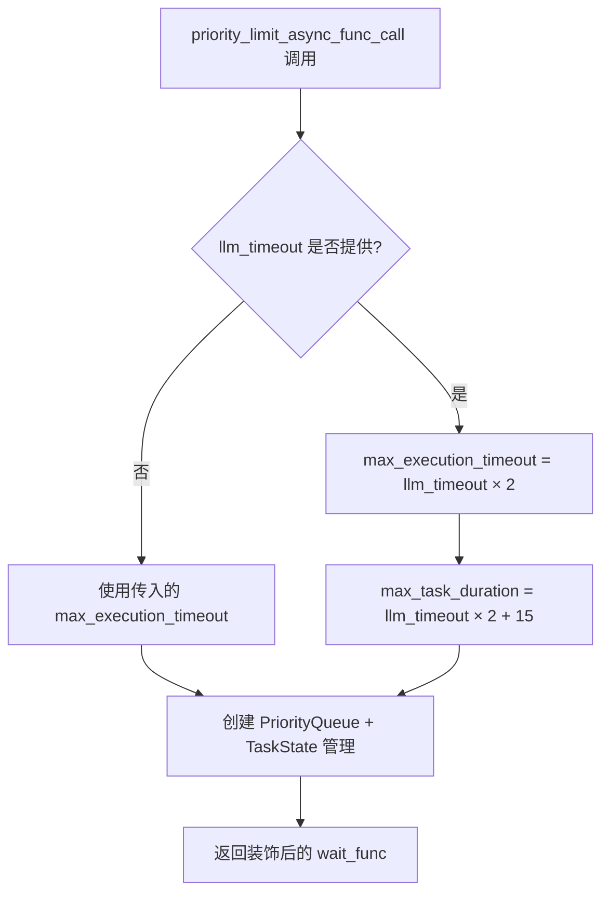
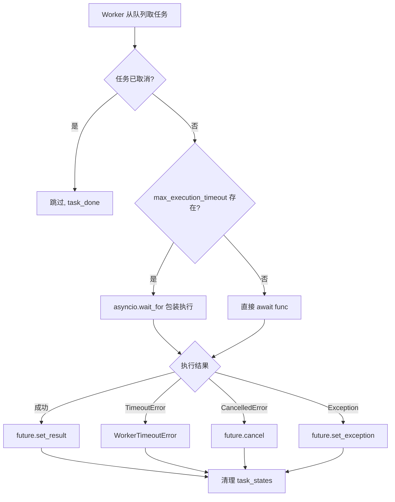
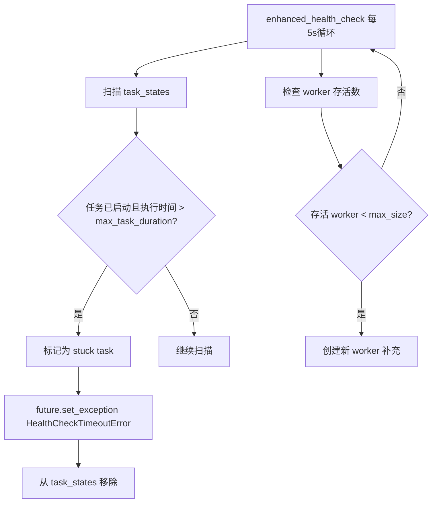

# PD-301.01 LightRAG — 优先级队列 + 多层超时异步并发限流

> 文档编号：PD-301.01
> 来源：LightRAG `lightrag/utils.py`, `lightrag/lightrag.py`, `lightrag/constants.py`
> GitHub：https://github.com/HKUDS/LightRAG.git
> 问题域：PD-301 异步并发限流 Async Concurrency Throttling
> 状态：可复用方案

---

## 第 1 章 问题与动机

### 1.1 核心问题

RAG 系统在知识图谱构建和查询阶段需要大量调用 LLM 和 Embedding API。这些 API 通常有并发限制（rate limit）和响应延迟不确定性。如果不加控制地并发调用：

1. **API 过载**：超出供应商并发限制导致 429 错误或账号封禁
2. **资源耗尽**：大量并发请求占满内存和连接池，导致 OOM 或连接超时
3. **卡死任务**：某些 LLM 调用可能因网络问题或模型过载而无限挂起，阻塞整个流水线
4. **优先级倒置**：查询请求（用户等待中）和后台索引请求（可延迟）共享同一队列，导致用户体验下降
5. **批量插入风暴**：一次性插入大量文档时，并行处理数量不受控，导致系统过载

LightRAG 面对的场景尤其复杂：它同时需要 LLM（实体提取、摘要生成、查询回答）和 Embedding（向量化）两类 API 调用，两者的延迟特征和并发容忍度完全不同。

### 1.2 LightRAG 的解法概述

LightRAG 通过 `priority_limit_async_func_call` 装饰器实现了一套完整的异步并发限流体系：

1. **装饰器模式透明限流**：通过装饰器包装 LLM/Embedding 函数，调用方无需感知限流逻辑（`lightrag/utils.py:616`）
2. **优先级队列调度**：使用 `asyncio.PriorityQueue` 支持任务优先级，低值优先执行（`lightrag/utils.py:664`）
3. **三层超时保护**：Worker 执行超时 → 健康检查超时 → 用户级超时，层层兜底（`lightrag/utils.py:628-629`）
4. **差异化参数配置**：LLM 和 Embedding 使用不同的并发上限和超时阈值（`lightrag/constants.py:89-101`）
5. **文档插入信号量**：独立的 `asyncio.Semaphore` 控制并行文档处理数量（`lightrag/lightrag.py:1778`）

### 1.3 设计思想

| 设计原则 | 具体实现 | 理由 | 替代方案 |
|----------|----------|------|----------|
| 装饰器透明化 | `priority_limit_async_func_call` 包装原函数 | 调用方零改动，限流逻辑集中管理 | 在每个调用点手动加锁 |
| 动态超时计算 | 基于 `llm_timeout` 自动推导 worker/health check 超时 | 避免硬编码，适配不同模型延迟 | 固定超时值 |
| Worker 池模式 | N 个 worker 协程从队列取任务执行 | 精确控制并发数，避免 Semaphore 的优先级盲区 | asyncio.Semaphore |
| 健康检查守护 | 独立协程每 5s 扫描卡死任务 | 防止 worker 被永久阻塞 | 仅依赖 asyncio.wait_for |
| 双层并发控制 | API 调用用优先级队列，文档插入用 Semaphore | 不同粒度的并发需求用不同机制 | 统一用一种机制 |

---

## 第 2 章 源码实现分析

### 2.1 架构概览

LightRAG 的异步并发限流体系分为三层：

```
┌─────────────────────────────────────────────────────────────┐
│                    LightRAG.__post_init__                     │
│                                                               │
│  ┌─────────────────────┐    ┌──────────────────────────┐     │
│  │ LLM Model Function  │    │ Embedding Function       │     │
│  │ max_async=4          │    │ max_async=8              │     │
│  │ timeout=180s         │    │ timeout=30s              │     │
│  └────────┬────────────┘    └────────┬─────────────────┘     │
│           │                          │                        │
│           ▼                          ▼                        │
│  ┌─────────────────────────────────────────────────────┐     │
│  │       priority_limit_async_func_call 装饰器          │     │
│  │                                                       │     │
│  │  ┌──────────────┐  ┌──────────┐  ┌───────────────┐  │     │
│  │  │ PriorityQueue│→ │ Worker×N │→ │ Health Check  │  │     │
│  │  │ (max=1000)   │  │ (并发池) │  │ (5s 轮询)     │  │     │
│  │  └──────────────┘  └──────────┘  └───────────────┘  │     │
│  │                                                       │     │
│  │  超时层级: LLM → Worker(2×LLM) → HealthCheck(2×LLM+15)│   │
│  └─────────────────────────────────────────────────────┘     │
│                                                               │
│  ┌─────────────────────────────────────────────────────┐     │
│  │       文档插入并发控制 (asyncio.Semaphore)            │     │
│  │       max_parallel_insert=2                           │     │
│  └─────────────────────────────────────────────────────┘     │
└─────────────────────────────────────────────────────────────┘
```

### 2.2 核心实现

#### 2.2.1 装饰器入口与动态超时计算



对应源码 `lightrag/utils.py:616-676`：

```python
def priority_limit_async_func_call(
    max_size: int,
    llm_timeout: float = None,
    max_execution_timeout: float = None,
    max_task_duration: float = None,
    max_queue_size: int = 1000,
    cleanup_timeout: float = 2.0,
    queue_name: str = "limit_async",
):
    def final_decro(func):
        if not callable(func):
            raise TypeError(f"Expected a callable object, got {type(func)}")

        # Dynamic Timeout Calculation
        if llm_timeout is not None:
            nonlocal max_execution_timeout, max_task_duration
            if max_execution_timeout is None:
                max_execution_timeout = llm_timeout * 2
            if max_task_duration is None:
                max_task_duration = llm_timeout * 2 + 15

        queue = asyncio.PriorityQueue(maxsize=max_queue_size)
        tasks = set()
        initialization_lock = asyncio.Lock()
        counter = 0
        shutdown_event = asyncio.Event()
        initialized = False
        worker_health_check_task = None

        # Enhanced task state management
        task_states = {}  # task_id -> TaskState
        task_states_lock = asyncio.Lock()
        active_futures = weakref.WeakSet()
        reinit_count = 0
```

关键设计点：
- `max_queue_size=1000` 防止内存溢出（`utils.py:621`）
- `weakref.WeakSet` 追踪活跃 Future，避免内存泄漏（`utils.py:675`）
- `reinit_count` 支持 worker 系统重新初始化（`utils.py:676`）

#### 2.2.2 Worker 执行与三层超时保护



对应源码 `lightrag/utils.py:678-768`：

```python
async def worker():
    """Enhanced worker that processes tasks with proper timeout and state management"""
    try:
        while not shutdown_event.is_set():
            try:
                try:
                    (priority, count, task_id, args, kwargs) = await asyncio.wait_for(
                        queue.get(), timeout=1.0
                    )
                except asyncio.TimeoutError:
                    continue

                async with task_states_lock:
                    if task_id not in task_states:
                        queue.task_done()
                        continue
                    task_state = task_states[task_id]
                    task_state.worker_started = True
                    task_state.execution_start_time = asyncio.get_event_loop().time()

                if task_state.cancellation_requested or task_state.future.cancelled():
                    async with task_states_lock:
                        task_states.pop(task_id, None)
                    queue.task_done()
                    continue

                try:
                    if max_execution_timeout is not None:
                        result = await asyncio.wait_for(
                            func(*args, **kwargs), timeout=max_execution_timeout
                        )
                    else:
                        result = await func(*args, **kwargs)

                    if not task_state.future.done():
                        task_state.future.set_result(result)
                except asyncio.TimeoutError:
                    if not task_state.future.done():
                        task_state.future.set_exception(
                            WorkerTimeoutError(max_execution_timeout, "execution")
                        )
```

三层超时的层级关系：

| 层级 | 超时值 | 触发者 | 作用 |
|------|--------|--------|------|
| Layer 1: Worker 执行超时 | `llm_timeout × 2` | `asyncio.wait_for` in worker | 单次函数调用的硬超时 |
| Layer 2: Health Check 超时 | `llm_timeout × 2 + 15` | `enhanced_health_check` 协程 | 检测卡死任务并强制清理 |
| Layer 3: 用户级超时 | 调用方传入 `_timeout` | `wait_func` 中的 `asyncio.wait_for` | 调用方可自定义等待上限 |

#### 2.2.3 健康检查与卡死任务恢复



对应源码 `lightrag/utils.py:770-837`：

```python
async def enhanced_health_check():
    """Enhanced health check with stuck task detection and recovery"""
    try:
        while not shutdown_event.is_set():
            await asyncio.sleep(5)  # Check every 5 seconds
            current_time = asyncio.get_event_loop().time()

            if max_task_duration is not None:
                stuck_tasks = []
                async with task_states_lock:
                    for task_id, task_state in list(task_states.items()):
                        if (task_state.worker_started
                            and task_state.execution_start_time is not None
                            and current_time - task_state.execution_start_time > max_task_duration):
                            stuck_tasks.append((task_id, current_time - task_state.execution_start_time))

                for task_id, execution_duration in stuck_tasks:
                    logger.warning(f"{queue_name}: Detected stuck task {task_id}")
                    async with task_states_lock:
                        if task_id in task_states:
                            task_state = task_states[task_id]
                            if not task_state.future.done():
                                task_state.future.set_exception(
                                    HealthCheckTimeoutError(max_task_duration, execution_duration))
                            task_states.pop(task_id, None)

            # Worker recovery: replace dead workers
            current_tasks = set(tasks)
            done_tasks = {t for t in current_tasks if t.done()}
            tasks.difference_update(done_tasks)
            workers_needed = max_size - len(tasks)
            if workers_needed > 0:
                for _ in range(workers_needed):
                    task = asyncio.create_task(worker())
                    tasks.add(task)
                    task.add_done_callback(tasks.discard)
```

### 2.3 实现细节

#### 差异化配置：LLM vs Embedding

LightRAG 在 `__post_init__` 中为两类 API 分别应用装饰器（`lightrag/lightrag.py:553-674`）：

```python
# Embedding: max_async=8, timeout=30s
wrapped_func = priority_limit_async_func_call(
    self.embedding_func_max_async,          # 默认 8
    llm_timeout=self.default_embedding_timeout,  # 默认 30s
    queue_name="Embedding func",
)(self.embedding_func.func)

# LLM: max_async=4, timeout=180s
self.llm_model_func = priority_limit_async_func_call(
    self.llm_model_max_async,               # 默认 4
    llm_timeout=self.default_llm_timeout,    # 默认 180s
    queue_name="LLM func",
)(partial(self.llm_model_func, hashing_kv=hashing_kv, **self.llm_model_kwargs))
```

默认常量定义（`lightrag/constants.py:88-101`）：

| 参数 | LLM | Embedding | 说明 |
|------|-----|-----------|------|
| max_async | 4 | 8 | Embedding 更轻量，可更高并发 |
| timeout | 180s | 30s | LLM 生成耗时远高于 Embedding |
| worker 超时 | 360s | 60s | 2× 基础超时 |
| health check 超时 | 375s | 75s | 2× 基础超时 + 15s |

#### 文档插入 Semaphore 限流

对于批量文档插入场景，LightRAG 使用独立的 `asyncio.Semaphore`（`lightrag/lightrag.py:1778`）：

```python
semaphore = asyncio.Semaphore(self.max_parallel_insert)  # 默认 2

async def process_document(doc_id, status_doc, ..., semaphore):
    async with semaphore:
        # 处理单个文档：分块 → 实体提取 → 向量化 → 存储
        ...
```

这与 API 调用的优先级队列形成双层控制：外层 Semaphore 限制同时处理的文档数，内层优先级队列限制每个文档处理过程中的 API 并发数。

#### TaskState 状态追踪

`TaskState` 数据类（`lightrag/utils.py:398-407`）追踪每个任务的完整生命周期：

```python
@dataclass
class TaskState:
    future: asyncio.Future       # 结果 Future
    start_time: float            # 入队时间
    execution_start_time: float = None  # Worker 开始执行时间
    worker_started: bool = False        # Worker 是否已开始
    cancellation_requested: bool = False # 是否请求取消
    cleanup_done: bool = False          # 清理是否完成
```

`execution_start_time` 与 `start_time` 分离是关键设计：健康检查只对已开始执行的任务计时，避免误杀队列中等待的任务。

---

## 第 3 章 迁移指南

### 3.1 迁移清单

**阶段 1：核心限流装饰器（必须）**

- [ ] 复制 `TaskState` 数据类和异常类（`QueueFullError`, `WorkerTimeoutError`, `HealthCheckTimeoutError`）
- [ ] 复制 `priority_limit_async_func_call` 装饰器函数
- [ ] 配置 `max_size`（并发上限）和 `llm_timeout`（基础超时）

**阶段 2：差异化配置（推荐）**

- [ ] 为不同类型的 API 调用设置不同的并发和超时参数
- [ ] 通过环境变量支持运行时调整（`MAX_ASYNC`, `LLM_TIMEOUT` 等）

**阶段 3：批量处理限流（按需）**

- [ ] 为批量操作添加 `asyncio.Semaphore` 控制
- [ ] 配置 `max_parallel_insert` 参数

### 3.2 适配代码模板

以下是一个可直接复用的精简版限流装饰器：

```python
import asyncio
import weakref
from dataclasses import dataclass, field
from functools import wraps
from typing import Any


@dataclass
class TaskState:
    """任务状态追踪"""
    future: asyncio.Future
    start_time: float
    execution_start_time: float | None = None
    worker_started: bool = False
    cancellation_requested: bool = False


class WorkerTimeoutError(Exception):
    def __init__(self, timeout_value: float):
        super().__init__(f"Worker execution timeout after {timeout_value}s")


class HealthCheckTimeoutError(Exception):
    def __init__(self, timeout_value: float, actual: float):
        super().__init__(f"Task stuck for {actual:.1f}s (limit: {timeout_value}s)")


def async_throttle(
    max_concurrency: int,
    base_timeout: float = 60.0,
    max_queue_size: int = 1000,
    queue_name: str = "throttle",
):
    """
    异步并发限流装饰器（从 LightRAG 提炼的可复用版本）

    Args:
        max_concurrency: 最大并发数
        base_timeout: 基础超时（秒），worker 超时 = 2x，health check 超时 = 2x + 15
        max_queue_size: 队列最大容量
        queue_name: 队列名称（用于日志）
    """
    worker_timeout = base_timeout * 2
    health_check_timeout = base_timeout * 2 + 15

    def decorator(func):
        queue = asyncio.PriorityQueue(maxsize=max_queue_size)
        tasks: set[asyncio.Task] = set()
        task_states: dict[str, TaskState] = {}
        task_states_lock = asyncio.Lock()
        active_futures: weakref.WeakSet = weakref.WeakSet()
        shutdown_event = asyncio.Event()
        init_lock = asyncio.Lock()
        initialized = False
        counter = 0

        async def _worker():
            while not shutdown_event.is_set():
                try:
                    priority, count, task_id, args, kwargs = await asyncio.wait_for(
                        queue.get(), timeout=1.0
                    )
                except asyncio.TimeoutError:
                    continue

                async with task_states_lock:
                    if task_id not in task_states:
                        queue.task_done()
                        continue
                    state = task_states[task_id]
                    state.worker_started = True
                    state.execution_start_time = asyncio.get_event_loop().time()

                if state.cancellation_requested or state.future.cancelled():
                    async with task_states_lock:
                        task_states.pop(task_id, None)
                    queue.task_done()
                    continue

                try:
                    result = await asyncio.wait_for(
                        func(*args, **kwargs), timeout=worker_timeout
                    )
                    if not state.future.done():
                        state.future.set_result(result)
                except asyncio.TimeoutError:
                    if not state.future.done():
                        state.future.set_exception(WorkerTimeoutError(worker_timeout))
                except Exception as e:
                    if not state.future.done():
                        state.future.set_exception(e)
                finally:
                    async with task_states_lock:
                        task_states.pop(task_id, None)
                    queue.task_done()

        async def _health_check():
            while not shutdown_event.is_set():
                await asyncio.sleep(5)
                now = asyncio.get_event_loop().time()
                stuck = []
                async with task_states_lock:
                    for tid, st in list(task_states.items()):
                        if (st.worker_started and st.execution_start_time
                                and now - st.execution_start_time > health_check_timeout):
                            stuck.append((tid, now - st.execution_start_time))
                for tid, dur in stuck:
                    async with task_states_lock:
                        if tid in task_states:
                            st = task_states[tid]
                            if not st.future.done():
                                st.future.set_exception(
                                    HealthCheckTimeoutError(health_check_timeout, dur))
                            task_states.pop(tid, None)
                # Worker recovery
                done = {t for t in tasks if t.done()}
                tasks.difference_update(done)
                for _ in range(max_concurrency - len(tasks)):
                    t = asyncio.create_task(_worker())
                    tasks.add(t)
                    t.add_done_callback(tasks.discard)

        async def _ensure_workers():
            nonlocal initialized
            if initialized:
                return
            async with init_lock:
                if initialized:
                    return
                for _ in range(max_concurrency):
                    t = asyncio.create_task(_worker())
                    tasks.add(t)
                    t.add_done_callback(tasks.discard)
                asyncio.create_task(_health_check())
                initialized = True

        @wraps(func)
        async def wrapper(*args, _priority=10, _timeout=None, **kwargs):
            await _ensure_workers()
            nonlocal counter
            task_id = f"{id(asyncio.current_task())}_{asyncio.get_event_loop().time()}"
            future = asyncio.Future()
            state = TaskState(future=future, start_time=asyncio.get_event_loop().time())
            async with task_states_lock:
                task_states[task_id] = state
            active_futures.add(future)
            async with init_lock:
                c = counter
                counter += 1
            await queue.put((_priority, c, task_id, args, kwargs))
            try:
                if _timeout:
                    return await asyncio.wait_for(future, _timeout)
                return await future
            except asyncio.TimeoutError:
                async with task_states_lock:
                    if task_id in task_states:
                        task_states[task_id].cancellation_requested = True
                if not future.done():
                    future.cancel()
                raise
            finally:
                active_futures.discard(future)
                async with task_states_lock:
                    task_states.pop(task_id, None)

        return wrapper
    return decorator


# 使用示例
@async_throttle(max_concurrency=4, base_timeout=180, queue_name="LLM")
async def call_llm(prompt: str, model: str = "gpt-4o") -> str:
    """LLM 调用会被自动限流"""
    # 实际 API 调用逻辑
    ...

@async_throttle(max_concurrency=8, base_timeout=30, queue_name="Embedding")
async def call_embedding(texts: list[str]) -> list[list[float]]:
    """Embedding 调用使用更高并发和更短超时"""
    ...

# 带优先级调用
result = await call_llm("query", _priority=1)   # 高优先级
result = await call_llm("index", _priority=20)  # 低优先级
```

### 3.3 适用场景

| 场景 | 适用度 | 说明 |
|------|--------|------|
| RAG 系统 LLM/Embedding 调用 | ⭐⭐⭐ | 完美匹配，LightRAG 的原生场景 |
| 多 Agent 编排中的 LLM 调用 | ⭐⭐⭐ | 优先级队列可区分不同 Agent 的紧急程度 |
| 批量数据处理流水线 | ⭐⭐⭐ | Semaphore + 优先级队列双层控制 |
| 单一 API 简单限流 | ⭐⭐ | 过于复杂，简单场景用 Semaphore 即可 |
| 需要精确 QPS 控制 | ⭐ | 本方案控制并发数而非 QPS，需额外加令牌桶 |

---

## 第 4 章 测试用例

```python
import asyncio
import pytest
import time


class TestAsyncThrottle:
    """测试异步限流装饰器核心功能"""

    @pytest.mark.asyncio
    async def test_concurrency_limit(self):
        """验证并发数不超过 max_concurrency"""
        concurrent_count = 0
        max_observed = 0

        @async_throttle(max_concurrency=3, base_timeout=10)
        async def slow_task():
            nonlocal concurrent_count, max_observed
            concurrent_count += 1
            max_observed = max(max_observed, concurrent_count)
            await asyncio.sleep(0.1)
            concurrent_count -= 1
            return "done"

        results = await asyncio.gather(*[slow_task() for _ in range(10)])
        assert all(r == "done" for r in results)
        assert max_observed <= 3

    @pytest.mark.asyncio
    async def test_priority_ordering(self):
        """验证优先级队列：低值优先执行"""
        execution_order = []

        @async_throttle(max_concurrency=1, base_timeout=10)
        async def ordered_task(name: str):
            execution_order.append(name)
            await asyncio.sleep(0.05)
            return name

        # 先提交一个任务占住唯一 worker
        blocker = asyncio.create_task(ordered_task("blocker", _priority=10))
        await asyncio.sleep(0.01)  # 确保 blocker 开始执行

        # 提交不同优先级的任务
        tasks = [
            asyncio.create_task(ordered_task("low", _priority=20)),
            asyncio.create_task(ordered_task("high", _priority=1)),
            asyncio.create_task(ordered_task("medium", _priority=10)),
        ]
        await asyncio.gather(blocker, *tasks)
        # blocker 先完成，然后按优先级: high(1) → medium(10) → low(20)
        assert execution_order[0] == "blocker"
        assert execution_order[1] == "high"

    @pytest.mark.asyncio
    async def test_worker_timeout(self):
        """验证 Worker 超时触发 WorkerTimeoutError"""

        @async_throttle(max_concurrency=1, base_timeout=0.5)
        async def hanging_task():
            await asyncio.sleep(100)  # 模拟卡死

        with pytest.raises(TimeoutError):
            await hanging_task()

    @pytest.mark.asyncio
    async def test_user_level_timeout(self):
        """验证用户级 _timeout 参数"""

        @async_throttle(max_concurrency=1, base_timeout=60)
        async def slow_task():
            await asyncio.sleep(10)

        with pytest.raises(TimeoutError):
            await slow_task(_timeout=0.5)

    @pytest.mark.asyncio
    async def test_error_propagation(self):
        """验证函数异常正确传播"""

        @async_throttle(max_concurrency=2, base_timeout=10)
        async def failing_task():
            raise ValueError("test error")

        with pytest.raises(ValueError, match="test error"):
            await failing_task()

    @pytest.mark.asyncio
    async def test_semaphore_parallel_insert(self):
        """验证 Semaphore 限制并行文档处理"""
        concurrent = 0
        max_concurrent = 0

        async def process_doc(semaphore, doc_id):
            nonlocal concurrent, max_concurrent
            async with semaphore:
                concurrent += 1
                max_concurrent = max(max_concurrent, concurrent)
                await asyncio.sleep(0.05)
                concurrent -= 1

        semaphore = asyncio.Semaphore(2)
        await asyncio.gather(*[process_doc(semaphore, i) for i in range(8)])
        assert max_concurrent <= 2
```

---

## 第 5 章 跨域关联

| 关联域 | 关系类型 | 说明 |
|--------|----------|------|
| PD-03 容错与重试 | 协同 | 三层超时保护是容错体系的一部分；Worker 超时后可触发重试逻辑 |
| PD-01 上下文管理 | 依赖 | 并发限流影响 LLM 调用吞吐量，间接影响上下文窗口的使用效率 |
| PD-11 可观测性 | 协同 | 队列深度、Worker 存活数、卡死任务数是关键可观测指标；LightRAG 通过 logger 输出这些信息 |
| PD-08 搜索与检索 | 依赖 | Embedding 调用的并发限流直接影响向量检索的索引构建速度 |
| PD-02 多 Agent 编排 | 协同 | 优先级队列可为不同 Agent 的请求分配不同优先级，实现编排级别的资源调度 |

---

## 第 6 章 来源文件索引

| 文件 | 行范围 | 关键实现 |
|------|--------|----------|
| `lightrag/utils.py` | L398-L407 | `TaskState` 数据类定义 |
| `lightrag/utils.py` | L590-L613 | `QueueFullError`, `WorkerTimeoutError`, `HealthCheckTimeoutError` 异常类 |
| `lightrag/utils.py` | L616-L676 | `priority_limit_async_func_call` 装饰器入口与动态超时计算 |
| `lightrag/utils.py` | L678-L768 | Worker 协程实现与超时保护 |
| `lightrag/utils.py` | L770-L837 | `enhanced_health_check` 卡死任务检测与 Worker 恢复 |
| `lightrag/utils.py` | L840-L895 | `ensure_workers` 初始化与重初始化逻辑 |
| `lightrag/utils.py` | L897-L940 | `shutdown` 优雅关闭流程 |
| `lightrag/utils.py` | L942-L1058 | `wait_func` 调用方入口与用户级超时处理 |
| `lightrag/lightrag.py` | L296-L298 | `embedding_func_max_async` 配置（默认 8） |
| `lightrag/lightrag.py` | L344-L347 | `llm_model_max_async` 配置（默认 4） |
| `lightrag/lightrag.py` | L382-L385 | `max_parallel_insert` 配置（默认 2） |
| `lightrag/lightrag.py` | L553-L559 | Embedding 函数装饰器应用 |
| `lightrag/lightrag.py` | L664-L674 | LLM 函数装饰器应用 |
| `lightrag/lightrag.py` | L1778 | 文档插入 Semaphore 创建 |
| `lightrag/constants.py` | L88-L101 | 并发和超时默认常量定义 |

---

## 第 7 章 横向对比维度

```json comparison_data
{
  "project": "LightRAG",
  "dimensions": {
    "并发模型": "PriorityQueue + Worker 池，非 Semaphore",
    "超时策略": "三层动态超时：Worker(2×base) → HealthCheck(2×base+15) → User",
    "优先级支持": "asyncio.PriorityQueue 原生优先级，低值优先",
    "健康检查": "独立协程 5s 轮询检测卡死任务并自动恢复 Worker",
    "差异化配置": "LLM(4并发/180s) vs Embedding(8并发/30s) 独立参数",
    "批量控制": "文档插入用独立 Semaphore(默认2)，与 API 限流双层隔离"
  }
}
```

### 域元数据补充

```json domain_metadata
{
  "solution_summary": "LightRAG 用 PriorityQueue Worker 池 + 三层动态超时(Worker/HealthCheck/User)实现 LLM 与 Embedding 差异化异步限流",
  "description": "Worker 池模式相比 Semaphore 提供优先级调度和卡死任务自动恢复能力",
  "sub_problems": [
    "卡死任务检测与 Worker 自动恢复",
    "队列容量溢出防护",
    "Worker 系统优雅关闭与资源清理"
  ],
  "best_practices": [
    "基于 base_timeout 动态推导多层超时值避免硬编码",
    "execution_start_time 与 start_time 分离防止误杀排队任务",
    "weakref.WeakSet 追踪 Future 防止内存泄漏"
  ]
}
```
