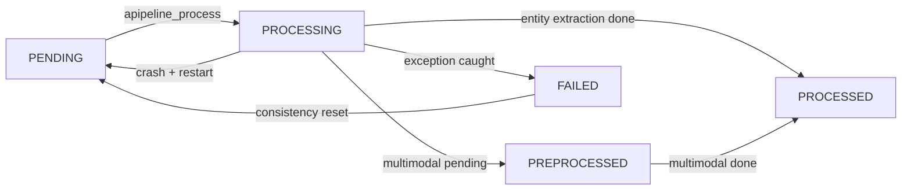
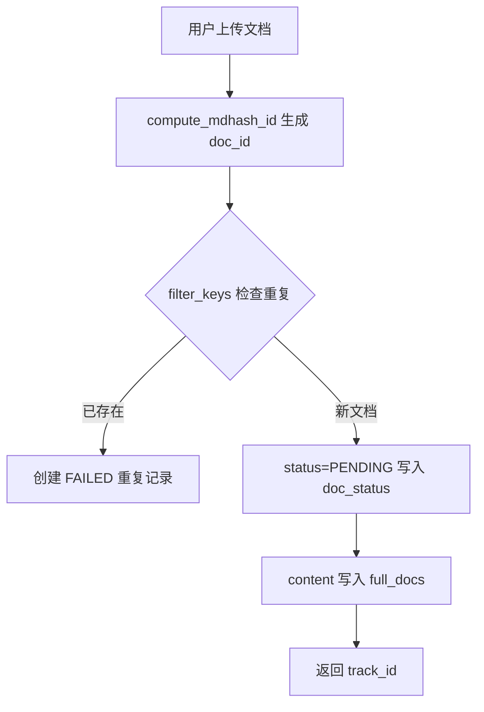
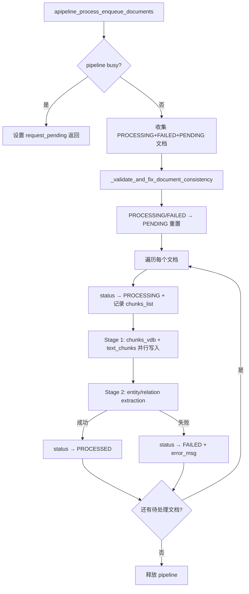

# PD-302.01 LightRAG — DocStatus 五态状态机与 KG 级联删除重建

> 文档编号：PD-302.01
> 来源：LightRAG `lightrag/base.py` `lightrag/kg/json_doc_status_impl.py` `lightrag/lightrag.py`
> GitHub：https://github.com/HKUDS/LightRAG.git
> 问题域：PD-302 文档生命周期管理 Document Lifecycle Management
> 状态：可复用方案

---

## 第 1 章 问题与动机

### 1.1 核心问题

RAG 系统中文档不是"放进去就完事"的静态资源。一个文档从上传到可被检索，需要经历文本提取、分块、实体关系抽取、向量化等多个阶段，任何一步都可能失败。更棘手的是删除——文档被切成 chunk 后散布在向量库、KV 存储、知识图谱等多个存储层，删除一个文档意味着要精确追踪并清理所有派生数据，同时保留与其他文档共享的实体和关系。

没有显式的生命周期管理，系统会面临：
- **僵尸文档**：处理中途崩溃的文档永远卡在中间状态
- **孤儿数据**：删除文档后 chunk、实体、关系残留在各存储层
- **重复处理**：无法区分已处理和待处理文档，导致重复消耗 LLM 调用
- **不可观测**：用户无法知道文档处于什么状态、处理到哪一步

### 1.2 LightRAG 的解法概述

LightRAG 实现了一套完整的文档生命周期管理方案：

1. **五态状态机**（`DocStatus` 枚举）：PENDING → PROCESSING → PREPROCESSED → PROCESSED / FAILED，每个状态转换都有明确的触发条件和数据一致性保证（`lightrag/base.py:705-712`）
2. **DocProcessingStatus 数据结构**：每个文档携带 content_summary、chunks_list、error_msg、track_id、metadata 等完整元数据，支持进度追踪和错误诊断（`lightrag/base.py:716-759`）
3. **Pipeline 并发控制**：通过 pipeline_status 共享状态 + asyncio.Lock 实现单 worker 处理队列，支持取消请求和批量删除的并发协调（`lightrag/lightrag.py:1642-1707`）
4. **级联删除与智能重建**：删除文档时自动分析受影响的实体和关系，仅属于该文档的直接删除，共享的则用剩余 chunk 重建描述（`lightrag/lightrag.py:3228-3374`）
5. **一致性自愈**：Pipeline 启动时自动检测并修复不一致状态——PROCESSING/FAILED 文档重置为 PENDING，缺少 full_docs 内容的孤儿记录被清理（`lightrag/lightrag.py:1515-1640`）

### 1.3 设计思想

| 设计原则 | 具体实现 | 理由 | 替代方案 |
|----------|----------|------|----------|
| 显式状态枚举 | `DocStatus(str, Enum)` 五个值 | str 枚举可直接 JSON 序列化，状态转换可读性强 | 整数状态码（不可读）、布尔标记组合（状态爆炸） |
| Chunk 列表关联 | `chunks_list: list[str]` 存在 DocProcessingStatus 中 | 删除时精确定位所有派生 chunk，无需全表扫描 | 反向索引表（额外存储开销）、全表扫描（O(n) 性能差） |
| Pipeline 互斥 | `pipeline_status["busy"]` + Lock | 防止多 worker 同时处理导致图谱数据竞争 | 分布式锁（复杂度高）、乐观锁（冲突频繁） |
| 删除时智能重建 | 区分 entities_to_delete 和 entities_to_rebuild | 保留跨文档共享知识，避免误删有价值的实体 | 全量重建（代价高）、直接删除（丢失共享知识） |
| 启动时自愈 | `_validate_and_fix_document_consistency` | 崩溃恢复无需人工干预，PROCESSING/FAILED 自动重试 | 手动修复（运维负担）、忽略不一致（数据腐化） |

---

## 第 2 章 源码实现分析

### 2.1 架构概览

LightRAG 的文档生命周期涉及三个核心层：

```
┌─────────────────────────────────────────────────────────────────┐
│                     API Layer (FastAPI)                          │
│  document_routes.py: upload / scan / delete / status endpoints  │
└──────────────────────────┬──────────────────────────────────────┘
                           │
┌──────────────────────────▼──────────────────────────────────────┐
│                   Core Engine (lightrag.py)                      │
│  apipeline_enqueue_documents()  ← 入队                          │
│  apipeline_process_enqueue_documents() ← 处理循环               │
│  adelete_by_doc_id()  ← 级联删除                                │
│  _validate_and_fix_document_consistency() ← 自愈                │
└──────────────────────────┬──────────────────────────────────────┘
                           │
┌──────────────────────────▼──────────────────────────────────────┐
│                  Storage Layer                                   │
│  DocStatusStorage (doc_status)  ← 状态追踪                      │
│  BaseKVStorage (full_docs)      ← 原文存储                      │
│  BaseKVStorage (text_chunks)    ← 分块存储                      │
│  BaseVectorStorage (chunks_vdb) ← 向量索引                      │
│  BaseGraphStorage (chunk_entity_relation_graph) ← 知识图谱      │
│  BaseKVStorage (full_entities / full_relations) ← 实体关系索引  │
└─────────────────────────────────────────────────────────────────┘
```

### 2.2 核心实现

#### 2.2.1 五态状态机定义



对应源码 `lightrag/base.py:705-759`：

```python
class DocStatus(str, Enum):
    """Document processing status"""
    PENDING = "pending"
    PROCESSING = "processing"
    PREPROCESSED = "preprocessed"
    PROCESSED = "processed"
    FAILED = "failed"

@dataclass
class DocProcessingStatus:
    """Document processing status data structure"""
    content_summary: str          # 前 100 字符预览
    content_length: int           # 文档总长度
    file_path: str                # 文件路径
    status: DocStatus             # 当前状态
    created_at: str               # ISO 时间戳
    updated_at: str               # 最后更新时间
    track_id: str | None = None   # 批次追踪 ID
    chunks_count: int | None = None
    chunks_list: list[str] | None = field(default_factory=list)  # chunk ID 列表
    error_msg: str | None = None  # 失败原因
    metadata: dict[str, Any] = field(default_factory=dict)
    multimodal_processed: bool | None = field(default=None, repr=False)

    def __post_init__(self):
        # PROCESSED + multimodal_processed=False → 降级为 PREPROCESSED
        if self.multimodal_processed is not None:
            if self.multimodal_processed is False and self.status == DocStatus.PROCESSED:
                self.status = DocStatus.PREPROCESSED
```

关键设计：`__post_init__` 中的状态降级逻辑——当文档文本处理完成但多模态处理未完成时，自动将 PROCESSED 降级为 PREPROCESSED，实现了两阶段处理的透明管理。

#### 2.2.2 文档入队与状态初始化



对应源码 `lightrag/lightrag.py:1350-1442`：

```python
# 文档入队：初始状态为 PENDING
new_docs: dict[str, Any] = {
    id_: {
        "status": DocStatus.PENDING,
        "content_summary": get_content_summary(content_data["content"]),
        "content_length": len(content_data["content"]),
        "created_at": datetime.now(timezone.utc).isoformat(),
        "updated_at": datetime.now(timezone.utc).isoformat(),
        "file_path": content_data["file_path"],
        "track_id": track_id,
    }
    for id_, content_data in contents.items()
}

# 重复文档检测：已存在的文档标记为 FAILED + is_duplicate 元数据
unique_new_doc_ids = await self.doc_status.filter_keys(all_new_doc_ids)
ignored_ids = list(all_new_doc_ids - unique_new_doc_ids)
if ignored_ids:
    for doc_id in ignored_ids:
        dup_record_id = compute_mdhash_id(f"{doc_id}-{track_id}", prefix="dup-")
        duplicate_docs[dup_record_id] = {
            "status": DocStatus.FAILED,
            "content_summary": f"[DUPLICATE] Original document: {doc_id}",
            "error_msg": f"Content already exists. Original doc_id: {doc_id}",
            "metadata": {"is_duplicate": True, "original_doc_id": doc_id},
        }
```

#### 2.2.3 Pipeline 处理循环与状态转换



对应源码 `lightrag/lightrag.py:1890-2065`，处理过程中的两阶段并行：

```python
# Stage 1: 并行写入 doc_status、chunks_vdb、text_chunks
doc_status_task = asyncio.create_task(
    self.doc_status.upsert({
        doc_id: {
            "status": DocStatus.PROCESSING,
            "chunks_count": len(chunks),
            "chunks_list": list(chunks.keys()),  # 关键：保存 chunk ID 列表
            ...
        }
    })
)
chunks_vdb_task = asyncio.create_task(self.chunks_vdb.upsert(chunks))
text_chunks_task = asyncio.create_task(self.text_chunks.upsert(chunks))
await asyncio.gather(doc_status_task, chunks_vdb_task, text_chunks_task)

# Stage 2: 实体关系抽取（依赖 text_chunks 已写入）
entity_relation_task = asyncio.create_task(
    self._process_extract_entities(chunks, pipeline_status, pipeline_status_lock)
)
chunk_results = await entity_relation_task

# 成功后标记 PROCESSED
await self.doc_status.upsert({
    doc_id: {
        "status": DocStatus.PROCESSED,
        "chunks_count": len(chunks),
        "chunks_list": list(chunks.keys()),
        ...
    }
})
```

### 2.3 实现细节

#### 一致性自愈机制

Pipeline 启动时调用 `_validate_and_fix_document_consistency`（`lightrag/lightrag.py:1515-1640`），执行两项修复：

1. **孤儿记录清理**：doc_status 中有记录但 full_docs 中无对应内容的文档，直接删除（FAILED 文档除外，保留错误信息供诊断）
2. **中断恢复**：PROCESSING 和 FAILED 状态的文档，如果 full_docs 中有内容，重置为 PENDING 重新处理

```python
# lightrag/lightrag.py:1599-1628
for doc_id, status_doc in to_process_docs.items():
    content_data = await self.full_docs.get_by_id(doc_id)
    if content_data:  # 内容存在 → 可重试
        if status_doc.status in [DocStatus.PROCESSING, DocStatus.FAILED]:
            docs_to_reset[doc_id] = {
                "status": DocStatus.PENDING,
                "error_msg": "",      # 清除错误信息
                "metadata": {},       # 清除处理元数据
                ...
            }
            status_doc.status = DocStatus.PENDING
```

#### JsonDocStatusStorage 的共享内存与锁机制

`JsonDocStatusStorage`（`lightrag/kg/json_doc_status_impl.py:30-408`）使用共享内存字典 + asyncio.Lock 实现多协程安全访问：

- `_data`：通过 `get_namespace_data` 获取的共享字典，多个 storage 实例共享同一份数据
- `_storage_lock`：通过 `get_namespace_lock` 获取的命名空间级锁
- `storage_updated`：脏标记，upsert 时设置，`index_done_callback` 时检查并持久化到 JSON 文件
- 写入时立即调用 `index_done_callback` 确保持久化（`json_doc_status_impl.py:207`）


---

## 第 3 章 迁移指南

### 3.1 迁移清单

**阶段 1：状态机基础（1-2 天）**
- [ ] 定义 `DocStatus` 枚举（至少 PENDING/PROCESSING/PROCESSED/FAILED 四态）
- [ ] 实现 `DocProcessingStatus` 数据类，包含 chunks_list、error_msg、track_id
- [ ] 实现 `DocStatusStorage` 抽象基类及 JSON/DB 实现
- [ ] 在文档入队时初始化状态为 PENDING

**阶段 2：Pipeline 处理循环（2-3 天）**
- [ ] 实现 pipeline_status 共享状态（busy、job_name、cancellation_requested）
- [ ] 实现处理循环：收集待处理文档 → 逐个处理 → 更新状态
- [ ] 处理成功时更新 chunks_list 并标记 PROCESSED
- [ ] 处理失败时记录 error_msg 并标记 FAILED
- [ ] 实现取消请求机制（cancellation_requested 标记）

**阶段 3：一致性自愈（1 天）**
- [ ] Pipeline 启动时检测 PROCESSING/FAILED 文档并重置为 PENDING
- [ ] 清理 doc_status 中无对应 full_docs 内容的孤儿记录
- [ ] 保留 FAILED 文档的错误信息供诊断

**阶段 4：级联删除（2-3 天）**
- [ ] 通过 chunks_list 定位文档的所有 chunk
- [ ] 分析受影响的实体和关系（区分独占 vs 共享）
- [ ] 独占实体/关系直接删除，共享的用剩余 chunk 重建
- [ ] 实现 pipeline 级并发控制防止删除与处理冲突

### 3.2 适配代码模板

以下是一个可直接复用的文档生命周期管理框架：

```python
from enum import Enum
from dataclasses import dataclass, field
from typing import Any, Optional
from datetime import datetime, timezone
import asyncio


class DocStatus(str, Enum):
    PENDING = "pending"
    PROCESSING = "processing"
    PROCESSED = "processed"
    FAILED = "failed"


@dataclass
class DocProcessingStatus:
    content_summary: str
    content_length: int
    file_path: str
    status: DocStatus
    created_at: str
    updated_at: str
    track_id: Optional[str] = None
    chunks_count: Optional[int] = None
    chunks_list: list[str] = field(default_factory=list)
    error_msg: Optional[str] = None
    metadata: dict[str, Any] = field(default_factory=dict)


class DocumentLifecycleManager:
    """文档生命周期管理器 — 从 LightRAG 提炼的可复用模式"""

    def __init__(self, doc_status_storage, content_storage, chunk_storage):
        self._doc_status = doc_status_storage
        self._content = content_storage
        self._chunks = chunk_storage
        self._pipeline_lock = asyncio.Lock()
        self._pipeline_busy = False

    async def enqueue(self, doc_id: str, content: str, file_path: str, track_id: str):
        """入队：PENDING 状态初始化"""
        now = datetime.now(timezone.utc).isoformat()
        await self._doc_status.upsert({
            doc_id: {
                "status": DocStatus.PENDING,
                "content_summary": content[:100],
                "content_length": len(content),
                "file_path": file_path,
                "track_id": track_id,
                "created_at": now,
                "updated_at": now,
            }
        })
        await self._content.upsert({doc_id: {"content": content, "file_path": file_path}})

    async def process_document(self, doc_id: str, process_fn):
        """处理单个文档：PENDING → PROCESSING → PROCESSED/FAILED"""
        now = datetime.now(timezone.utc).isoformat()
        doc = await self._doc_status.get_by_id(doc_id)
        if not doc:
            return

        # 转为 PROCESSING
        doc["status"] = DocStatus.PROCESSING
        doc["updated_at"] = now
        await self._doc_status.upsert({doc_id: doc})

        try:
            chunks = await process_fn(doc_id)
            # 成功 → PROCESSED，记录 chunks_list
            doc["status"] = DocStatus.PROCESSED
            doc["chunks_list"] = list(chunks.keys())
            doc["chunks_count"] = len(chunks)
            doc["updated_at"] = datetime.now(timezone.utc).isoformat()
            await self._doc_status.upsert({doc_id: doc})
        except Exception as e:
            # 失败 → FAILED，记录 error_msg
            doc["status"] = DocStatus.FAILED
            doc["error_msg"] = str(e)
            doc["updated_at"] = datetime.now(timezone.utc).isoformat()
            await self._doc_status.upsert({doc_id: doc})

    async def recover_on_startup(self):
        """启动时自愈：PROCESSING/FAILED → PENDING"""
        for status in [DocStatus.PROCESSING, DocStatus.FAILED]:
            docs = await self._doc_status.get_docs_by_status(status)
            for doc_id, doc in docs.items():
                content = await self._content.get_by_id(doc_id)
                if content:
                    doc.status = DocStatus.PENDING
                    doc.error_msg = ""
                    await self._doc_status.upsert({doc_id: vars(doc)})

    async def delete_document(self, doc_id: str):
        """级联删除：通过 chunks_list 精确清理所有派生数据"""
        doc = await self._doc_status.get_by_id(doc_id)
        if not doc:
            return {"status": "not_found"}

        chunk_ids = set(doc.get("chunks_list", []))
        # 1. 删除 chunks
        if chunk_ids:
            await self._chunks.delete(list(chunk_ids))
        # 2. 删除原文
        await self._content.delete([doc_id])
        # 3. 删除状态记录
        await self._doc_status.delete([doc_id])
        return {"status": "success", "chunks_deleted": len(chunk_ids)}
```

### 3.3 适用场景

| 场景 | 适用度 | 说明 |
|------|--------|------|
| RAG 系统文档管理 | ⭐⭐⭐ | 完美匹配：多阶段处理 + 知识图谱级联删除 |
| ETL 数据管道 | ⭐⭐⭐ | 状态机 + 自愈机制可直接复用 |
| 文件处理服务 | ⭐⭐ | 状态追踪有用，但级联删除部分可能不需要 |
| 实时流处理 | ⭐ | 状态机粒度太粗，流处理需要更细粒度的 checkpoint |

---

## 第 4 章 测试用例

```python
import pytest
import asyncio
from datetime import datetime, timezone
from unittest.mock import AsyncMock, MagicMock


class TestDocStatus:
    """测试 DocStatus 枚举和 DocProcessingStatus 数据结构"""

    def test_status_enum_values(self):
        assert DocStatus.PENDING.value == "pending"
        assert DocStatus.PROCESSING.value == "processing"
        assert DocStatus.PREPROCESSED.value == "preprocessed"
        assert DocStatus.PROCESSED.value == "processed"
        assert DocStatus.FAILED.value == "failed"

    def test_status_is_str_enum(self):
        """str 枚举可直接 JSON 序列化"""
        import json
        data = {"status": DocStatus.PROCESSED}
        serialized = json.dumps(data)
        assert '"processed"' in serialized

    def test_multimodal_status_downgrade(self):
        """multimodal_processed=False 时 PROCESSED 降级为 PREPROCESSED"""
        doc = DocProcessingStatus(
            content_summary="test",
            content_length=100,
            file_path="test.pdf",
            status=DocStatus.PROCESSED,
            created_at=datetime.now(timezone.utc).isoformat(),
            updated_at=datetime.now(timezone.utc).isoformat(),
            multimodal_processed=False,
        )
        assert doc.status == DocStatus.PREPROCESSED

    def test_no_downgrade_when_multimodal_done(self):
        """multimodal_processed=True 时保持 PROCESSED"""
        doc = DocProcessingStatus(
            content_summary="test",
            content_length=100,
            file_path="test.pdf",
            status=DocStatus.PROCESSED,
            created_at=datetime.now(timezone.utc).isoformat(),
            updated_at=datetime.now(timezone.utc).isoformat(),
            multimodal_processed=True,
        )
        assert doc.status == DocStatus.PROCESSED


class TestDocumentLifecycle:
    """测试文档生命周期状态转换"""

    @pytest.fixture
    def mock_storage(self):
        storage = AsyncMock()
        storage.get_by_id = AsyncMock(return_value=None)
        storage.upsert = AsyncMock()
        storage.delete = AsyncMock()
        storage.get_docs_by_status = AsyncMock(return_value={})
        storage.filter_keys = AsyncMock(side_effect=lambda keys: keys)
        return storage

    @pytest.mark.asyncio
    async def test_enqueue_sets_pending(self, mock_storage):
        """入队时状态应为 PENDING"""
        await mock_storage.upsert({
            "doc-123": {"status": DocStatus.PENDING, "file_path": "test.txt"}
        })
        call_args = mock_storage.upsert.call_args[0][0]
        assert call_args["doc-123"]["status"] == DocStatus.PENDING

    @pytest.mark.asyncio
    async def test_processing_records_chunks_list(self, mock_storage):
        """处理时应记录 chunks_list"""
        chunks = {"chunk-1": {}, "chunk-2": {}, "chunk-3": {}}
        doc_data = {
            "status": DocStatus.PROCESSING,
            "chunks_list": list(chunks.keys()),
            "chunks_count": len(chunks),
        }
        await mock_storage.upsert({"doc-123": doc_data})
        call_args = mock_storage.upsert.call_args[0][0]
        assert len(call_args["doc-123"]["chunks_list"]) == 3

    @pytest.mark.asyncio
    async def test_failed_records_error_msg(self, mock_storage):
        """失败时应记录 error_msg"""
        doc_data = {
            "status": DocStatus.FAILED,
            "error_msg": "LLM rate limit exceeded",
        }
        await mock_storage.upsert({"doc-123": doc_data})
        call_args = mock_storage.upsert.call_args[0][0]
        assert call_args["doc-123"]["error_msg"] == "LLM rate limit exceeded"

    @pytest.mark.asyncio
    async def test_consistency_reset_processing_to_pending(self, mock_storage):
        """一致性检查应将 PROCESSING 重置为 PENDING"""
        mock_storage.get_docs_by_status.return_value = {
            "doc-123": DocProcessingStatus(
                content_summary="test", content_length=100,
                file_path="test.txt", status=DocStatus.PROCESSING,
                created_at="2025-01-01T00:00:00Z",
                updated_at="2025-01-01T00:00:00Z",
            )
        }
        # 模拟 full_docs 中有内容 → 应重置为 PENDING
        content_storage = AsyncMock()
        content_storage.get_by_id = AsyncMock(return_value={"content": "hello"})
        # 验证重置逻辑
        docs = await mock_storage.get_docs_by_status(DocStatus.PROCESSING)
        for doc_id, doc in docs.items():
            content = await content_storage.get_by_id(doc_id)
            if content:
                doc.status = DocStatus.PENDING
        assert docs["doc-123"].status == DocStatus.PENDING


class TestCascadeDeletion:
    """测试级联删除逻辑"""

    @pytest.mark.asyncio
    async def test_delete_removes_chunks_and_status(self):
        """删除文档应同时清理 chunks 和状态记录"""
        doc_status = AsyncMock()
        doc_status.get_by_id = AsyncMock(return_value={
            "status": "processed",
            "chunks_list": ["chunk-1", "chunk-2"],
            "file_path": "test.txt",
        })
        doc_status.delete = AsyncMock()
        full_docs = AsyncMock()
        full_docs.delete = AsyncMock()
        chunks = AsyncMock()
        chunks.delete = AsyncMock()

        # 执行删除
        doc_data = await doc_status.get_by_id("doc-123")
        chunk_ids = doc_data.get("chunks_list", [])
        await chunks.delete(chunk_ids)
        await full_docs.delete(["doc-123"])
        await doc_status.delete(["doc-123"])

        chunks.delete.assert_called_once_with(["chunk-1", "chunk-2"])
        full_docs.delete.assert_called_once_with(["doc-123"])
        doc_status.delete.assert_called_once_with(["doc-123"])

    @pytest.mark.asyncio
    async def test_delete_nonexistent_returns_not_found(self):
        """删除不存在的文档应返回 not_found"""
        doc_status = AsyncMock()
        doc_status.get_by_id = AsyncMock(return_value=None)
        result = await doc_status.get_by_id("nonexistent")
        assert result is None
```


---

## 第 5 章 跨域关联

| 关联域 | 关系类型 | 说明 |
|--------|----------|------|
| PD-03 容错与重试 | 协同 | 一致性自愈机制（PROCESSING/FAILED → PENDING 重置）本质上是容错恢复的一种实现，Pipeline 启动时自动重试失败文档 |
| PD-06 记忆持久化 | 依赖 | DocStatusStorage 是记忆持久化的一个特化场景——文档处理状态需要跨进程、跨重启持久化，JsonDocStatusStorage 用 JSON 文件 + 共享内存实现 |
| PD-08 搜索与检索 | 协同 | 文档生命周期直接影响检索质量——只有 PROCESSED 状态的文档才应被检索，删除时需要同步清理向量索引和知识图谱 |
| PD-11 可观测性 | 协同 | track_id 机制支持批次级进度追踪，pipeline_status 提供实时处理状态，history_messages 记录完整操作日志 |
| PD-02 多 Agent 编排 | 互斥 | LightRAG 的 Pipeline 采用单 worker 互斥模式（pipeline_status.busy），与多 Agent 并行编排的理念相反，但这是为了保证知识图谱操作的数据一致性 |

---

## 第 6 章 来源文件索引

| 文件 | 行范围 | 关键实现 |
|------|--------|----------|
| `lightrag/base.py` | L705-L712 | DocStatus 五态枚举定义 |
| `lightrag/base.py` | L716-L759 | DocProcessingStatus 数据结构，含 __post_init__ 多模态降级逻辑 |
| `lightrag/base.py` | L762-L823 | DocStatusStorage 抽象基类，定义分页查询、状态统计等接口 |
| `lightrag/base.py` | L835-L843 | DeletionResult 数据结构 |
| `lightrag/kg/json_doc_status_impl.py` | L30-L48 | JsonDocStatusStorage 初始化，workspace 隔离 + JSON 文件路径 |
| `lightrag/kg/json_doc_status_impl.py` | L49-L71 | initialize()：共享内存加载 + 命名空间锁 |
| `lightrag/kg/json_doc_status_impl.py` | L161-L207 | index_done_callback + upsert：脏标记检查 + 立即持久化 |
| `lightrag/kg/json_doc_status_impl.py` | L227-L322 | get_docs_paginated：内存排序 + 分页，支持拼音排序 |
| `lightrag/kg/json_doc_status_impl.py` | L338-L359 | delete：批量删除 + 脏标记设置 |
| `lightrag/lightrag.py` | L1350-L1442 | apipeline_enqueue_documents：文档入队 + 重复检测 |
| `lightrag/lightrag.py` | L1444-L1513 | apipeline_enqueue_error_documents：错误文件记录 |
| `lightrag/lightrag.py` | L1515-L1640 | _validate_and_fix_document_consistency：一致性自愈 |
| `lightrag/lightrag.py` | L1642-L1789 | apipeline_process_enqueue_documents：处理循环主逻辑 |
| `lightrag/lightrag.py` | L1890-L2065 | 两阶段并行处理：chunks 写入 → 实体关系抽取 |
| `lightrag/lightrag.py` | L2989-L3031 | adelete_by_doc_id：级联删除入口 + 并发控制设计文档 |
| `lightrag/lightrag.py` | L3088-L3172 | 删除流程：状态检查 + 无 chunk 文档快速删除 |
| `lightrag/lightrag.py` | L3228-L3374 | 级联删除核心：实体/关系分析（delete vs rebuild） |
| `lightrag/api/routers/document_routes.py` | L1792-L1836 | background_delete_documents：批量删除 + pipeline 状态管理 |

---

## 第 7 章 横向对比维度

> **重要：** 本章用于自动填充 Butcher Wiki 的横向对比表。

```json comparison_data
{
  "project": "LightRAG",
  "dimensions": {
    "状态机设计": "DocStatus(str,Enum) 五态：PENDING→PROCESSING→PREPROCESSED→PROCESSED/FAILED，__post_init__ 多模态降级",
    "处理进度追踪": "track_id 批次追踪 + pipeline_status 共享状态 + history_messages 操作日志",
    "错误恢复": "Pipeline 启动时 _validate_and_fix_document_consistency 自动将 PROCESSING/FAILED 重置为 PENDING",
    "删除与重建": "chunks_list 精确定位 → 区分独占/共享实体 → 独占删除、共享用剩余 chunk LLM 重建",
    "并发控制": "pipeline_status.busy 单 worker 互斥 + job_name 验证防止删除与处理冲突",
    "存储抽象": "DocStatusStorage 抽象基类 + JsonDocStatusStorage 共享内存实现，支持多后端切换"
  }
}
```

### 域元数据补充

```json domain_metadata
{
  "solution_summary": "LightRAG 用 DocStatus(str,Enum) 五态状态机 + chunks_list 关联实现文档全生命周期管理，删除时区分独占/共享实体进行 KG 级联删除或 LLM 重建",
  "description": "文档从入队到可检索的多阶段处理管道，含崩溃恢复与知识图谱一致性维护",
  "sub_problems": [
    "多模态两阶段处理（PREPROCESSED 中间态）",
    "重复文档检测与去重记录",
    "Pipeline 单 worker 互斥与取消请求协调",
    "删除时共享实体的 LLM 重建"
  ],
  "best_practices": [
    "str 枚举可直接 JSON 序列化，避免状态值转换开销",
    "Pipeline 启动时自动自愈，PROCESSING/FAILED 重置为 PENDING",
    "删除操作通过 job_name 验证防止与处理任务冲突",
    "DocProcessingStatus.__post_init__ 实现透明的多模态状态降级"
  ]
}
```

