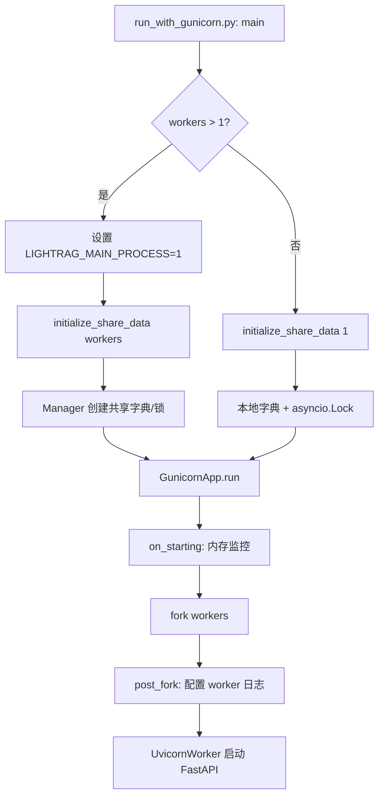
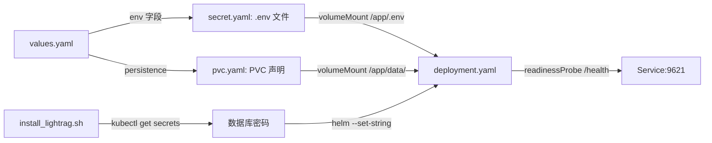

# PD-303.01 LightRAG — 三级容器化部署与 Gunicorn 多进程编排

> 文档编号：PD-303.01
> 来源：LightRAG `Dockerfile`, `Dockerfile.lite`, `docker-compose.yml`, `k8s-deploy/`, `lightrag/api/gunicorn_config.py`
> GitHub：https://github.com/HKUDS/LightRAG.git
> 问题域：PD-303 容器化部署 Containerized Deployment
> 状态：可复用方案

---

## 第 1 章 问题与动机

### 1.1 核心问题

RAG 系统的容器化部署面临三个层次的挑战：

1. **镜像体积与构建效率** — RAG 系统依赖 Python ML 生态（tiktoken、numpy、torch 等），全量安装可达数 GB，需要精细的多阶段构建和缓存策略
2. **多 worker 进程管理** — RAG 的知识图谱和向量索引需要在多个 worker 间共享，fork 模式下的内存共享和锁同步是核心难题
3. **有状态服务编排** — RAG 依赖 PostgreSQL、Neo4j、向量数据库等多个有状态后端，K8s 部署需要编排数据库生命周期和凭据传递

### 1.2 LightRAG 的解法概述

LightRAG 提供 Docker → Docker Compose → Kubernetes 三级递进部署方案：

1. **双 Dockerfile 策略** — `Dockerfile`（full，含 offline 离线推理依赖）和 `Dockerfile.lite`（仅 API 依赖），通过 uv 锁文件和 BuildKit cache mount 实现依赖层缓存（`Dockerfile:46-47`）
2. **三阶段多阶段构建** — frontend-builder（Bun 构建 WebUI）→ builder（uv 安装 Python 依赖 + tiktoken 预热）→ final（精简运行时），将构建工具链排除在最终镜像外（`Dockerfile:4-64`）
3. **Gunicorn preload + shared_storage** — 主进程通过 `preload_app=True` 在 fork 前初始化共享数据，`multiprocessing.Manager` 提供跨进程字典和锁（`gunicorn_config.py:32`, `shared_storage.py:1222-1264`）
4. **Helm Chart + KubeBlocks 数据库编排** — K8s 部署通过 Helm Chart 管理 LightRAG 本体，KubeBlocks 管理 PostgreSQL/Neo4j/Redis 等数据库集群，脚本自动提取 Secret 凭据（`install_lightrag.sh:41-53`）
5. **平台兼容性防护** — macOS 下 Gunicorn 多 worker 模式的 fork 安全检测，DOCLING 引擎与 PyTorch 的 fork 不兼容检测（`run_with_gunicorn.py:51-110`）

### 1.3 设计思想

| 设计原则 | 具体实现 | 理由 | 替代方案 |
|----------|----------|------|----------|
| 渐进式部署 | Docker → Compose → K8s 三级 | 降低入门门槛，按需升级 | 仅提供 K8s 方案 |
| 构建缓存最大化 | uv lock + BuildKit cache mount | Python 依赖层变化少时跳过重建 | pip install 无缓存 |
| 预热离线资源 | tiktoken cache 在构建时下载 | 运行时无需外网访问 | 运行时懒加载 |
| fork 前共享初始化 | Gunicorn preload_app | 所有 worker 共享同一份初始化数据 | 每个 worker 独立初始化 |
| 数据库即代码 | KubeBlocks Helm addon | 数据库集群声明式管理 | 手动部署数据库 |

---

## 第 2 章 源码实现分析

### 2.1 架构概览

LightRAG 的容器化部署架构分为三层：

```
┌─────────────────────────────────────────────────────────────────┐
│                    Kubernetes (k8s-deploy/)                      │
│  ┌──────────────┐  ┌──────────────┐  ┌──────────────────────┐  │
│  │  Helm Chart  │  │  KubeBlocks  │  │  install_lightrag.sh │  │
│  │  (lightrag/) │  │  (databases/)│  │  (凭据提取+编排)      │  │
│  └──────┬───────┘  └──────┬───────┘  └──────────┬───────────┘  │
│         │                 │                      │              │
│  ┌──────▼─────────────────▼──────────────────────▼───────┐     │
│  │              Docker Compose (docker-compose.yml)        │     │
│  │  volumes: rag_storage, inputs, config.ini, .env         │     │
│  │  extra_hosts: host.docker.internal                      │     │
│  └──────────────────────┬──────────────────────────────────┘     │
│                         │                                        │
│  ┌──────────────────────▼──────────────────────────────────┐     │
│  │              Docker Image (Dockerfile / Dockerfile.lite) │     │
│  │  Stage 1: frontend-builder (Bun → WebUI)                │     │
│  │  Stage 2: builder (uv → Python deps + tiktoken)         │     │
│  │  Stage 3: final (python:3.12-slim + venv + app)         │     │
│  └──────────────────────┬──────────────────────────────────┘     │
│                         │                                        │
│  ┌──────────────────────▼──────────────────────────────────┐     │
│  │              Gunicorn + Uvicorn Workers                   │     │
│  │  Master: preload_app → initialize_share_data(N)          │     │
│  │  Worker 1: UvicornWorker (FastAPI)                       │     │
│  │  Worker 2: UvicornWorker (FastAPI)                       │     │
│  │  ...                                                     │     │
│  └──────────────────────────────────────────────────────────┘     │
└─────────────────────────────────────────────────────────────────┘
```

### 2.2 核心实现

#### 2.2.1 三阶段 Dockerfile 构建

```mermaid
graph TD
    A[frontend-builder: oven/bun:1] -->|bun build| B[WebUI 静态资源]
    C[builder: uv:python3.12-bookworm-slim] -->|uv sync --frozen| D[Python 依赖 .venv]
    C -->|Rust toolchain| D
    B -->|COPY --from| D
    D -->|lightrag-download-cache| E[tiktoken 预热缓存]
    D -->|COPY --from| F[final: python:3.12-slim]
    E -->|COPY --from| F
    F -->|mkdir| G[/app/data/rag_storage, inputs, tiktoken]
    G --> H[ENTRYPOINT: lightrag_server]
```

对应源码 `Dockerfile:1-107`：

```python
# Stage 1: 前端构建 — 使用 Bun 而非 Node 加速
FROM oven/bun:1 AS frontend-builder
RUN cd lightrag_webui && bun install --frozen-lockfile && bun run build

# Stage 2: Python 依赖 — uv 替代 pip，BuildKit cache mount 加速
FROM ghcr.io/astral-sh/uv:python3.12-bookworm-slim AS builder
ENV UV_COMPILE_BYTECODE=1
# 先安装依赖（利用 Docker 层缓存），再拷贝源码
RUN --mount=type=cache,target=/root/.local/share/uv \
    uv sync --frozen --no-dev --extra api --extra offline --no-install-project --no-editable
COPY lightrag/ ./lightrag/
# tiktoken 预热：构建时下载 tokenizer 数据，避免运行时网络依赖
RUN mkdir -p /app/data/tiktoken \
    && uv run lightrag-download-cache --cache-dir /app/data/tiktoken

# Stage 3: 精简运行时
FROM python:3.12-slim
COPY --from=builder /app/.venv /app/.venv
COPY --from=builder /app/data/tiktoken /app/data/tiktoken
ENV TIKTOKEN_CACHE_DIR=/app/data/tiktoken
```

`Dockerfile.lite` 与 `Dockerfile` 的关键差异在于 `--extra offline` 的有无（`Dockerfile:47` vs `Dockerfile.lite:47`），lite 版不包含离线推理依赖（如 PyTorch），镜像体积显著更小。

#### 2.2.2 Gunicorn 多 worker 共享数据初始化



对应源码 `run_with_gunicorn.py:267-278` 和 `shared_storage.py:1176-1264`：

```python
# run_with_gunicorn.py:267-278 — 主进程在 fork 前初始化共享数据
workers_count = global_args.workers
if workers_count > 1:
    os.environ["LIGHTRAG_MAIN_PROCESS"] = "1"
    initialize_share_data(workers_count)  # 创建 Manager + 共享字典
else:
    initialize_share_data(1)  # 单进程模式，使用 asyncio.Lock

# shared_storage.py:1222-1256 — 根据 worker 数选择锁策略
def initialize_share_data(workers: int = 1):
    if workers > 1:
        _is_multiprocess = True
        _manager = Manager()
        _lock_registry = _manager.dict()       # 跨进程键控锁注册表
        _internal_lock = _manager.Lock()        # 跨进程互斥锁
        _shared_dicts = _manager.dict()         # 跨进程共享数据
        _async_locks = {                        # 每个 worker 的协程锁
            "internal_lock": asyncio.Lock(),
            "data_init_lock": asyncio.Lock(),
        }
    else:
        _is_multiprocess = False
        _internal_lock = asyncio.Lock()         # 单进程用 asyncio 锁
        _shared_dicts = {}
```

#### 2.2.3 macOS fork 安全防护

`run_with_gunicorn.py:50-110` 实现了两层平台兼容性检测：

1. **DOCLING + macOS + 多 worker** — PyTorch 的 fork 不兼容检测，强制退出并给出三种解决方案
2. **macOS + 多 worker + 缺少 OBJC_DISABLE_INITIALIZE_FORK_SAFETY** — NumPy Accelerate 框架的 Objective-C fork 安全检查

### 2.3 实现细节

#### K8s Helm Chart 数据流



Helm Chart 的核心设计（`k8s-deploy/lightrag/templates/deployment.yaml:14-15`）：

- **配置变更自动重启**：`checksum/config` annotation 基于 `.env` 内容的 SHA256，配置变更时自动触发 Pod 滚动更新
- **Recreate 策略**：默认使用 Recreate 而非 RollingUpdate，因为 ReadWriteOnce PVC 不支持多 Pod 同时挂载（`values.yaml:21-22`）
- **数据库凭据注入**：`install_lightrag.sh` 从 KubeBlocks 创建的 K8s Secret 中提取密码，通过 `helm --set-string` 注入

#### KubeBlocks 数据库编排

`k8s-deploy/databases/00-config.sh` 定义了 6 种可选数据库的开关：

```bash
ENABLE_POSTGRESQL=true    # KV/Vector/Graph/DocStatus 存储
ENABLE_NEO4J=true         # 图存储
ENABLE_REDIS=false        # KV 缓存（可选）
ENABLE_QDRANT=false       # 向量存储（可选）
ENABLE_ELASTICSEARCH=false # 全文搜索（可选）
ENABLE_MONGODB=false      # 文档存储（可选）
```

`02-install-database.sh` 根据开关条件安装对应的 KubeBlocks addon，并实现了 600 秒超时的就绪等待循环。


---

## 第 3 章 迁移指南

### 3.1 迁移清单

**阶段 1：基础 Docker 化（1-2 天）**

- [ ] 创建多阶段 Dockerfile，分离构建依赖和运行时
- [ ] 配置 BuildKit cache mount 加速依赖安装
- [ ] 预热离线资源（tokenizer、模型权重等）到镜像中
- [ ] 创建 `.env.example` 和 `docker-compose.yml`

**阶段 2：多 worker 支持（2-3 天）**

- [ ] 实现 `shared_storage` 模块，支持单进程/多进程双模式
- [ ] 配置 Gunicorn `preload_app` 在 fork 前初始化共享数据
- [ ] 添加平台兼容性检测（macOS fork 安全）
- [ ] 实现 `on_exit` 钩子清理共享资源

**阶段 3：K8s 部署（3-5 天）**

- [ ] 创建 Helm Chart（Deployment + Service + PVC + Secret）
- [ ] 集成数据库编排工具（KubeBlocks 或 Operator）
- [ ] 实现凭据自动提取和注入脚本
- [ ] 配置健康检查和就绪探针

### 3.2 适配代码模板

#### 多阶段 Dockerfile 模板（适用于 Python RAG/ML 项目）

```dockerfile
# syntax=docker/dockerfile:1

# Stage 1: 前端构建（如有 WebUI）
FROM node:20-slim AS frontend-builder
WORKDIR /app
COPY frontend/ ./frontend/
RUN cd frontend && npm ci && npm run build

# Stage 2: Python 依赖（uv 加速）
FROM ghcr.io/astral-sh/uv:python3.12-bookworm-slim AS builder
ENV UV_SYSTEM_PYTHON=1 UV_COMPILE_BYTECODE=1
WORKDIR /app
COPY pyproject.toml uv.lock ./
# 依赖层缓存：先装依赖，再拷源码
RUN --mount=type=cache,target=/root/.local/share/uv \
    uv sync --frozen --no-dev --extra api --no-install-project --no-editable
COPY src/ ./src/
RUN --mount=type=cache,target=/root/.local/share/uv \
    uv sync --frozen --no-dev --extra api --no-editable
# 预热离线资源
RUN python -c "import tiktoken; tiktoken.get_encoding('cl100k_base')"

# Stage 3: 精简运行时
FROM python:3.12-slim
WORKDIR /app
COPY --from=builder /app/.venv /app/.venv
COPY --from=frontend-builder /app/frontend/dist ./static/
ENV PATH=/app/.venv/bin:$PATH
RUN mkdir -p /app/data/storage /app/data/inputs
EXPOSE 8000
ENTRYPOINT ["python", "-m", "myapp.server"]
```

#### Gunicorn 共享数据初始化模板

```python
"""shared_init.py — fork 前共享数据初始化"""
import os
import multiprocessing as mp
from multiprocessing import Manager
import asyncio

_manager = None
_shared_state = None
_is_multiprocess = False

def initialize(workers: int = 1):
    global _manager, _shared_state, _is_multiprocess
    if workers > 1:
        _is_multiprocess = True
        _manager = Manager()
        _shared_state = {
            "data": _manager.dict(),
            "lock": _manager.Lock(),
            "init_flags": _manager.dict(),
        }
    else:
        _is_multiprocess = False
        _shared_state = {
            "data": {},
            "lock": asyncio.Lock(),
            "init_flags": {},
        }

def finalize():
    global _manager, _shared_state
    if _is_multiprocess and _manager:
        _manager.shutdown()
    _shared_state = None
    _manager = None
```

### 3.3 适用场景

| 场景 | 适用度 | 说明 |
|------|--------|------|
| Python RAG/ML API 服务 | ⭐⭐⭐ | 完美匹配：多阶段构建 + Gunicorn 多 worker |
| 需要离线部署的 AI 服务 | ⭐⭐⭐ | tiktoken 预热模式可推广到任何需要预下载模型的场景 |
| 依赖多个有状态后端的服务 | ⭐⭐⭐ | KubeBlocks 数据库编排 + 凭据自动注入 |
| 轻量级无状态 API | ⭐ | 过度设计，直接用单阶段 Dockerfile 即可 |
| GPU 推理服务 | ⭐⭐ | 需额外处理 CUDA 基础镜像和 GPU 调度 |

---

## 第 4 章 测试用例

```python
"""test_containerized_deployment.py — 容器化部署核心逻辑测试"""
import os
import pytest
import asyncio
from unittest.mock import patch, MagicMock


class TestSharedStorageInitialization:
    """测试 shared_storage 的单进程/多进程初始化"""

    def test_single_process_uses_asyncio_lock(self):
        """单进程模式应使用 asyncio.Lock"""
        from lightrag.kg.shared_storage import initialize_share_data, _is_multiprocess, _internal_lock
        initialize_share_data(workers=1)
        assert not _is_multiprocess
        assert isinstance(_internal_lock, asyncio.Lock)

    def test_multi_process_uses_manager_lock(self):
        """多进程模式应使用 multiprocessing.Manager.Lock"""
        from lightrag.kg.shared_storage import initialize_share_data, _is_multiprocess, _manager
        initialize_share_data(workers=2)
        assert _is_multiprocess
        assert _manager is not None

    def test_finalize_cleans_up_resources(self):
        """finalize 应正确释放 Manager 资源"""
        from lightrag.kg.shared_storage import initialize_share_data, finalize_share_data, _initialized
        initialize_share_data(workers=2)
        finalize_share_data()
        assert not _initialized


class TestGunicornPlatformChecks:
    """测试 macOS fork 安全检测"""

    @patch("platform.system", return_value="Darwin")
    def test_docling_macos_multi_worker_rejected(self, mock_platform):
        """macOS + DOCLING + 多 worker 应被拒绝"""
        args = MagicMock()
        args.document_loading_engine = "DOCLING"
        args.workers = 2
        # 验证检测逻辑：platform == Darwin && engine == DOCLING && workers > 1
        assert (
            mock_platform.return_value == "Darwin"
            and args.document_loading_engine == "DOCLING"
            and args.workers > 1
        )

    @patch("platform.system", return_value="Linux")
    def test_linux_multi_worker_allowed(self, mock_platform):
        """Linux 下多 worker 应正常通过"""
        assert mock_platform.return_value != "Darwin"


class TestDockerComposeConfig:
    """测试 Docker Compose 配置完整性"""

    def test_required_volumes_present(self):
        """验证必要的卷挂载"""
        import yaml
        with open("docker-compose.yml") as f:
            config = yaml.safe_load(f)
        volumes = config["services"]["lightrag"]["volumes"]
        mount_targets = [v.split(":")[1] for v in volumes]
        assert "/app/data/rag_storage" in mount_targets
        assert "/app/data/inputs" in mount_targets
        assert "/app/.env" in mount_targets

    def test_host_gateway_configured(self):
        """验证 host.docker.internal 映射"""
        import yaml
        with open("docker-compose.yml") as f:
            config = yaml.safe_load(f)
        extra_hosts = config["services"]["lightrag"]["extra_hosts"]
        assert any("host.docker.internal" in h for h in extra_hosts)
```


---

## 第 5 章 跨域关联

| 关联域 | 关系类型 | 说明 |
|--------|----------|------|
| PD-06 记忆持久化 | 依赖 | 容器化部署的 PVC 卷挂载直接服务于 RAG 存储的持久化，`/app/data/rag_storage` 是知识图谱和向量索引的持久化目录 |
| PD-11 可观测性 | 协同 | Gunicorn `gunicorn_config.py` 的 RotatingFileHandler 日志系统和 psutil 内存监控为容器化环境提供可观测性基础 |
| PD-03 容错与重试 | 协同 | `shared_storage.py` 的 `UnifiedLock` 和 `KeyedUnifiedLock` 提供跨进程锁机制，防止多 worker 并发写入导致数据损坏 |
| PD-04 工具系统 | 依赖 | 容器内的 `.env` 文件和环境变量驱动 LLM/Embedding binding 选择，`config.py` 的 `_GlobalArgsProxy` 延迟初始化确保配置在 fork 后正确加载 |

---

## 第 6 章 来源文件索引

| 文件 | 行范围 | 关键实现 |
|------|--------|----------|
| `Dockerfile` | L1-107 | 三阶段多阶段构建：frontend-builder → builder → final |
| `Dockerfile.lite` | L1-108 | 精简版镜像，不含 offline 离线推理依赖 |
| `docker-compose.yml` | L1-22 | 单服务编排，卷挂载和 host.docker.internal |
| `lightrag/api/gunicorn_config.py` | L1-163 | Gunicorn 配置：preload_app、UvicornWorker、生命周期钩子 |
| `lightrag/api/run_with_gunicorn.py` | L1-283 | Gunicorn 启动入口：平台检测、共享数据初始化、GunicornApp |
| `lightrag/kg/shared_storage.py` | L1-1718 | 跨进程共享存储：UnifiedLock、KeyedUnifiedLock、Manager 管理 |
| `lightrag/api/config.py` | L1-581 | 全局配置：argparse + env + _GlobalArgsProxy 延迟初始化 |
| `k8s-deploy/install_lightrag.sh` | L1-96 | K8s 部署入口：数据库安装 → 凭据提取 → Helm 部署 |
| `k8s-deploy/lightrag/values.yaml` | L1-83 | Helm values：Recreate 策略、PVC、资源限制、数据库连接 |
| `k8s-deploy/lightrag/templates/deployment.yaml` | L1-82 | K8s Deployment：checksum 自动重启、readinessProbe、PVC 挂载 |
| `k8s-deploy/databases/00-config.sh` | L1-22 | 数据库开关配置：6 种可选后端 |
| `k8s-deploy/databases/02-install-database.sh` | L1-63 | KubeBlocks 数据库安装与就绪等待 |
| `docker-build-push.sh` | L1-78 | 多架构构建脚本：buildx amd64+arm64 |
| `lightrag.service.example` | L1-31 | systemd 服务单元：内存限制、进程管理 |

---

## 第 7 章 横向对比维度

```json comparison_data
{
  "project": "LightRAG",
  "dimensions": {
    "镜像构建策略": "三阶段构建(Bun+uv+slim)，lite/full双镜像，BuildKit cache mount",
    "进程模型": "Gunicorn preload + UvicornWorker，Manager共享字典/锁",
    "存储卷挂载": "rag_storage + inputs 双PVC，.env通过Secret挂载",
    "服务编排": "Helm Chart + KubeBlocks数据库addon，6种可选后端",
    "平台兼容性": "macOS fork安全检测，DOCLING/PyTorch不兼容防护",
    "多架构支持": "buildx linux/amd64+arm64双平台构建推送",
    "健康检查": "K8s readinessProbe /health端点，10s初始延迟",
    "配置变更检测": "Deployment annotation checksum/config触发自动重启"
  }
}
```

### 域元数据补充

```json domain_metadata
{
  "solution_summary": "LightRAG用三阶段Dockerfile(Bun+uv+slim)+Gunicorn preload共享Manager+Helm/KubeBlocks数据库编排实现Docker/Compose/K8s三级部署",
  "description": "容器化部署需处理多worker进程间状态共享与平台fork兼容性",
  "sub_problems": [
    "macOS fork安全与ML框架兼容性检测",
    "配置变更自动触发Pod重启",
    "数据库凭据跨Secret自动提取注入",
    "多架构镜像构建与发布"
  ],
  "best_practices": [
    "BuildKit cache mount加速uv依赖安装",
    "tiktoken等离线资源构建时预热",
    "checksum annotation实现配置变更自动重启",
    "KubeBlocks声明式数据库集群管理"
  ]
}
```
