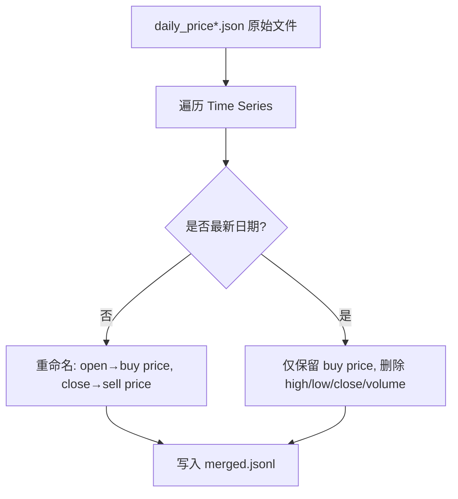
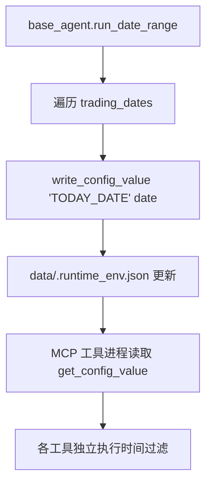
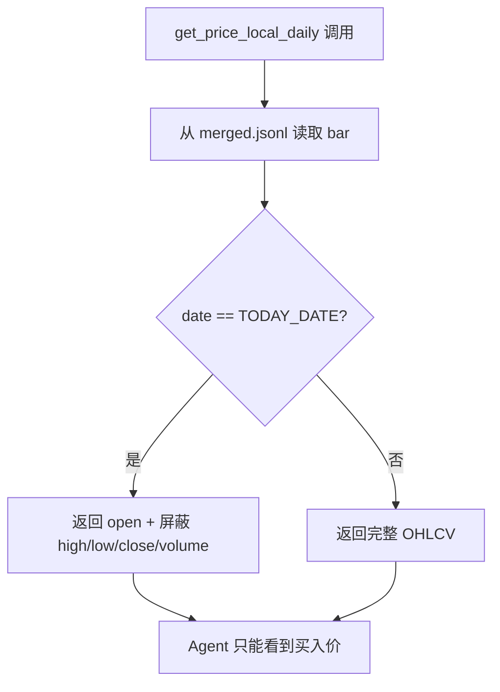

# PD-304.01 AI-Trader — 三层时间屏障反未来泄露回测

> 文档编号：PD-304.01
> 来源：AI-Trader `agent_tools/tool_get_price_local.py` `agent_tools/tool_jina_search.py` `tools/price_tools.py`
> GitHub：https://github.com/HKUDS/AI-Trader.git
> 问题域：PD-304 历史回放与回测 Historical Replay
> 状态：可复用方案

---

## 第 1 章 问题与动机

### 1.1 核心问题

历史回测中最致命的缺陷是**未来信息泄露（Look-Ahead Bias）**——Agent 在做交易决策时，无意中使用了当日或未来的价格、新闻、搜索结果等信息，导致回测收益虚高、策略不可复现。

传统量化回测框架（如 Backtrader、Zipline）通过事件驱动引擎在框架层面解决此问题。但 LLM Agent 交易系统面临独特挑战：Agent 通过自然语言调用工具获取信息，信息来源多样（价格 API、搜索引擎、新闻 API），每个数据通道都可能成为未来信息的泄露口。

### 1.2 AI-Trader 的解法概述

AI-Trader 实现了**三层时间屏障**架构，在数据预处理、运行时配置、工具层三个层面严格防止未来信息泄露：

1. **数据预处理层**：`data/merge_jsonl.py:124-147` 在合并价格数据时，将最新日期的 OHLCV 数据裁剪为仅保留买入价（open），物理删除 high/low/close/volume
2. **运行时配置层**：`tools/general_tools.py:50-55` 通过 `get_config_value("TODAY_DATE")` 提供全局时间锚点，所有工具共享同一模拟日期
3. **工具层屏障**：每个 MCP 工具在返回数据前独立执行时间过滤——价格工具屏蔽当日 OHLCV（`tool_get_price_local.py:140-151`），搜索工具过滤未来文章（`tool_jina_search.py:190-197`），新闻工具限制 API 时间范围（`tool_alphavantage_news.py:195-198`）

### 1.3 设计思想

| 设计原则 | 具体实现 | 理由 | 替代方案 |
|----------|----------|------|----------|
| 纵深防御 | 数据预处理 + 运行时 + 工具层三层屏障 | 单层防御可能被绕过，多层确保即使一层失效也不泄露 | 仅在框架层做事件驱动过滤 |
| 全局时间锚点 | TODAY_DATE 写入共享 JSON 配置文件 | 所有 MCP 工具进程通过文件共享同一时间，避免时钟漂移 | 环境变量（多进程不同步） |
| 字段级屏蔽 | 当日价格返回 "You can not get the current high price" | 用自然语言告知 LLM 该字段不可用，比返回 null 更明确 | 返回 None 或 0（LLM 可能误用） |
| 语义重命名 | open→buy price, close→sell price | 引导 LLM 理解价格的交易语义而非统计语义 | 保留原始 OHLCV 命名 |
| 数据驱动交易日历 | 从 merged.jsonl 实际数据推导交易日 | 无需维护独立的交易日历表，数据即真相 | 引入第三方交易日历库 |

---

## 第 2 章 源码实现分析

### 2.1 架构概览

AI-Trader 的回测架构围绕 `TODAY_DATE` 全局时间锚点构建，所有数据访问都经过时间过滤：

```
┌─────────────────────────────────────────────────────────┐
│                    main.py / base_agent.py               │
│         run_date_range() 逐日推进 TODAY_DATE              │
└──────────────────────┬──────────────────────────────────┘
                       │ write_config_value("TODAY_DATE", date)
                       ▼
┌─────────────────────────────────────────────────────────┐
│              data/.runtime_env.json                       │
│         {"TODAY_DATE": "2025-10-15", ...}                 │
└──────┬──────────┬──────────────┬────────────────────────┘
       │          │              │
       ▼          ▼              ▼
┌──────────┐ ┌──────────┐ ┌──────────────┐
│ Price MCP│ │Search MCP│ │  News MCP    │
│ 屏蔽当日  │ │ 过滤未来  │ │ 限制时间范围  │
│ HLCV     │ │ 搜索结果  │ │ time_to=     │
│          │ │          │ │ TODAY_DATE   │
└──────────┘ └──────────┘ └──────────────┘
       │          │              │
       ▼          ▼              ▼
┌─────────────────────────────────────────────────────────┐
│              merged.jsonl (预处理后)                       │
│   最新日期仅保留 buy price，其余字段物理删除                  │
└─────────────────────────────────────────────────────────┘
```

### 2.2 核心实现

#### 2.2.1 数据预处理：最新日期字段裁剪



对应源码 `data/merge_jsonl.py:124-156`：
```python
# 统一重命名："1. open" -> "1. buy price"；"4. close" -> "4. sell price"
# 对于最新的一天，只保留并写入 "1. buy price"
try:
    series = None
    for key, value in data.items():
        if key.startswith("Time Series"):
            series = value
            break
    if isinstance(series, dict) and series:
        # 先对所有日期做键名重命名
        for d, bar in list(series.items()):
            if not isinstance(bar, dict):
                continue
            if "1. open" in bar:
                bar["1. buy price"] = bar.pop("1. open")
            if "4. close" in bar:
                bar["4. sell price"] = bar.pop("4. close")
        # 再处理最新日期，仅保留买入价
        latest_date = max(series.keys())
        latest_bar = series.get(latest_date, {})
        if isinstance(latest_bar, dict):
            buy_val = latest_bar.get("1. buy price")
            series[latest_date] = {"1. buy price": buy_val} if buy_val is not None else {}
except Exception:
    pass
```

#### 2.2.2 运行时时间锚点：TODAY_DATE 全局配置



对应源码 `agent/base_agent/base_agent.py:633-667`：
```python
async def run_date_range(self, init_date: str, end_date: str) -> None:
    trading_dates = self.get_trading_dates(init_date, end_date)
    if not trading_dates:
        return
    for date in trading_dates:
        # 设置全局时间锚点
        write_config_value("TODAY_DATE", date)
        write_config_value("SIGNATURE", self.signature)
        try:
            await self.run_with_retry(date)
        except Exception as e:
            raise
```

配置读写通过共享 JSON 文件实现（`tools/general_tools.py:50-55`）：
```python
def get_config_value(key: str, default=None):
    _RUNTIME_ENV = _load_runtime_env()
    if key in _RUNTIME_ENV:
        return _RUNTIME_ENV[key]
    return os.getenv(key, default)
```

#### 2.2.3 价格工具：当日 OHLCV 字段级屏蔽



对应源码 `agent_tools/tool_get_price_local.py:140-163`：
```python
if date == get_config_value("TODAY_DATE"):
    return {
        "symbol": symbol,
        "date": date,
        "ohlcv": {
            "open": day.get("1. buy price"),
            "high": "You can not get the current high price",
            "low": "You can not get the current low price",
            "close": "You can not get the next close price",
            "volume": "You can not get the current volume",
        },
    }
else:
    return {
        "symbol": symbol,
        "date": date,
        "ohlcv": {
            "open": day.get("1. buy price"),
            "high": day.get("2. high"),
            "low": day.get("3. low"),
            "close": day.get("4. sell price"),
            "volume": day.get("5. volume"),
        },
    }
```

### 2.3 实现细节

#### 搜索结果时间过滤

Jina 搜索工具在 `tool_jina_search.py:176-197` 对每条搜索结果的发布日期进行标准化解析，然后与 TODAY_DATE 比较，仅保留发布时间早于 TODAY_DATE 的结果：

```python
for item in json_data.get("data", []):
    if "url" not in item:
        continue
    raw_date = item.get("date", "unknown")
    standardized_date = parse_date_to_standard(raw_date)
    if standardized_date == "unknown" or standardized_date == raw_date:
        filtered_urls.append(item["url"])  # 无法解析日期则保留
        continue
    today_date = get_config_value("TODAY_DATE")
    if today_date:
        if today_date > standardized_date:
            filtered_urls.append(item["url"])  # 仅保留早于 TODAY_DATE 的
```

#### AlphaVantage 新闻 API 时间范围限制

新闻工具在 `tool_alphavantage_news.py:182-204` 直接在 API 请求参数中设置 `time_to` 为 TODAY_DATE，从 API 层面阻断未来新闻：

```python
today_date = get_config_value("TODAY_DATE")
if today_date:
    today_datetime = datetime.strptime(today_date, "%Y-%m-%d")
    time_to = today_datetime.strftime("%Y%m%dT%H%M")
    time_from_datetime = today_datetime - timedelta(days=30)
    time_from = time_from_datetime.strftime("%Y%m%dT%H%M")
```

#### 数据驱动交易日历

`tools/price_tools.py:267-333` 的 `is_trading_day()` 直接从 merged.jsonl 中查找日期是否存在，而非维护独立的交易日历表。`get_yesterday_date()` (`tools/price_tools.py:437-529`) 同样从实际数据中找到前一个交易时间点，支持日线和小时线两种粒度。

---

## 第 3 章 迁移指南

### 3.1 迁移清单

**阶段 1：全局时间锚点（必须）**

- [ ] 实现 `RuntimeConfig` 单例，提供 `get("TODAY_DATE")` / `set("TODAY_DATE", date)` 接口
- [ ] 选择进程间共享方式：JSON 文件（简单）、Redis（分布式）、环境变量（单进程）
- [ ] 在回测主循环中逐日/逐时推进 TODAY_DATE

**阶段 2：数据通道屏蔽（必须）**

- [ ] 价格工具：当日数据仅返回 open，屏蔽 high/low/close/volume
- [ ] 搜索工具：对搜索结果按发布日期过滤，丢弃 >= TODAY_DATE 的结果
- [ ] 新闻工具：在 API 请求参数中设置 time_to = TODAY_DATE

**阶段 3：数据预处理（推荐）**

- [ ] 合并脚本中对最新日期做字段裁剪，物理删除不可用字段
- [ ] 语义重命名：open→buy_price, close→sell_price，引导 LLM 理解交易语义

**阶段 4：交易日历（推荐）**

- [ ] 从实际数据文件推导交易日列表，避免维护独立日历
- [ ] 实现 `get_previous_trading_day(date)` 从数据中查找前一交易日

### 3.2 适配代码模板

```python
"""可复用的时间屏障模块 — 从 AI-Trader 提炼"""
import json
import os
from datetime import datetime, timedelta
from pathlib import Path
from typing import Any, Dict, Optional


class TimeBarrier:
    """三层时间屏障：全局时间锚点 + 字段级屏蔽 + 搜索过滤"""

    def __init__(self, config_path: str = "data/.runtime_env.json"):
        self._config_path = Path(config_path)
        self._config_path.parent.mkdir(parents=True, exist_ok=True)

    # ── 全局时间锚点 ──
    def set_today(self, date: str) -> None:
        """设置当前模拟日期（回测主循环调用）"""
        cfg = self._load()
        cfg["TODAY_DATE"] = date
        self._save(cfg)

    def get_today(self) -> Optional[str]:
        return self._load().get("TODAY_DATE")

    # ── 价格屏蔽 ──
    def filter_price(self, date: str, ohlcv: Dict[str, Any]) -> Dict[str, Any]:
        """当日价格仅暴露 open，屏蔽其余字段"""
        if date == self.get_today():
            return {
                "open": ohlcv.get("open"),
                "high": "[MASKED] current high unavailable",
                "low": "[MASKED] current low unavailable",
                "close": "[MASKED] close price unavailable",
                "volume": "[MASKED] current volume unavailable",
            }
        return ohlcv

    # ── 搜索结果过滤 ──
    def filter_search_results(
        self, results: list, date_key: str = "published_date"
    ) -> list:
        """过滤掉发布日期 >= TODAY_DATE 的搜索结果"""
        today = self.get_today()
        if not today:
            return results
        return [
            r for r in results
            if r.get(date_key, "0000-01-01") < today
            or r.get(date_key) in (None, "unknown")
        ]

    # ── 交易日历（数据驱动）──
    def get_trading_dates(
        self, data_path: str, start: str, end: str
    ) -> list:
        """从 JSONL 数据文件推导交易日列表"""
        dates = set()
        with open(data_path, "r") as f:
            for line in f:
                doc = json.loads(line)
                for key, series in doc.items():
                    if key.startswith("Time Series") and isinstance(series, dict):
                        dates.update(series.keys())
                        break
        return sorted(d for d in dates if start <= d <= end)

    # ── 内部方法 ──
    def _load(self) -> dict:
        if self._config_path.exists():
            return json.loads(self._config_path.read_text())
        return {}

    def _save(self, cfg: dict) -> None:
        self._config_path.write_text(json.dumps(cfg, indent=2))
```

### 3.3 适用场景

| 场景 | 适用度 | 说明 |
|------|--------|------|
| LLM Agent 交易回测 | ⭐⭐⭐ | 核心场景，Agent 通过工具获取信息，每个通道都需要时间屏障 |
| 传统量化回测 | ⭐⭐ | 传统框架已有事件驱动机制，但多数据源场景仍可借鉴 |
| 新闻驱动策略回测 | ⭐⭐⭐ | 搜索/新闻时间过滤是关键，直接复用 |
| 实时交易系统 | ⭐ | 实时系统不需要模拟时间，但字段屏蔽思路可用于风控 |
| 多 Agent 协作回测 | ⭐⭐⭐ | 共享 JSON 配置文件确保所有 Agent 看到同一时间 |

---

## 第 4 章 测试用例

```python
"""基于 AI-Trader 真实函数签名的测试用例"""
import json
import os
import tempfile
from datetime import datetime
from pathlib import Path
from unittest.mock import patch


class TestTimeBarrier:
    """测试三层时间屏障"""

    def setup_method(self):
        """创建临时配置文件和测试数据"""
        self.tmp_dir = tempfile.mkdtemp()
        self.config_path = os.path.join(self.tmp_dir, ".runtime_env.json")
        # 写入模拟配置
        with open(self.config_path, "w") as f:
            json.dump({"TODAY_DATE": "2025-10-15", "SIGNATURE": "test"}, f)

    def test_price_masking_today(self):
        """当日价格应屏蔽 high/low/close/volume"""
        # 模拟 tool_get_price_local.py:140-151 的逻辑
        today_date = "2025-10-15"
        config_today = "2025-10-15"
        day = {
            "1. buy price": "150.00",
            "2. high": "155.00",
            "3. low": "148.00",
            "4. sell price": "153.00",
            "5. volume": "1000000",
        }
        if today_date == config_today:
            result = {
                "open": day.get("1. buy price"),
                "high": "You can not get the current high price",
                "low": "You can not get the current low price",
                "close": "You can not get the next close price",
                "volume": "You can not get the current volume",
            }
        assert result["open"] == "150.00"
        assert "can not" in result["high"]
        assert "can not" in result["close"]

    def test_price_full_for_historical(self):
        """历史日期应返回完整 OHLCV"""
        today_date = "2025-10-14"
        config_today = "2025-10-15"
        day = {
            "1. buy price": "150.00",
            "2. high": "155.00",
            "3. low": "148.00",
            "4. sell price": "153.00",
            "5. volume": "1000000",
        }
        if today_date != config_today:
            result = {
                "open": day.get("1. buy price"),
                "high": day.get("2. high"),
                "low": day.get("3. low"),
                "close": day.get("4. sell price"),
                "volume": day.get("5. volume"),
            }
        assert result["high"] == "155.00"
        assert result["close"] == "153.00"

    def test_search_filter_future_articles(self):
        """搜索结果应过滤掉未来日期的文章"""
        # 模拟 tool_jina_search.py:190-197 的逻辑
        today_date = "2025-10-15"
        articles = [
            {"url": "https://a.com", "date": "2025-10-14 08:00:00"},  # 保留
            {"url": "https://b.com", "date": "2025-10-15 10:00:00"},  # 过滤
            {"url": "https://c.com", "date": "2025-10-16 06:00:00"},  # 过滤
            {"url": "https://d.com", "date": "unknown"},              # 保留
        ]
        filtered = []
        for item in articles:
            date = item.get("date", "unknown")
            if date == "unknown":
                filtered.append(item["url"])
            elif today_date > date:
                filtered.append(item["url"])
        assert len(filtered) == 2
        assert "https://a.com" in filtered
        assert "https://d.com" in filtered

    def test_news_api_time_range(self):
        """新闻 API 应设置 time_to 为 TODAY_DATE"""
        # 模拟 tool_alphavantage_news.py:189-198 的逻辑
        today_date = "2025-10-15"
        today_datetime = datetime.strptime(today_date, "%Y-%m-%d")
        time_to = today_datetime.strftime("%Y%m%dT%H%M")
        time_from = (today_datetime - __import__("datetime").timedelta(days=30)).strftime("%Y%m%dT%H%M")
        assert time_to == "20251015T0000"
        assert time_from == "20250915T0000"

    def test_merge_latest_date_trimming(self):
        """合并脚本应裁剪最新日期仅保留 buy price"""
        # 模拟 data/merge_jsonl.py:143-147 的逻辑
        series = {
            "2025-10-14": {
                "1. buy price": "150.00",
                "2. high": "155.00",
                "3. low": "148.00",
                "4. sell price": "153.00",
            },
            "2025-10-15": {
                "1. buy price": "152.00",
                "2. high": "157.00",
                "3. low": "149.00",
                "4. sell price": "155.00",
            },
        }
        latest_date = max(series.keys())
        buy_val = series[latest_date].get("1. buy price")
        series[latest_date] = {"1. buy price": buy_val}
        # 最新日期仅保留 buy price
        assert series["2025-10-15"] == {"1. buy price": "152.00"}
        # 历史日期保持完整
        assert "2. high" in series["2025-10-14"]

    def test_trading_day_from_data(self):
        """交易日应从实际数据推导"""
        # 模拟 tools/price_tools.py:267-333 的逻辑
        tmp = tempfile.NamedTemporaryFile(mode="w", suffix=".jsonl", delete=False)
        doc = {
            "Meta Data": {"2. Symbol": "AAPL"},
            "Time Series (Daily)": {
                "2025-10-13": {"1. buy price": "100"},
                "2025-10-14": {"1. buy price": "101"},
                "2025-10-15": {"1. buy price": "102"},
            },
        }
        tmp.write(json.dumps(doc) + "\n")
        tmp.close()
        # 验证 2025-10-14 是交易日
        with open(tmp.name) as f:
            for line in f:
                data = json.loads(line)
                ts = data.get("Time Series (Daily)", {})
                assert "2025-10-14" in ts
                assert "2025-10-12" not in ts  # 周末不在数据中
        os.unlink(tmp.name)
```

---

## 第 5 章 跨域关联

| 关联域 | 关系类型 | 说明 |
|--------|----------|------|
| PD-01 上下文管理 | 协同 | TODAY_DATE 作为系统 prompt 的一部分注入 Agent 上下文，Agent 的时间认知依赖上下文管理 |
| PD-04 工具系统 | 依赖 | 时间屏障在每个 MCP 工具内部实现，工具注册和调用机制是屏障的载体 |
| PD-06 记忆持久化 | 协同 | position.jsonl 记录每日持仓变化，是回测状态的持久化载体；`get_today_init_position` 通过 `record_date < today_date` 过滤确保不读取未来持仓 |
| PD-08 搜索与检索 | 依赖 | 搜索结果的时间过滤是反未来泄露的关键环节，Jina 和 AlphaVantage 两个搜索通道都需要独立过滤 |
| PD-11 可观测性 | 协同 | 每日交易日志按 `{signature}/log/{today_date}/log.jsonl` 组织，支持按日期回溯分析 |

---

## 第 6 章 来源文件索引

| 文件 | 行范围 | 关键实现 |
|------|--------|----------|
| `data/merge_jsonl.py` | L124-L156 | 数据预处理：字段重命名 + 最新日期裁剪 |
| `tools/general_tools.py` | L10-L55 | 运行时配置：TODAY_DATE 读写 via 共享 JSON |
| `tools/price_tools.py` | L267-L333 | 交易日验证：从 merged.jsonl 推导 |
| `tools/price_tools.py` | L437-L529 | 前一交易日查找：支持日线/小时线 |
| `tools/price_tools.py` | L533-L585 | 开盘价读取：按日期精确查询 |
| `tools/price_tools.py` | L740-L803 | 持仓初始化：`record_date < today_date` 过滤 |
| `agent_tools/tool_get_price_local.py` | L66-L166 | MCP 价格工具：当日 OHLCV 字段级屏蔽 |
| `agent_tools/tool_jina_search.py` | L150-L210 | MCP 搜索工具：搜索结果发布日期过滤 |
| `agent_tools/tool_alphavantage_news.py` | L88-L216 | MCP 新闻工具：API 时间范围限制 |
| `agent/base_agent/base_agent.py` | L562-L600 | 交易日历生成：从 position 文件推导待处理日期 |
| `agent/base_agent/base_agent.py` | L633-L667 | 回测主循环：逐日推进 TODAY_DATE |
| `agent_tools/tool_trade.py` | L56-L170 | 交易执行：读取 TODAY_DATE 获取当日买入价 |
| `configs/default_config.json` | L4-L6 | 日期范围配置：init_date / end_date |

---

## 第 7 章 横向对比维度

> **重要：** 本章用于自动填充 Butcher Wiki 的横向对比表。

```json comparison_data
{
  "project": "AI-Trader",
  "dimensions": {
    "时间锚点机制": "共享 JSON 文件 TODAY_DATE，MCP 多进程通过文件读取同步",
    "未来信息屏蔽": "三层纵深：数据预处理裁剪 + 运行时配置 + 工具层字段级屏蔽",
    "交易日历": "数据驱动，从 merged.jsonl 实际时间序列推导，无独立日历表",
    "数据回放粒度": "日线 + 小时线双粒度，自动检测时间格式切换",
    "多市场支持": "US/CN/Crypto 三市场统一架构，按 symbol 后缀自动路由数据路径",
    "语义引导": "open→buy price, close→sell price 重命名，屏蔽字段用自然语言提示 LLM"
  }
}
```

### 域元数据补充

```json domain_metadata
{
  "solution_summary": "AI-Trader 用共享 JSON 时间锚点 + 数据预处理字段裁剪 + MCP 工具层字段级屏蔽实现三层纵深反未来泄露回测",
  "description": "LLM Agent 多数据通道场景下的纵深防御式反未来信息泄露",
  "sub_problems": [
    "多数据通道一致性过滤（价格/搜索/新闻各自独立过滤）",
    "LLM 语义引导（用自然语言而非 null 告知字段不可用）",
    "多市场数据路径路由（US/CN/Crypto 统一架构）"
  ],
  "best_practices": [
    "屏蔽字段用自然语言提示而非返回 null，防止 LLM 误解",
    "数据预处理阶段物理删除不可用字段作为最后防线",
    "语义重命名 open→buy price 引导 LLM 理解交易意图"
  ]
}
```
