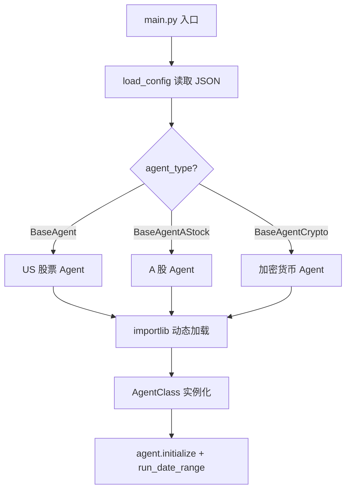
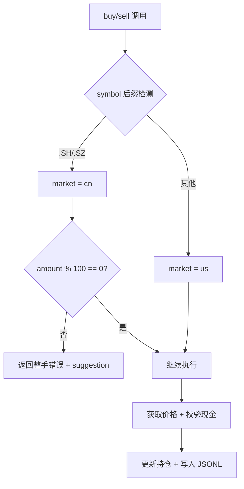
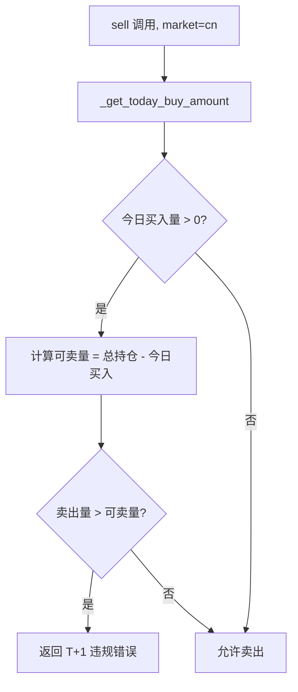

# PD-305.01 AI-Trader — Agent 多态与市场规则引擎三市场适配

> 文档编号：PD-305.01
> 来源：AI-Trader `agent_tools/tool_trade.py` `agent/base_agent_crypto/base_agent_crypto.py` `prompts/agent_prompt_astock.py`
> GitHub：https://github.com/HKUDS/AI-Trader.git
> 问题域：PD-305 多市场适配 Multi-Market Adaptation
> 状态：可复用方案

---

## 第 1 章 问题与动机

### 1.1 核心问题

不同金融市场有截然不同的交易规则、数据格式和监管约束。美股允许 T+0 自由交易任意股数；A 股强制 T+1 结算且必须以 100 股（一手）为单位交易，还有涨跌停限制；加密货币支持浮点数量 7×24 小时交易。一个 Agent 交易系统如果要同时覆盖这三个市场，必须在工具层、Agent 层、Prompt 层和数据层四个维度做出差异化适配，否则会出现 A 股买 13 股、加密货币取整丢精度、T+1 规则被绕过等严重错误。

### 1.2 AI-Trader 的解法概述

AI-Trader 采用"四层多态"架构实现三市场适配：

1. **Agent 基类多态** — 三个独立基类 `BaseAgent`（美股）、`BaseAgentAStock`（A 股）、`BaseAgentCrypto`（加密货币），各自硬编码市场类型和默认标的池（`agent/base_agent/base_agent.py:106`、`agent/base_agent_astock/base_agent_astock.py`、`agent/base_agent_crypto/base_agent_crypto.py:107`）
2. **交易工具分离** — 股票交易 `tool_trade.py` 通过 symbol 后缀自动检测 cn/us 市场并内联 T+1 和整手校验；加密货币独立工具 `tool_crypto_trade.py` 使用 `float` 参数和 4 位精度（`agent_tools/tool_trade.py:97`、`agent_tools/tool_crypto_trade.py:45`）
3. **Prompt 市场定制** — 三套独立 prompt 文件，A 股 prompt 用中文并嵌入 T+1/整手/涨跌停规则说明（`prompts/agent_prompt_astock.py:30`），加密货币 prompt 强调 24/7 和波动性（`prompts/agent_prompt_crypto.py:24`）
4. **数据路径路由** — `get_merged_file_path()` 按 market 参数路由到不同 JSONL 数据文件（`tools/price_tools.py:231`）

### 1.3 设计思想

| 设计原则 | 具体实现 | 理由 | 替代方案 |
|----------|----------|------|----------|
| 类型多态替代条件分支 | 三个独立 Agent 基类，各自硬编码 market 字段 | 避免在单一类中堆积 if/elif 分支，每个市场的逻辑完全隔离 | 单一 BaseAgent + market 参数（会导致方法内大量条件判断） |
| Symbol 格式即市场标识 | `.SH`/`.SZ` 后缀 → cn，`-USDT` 后缀 → crypto，其余 → us | 无需额外配置，symbol 本身携带市场信息 | 显式 market 参数传递（增加调用复杂度） |
| 规则内联到工具层 | T+1 检查和整手校验直接写在 buy/sell 函数中 | 确保规则不可绕过，LLM 无法跳过校验 | 中间件/装饰器模式（增加间接层） |
| Prompt 即规则文档 | A 股 prompt 用中文详细列出交易规则和正确/错误示例 | LLM 在决策前就理解市场约束，减少无效工具调用 | 仅依赖工具层报错（LLM 需要试错才能学会规则） |
| 数据路径按市场隔离 | 三套独立 merged.jsonl 文件，路径由 market 参数决定 | 避免数据混淆，各市场数据格式可独立演进 | 单一数据文件 + market 字段过滤（查询效率低） |

---

## 第 2 章 源码实现分析

### 2.1 架构概览

AI-Trader 的多市场适配架构分为四层，每层都按市场类型做了多态分离：

```
┌─────────────────────────────────────────────────────────────┐
│                    main.py / AGENT_REGISTRY                  │
│  动态加载: BaseAgent | BaseAgentAStock | BaseAgentCrypto     │
├──────────┬──────────────┬───────────────┬───────────────────┤
│  Config  │  Agent 基类   │  Prompt 模块   │  MCP 工具         │
│  Layer   │  Layer        │  Layer         │  Layer            │
├──────────┼──────────────┼───────────────┼───────────────────┤
│ default_ │ BaseAgent    │ agent_prompt  │ tool_trade.py     │
│ config   │ (US, int,    │ .py (EN)      │ buy(str,int)      │
│ .json    │  NASDAQ 100) │               │ sell(str,int)     │
├──────────┼──────────────┼───────────────┼───────────────────┤
│ default_ │ BaseAgent    │ agent_prompt_ │ tool_trade.py     │
│ astock_  │ AStock       │ astock.py     │ (同文件,cn分支)    │
│ config   │ (CN, int×100,│ (中文+T+1规则) │ T+1 + 整手校验    │
│ .json    │  SSE 50)     │               │                   │
├──────────┼──────────────┼───────────────┼───────────────────┤
│ default_ │ BaseAgent    │ agent_prompt_ │ tool_crypto_      │
│ crypto_  │ Crypto       │ crypto.py     │ trade.py          │
│ config   │ (crypto,     │ (EN, 24/7)    │ buy_crypto(str,   │
│ .json    │  float,      │               │  float)           │
│          │  Bitwise 10) │               │ sell_crypto(str,  │
│          │              │               │  float)           │
├──────────┴──────────────┴───────────────┴───────────────────┤
│              tools/price_tools.py — 数据路径路由              │
│  US: data/merged.jsonl                                       │
│  CN: data/A_stock/merged.jsonl | merged_hourly.jsonl         │
│  Crypto: data/crypto/crypto_merged.jsonl                     │
└─────────────────────────────────────────────────────────────┘
```

### 2.2 核心实现

#### 2.2.1 Agent 注册表与动态加载



对应源码 `main.py:16-37`：

```python
AGENT_REGISTRY = {
    "BaseAgent": {
        "module": "agent.base_agent.base_agent",
        "class": "BaseAgent"
    },
    "BaseAgent_Hour": {
        "module": "agent.base_agent.base_agent_hour",
        "class": "BaseAgent_Hour"
    },
    "BaseAgentAStock": {
        "module": "agent.base_agent_astock.base_agent_astock",
        "class": "BaseAgentAStock"
    },
    "BaseAgentAStock_Hour": {
        "module": "agent.base_agent_astock.base_agent_astock_hour",
        "class": "BaseAgentAStock_Hour"
    },
    "BaseAgentCrypto": {
        "module": "agent.base_agent_crypto.base_agent_crypto",
        "class": "BaseAgentCrypto"
    }
}
```

`main.py:40-69` 中 `get_agent_class()` 使用 `importlib.import_module()` 动态加载，`main.py:129-132` 根据 agent_type 自动推断 market 类型。

#### 2.2.2 交易工具层的市场规则内联



对应源码 `agent_tools/tool_trade.py:97-128`（buy 函数中的 A 股规则校验）：

```python
# Auto-detect market type based on symbol format
if symbol.endswith((".SH", ".SZ")):
    market = "cn"
else:
    market = "us"

# Amount validation for stocks
try:
    amount = int(amount)  # Convert to int for stocks
except ValueError:
    return {
        "error": f"Invalid amount format. Amount must be an integer for stock trading. You provided: {amount}",
        "symbol": symbol,
        "date": today_date,
    }

# 🇨🇳 Chinese A-shares trading rule: Must trade in lots of 100 shares (一手 = 100股)
if market == "cn" and amount % 100 != 0:
    return {
        "error": f"Chinese A-shares must be traded in multiples of 100 shares (1 lot = 100 shares). You tried to buy {amount} shares.",
        "symbol": symbol,
        "amount": amount,
        "date": today_date,
        "suggestion": f"Please use {(amount // 100) * 100} or {((amount // 100) + 1) * 100} shares instead.",
    }
```

T+1 结算规则实现在 sell 函数中（`agent_tools/tool_trade.py:377-392`）：



对应源码 `agent_tools/tool_trade.py:377-392`：

```python
# 🇨🇳 Chinese A-shares T+1 trading rule: Cannot sell shares bought on the same day
if market == "cn":
    bought_today = _get_today_buy_amount(symbol, today_date, signature)
    if bought_today > 0:
        sellable_amount = current_position[symbol] - bought_today
        if amount > sellable_amount:
            return {
                "error": f"T+1 restriction violated! You bought {bought_today} shares of {symbol} today and cannot sell them until tomorrow.",
                "symbol": symbol,
                "total_position": current_position[symbol],
                "bought_today": bought_today,
                "sellable_today": max(0, sellable_amount),
                "want_to_sell": amount,
                "date": today_date,
            }
```

#### 2.2.3 加密货币工具的浮点精度处理

对应源码 `agent_tools/tool_crypto_trade.py:45-86`（buy_crypto 函数签名和精度处理）：

```python
@mcp.tool()
def buy_crypto(symbol: str, amount: float) -> Dict[str, Any]:
    # ...
    amount = float(amount)  # Convert to float to allow decimals
    # ...
    # Decrease cash balance with 4 decimal precision
    new_position["CASH"] = round(cash_left, 4)
    # Increase crypto position quantity with 4 decimal precision
    new_position[symbol] = round(new_position[symbol] + amount, 4)
```

与股票工具的关键差异：参数类型 `float` vs `int`，无整手限制，无 T+1 限制，所有金额保留 4 位小数。

### 2.3 实现细节

#### 数据路径路由

`tools/price_tools.py:231-246` 实现了市场到数据文件的映射：

```python
def get_merged_file_path(market: str = "us") -> Path:
    base_dir = Path(__file__).resolve().parents[1]
    if market == "cn":
        return base_dir / "data" / "A_stock" / "merged.jsonl"
    elif market == "crypto":
        return base_dir / "data" / "crypto" / "crypto_merged.jsonl"
    else:
        return base_dir / "data" / "merged.jsonl"
```

`_resolve_merged_file_path_for_date()`（`tools/price_tools.py:248-264`）进一步支持 A 股小时级数据的自动检测：当 `today_date` 包含空格（即 `YYYY-MM-DD HH:MM:SS` 格式）时，自动路由到 `merged_hourly.jsonl`。

#### Prompt 层的市场规则注入

A 股 prompt（`prompts/agent_prompt_astock.py:30-96`）用中文编写，包含 4 条关键规则：
- 股票代码格式必须含 `.SH` 或 `.SZ` 后缀
- 一手交易要求（100 股整数倍），含正确/错误示例
- T+1 结算规则说明
- 涨跌停限制（普通 ±10%、ST ±5%、科创板/创业板 ±20%）

加密货币 prompt（`prompts/agent_prompt_crypto.py:24-62`）用英文编写，强调 24/7 交易和波动性监控。

#### 市场类型智能检测

`tools/price_tools.py:47-70` 的 `get_market_type()` 实现三级检测：
1. 优先从配置读取 `MARKET` 值
2. 根据 `LOG_PATH` 推断（`astock` → cn，`crypto` → crypto）
3. 默认 us


---

## 第 3 章 迁移指南

### 3.1 迁移清单

**阶段 1：定义市场规则协议**
- [ ] 定义 `MarketRules` 数据类，包含：交易量类型（int/float）、最小交易单位、T+N 结算天数、涨跌停限制、交易时间窗口
- [ ] 为每个目标市场实现具体规则实例

**阶段 2：实现交易工具分离**
- [ ] 按市场创建独立交易工具（或在统一工具中通过 symbol 格式自动路由）
- [ ] 在工具层内联所有市场规则校验（不依赖 LLM 自觉遵守）
- [ ] 实现原子性持仓更新（文件锁或数据库事务）

**阶段 3：Agent 基类多态**
- [ ] 为每个市场创建独立 Agent 基类，硬编码 market 字段和默认标的池
- [ ] 实现动态注册表 + importlib 加载机制
- [ ] 配置文件按市场分离

**阶段 4：Prompt 市场定制**
- [ ] 为每个市场编写独立 prompt，包含该市场的交易规则、正确/错误示例
- [ ] A 股等非英语市场使用本地语言编写 prompt
- [ ] 在 prompt 中注入实时持仓、价格、收益数据

### 3.2 适配代码模板

以下是一个可直接复用的市场规则引擎模板：

```python
from dataclasses import dataclass, field
from typing import Any, Dict, Optional, List
from enum import Enum


class MarketType(Enum):
    US = "us"
    CN = "cn"
    CRYPTO = "crypto"


@dataclass
class MarketRules:
    """市场交易规则定义"""
    market: MarketType
    amount_type: type  # int for stocks, float for crypto
    min_lot_size: int = 1  # 最小交易单位，A股=100
    t_plus_n: int = 0  # T+N 结算天数，A股=1
    price_limit_pct: Optional[float] = None  # 涨跌停百分比，A股=0.10
    trading_hours: str = "market_hours"  # "market_hours" or "24/7"
    currency: str = "USD"
    decimal_precision: int = 2  # 金额精度

    def validate_amount(self, amount: Any) -> tuple[bool, str]:
        """校验交易数量"""
        try:
            amount = self.amount_type(amount)
        except (ValueError, TypeError):
            return False, f"Amount must be {self.amount_type.__name__}"
        if amount <= 0:
            return False, "Amount must be positive"
        if self.min_lot_size > 1 and amount % self.min_lot_size != 0:
            nearest = (int(amount) // self.min_lot_size) * self.min_lot_size
            return False, f"Must be multiples of {self.min_lot_size}. Try {nearest} or {nearest + self.min_lot_size}"
        return True, ""

    def check_t_plus_n(self, bought_today: int, total_position: int, sell_amount: int) -> tuple[bool, str]:
        """T+N 结算规则检查"""
        if self.t_plus_n == 0:
            return True, ""
        sellable = total_position - bought_today
        if sell_amount > sellable:
            return False, f"T+{self.t_plus_n} violated: bought {bought_today} today, sellable={max(0, sellable)}"
        return True, ""


# 预定义市场规则
MARKET_RULES = {
    MarketType.US: MarketRules(
        market=MarketType.US, amount_type=int, min_lot_size=1,
        t_plus_n=0, currency="USD", decimal_precision=2
    ),
    MarketType.CN: MarketRules(
        market=MarketType.CN, amount_type=int, min_lot_size=100,
        t_plus_n=1, price_limit_pct=0.10, currency="CNY", decimal_precision=2
    ),
    MarketType.CRYPTO: MarketRules(
        market=MarketType.CRYPTO, amount_type=float, min_lot_size=1,
        t_plus_n=0, trading_hours="24/7", currency="USDT", decimal_precision=4
    ),
}


def detect_market_from_symbol(symbol: str) -> MarketType:
    """从 symbol 格式自动检测市场类型"""
    if symbol.endswith((".SH", ".SZ")):
        return MarketType.CN
    elif "-USDT" in symbol or "-BTC" in symbol:
        return MarketType.CRYPTO
    return MarketType.US
```

### 3.3 适用场景

| 场景 | 适用度 | 说明 |
|------|--------|------|
| 多市场量化交易系统 | ⭐⭐⭐ | 核心场景，直接复用四层多态架构 |
| 单市场但需扩展到多市场 | ⭐⭐⭐ | 提前按此模式设计，后续扩展零成本 |
| 跨市场套利系统 | ⭐⭐ | 需额外处理跨市场资金流转和汇率 |
| 模拟交易/回测平台 | ⭐⭐⭐ | AI-Trader 本身就是模拟交易，规则引擎可直接复用 |
| 实盘交易系统 | ⭐⭐ | 需增加真实交易所 API 对接层，规则引擎仍可复用 |

---

## 第 4 章 测试用例

```python
import pytest
from dataclasses import dataclass
from typing import Dict, Any


# 使用第 3 章的 MarketRules 和 MARKET_RULES
class TestMarketRulesValidation:
    """测试市场规则校验逻辑"""

    def test_us_stock_any_integer_amount(self):
        """美股允许任意正整数"""
        rules = MARKET_RULES[MarketType.US]
        ok, msg = rules.validate_amount(13)
        assert ok is True

    def test_cn_stock_lot_size_100(self):
        """A股必须100股整数倍"""
        rules = MARKET_RULES[MarketType.CN]
        ok, msg = rules.validate_amount(100)
        assert ok is True
        ok, msg = rules.validate_amount(13)
        assert ok is False
        assert "multiples of 100" in msg

    def test_cn_stock_lot_size_suggestion(self):
        """A股整手校验应给出建议值"""
        rules = MARKET_RULES[MarketType.CN]
        ok, msg = rules.validate_amount(150)
        assert ok is False
        assert "100" in msg and "200" in msg

    def test_crypto_float_amount(self):
        """加密货币支持浮点数量"""
        rules = MARKET_RULES[MarketType.CRYPTO]
        ok, msg = rules.validate_amount(0.05)
        assert ok is True

    def test_crypto_negative_amount(self):
        """负数应被拒绝"""
        rules = MARKET_RULES[MarketType.CRYPTO]
        ok, msg = rules.validate_amount(-1.0)
        assert ok is False

    def test_cn_t_plus_1_blocks_same_day_sell(self):
        """T+1规则：当天买入不能当天卖出"""
        rules = MARKET_RULES[MarketType.CN]
        ok, msg = rules.check_t_plus_n(bought_today=100, total_position=200, sell_amount=150)
        assert ok is False
        assert "T+1" in msg

    def test_cn_t_plus_1_allows_old_position_sell(self):
        """T+1规则：可以卖出之前持有的股票"""
        rules = MARKET_RULES[MarketType.CN]
        ok, msg = rules.check_t_plus_n(bought_today=100, total_position=300, sell_amount=200)
        assert ok is True

    def test_us_no_t_plus_n(self):
        """美股无T+N限制"""
        rules = MARKET_RULES[MarketType.US]
        ok, msg = rules.check_t_plus_n(bought_today=50, total_position=50, sell_amount=50)
        assert ok is True


class TestSymbolMarketDetection:
    """测试 symbol 格式到市场类型的自动检测"""

    def test_sh_suffix_is_cn(self):
        assert detect_market_from_symbol("600519.SH") == MarketType.CN

    def test_sz_suffix_is_cn(self):
        assert detect_market_from_symbol("000001.SZ") == MarketType.CN

    def test_usdt_pair_is_crypto(self):
        assert detect_market_from_symbol("BTC-USDT") == MarketType.CRYPTO

    def test_plain_ticker_is_us(self):
        assert detect_market_from_symbol("AAPL") == MarketType.US

    def test_nasdaq_ticker_is_us(self):
        assert detect_market_from_symbol("NVDA") == MarketType.US
```


---

## 第 5 章 跨域关联

| 关联域 | 关系类型 | 说明 |
|--------|----------|------|
| PD-04 工具系统 | 依赖 | 交易工具通过 FastMCP 注册为 MCP 工具，市场规则校验内联在工具函数中。工具层是规则执行的最后防线 |
| PD-02 多 Agent 编排 | 协同 | `main_parrallel.py` 支持多个不同市场的 Agent 并行运行，每个 Agent 独立的 MCP 端口和数据路径避免冲突 |
| PD-06 记忆持久化 | 协同 | 持仓数据通过 `position.jsonl` 持久化，T+1 规则检查依赖读取当日交易记录（`_get_today_buy_amount`） |
| PD-03 容错与重试 | 协同 | 每个 Agent 基类内置 `run_with_retry` 指数退避重试，交易工具使用 `fcntl` 文件锁保证持仓更新原子性 |
| PD-10 中间件管道 | 互斥 | AI-Trader 未使用中间件模式，市场规则直接内联在工具函数中，属于"规则即代码"而非"规则即配置" |
| PD-11 可观测性 | 协同 | 每次交易记录写入 JSONL 日志，包含 date、action_id、action 详情和更新后持仓，支持事后审计 |

---

## 第 6 章 来源文件索引

| 文件 | 行范围 | 关键实现 |
|------|--------|----------|
| `main.py` | L16-L37 | AGENT_REGISTRY 五类 Agent 注册表 |
| `main.py` | L40-L69 | get_agent_class() 动态加载 |
| `main.py` | L129-L132 | agent_type → market 自动推断 |
| `main.py` | L257-L283 | 按 agent_type 分支实例化 |
| `agent/base_agent/base_agent.py` | L106-L308 | BaseAgent 美股基类，NASDAQ 100 默认标的 |
| `agent/base_agent_crypto/base_agent_crypto.py` | L107-L175 | BaseAgentCrypto 加密货币基类，Bitwise 10 默认标的 |
| `agent_tools/tool_trade.py` | L56-L225 | buy() 函数，含 symbol 市场检测 + A 股整手校验 |
| `agent_tools/tool_trade.py` | L228-L262 | _get_today_buy_amount() T+1 辅助函数 |
| `agent_tools/tool_trade.py` | L265-L432 | sell() 函数，含 T+1 结算规则检查 |
| `agent_tools/tool_crypto_trade.py` | L44-L182 | buy_crypto() 浮点数量 + 4 位精度 |
| `agent_tools/tool_crypto_trade.py` | L185-L326 | sell_crypto() 无 T+N 限制 |
| `prompts/agent_prompt_astock.py` | L30-L96 | A 股中文 prompt，含 T+1/整手/涨跌停规则 |
| `prompts/agent_prompt_crypto.py` | L24-L62 | 加密货币英文 prompt，24/7 交易 |
| `tools/price_tools.py` | L47-L70 | get_market_type() 三级市场检测 |
| `tools/price_tools.py` | L231-L264 | get_merged_file_path() + _resolve_merged_file_path_for_date() 数据路径路由 |
| `tools/price_tools.py` | L267-L333 | is_trading_day() 市场交易日判断 |
| `tools/price_tools.py` | L401-L434 | format_price_dict_with_names() A 股中文名称显示 |

---

## 第 7 章 横向对比维度

```json comparison_data
{
  "project": "AI-Trader",
  "dimensions": {
    "适配架构": "四层多态：Agent基类 + 交易工具 + Prompt + 数据路径按市场独立",
    "规则执行层": "工具层内联校验，symbol后缀自动检测市场，规则不可绕过",
    "数量精度": "股票int + A股100整手，加密货币float + 4位小数round",
    "结算规则": "A股T+1通过_get_today_buy_amount回溯当日买入记录实现",
    "Prompt定制": "三套独立prompt文件，A股中文含规则示例，加密货币英文强调24/7",
    "数据隔离": "三套独立JSONL数据文件，路径由market参数路由"
  }
}
```

### 域元数据补充

```json domain_metadata
{
  "solution_summary": "AI-Trader通过Agent基类多态+交易工具symbol检测+三套独立Prompt+数据路径路由实现美股/A股/加密货币三市场适配，A股内联T+1和100股整手校验",
  "description": "Agent系统适配不同金融市场的交易规则、数据格式和监管约束的工程方案",
  "sub_problems": [
    "Prompt语言本地化（A股中文、美股英文）",
    "交易时间窗口差异（工作日vs7x24）",
    "持仓精度差异（整数vs浮点）"
  ],
  "best_practices": [
    "在工具层内联规则校验而非依赖LLM自觉遵守",
    "通过symbol格式自动检测市场类型，减少显式配置",
    "Prompt中嵌入正确/错误交易示例帮助LLM理解规则"
  ]
}
```
