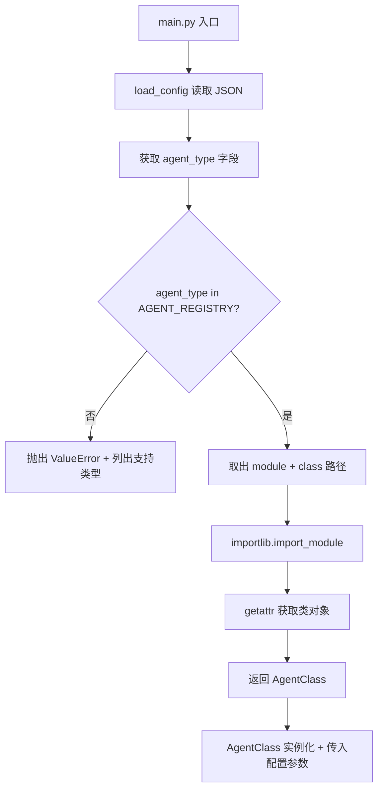
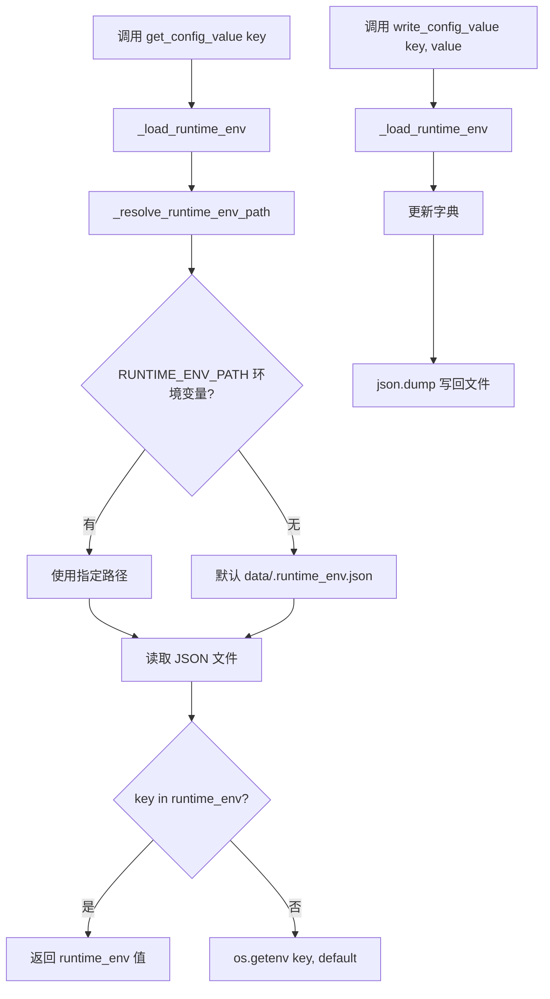

# PD-306.01 AI-Trader — JSON 配置驱动全参数运行与 AGENT_REGISTRY 动态类加载

> 文档编号：PD-306.01
> 来源：AI-Trader `configs/default_config.json` `main.py` `tools/general_tools.py`
> GitHub：https://github.com/HKUDS/AI-Trader.git
> 问题域：PD-306 配置驱动架构 Configuration-Driven Architecture
> 状态：可复用方案

---

## 第 1 章 问题与动机

### 1.1 核心问题

AI 交易 Agent 系统需要同时管理多种运行参数：Agent 类型（美股/A股/加密货币）、LLM 模型列表（多模型并行实验）、日期范围、初始资金、MCP 服务端口等。这些参数在不同实验场景下频繁变化，如果硬编码在代码中，每次实验都需要修改源码，既不安全也不利于复现。

更关键的是，交易 Agent 在运行过程中需要跨模块共享状态（当前日期、当前签名、是否已交易等），而这些状态既不适合放在环境变量中（因为需要持久化和原子更新），也不适合放在内存中（因为 MCP 工具运行在独立进程中）。

### 1.2 AI-Trader 的解法概述

AI-Trader 采用三层配置架构解决上述问题：

1. **静态配置层**：`configs/default_config.json` 定义全部运行参数，包括 agent 类型、模型列表（含 enabled 开关）、日期范围、agent 行为参数（`main.py:76-106`）
2. **环境变量覆盖层**：`.env` 文件 + `os.getenv()` 可覆盖日期范围和 API 密钥（`main.py:146-151`）
3. **运行时配置持久化层**：`RUNTIME_ENV_PATH` 指向的 JSON 文件，通过 `get_config_value/write_config_value` 实现跨进程状态共享（`tools/general_tools.py:50-69`）
4. **动态类加载**：`AGENT_REGISTRY` 字典 + `importlib` 实现配置驱动的 Agent 类型切换（`main.py:16-73`）
5. **模型级启用控制**：配置文件中每个模型有 `enabled` 字段，运行时只加载启用的模型（`main.py:170`）

### 1.3 设计思想

| 设计原则 | 具体实现 | 理由 | 替代方案 |
|----------|----------|------|----------|
| 配置即实验定义 | 一个 JSON 文件完整描述一次实验的全部参数 | 实验可复现：保存 JSON 即保存实验条件 | YAML 配置（更易读但需额外依赖） |
| 环境变量覆盖 | `os.getenv("INIT_DATE")` 可覆盖 JSON 中的日期 | CI/CD 和临时调试时无需修改配置文件 | 命令行参数覆盖（已部分支持） |
| 运行时状态文件 | `.runtime_env.json` 作为跨进程共享状态 | MCP 工具在独立进程中运行，无法共享内存 | Redis/SQLite（过重）、环境变量（不可持久化） |
| 注册表模式 | `AGENT_REGISTRY` 字典映射类型名到模块路径 | 新增 Agent 类型只需加一行注册，无需修改加载逻辑 | if-else 链（不可扩展） |
| 模型级开关 | `"enabled": true/false` 控制模型参与实验 | 快速切换实验模型组合，无需删除配置 | 注释掉 JSON 行（易出错） |

---

## 第 2 章 源码实现分析

### 2.1 架构概览

AI-Trader 的配置驱动架构分为三个层次，从静态到动态逐层叠加：

```
┌─────────────────────────────────────────────────────────┐
│                    main.py / main_parrallel.py          │
│  load_config() → get_agent_class() → AgentClass(...)    │
├─────────────────────────────────────────────────────────┤
│  Layer 1: Static Config        configs/default_config.json │
│  ├── agent_type, market, date_range                      │
│  ├── models[]: name, basemodel, signature, enabled       │
│  └── agent_config: max_steps, max_retries, initial_cash  │
├─────────────────────────────────────────────────────────┤
│  Layer 2: Env Override         .env + os.getenv()        │
│  ├── INIT_DATE / END_DATE (覆盖 JSON 日期)               │
│  ├── OPENAI_API_BASE / OPENAI_API_KEY                    │
│  └── MCP 端口: MATH_HTTP_PORT, TRADE_HTTP_PORT ...       │
├─────────────────────────────────────────────────────────┤
│  Layer 3: Runtime State        .runtime_env.json         │
│  ├── SIGNATURE, TODAY_DATE, IF_TRADE, MARKET             │
│  └── LOG_PATH, LOG_FILE                                  │
│  (get_config_value / write_config_value 读写)             │
├─────────────────────────────────────────────────────────┤
│  AGENT_REGISTRY                main.py:16-37             │
│  ├── "BaseAgent" → agent.base_agent.base_agent           │
│  ├── "BaseAgent_Hour" → agent.base_agent.base_agent_hour │
│  ├── "BaseAgentAStock" → agent.base_agent_astock...      │
│  └── "BaseAgentCrypto" → agent.base_agent_crypto...      │
└─────────────────────────────────────────────────────────┘
```

### 2.2 核心实现

#### 2.2.1 AGENT_REGISTRY 动态类加载



对应源码 `main.py:16-73`：

```python
# Agent class mapping table - for dynamic import and instantiation
AGENT_REGISTRY = {
    "BaseAgent": {
        "module": "agent.base_agent.base_agent",
        "class": "BaseAgent"
    },
    "BaseAgent_Hour": {
        "module": "agent.base_agent.base_agent_hour",
        "class": "BaseAgent_Hour"
    },
    "BaseAgentAStock": {
        "module": "agent.base_agent_astock.base_agent_astock",
        "class": "BaseAgentAStock"
    },
    "BaseAgentCrypto": {
        "module": "agent.base_agent_crypto.base_agent_crypto",
        "class": "BaseAgentCrypto"
    }
}

def get_agent_class(agent_type):
    if agent_type not in AGENT_REGISTRY:
        supported_types = ", ".join(AGENT_REGISTRY.keys())
        raise ValueError(f"❌ Unsupported agent type: {agent_type}\n"
                         f"   Supported types: {supported_types}")
    agent_info = AGENT_REGISTRY[agent_type]
    module_path = agent_info["module"]
    class_name = agent_info["class"]
    try:
        import importlib
        module = importlib.import_module(module_path)
        agent_class = getattr(module, class_name)
        return agent_class
    except ImportError as e:
        raise ImportError(f"❌ Unable to import agent module {module_path}: {e}")
```

#### 2.2.2 运行时配置持久化（跨进程状态共享）



对应源码 `tools/general_tools.py:10-69`：

```python
def _resolve_runtime_env_path() -> str:
    path = os.environ.get("RUNTIME_ENV_PATH")
    if not path:
        path = "data/.runtime_env.json"
    if not os.path.isabs(path):
        base_dir = Path(__file__).resolve().parents[1]
        path = str(base_dir / path)
    Path(path).parent.mkdir(parents=True, exist_ok=True)
    return path

def get_config_value(key: str, default=None):
    _RUNTIME_ENV = _load_runtime_env()
    if key in _RUNTIME_ENV:
        return _RUNTIME_ENV[key]
    return os.getenv(key, default)

def write_config_value(key: str, value: Any):
    path = _resolve_runtime_env_path()
    _RUNTIME_ENV = _load_runtime_env()
    _RUNTIME_ENV[key] = value
    with open(path, "w", encoding="utf-8") as f:
        json.dump(_RUNTIME_ENV, f, ensure_ascii=False, indent=4)
```

### 2.3 实现细节

**配置消费链路**：运行时配置被 22 个文件消费（通过 `get_config_value` 调用），覆盖了从 Agent 核心到 MCP 工具的全部模块：

- `agent/base_agent/base_agent.py:657` — 每个交易日写入 `TODAY_DATE` 和 `SIGNATURE`
- `agent_tools/tool_trade.py:89-94` — 买卖工具读取 `SIGNATURE` 和 `TODAY_DATE` 确定操作上下文
- `tools/price_tools.py:58-63` — `get_market_type()` 从运行时配置读取 `MARKET`，支持三级降级：配置值 → LOG_PATH 推断 → 默认 "us"
- `main_parrallel.py:120-126` — 并行模式下每个子进程设置独立的 `RUNTIME_ENV_PATH`，实现进程级配置隔离

**并行模式的配置隔离**（`main_parrallel.py:119-123`）：

```python
runtime_env_dir = project_root / "data" / "agent_data" / signature
runtime_env_dir.mkdir(parents=True, exist_ok=True)
runtime_env_path = runtime_env_dir / ".runtime_env.json"
os.environ["RUNTIME_ENV_PATH"] = str(runtime_env_path)
```

每个模型的子进程将 `RUNTIME_ENV_PATH` 指向独立目录，避免并行运行时的状态冲突。

**配置文件的 Fresh Start 机制**（`main.py:225-231`）：当 position 文件不存在时，删除共享配置文件强制从 INIT_DATE 重新开始，防止残留状态污染新实验。

**MCP 端口配置**（`agent/base_agent/base_agent.py:309-328`）：MCP 服务端口通过环境变量注入，每个工具服务（math、stock_local、search、trade）有独立端口，支持灵活部署。

---

## 第 3 章 迁移指南

### 3.1 迁移清单

**阶段 1：静态配置文件**
- [ ] 创建 `configs/default_config.json`，定义所有运行参数
- [ ] 实现 `load_config()` 函数，支持默认路径和自定义路径
- [ ] 添加 JSON 格式校验和友好错误提示

**阶段 2：环境变量覆盖**
- [ ] 创建 `.env.example` 列出所有可覆盖的环境变量
- [ ] 在 `load_config()` 后添加环境变量覆盖逻辑
- [ ] 确保敏感信息（API Key）只通过环境变量传入，不写入 JSON

**阶段 3：运行时配置持久化**
- [ ] 实现 `get_config_value()` / `write_config_value()` 函数对
- [ ] 配置 `RUNTIME_ENV_PATH` 支持相对路径和绝对路径
- [ ] 在并行场景下为每个子进程分配独立的运行时配置路径

**阶段 4：动态类加载**
- [ ] 定义 `REGISTRY` 字典，映射类型名到 `{module, class}` 路径
- [ ] 实现 `get_class(type_name)` 函数，含 `importlib` 动态导入
- [ ] 添加类型不存在时的友好错误提示（列出所有支持类型）

### 3.2 适配代码模板

#### 运行时配置持久化模块（可直接复用）

```python
import json
import os
from pathlib import Path
from typing import Any, Optional

def _resolve_runtime_config_path(env_key: str = "RUNTIME_CONFIG_PATH",
                                  default: str = "data/.runtime_config.json") -> str:
    """解析运行时配置文件路径，支持环境变量指定和相对路径解析"""
    path = os.environ.get(env_key, default)
    if not os.path.isabs(path):
        base_dir = Path(__file__).resolve().parents[1]  # 项目根目录
        path = str(base_dir / path)
    Path(path).parent.mkdir(parents=True, exist_ok=True)
    return path

def _load_runtime_config(config_path: Optional[str] = None) -> dict:
    """加载运行时配置，文件不存在或格式错误时返回空字典"""
    path = config_path or _resolve_runtime_config_path()
    try:
        if os.path.exists(path):
            with open(path, "r", encoding="utf-8") as f:
                data = json.load(f)
                return data if isinstance(data, dict) else {}
    except (json.JSONDecodeError, IOError):
        pass
    return {}

def get_runtime_value(key: str, default: Any = None) -> Any:
    """获取运行时配置值，优先级：运行时文件 > 环境变量 > 默认值"""
    config = _load_runtime_config()
    if key in config:
        return config[key]
    return os.getenv(key, default)

def set_runtime_value(key: str, value: Any) -> None:
    """写入运行时配置值，原子更新单个 key"""
    path = _resolve_runtime_config_path()
    config = _load_runtime_config(path)
    config[key] = value
    with open(path, "w", encoding="utf-8") as f:
        json.dump(config, f, ensure_ascii=False, indent=2)
```

#### 动态类加载注册表（可直接复用）

```python
import importlib
from typing import Dict, Any, Type

# 注册表：类型名 → {module: 模块路径, class: 类名}
CLASS_REGISTRY: Dict[str, Dict[str, str]] = {
    "TypeA": {"module": "plugins.type_a", "class": "TypeAHandler"},
    "TypeB": {"module": "plugins.type_b", "class": "TypeBHandler"},
}

def get_registered_class(type_name: str) -> Type:
    """根据类型名动态加载并返回类对象"""
    if type_name not in CLASS_REGISTRY:
        supported = ", ".join(CLASS_REGISTRY.keys())
        raise ValueError(f"Unsupported type: {type_name}. Supported: {supported}")
    info = CLASS_REGISTRY[type_name]
    module = importlib.import_module(info["module"])
    return getattr(module, info["class"])
```

### 3.3 适用场景

| 场景 | 适用度 | 说明 |
|------|--------|------|
| 多模型 A/B 实验 | ⭐⭐⭐ | JSON 中 models[] 的 enabled 开关非常适合快速切换实验组合 |
| 多市场 Agent 系统 | ⭐⭐⭐ | AGENT_REGISTRY 支持按市场类型动态加载不同 Agent 实现 |
| MCP 工具跨进程通信 | ⭐⭐⭐ | 运行时配置文件是轻量级的跨进程状态共享方案 |
| 高并发场景 | ⭐⭐ | JSON 文件读写无锁，高并发下可能有竞态（需加文件锁） |
| 微服务架构 | ⭐ | 文件级配置不适合分布式部署，应改用 etcd/Consul |

---

## 第 4 章 测试用例

```python
import json
import os
import tempfile
import pytest
from unittest.mock import patch


class TestRuntimeConfig:
    """测试运行时配置持久化"""

    def setup_method(self):
        self.tmpdir = tempfile.mkdtemp()
        self.config_path = os.path.join(self.tmpdir, ".runtime_env.json")

    def test_write_and_read_config(self):
        """正常路径：写入后能读取"""
        # 模拟 write_config_value
        config = {"SIGNATURE": "gpt-5", "IF_TRADE": False}
        with open(self.config_path, "w") as f:
            json.dump(config, f)

        with open(self.config_path, "r") as f:
            loaded = json.load(f)
        assert loaded["SIGNATURE"] == "gpt-5"
        assert loaded["IF_TRADE"] is False

    def test_config_update_preserves_existing(self):
        """更新单个 key 不影响其他 key"""
        config = {"SIGNATURE": "gpt-5", "MARKET": "us"}
        with open(self.config_path, "w") as f:
            json.dump(config, f)

        # 更新 MARKET
        with open(self.config_path, "r") as f:
            config = json.load(f)
        config["MARKET"] = "cn"
        with open(self.config_path, "w") as f:
            json.dump(config, f)

        with open(self.config_path, "r") as f:
            loaded = json.load(f)
        assert loaded["SIGNATURE"] == "gpt-5"  # 未被覆盖
        assert loaded["MARKET"] == "cn"

    def test_missing_config_returns_env_fallback(self):
        """运行时配置不存在时降级到环境变量"""
        # 不创建配置文件
        with patch.dict(os.environ, {"MY_KEY": "from_env"}):
            # 模拟 get_config_value 逻辑
            runtime = {}
            if "MY_KEY" in runtime:
                result = runtime["MY_KEY"]
            else:
                result = os.getenv("MY_KEY", None)
            assert result == "from_env"

    def test_empty_config_file_handled(self):
        """空文件不崩溃"""
        with open(self.config_path, "w") as f:
            f.write("")
        try:
            with open(self.config_path, "r") as f:
                data = json.load(f)
        except json.JSONDecodeError:
            data = {}
        assert data == {}


class TestAgentRegistry:
    """测试动态类加载注册表"""

    def test_valid_agent_type(self):
        """已注册类型能正常加载"""
        registry = {
            "BaseAgent": {"module": "json", "class": "JSONDecoder"}
        }
        import importlib
        info = registry["BaseAgent"]
        module = importlib.import_module(info["module"])
        cls = getattr(module, info["class"])
        assert cls is json.JSONDecoder

    def test_invalid_agent_type_raises(self):
        """未注册类型抛出 ValueError"""
        registry = {"BaseAgent": {"module": "json", "class": "JSONDecoder"}}
        with pytest.raises(ValueError, match="Unsupported"):
            if "UnknownAgent" not in registry:
                raise ValueError("Unsupported agent type: UnknownAgent")

    def test_registry_lists_supported_types(self):
        """错误信息包含所有支持的类型"""
        registry = {
            "BaseAgent": {"module": "a", "class": "A"},
            "BaseAgentCrypto": {"module": "b", "class": "B"},
        }
        supported = ", ".join(registry.keys())
        assert "BaseAgent" in supported
        assert "BaseAgentCrypto" in supported


class TestLoadConfig:
    """测试静态配置加载"""

    def test_load_valid_json(self):
        """正常 JSON 配置加载"""
        config = {
            "agent_type": "BaseAgent",
            "market": "us",
            "date_range": {"init_date": "2025-10-01", "end_date": "2025-10-21"},
            "models": [{"name": "gpt-5", "enabled": True}],
            "agent_config": {"max_steps": 30}
        }
        tmpfile = tempfile.NamedTemporaryFile(mode="w", suffix=".json", delete=False)
        json.dump(config, tmpfile)
        tmpfile.close()

        with open(tmpfile.name, "r") as f:
            loaded = json.load(f)
        assert loaded["agent_type"] == "BaseAgent"
        assert loaded["agent_config"]["max_steps"] == 30
        os.unlink(tmpfile.name)

    def test_enabled_filter(self):
        """只选择 enabled=True 的模型"""
        models = [
            {"name": "gpt-5", "enabled": True},
            {"name": "claude", "enabled": False},
            {"name": "deepseek", "enabled": True},
        ]
        enabled = [m for m in models if m.get("enabled", True)]
        assert len(enabled) == 2
        assert enabled[0]["name"] == "gpt-5"
        assert enabled[1]["name"] == "deepseek"
```

---

## 第 5 章 跨域关联

| 关联域 | 关系类型 | 说明 |
|--------|----------|------|
| PD-02 多 Agent 编排 | 协同 | `main_parrallel.py` 的并行子进程模式依赖配置隔离（每个子进程独立 RUNTIME_ENV_PATH）来实现多 Agent 并行运行 |
| PD-04 工具系统 | 依赖 | MCP 工具（tool_trade、tool_get_price_local）通过 `get_config_value` 读取运行时配置获取 SIGNATURE、TODAY_DATE 等上下文 |
| PD-06 记忆持久化 | 协同 | 运行时配置文件 `.runtime_env.json` 本身就是一种轻量级状态持久化，与 position.jsonl 的交易记录持久化互补 |
| PD-11 可观测性 | 协同 | `LOG_PATH` 和 `LOG_FILE` 通过运行时配置传递，使日志路径可配置化 |
| PD-03 容错与重试 | 协同 | `agent_config.max_retries` 和 `base_delay` 通过 JSON 配置控制重试行为，Fresh Start 机制通过删除配置文件实现状态重置 |

---

## 第 6 章 来源文件索引

| 文件 | 行范围 | 关键实现 |
|------|--------|----------|
| `configs/default_config.json` | L1-52 | 完整的静态配置定义：agent_type、models[]、date_range、agent_config |
| `main.py` | L16-37 | AGENT_REGISTRY 注册表定义（5 种 Agent 类型） |
| `main.py` | L40-73 | `get_agent_class()` 动态类加载实现 |
| `main.py` | L76-106 | `load_config()` JSON 配置加载 + 错误处理 |
| `main.py` | L146-151 | 环境变量覆盖日期范围 |
| `main.py` | L169-170 | 模型 enabled 过滤逻辑 |
| `main.py` | L225-231 | Fresh Start 机制：删除运行时配置文件 |
| `tools/general_tools.py` | L10-32 | `_resolve_runtime_env_path()` 路径解析 |
| `tools/general_tools.py` | L35-47 | `_load_runtime_env()` 运行时配置加载 |
| `tools/general_tools.py` | L50-55 | `get_config_value()` 三级降级读取 |
| `tools/general_tools.py` | L58-69 | `write_config_value()` 原子写入 |
| `main_parrallel.py` | L119-126 | 并行模式配置隔离：每个子进程独立 RUNTIME_ENV_PATH |
| `agent/base_agent/base_agent.py` | L309-328 | MCP 端口环境变量配置 |
| `agent/base_agent/base_agent.py` | L656-658 | 每日交易前写入 TODAY_DATE 和 SIGNATURE |
| `agent_tools/tool_trade.py` | L89-94 | 买卖工具读取运行时配置获取交易上下文 |
| `tools/price_tools.py` | L47-70 | `get_market_type()` 三级降级市场类型检测 |
| `.env.example` | L1-15 | 环境变量模板：API 密钥、MCP 端口、RUNTIME_ENV_PATH |

---

## 第 7 章 横向对比维度

> **重要：** 本章用于自动填充 Butcher Wiki 的横向对比表。

```json comparison_data
{
  "project": "AI-Trader",
  "dimensions": {
    "配置格式": "单 JSON 文件定义全部实验参数，含模型级 enabled 开关",
    "覆盖机制": "三层覆盖：JSON 默认值 < .env 环境变量 < 运行时 JSON 文件",
    "动态类加载": "AGENT_REGISTRY 字典 + importlib 动态导入，5 种 Agent 类型",
    "运行时状态": ".runtime_env.json 文件级跨进程状态共享，支持路径隔离",
    "配置校验": "仅 JSON 格式校验 + 必填字段检查，无 Schema 验证",
    "并行隔离": "每个子进程独立 RUNTIME_ENV_PATH，文件级配置隔离"
  }
}
```

### 域元数据补充

```json domain_metadata
{
  "solution_summary": "AI-Trader 用单 JSON 配置驱动全部实验参数，AGENT_REGISTRY + importlib 实现 5 种 Agent 动态类加载，.runtime_env.json 实现跨进程状态共享",
  "description": "配置驱动架构需要解决跨进程状态共享和并行实验隔离问题",
  "sub_problems": [
    "并行实验的配置隔离",
    "跨进程运行时状态共享",
    "实验状态的 Fresh Start 重置"
  ],
  "best_practices": [
    "模型级 enabled 开关实现快速实验组合切换",
    "并行子进程使用独立配置文件路径避免状态冲突",
    "运行时配置优先级高于环境变量实现跨进程状态传递"
  ]
}
```
