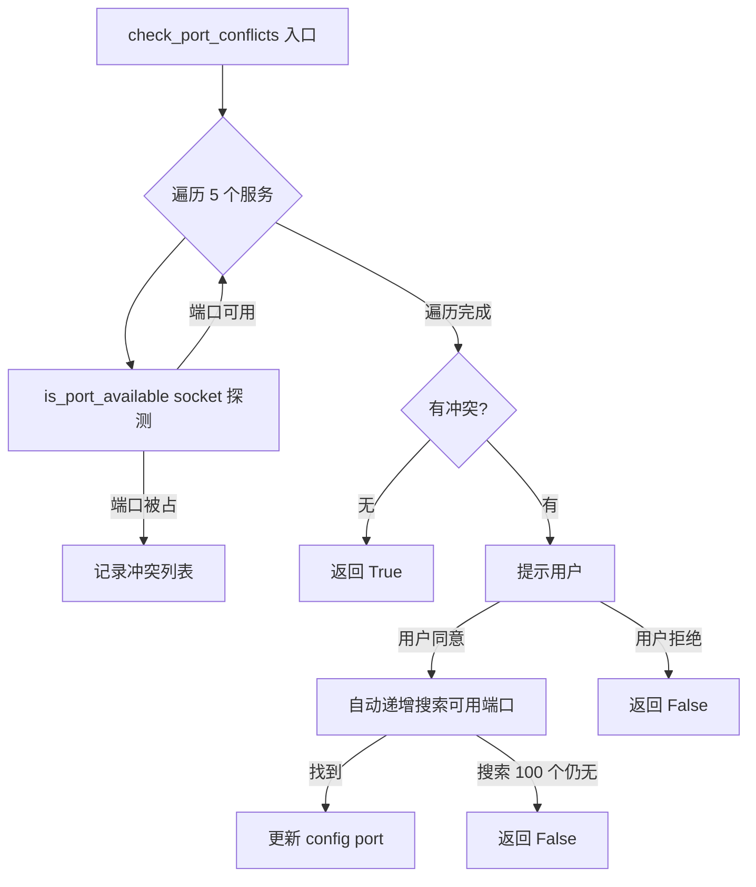
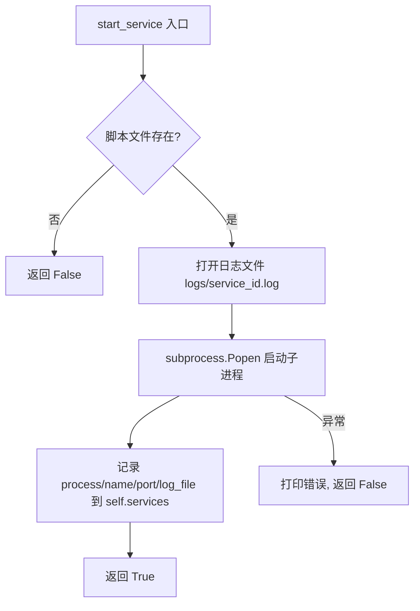
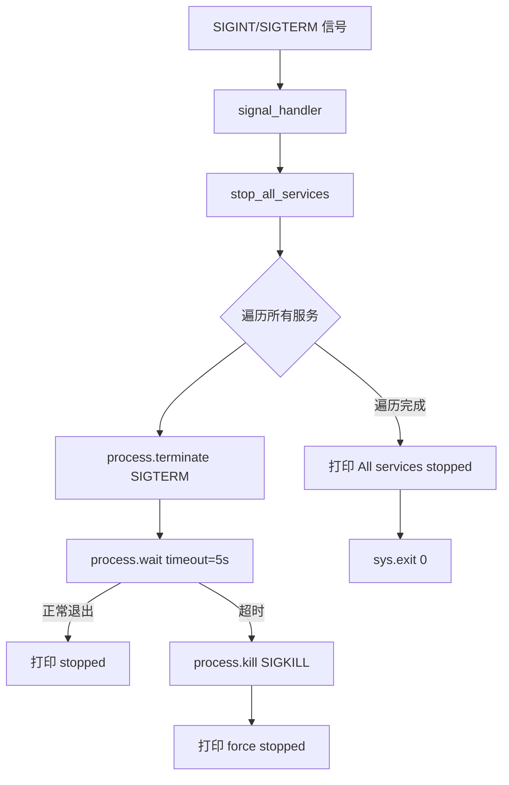

# PD-307.01 AI-Trader — MCPServiceManager 五服务生命周期管理

> 文档编号：PD-307.01
> 来源：AI-Trader `agent_tools/start_mcp_services.py`
> GitHub：https://github.com/HKUDS/AI-Trader.git
> 问题域：PD-307 MCP 服务生命周期管理 MCP Service Lifecycle
> 状态：可复用方案

---

## 第 1 章 问题与动机

### 1.1 核心问题

AI-Trader 是一个基于 LLM 的自动交易系统，其 Agent 通过 MCP（Model Context Protocol）协议调用 5 个独立微服务获取行情、执行交易、搜索新闻和数学计算。这些服务以独立 Python 进程运行，各自监听不同端口。核心挑战在于：

1. **端口冲突**：5 个服务分别占用 8000-8005 端口，开发环境中端口经常被其他进程占用
2. **启动顺序与健康确认**：Agent 必须在所有 MCP 服务就绪后才能初始化 `MultiServerMCPClient`，否则工具加载失败
3. **进程生命周期**：子进程可能意外退出（OOM、异常），需要监控和报告
4. **优雅关闭**：Ctrl+C 或 SIGTERM 时必须清理所有子进程，避免僵尸进程占用端口

### 1.2 AI-Trader 的解法概述

AI-Trader 用一个 `MCPServiceManager` 类集中管理 5 个 FastMCP 微服务的完整生命周期：

1. **环境变量驱动端口配置** — 每个服务端口通过 `os.getenv()` 读取，支持外部覆盖（`start_mcp_services.py:26-32`）
2. **启动前端口冲突检测** — socket 探测 + 交互式自动分配（`start_mcp_services.py:59-106`）
3. **子进程启动与日志重定向** — `subprocess.Popen` 启动，stdout/stderr 重定向到文件（`start_mcp_services.py:108-133`）
4. **启动后健康检查** — 等待 3 秒后 socket 连接探测每个端口（`start_mcp_services.py:135-158`）
5. **keep-alive 轮询监控** — 5 秒间隔检测子进程存活，全部退出时自动关闭（`start_mcp_services.py:224-248`）
6. **信号处理优雅关闭** — SIGINT/SIGTERM → terminate → 5 秒超时 → kill（`start_mcp_services.py:49-52, 251-266`）

### 1.3 设计思想

| 设计原则 | 具体实现 | 理由 | 替代方案 |
|----------|----------|------|----------|
| 环境变量优先 | `os.getenv("MATH_HTTP_PORT", "8000")` 每个服务独立端口变量 | 容器化部署时端口映射灵活 | 配置文件（YAML/JSON） |
| 启动前检测 | `is_port_available()` socket 探测 + 交互式自动分配 | 避免启动后才发现端口冲突浪费时间 | 直接启动，失败重试 |
| 进程级隔离 | 每个 MCP 服务独立 Python 进程 | 服务间故障隔离，单个崩溃不影响其他 | 线程池 / 单进程多路复用 |
| 两阶段关闭 | terminate(SIGTERM) → wait(5s) → kill(SIGKILL) | 给服务优雅清理的机会，超时强杀兜底 | 直接 kill / 无超时等待 |
| 被动监控 | keep_alive 轮询 `process.poll()` 检测退出 | 实现简单，无需额外依赖 | watchdog 库 / systemd |

---

## 第 2 章 源码实现分析

### 2.1 架构概览

AI-Trader 的 MCP 服务架构是一个典型的"管理进程 + N 个工作进程"模式：

```
┌─────────────────────────────────────────────────────────┐
│                  MCPServiceManager                       │
│              (start_mcp_services.py)                     │
│                                                          │
│  ┌──────────┐  ┌──────────┐  ┌──────────┐              │
│  │ 端口检测  │→│ 批量启动  │→│ 健康检查  │→ keep_alive  │
│  └──────────┘  └──────────┘  └──────────┘   (轮询)     │
│       ↓              ↓             ↓            ↓        │
│  ┌─────────────────────────────────────────────────┐    │
│  │              signal_handler                      │    │
│  │         SIGINT/SIGTERM → stop_all               │    │
│  └─────────────────────────────────────────────────┘    │
└─────────────────────────────────────────────────────────┘
        │           │           │          │          │
   ┌────┴───┐  ┌───┴────┐  ┌──┴───┐  ┌──┴───┐  ┌──┴────┐
   │  Math  │  │ Search │  │Trade │  │Price │  │Crypto │
   │ :8000  │  │ :8001  │  │:8002 │  │:8003 │  │:8005  │
   │FastMCP │  │FastMCP │  │FastMCP│  │FastMCP│  │FastMCP│
   └────────┘  └────────┘  └──────┘  └──────┘  └───────┘
        ↑           ↑           ↑          ↑          ↑
        └───────────┴───────────┴──────────┴──────────┘
                    MultiServerMCPClient
                   (base_agent.py:354)
```

每个 FastMCP 服务是一个独立的 HTTP 服务器，通过 `streamable-http` 传输协议暴露 MCP 工具。Agent 端通过 `langchain_mcp_adapters.client.MultiServerMCPClient` 统一连接所有服务。

### 2.2 核心实现

#### 2.2.1 端口冲突检测与自动分配



对应源码 `agent_tools/start_mcp_services.py:59-106`：

```python
def is_port_available(self, port):
    """Check if a port is available"""
    import socket
    try:
        sock = socket.socket(socket.AF_INET, socket.SOCK_STREAM)
        sock.settimeout(1)
        result = sock.connect_ex(("localhost", port))
        sock.close()
        return result != 0  # Port is available if connection failed
    except:
        return False

def check_port_conflicts(self):
    """Check for port conflicts before starting services"""
    conflicts = []
    for service_id, config in self.service_configs.items():
        port = config["port"]
        if not self.is_port_available(port):
            conflicts.append((config["name"], port))
    if conflicts:
        response = input("\n❓ Do you want to automatically find available ports? (y/n): ")
        if response.lower() == "y":
            for service_id, config in self.service_configs.items():
                port = config["port"]
                if not self.is_port_available(port):
                    new_port = port
                    while not self.is_port_available(new_port):
                        new_port += 1
                        if new_port > port + 100:
                            return False
                    config["port"] = new_port
                    self.ports[service_id] = new_port
            return True
    return True
```

关键设计：端口搜索范围限制在 `port + 100` 以内（`start_mcp_services.py:96`），防止无限搜索。冲突检测使用 `connect_ex` 而非 `bind`，因为只需判断端口是否被占用，不需要实际绑定。

#### 2.2.2 子进程启动与日志重定向



对应源码 `agent_tools/start_mcp_services.py:108-133`：

```python
def start_service(self, service_id, config):
    """Start a single service"""
    script_path = config["script"]
    service_name = config["name"]
    port = config["port"]

    if not Path(script_path).exists():
        print(f"❌ Script file not found: {script_path}")
        return False

    try:
        log_file = self.log_dir / f"{service_id}.log"
        with open(log_file, "w") as f:
            process = subprocess.Popen(
                [sys.executable, script_path],
                stdout=f, stderr=subprocess.STDOUT,
                cwd=os.getcwd()
            )
        self.services[service_id] = {
            "process": process,
            "name": service_name,
            "port": port,
            "log_file": log_file
        }
        print(f"✅ {service_name} service started (PID: {process.pid}, Port: {port})")
        return True
    except Exception as e:
        print(f"❌ Failed to start {service_name} service: {e}")
        return False
```

注意 `sys.executable` 的使用（`start_mcp_services.py:123`）——确保子进程使用与管理进程相同的 Python 解释器，避免虚拟环境不一致问题。`stderr=subprocess.STDOUT` 将错误输出合并到同一日志文件。

#### 2.2.3 健康检查与 keep-alive 监控

健康检查采用双重验证：先检查进程是否存活（`process.poll()`），再做 socket 连接探测（`start_mcp_services.py:135-158`）。

keep-alive 循环每 5 秒轮询一次（`start_mcp_services.py:224-248`），检测到服务退出时打印警告但不自动重启——只有全部服务退出时才终止管理进程。这是一个"报告但不干预"的策略。

#### 2.2.4 两阶段优雅关闭



对应源码 `agent_tools/start_mcp_services.py:251-266`：

```python
def stop_all_services(self):
    """Stop all services"""
    for service_id, service in self.services.items():
        try:
            service["process"].terminate()
            service["process"].wait(timeout=5)
            print(f"✅ {service['name']} service stopped")
        except subprocess.TimeoutExpired:
            service["process"].kill()
            print(f"🔨 {service['name']} service force stopped")
        except Exception as e:
            print(f"❌ Error stopping {service['name']} service: {e}")
```

### 2.3 实现细节

**FastMCP 服务端统一模式**：每个工具服务遵循相同的启动模式（以 `tool_math.py:42-44` 为例）：

```python
if __name__ == "__main__":
    port = int(os.getenv("MATH_HTTP_PORT", "8000"))
    mcp.run(transport="streamable-http", port=port)
```

所有 5 个服务都使用 `fastmcp.FastMCP` 框架，通过 `streamable-http` 传输协议暴露工具。端口从环境变量读取，与 `MCPServiceManager` 的端口配置保持一致。

**Agent 端连接配置**（`agent/base_agent/base_agent.py:309-328`）：

```python
def _get_default_mcp_config(self) -> Dict[str, Dict[str, Any]]:
    return {
        "math": {
            "transport": "streamable_http",
            "url": f"http://localhost:{os.getenv('MATH_HTTP_PORT', '8000')}/mcp",
        },
        "stock_local": {
            "transport": "streamable_http",
            "url": f"http://localhost:{os.getenv('GETPRICE_HTTP_PORT', '8003')}/mcp",
        },
        # ... 其他服务
    }
```

Agent 通过 `langchain_mcp_adapters.client.MultiServerMCPClient` 连接所有 MCP 服务，如果服务未启动会抛出 `RuntimeError` 并提示用户运行 `start_mcp_services.py`（`base_agent.py:372-377`）。

**服务配置注册表**（`start_mcp_services.py:36-43`）：

```python
self.service_configs = {
    "math": {"script": os.path.join(mcp_server_dir, "tool_math.py"),
             "name": "Math", "port": self.ports["math"]},
    "search": {"script": os.path.join(mcp_server_dir, "tool_alphavantage_news.py"),
               "name": "Search", "port": self.ports["search"]},
    "trade": {"script": os.path.join(mcp_server_dir, "tool_trade.py"),
              "name": "TradeTools", "port": self.ports["trade"]},
    "price": {"script": os.path.join(mcp_server_dir, "tool_get_price_local.py"),
              "name": "LocalPrices", "port": self.ports["price"]},
    "crypto": {"script": os.path.join(mcp_server_dir, "tool_crypto_trade.py"),
               "name": "CryptoTradeTools", "port": self.ports["crypto"]},
}
```

这是一个声明式的服务注册表，每个条目包含脚本路径、显示名称和端口号。新增服务只需在此字典中添加一行。

---

## 第 3 章 迁移指南

### 3.1 迁移清单

**阶段 1：基础服务管理器**

- [ ] 创建 `ServiceManager` 类，包含 `services` 字典和 `running` 标志
- [ ] 实现 `is_port_available()` socket 探测方法
- [ ] 实现 `check_port_conflicts()` 端口冲突检测（可去掉交互式 input，改为自动分配）
- [ ] 实现 `start_service()` 子进程启动 + 日志重定向
- [ ] 实现 `signal_handler()` 注册 SIGINT/SIGTERM

**阶段 2：健康检查与监控**

- [ ] 实现 `check_service_health()` 双重验证（进程存活 + 端口响应）
- [ ] 实现 `keep_alive()` 轮询监控循环
- [ ] 实现 `stop_all_services()` 两阶段关闭

**阶段 3：与 Agent 集成**

- [ ] 在 Agent 初始化前调用 `start_all_services()` 或确认服务已运行
- [ ] 配置 MCP 客户端连接参数与 ServiceManager 端口一致
- [ ] Agent 退出时调用 `stop_all_services()` 清理

### 3.2 适配代码模板

以下是一个可直接复用的通用 MCP 服务管理器模板，去掉了 AI-Trader 的交互式 input，改为全自动端口分配：

```python
"""通用 MCP 服务生命周期管理器 — 从 AI-Trader MCPServiceManager 迁移"""

import os
import signal
import socket
import subprocess
import sys
import time
from dataclasses import dataclass, field
from pathlib import Path
from typing import Dict, Optional


@dataclass
class ServiceConfig:
    """单个 MCP 服务的配置"""
    script: str          # Python 脚本路径
    name: str            # 服务显示名称
    port: int            # 监听端口
    env_var: str = ""    # 端口环境变量名（可选）


@dataclass
class ServiceState:
    """运行中服务的状态"""
    process: subprocess.Popen
    config: ServiceConfig
    log_file: Path


class MCPServiceLifecycle:
    """MCP 服务生命周期管理器

    功能：端口冲突检测 → 批量启动 → 健康检查 → keep-alive 监控 → 优雅关闭
    """

    def __init__(
        self,
        configs: Dict[str, ServiceConfig],
        log_dir: str = "./logs",
        health_check_timeout: float = 1.0,
        health_check_wait: float = 3.0,
        keepalive_interval: float = 5.0,
        shutdown_timeout: float = 5.0,
        port_search_range: int = 100,
    ):
        self.configs = configs
        self.log_dir = Path(log_dir)
        self.log_dir.mkdir(exist_ok=True)
        self.services: Dict[str, ServiceState] = {}
        self.running = True

        # 可调参数
        self._health_timeout = health_check_timeout
        self._health_wait = health_check_wait
        self._keepalive_interval = keepalive_interval
        self._shutdown_timeout = shutdown_timeout
        self._port_range = port_search_range

        # 注册信号处理
        signal.signal(signal.SIGINT, self._signal_handler)
        signal.signal(signal.SIGTERM, self._signal_handler)

    # ── 端口检测 ──────────────────────────────────────
    def _is_port_available(self, port: int) -> bool:
        try:
            sock = socket.socket(socket.AF_INET, socket.SOCK_STREAM)
            sock.settimeout(self._health_timeout)
            result = sock.connect_ex(("localhost", port))
            sock.close()
            return result != 0
        except OSError:
            return False

    def _resolve_ports(self) -> bool:
        """检测并自动解决端口冲突"""
        for sid, cfg in self.configs.items():
            if not self._is_port_available(cfg.port):
                original = cfg.port
                for offset in range(1, self._port_range + 1):
                    candidate = original + offset
                    if self._is_port_available(candidate):
                        cfg.port = candidate
                        print(f"⚠️  {cfg.name}: 端口 {original} 被占用，自动切换到 {candidate}")
                        break
                else:
                    print(f"❌ {cfg.name}: 在 {original}-{original + self._port_range} 范围内无可用端口")
                    return False
        return True

    # ── 启动 ──────────────────────────────────────────
    def _start_one(self, sid: str, cfg: ServiceConfig) -> bool:
        if not Path(cfg.script).exists():
            print(f"❌ 脚本不存在: {cfg.script}")
            return False
        log_file = self.log_dir / f"{sid}.log"
        try:
            env = os.environ.copy()
            if cfg.env_var:
                env[cfg.env_var] = str(cfg.port)
            proc = subprocess.Popen(
                [sys.executable, cfg.script],
                stdout=open(log_file, "w"),
                stderr=subprocess.STDOUT,
                env=env,
            )
            self.services[sid] = ServiceState(process=proc, config=cfg, log_file=log_file)
            print(f"✅ {cfg.name} 已启动 (PID={proc.pid}, Port={cfg.port})")
            return True
        except Exception as e:
            print(f"❌ {cfg.name} 启动失败: {e}")
            return False

    def start_all(self) -> int:
        """启动所有服务，返回成功数量"""
        if not self._resolve_ports():
            return 0
        ok = sum(self._start_one(sid, cfg) for sid, cfg in self.configs.items())
        if ok > 0:
            time.sleep(self._health_wait)
            healthy = self._check_all_health()
            print(f"🏥 健康检查: {healthy}/{ok} 服务就绪")
        return ok

    # ── 健康检查 ──────────────────────────────────────
    def _check_health(self, sid: str) -> bool:
        state = self.services.get(sid)
        if not state or state.process.poll() is not None:
            return False
        try:
            sock = socket.socket(socket.AF_INET, socket.SOCK_STREAM)
            sock.settimeout(self._health_timeout)
            result = sock.connect_ex(("localhost", state.config.port))
            sock.close()
            return result == 0
        except OSError:
            return False

    def _check_all_health(self) -> int:
        return sum(1 for sid in self.services if self._check_health(sid))

    # ── keep-alive ────────────────────────────────────
    def keep_alive(self):
        """阻塞式监控循环"""
        try:
            while self.running:
                time.sleep(self._keepalive_interval)
                dead = [s.config.name for s in self.services.values()
                        if s.process.poll() is not None]
                if dead:
                    print(f"⚠️  服务异常退出: {', '.join(dead)}")
                if len(dead) == len(self.services):
                    self.running = False
        except KeyboardInterrupt:
            pass
        finally:
            self.stop_all()

    # ── 关闭 ──────────────────────────────────────────
    def _signal_handler(self, signum, frame):
        self.stop_all()
        sys.exit(0)

    def stop_all(self):
        """两阶段优雅关闭"""
        for sid, state in self.services.items():
            try:
                state.process.terminate()
                state.process.wait(timeout=self._shutdown_timeout)
            except subprocess.TimeoutExpired:
                state.process.kill()
            except Exception:
                pass
        self.services.clear()
```

### 3.3 适用场景

| 场景 | 适用度 | 说明 |
|------|--------|------|
| 多 MCP 工具服务的 Agent 系统 | ⭐⭐⭐ | 直接适用，核心场景 |
| 开发环境本地多服务启动 | ⭐⭐⭐ | 替代 docker-compose 的轻量方案 |
| CI/CD 集成测试环境 | ⭐⭐ | 需要去掉交互式 input，改为全自动 |
| 生产环境部署 | ⭐ | 生产环境建议用 systemd/supervisor/k8s，不用自建管理器 |
| 单服务场景 | ⭐ | 杀鸡用牛刀，直接启动即可 |

---

## 第 4 章 测试用例

```python
"""基于 AI-Trader MCPServiceManager 真实接口的测试用例"""

import os
import signal
import socket
import subprocess
import sys
import time
from pathlib import Path
from unittest.mock import MagicMock, patch

import pytest


class TestPortDetection:
    """端口检测相关测试"""

    def test_available_port_returns_true(self):
        """未被占用的端口应返回 True"""
        # 找一个大概率空闲的端口
        sock = socket.socket(socket.AF_INET, socket.SOCK_STREAM)
        sock.bind(("localhost", 0))
        port = sock.getsockname()[1]
        sock.close()
        # 端口已释放，应该可用
        from start_mcp_services import MCPServiceManager
        mgr = MCPServiceManager.__new__(MCPServiceManager)
        assert mgr.is_port_available(port) is True

    def test_occupied_port_returns_false(self):
        """被占用的端口应返回 False"""
        sock = socket.socket(socket.AF_INET, socket.SOCK_STREAM)
        sock.bind(("localhost", 0))
        sock.listen(1)
        port = sock.getsockname()[1]
        try:
            from start_mcp_services import MCPServiceManager
            mgr = MCPServiceManager.__new__(MCPServiceManager)
            assert mgr.is_port_available(port) is False
        finally:
            sock.close()

    def test_auto_port_allocation_within_range(self):
        """自动端口分配应在 +100 范围内找到可用端口"""
        base_port = 19000
        # 占用 base_port
        sock = socket.socket(socket.AF_INET, socket.SOCK_STREAM)
        sock.bind(("localhost", base_port))
        sock.listen(1)
        try:
            from start_mcp_services import MCPServiceManager
            mgr = MCPServiceManager.__new__(MCPServiceManager)
            new_port = base_port
            while not mgr.is_port_available(new_port):
                new_port += 1
                if new_port > base_port + 100:
                    break
            assert new_port <= base_port + 100
            assert new_port != base_port
        finally:
            sock.close()


class TestServiceLifecycle:
    """服务生命周期测试"""

    def test_start_service_with_missing_script(self, tmp_path):
        """脚本不存在时 start_service 应返回 False"""
        from start_mcp_services import MCPServiceManager
        mgr = MCPServiceManager.__new__(MCPServiceManager)
        mgr.services = {}
        mgr.log_dir = tmp_path / "logs"
        mgr.log_dir.mkdir()
        config = {"script": "/nonexistent/path.py", "name": "Test", "port": 9999}
        assert mgr.start_service("test", config) is False

    def test_stop_all_terminates_processes(self):
        """stop_all_services 应对所有进程调用 terminate"""
        from start_mcp_services import MCPServiceManager
        mgr = MCPServiceManager.__new__(MCPServiceManager)
        mock_proc = MagicMock()
        mock_proc.terminate = MagicMock()
        mock_proc.wait = MagicMock()
        mgr.services = {"svc1": {"process": mock_proc, "name": "Svc1", "port": 8000}}
        mgr.stop_all_services()
        mock_proc.terminate.assert_called_once()

    def test_force_kill_on_timeout(self):
        """terminate 超时后应调用 kill"""
        from start_mcp_services import MCPServiceManager
        mgr = MCPServiceManager.__new__(MCPServiceManager)
        mock_proc = MagicMock()
        mock_proc.terminate = MagicMock()
        mock_proc.wait = MagicMock(side_effect=subprocess.TimeoutExpired(cmd="test", timeout=5))
        mock_proc.kill = MagicMock()
        mgr.services = {"svc1": {"process": mock_proc, "name": "Svc1", "port": 8000}}
        mgr.stop_all_services()
        mock_proc.kill.assert_called_once()


class TestHealthCheck:
    """健康检查测试"""

    def test_health_check_dead_process(self):
        """已退出的进程健康检查应返回 False"""
        from start_mcp_services import MCPServiceManager
        mgr = MCPServiceManager.__new__(MCPServiceManager)
        mock_proc = MagicMock()
        mock_proc.poll.return_value = 1  # 已退出
        mgr.services = {"svc1": {"process": mock_proc, "name": "Svc1", "port": 8000}}
        assert mgr.check_service_health("svc1") is False

    def test_health_check_unknown_service(self):
        """不存在的服务健康检查应返回 False"""
        from start_mcp_services import MCPServiceManager
        mgr = MCPServiceManager.__new__(MCPServiceManager)
        mgr.services = {}
        assert mgr.check_service_health("nonexistent") is False
```

---

## 第 5 章 跨域关联

| 关联域 | 关系类型 | 说明 |
|--------|----------|------|
| PD-04 工具系统 | 依赖 | MCPServiceManager 管理的 5 个 FastMCP 服务就是 Agent 的工具系统，服务不可用则工具不可用 |
| PD-03 容错与重试 | 协同 | Agent 端 `_ainvoke_with_retry` 提供 LLM 调用重试，但 MCP 服务本身无自动重启机制，两者互补 |
| PD-11 可观测性 | 协同 | 每个服务的 stdout/stderr 重定向到独立日志文件，keep-alive 循环提供进程级存活监控 |
| PD-05 沙箱隔离 | 协同 | 进程级隔离确保单个 MCP 服务崩溃不影响其他服务和管理进程 |

---

## 第 6 章 来源文件索引

| 文件 | 行范围 | 关键实现 |
|------|--------|----------|
| `agent_tools/start_mcp_services.py` | L20-L52 | MCPServiceManager 类定义、端口配置、信号注册 |
| `agent_tools/start_mcp_services.py` | L59-L106 | 端口冲突检测与自动分配 |
| `agent_tools/start_mcp_services.py` | L108-L133 | 子进程启动与日志重定向 |
| `agent_tools/start_mcp_services.py` | L135-L158 | 健康检查（进程存活 + socket 探测） |
| `agent_tools/start_mcp_services.py` | L160-L201 | start_all_services 编排流程 |
| `agent_tools/start_mcp_services.py` | L224-L248 | keep_alive 轮询监控 |
| `agent_tools/start_mcp_services.py` | L251-L266 | 两阶段优雅关闭 |
| `agent_tools/tool_math.py` | L42-L44 | FastMCP 服务端启动模式示例 |
| `agent_tools/tool_trade.py` | L440-L441 | TradeTools 服务端口配置 |
| `agent/base_agent/base_agent.py` | L309-L328 | Agent 端 MCP 客户端连接配置 |
| `agent/base_agent/base_agent.py` | L352-L377 | MultiServerMCPClient 初始化与错误处理 |
| `scripts/main.sh` | L22-L25 | Shell 脚本中的 MCP 服务启动调用 |

---

## 第 7 章 横向对比维度

> **重要：** 本章用于自动填充 Butcher Wiki 的横向对比表。

```json comparison_data
{
  "project": "AI-Trader",
  "dimensions": {
    "服务发现": "环境变量驱动端口 + 声明式 service_configs 字典注册",
    "端口管理": "启动前 socket 探测 + 交互式自动递增分配（范围 +100）",
    "健康检查": "双重验证：process.poll() 存活 + socket connect_ex 端口响应",
    "进程监控": "keep_alive 5 秒轮询 poll()，报告但不自动重启",
    "优雅关闭": "SIGINT/SIGTERM → terminate → wait(5s) → kill 两阶段",
    "日志管理": "每服务独立 log 文件，stderr 合并到 stdout",
    "传输协议": "FastMCP streamable-http，Agent 端 langchain_mcp_adapters 连接"
  }
}
```

### 域元数据补充

```json domain_metadata
{
  "solution_summary": "AI-Trader 用 MCPServiceManager 集中管理 5 个 FastMCP 微服务，通过 socket 探测端口冲突、subprocess.Popen 启动子进程、双重健康检查和两阶段 terminate→kill 优雅关闭实现完整生命周期管理",
  "description": "MCP 微服务集群的集中式进程管理与端口编排",
  "sub_problems": [
    "多服务端口环境变量统一管理",
    "日志文件重定向与隔离"
  ],
  "best_practices": [
    "使用 sys.executable 确保子进程与管理进程使用同一 Python 解释器",
    "端口自动分配应设置搜索范围上限防止无限循环",
    "两阶段关闭：先 terminate 给服务清理机会，超时再 kill 兜底"
  ]
}
```
