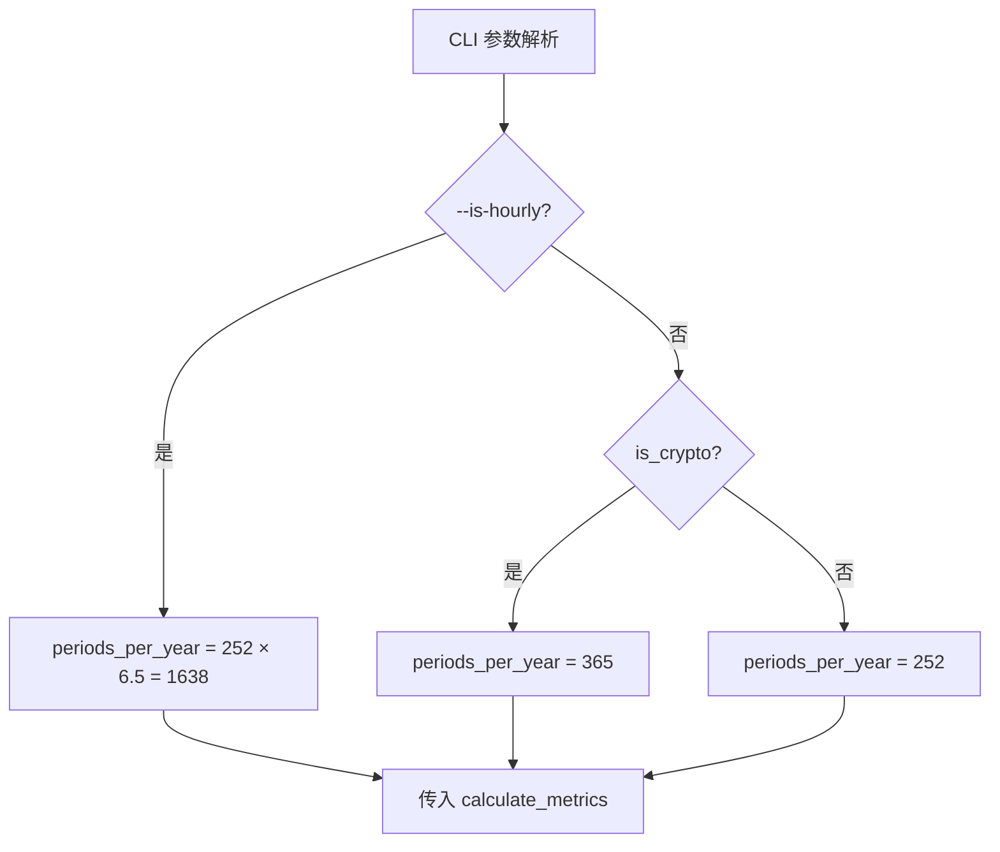
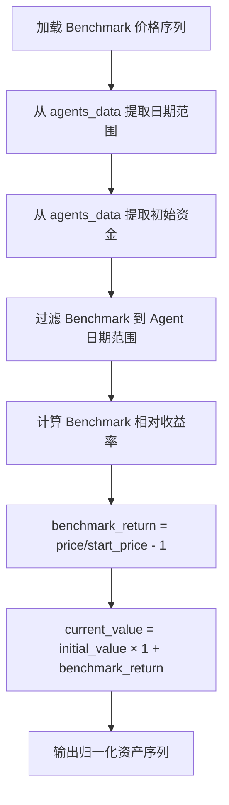

# PD-308.01 AI-Trader — 多市场多频率绩效评估体系

> 文档编号：PD-308.01
> 来源：AI-Trader `tools/calculate_metrics.py` `tools/plot_metrics.py` `scripts/precompute_frontend_cache.py`
> GitHub：https://github.com/HKUDS/AI-Trader.git
> 问题域：PD-308 绩效评估体系 Performance Benchmarking
> 状态：可复用方案

---

## 第 1 章 问题与动机

### 1.1 核心问题

量化交易系统需要一套标准化的绩效评估体系来回答"AI Agent 到底赚不赚钱"这个核心问题。但现实中面临三重挑战：

1. **多市场差异**：美股（NASDAQ 100）、A 股（SSE 50）、加密货币（BITWISE10）的交易规则、交易日历、初始资金完全不同，不能用同一套参数直接对比
2. **多频率年化**：日线交易（252 天/年）和小时线交易（252×6.5=1638 周期/年）的年化因子差异巨大，Sharpe/Sortino/Vol 等指标的年化处理必须正确
3. **Benchmark 对齐**：Agent 的交易时间戳和 Benchmark（QQQ/SSE 50 指数）的时间戳粒度不同，需要智能对齐才能做公平对比

AI-Trader 的绩效评估体系解决了这三个问题，实现了跨市场、跨频率的标准化评估。

### 1.2 AI-Trader 的解法概述

1. **统一指标计算引擎**：`calculate_metrics()` 函数接受 `periods_per_year` 参数，一套公式适配所有市场频率（`tools/calculate_metrics.py:194`）
2. **三市场自动检测**：通过持仓符号自动识别 crypto/stock/A-stock 市场类型，选择对应的年化因子（`tools/calculate_metrics.py:274-293`）
3. **双层价格查找**：先精确匹配时间戳，再回退到最近历史价格，处理小时线/日线混合场景（`tools/calculate_metrics.py:36-98`）
4. **Benchmark 智能对齐**：从 Agent 数据推断日期范围和初始资金，将 Benchmark 收益率归一化到相同起点（`scripts/precompute_frontend_cache.py:410-496`）
5. **滚动指标可视化**：expanding window 计算 CR/SR/Vol/MDD 四维时序图，支持多 Agent 叠加对比（`tools/plot_metrics.py:52-128`）

### 1.3 设计思想

| 设计原则 | 具体实现 | 理由 | 替代方案 |
|----------|----------|------|----------|
| 频率无关的年化 | `periods_per_year` 参数化，252/1638/365 三档 | 同一公式适配日线、小时线、全天候市场 | 硬编码 252，仅支持日线 |
| Sortino 优先于 Sharpe | SR 字段默认为 Sortino Ratio，Sharpe 作为附加指标 | 下行偏差比全波动率更能反映真实风险 | 仅用 Sharpe |
| Benchmark 归一化 | 用 Agent 初始资金缩放 Benchmark 起点 | 确保资产曲线在同一 Y 轴可视对比 | 独立 Y 轴，视觉误导 |
| 市场类型自动检测 | 扫描持仓符号集合与 crypto 符号表取交集 | 减少用户配置负担，CLI 一键计算 | 强制用户指定 `--is-crypto` |
| 缺失价格容错 | 美股跳过缺失价格，A 股整条记录作废 | A 股持仓联动性强，部分缺失会严重扭曲总值 | 统一跳过或统一作废 |

---

## 第 2 章 源码实现分析

### 2.1 架构概览

AI-Trader 的绩效评估分为三层：CLI 计算层、缓存预计算层、前端展示层。

```
┌─────────────────────────────────────────────────────────────┐
│                    前端展示层 (JS)                            │
│  asset-chart.js: 资产曲线 + Tooltip 排名                     │
│  portfolio.js: 持仓明细 + 交易历史                            │
└──────────────────────┬──────────────────────────────────────┘
                       │ 读取 {market}_cache.json
┌──────────────────────▼──────────────────────────────────────┐
│              缓存预计算层 (Python)                            │
│  precompute_frontend_cache.py                                │
│  ├─ process_agent_data_us()   → 美股 Agent 资产序列          │
│  ├─ process_agent_data_cn()   → A股 Agent 资产序列           │
│  ├─ process_benchmark_us()    → QQQ 归一化基准线              │
│  └─ process_benchmark_cn()    → SSE 50 归一化基准线           │
└──────────────────────┬──────────────────────────────────────┘
                       │ 读取 position.jsonl + price JSON
┌──────────────────────▼──────────────────────────────────────┐
│              CLI 计算层 (Python)                              │
│  calculate_metrics.py                                        │
│  ├─ calculate_portfolio_values()  → 逐时间戳组合估值          │
│  ├─ calculate_metrics()           → 10+ 指标一次性计算        │
│  └─ detect_market_type()          → 自动识别市场类型          │
│                                                              │
│  plot_metrics.py                                             │
│  └─ calculate_rolling_metrics()   → 滚动窗口四维指标          │
└─────────────────────────────────────────────────────────────┘
```

### 2.2 核心实现

#### 2.2.1 统一指标计算引擎

```mermaid
graph TD
    A[portfolio_df: 组合价值序列] --> B[计算逐期收益率 returns]
    B --> C[CR: 累计收益率]
    B --> D[年化收益率]
    B --> E[Vol: 年化波动率]
    B --> F{负收益存在?}
    F -->|是| G[Sortino: 下行偏差年化]
    F -->|否| H[Sortino = inf 或 0]
    B --> I[MDD: 最大回撤]
    D --> J[Calmar = 年化收益 / |MDD|]
    B --> K[Win Rate + Avg Win/Loss]
    C & G & E & I & J & K --> L[返回指标字典]
```

对应源码 `tools/calculate_metrics.py:194-271`：

```python
def calculate_metrics(portfolio_df, periods_per_year=252, risk_free_rate=0.0):
    values = portfolio_df['total_value'].values

    # 逐期收益率：简单收益率而非对数收益率
    returns = np.diff(values) / values[:-1]

    # 累计收益率
    cr = (values[-1] - values[0]) / values[0]

    # 年化收益率：几何年化
    num_periods = len(returns)
    years = num_periods / periods_per_year
    annualized_return = (1 + cr) ** (1 / years) - 1 if years > 0 else 0

    # 年化波动率
    vol = np.std(returns) * np.sqrt(periods_per_year) if len(returns) > 1 else 0

    # Sharpe Ratio
    excess_return = np.mean(returns) - (risk_free_rate / periods_per_year)
    sharpe = (excess_return / np.std(returns) * np.sqrt(periods_per_year)) if np.std(returns) > 0 else 0

    # Sortino Ratio：仅用负收益的标准差
    negative_returns = returns[returns < 0]
    if len(negative_returns) > 0:
        downside_std = np.std(negative_returns)
        sortino = excess_return / downside_std * np.sqrt(periods_per_year) if downside_std > 0 else 0
    else:
        sortino = float('inf') if np.mean(returns) > 0 else 0

    # 最大回撤：累积收益曲线的峰谷差
    cumulative = np.cumprod(1 + returns)
    running_max = np.maximum.accumulate(cumulative)
    drawdown = (cumulative - running_max) / running_max
    mdd = np.min(drawdown)

    # Calmar Ratio
    calmar = annualized_return / abs(mdd) if mdd != 0 else 0
```

关键设计点：
- `periods_per_year` 参数化使同一函数适配日线（252）、小时线（1638）、加密货币（365）
- Sortino 使用 `np.std(negative_returns)` 而非 `np.sqrt(mean(min(r,0)^2))`，这是 population std 而非 sample std
- MDD 基于累积乘积而非累积加和，正确处理复利效应

#### 2.2.2 多频率年化因子选择



对应源码 `tools/calculate_metrics.py:342-351`：

```python
    # Determine periods per year based on data frequency and market type
    if args.is_hourly:
        # Approximately 252 trading days * 6.5 hours per day
        periods_per_year = 252 * 6.5
    elif is_crypto:
        # Crypto markets trade 365 days a year
        periods_per_year = 365
    else:
        # Traditional stock markets: 252 trading days per year
        periods_per_year = 252
```

#### 2.2.3 Benchmark 归一化对齐



对应源码 `scripts/precompute_frontend_cache.py:410-488`：

```python
def process_benchmark_us(market_config, agents_data=None):
    # 从 Agent 数据推断初始资金和日期范围
    initial_value = 100000  # Default
    if agents_data:
        for agent_name, agent_data in agents_data.items():
            if agent_data.get('assetHistory'):
                initial_value = agent_data['assetHistory'][0]['value']
                agent_start = agent_data['assetHistory'][0]['date']
                agent_end = agent_data['assetHistory'][-1]['date']

    # 归一化：将 Benchmark 价格映射到 Agent 同等资金规模
    benchmark_start_price = None
    for date in dates:
        if start_date_filter and date < start_date_filter:
            continue
        close_price = float(time_series[date].get('4. close', 0))
        if benchmark_start_price is None:
            benchmark_start_price = close_price
        benchmark_return = (close_price - benchmark_start_price) / benchmark_start_price
        current_value = initial_value * (1 + benchmark_return)
```

### 2.3 实现细节

**双层价格查找策略**（`tools/calculate_metrics.py:36-98`）：

对于小时线数据，先尝试精确时间戳匹配，失败后回退到"最近的更早时间戳"。对于日线数据，先提取日期部分再匹配。这种双层策略解决了交易时间戳和价格数据时间戳不完全对齐的问题。

**A 股缺失价格处理**（`scripts/precompute_frontend_cache.py:207-209`）：

```python
    # For A-shares: return None if any price is missing
    if market == 'cn' and has_missing_price:
        return None
```

A 股采用"任一持仓缺价则整条作废"策略，因为 A 股持仓通常集中在少数股票，部分缺失会导致组合估值严重失真。美股则跳过缺失价格继续计算。

**滚动 Sortino 稳定性处理**（`tools/plot_metrics.py:80-101`）：

expanding window 计算 Sortino 时，设置最小下行标准差阈值 `0.0001` 防止除零爆炸，并将结果 clip 到 `[-20, 20]` 范围，避免早期数据点产生极端值。


---

## 第 3 章 迁移指南

### 3.1 迁移清单

**阶段 1：核心指标引擎（1 个文件）**
- [ ] 复制 `calculate_metrics()` 函数，修改 `periods_per_year` 为你的交易频率
- [ ] 确认输入 DataFrame 包含 `total_value` 列（逐时间戳的组合净值）
- [ ] 确认 `risk_free_rate` 参数（默认 0.0，美国市场可设为 0.05）

**阶段 2：组合估值（需要价格数据）**
- [ ] 实现 `calculate_portfolio_values()`：遍历持仓记录，逐时间戳查价格、算净值
- [ ] 实现价格查找函数：支持精确匹配 + 最近历史回退
- [ ] 处理缺失价格：决定跳过（美股模式）还是作废（A 股模式）

**阶段 3：Benchmark 对齐（可选）**
- [ ] 加载 Benchmark 价格序列
- [ ] 从 Agent 数据推断日期范围和初始资金
- [ ] 归一化 Benchmark 到相同资金起点

**阶段 4：可视化（可选）**
- [ ] 实现 expanding window 滚动指标计算
- [ ] 四维子图：CR / SR / Vol / MDD

### 3.2 适配代码模板

以下是一个可直接运行的最小化绩效计算模块：

```python
import numpy as np
import pandas as pd
from dataclasses import dataclass
from typing import Optional


@dataclass
class PerformanceMetrics:
    """量化交易绩效指标集合"""
    cumulative_return: float      # 累计收益率
    annualized_return: float      # 年化收益率
    sharpe_ratio: float           # Sharpe 比率
    sortino_ratio: float          # Sortino 比率
    volatility: float             # 年化波动率
    max_drawdown: float           # 最大回撤
    calmar_ratio: float           # Calmar 比率
    win_rate: float               # 胜率


def calculate_performance(
    portfolio_values: pd.Series,
    periods_per_year: int = 252,
    risk_free_rate: float = 0.0
) -> PerformanceMetrics:
    """
    从组合净值序列计算全套绩效指标。

    Args:
        portfolio_values: 逐时间戳的组合净值 Series
        periods_per_year: 年化因子（日线=252, 小时线=1638, 加密=365）
        risk_free_rate: 年化无风险利率

    Returns:
        PerformanceMetrics 数据类
    """
    values = portfolio_values.values
    returns = np.diff(values) / values[:-1]

    # 累计收益
    cr = (values[-1] - values[0]) / values[0]

    # 年化收益（几何）
    years = len(returns) / periods_per_year
    ann_ret = (1 + cr) ** (1 / years) - 1 if years > 0 else 0.0

    # 波动率
    vol = np.std(returns) * np.sqrt(periods_per_year)

    # Sharpe
    rf_per_period = risk_free_rate / periods_per_year
    excess = np.mean(returns) - rf_per_period
    sharpe = (excess / np.std(returns)) * np.sqrt(periods_per_year) if np.std(returns) > 0 else 0.0

    # Sortino
    neg_returns = returns[returns < 0]
    if len(neg_returns) > 0:
        downside_std = max(np.std(neg_returns), 1e-8)
        sortino = (excess / downside_std) * np.sqrt(periods_per_year)
    else:
        sortino = float('inf') if np.mean(returns) > 0 else 0.0

    # MDD
    cum = np.cumprod(1 + returns)
    running_max = np.maximum.accumulate(cum)
    mdd = np.min((cum - running_max) / running_max)

    # Calmar
    calmar = ann_ret / abs(mdd) if mdd != 0 else 0.0

    # Win Rate
    win_rate = np.mean(returns > 0) if len(returns) > 0 else 0.0

    return PerformanceMetrics(
        cumulative_return=cr,
        annualized_return=ann_ret,
        sharpe_ratio=sharpe,
        sortino_ratio=sortino,
        volatility=vol,
        max_drawdown=mdd,
        calmar_ratio=calmar,
        win_rate=win_rate,
    )


def normalize_benchmark(
    benchmark_prices: pd.Series,
    agent_initial_value: float,
    start_date: str,
    end_date: str,
) -> pd.Series:
    """
    将 Benchmark 价格序列归一化到 Agent 同等资金规模。

    Args:
        benchmark_prices: Benchmark 收盘价 Series（index 为日期）
        agent_initial_value: Agent 初始资金
        start_date: 对齐起始日期
        end_date: 对齐结束日期

    Returns:
        归一化后的 Benchmark 资产序列
    """
    filtered = benchmark_prices.loc[start_date:end_date]
    start_price = filtered.iloc[0]
    returns = (filtered - start_price) / start_price
    return agent_initial_value * (1 + returns)
```

### 3.3 适用场景

| 场景 | 适用度 | 说明 |
|------|--------|------|
| 多 Agent 竞技评估 | ⭐⭐⭐ | 核心场景，多个 LLM Agent 在相同条件下对比 |
| 单策略回测报告 | ⭐⭐⭐ | 指标计算引擎可独立使用 |
| 跨市场策略对比 | ⭐⭐⭐ | 年化因子参数化，天然支持多市场 |
| 实时交易监控 | ⭐⭐ | 需要改造为增量计算，当前是批量模式 |
| 高频交易（分钟级） | ⭐ | 需要调整 periods_per_year，当前最细粒度为小时 |

---

## 第 4 章 测试用例

```python
import numpy as np
import pandas as pd
import pytest


class TestCalculateMetrics:
    """基于 AI-Trader calculate_metrics() 函数签名的测试"""

    def _make_portfolio_df(self, values):
        """构造测试用 DataFrame"""
        dates = pd.date_range('2025-01-01', periods=len(values), freq='D')
        return pd.DataFrame({'date': dates, 'total_value': values})

    def test_positive_cumulative_return(self):
        """正常盈利路径：10000 → 11000，CR = 10%"""
        values = [10000, 10200, 10500, 10800, 11000]
        df = self._make_portfolio_df(values)
        # CR = (11000 - 10000) / 10000 = 0.10
        returns = np.diff(values) / np.array(values[:-1])
        cr = (values[-1] - values[0]) / values[0]
        assert abs(cr - 0.10) < 1e-6

    def test_max_drawdown_calculation(self):
        """最大回撤：先涨后跌再涨"""
        values = [10000, 12000, 9000, 11000]
        returns = np.diff(values) / np.array(values[:-1])
        cumulative = np.cumprod(1 + returns)
        running_max = np.maximum.accumulate(cumulative)
        drawdown = (cumulative - running_max) / running_max
        mdd = np.min(drawdown)
        # 从 12000 跌到 9000，回撤 = (9000/12000 - 1) = -25%
        assert mdd < -0.24  # 由于复利计算，略有差异

    def test_sortino_no_negative_returns(self):
        """全正收益时 Sortino 应为 inf"""
        values = [10000, 10100, 10200, 10300, 10400]
        returns = np.diff(values) / np.array(values[:-1])
        negative_returns = returns[returns < 0]
        assert len(negative_returns) == 0
        # Sortino = inf when mean > 0 and no negative returns
        mean_return = np.mean(returns)
        assert mean_return > 0

    def test_periods_per_year_hourly(self):
        """小时线年化因子 = 252 * 6.5 = 1638"""
        periods_per_year = 252 * 6.5
        assert periods_per_year == 1638.0

    def test_periods_per_year_crypto(self):
        """加密货币年化因子 = 365"""
        periods_per_year = 365
        assert periods_per_year == 365

    def test_benchmark_normalization(self):
        """Benchmark 归一化：起点对齐到 Agent 初始资金"""
        benchmark_prices = pd.Series(
            [100, 105, 110, 108],
            index=pd.date_range('2025-01-01', periods=4, freq='D')
        )
        agent_initial = 10000
        start_price = benchmark_prices.iloc[0]
        normalized = agent_initial * (1 + (benchmark_prices - start_price) / start_price)
        assert normalized.iloc[0] == 10000  # 起点对齐
        assert abs(normalized.iloc[1] - 10500) < 1e-6  # 5% 涨幅

    def test_zero_volatility_sharpe(self):
        """零波动率时 Sharpe 应为 0（避免除零）"""
        values = [10000, 10000, 10000, 10000]
        returns = np.diff(values) / np.array(values[:-1])
        std = np.std(returns)
        sharpe = 0 if std == 0 else (np.mean(returns) / std)
        assert sharpe == 0

    def test_calmar_ratio_no_drawdown(self):
        """无回撤时 Calmar 应为 0（MDD=0 时避免除零）"""
        values = [10000, 10100, 10200, 10300]
        returns = np.diff(values) / np.array(values[:-1])
        cumulative = np.cumprod(1 + returns)
        running_max = np.maximum.accumulate(cumulative)
        mdd = np.min((cumulative - running_max) / running_max)
        calmar = 0 if mdd == 0 else 1.0 / abs(mdd)
        assert calmar == 0  # 单调递增，MDD = 0
```


---

## 第 5 章 跨域关联

| 关联域 | 关系类型 | 说明 |
|--------|----------|------|
| PD-11 可观测性 | 协同 | 绩效指标是可观测性的核心输出，AI-Trader 的 `precompute_frontend_cache.py` 将指标预计算为 JSON 缓存供前端仪表盘消费 |
| PD-03 容错与重试 | 依赖 | 价格数据缺失时的容错策略（美股跳过 vs A 股作废）直接影响指标准确性 |
| PD-02 多 Agent 编排 | 协同 | 多 Agent 竞技场景下，绩效评估体系是编排结果的最终裁判，AI-Trader 支持 6+ Agent 并行评估 |
| PD-08 搜索与检索 | 依赖 | Agent 的交易决策依赖 Jina 搜索获取的市场情报，搜索质量间接影响绩效表现 |
| PD-04 工具系统 | 依赖 | 绩效计算依赖 MCP 工具链提供的价格查询和交易执行数据 |

---

## 第 6 章 来源文件索引

| 文件 | 行范围 | 关键实现 |
|------|--------|----------|
| `tools/calculate_metrics.py` | L1-L398 | 核心指标计算引擎：CR/SR/Vol/MDD/Sharpe/Calmar/WinRate |
| `tools/calculate_metrics.py` | L194-L271 | `calculate_metrics()` 主函数，10+ 指标一次性计算 |
| `tools/calculate_metrics.py` | L36-L98 | `get_price_at_date()` 双层价格查找（精确匹配 + 历史回退） |
| `tools/calculate_metrics.py` | L274-L293 | `detect_market_type()` 市场类型自动检测 |
| `tools/calculate_metrics.py` | L342-L351 | 三档年化因子选择逻辑 |
| `tools/plot_metrics.py` | L52-L128 | `calculate_rolling_metrics()` expanding window 滚动指标 |
| `tools/plot_metrics.py` | L80-L101 | Sortino 稳定性处理：最小阈值 + clip 范围 |
| `tools/plot_metrics.py` | L258-L306 | `plot_market_metrics()` 四维子图可视化 |
| `scripts/precompute_frontend_cache.py` | L190-L211 | `calculate_asset_value()` 组合估值 + A 股缺失价格处理 |
| `scripts/precompute_frontend_cache.py` | L410-L496 | `process_benchmark_us()` QQQ Benchmark 归一化 |
| `scripts/precompute_frontend_cache.py` | L499-L615 | `process_benchmark_cn()` SSE 50 Benchmark 归一化 + 小时线扩展 |
| `scripts/precompute_frontend_cache.py` | L618-L684 | `generate_cache_for_market()` 缓存生成 + 版本哈希 |
| `docs/config.yaml` | L1-L184 | 多市场配置：US/CN/CN_Hour 三市场 + 图表参数 |

---

## 第 7 章 横向对比维度

```json comparison_data
{
  "project": "AI-Trader",
  "dimensions": {
    "指标体系": "CR/Sortino/Vol/MDD/Calmar/Sharpe/WinRate 七指标全覆盖",
    "年化处理": "参数化 periods_per_year 三档：252(日线)/1638(小时线)/365(加密)",
    "Benchmark对齐": "从 Agent 数据推断初始资金和日期范围，归一化 Benchmark 起点",
    "多市场支持": "美股 NASDAQ-100 / A股 SSE-50 / 加密货币 BITWISE10 三市场",
    "可视化": "四维滚动子图(CR/SR/Vol/MDD) + 前端 Chart.js 资产曲线仪表盘",
    "缓存策略": "MD5 版本哈希 + JSON 预计算缓存，前端零计算直接渲染"
  }
}
```

### 域元数据补充

```json domain_metadata
{
  "solution_summary": "AI-Trader 用参数化 periods_per_year 三档年化因子 + Benchmark 归一化对齐，实现美股/A股/加密货币三市场七指标标准化评估",
  "description": "多 Agent 竞技场景下的跨市场标准化绩效裁判体系",
  "sub_problems": [
    "Benchmark 归一化对齐（不同初始资金和日期范围）",
    "缺失价格容错策略（跳过 vs 整条作废）",
    "滚动指标稳定性（expanding window 早期极端值抑制）"
  ],
  "best_practices": [
    "expanding window Sortino 设最小下行标准差阈值 0.0001 防除零爆炸",
    "Benchmark 用 Agent 初始资金缩放起点而非独立 Y 轴",
    "A 股持仓任一缺价则整条作废，避免部分估值失真"
  ]
}
```

