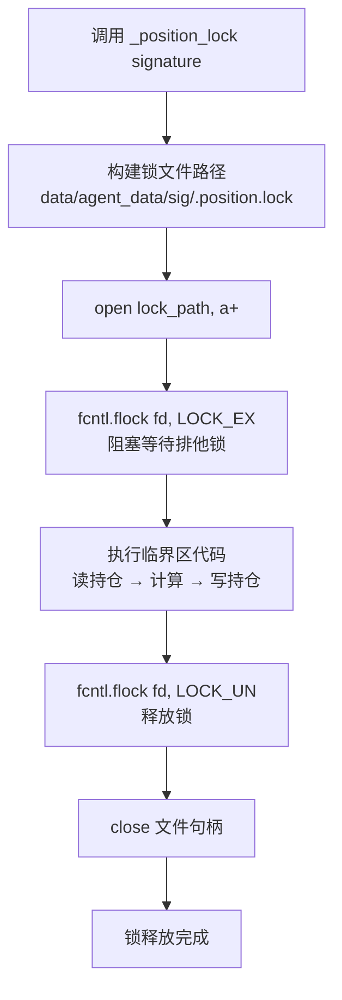
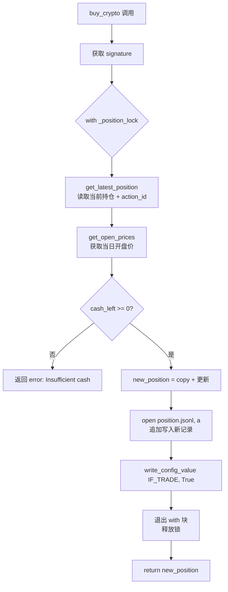
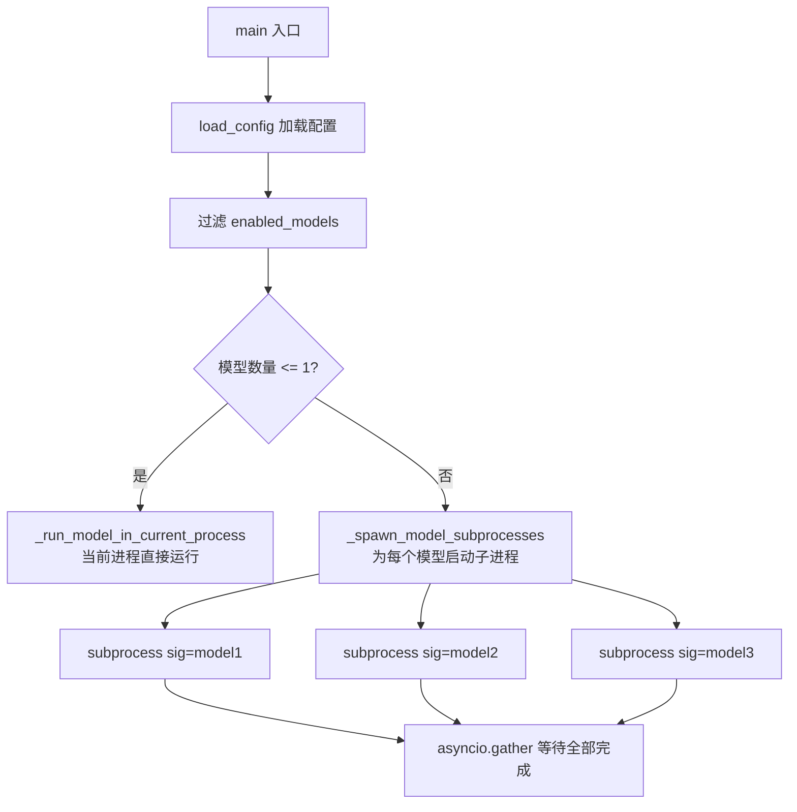

# PD-309.01 AI-Trader — fcntl 文件锁原子持仓更新与 asyncio 子进程并行

> 文档编号：PD-309.01
> 来源：AI-Trader `agent_tools/tool_trade.py` `agent_tools/tool_crypto_trade.py` `main_parrallel.py`
> GitHub：https://github.com/HKUDS/AI-Trader.git
> 问题域：PD-309 并发与文件锁 Concurrency & File Locking
> 状态：可复用方案

---

## 第 1 章 问题与动机

### 1.1 核心问题

AI-Trader 是一个多模型并行交易模拟系统，多个 LLM Agent（如 GPT-4o、Qwen3-Max 等）同时对同一市场执行买卖操作。每个 Agent 的持仓数据存储在 JSONL 文件中（`position.jsonl`），交易操作遵循"读取当前持仓 → 计算新持仓 → 追加写入"的三步模式。

当多个 Agent 进程并行运行时，如果两个进程同时读取同一个 `position.jsonl`，都拿到相同的 `current_action_id`，然后各自写入，就会产生：
- **ID 冲突**：两笔交易拿到相同的 action_id
- **持仓覆盖**：后写入的记录基于过时的持仓快照，导致前一笔交易的持仓变更丢失
- **资金不一致**：CASH 余额计算基于过时数据，可能出现"超额买入"

这是经典的 TOCTOU（Time-of-Check-to-Time-of-Use）竞态条件。

### 1.2 AI-Trader 的解法概述

AI-Trader 采用两层并发控制策略：

1. **进程级隔离**：`main_parrallel.py:171-188` 通过 `asyncio.create_subprocess_exec` 为每个模型签名（signature）启动独立子进程，每个子进程拥有独立的 `RUNTIME_ENV_PATH` 和 `SIGNATURE` 环境变量
2. **文件级互斥**：`agent_tools/tool_trade.py:23-52` 和 `agent_tools/tool_crypto_trade.py:23-40` 使用 `fcntl.flock(LOCK_EX)` 实现 per-signature 的排他文件锁，保护持仓文件的读-改-写原子性
3. **签名隔离**：每个 Agent 签名对应独立的数据目录（`data/agent_data/{signature}/`），锁文件也按签名隔离（`.position.lock`），不同签名之间无锁竞争
4. **JSONL 追加写入**：持仓变更以 append 模式写入 `position.jsonl`，配合递增 `action_id`，实现事务日志式的持仓追踪

### 1.3 设计思想

| 设计原则 | 具体实现 | 理由 | 替代方案 |
|----------|----------|------|----------|
| 跨进程同步用文件锁 | `fcntl.flock(LOCK_EX)` 排他锁 | 内存锁（threading.Lock）无法跨进程；文件锁由 OS 内核保证 | `multiprocessing.Lock`、Redis 分布式锁 |
| 锁粒度按签名隔离 | 每个 signature 独立 `.position.lock` | 不同模型操作不同持仓文件，无需全局锁 | 全局单锁（会成为瓶颈） |
| 追加写入而非覆盖 | `open(path, "a")` + JSONL 格式 | 追加写入天然幂等，不会破坏已有记录 | SQLite WAL、原子 rename |
| 子进程隔离运行时 | 每个子进程独立 `RUNTIME_ENV_PATH` | 避免共享 JSON 配置文件的竞态 | 环境变量传参、共享内存 |

---

## 第 2 章 源码实现分析

### 2.1 架构概览

AI-Trader 的并发架构分为两层：外层是进程编排，内层是文件锁保护。

```
┌─────────────────────────────────────────────────────────┐
│                  main_parrallel.py                       │
│  ┌─────────────┐  ┌─────────────┐  ┌─────────────┐     │
│  │ subprocess   │  │ subprocess   │  │ subprocess   │     │
│  │ sig=gpt-4o   │  │ sig=qwen3    │  │ sig=claude   │     │
│  └──────┬──────┘  └──────┬──────┘  └──────┬──────┘     │
│         │                │                │              │
│         ▼                ▼                ▼              │
│  ┌──────────────────────────────────────────────┐       │
│  │          MCP Tool Server (per-port)           │       │
│  │  tool_trade.py:8002  tool_crypto:8014         │       │
│  └──────────────────────────────────────────────┘       │
│         │                │                │              │
│         ▼                ▼                ▼              │
│  data/agent_data/    data/agent_data/   data/agent_data/ │
│    gpt-4o/             qwen3/             claude/        │
│    ├─ .position.lock   ├─ .position.lock  ├─ .position.lock
│    └─ position/        └─ position/       └─ position/   │
│       └─ position.jsonl   └─ position.jsonl  └─ ...     │
└─────────────────────────────────────────────────────────┘
```

### 2.2 核心实现

#### 2.2.1 文件锁上下文管理器



对应源码 `agent_tools/tool_trade.py:23-52`：

```python
def _position_lock(signature: str):
    """Context manager for file-based lock to serialize position updates per signature."""
    class _Lock:
        def __init__(self, name: str):
            # Prefer LOG_PATH so the lock file lives alongside the positions file
            log_path = get_config_value("LOG_PATH", "./data/agent_data")
            if os.path.isabs(log_path):
                base_dir = Path(log_path) / name
            else:
                if log_path.startswith("./data/"):
                    log_rel = log_path[7:]  # strip "./data/"
                else:
                    log_rel = log_path
                base_dir = Path(project_root) / "data" / log_rel / name
            base_dir.mkdir(parents=True, exist_ok=True)
            self.lock_path = base_dir / ".position.lock"
            self._fh = open(self.lock_path, "a+")
        def __enter__(self):
            fcntl.flock(self._fh.fileno(), fcntl.LOCK_EX)
            return self
        def __exit__(self, exc_type, exc, tb):
            try:
                fcntl.flock(self._fh.fileno(), fcntl.LOCK_UN)
            finally:
                self._fh.close()
    return _Lock(signature)
```

关键设计点：
- 锁文件使用 `a+` 模式打开，确保文件不存在时自动创建（`tool_trade.py:43`）
- `LOCK_EX` 是排他锁，同一时刻只有一个进程能持有（`tool_trade.py:45`）
- `__exit__` 中先 `LOCK_UN` 再 `close`，用 `try/finally` 确保句柄一定关闭（`tool_trade.py:48-51`）

#### 2.2.2 加密货币交易的完整锁保护



对应源码 `agent_tools/tool_crypto_trade.py:106-182`：

```python
    # Acquire lock for atomic read-modify-write on positions
    with _position_lock(signature):
        try:
            current_position, current_action_id = get_latest_position(today_date, signature)
        except Exception as e:
            print(e)
            return {"error": f"Failed to load latest position: {e}", ...}
        # ... 价格获取、条件校验 ...
        # Step 5: Execute buy operation, update position
        new_position = current_position.copy()
        new_position["CASH"] = round(cash_left, 4)
        new_position[symbol] = round(new_position[symbol] + amount, 4)
        # Step 6: Record transaction
        with open(position_file_path, "a") as f:
            f.write(json.dumps({
                "date": today_date,
                "id": current_action_id + 1,
                "this_action": {"action": "buy_crypto", "symbol": symbol, "amount": amount},
                "positions": new_position,
            }) + "\n")
        write_config_value("IF_TRADE", True)
    return new_position
```

注意：加密货币交易（`tool_crypto_trade.py`）将整个读-改-写周期都放在 `with _position_lock` 内部，这是正确的原子操作模式。

#### 2.2.3 股票交易的锁范围缺陷

对比 `agent_tools/tool_trade.py:134-225` 中的 `buy()` 函数：

```python
    # 锁只包裹了读取操作
    with _position_lock(signature):
        try:
            current_position, current_action_id = get_latest_position(today_date, signature)
        except Exception as e:
            return {"error": ...}
    # ⚠️ 锁已释放！以下操作在锁外执行
    try:
        this_symbol_price = get_open_prices(...)  # 无锁
    except KeyError:
        return {"error": ...}
    # ... 条件校验、持仓更新、文件写入都在锁外 ...
    with open(position_file_path, "a") as f:  # ⚠️ 写入也在锁外
        f.write(json.dumps({...}) + "\n")
```

这是一个实际存在的 bug：`tool_trade.py` 的 `buy()` 函数在锁释放后才执行写入，存在 TOCTOU 竞态窗口。而 `tool_crypto_trade.py` 的 `buy_crypto()` 则正确地将整个操作包裹在锁内。`sell()` 函数（`tool_trade.py:266-432`）甚至完全没有使用锁。

### 2.3 实现细节

#### 子进程并行编排

`main_parrallel.py:171-188` 实现了多模型并行执行：



对应源码 `main_parrallel.py:171-188`：

```python
async def _spawn_model_subprocesses(config_path, enabled_models):
    tasks = []
    python_exec = sys.executable
    this_file = str(Path(__file__).resolve())
    for model in enabled_models:
        signature = model.get("signature")
        if not signature:
            continue
        cmd = [python_exec, this_file]
        if config_path:
            cmd.append(str(config_path))
        cmd.extend(["--signature", signature])
        proc = await asyncio.create_subprocess_exec(*cmd)
        tasks.append(proc.wait())
    if not tasks:
        return
    await asyncio.gather(*tasks)
```

每个子进程通过 `--signature` 参数只运行自己负责的模型，在 `_run_model_in_current_process`（`main_parrallel.py:100-168`）中设置独立的 `RUNTIME_ENV_PATH`：

```python
runtime_env_dir = project_root / "data" / "agent_data" / signature
runtime_env_dir.mkdir(parents=True, exist_ok=True)
runtime_env_path = runtime_env_dir / ".runtime_env.json"
os.environ["RUNTIME_ENV_PATH"] = str(runtime_env_path)
os.environ["SIGNATURE"] = signature
```

这确保了每个子进程的运行时配置（`TODAY_DATE`、`IF_TRADE` 等）互不干扰。


---

## 第 3 章 迁移指南

### 3.1 迁移清单

**阶段 1：文件锁基础设施**
- [ ] 实现 `FileLock` 上下文管理器，支持 per-key 锁文件隔离
- [ ] 确定锁文件存放目录（与数据文件同目录，便于清理）
- [ ] 确保锁文件目录自动创建（`mkdir(parents=True, exist_ok=True)`）

**阶段 2：原子读-改-写**
- [ ] 将所有"读取 → 计算 → 写入"操作包裹在 `with file_lock:` 内
- [ ] 验证锁范围覆盖完整的读-改-写周期（避免 AI-Trader `tool_trade.py` 的锁范围不足问题）
- [ ] 使用 JSONL 追加写入模式，避免覆盖已有记录

**阶段 3：多进程并行**
- [ ] 使用 `asyncio.create_subprocess_exec` 启动子进程
- [ ] 每个子进程通过命令行参数或环境变量接收自己的标识
- [ ] 确保每个子进程的运行时配置文件路径独立

**阶段 4：跨平台兼容**
- [ ] `fcntl` 仅限 Unix/macOS，Windows 需用 `msvcrt.locking` 或 `portalocker` 库
- [ ] 考虑使用 `filelock` 第三方库实现跨平台兼容

### 3.2 适配代码模板

以下是一个改进版的文件锁实现，修复了 AI-Trader 中 `tool_trade.py` 锁范围不足的问题，并增加了跨平台支持：

```python
"""file_lock.py — 跨平台文件锁，用于保护 JSONL 文件的原子读-改-写"""
import os
import json
from pathlib import Path
from contextlib import contextmanager
from typing import Tuple, Dict, Any

try:
    import fcntl
    _USE_FCNTL = True
except ImportError:
    _USE_FCNTL = False  # Windows fallback


@contextmanager
def file_lock(lock_dir: str | Path, lock_name: str = ".data.lock"):
    """
    跨进程文件锁上下文管理器。
    
    Args:
        lock_dir: 锁文件所在目录（通常与数据文件同目录）
        lock_name: 锁文件名
        
    Usage:
        with file_lock("/data/agent_data/gpt-4o"):
            pos = read_position(...)
            new_pos = compute(pos)
            write_position(new_pos)
    """
    lock_dir = Path(lock_dir)
    lock_dir.mkdir(parents=True, exist_ok=True)
    lock_path = lock_dir / lock_name
    
    fh = open(lock_path, "a+")
    try:
        if _USE_FCNTL:
            fcntl.flock(fh.fileno(), fcntl.LOCK_EX)
        else:
            # Windows: 使用 msvcrt 或 portalocker
            import msvcrt
            msvcrt.locking(fh.fileno(), msvcrt.LK_LOCK, 1)
        yield fh
    finally:
        try:
            if _USE_FCNTL:
                fcntl.flock(fh.fileno(), fcntl.LOCK_UN)
            else:
                import msvcrt
                msvcrt.locking(fh.fileno(), msvcrt.LK_UNLCK, 1)
        finally:
            fh.close()


def atomic_read_modify_write(
    data_dir: str | Path,
    signature: str,
    modify_fn,  # Callable[[Dict, int], Tuple[Dict, Dict]]
) -> Dict[str, Any]:
    """
    原子读-改-写操作模板。
    
    Args:
        data_dir: 数据根目录
        signature: Agent 签名（用于隔离）
        modify_fn: 修改函数，接收 (current_position, current_id)，
                   返回 (new_position, action_record)
    
    Returns:
        new_position 或 error dict
    """
    agent_dir = Path(data_dir) / signature
    position_file = agent_dir / "position" / "position.jsonl"
    position_file.parent.mkdir(parents=True, exist_ok=True)
    
    with file_lock(agent_dir):
        # 1. READ: 获取最新持仓
        current_position = {}
        current_id = -1
        if position_file.exists():
            with open(position_file, "r") as f:
                for line in f:
                    if not line.strip():
                        continue
                    try:
                        record = json.loads(line)
                        rid = record.get("id", -1)
                        if rid > current_id:
                            current_id = rid
                            current_position = record.get("positions", {})
                    except json.JSONDecodeError:
                        continue
        
        # 2. MODIFY: 调用业务逻辑
        new_position, action_record = modify_fn(current_position, current_id)
        
        # 3. WRITE: 追加写入
        action_record["id"] = current_id + 1
        action_record["positions"] = new_position
        with open(position_file, "a") as f:
            f.write(json.dumps(action_record) + "\n")
    
    return new_position
```

### 3.3 适用场景

| 场景 | 适用度 | 说明 |
|------|--------|------|
| 多 Agent 并行交易模拟 | ⭐⭐⭐ | 完全匹配，per-signature 锁隔离 |
| 多进程写同一日志文件 | ⭐⭐⭐ | JSONL 追加 + 文件锁是标准方案 |
| 单机多 Worker 任务队列 | ⭐⭐ | 可用，但 Redis/SQLite 更适合 |
| 分布式多节点并发 | ⭐ | 文件锁仅限单机，需换分布式锁 |
| Windows 环境 | ⭐⭐ | 需要 portalocker 或 msvcrt 适配 |

---

## 第 4 章 测试用例

```python
"""test_file_lock.py — 测试文件锁的并发安全性"""
import json
import os
import tempfile
import multiprocessing
from pathlib import Path

# 假设 file_lock 和 atomic_read_modify_write 已从 file_lock.py 导入
# from file_lock import file_lock, atomic_read_modify_write


class TestFileLock:
    """测试 fcntl 文件锁的基本行为"""

    def test_lock_creates_file(self, tmp_path):
        """锁文件应自动创建"""
        lock_dir = tmp_path / "test_agent"
        assert not lock_dir.exists()
        
        # 模拟 _position_lock 行为
        lock_dir.mkdir(parents=True, exist_ok=True)
        lock_path = lock_dir / ".position.lock"
        fh = open(lock_path, "a+")
        try:
            import fcntl
            fcntl.flock(fh.fileno(), fcntl.LOCK_EX)
            assert lock_path.exists()
            fcntl.flock(fh.fileno(), fcntl.LOCK_UN)
        finally:
            fh.close()

    def test_lock_is_exclusive(self, tmp_path):
        """排他锁应阻止并发访问"""
        lock_path = tmp_path / ".position.lock"
        
        import fcntl
        fh1 = open(lock_path, "a+")
        fcntl.flock(fh1.fileno(), fcntl.LOCK_EX)
        
        # 第二个句柄尝试非阻塞获取锁应失败
        fh2 = open(lock_path, "a+")
        try:
            fcntl.flock(fh2.fileno(), fcntl.LOCK_EX | fcntl.LOCK_NB)
            assert False, "Should have raised BlockingIOError"
        except BlockingIOError:
            pass  # 预期行为：锁被占用
        finally:
            fh2.close()
            fcntl.flock(fh1.fileno(), fcntl.LOCK_UN)
            fh1.close()

    def test_lock_released_on_exception(self, tmp_path):
        """异常时锁应正确释放"""
        lock_path = tmp_path / ".position.lock"
        
        import fcntl
        try:
            fh = open(lock_path, "a+")
            fcntl.flock(fh.fileno(), fcntl.LOCK_EX)
            raise RuntimeError("Simulated error")
        except RuntimeError:
            fcntl.flock(fh.fileno(), fcntl.LOCK_UN)
            fh.close()
        
        # 锁应已释放，可以重新获取
        fh2 = open(lock_path, "a+")
        fcntl.flock(fh2.fileno(), fcntl.LOCK_EX | fcntl.LOCK_NB)  # 不应阻塞
        fcntl.flock(fh2.fileno(), fcntl.LOCK_UN)
        fh2.close()


class TestAtomicReadModifyWrite:
    """测试原子读-改-写的并发安全性"""

    def _worker(self, data_dir: str, signature: str, n_ops: int):
        """每个 worker 执行 n_ops 次 +1 操作"""
        import fcntl
        agent_dir = Path(data_dir) / signature
        position_file = agent_dir / "position" / "position.jsonl"
        position_file.parent.mkdir(parents=True, exist_ok=True)
        lock_path = agent_dir / ".position.lock"
        
        for _ in range(n_ops):
            fh = open(lock_path, "a+")
            try:
                fcntl.flock(fh.fileno(), fcntl.LOCK_EX)
                # READ
                current_val = 0
                current_id = -1
                if position_file.exists():
                    with open(position_file, "r") as f:
                        for line in f:
                            if not line.strip():
                                continue
                            rec = json.loads(line)
                            if rec.get("id", -1) > current_id:
                                current_id = rec["id"]
                                current_val = rec.get("positions", {}).get("counter", 0)
                # MODIFY + WRITE
                new_id = current_id + 1
                with open(position_file, "a") as f:
                    f.write(json.dumps({"id": new_id, "positions": {"counter": current_val + 1}}) + "\n")
            finally:
                fcntl.flock(fh.fileno(), fcntl.LOCK_UN)
                fh.close()

    def test_concurrent_increments(self, tmp_path):
        """4 个进程各执行 25 次 +1，最终 counter 应为 100"""
        data_dir = str(tmp_path)
        signature = "test_agent"
        n_workers = 4
        n_ops_per_worker = 25
        
        processes = []
        for _ in range(n_workers):
            p = multiprocessing.Process(
                target=self._worker,
                args=(data_dir, signature, n_ops_per_worker)
            )
            processes.append(p)
            p.start()
        
        for p in processes:
            p.join()
        
        # 验证最终值
        position_file = Path(data_dir) / signature / "position" / "position.jsonl"
        max_id = -1
        final_counter = 0
        with open(position_file, "r") as f:
            for line in f:
                if not line.strip():
                    continue
                rec = json.loads(line)
                if rec.get("id", -1) > max_id:
                    max_id = rec["id"]
                    final_counter = rec["positions"]["counter"]
        
        assert final_counter == n_workers * n_ops_per_worker  # 应为 100
        assert max_id == n_workers * n_ops_per_worker - 1     # ID 从 0 开始

    def test_signature_isolation(self, tmp_path):
        """不同 signature 的锁互不影响"""
        data_dir = str(tmp_path)
        
        p1 = multiprocessing.Process(target=self._worker, args=(data_dir, "agent_a", 10))
        p2 = multiprocessing.Process(target=self._worker, args=(data_dir, "agent_b", 10))
        p1.start()
        p2.start()
        p1.join()
        p2.join()
        
        # 两个 agent 各自独立计数到 10
        for sig in ["agent_a", "agent_b"]:
            pf = Path(data_dir) / sig / "position" / "position.jsonl"
            max_id = -1
            final_val = 0
            with open(pf, "r") as f:
                for line in f:
                    if not line.strip():
                        continue
                    rec = json.loads(line)
                    if rec.get("id", -1) > max_id:
                        max_id = rec["id"]
                        final_val = rec["positions"]["counter"]
            assert final_val == 10
```


---

## 第 5 章 跨域关联

| 关联域 | 关系类型 | 说明 |
|--------|----------|------|
| PD-02 多 Agent 编排 | 协同 | `main_parrallel.py` 的 asyncio subprocess 编排是多 Agent 并行执行的基础设施，文件锁保证并行 Agent 的数据安全 |
| PD-06 记忆持久化 | 依赖 | 持仓数据以 JSONL 追加写入 `position.jsonl`，文件锁保护的正是这个持久化过程的原子性 |
| PD-03 容错与重试 | 协同 | `_position_lock.__exit__` 中的 `try/finally` 确保异常时锁正确释放，避免死锁；但缺少锁超时机制，极端情况下可能永久阻塞 |
| PD-11 可观测性 | 互补 | 当前实现缺少锁等待时间的监控指标，无法观测锁竞争是否成为性能瓶颈 |
| PD-04 工具系统 | 依赖 | `_position_lock` 被 MCP 工具函数（`buy`/`sell`/`buy_crypto`/`sell_crypto`）直接调用，是工具层的并发安全保障 |

---

## 第 6 章 来源文件索引

| 文件 | 行范围 | 关键实现 |
|------|--------|----------|
| `agent_tools/tool_trade.py` | L23-L52 | `_position_lock()` 文件锁上下文管理器（股票版） |
| `agent_tools/tool_trade.py` | L134-L141 | `buy()` 中锁的使用（仅包裹读取，锁范围不足） |
| `agent_tools/tool_trade.py` | L266-L432 | `sell()` 函数（完全未使用锁） |
| `agent_tools/tool_crypto_trade.py` | L23-L40 | `_position_lock()` 文件锁上下文管理器（加密货币版） |
| `agent_tools/tool_crypto_trade.py` | L106-L182 | `buy_crypto()` 完整锁保护的读-改-写 |
| `agent_tools/tool_crypto_trade.py` | L246-L326 | `sell_crypto()` 完整锁保护的读-改-写 |
| `main_parrallel.py` | L171-L188 | `_spawn_model_subprocesses()` asyncio 子进程并行 |
| `main_parrallel.py` | L100-L168 | `_run_model_in_current_process()` 子进程内运行时隔离 |
| `main_parrallel.py` | L255-L261 | `main()` 中根据模型数量选择串行/并行策略 |
| `tools/general_tools.py` | L10-L32 | `_resolve_runtime_env_path()` 运行时配置路径解析 |
| `tools/price_tools.py` | L806-L926 | `get_latest_position()` 持仓读取（被锁保护的临界区） |
| `main.py` | L192-L324 | 串行版 `main()` 对比（无并行，无文件锁需求） |

---

## 第 7 章 横向对比维度

> **重要：** 本章用于自动填充 Butcher Wiki 的横向对比表。

```json comparison_data
{
  "project": "AI-Trader",
  "dimensions": {
    "锁机制": "fcntl.flock(LOCK_EX) POSIX 文件排他锁",
    "锁粒度": "per-signature 独立锁文件，不同 Agent 零竞争",
    "原子操作范围": "加密货币交易完整覆盖读-改-写；股票交易锁范围不足（已知缺陷）",
    "并行模型": "asyncio.create_subprocess_exec 多进程并行，asyncio.gather 等待",
    "数据格式": "JSONL 追加写入 + 递增 action_id 事务日志",
    "跨平台兼容": "仅 Unix/macOS（fcntl），无 Windows 支持"
  }
}
```

### 域元数据补充

```json domain_metadata
{
  "solution_summary": "AI-Trader 用 fcntl.flock(LOCK_EX) per-signature 文件锁保护 JSONL 持仓的原子读-改-写，main_parrallel.py 通过 asyncio subprocess 实现多模型并行",
  "description": "多进程并行 Agent 系统中文件级数据一致性保障",
  "sub_problems": [
    "锁范围一致性（同一项目不同模块锁范围不一致的工程风险）",
    "运行时配置文件的进程间隔离"
  ],
  "best_practices": [
    "锁文件与数据文件同目录放置，便于生命周期管理",
    "asyncio subprocess + --signature 参数实现进程级 Agent 隔离"
  ]
}
```

