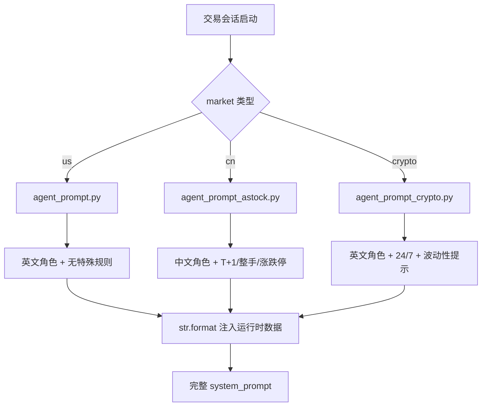
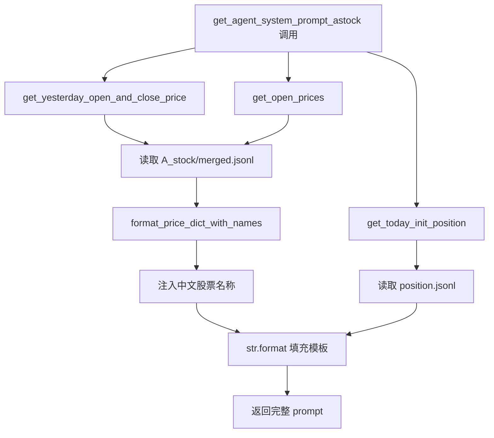

# PD-310.01 AI-Trader — 三市场 Prompt 模板与动态持仓注入

> 文档编号：PD-310.01
> 来源：AI-Trader `prompts/agent_prompt.py` `prompts/agent_prompt_astock.py` `prompts/agent_prompt_crypto.py`
> GitHub：https://github.com/HKUDS/AI-Trader.git
> 问题域：PD-310 领域特定 Prompt 工程 Domain-Specific Prompt Engineering
> 状态：可复用方案

---

## 第 1 章 问题与动机

### 1.1 核心问题

金融交易 Agent 面临一个独特的 prompt 工程挑战：**同一个"交易"任务在不同市场有完全不同的规则约束**。美股可以任意股数买卖，A 股必须 100 股整手交易且 T+1 结算，加密货币支持小数单位且 24/7 交易。如果用一个通用 prompt 覆盖所有市场，LLM 要么忽略规则（下单 13 股 A 股），要么被过多无关规则干扰（美股交易时看到 T+1 限制）。

更关键的是，交易 prompt 不是静态模板——每次交易会话都需要注入**实时持仓、当前价格、昨日收益**等动态数据。这些数据的格式也因市场而异：A 股需要中文股票名称（"600519.SH (贵州茅台)"），加密货币用 USDT 计价而非 USD。

### 1.2 AI-Trader 的解法概述

AI-Trader 采用**市场隔离的三模板架构**，每个市场一个独立的 prompt 模块：

1. **三文件隔离**：`agent_prompt.py`（美股）、`agent_prompt_astock.py`（A 股）、`agent_prompt_crypto.py`（加密货币），每个文件包含模板字符串 + 数据组装函数（`prompts/agent_prompt.py:25-59`）
2. **运行时数据注入**：每次交易会话调用 `get_agent_system_prompt*()` 函数，从 JSONL 数据文件实时拉取持仓、价格、收益，通过 Python `str.format()` 注入模板（`prompts/agent_prompt_astock.py:141-148`）
3. **领域规则内嵌**：A 股 prompt 直接写入 T+1 结算、整手交易、涨跌停限制等规则，用 emoji 标记和示例代码强化 LLM 理解（`prompts/agent_prompt_astock.py:59-75`）
4. **STOP_SIGNAL 终止控制**：统一的 `<FINISH_SIGNAL>` 标记，Agent 输出该信号时交易循环终止（`prompts/agent_prompt.py:23`）
5. **市场路由**：`main.py:129-132` 根据 agent_type 自动选择市场，决定调用哪个 prompt 函数

### 1.3 设计思想

| 设计原则 | 具体实现 | 理由 | 替代方案 |
|----------|----------|------|----------|
| 市场隔离 | 三个独立 prompt 文件，各自硬编码 market 参数 | 避免条件分支污染模板，每个市场的规则完全独立 | 单模板 + if/else 拼接（会导致模板膨胀） |
| 规则前置 | T+1、整手等规则写在 prompt 而非工具校验 | LLM 在决策阶段就遵守规则，减少无效工具调用 | 仅在 buy/sell 工具中校验（LLM 会反复试错） |
| 数据即时注入 | 每次会话重新拉取价格和持仓 | 交易数据实时变化，缓存会导致决策基于过期数据 | 预缓存 + 定时刷新（延迟风险） |
| 显式终止 | STOP_SIGNAL 由 Agent 主动输出 | Agent 自主判断任务完成，比固定步数更灵活 | 纯步数限制（可能提前截断或浪费步数） |
| 双语适配 | A 股用中文 prompt，美股/加密用英文 | 中文 prompt 对中文 LLM 更友好，A 股术语有中文惯用表达 | 全英文（A 股术语翻译不自然） |

---

## 第 2 章 源码实现分析

### 2.1 架构概览

AI-Trader 的 prompt 系统由三层组成：模板层（静态字符串）、数据层（price_tools 实时拉取）、组装层（format 函数注入）。

```
┌─────────────────────────────────────────────────────────┐
│                    main.py (入口)                         │
│  agent_type → market 路由 → AgentClass 选择              │
└──────────────────────┬──────────────────────────────────┘
                       │
          ┌────────────┼────────────┐
          ▼            ▼            ▼
   ┌──────────┐ ┌───────────┐ ┌──────────┐
   │ US Prompt│ │ CN Prompt │ │Crypto    │
   │ (英文)   │ │ (中文)    │ │Prompt    │
   │ 无特殊   │ │ T+1/整手  │ │(英文)    │
   │ 规则     │ │ 涨跌停    │ │24/7交易  │
   └────┬─────┘ └────┬──────┘ └────┬─────┘
        │            │             │
        └────────────┼─────────────┘
                     ▼
        ┌─────────────────────────┐
        │    price_tools.py       │
        │  get_open_prices()      │
        │  get_today_init_pos()   │
        │  get_yesterday_profit() │
        │  format_price_names()   │
        └────────────┬────────────┘
                     ▼
        ┌─────────────────────────┐
        │  data/*.jsonl           │
        │  merged.jsonl (US)      │
        │  A_stock/merged.jsonl   │
        │  crypto/crypto_merged   │
        └─────────────────────────┘
```

### 2.2 核心实现

#### 2.2.1 三市场模板对比

三个 prompt 模板的核心差异体现在**角色定义、领域规则、数据格式**三个维度。



对应源码 `prompts/agent_prompt.py:25-59`（美股模板）：
```python
agent_system_prompt = """
You are a stock fundamental analysis trading assistant.

Your goals are:
- Think and reason by calling available tools.
- You need to think about the prices of various stocks and their returns.
- Your long-term goal is to maximize returns through this portfolio.
- Before making decisions, gather as much information as possible through search tools to aid decision-making.

Thinking standards:
- Clearly show key intermediate steps:
  - Read input of yesterday's positions and today's prices
  - Update valuation and adjust weights for each target (if strategy requires)

Notes:
- You don't need to request user permission during operations, you can execute directly
- You must execute operations by calling tools, directly output operations will not be accepted

Here is the information you need:

Current time:
{date}

Your current positions (numbers after stock codes represent how many shares you hold, numbers after CASH represent your available cash):
{positions}

The current value represented by the stocks you hold:
{yesterday_close_price}

Current buying prices:
{today_buy_price}

When you think your task is complete, output
{STOP_SIGNAL}
"""
```

对应源码 `prompts/agent_prompt_astock.py:30-96`（A 股模板，关键差异部分）：
```python
agent_system_prompt_astock = """
你是一位A股基本面分析交易助手。
...
⚠️ 重要行为要求：
1. **必须实际调用 buy() 或 sell() 工具**，不要只给出建议或分析
2. **禁止编造错误信息**，如果工具调用失败，会返回真实的错误，你只需报告即可
3. **禁止说"由于交易系统限制"、"当前无法执行"、"Symbol not found"等自己假设的限制**

🇨🇳 重要 - A股交易规则（适用于所有 .SH 和 .SZ 股票代码）：
1. **股票代码格式 - 极其重要！**: 
   - symbol 参数必须是字符串类型，必须包含 .SH 或 .SZ 后缀

2. **一手交易要求**: 所有买卖订单必须是100股的整数倍（1手 = 100股）
   - ✅ 正确: buy("600519.SH", 100), buy("600519.SH", 300), sell("600519.SH", 200)
   - ❌ 错误: buy("600519.SH", 13), buy("600519.SH", 497), sell("600519.SH", 50)

3. **T+1结算规则**: 当天买入的股票不能当天卖出
4. **涨跌停限制**: 普通股票：±10%  ST股票：±5%  科创板/创业板：±20%
...
"""
```

#### 2.2.2 运行时数据注入机制



对应源码 `prompts/agent_prompt_astock.py:99-148`：
```python
def get_agent_system_prompt_astock(today_date: str, signature: str, 
                                    stock_symbols: Optional[List[str]] = None) -> str:
    # 默认使用上证50成分股
    if stock_symbols is None:
        stock_symbols = all_sse_50_symbols

    # 获取前一时间点的买入和卖出价格，硬编码market="cn"
    yesterday_buy_prices, yesterday_sell_prices = get_yesterday_open_and_close_price(
        today_date, stock_symbols, market="cn"
    )
    # 获取当前时间点的买入价格
    today_buy_price = get_open_prices(today_date, stock_symbols, market="cn")
    # 获取当前持仓
    today_init_position = get_today_init_position(today_date, signature)
    
    # 计算收益
    current_profit = get_yesterday_profit(
        today_date, yesterday_buy_prices, yesterday_sell_prices, 
        today_init_position, stock_symbols
    )

    # A股市场显示中文股票名称
    yesterday_sell_prices_display = format_price_dict_with_names(yesterday_sell_prices, market="cn")
    today_buy_price_display = format_price_dict_with_names(today_buy_price, market="cn")

    return agent_system_prompt_astock.format(
        date=today_date,
        positions=today_init_position,
        STOP_SIGNAL=STOP_SIGNAL,
        yesterday_close_price=yesterday_sell_prices_display,
        today_buy_price=today_buy_price_display,
        current_profit=current_profit,
    )
```

### 2.3 实现细节

#### STOP_SIGNAL 终止机制

`STOP_SIGNAL = "<FINISH_SIGNAL>"` 在三个 prompt 文件中统一定义（`prompts/agent_prompt.py:23`），通过模板变量 `{STOP_SIGNAL}` 注入 prompt 末尾。Agent 循环在 `base_agent.py:490` 检测该信号：

```python
# base_agent.py:490-494
if STOP_SIGNAL in agent_response:
    print("✅ Received stop signal, trading session ended")
    print(agent_response)
    self._log_message(log_file, [{"role": "assistant", "content": agent_response}])
    break
```

循环上限由 `max_steps`（默认 30）兜底，STOP_SIGNAL 是 Agent 主动终止的唯一方式。

#### 市场路由与 Agent 类选择

`main.py:126-132` 实现了基于 agent_type 的市场自动检测：

```python
market = config.get("market", "us")
if agent_type == "BaseAgentAStock" or agent_type == "BaseAgentAStock_Hour":
    market = "cn"
elif agent_type == "BaseAgentCrypto":
    market = "crypto"
```

每个 Agent 子类在 `run_trading_session` 中调用对应的 prompt 函数（`base_agent.py:450-454`）：

```python
self.agent = create_agent(
    self.model,
    tools=self.tools,
    system_prompt=get_agent_system_prompt(today_date, self.signature, self.market, self.stock_symbols),
)
```

#### Prompt-Tool 双重校验

A 股的整手规则同时存在于 prompt（`agent_prompt_astock.py:63-65`）和工具（`tool_trade.py:120-128`）两层：

```python
# tool_trade.py:120-128 — 工具层兜底校验
if market == "cn" and amount % 100 != 0:
    return {
        "error": f"Chinese A-shares must be traded in multiples of 100 shares...",
        "suggestion": f"Please use {(amount // 100) * 100} or {((amount // 100) + 1) * 100} shares instead.",
    }
```

Prompt 层让 LLM 在决策时就遵守规则（减少无效调用），工具层作为最后防线防止违规交易。


---

## 第 3 章 迁移指南

### 3.1 迁移清单

**阶段 1：模板隔离**
- [ ] 为每个业务领域创建独立的 prompt 模块文件（如 `prompts/domain_a.py`）
- [ ] 每个模块包含：模板字符串 + 数据组装函数 + STOP_SIGNAL 定义
- [ ] 模板中用 `{placeholder}` 标记所有运行时变量

**阶段 2：领域规则嵌入**
- [ ] 将领域硬约束（如 A 股整手规则）直接写入 prompt，用 emoji + 示例强化
- [ ] 在工具层添加相同规则的兜底校验（双重保障）
- [ ] 用 ✅/❌ 正反例帮助 LLM 理解规则边界

**阶段 3：动态数据注入**
- [ ] 实现数据拉取函数（对应 `get_open_prices`、`get_today_init_position` 等）
- [ ] 在每次会话启动时调用组装函数，注入最新数据
- [ ] 对需要人类可读格式的数据做显示转换（如 `format_price_dict_with_names`）

**阶段 4：终止信号**
- [ ] 定义统一的 STOP_SIGNAL 常量
- [ ] 在 prompt 末尾告知 Agent 完成时输出该信号
- [ ] 在 Agent 循环中检测信号并 break，同时设置 max_steps 兜底

### 3.2 适配代码模板

以下是一个可直接复用的多领域 prompt 模板系统：

```python
"""
多领域 Prompt 模板系统 — 从 AI-Trader 提炼的可复用模式
"""
from typing import Any, Dict, Optional, Protocol
from dataclasses import dataclass

STOP_SIGNAL = "<FINISH_SIGNAL>"

# --- 1. 领域模板定义 ---

@dataclass
class DomainPromptConfig:
    """领域 prompt 配置"""
    role_description: str          # 角色描述
    domain_rules: str              # 领域硬约束（可为空）
    data_section_template: str     # 数据注入区模板
    language: str = "en"           # prompt 语言

# 示例：两个领域的模板
DOMAIN_CONFIGS: Dict[str, DomainPromptConfig] = {
    "us_stock": DomainPromptConfig(
        role_description="You are a stock fundamental analysis trading assistant.",
        domain_rules="",  # 美股无特殊规则
        data_section_template=(
            "Current time: {date}\n"
            "Your positions: {positions}\n"
            "Current prices: {prices}\n"
        ),
        language="en",
    ),
    "cn_stock": DomainPromptConfig(
        role_description="你是一位A股基本面分析交易助手。",
        domain_rules=(
            "🇨🇳 A股交易规则：\n"
            "1. 一手交易：买卖必须是100股整数倍\n"
            "   ✅ buy('600519.SH', 100)  ❌ buy('600519.SH', 13)\n"
            "2. T+1结算：当天买入不能当天卖出\n"
            "3. 涨跌停：普通±10%，ST±5%，科创板±20%\n"
        ),
        data_section_template=(
            "当前时间：{date}\n"
            "当前持仓：{positions}\n"
            "当前买入价格：{prices}\n"
        ),
        language="zh",
    ),
}


# --- 2. Prompt 组装函数 ---

def assemble_prompt(domain: str, runtime_data: Dict[str, Any]) -> str:
    """组装完整的 system prompt"""
    config = DOMAIN_CONFIGS[domain]
    
    sections = [config.role_description, ""]
    
    if config.domain_rules:
        sections.append(config.domain_rules)
        sections.append("")
    
    # 注入运行时数据
    data_section = config.data_section_template.format(**runtime_data)
    sections.append(data_section)
    
    # 终止信号
    finish_hint = (
        f"当你认为任务完成时，输出\n{STOP_SIGNAL}"
        if config.language == "zh"
        else f"When you think your task is complete, output\n{STOP_SIGNAL}"
    )
    sections.append(finish_hint)
    
    return "\n".join(sections)


# --- 3. Agent 循环中检测终止 ---

def check_stop_signal(agent_response: str) -> bool:
    """检测 Agent 是否输出了终止信号"""
    return STOP_SIGNAL in agent_response
```

### 3.3 适用场景

| 场景 | 适用度 | 说明 |
|------|--------|------|
| 多市场金融交易 Agent | ⭐⭐⭐ | 直接适用，AI-Trader 的原始场景 |
| 多语言客服 Agent | ⭐⭐⭐ | 不同语言/地区有不同业务规则和话术 |
| 多平台内容发布 | ⭐⭐ | 各平台有不同的格式限制和审核规则 |
| 单领域简单 Agent | ⭐ | 过度设计，单模板即可 |
| 规则频繁变化的领域 | ⭐⭐ | 需要额外的规则版本管理机制 |

---

## 第 4 章 测试用例

```python
import pytest
from unittest.mock import patch, MagicMock
from typing import Dict, Any

# 模拟 AI-Trader 的 prompt 组装逻辑
STOP_SIGNAL = "<FINISH_SIGNAL>"


class TestPromptTemplateAssembly:
    """测试 prompt 模板组装"""

    def test_us_stock_prompt_has_no_cn_rules(self):
        """美股 prompt 不应包含 A 股规则"""
        from prompts.agent_prompt import agent_system_prompt
        assert "T+1" not in agent_system_prompt
        assert "一手" not in agent_system_prompt
        assert "100股" not in agent_system_prompt

    def test_astock_prompt_contains_cn_rules(self):
        """A 股 prompt 必须包含所有中国市场规则"""
        from prompts.agent_prompt_astock import agent_system_prompt_astock
        assert "T+1" in agent_system_prompt_astock
        assert "100股" in agent_system_prompt_astock or "100" in agent_system_prompt_astock
        assert ".SH" in agent_system_prompt_astock
        assert "涨跌停" in agent_system_prompt_astock

    def test_crypto_prompt_mentions_24_7(self):
        """加密货币 prompt 应提及 24/7 交易"""
        from prompts.agent_prompt_crypto import agent_system_prompt_crypto
        assert "24/7" in agent_system_prompt_crypto
        assert "USDT" in agent_system_prompt_crypto

    def test_all_prompts_contain_stop_signal_placeholder(self):
        """所有模板必须包含 STOP_SIGNAL 占位符"""
        from prompts.agent_prompt import agent_system_prompt
        from prompts.agent_prompt_astock import agent_system_prompt_astock
        from prompts.agent_prompt_crypto import agent_system_prompt_crypto
        
        for template in [agent_system_prompt, agent_system_prompt_astock, agent_system_prompt_crypto]:
            assert "{STOP_SIGNAL}" in template


class TestRuntimeDataInjection:
    """测试运行时数据注入"""

    def test_format_injects_all_placeholders(self):
        """format 应填充所有占位符，无残留 {xxx}"""
        template = "Date: {date}\nPos: {positions}\nPrice: {today_buy_price}\nClose: {yesterday_close_price}\nStop: {STOP_SIGNAL}"
        result = template.format(
            date="2025-10-13",
            positions={"AAPL": 100, "CASH": 5000},
            today_buy_price={"AAPL_price": 150.0},
            yesterday_close_price={"AAPL_price": 149.5},
            STOP_SIGNAL=STOP_SIGNAL,
        )
        assert "{" not in result  # 无残留占位符
        assert "2025-10-13" in result
        assert "<FINISH_SIGNAL>" in result

    def test_astock_prompt_includes_profit(self):
        """A 股 prompt 额外注入收益数据（美股/加密无此字段）"""
        from prompts.agent_prompt_astock import agent_system_prompt_astock
        assert "{current_profit}" in agent_system_prompt_astock


class TestStopSignalDetection:
    """测试终止信号检测"""

    def test_stop_signal_detected_in_response(self):
        response = "分析完成，所有操作已执行。<FINISH_SIGNAL>"
        assert STOP_SIGNAL in response

    def test_stop_signal_not_detected_in_partial(self):
        response = "我正在分析 FINISH 相关数据..."
        assert STOP_SIGNAL not in response

    def test_stop_signal_works_with_surrounding_text(self):
        response = "Task done.\n<FINISH_SIGNAL>\nEnd."
        assert STOP_SIGNAL in response


class TestMarketRouting:
    """测试市场路由逻辑"""

    def test_astock_agent_forces_cn_market(self):
        """BaseAgentAStock 应强制使用 cn 市场"""
        agent_type = "BaseAgentAStock"
        market = "us"  # 默认值
        if agent_type in ("BaseAgentAStock", "BaseAgentAStock_Hour"):
            market = "cn"
        assert market == "cn"

    def test_crypto_agent_forces_crypto_market(self):
        agent_type = "BaseAgentCrypto"
        market = "us"
        if agent_type == "BaseAgentCrypto":
            market = "crypto"
        assert market == "crypto"

    def test_default_market_is_us(self):
        agent_type = "BaseAgent"
        market = "us"
        assert market == "us"
```


---

## 第 5 章 跨域关联

| 关联域 | 关系类型 | 说明 |
|--------|----------|------|
| PD-01 上下文管理 | 协同 | 每次会话注入完整持仓和价格数据，prompt 长度随股票池规模线性增长（50 只 A 股 ≈ 2K tokens），需要关注上下文窗口预算 |
| PD-03 容错与重试 | 协同 | Prompt 中明确要求"禁止编造错误信息"，配合工具层的错误返回机制，形成 prompt 引导 + 工具兜底的双层容错 |
| PD-04 工具系统 | 依赖 | Prompt 中引用的 `buy()`/`sell()` 工具通过 FastMCP 注册，prompt 规则（整手交易）与工具校验（`tool_trade.py:121`）必须一致 |
| PD-06 记忆持久化 | 协同 | 持仓数据通过 `position.jsonl` 持久化，每次会话的 prompt 从中读取最新状态，实现跨会话状态延续 |
| PD-09 Human-in-the-Loop | 互斥 | AI-Trader 的 prompt 明确写"不需要请求用户许可，可以直接执行"，是全自动交易模式，与 HITL 模式互斥 |
| PD-11 可观测性 | 协同 | 每次会话的完整 prompt（含注入数据）被记录到日志文件，可用于事后审计交易决策依据 |

---

## 第 6 章 来源文件索引

| 文件 | 行范围 | 关键实现 |
|------|--------|----------|
| `prompts/agent_prompt.py` | L23-59 | 美股 prompt 模板 + STOP_SIGNAL 定义 |
| `prompts/agent_prompt.py` | L62-88 | `get_agent_system_prompt()` 数据组装函数 |
| `prompts/agent_prompt_astock.py` | L28-96 | A 股中文 prompt 模板（含 T+1/整手/涨跌停规则） |
| `prompts/agent_prompt_astock.py` | L99-148 | `get_agent_system_prompt_astock()` 含收益计算和中文名称注入 |
| `prompts/agent_prompt_crypto.py` | L22-62 | 加密货币 prompt 模板（24/7 交易 + USDT 计价） |
| `prompts/agent_prompt_crypto.py` | L65-92 | `get_agent_system_prompt_crypto()` 数据组装 |
| `agent/base_agent/base_agent.py` | L450-454 | Agent 创建时注入 system_prompt |
| `agent/base_agent/base_agent.py` | L490-494 | STOP_SIGNAL 检测与循环终止 |
| `agent_tools/tool_trade.py` | L120-128 | A 股整手规则工具层校验（prompt 规则的兜底） |
| `main.py` | L126-139 | 市场类型路由（agent_type → market） |

---

## 第 7 章 横向对比维度

> **重要：** 本章用于自动填充 Butcher Wiki 的横向对比表。

```json comparison_data
{
  "project": "AI-Trader",
  "dimensions": {
    "模板架构": "三文件隔离，每市场独立模块（prompt + 组装函数）",
    "变量注入": "Python str.format 6 变量，每次会话实时拉取 JSONL",
    "领域规则": "A股 prompt 内嵌 T+1/整手/涨跌停，emoji+正反例强化",
    "多语言策略": "A股中文 prompt + 中文股票名称，美股/加密英文",
    "终止信号": "FINISH_SIGNAL 字符串匹配 + max_steps 双重兜底",
    "规则校验层级": "Prompt 前置引导 + 工具层 buy/sell 兜底双重校验"
  }
}
```

### 域元数据补充

```json domain_metadata
{
  "solution_summary": "AI-Trader 用三文件隔离的市场专用 prompt 模板，每次交易会话通过 str.format 动态注入持仓/价格/收益数据，A股模板内嵌中文 T+1/整手规则并配合工具层双重校验",
  "description": "面向实时决策场景的 prompt 动态数据注入与领域规则双层校验",
  "sub_problems": [
    "Prompt 与工具层规则一致性维护",
    "运行时数据格式的市场适配（中文名称、USDT 计价等）",
    "Agent 自主终止判断的可靠性保障"
  ],
  "best_practices": [
    "用 emoji + ✅/❌ 正反例在 prompt 中强化 LLM 对规则边界的理解",
    "Prompt 前置规则引导 + 工具层兜底校验的双重保障模式",
    "每次会话重新组装 prompt 而非缓存，确保数据实时性"
  ]
}
```

