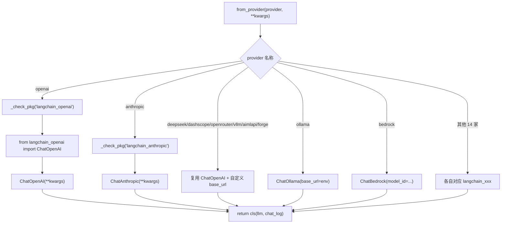
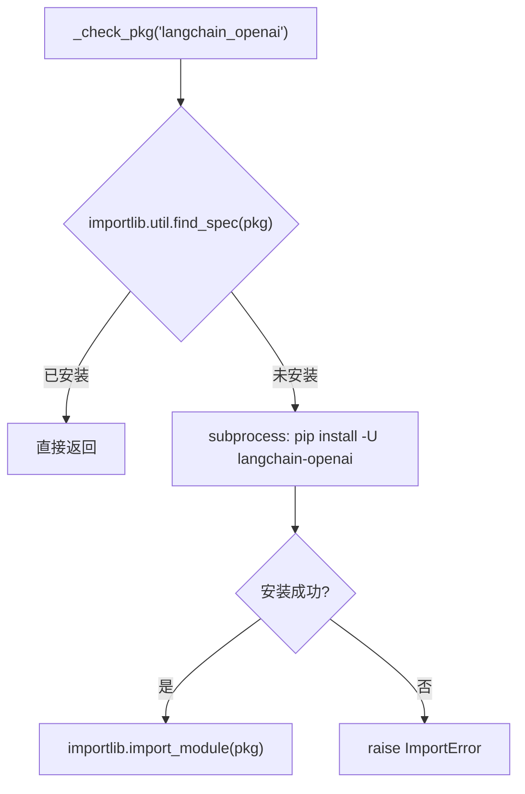
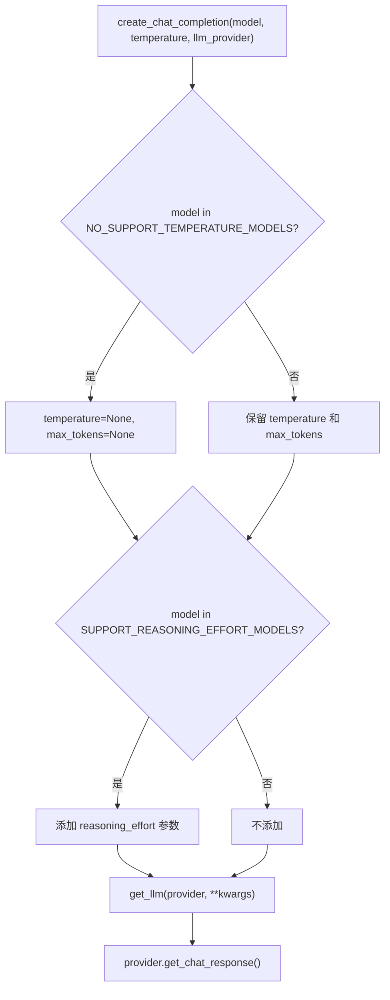

# PD-311.01 GPT-Researcher — GenericLLMProvider 工厂与双轨 Provider 抽象

> 文档编号：PD-311.01
> 来源：GPT-Researcher `gpt_researcher/llm_provider/generic/base.py`
> GitHub：https://github.com/assafelovic/gpt-researcher.git
> 问题域：PD-311 多LLM Provider抽象 Multi-LLM Provider Abstraction
> 状态：可复用方案

---

## 第 1 章 问题与动机

### 1.1 核心问题

Agent 系统需要对接多家 LLM 供应商（OpenAI、Anthropic、Google、Ollama、Groq、Bedrock 等），每家 SDK 的初始化参数、认证方式、模型命名规则各不相同。如果在业务代码中直接耦合某一家 SDK，切换供应商或新增供应商的成本极高。同时，不同供应商的 Python 依赖包体积差异巨大（`langchain_aws` vs `langchain_ollama`），全量安装会导致镜像膨胀和依赖冲突。

GPT-Researcher 面临的额外挑战：它同时需要 **Chat LLM**（对话生成）和 **Embedding**（向量检索）两条 Provider 通道，且两者的供应商列表和参数规范不完全重叠。此外，部分推理模型（o1/o3/o4-mini/deepseek-reasoner）不支持 temperature 参数，需要在统一接口层做参数适配。

### 1.2 GPT-Researcher 的解法概述

1. **双轨 Provider 体系**：`GenericLLMProvider`（Chat）和 `Memory`（Embedding）各自维护独立的 `_SUPPORTED_PROVIDERS` 集合，共享"工厂分发 + 懒加载依赖"的架构模式（`base.py:13-37`, `embeddings.py:32-52`）
2. **`from_provider` 工厂方法**：通过 `provider` 字符串名称分发到对应的 LangChain Chat 类，所有 22 个分支集中在一个 `@classmethod` 中（`base.py:96-263`）
3. **`_check_pkg` 自动安装**：首次使用某 Provider 时，若对应 `langchain_xxx` 包未安装，自动 `pip install -U`（`base.py:307-325`）
4. **模型参数黑名单**：`NO_SUPPORT_TEMPERATURE_MODELS` 和 `SUPPORT_REASONING_EFFORT_MODELS` 两个列表控制参数适配（`base.py:39-64`）
5. **`provider:model` 配置协议**：Config 层用 `"openai:gpt-4o-mini"` 格式统一表达 provider+model，`parse_llm` 方法拆分并校验（`config.py:204-221`）

### 1.3 设计思想

| 设计原则 | 具体实现 | 理由 | 替代方案 |
|----------|----------|------|----------|
| 单一工厂入口 | `from_provider` classmethod 集中 22 个 if-elif 分支 | 所有 Provider 创建逻辑一处可查，新增只需加一个 elif | 注册表 + 插件发现（更灵活但更复杂） |
| 懒加载依赖 | `_check_pkg` 在 import 前检测，缺失则 pip install | 避免全量安装 22 个 langchain 包，减少镜像体积 | requirements extras 分组（需用户手动选择） |
| 参数黑名单 | 硬编码模型名列表控制 temperature/reasoning_effort | 推理模型 API 会拒绝 temperature 参数，必须在调用前过滤 | 运行时 try-catch 降级（延迟发现问题） |
| OpenAI 兼容复用 | DeepSeek/DashScope/OpenRouter/vLLM 等均复用 `ChatOpenAI` + 自定义 base_url | 大量供应商提供 OpenAI 兼容 API，无需额外 SDK | 每家写独立适配器（代码膨胀） |
| 配置协议统一 | `provider:model` 字符串格式 | 一个环境变量同时指定供应商和模型，减少配置项 | 分开两个变量（PROVIDER + MODEL） |

---

## 第 2 章 源码实现分析

### 2.1 架构概览

GPT-Researcher 的 LLM Provider 抽象分为三层：Config 解析层、Provider 工厂层、运行时调用层。

```
┌─────────────────────────────────────────────────────────────┐
│                    Config 解析层                              │
│  config.py: parse_llm("openai:gpt-4o-mini")                │
│           → (provider="openai", model="gpt-4o-mini")        │
│  config.py: parse_embedding("openai:text-embedding-3-small")│
│           → (provider="openai", model="text-embedding-3-small")│
├─────────────────────────────────────────────────────────────┤
│                  Provider 工厂层（双轨）                       │
│  ┌──────────────────────┐  ┌──────────────────────────┐     │
│  │ GenericLLMProvider    │  │ Memory                    │     │
│  │ from_provider()       │  │ __init__(provider, model) │     │
│  │ 22 providers (Chat)   │  │ 18 providers (Embedding)  │     │
│  │ _check_pkg 自动安装    │  │ match-case 分发            │     │
│  └──────────────────────┘  └──────────────────────────┘     │
├─────────────────────────────────────────────────────────────┤
│                   运行时调用层                                │
│  llm.py: create_chat_completion()                           │
│    → 参数适配(temperature/reasoning_effort 黑名单)            │
│    → get_llm() → GenericLLMProvider.from_provider()         │
│    → provider.get_chat_response(stream/non-stream)          │
│    → ChatLogger 异步日志 + cost_callback 成本追踪             │
└─────────────────────────────────────────────────────────────┘
```

### 2.2 核心实现

#### 2.2.1 GenericLLMProvider 工厂方法



对应源码 `gpt_researcher/llm_provider/generic/base.py:96-263`：

```python
class GenericLLMProvider:

    def __init__(self, llm, chat_log: str | None = None, verbose: bool = True):
        self.llm = llm
        self.chat_logger = ChatLogger(chat_log) if chat_log else None
        self.verbose = verbose

    @classmethod
    def from_provider(cls, provider: str, chat_log: str | None = None,
                      verbose: bool=True, **kwargs: Any):
        if provider == "openai":
            _check_pkg("langchain_openai")
            from langchain_openai import ChatOpenAI
            if "openai_api_base" not in kwargs and os.environ.get("OPENAI_BASE_URL"):
                kwargs["openai_api_base"] = os.environ["OPENAI_BASE_URL"]
            llm = ChatOpenAI(**kwargs)
        elif provider == "anthropic":
            _check_pkg("langchain_anthropic")
            from langchain_anthropic import ChatAnthropic
            llm = ChatAnthropic(**kwargs)
        # ... 20 more elif branches ...
        elif provider == "openrouter":
            _check_pkg("langchain_openai")
            from langchain_openai import ChatOpenAI
            from langchain_core.rate_limiters import InMemoryRateLimiter
            rps = float(os.environ.get("OPENROUTER_LIMIT_RPS", 1.0))
            rate_limiter = InMemoryRateLimiter(
                requests_per_second=rps, check_every_n_seconds=0.1,
                max_bucket_size=10,
            )
            llm = ChatOpenAI(
                openai_api_base='https://openrouter.ai/api/v1',
                request_timeout=180,
                openai_api_key=os.environ["OPENROUTER_API_KEY"],
                rate_limiter=rate_limiter, **kwargs
            )
        else:
            raise ValueError(f"Unsupported {provider}.\n\nSupported: ...")
        return cls(llm, chat_log, verbose=verbose)
```

#### 2.2.2 _check_pkg 自动安装机制



对应源码 `gpt_researcher/llm_provider/generic/base.py:307-325`：

```python
def _check_pkg(pkg: str) -> None:
    if not importlib.util.find_spec(pkg):
        pkg_kebab = pkg.replace("_", "-")
        init(autoreset=True)
        try:
            print(f"{Fore.YELLOW}Installing {pkg_kebab}...{Style.RESET_ALL}")
            subprocess.check_call(
                [sys.executable, "-m", "pip", "install", "-U", pkg_kebab]
            )
            print(f"{Fore.GREEN}Successfully installed {pkg_kebab}{Style.RESET_ALL}")
            importlib.import_module(pkg)
        except subprocess.CalledProcessError:
            raise ImportError(
                f"Failed to install {pkg_kebab}. "
                f"Please install manually with `pip install -U {pkg_kebab}`"
            )
```

#### 2.2.3 参数适配与三级 LLM 策略



对应源码 `gpt_researcher/utils/llm.py:69-109`：

```python
# 参数适配核心逻辑
provider_kwargs = {'model': model}
if llm_kwargs:
    provider_kwargs.update(llm_kwargs)

if model in SUPPORT_REASONING_EFFORT_MODELS:
    provider_kwargs['reasoning_effort'] = reasoning_effort

if model not in NO_SUPPORT_TEMPERATURE_MODELS:
    provider_kwargs['temperature'] = temperature
    provider_kwargs['max_tokens'] = max_tokens
else:
    provider_kwargs['temperature'] = None
    provider_kwargs['max_tokens'] = None

provider = get_llm(llm_provider, **provider_kwargs)
response = await provider.get_chat_response(messages, stream, websocket, **kwargs)
```

Config 层定义三级 LLM 策略（`config/variables/default.py:7-9`）：
- `FAST_LLM`: `"openai:gpt-4o-mini"` — 快速任务
- `SMART_LLM`: `"openai:gpt-4.1"` — 长文本生成
- `STRATEGIC_LLM`: `"openai:o4-mini"` — 推理任务

### 2.3 实现细节

**OpenAI 兼容复用模式**：22 个 Provider 中有 7 个（deepseek、dashscope、openrouter、vllm_openai、aimlapi、forge、custom embedding）直接复用 `ChatOpenAI`，仅修改 `openai_api_base` 和 `openai_api_key`。这是因为大量供应商提供 OpenAI 兼容 API，无需额外 SDK。

**OpenRouter 内置限流**：OpenRouter 分支内置了 `InMemoryRateLimiter`，通过 `OPENROUTER_LIMIT_RPS` 环境变量控制 QPS（`base.py:210-228`），这是唯一一个在 Provider 层内置限流的分支。

**Embedding 双轨**：`Memory` 类使用 Python 3.10+ 的 `match-case` 语法（`embeddings.py:86-202`），与 `GenericLLMProvider` 的 `if-elif` 风格不同，但架构思路一致。Embedding 支持 18 个 Provider，其中包含 Chat 没有的 `nomic`、`voyageai`、`custom` 三个专用 Embedding Provider。

**ChatLogger 异步日志**：每次 LLM 调用后，`ChatLogger` 以 JSONL 格式追加记录 messages、response 和 stacktrace（`base.py:72-88`），使用 `asyncio.Lock` 保证并发安全。

**流式响应统一**：`stream_response` 方法通过 LangChain 的 `astream` 接口统一所有 Provider 的流式输出，按换行符分段推送到 WebSocket（`base.py:281-298`）。

---

## 第 3 章 迁移指南

### 3.1 迁移清单

**阶段 1：核心工厂（1 个文件）**
- [ ] 创建 `llm_provider/base.py`，定义 `GenericLLMProvider` 类
- [ ] 实现 `from_provider` classmethod，先支持 3-5 个常用 Provider
- [ ] 实现 `_check_pkg` 自动安装函数
- [ ] 定义 `_SUPPORTED_PROVIDERS` 集合

**阶段 2：参数适配（1 个文件）**
- [ ] 创建模型参数黑名单（NO_SUPPORT_TEMPERATURE_MODELS）
- [ ] 在调用层实现参数过滤逻辑
- [ ] 添加 reasoning_effort 支持

**阶段 3：Embedding 双轨（1 个文件）**
- [ ] 创建 `memory/embeddings.py`，定义 `Memory` 类
- [ ] 实现 Embedding Provider 分发（可复用 Chat 的 _check_pkg）

**阶段 4：配置协议（1 个文件）**
- [ ] 实现 `provider:model` 解析函数
- [ ] 支持环境变量覆盖
- [ ] 定义三级 LLM 策略（fast/smart/strategic）

### 3.2 适配代码模板

以下是可直接复用的最小化 Provider 工厂实现：

```python
"""Minimal multi-provider LLM factory — adapted from GPT-Researcher."""
import importlib
import os
import subprocess
import sys
from typing import Any

_SUPPORTED_PROVIDERS = {"openai", "anthropic", "ollama", "deepseek", "groq"}

# 推理模型不支持 temperature
NO_TEMP_MODELS = {"o1", "o3-mini", "o4-mini", "deepseek/deepseek-reasoner"}


def _check_pkg(pkg: str) -> None:
    """Lazy-install a LangChain provider package if missing."""
    if importlib.util.find_spec(pkg):
        return
    kebab = pkg.replace("_", "-")
    print(f"[auto-install] pip install -U {kebab}")
    subprocess.check_call([sys.executable, "-m", "pip", "install", "-U", kebab])
    importlib.import_module(pkg)


class LLMProvider:
    """Unified LLM provider with factory dispatch."""

    def __init__(self, llm):
        self.llm = llm

    @classmethod
    def create(cls, provider: str, **kwargs: Any) -> "LLMProvider":
        if provider == "openai":
            _check_pkg("langchain_openai")
            from langchain_openai import ChatOpenAI
            base = os.environ.get("OPENAI_BASE_URL")
            if base and "openai_api_base" not in kwargs:
                kwargs["openai_api_base"] = base
            return cls(ChatOpenAI(**kwargs))

        if provider == "anthropic":
            _check_pkg("langchain_anthropic")
            from langchain_anthropic import ChatAnthropic
            return cls(ChatAnthropic(**kwargs))

        if provider == "ollama":
            _check_pkg("langchain_ollama")
            from langchain_ollama import ChatOllama
            return cls(ChatOllama(
                base_url=os.environ.get("OLLAMA_BASE_URL", "http://localhost:11434"),
                **kwargs,
            ))

        if provider == "deepseek":
            _check_pkg("langchain_openai")
            from langchain_openai import ChatOpenAI
            return cls(ChatOpenAI(
                openai_api_base="https://api.deepseek.com",
                openai_api_key=os.environ["DEEPSEEK_API_KEY"],
                **kwargs,
            ))

        if provider == "groq":
            _check_pkg("langchain_groq")
            from langchain_groq import ChatGroq
            return cls(ChatGroq(**kwargs))

        raise ValueError(f"Unsupported provider: {provider}. "
                         f"Supported: {', '.join(_SUPPORTED_PROVIDERS)}")

    async def chat(self, messages: list, stream: bool = False) -> str:
        if stream:
            chunks = []
            async for chunk in self.llm.astream(messages):
                if chunk.content:
                    chunks.append(chunk.content)
            return "".join(chunks)
        output = await self.llm.ainvoke(messages)
        return output.content


def adapt_params(model: str, temperature: float = 0.4,
                 max_tokens: int = 4000) -> dict:
    """Filter params based on model capabilities."""
    params = {"model": model}
    if model not in NO_TEMP_MODELS:
        params["temperature"] = temperature
        params["max_tokens"] = max_tokens
    return params


def parse_llm_string(llm_str: str) -> tuple[str, str]:
    """Parse 'provider:model' format. E.g. 'openai:gpt-4o-mini'."""
    provider, model = llm_str.split(":", 1)
    assert provider in _SUPPORTED_PROVIDERS, f"Unsupported: {provider}"
    return provider, model
```

### 3.3 适用场景

| 场景 | 适用度 | 说明 |
|------|--------|------|
| 多供应商 Agent 系统 | ⭐⭐⭐ | 核心场景，22 个 Provider 开箱即用 |
| 本地 + 云端混合部署 | ⭐⭐⭐ | Ollama 本地 + OpenAI 云端无缝切换 |
| OpenAI 兼容 API 接入 | ⭐⭐⭐ | DeepSeek/vLLM/OpenRouter 等只需改 base_url |
| 推理模型适配 | ⭐⭐⭐ | o1/o3/o4-mini 参数黑名单自动处理 |
| 生产环境高可用 | ⭐⭐ | 缺少 Provider 级别的 fallback 链和断路器 |
| 多租户成本隔离 | ⭐ | 成本追踪基于 OpenAI 定价，不区分 Provider |

---

## 第 4 章 测试用例

```python
"""Tests for GenericLLMProvider factory — based on GPT-Researcher patterns."""
import importlib
import os
from unittest.mock import AsyncMock, MagicMock, patch
import pytest


# ── 测试 _check_pkg 自动安装 ──────────────────────────────

class TestCheckPkg:
    def test_already_installed(self):
        """已安装的包直接返回，不触发 pip。"""
        from gpt_researcher.llm_provider.generic.base import _check_pkg
        # langchain_core 一定已安装
        _check_pkg("langchain_core")  # should not raise

    @patch("subprocess.check_call")
    @patch("importlib.util.find_spec", return_value=None)
    def test_auto_install_on_missing(self, mock_spec, mock_call):
        """缺失包时自动 pip install。"""
        from gpt_researcher.llm_provider.generic.base import _check_pkg
        with patch("importlib.import_module"):
            _check_pkg("langchain_fake_provider")
        mock_call.assert_called_once()
        args = mock_call.call_args[0][0]
        assert "pip" in args
        assert "langchain-fake-provider" in args  # underscore → kebab

    @patch("subprocess.check_call", side_effect=subprocess.CalledProcessError(1, "pip"))
    @patch("importlib.util.find_spec", return_value=None)
    def test_install_failure_raises(self, mock_spec, mock_call):
        """安装失败时抛出 ImportError。"""
        from gpt_researcher.llm_provider.generic.base import _check_pkg
        with pytest.raises(ImportError, match="Failed to install"):
            _check_pkg("langchain_nonexistent")


# ── 测试 from_provider 工厂 ──────────────────────────────

class TestFromProvider:
    def test_unsupported_provider_raises(self):
        """不支持的 provider 抛出 ValueError。"""
        from gpt_researcher.llm_provider.generic.base import GenericLLMProvider
        with pytest.raises(ValueError, match="Unsupported"):
            GenericLLMProvider.from_provider("nonexistent_provider", model="x")

    @patch("gpt_researcher.llm_provider.generic.base._check_pkg")
    def test_openai_provider(self, mock_check):
        """OpenAI provider 正确实例化。"""
        from gpt_researcher.llm_provider.generic.base import GenericLLMProvider
        with patch("langchain_openai.ChatOpenAI") as MockChat:
            MockChat.return_value = MagicMock()
            provider = GenericLLMProvider.from_provider(
                "openai", model="gpt-4o-mini", temperature=0.4
            )
            assert provider.llm is not None
            MockChat.assert_called_once()

    @patch("gpt_researcher.llm_provider.generic.base._check_pkg")
    def test_deepseek_reuses_openai(self, mock_check):
        """DeepSeek 复用 ChatOpenAI + 自定义 base_url。"""
        os.environ["DEEPSEEK_API_KEY"] = "test-key"
        from gpt_researcher.llm_provider.generic.base import GenericLLMProvider
        with patch("langchain_openai.ChatOpenAI") as MockChat:
            MockChat.return_value = MagicMock()
            GenericLLMProvider.from_provider("deepseek", model="deepseek-chat")
            call_kwargs = MockChat.call_args[1]
            assert call_kwargs["openai_api_base"] == "https://api.deepseek.com"


# ── 测试参数适配 ─────────────────────────────────────────

class TestParamAdaptation:
    def test_reasoning_model_no_temperature(self):
        """推理模型不传 temperature。"""
        from gpt_researcher.llm_provider.generic.base import NO_SUPPORT_TEMPERATURE_MODELS
        assert "o3-mini" in NO_SUPPORT_TEMPERATURE_MODELS
        assert "o4-mini" in NO_SUPPORT_TEMPERATURE_MODELS

    def test_reasoning_effort_enum(self):
        """ReasoningEfforts 枚举值正确。"""
        from gpt_researcher.llm_provider.generic.base import ReasoningEfforts
        assert ReasoningEfforts.High.value == "high"
        assert ReasoningEfforts.Low.value == "low"


# ── 测试配置解析 ─────────────────────────────────────────

class TestConfigParsing:
    def test_parse_llm_valid(self):
        """正确解析 provider:model 格式。"""
        from gpt_researcher.config.config import Config
        provider, model = Config.parse_llm("openai:gpt-4o-mini")
        assert provider == "openai"
        assert model == "gpt-4o-mini"

    def test_parse_llm_invalid_format(self):
        """缺少冒号时抛出 ValueError。"""
        from gpt_researcher.config.config import Config
        with pytest.raises(ValueError, match="Set SMART_LLM or FAST_LLM"):
            Config.parse_llm("openai-gpt-4o-mini")

    def test_parse_llm_unsupported_provider(self):
        """不支持的 provider 抛出 AssertionError。"""
        from gpt_researcher.config.config import Config
        with pytest.raises(AssertionError, match="Unsupported"):
            Config.parse_llm("fake_provider:some-model")

    def test_parse_embedding_valid(self):
        """正确解析 embedding provider:model。"""
        from gpt_researcher.config.config import Config
        provider, model = Config.parse_embedding("openai:text-embedding-3-small")
        assert provider == "openai"
        assert model == "text-embedding-3-small"
```

---

## 第 5 章 跨域关联

| 关联域 | 关系类型 | 说明 |
|--------|----------|------|
| PD-01 上下文管理 | 协同 | `max_tokens` 参数在 Provider 层设置，直接影响上下文窗口利用率；三级 LLM 策略（fast/smart/strategic）本质是按任务复杂度分配上下文预算 |
| PD-03 容错与重试 | 依赖 | `create_chat_completion` 有 10 次重试循环（`llm.py:100`），但缺少 Provider 级 fallback 链；`_check_pkg` 的安装失败是一种启动时容错 |
| PD-04 工具系统 | 协同 | Provider 工厂本身可视为一种"工具注册表"模式，`_SUPPORTED_PROVIDERS` 集合等价于工具名称注册 |
| PD-08 搜索与检索 | 依赖 | `Memory` 类的 Embedding Provider 直接服务于 RAG 检索管线，Embedding 质量决定检索召回率 |
| PD-11 可观测性 | 协同 | `ChatLogger` 记录每次 LLM 请求的 messages/response/stacktrace；`cost_callback` 通过 `estimate_llm_cost` 追踪 token 成本 |
| PD-12 推理增强 | 依赖 | `STRATEGIC_LLM` 配置（默认 o4-mini）+ `reasoning_effort` 参数直接控制推理模型行为 |

---

## 第 6 章 来源文件索引

| 文件 | 行范围 | 关键实现 |
|------|--------|----------|
| `gpt_researcher/llm_provider/generic/base.py` | L13-L37 | `_SUPPORTED_PROVIDERS` 集合（22 个 Chat Provider） |
| `gpt_researcher/llm_provider/generic/base.py` | L39-L64 | `NO_SUPPORT_TEMPERATURE_MODELS` + `SUPPORT_REASONING_EFFORT_MODELS` 黑名单 |
| `gpt_researcher/llm_provider/generic/base.py` | L72-L88 | `ChatLogger` 异步 JSONL 日志 |
| `gpt_researcher/llm_provider/generic/base.py` | L90-L263 | `GenericLLMProvider` 类 + `from_provider` 工厂方法 |
| `gpt_researcher/llm_provider/generic/base.py` | L266-L304 | `get_chat_response` + `stream_response` 流式输出 |
| `gpt_researcher/llm_provider/generic/base.py` | L307-L325 | `_check_pkg` 自动安装函数 |
| `gpt_researcher/utils/llm.py` | L26-L37 | `get_llm` 工厂入口 |
| `gpt_researcher/utils/llm.py` | L40-L112 | `create_chat_completion` 参数适配 + 重试循环 |
| `gpt_researcher/memory/embeddings.py` | L32-L52 | Embedding `_SUPPORTED_PROVIDERS` 集合（18 个） |
| `gpt_researcher/memory/embeddings.py` | L55-L213 | `Memory` 类 match-case Embedding 工厂 |
| `gpt_researcher/config/config.py` | L92-L96 | `_set_llm_attributes` 三级 LLM 解析 |
| `gpt_researcher/config/config.py` | L204-L221 | `parse_llm` provider:model 解析 |
| `gpt_researcher/config/variables/default.py` | L7-L9 | 三级 LLM 默认值（fast/smart/strategic） |
| `gpt_researcher/utils/costs.py` | L18-L35 | `estimate_llm_cost` tiktoken 成本估算 |
| `gpt_researcher/llm_provider/image/image_generator.py` | L22-L441 | `ImageGeneratorProvider` 图像生成 Provider |

---

## 第 7 章 横向对比维度

```json comparison_data
{
  "project": "GPT-Researcher",
  "dimensions": {
    "Provider数量": "Chat 22个 + Embedding 18个，双轨独立维护",
    "工厂模式": "单一 classmethod if-elif 分发，无注册表",
    "依赖管理": "_check_pkg 运行时自动 pip install 缺失包",
    "参数适配": "硬编码模型黑名单过滤 temperature/reasoning_effort",
    "配置协议": "provider:model 单字符串格式，环境变量覆盖",
    "OpenAI兼容复用": "7个Provider复用ChatOpenAI+自定义base_url",
    "流式响应": "LangChain astream 统一，按换行符分段推送WebSocket",
    "成本追踪": "tiktoken估算+cost_callback回调，基于OpenAI定价",
    "内置限流": "仅OpenRouter分支内置InMemoryRateLimiter"
  }
}
```

### 域元数据补充

```json domain_metadata
{
  "solution_summary": "GPT-Researcher通过GenericLLMProvider.from_provider工厂方法统一22个Chat Provider和Memory类18个Embedding Provider，双轨独立维护，_check_pkg运行时自动安装缺失依赖，7个Provider复用ChatOpenAI兼容层",
  "description": "Chat与Embedding双轨Provider体系的统一工厂抽象与运行时依赖管理",
  "sub_problems": [
    "OpenAI兼容API的base_url复用与认证适配",
    "推理模型参数黑名单与reasoning_effort注入",
    "Chat与Embedding Provider集合不对称的双轨管理"
  ],
  "best_practices": [
    "OpenAI兼容供应商直接复用ChatOpenAI仅改base_url减少SDK依赖",
    "provider:model单字符串配置协议简化环境变量管理",
    "三级LLM策略(fast/smart/strategic)按任务复杂度分配模型"
  ]
}
```
