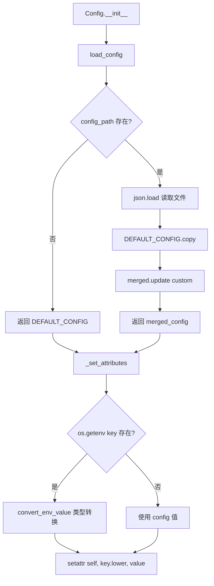
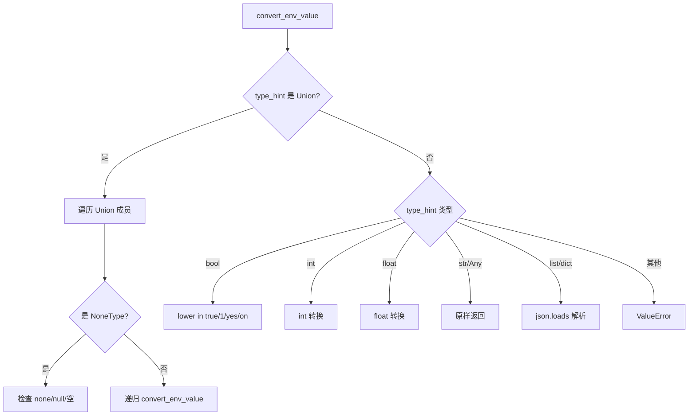
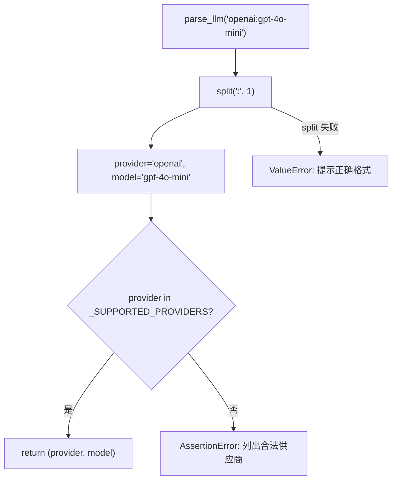

# PD-312.01 GPT-Researcher — TypedDict 驱动三层配置合并与 provider:model 统一解析

> 文档编号：PD-312.01
> 来源：GPT-Researcher `gpt_researcher/config/config.py`
> GitHub：https://github.com/assafelovic/gpt-researcher.git
> 问题域：PD-312 配置管理 Configuration Management
> 状态：可复用方案

---

## 第 1 章 问题与动机

### 1.1 核心问题

LLM 应用的配置管理面临三重挑战：

1. **多源合并**：默认值、JSON 配置文件、环境变量三个来源需要按优先级合并，且不能丢失任何配置项
2. **类型安全**：环境变量全是字符串，但配置项有 `int`、`float`、`bool`、`list`、`dict` 等多种类型，需要自动转换且不能出错
3. **provider:model 耦合**：LLM 和 Embedding 的供应商与模型名是一对绑定关系（如 `openai:gpt-4o-mini`），需要统一解析并验证供应商合法性

GPT-Researcher 作为一个支持 20+ LLM 供应商和 17+ Embedding 供应商的研究型 Agent，其配置系统必须同时满足开发者友好（环境变量快速切换）和生产可靠（类型安全 + 供应商验证）。

### 1.2 GPT-Researcher 的解法概述

1. **TypedDict 作为配置 Schema**：`BaseConfig(TypedDict)` 定义全部 40+ 配置项的类型签名，既是文档也是运行时类型转换的依据（`gpt_researcher/config/variables/base.py:5`）
2. **DEFAULT_CONFIG 字典作为默认值层**：一个完整的 `BaseConfig` 实例提供所有配置项的默认值（`gpt_researcher/config/variables/default.py:3`）
3. **JSON 文件合并层**：`load_config()` 加载 JSON 文件后与 DEFAULT_CONFIG 做 `dict.copy() + update()` 合并，确保新增配置项不丢失（`config.py:157-177`）
4. **环境变量覆盖层**：`_set_attributes()` 遍历每个配置项，检查同名环境变量，存在则用 `convert_env_value()` 做类型转换后覆盖（`config.py:62-83`）
5. **provider:model 统一解析**：`parse_llm()` 和 `parse_embedding()` 用 `split(":", 1)` 拆分字符串，并对 provider 做白名单校验（`config.py:203-250`）

### 1.3 设计思想

| 设计原则 | 具体实现 | 理由 | 替代方案 |
|----------|----------|------|----------|
| Schema 即文档 | TypedDict 定义全部字段类型 | 类型提示驱动 IDE 补全和 convert_env_value 自动转换 | Pydantic BaseModel（更重但功能更强） |
| 默认值完备 | DEFAULT_CONFIG 覆盖全部字段 | 零配置即可运行，降低上手门槛 | 必填字段 + 启动校验（更严格但不友好） |
| 环境变量最高优先级 | os.getenv 逐项覆盖 | Docker/CI 场景下无需修改文件 | .env 文件加载（需额外依赖） |
| provider:model 绑定 | 冒号分隔字符串 `openai:gpt-4o-mini` | 一个变量同时指定供应商和模型，减少配置项数量 | 分离为 LLM_PROVIDER + LLM_MODEL（旧方案，已 deprecated） |
| 渐进式废弃 | FutureWarning + 自动迁移 | 不破坏旧用户，给迁移缓冲期 | 直接删除旧字段（破坏性变更） |

---

## 第 2 章 源码实现分析

### 2.1 架构概览

GPT-Researcher 的配置系统由三层文件组成，通过 `Config.__init__` 串联：

```
┌─────────────────────────────────────────────────────────┐
│                    Config.__init__                       │
│                                                         │
│  ┌──────────────┐   ┌──────────────┐   ┌─────────────┐ │
│  │ DEFAULT_CONFIG│──→│  JSON merge  │──→│  env overlay │ │
│  │  (default.py) │   │ (load_config)│   │(_set_attrs)  │ │
│  └──────────────┘   └──────────────┘   └──────┬──────┘ │
│                                                │        │
│                    ┌───────────────────────────┘        │
│                    ▼                                     │
│  ┌──────────────────────────────────────────────┐       │
│  │         后处理阶段                             │       │
│  │  parse_llm() → fast/smart/strategic_provider  │       │
│  │  parse_embedding() → embedding_provider       │       │
│  │  _handle_deprecated_attributes()              │       │
│  │  validate_doc_path()                          │       │
│  └──────────────────────────────────────────────┘       │
└─────────────────────────────────────────────────────────┘
```

关键文件：
- `gpt_researcher/config/variables/base.py` — TypedDict Schema（51 行，40+ 字段）
- `gpt_researcher/config/variables/default.py` — 默认值字典（54 行）
- `gpt_researcher/config/config.py` — Config 类主体（313 行）

### 2.2 核心实现

#### 2.2.1 三层配置合并



对应源码 `gpt_researcher/config/config.py:156-177`：

```python
@classmethod
def load_config(cls, config_path: str | None) -> Dict[str, Any]:
    """Load a configuration by name."""
    config_path = config_path or os.environ.get("CONFIG_PATH")
    if not config_path:
        return DEFAULT_CONFIG

    if not os.path.exists(config_path):
        if config_path and config_path != "default":
            print(f"Warning: Configuration not found at '{config_path}'. Using default configuration.")
            if not config_path.endswith(".json"):
                print(f"Do you mean '{config_path}.json'?")
        return DEFAULT_CONFIG

    with open(config_path, "r") as f:
        custom_config = json.load(f)

    # Merge with default config to ensure all keys are present
    merged_config = DEFAULT_CONFIG.copy()
    merged_config.update(custom_config)
    return merged_config
```

关键设计点：
- `DEFAULT_CONFIG.copy()` 后 `update(custom_config)` 确保新版本新增的配置项不会因旧 JSON 文件缺失而报错（`config.py:174-176`）
- `CONFIG_PATH` 环境变量作为 config_path 的备选来源，支持 Docker 场景（`config.py:159`）
- 文件不存在时优雅降级到默认配置，而非抛异常（`config.py:164-169`）

#### 2.2.2 TypedDict 驱动的环境变量类型转换



对应源码 `gpt_researcher/config/config.py:256-288`：

```python
@staticmethod
def convert_env_value(key: str, env_value: str, type_hint: Type) -> Any:
    """Convert environment variable to the appropriate type based on the type hint."""
    origin = get_origin(type_hint)
    args = get_args(type_hint)

    if origin is Union:
        for arg in args:
            if arg is type(None):
                if env_value.lower() in ("none", "null", ""):
                    return None
            else:
                try:
                    return Config.convert_env_value(key, env_value, arg)
                except ValueError:
                    continue
        raise ValueError(f"Cannot convert {env_value} to any of {args}")

    if type_hint is bool:
        return env_value.lower() in ("true", "1", "yes", "on")
    elif type_hint is int:
        return int(env_value)
    elif type_hint is float:
        return float(env_value)
    elif type_hint in (str, Any):
        return env_value
    elif origin is list or origin is List:
        return json.loads(env_value)
    elif type_hint is dict:
        return json.loads(env_value)
    else:
        raise ValueError(f"Unsupported type {type_hint} for key {key}")
```

核心技巧：
- 利用 `typing.get_origin()` 和 `get_args()` 在运行时解析 TypedDict 的类型注解（`config.py:259-260`）
- `Union[str, None]` 类型递归处理：先检查 None 分支，再尝试非 None 分支（`config.py:262-273`）
- `bool` 转换支持 4 种真值写法：`true/1/yes/on`（`config.py:275-276`）
- `list` 和 `dict` 类型通过 `json.loads` 从环境变量字符串解析（`config.py:283-286`）

#### 2.2.3 provider:model 统一解析与白名单校验



对应源码 `gpt_researcher/config/config.py:203-221`：

```python
@staticmethod
def parse_llm(llm_str: str | None) -> tuple[str | None, str | None]:
    """Parse llm string into (llm_provider, llm_model)."""
    from gpt_researcher.llm_provider.generic.base import _SUPPORTED_PROVIDERS

    if llm_str is None:
        return None, None
    try:
        llm_provider, llm_model = llm_str.split(":", 1)
        assert llm_provider in _SUPPORTED_PROVIDERS, (
            f"Unsupported {llm_provider}.\nSupported llm providers are: "
            + ", ".join(_SUPPORTED_PROVIDERS)
        )
        return llm_provider, llm_model
    except ValueError:
        raise ValueError(
            "Set SMART_LLM or FAST_LLM = '<llm_provider>:<llm_model>' "
            "Eg 'openai:gpt-4o-mini'"
        )
```

设计要点：
- `split(":", 1)` 中的 `maxsplit=1` 确保模型名中可以包含冒号（`config.py:211`）
- `_SUPPORTED_PROVIDERS` 是一个 `set`，定义在 `llm_provider/generic/base.py:13-37`，包含 20 个供应商
- 延迟导入 `_SUPPORTED_PROVIDERS`（函数内 import），避免循环依赖（`config.py:206`）
- 同样的模式复用于 `parse_embedding()`（`config.py:232-250`），对应 17 个 Embedding 供应商

### 2.3 实现细节

#### Deprecated 属性迁移链

`_handle_deprecated_attributes()` 处理两类废弃配置（`config.py:98-145`）：

1. **EMBEDDING_PROVIDER → EMBEDDING**：旧的分离式 `EMBEDDING_PROVIDER` 环境变量被 `provider:model` 格式取代。迁移逻辑根据 provider 名自动推断默认 model（如 `openai` → `text-embedding-3-large`）
2. **LLM_PROVIDER + FAST_LLM_MODEL → FAST_LLM**：旧的三变量方案合并为一个 `provider:model` 字符串

每次迁移都发出 `FutureWarning`，告知用户使用新格式。

#### 三级 LLM 分层

Config 定义了三个 LLM 层级（`base.py:9-11`）：
- `FAST_LLM`：快速任务（默认 `openai:gpt-4o-mini`）
- `SMART_LLM`：复杂推理（默认 `openai:gpt-4.1`）
- `STRATEGIC_LLM`：战略决策（默认 `openai:o4-mini`）

每个层级独立解析 provider 和 model，支持混合供应商部署（如 fast 用 OpenAI，smart 用 Anthropic）。

#### 配置消费方式

Agent 通过 `self.cfg = Config(config_path)` 初始化后，以属性访问方式消费配置（`agent.py:139`）：
- `self.cfg.smart_llm_model` — 模型名
- `self.cfg.smart_llm_provider` — 供应商名
- `self.cfg.embedding_kwargs` — 额外参数字典
- `self.cfg.mcp_strategy` — MCP 执行策略

---

## 第 3 章 迁移指南

### 3.1 迁移清单

**阶段 1：Schema 定义**
- [ ] 创建 `TypedDict` 子类定义全部配置项及其类型
- [ ] 创建 `DEFAULT_CONFIG` 字典提供全部默认值
- [ ] 确保 TypedDict 字段名与环境变量名一致（全大写）

**阶段 2：Config 类实现**
- [ ] 实现 `load_config()` 三层合并逻辑（默认值 → JSON → 环境变量）
- [ ] 实现 `convert_env_value()` 基于 TypedDict 注解的类型转换
- [ ] 实现 `parse_llm()` / `parse_embedding()` 的 `provider:model` 解析
- [ ] 添加 `_SUPPORTED_PROVIDERS` 白名单校验

**阶段 3：废弃迁移**
- [ ] 为旧配置项添加 `FutureWarning` + 自动迁移逻辑
- [ ] 在文档中标注废弃时间线

### 3.2 适配代码模板

以下是一个可直接复用的最小配置管理模块：

```python
"""Minimal config manager inspired by GPT-Researcher's pattern."""

import json
import os
import warnings
from typing import Any, Dict, List, Type, Union, get_args, get_origin
from typing_extensions import TypedDict


class AppConfig(TypedDict):
    """Configuration schema — add your fields here."""
    LLM: str                    # provider:model format, e.g. "openai:gpt-4o-mini"
    EMBEDDING: str              # provider:model format
    TEMPERATURE: float
    MAX_RETRIES: int
    VERBOSE: bool
    ALLOWED_TOOLS: List[str]
    EXTRA_PARAMS: dict


DEFAULT_CONFIG: AppConfig = {
    "LLM": "openai:gpt-4o-mini",
    "EMBEDDING": "openai:text-embedding-3-small",
    "TEMPERATURE": 0.4,
    "MAX_RETRIES": 3,
    "VERBOSE": False,
    "ALLOWED_TOOLS": [],
    "EXTRA_PARAMS": {},
}

SUPPORTED_LLM_PROVIDERS = {"openai", "anthropic", "ollama", "azure_openai"}


class Config:
    def __init__(self, config_path: str | None = None):
        merged = self._load_config(config_path)
        self._apply(merged)
        self.llm_provider, self.llm_model = self._parse_provider_model(
            self.llm, SUPPORTED_LLM_PROVIDERS, "LLM"
        )

    @staticmethod
    def _load_config(config_path: str | None) -> Dict[str, Any]:
        config_path = config_path or os.environ.get("CONFIG_PATH")
        if not config_path or not os.path.exists(config_path):
            return dict(DEFAULT_CONFIG)
        with open(config_path) as f:
            custom = json.load(f)
        merged = dict(DEFAULT_CONFIG)
        merged.update(custom)
        return merged

    def _apply(self, config: Dict[str, Any]) -> None:
        for key, value in config.items():
            env_val = os.getenv(key)
            if env_val is not None:
                type_hint = AppConfig.__annotations__.get(key, str)
                value = self._convert(key, env_val, type_hint)
            setattr(self, key.lower(), value)

    @staticmethod
    def _convert(key: str, raw: str, hint: Type) -> Any:
        origin = get_origin(hint)
        args = get_args(hint)
        if origin is Union:
            for arg in args:
                if arg is type(None):
                    if raw.lower() in ("none", "null", ""):
                        return None
                else:
                    try:
                        return Config._convert(key, raw, arg)
                    except (ValueError, json.JSONDecodeError):
                        continue
            raise ValueError(f"Cannot convert '{raw}' for {key}")
        if hint is bool:
            return raw.lower() in ("true", "1", "yes", "on")
        if hint is int:
            return int(raw)
        if hint is float:
            return float(raw)
        if hint in (str, Any):
            return raw
        if origin is list or origin is List:
            return json.loads(raw)
        if hint is dict:
            return json.loads(raw)
        raise ValueError(f"Unsupported type {hint} for {key}")

    @staticmethod
    def _parse_provider_model(
        value: str, supported: set, field_name: str
    ) -> tuple[str, str]:
        try:
            provider, model = value.split(":", 1)
        except ValueError:
            raise ValueError(
                f"{field_name} must be 'provider:model', e.g. 'openai:gpt-4o-mini'"
            )
        if provider not in supported:
            raise ValueError(
                f"Unsupported provider '{provider}'. Options: {', '.join(sorted(supported))}"
            )
        return provider, model
```

### 3.3 适用场景

| 场景 | 适用度 | 说明 |
|------|--------|------|
| 多 LLM 供应商切换 | ⭐⭐⭐ | provider:model 格式天然支持 20+ 供应商 |
| Docker/K8s 部署 | ⭐⭐⭐ | 环境变量覆盖无需修改镜像内文件 |
| 本地开发快速迭代 | ⭐⭐⭐ | JSON 文件 + 默认值，零配置即可运行 |
| 配置项 < 10 个的小工具 | ⭐ | 过度设计，直接用 env + argparse 更简单 |
| 需要配置热更新的服务 | ⭐ | 该方案是启动时一次性加载，不支持热更新 |
| 需要嵌套配置的复杂系统 | ⭐⭐ | TypedDict 不支持嵌套验证，需改用 Pydantic |

---

## 第 4 章 测试用例

```python
"""Tests for GPT-Researcher style config management."""

import json
import os
import warnings
import pytest
from unittest.mock import patch


# --- 假设上面的 Config/AppConfig/DEFAULT_CONFIG 已导入 ---


class TestLoadConfig:
    """测试三层配置合并。"""

    def test_no_path_returns_defaults(self):
        """无配置文件时返回默认值。"""
        cfg = Config()
        assert cfg.temperature == 0.4
        assert cfg.max_retries == 3
        assert cfg.verbose is False

    def test_json_overrides_defaults(self, tmp_path):
        """JSON 文件覆盖默认值，未指定项保留默认。"""
        config_file = tmp_path / "config.json"
        config_file.write_text(json.dumps({"TEMPERATURE": 0.8, "MAX_RETRIES": 5}))
        cfg = Config(str(config_file))
        assert cfg.temperature == 0.8
        assert cfg.max_retries == 5
        assert cfg.verbose is False  # 未覆盖，保留默认

    def test_env_overrides_json(self, tmp_path):
        """环境变量优先于 JSON 文件。"""
        config_file = tmp_path / "config.json"
        config_file.write_text(json.dumps({"TEMPERATURE": 0.8}))
        with patch.dict(os.environ, {"TEMPERATURE": "0.1"}):
            cfg = Config(str(config_file))
        assert cfg.temperature == 0.1

    def test_missing_file_falls_back_to_defaults(self):
        """配置文件不存在时优雅降级。"""
        cfg = Config("/nonexistent/path.json")
        assert cfg.temperature == 0.4


class TestConvertEnvValue:
    """测试环境变量类型转换。"""

    def test_bool_true_variants(self):
        for val in ("true", "1", "yes", "on", "True", "YES"):
            assert Config._convert("VERBOSE", val, bool) is True

    def test_bool_false_variants(self):
        for val in ("false", "0", "no", "off", ""):
            assert Config._convert("VERBOSE", val, bool) is False

    def test_int_conversion(self):
        assert Config._convert("MAX_RETRIES", "10", int) == 10

    def test_float_conversion(self):
        assert Config._convert("TEMPERATURE", "0.7", float) == 0.7

    def test_list_from_json(self):
        result = Config._convert("ALLOWED_TOOLS", '["a","b"]', list)
        assert result == ["a", "b"]

    def test_dict_from_json(self):
        result = Config._convert("EXTRA_PARAMS", '{"k":"v"}', dict)
        assert result == {"k": "v"}

    def test_invalid_int_raises(self):
        with pytest.raises(ValueError):
            Config._convert("MAX_RETRIES", "not_a_number", int)


class TestParseProviderModel:
    """测试 provider:model 解析。"""

    def test_valid_parse(self):
        p, m = Config._parse_provider_model(
            "openai:gpt-4o-mini", SUPPORTED_LLM_PROVIDERS, "LLM"
        )
        assert p == "openai"
        assert m == "gpt-4o-mini"

    def test_model_with_colon(self):
        """模型名包含冒号时正确处理（maxsplit=1）。"""
        p, m = Config._parse_provider_model(
            "ollama:llama3:8b", SUPPORTED_LLM_PROVIDERS, "LLM"
        )
        assert p == "ollama"
        assert m == "llama3:8b"

    def test_unsupported_provider(self):
        with pytest.raises(ValueError, match="Unsupported provider"):
            Config._parse_provider_model(
                "unknown:model", SUPPORTED_LLM_PROVIDERS, "LLM"
            )

    def test_missing_colon(self):
        with pytest.raises(ValueError, match="must be"):
            Config._parse_provider_model(
                "just-a-model-name", SUPPORTED_LLM_PROVIDERS, "LLM"
            )
```

---

## 第 5 章 跨域关联

| 关联域 | 关系类型 | 说明 |
|--------|----------|------|
| PD-01 上下文管理 | 协同 | Config 的 `FAST_TOKEN_LIMIT`/`SMART_TOKEN_LIMIT`/`STRATEGIC_TOKEN_LIMIT` 直接控制上下文窗口大小 |
| PD-03 容错与重试 | 协同 | `MAX_ITERATIONS` 配置项控制重试次数上限，`SCRAPER_RATE_LIMIT_DELAY` 控制限流延迟 |
| PD-04 工具系统 | 依赖 | MCP 相关配置（`MCP_SERVERS`/`MCP_STRATEGY`/`MCP_AUTO_TOOL_SELECTION`）驱动工具系统行为 |
| PD-08 搜索与检索 | 依赖 | `RETRIEVER` 配置项决定搜索后端（tavily/google/bing 等），`MAX_SEARCH_RESULTS_PER_QUERY` 控制结果数量 |
| PD-11 可观测性 | 协同 | `VERBOSE` 配置项控制日志详细程度，`LLM_KWARGS` 可传入 verbose 参数 |
| PD-12 推理增强 | 依赖 | 三级 LLM 分层（FAST/SMART/STRATEGIC）和 `REASONING_EFFORT` 直接影响推理策略选择 |

---

## 第 6 章 来源文件索引

| 文件 | 行范围 | 关键实现 |
|------|--------|----------|
| `gpt_researcher/config/variables/base.py` | L1-L51 | TypedDict Schema 定义，40+ 配置字段类型声明 |
| `gpt_researcher/config/variables/default.py` | L1-L54 | DEFAULT_CONFIG 默认值字典 |
| `gpt_researcher/config/config.py` | L19-L48 | Config.__init__ 初始化流程 |
| `gpt_researcher/config/config.py` | L62-L83 | _set_attributes 环境变量覆盖逻辑 |
| `gpt_researcher/config/config.py` | L98-L145 | _handle_deprecated_attributes 废弃迁移 |
| `gpt_researcher/config/config.py` | L156-L177 | load_config 三层合并 |
| `gpt_researcher/config/config.py` | L203-L221 | parse_llm provider:model 解析 |
| `gpt_researcher/config/config.py` | L232-L250 | parse_embedding provider:model 解析 |
| `gpt_researcher/config/config.py` | L256-L288 | convert_env_value 类型转换 |
| `gpt_researcher/llm_provider/generic/base.py` | L13-L37 | _SUPPORTED_PROVIDERS LLM 供应商白名单（20 个） |
| `gpt_researcher/llm_provider/generic/base.py` | L66-L69 | ReasoningEfforts 枚举定义 |
| `gpt_researcher/memory/embeddings.py` | L32-L50 | _SUPPORTED_PROVIDERS Embedding 供应商白名单（17 个） |
| `gpt_researcher/agent.py` | L139-L174 | Config 消费方：Agent 初始化 |

---

## 第 7 章 横向对比维度

```json comparison_data
{
  "project": "GPT-Researcher",
  "dimensions": {
    "配置Schema": "TypedDict 类型注解，40+ 字段，运行时驱动类型转换",
    "合并策略": "DEFAULT_CONFIG.copy().update() 三层合并，缺失项自动补全",
    "类型转换": "convert_env_value 基于 get_origin/get_args 递归解析 Union/List/Dict",
    "供应商验证": "provider:model 冒号分隔 + _SUPPORTED_PROVIDERS set 白名单校验",
    "废弃迁移": "FutureWarning + provider 名自动推断默认 model 的迁移链",
    "LLM分层": "三级 LLM（fast/smart/strategic）独立配置，支持混合供应商"
  }
}
```

### 域元数据补充

```json domain_metadata
{
  "solution_summary": "GPT-Researcher 用 TypedDict 注解驱动 convert_env_value 自动类型转换，provider:model 冒号格式统一 20+ LLM 和 17+ Embedding 供应商解析，三级 LLM 分层独立配置",
  "description": "provider:model 统一格式与 TypedDict 驱动的运行时类型转换",
  "sub_problems": [
    "provider:model 绑定格式的解析与供应商白名单校验",
    "多级 LLM 分层配置（fast/smart/strategic）的独立解析"
  ],
  "best_practices": [
    "用 TypedDict 注解作为 convert_env_value 的类型转换依据",
    "split(':', 1) 的 maxsplit=1 确保模型名可包含冒号",
    "延迟导入供应商白名单避免循环依赖"
  ]
}
```
