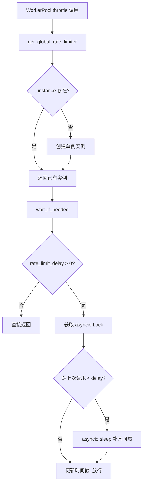
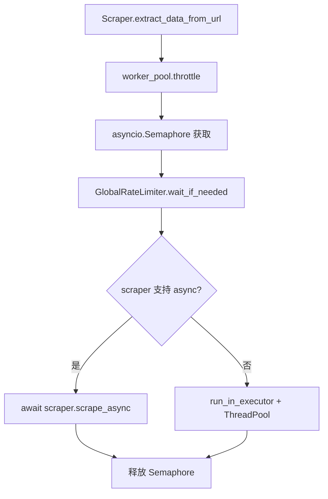

# PD-313.01 GPT-Researcher — 三层速率限制与 Semaphore 并发控制

> 文档编号：PD-313.01
> 来源：GPT-Researcher `gpt_researcher/utils/rate_limiter.py`, `gpt_researcher/utils/workers.py`, `gpt_researcher/skills/deep_research.py`
> GitHub：https://github.com/assafelovic/gpt-researcher.git
> 问题域：PD-313 速率限制与并发控制 Rate Limiting & Concurrency Control
> 状态：可复用方案

---

## 第 1 章 问题与动机

### 1.1 核心问题

Agent 系统在执行研究任务时，需要同时对外发起大量 HTTP 请求（网页抓取）和 LLM API 调用。如果不加控制：

- **网页抓取层**：多个 GPTResearcher 实例并行运行（如 Deep Research 模式），每个实例都有自己的 WorkerPool，若各自独立限流，总请求速率仍可能超出 API 限制（如 Firecrawl 免费版 10 req/min）
- **递归研究层**：Deep Research 的递归展开会指数级产生子研究任务，不限制并发数会导致内存爆炸和 API 配额耗尽
- **LLM API 层**：OpenRouter 等聚合 API 有严格的 RPS 限制，超限会返回 429 错误导致研究中断

这三层限流需求各自独立但又相互关联，需要一个分层的速率限制架构。

### 1.2 GPT-Researcher 的解法概述

GPT-Researcher 实现了三层独立的速率限制机制，各层解决不同粒度的问题：

1. **全局爬虫限流**（`GlobalRateLimiter`）：单例模式，跨所有 WorkerPool 实例共享，确保全局请求间隔不低于配置值（`rate_limiter.py:13-92`）
2. **WorkerPool 并发控制**（`Semaphore + ThreadPoolExecutor`）：每个 WorkerPool 用 asyncio.Semaphore 限制并发数，用 ThreadPoolExecutor 执行同步爬虫（`workers.py:8-50`）
3. **递归研究并发限制**（`asyncio.Semaphore`）：DeepResearchSkill 在每层递归中创建局部 Semaphore，限制同时运行的子研究任务数（`deep_research.py:230`）
4. **LLM API 限流**（`InMemoryRateLimiter`）：OpenRouter 集成使用 LangChain 内置的令牌桶限流器，按 RPS 控制 LLM 调用频率（`base.py:213-228`）

### 1.3 设计思想

| 设计原则 | 具体实现 | 理由 | 替代方案 |
|----------|----------|------|----------|
| 全局单例限流 | `GlobalRateLimiter` 用 `__new__` 实现单例 | 多 WorkerPool 实例必须共享同一限流状态，否则总速率失控 | Redis 分布式限流（多进程场景） |
| 分层关注点分离 | 爬虫限流、并发控制、LLM 限流各自独立 | 不同资源有不同的限流需求和配置参数 | 统一限流器（灵活性差） |
| 配置驱动 | 所有限流参数通过环境变量/配置文件注入 | 不同 API 提供商限制不同，需要灵活调整 | 硬编码（不可维护） |
| asyncio 原生 | 使用 `asyncio.Lock` 和 `asyncio.Semaphore` | 与项目的 async/await 架构一致，无额外依赖 | threading.Lock（不适合异步） |
| 宽松默认值 | `SCRAPER_RATE_LIMIT_DELAY=0.0`，`DEEP_RESEARCH_CONCURRENCY=4` | 默认不限流，用户按需开启，降低入门门槛 | 严格默认值（影响性能） |

---

## 第 2 章 源码实现分析

### 2.1 架构概览

GPT-Researcher 的速率限制架构分为三个独立层次，各层通过不同机制控制不同资源的访问频率：

```
┌─────────────────────────────────────────────────────────────────┐
│                    GPTResearcher 实例 × N                        │
│                                                                  │
│  ┌──────────────────────┐    ┌──────────────────────────────┐   │
│  │   BrowserManager     │    │   DeepResearchSkill          │   │
│  │                      │    │                              │   │
│  │  ┌────────────────┐  │    │  asyncio.Semaphore           │   │
│  │  │  WorkerPool    │  │    │  (concurrency_limit=4)       │   │
│  │  │                │  │    │                              │   │
│  │  │ Semaphore(15)  │  │    │  ┌─ SubResearcher ─┐        │   │
│  │  │ ThreadPool(15) │  │    │  │  BrowserManager  │        │   │
│  │  │       │        │  │    │  │  WorkerPool ─────┼────┐   │   │
│  │  │       ▼        │  │    │  └──────────────────┘    │   │   │
│  │  │ GlobalRate     │  │    └──────────────────────────┼───┘   │
│  │  │ Limiter ◄──────┼──┼──────────────────────────────┘       │
│  │  │ (singleton)    │  │                                       │
│  │  └────────────────┘  │    ┌──────────────────────────────┐   │
│  └──────────────────────┘    │   LLM Provider (OpenRouter)  │   │
│                              │   InMemoryRateLimiter(1 RPS) │   │
│                              └──────────────────────────────┘   │
└─────────────────────────────────────────────────────────────────┘
```

### 2.2 核心实现

#### 2.2.1 GlobalRateLimiter 单例模式



对应源码 `gpt_researcher/utils/rate_limiter.py:13-79`：

```python
class GlobalRateLimiter:
    """
    Singleton global rate limiter.
    Ensures minimum delay between ANY scraper requests across the entire application,
    regardless of how many WorkerPools or GPTResearcher instances are active.
    """
    _instance: ClassVar['GlobalRateLimiter'] = None
    _lock: ClassVar[asyncio.Lock] = None

    def __new__(cls):
        if cls._instance is None:
            cls._instance = super().__new__(cls)
            cls._instance._initialized = False
        return cls._instance

    def __init__(self):
        if self._initialized:
            return
        self.last_request_time = 0.0
        self.rate_limit_delay = 0.0
        self._initialized = True

    async def wait_if_needed(self):
        if self.rate_limit_delay <= 0:
            return
        lock = self.get_lock()
        async with lock:
            current_time = time.time()
            time_since_last = current_time - self.last_request_time
            if time_since_last < self.rate_limit_delay:
                sleep_time = self.rate_limit_delay - time_since_last
                await asyncio.sleep(sleep_time)
            self.last_request_time = time.time()
```

关键设计点：
- `__new__` + `_initialized` 标志实现线程安全单例（`rate_limiter.py:24-28`）
- `asyncio.Lock` 延迟创建，确保在异步上下文中初始化（`rate_limiter.py:44-49`）
- `wait_if_needed` 用时间差计算精确 sleep 时长，不浪费等待时间（`rate_limiter.py:60-79`）
- 模块级预创建实例 `_global_rate_limiter = GlobalRateLimiter()`（`rate_limiter.py:87`）

#### 2.2.2 WorkerPool 双层控制



对应源码 `gpt_researcher/utils/workers.py:8-50`：

```python
class WorkerPool:
    def __init__(self, max_workers: int, rate_limit_delay: float = 0.0):
        self.max_workers = max_workers
        self.rate_limit_delay = rate_limit_delay
        self.executor = ThreadPoolExecutor(max_workers=max_workers)
        self.semaphore = asyncio.Semaphore(max_workers)
        # Configure the global rate limiter
        global_limiter = get_global_rate_limiter()
        global_limiter.configure(rate_limit_delay)

    @asynccontextmanager
    async def throttle(self):
        async with self.semaphore:
            global_limiter = get_global_rate_limiter()
            await global_limiter.wait_if_needed()
            yield
```

调用方 `gpt_researcher/scraper/scraper.py:100-118`：

```python
async def extract_data_from_url(self, link, session):
    async with self.worker_pool.throttle():
        Scraper = self.get_scraper(link)
        scraper = Scraper(link, session)
        if hasattr(scraper, "scrape_async"):
            content, image_urls, title = await scraper.scrape_async()
        else:
            content, image_urls, title = await asyncio.get_running_loop().run_in_executor(
                self.worker_pool.executor, scraper.scrape
            )
```

关键设计点：
- Semaphore 控制"同时有多少个请求在飞"（并发度），GlobalRateLimiter 控制"请求之间间隔多久"（速率）
- `@asynccontextmanager` 让 `throttle()` 可以用 `async with` 语法，自动释放信号量
- ThreadPoolExecutor 用于包装同步爬虫库（如 BeautifulSoup），避免阻塞事件循环

### 2.3 实现细节

#### 配置注入链

所有限流参数通过统一的配置系统注入：

```
环境变量 / config.json
    ↓ Config._set_attributes()
config.py:62-75 → setattr(self, key.lower(), value)
    ↓
BrowserManager.__init__() → WorkerPool(cfg.max_scraper_workers, cfg.scraper_rate_limit_delay)
    ↓                                    ↓
workers.py:32-33 → GlobalRateLimiter.configure(rate_limit_delay)
```

配置默认值定义在 `config/variables/default.py:25-38`：

| 配置项 | 默认值 | 说明 |
|--------|--------|------|
| `MAX_SCRAPER_WORKERS` | 15 | WorkerPool 最大并发数 |
| `SCRAPER_RATE_LIMIT_DELAY` | 0.0 | 全局请求间隔（秒），0=不限 |
| `DEEP_RESEARCH_CONCURRENCY` | 4 | 递归研究并发子任务数 |

#### DeepResearchSkill 递归并发控制

`deep_research.py:230` 在每次 `deep_research()` 调用中创建局部 Semaphore：

```python
semaphore = asyncio.Semaphore(self.concurrency_limit)  # default: 4

async def process_query(serp_query):
    async with semaphore:
        researcher = GPTResearcher(query=serp_query['query'], ...)
        context = await researcher.conduct_research()
        ...

tasks = [process_query(query) for query in serp_queries]
results = await asyncio.gather(*tasks)
```

递归展开时 breadth 逐层减半（`deep_research.py:312`）：`new_breadth = max(2, breadth // 2)`，自然收敛并发量。

#### OpenRouter InMemoryRateLimiter

`llm_provider/generic/base.py:210-228` 使用 LangChain 内置令牌桶：

```python
rps = float(os.environ.get("OPENROUTER_LIMIT_RPS", 1.0))
rate_limiter = InMemoryRateLimiter(
    requests_per_second=rps,
    check_every_n_seconds=0.1,
    max_bucket_size=10,
)
llm = ChatOpenAI(
    openai_api_base='https://openrouter.ai/api/v1',
    rate_limiter=rate_limiter,
    ...
)
```

`max_bucket_size=10` 允许短时间突发 10 个请求，之后按 RPS 匀速消耗。


---

## 第 3 章 迁移指南

### 3.1 迁移清单

**阶段 1：全局速率限制器（1 个文件）**

- [ ] 创建 `utils/rate_limiter.py`，实现 `GlobalRateLimiter` 单例
- [ ] 添加 `configure(delay)` 和 `wait_if_needed()` 方法
- [ ] 确保 `asyncio.Lock` 延迟初始化（避免在非异步上下文创建）

**阶段 2：WorkerPool 并发控制（1 个文件）**

- [ ] 创建 `utils/worker_pool.py`，组合 `Semaphore + ThreadPoolExecutor`
- [ ] 实现 `throttle()` 异步上下文管理器，串联 Semaphore 和 GlobalRateLimiter
- [ ] 在初始化时调用 `GlobalRateLimiter.configure()` 注入延迟参数

**阶段 3：配置集成**

- [ ] 在配置系统中添加 `MAX_WORKERS`、`RATE_LIMIT_DELAY`、`CONCURRENCY_LIMIT` 参数
- [ ] 支持环境变量覆盖

**阶段 4：LLM API 限流（可选）**

- [ ] 如果使用 LangChain，直接用 `InMemoryRateLimiter` 传入 LLM 构造函数
- [ ] 如果不用 LangChain，自行实现令牌桶算法

### 3.2 适配代码模板

#### 通用三层限流器（可直接复用）

```python
"""三层速率限制器 — 从 GPT-Researcher 提炼的可复用模板"""
import asyncio
import time
from concurrent.futures import ThreadPoolExecutor
from contextlib import asynccontextmanager
from typing import ClassVar, Optional


class GlobalRateLimiter:
    """全局单例速率限制器，跨所有 WorkerPool 共享。"""
    _instance: ClassVar[Optional['GlobalRateLimiter']] = None
    _lock: ClassVar[Optional[asyncio.Lock]] = None

    def __new__(cls):
        if cls._instance is None:
            cls._instance = super().__new__(cls)
            cls._instance._initialized = False
        return cls._instance

    def __init__(self):
        if self._initialized:
            return
        self.last_request_time = 0.0
        self.rate_limit_delay = 0.0
        self._initialized = True

    @classmethod
    def get_lock(cls) -> asyncio.Lock:
        if cls._lock is None:
            cls._lock = asyncio.Lock()
        return cls._lock

    def configure(self, delay: float):
        self.rate_limit_delay = max(self.rate_limit_delay, delay)

    async def wait_if_needed(self):
        if self.rate_limit_delay <= 0:
            return
        async with self.get_lock():
            elapsed = time.time() - self.last_request_time
            if elapsed < self.rate_limit_delay:
                await asyncio.sleep(self.rate_limit_delay - elapsed)
            self.last_request_time = time.time()

    def reset(self):
        self.last_request_time = 0.0
        self.rate_limit_delay = 0.0


_global_limiter = GlobalRateLimiter()


class WorkerPool:
    """并发控制池：Semaphore 限并发 + GlobalRateLimiter 限速率。"""

    def __init__(self, max_workers: int = 10, rate_limit_delay: float = 0.0):
        self.semaphore = asyncio.Semaphore(max_workers)
        self.executor = ThreadPoolExecutor(max_workers=max_workers)
        _global_limiter.configure(rate_limit_delay)

    @asynccontextmanager
    async def throttle(self):
        async with self.semaphore:
            await _global_limiter.wait_if_needed()
            yield

    def shutdown(self):
        self.executor.shutdown(wait=False)


class ConcurrencyLimiter:
    """递归任务并发限制器（如 Deep Research 场景）。"""

    def __init__(self, max_concurrent: int = 4):
        self.semaphore = asyncio.Semaphore(max_concurrent)

    async def run_limited(self, coros):
        async def _wrap(coro):
            async with self.semaphore:
                return await coro
        return await asyncio.gather(*[_wrap(c) for c in coros])
```

### 3.3 适用场景

| 场景 | 适用度 | 说明 |
|------|--------|------|
| 多实例并行爬虫 | ⭐⭐⭐ | GlobalRateLimiter 单例确保跨实例全局限流 |
| 递归/树状研究任务 | ⭐⭐⭐ | Semaphore 限制每层并发，breadth 逐层减半自然收敛 |
| LLM API 聚合调用 | ⭐⭐⭐ | InMemoryRateLimiter 令牌桶适合 RPS 限制场景 |
| 多进程部署 | ⭐ | 单例仅在单进程内有效，多进程需 Redis 等分布式方案 |
| 突发流量场景 | ⭐⭐ | 令牌桶的 max_bucket_size 支持短时突发 |

---

## 第 4 章 测试用例

```python
"""基于 GPT-Researcher 真实接口的测试用例"""
import asyncio
import time
import pytest


class TestGlobalRateLimiter:
    """测试全局速率限制器"""

    def setup_method(self):
        from gpt_researcher.utils.rate_limiter import GlobalRateLimiter
        limiter = GlobalRateLimiter()
        limiter.reset()
        GlobalRateLimiter._lock = None  # 重置 lock 确保测试隔离

    @pytest.mark.asyncio
    async def test_no_limit_when_delay_zero(self):
        """delay=0 时不应有任何等待"""
        from gpt_researcher.utils.rate_limiter import get_global_rate_limiter
        limiter = get_global_rate_limiter()
        limiter.configure(0.0)
        start = time.time()
        for _ in range(10):
            await limiter.wait_if_needed()
        elapsed = time.time() - start
        assert elapsed < 0.1, "delay=0 时不应有等待"

    @pytest.mark.asyncio
    async def test_enforces_minimum_delay(self):
        """应强制执行最小请求间隔"""
        from gpt_researcher.utils.rate_limiter import get_global_rate_limiter
        limiter = get_global_rate_limiter()
        limiter.configure(0.2)
        times = []
        for _ in range(3):
            await limiter.wait_if_needed()
            times.append(time.time())
        for i in range(1, len(times)):
            gap = times[i] - times[i - 1]
            assert gap >= 0.18, f"请求间隔 {gap:.3f}s 小于配置的 0.2s"

    @pytest.mark.asyncio
    async def test_singleton_shared_across_pools(self):
        """多个 WorkerPool 应共享同一个 GlobalRateLimiter"""
        from gpt_researcher.utils.workers import WorkerPool
        from gpt_researcher.utils.rate_limiter import get_global_rate_limiter
        pool1 = WorkerPool(max_workers=5, rate_limit_delay=0.5)
        pool2 = WorkerPool(max_workers=5, rate_limit_delay=0.5)
        limiter = get_global_rate_limiter()
        assert limiter.rate_limit_delay == 0.5
        # 两个 pool 的 throttle 应共享同一限流器
        times = []
        async with pool1.throttle():
            times.append(time.time())
        async with pool2.throttle():
            times.append(time.time())
        # 第二次应等待至少 0.5s
        assert times[1] - times[0] >= 0.45


class TestWorkerPoolConcurrency:
    """测试 WorkerPool 并发控制"""

    @pytest.mark.asyncio
    async def test_semaphore_limits_concurrency(self):
        """Semaphore 应限制同时执行的任务数"""
        from gpt_researcher.utils.workers import WorkerPool
        from gpt_researcher.utils.rate_limiter import GlobalRateLimiter
        GlobalRateLimiter().reset()
        GlobalRateLimiter._lock = None

        pool = WorkerPool(max_workers=2, rate_limit_delay=0.0)
        active = 0
        max_active = 0

        async def task():
            nonlocal active, max_active
            async with pool.throttle():
                active += 1
                max_active = max(max_active, active)
                await asyncio.sleep(0.1)
                active -= 1

        await asyncio.gather(*[task() for _ in range(6)])
        assert max_active <= 2, f"最大并发 {max_active} 超过限制 2"


class TestDeepResearchConcurrency:
    """测试递归研究并发限制"""

    @pytest.mark.asyncio
    async def test_concurrency_limit_respected(self):
        """asyncio.Semaphore 应限制递归研究并发数"""
        concurrency_limit = 2
        semaphore = asyncio.Semaphore(concurrency_limit)
        active = 0
        max_active = 0

        async def mock_research(query: str):
            nonlocal active, max_active
            async with semaphore:
                active += 1
                max_active = max(max_active, active)
                await asyncio.sleep(0.05)
                active -= 1
                return {"learnings": [], "context": query}

        queries = [f"query_{i}" for i in range(8)]
        await asyncio.gather(*[mock_research(q) for q in queries])
        assert max_active <= concurrency_limit
```


---

## 第 5 章 跨域关联

| 关联域 | 关系类型 | 说明 |
|--------|----------|------|
| PD-02 多 Agent 编排 | 协同 | DeepResearchSkill 的递归并发控制直接服务于多 Agent 编排，Semaphore 限制子研究者实例数 |
| PD-03 容错与重试 | 协同 | 速率限制是容错的前置防线——限流减少 429 错误，降低重试压力 |
| PD-01 上下文管理 | 依赖 | `trim_context_to_word_limit` 在并发收集结果后裁剪上下文，防止并发产出超限 |
| PD-11 可观测性 | 协同 | DeepResearchSkill 记录 `research_costs` 和执行时间，限流参数影响成本追踪 |
| PD-08 搜索与检索 | 依赖 | WorkerPool 的限流直接作用于搜索/爬虫请求，是检索层的流量控制器 |

---

## 第 6 章 来源文件索引

| 文件 | 行范围 | 关键实现 |
|------|--------|----------|
| `gpt_researcher/utils/rate_limiter.py` | L13-L92 | GlobalRateLimiter 单例，asyncio.Lock 保护的全局限流 |
| `gpt_researcher/utils/workers.py` | L8-L50 | WorkerPool：Semaphore + ThreadPoolExecutor + GlobalRateLimiter |
| `gpt_researcher/skills/deep_research.py` | L55, L230 | concurrency_limit 配置读取，asyncio.Semaphore 递归并发控制 |
| `gpt_researcher/skills/deep_research.py` | L290-L293 | asyncio.gather 并行执行受限任务 |
| `gpt_researcher/skills/deep_research.py` | L311-L312 | breadth 逐层减半：`new_breadth = max(2, breadth // 2)` |
| `gpt_researcher/llm_provider/generic/base.py` | L210-L228 | OpenRouter InMemoryRateLimiter 令牌桶限流 |
| `gpt_researcher/skills/browser.py` | L32-L35 | BrowserManager 创建 WorkerPool 并注入配置参数 |
| `gpt_researcher/scraper/scraper.py` | L100-L118 | throttle() 上下文管理器实际调用点 |
| `gpt_researcher/config/variables/default.py` | L25-L38 | MAX_SCRAPER_WORKERS=15, RATE_LIMIT_DELAY=0.0, CONCURRENCY=4 |
| `gpt_researcher/config/variables/base.py` | L28-L37 | TypedDict 类型定义 |

---

## 第 7 章 横向对比维度

```json comparison_data
{
  "project": "GPT-Researcher",
  "dimensions": {
    "限流架构": "三层分离：全局爬虫限流 + WorkerPool并发 + LLM API令牌桶",
    "全局协调": "GlobalRateLimiter单例，__new__实现，跨所有WorkerPool共享",
    "并发模型": "asyncio.Semaphore + ThreadPoolExecutor双层，async/sync混合",
    "配置方式": "环境变量+配置文件注入，默认不限流(delay=0)",
    "递归控制": "breadth逐层减半自然收敛，局部Semaphore限制每层并发",
    "令牌桶": "OpenRouter用LangChain InMemoryRateLimiter，max_bucket_size=10突发"
  }
}
```

### 域元数据补充

```json domain_metadata
{
  "solution_summary": "GPT-Researcher用GlobalRateLimiter单例+WorkerPool双层Semaphore+InMemoryRateLimiter令牌桶实现三层独立速率限制",
  "description": "分层限流架构：爬虫全局限速、任务并发控制、LLM API令牌桶各自独立",
  "sub_problems": [
    "递归任务指数展开的并发收敛策略",
    "同步爬虫库在异步架构中的线程池桥接",
    "asyncio.Lock延迟初始化与事件循环绑定"
  ],
  "best_practices": [
    "breadth逐层减半自然收敛递归并发量",
    "asynccontextmanager封装throttle实现自动释放",
    "InMemoryRateLimiter令牌桶支持突发后匀速消耗"
  ]
}
```

