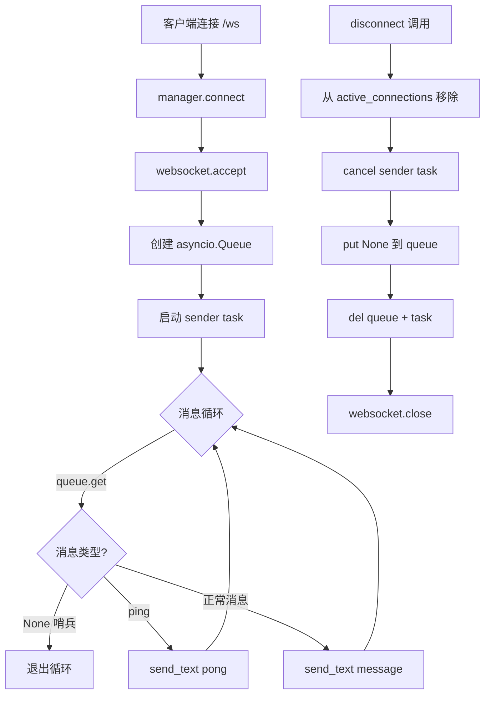
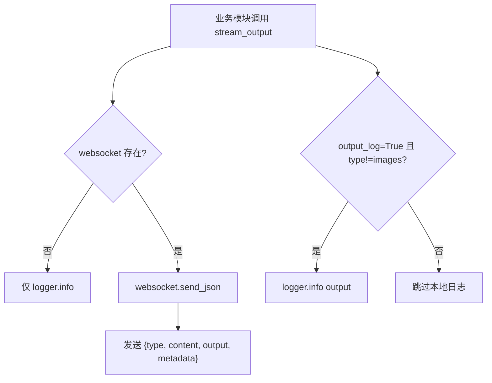
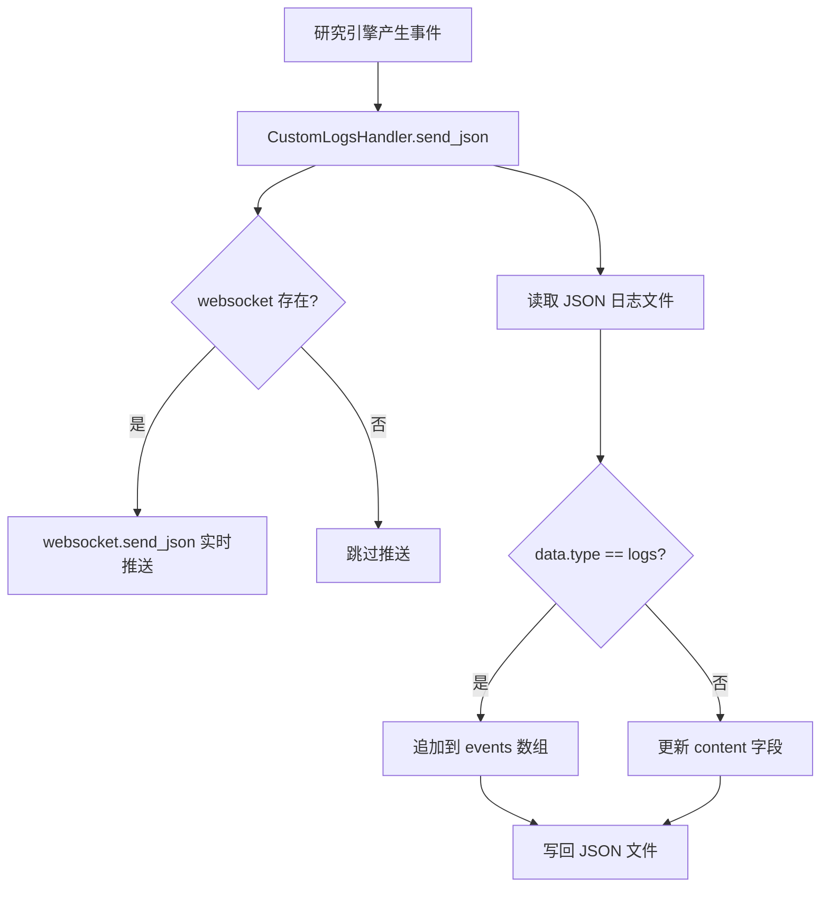

# PD-314.01 GPT-Researcher — WebSocket 队列化实时通信与多事件流式推送

> 文档编号：PD-314.01
> 来源：GPT-Researcher `backend/server/websocket_manager.py`, `gpt_researcher/actions/utils.py`, `backend/server/server_utils.py`
> GitHub：https://github.com/assafelovic/gpt-researcher.git
> 问题域：PD-314 WebSocket实时通信 WebSocket Real-time Streaming
> 状态：可复用方案

---

## 第 1 章 问题与动机（≥ 30 行）

### 1.1 核心问题

AI 研究型 Agent 的执行周期通常在数十秒到数分钟之间，用户在等待期间需要实时感知进度——当前在做什么子查询、搜索了哪些源、MCP 工具执行到第几步、花了多少钱。如果只在最终返回结果，用户体验极差且无法判断系统是否卡死。

核心挑战：
1. **消息生产速度不均匀**：研究过程中某些阶段（如并行子查询）会瞬间产生大量日志，而其他阶段（如 LLM 推理）则长时间无输出
2. **多事件类型混杂**：进度日志、子查询状态、图片、成本追踪、文件路径、聊天回复等不同类型的数据都需要通过同一个 WebSocket 连接传输
3. **连接不稳定**：浏览器标签页切换、网络波动都可能导致 WebSocket 断开，需要优雅处理
4. **并发任务互斥**：同一连接上不能同时运行两个研究任务，需要任务级别的互斥控制

### 1.2 GPT-Researcher 的解法概述

GPT-Researcher 采用三层架构解决 WebSocket 实时通信问题：

1. **WebSocketManager 连接池**：管理所有活跃连接，每个连接配备独立的 `asyncio.Queue` 和 sender task，实现消息的异步队列化发送（`websocket_manager.py:18-26`）
2. **CustomLogsHandler 日志代理**：封装 WebSocket 发送逻辑，同时将事件持久化到 JSON 文件，实现双写（`server_utils.py:31-77`）
3. **stream_output 统一出口**：所有业务模块（researcher、writer、curator 等 6 个 skill 模块共 73 处调用）通过同一个函数推送事件，标准化消息格式为 `{type, content, output, metadata}`（`actions/utils.py:7-32`）

### 1.3 设计思想

| 设计原则 | 具体实现 | 理由 | 替代方案 |
|----------|----------|------|----------|
| 队列解耦 | 每个 WebSocket 连接配一个 `asyncio.Queue`，sender task 循环消费 | 生产者（研究逻辑）不阻塞在网络 I/O 上，即使客户端接收慢也不影响研究进度 | 直接 await send（会阻塞研究流程） |
| 统一出口 | 全局 `stream_output()` 函数作为唯一推送入口 | 73 处调用点统一格式，新增事件类型只需改一处 | 各模块自行调用 websocket.send_json（格式不一致） |
| 双写持久化 | CustomLogsHandler 同时推 WebSocket + 写 JSON 文件 | 断线后可从文件恢复完整研究日志 | 仅推 WebSocket（断线丢数据） |
| 任务互斥 | `handle_websocket_communication` 中检查 `running_task.done()` | 防止同一连接并发执行多个研究任务导致状态混乱 | 无限制并发（资源竞争） |
| 优雅关闭 | disconnect 时 cancel sender task + put None 哨兵 + close websocket | 三步清理确保无资源泄漏 | 直接 close（sender task 可能悬挂） |

---

## 第 2 章 源码实现分析（≥ 60 行，核心章节）

### 2.1 架构概览

```
┌─────────────────────────────────────────────────────────────┐
│                      FastAPI Server                          │
│                                                              │
│  ┌──────────────┐    ┌───────────────────┐                  │
│  │ /ws endpoint │───→│ WebSocketManager  │                  │
│  │ (app.py:348) │    │  ┌─────────────┐  │                  │
│  └──────────────┘    │  │ connections │  │                  │
│                      │  │ queues{}    │  │                  │
│                      │  │ senders{}   │  │                  │
│                      │  └─────────────┘  │                  │
│                      └────────┬──────────┘                  │
│                               │                              │
│  ┌────────────────────────────▼──────────────────────────┐  │
│  │         handle_websocket_communication                 │  │
│  │  ┌─────────┐  ┌──────────────┐  ┌──────────────────┐ │  │
│  │  │ "start" │  │"human_feed.."│  │     "chat"       │ │  │
│  │  └────┬────┘  └──────┬───────┘  └────────┬─────────┘ │  │
│  │       │              │                    │           │  │
│  │       ▼              ▼                    ▼           │  │
│  │  handle_start   handle_human      handle_chat        │  │
│  │  _command()     _feedback()       _command()         │  │
│  └───────┬───────────────────────────────────────────────┘  │
│          │                                                   │
│          ▼                                                   │
│  ┌───────────────────┐     ┌──────────────────────┐         │
│  │ CustomLogsHandler │────→│  stream_output()     │         │
│  │  .send_json()     │     │  (actions/utils.py)  │         │
│  │  + JSON file      │     │  73 call sites       │         │
│  └───────────────────┘     └──────────────────────┘         │
│                                                              │
│  消息格式: {type, content, output, metadata}                 │
│  事件类型: logs|images|cost|path|chat|error                  │
└─────────────────────────────────────────────────────────────┘
```

### 2.2 核心实现

#### 2.2.1 WebSocketManager — 队列化连接管理



对应源码 `backend/server/websocket_manager.py:18-96`：

```python
class WebSocketManager:
    """Manage websockets"""

    def __init__(self):
        self.active_connections: List[WebSocket] = []
        self.sender_tasks: Dict[WebSocket, asyncio.Task] = {}
        self.message_queues: Dict[WebSocket, asyncio.Queue] = {}

    async def start_sender(self, websocket: WebSocket):
        """Start the sender task."""
        queue = self.message_queues.get(websocket)
        if not queue:
            return
        while True:
            try:
                message = await queue.get()
                if message is None:  # Shutdown signal
                    break
                if websocket in self.active_connections:
                    if message == "ping":
                        await websocket.send_text("pong")
                    else:
                        await websocket.send_text(message)
                else:
                    break
            except Exception as e:
                print(f"Error in sender task: {e}")
                break

    async def connect(self, websocket: WebSocket):
        await websocket.accept()
        self.active_connections.append(websocket)
        self.message_queues[websocket] = asyncio.Queue()
        self.sender_tasks[websocket] = asyncio.create_task(
            self.start_sender(websocket))

    async def disconnect(self, websocket: WebSocket):
        if websocket in self.active_connections:
            self.active_connections.remove(websocket)
            if websocket in self.sender_tasks:
                try:
                    self.sender_tasks[websocket].cancel()
                    await self.message_queues[websocket].put(None)
                except Exception as e:
                    logger.error(f"Error canceling sender task: {e}")
                finally:
                    if websocket in self.sender_tasks:
                        del self.sender_tasks[websocket]
            if websocket in self.message_queues:
                del self.message_queues[websocket]
            try:
                await websocket.close()
            except Exception as e:
                logger.info(f"WebSocket already closed: {e}")
```

#### 2.2.2 stream_output — 统一事件推送出口



对应源码 `gpt_researcher/actions/utils.py:7-32`：

```python
async def stream_output(
    type, content, output, websocket=None, output_log=True, metadata=None
):
    if (not websocket or output_log) and type != "images":
        try:
            logger.info(f"{output}")
        except UnicodeEncodeError:
            logger.error(output.encode('cp1252', errors='replace').decode('cp1252'))

    if websocket:
        await websocket.send_json(
            {"type": type, "content": content,
                "output": output, "metadata": metadata}
        )
```

#### 2.2.3 CustomLogsHandler — 双写日志代理



对应源码 `backend/server/server_utils.py:31-77`：

```python
class CustomLogsHandler:
    """Custom handler to capture streaming logs from the research process"""
    def __init__(self, websocket, task: str):
        self.logs = []
        self.websocket = websocket
        sanitized_filename = sanitize_filename(f"task_{int(time.time())}_{task}")
        self.log_file = os.path.join("outputs", f"{sanitized_filename}.json")
        # Initialize log file with metadata
        os.makedirs("outputs", exist_ok=True)
        with open(self.log_file, 'w') as f:
            json.dump({
                "timestamp": self.timestamp,
                "events": [],
                "content": {"query": "", "sources": [], "context": [], "report": "", "costs": 0.0}
            }, f, indent=2)

    async def send_json(self, data: Dict[str, Any]) -> None:
        if self.websocket:
            await self.websocket.send_json(data)
        with open(self.log_file, 'r') as f:
            log_data = json.load(f)
        if data.get('type') == 'logs':
            log_data['events'].append({"timestamp": datetime.now().isoformat(), "type": "event", "data": data})
        else:
            log_data['content'].update(data)
        with open(self.log_file, 'w') as f:
            json.dump(log_data, f, indent=2)
```

### 2.3 实现细节

**消息协议格式**：所有 WebSocket 消息遵循统一 JSON 结构：

```json
{
  "type": "logs|images|cost|path|chat|error",
  "content": "事件子类型标识符",
  "output": "人类可读的输出内容",
  "metadata": { "可选的结构化附加数据" }
}
```

**事件类型矩阵**（从 73 处 `stream_output` 调用中提取）：

| type | content 示例 | 用途 | 调用模块 |
|------|-------------|------|----------|
| `logs` | `planning_research`, `subqueries`, `researching` | 研究进度日志 | researcher.py |
| `logs` | `mcp_retriever`, `mcp_results_cached` | MCP 工具执行状态 | researcher.py, streaming.py |
| `images` | `selected_images` | 研究过程中发现的图片 | writer.py |
| `cost` | — | Token 用量和费用追踪 | utils.py:134 |
| `path` | — | 生成文件路径（PDF/DOCX/MD） | server_utils.py:260 |
| `chat` | — | 聊天回复 | server_utils.py:226 |
| `error` | `error` | 错误信息 | server_utils.py:381 |

**任务互斥机制**（`server_utils.py:323-392`）：

`handle_websocket_communication` 维护一个 `running_task` 变量。收到新请求时先检查 `running_task.done()`，如果任务仍在运行则返回 warning 消息拒绝新请求。同时支持 `ping/pong` 心跳保活，不受任务互斥影响。

**safe_send_json 防御性发送**（`actions/utils.py:35-58`）：

```python
async def safe_send_json(websocket: Any, data: Dict[str, Any]) -> None:
    try:
        await websocket.send_json(data)
    except Exception as e:
        if "closed" in error_msg.lower() or "connection" in error_msg.lower():
            logger.warning("WebSocket connection appears to be closed.")
        elif "timeout" in error_msg.lower():
            logger.warning("WebSocket send operation timed out.")
```

对连接关闭和超时两种常见异常做了分类日志，不会因为客户端断开而导致服务端研究流程崩溃。

**MCPStreamer 同步/异步双模式**（`mcp/streaming.py:49-63`）：

MCP 工具执行可能在同步上下文中触发，`stream_log_sync` 通过检测当前事件循环状态，在有运行中 loop 时用 `create_task` 异步发送，否则用 `run_until_complete` 同步发送，确保 MCP 回调中也能正常推送日志。

---

## 第 3 章 迁移指南（≥ 40 行）

### 3.1 迁移清单

**阶段 1：基础 WebSocket 管理器**
- [ ] 实现 WebSocketManager 类，包含 `connect`/`disconnect`/`start_sender` 三个核心方法
- [ ] 为每个连接创建独立的 `asyncio.Queue` 和 sender task
- [ ] 实现 None 哨兵关闭机制和三步清理流程

**阶段 2：统一事件推送**
- [ ] 定义消息协议 `{type, content, output, metadata}`
- [ ] 实现 `stream_output` 全局函数作为唯一推送入口
- [ ] 实现 `safe_send_json` 防御性发送包装

**阶段 3：日志持久化**
- [ ] 实现 CustomLogsHandler 双写机制（WebSocket + JSON 文件）
- [ ] 按事件类型分流存储（logs → events 数组，其他 → content 字段）

**阶段 4：命令路由与任务互斥**
- [ ] 实现基于文本前缀的命令路由（start/chat/human_feedback/ping）
- [ ] 实现 running_task 单任务互斥控制
- [ ] 实现 `run_long_running_task` 安全包装（异常捕获 + CancelledError 传播）

### 3.2 适配代码模板

```python
import asyncio
import json
import logging
from typing import Dict, List, Any, Optional
from fastapi import WebSocket

logger = logging.getLogger(__name__)


class RealtimeStreamManager:
    """可复用的 WebSocket 实时流管理器，移植自 GPT-Researcher 模式。"""

    def __init__(self):
        self.active_connections: List[WebSocket] = []
        self.sender_tasks: Dict[WebSocket, asyncio.Task] = {}
        self.message_queues: Dict[WebSocket, asyncio.Queue] = {}

    async def connect(self, websocket: WebSocket):
        await websocket.accept()
        self.active_connections.append(websocket)
        self.message_queues[websocket] = asyncio.Queue()
        self.sender_tasks[websocket] = asyncio.create_task(
            self._sender_loop(websocket)
        )

    async def disconnect(self, websocket: WebSocket):
        if websocket not in self.active_connections:
            return
        self.active_connections.remove(websocket)
        # 三步清理：cancel task → 哨兵信号 → 删除资源
        if websocket in self.sender_tasks:
            self.sender_tasks[websocket].cancel()
            try:
                await self.message_queues[websocket].put(None)
            except Exception:
                pass
            del self.sender_tasks[websocket]
        if websocket in self.message_queues:
            del self.message_queues[websocket]
        try:
            await websocket.close()
        except Exception:
            pass

    async def _sender_loop(self, websocket: WebSocket):
        queue = self.message_queues.get(websocket)
        if not queue:
            return
        while True:
            message = await queue.get()
            if message is None:
                break
            if websocket not in self.active_connections:
                break
            try:
                await websocket.send_text(
                    message if isinstance(message, str) else json.dumps(message)
                )
            except Exception as e:
                logger.error(f"Send error: {e}")
                break

    async def broadcast_event(
        self, type: str, content: str, output: str,
        metadata: Optional[Dict] = None
    ):
        """统一事件推送，所有业务模块通过此方法发送消息。"""
        payload = json.dumps({
            "type": type, "content": content,
            "output": output, "metadata": metadata
        })
        for ws in list(self.active_connections):
            queue = self.message_queues.get(ws)
            if queue:
                await queue.put(payload)


async def safe_send_json(websocket: Any, data: Dict[str, Any]) -> None:
    """防御性 JSON 发送，连接关闭时不抛异常。"""
    try:
        await websocket.send_json(data)
    except Exception as e:
        error_msg = str(e).lower()
        if "closed" in error_msg or "connection" in error_msg:
            logger.warning("WebSocket closed, skipping send")
        elif "timeout" in error_msg:
            logger.warning("WebSocket send timeout")
        else:
            logger.error(f"WebSocket send error: {e}")
```

### 3.3 适用场景

| 场景 | 适用度 | 说明 |
|------|--------|------|
| AI Agent 长时间研究任务 | ⭐⭐⭐ | 核心场景，研究进度实时反馈 |
| 多步骤工作流进度追踪 | ⭐⭐⭐ | 子查询、工具调用等多阶段进度 |
| 实时成本追踪仪表盘 | ⭐⭐⭐ | cost 事件类型直接可用 |
| 多用户并发研究 | ⭐⭐ | 每连接独立队列天然支持，但无房间/频道概念 |
| 需要消息持久化的场景 | ⭐⭐ | CustomLogsHandler 双写模式可复用 |
| 高吞吐量消息推送 | ⭐ | JSON 文件读写是瓶颈，高频场景需换 Redis/内存 |

---

## 第 4 章 测试用例（≥ 20 行）

```python
import asyncio
import json
import pytest
from unittest.mock import AsyncMock, MagicMock, patch


class TestWebSocketManager:
    """测试 WebSocketManager 连接生命周期和队列化发送。"""

    @pytest.fixture
    def manager(self):
        from backend.server.websocket_manager import WebSocketManager
        return WebSocketManager()

    @pytest.fixture
    def mock_websocket(self):
        ws = AsyncMock()
        ws.accept = AsyncMock()
        ws.send_text = AsyncMock()
        ws.send_json = AsyncMock()
        ws.close = AsyncMock()
        return ws

    @pytest.mark.asyncio
    async def test_connect_creates_queue_and_sender(self, manager, mock_websocket):
        """连接时应创建独立的 Queue 和 sender task。"""
        await manager.connect(mock_websocket)
        assert mock_websocket in manager.active_connections
        assert mock_websocket in manager.message_queues
        assert mock_websocket in manager.sender_tasks
        assert isinstance(manager.message_queues[mock_websocket], asyncio.Queue)
        mock_websocket.accept.assert_awaited_once()

    @pytest.mark.asyncio
    async def test_disconnect_cleanup(self, manager, mock_websocket):
        """断开时应清理所有资源：connections、queues、sender_tasks。"""
        await manager.connect(mock_websocket)
        await manager.disconnect(mock_websocket)
        assert mock_websocket not in manager.active_connections
        assert mock_websocket not in manager.message_queues
        assert mock_websocket not in manager.sender_tasks

    @pytest.mark.asyncio
    async def test_disconnect_idempotent(self, manager, mock_websocket):
        """重复断开不应抛异常。"""
        await manager.connect(mock_websocket)
        await manager.disconnect(mock_websocket)
        await manager.disconnect(mock_websocket)  # 第二次不应报错


class TestStreamOutput:
    """测试 stream_output 统一推送函数。"""

    @pytest.mark.asyncio
    async def test_sends_json_when_websocket_present(self):
        from gpt_researcher.actions.utils import stream_output
        ws = AsyncMock()
        await stream_output("logs", "test_event", "hello", websocket=ws)
        ws.send_json.assert_awaited_once_with({
            "type": "logs", "content": "test_event",
            "output": "hello", "metadata": None
        })

    @pytest.mark.asyncio
    async def test_no_error_when_websocket_none(self):
        from gpt_researcher.actions.utils import stream_output
        # 不应抛异常
        await stream_output("logs", "test", "output", websocket=None)

    @pytest.mark.asyncio
    async def test_metadata_passed_through(self):
        from gpt_researcher.actions.utils import stream_output
        ws = AsyncMock()
        meta = {"progress": 50}
        await stream_output("logs", "progress", "50%", websocket=ws, metadata=meta)
        ws.send_json.assert_awaited_once_with({
            "type": "logs", "content": "progress",
            "output": "50%", "metadata": {"progress": 50}
        })


class TestSafeSendJson:
    """测试防御性发送。"""

    @pytest.mark.asyncio
    async def test_handles_closed_connection(self):
        from gpt_researcher.actions.utils import safe_send_json
        ws = AsyncMock()
        ws.send_json.side_effect = Exception("WebSocket connection closed")
        # 不应抛异常
        await safe_send_json(ws, {"type": "test"})

    @pytest.mark.asyncio
    async def test_handles_timeout(self):
        from gpt_researcher.actions.utils import safe_send_json
        ws = AsyncMock()
        ws.send_json.side_effect = Exception("Send timeout exceeded")
        await safe_send_json(ws, {"type": "test"})
```

---

## 第 5 章 跨域关联

| 关联域 | 关系类型 | 说明 |
|--------|----------|------|
| PD-11 可观测性 | 协同 | `stream_output` 的 73 处调用本质上构成了可观测性的数据采集层，cost 事件类型直接服务于成本追踪 |
| PD-01 上下文管理 | 协同 | 研究进度的实时推送让用户能感知上下文窗口的使用情况（如 `research_step_finalized` 事件包含 costs） |
| PD-02 多 Agent 编排 | 依赖 | 多 Agent 模式（`multi_agents` report_type）的子任务进度需要通过 WebSocket 实时推送给前端 |
| PD-03 容错与重试 | 协同 | `safe_send_json` 和 `run_long_running_task` 的异常捕获机制是容错设计的一部分，MCP 执行失败时通过 WebSocket 推送 warning 而非中断 |
| PD-08 搜索与检索 | 依赖 | 搜索过程中的子查询状态、MCP 工具执行进度、结果数量等都通过 WebSocket 实时推送 |
| PD-09 Human-in-the-Loop | 协同 | `human_feedback` 命令通过同一 WebSocket 连接接收用户反馈，复用了消息路由机制 |

---

## 第 6 章 来源文件索引

| 文件 | 行范围 | 关键实现 |
|------|--------|----------|
| `backend/server/websocket_manager.py` | L18-L96 | WebSocketManager 类：连接池、Queue、sender task、三步清理 |
| `backend/server/websocket_manager.py` | L98-L110 | start_streaming：启动研究流式输出 |
| `backend/server/websocket_manager.py` | L112-L183 | run_agent：CustomLogsHandler 注入、MCP 配置、报告类型路由 |
| `backend/server/server_utils.py` | L31-L77 | CustomLogsHandler：双写日志代理（WebSocket + JSON 文件） |
| `backend/server/server_utils.py` | L124-L174 | handle_start_command：解析 start 命令、创建 logs handler |
| `backend/server/server_utils.py` | L323-L392 | handle_websocket_communication：命令路由、任务互斥、ping/pong |
| `gpt_researcher/actions/utils.py` | L7-L32 | stream_output：统一事件推送出口 |
| `gpt_researcher/actions/utils.py` | L35-L58 | safe_send_json：防御性发送包装 |
| `gpt_researcher/actions/utils.py` | L113-L162 | update_cost / create_cost_callback：成本事件推送 |
| `gpt_researcher/mcp/streaming.py` | L13-L101 | MCPStreamer：MCP 专用流式输出，含同步/异步双模式 |
| `gpt_researcher/skills/researcher.py` | L55-L70 | ResearchConductor 中 stream_output 调用示例（plan_research） |
| `backend/server/app.py` | L348-L360 | WebSocket 端点定义和 disconnect 处理 |

---

## 第 7 章 横向对比维度

> **重要：** 本章用于自动填充 Butcher Wiki 的横向对比表。

```json comparison_data
{
  "project": "GPT-Researcher",
  "dimensions": {
    "连接管理": "WebSocketManager 连接池 + 每连接独立 asyncio.Queue + sender task",
    "消息协议": "统一 JSON 格式 {type, content, output, metadata}，6 种事件类型",
    "推送架构": "stream_output 全局函数作唯一出口，73 处调用点统一格式",
    "持久化策略": "CustomLogsHandler 双写：实时推 WebSocket + 追加写 JSON 文件",
    "并发控制": "单连接单任务互斥，running_task.done() 检查拒绝并发请求",
    "容错机制": "safe_send_json 分类异常处理 + MCPStreamer 同步/异步双模式降级"
  }
}
```

### 域元数据补充

```json domain_metadata
{
  "solution_summary": "GPT-Researcher 用 WebSocketManager 每连接独立 asyncio.Queue + sender task 队列化发送，stream_output 统一 73 处调用点，CustomLogsHandler 双写 WebSocket+JSON 实现 6 类事件实时推送",
  "description": "WebSocket 实时通信中统一推送出口与日志双写持久化的工程实践",
  "sub_problems": [
    "同步上下文中的异步 WebSocket 推送适配",
    "单连接任务互斥与并发请求拒绝"
  ],
  "best_practices": [
    "stream_output 全局函数作为唯一推送入口确保 73 处调用格式一致",
    "safe_send_json 对连接关闭和超时做分类日志而非抛异常",
    "sender task + None 哨兵实现优雅关闭三步清理"
  ]
}
```
